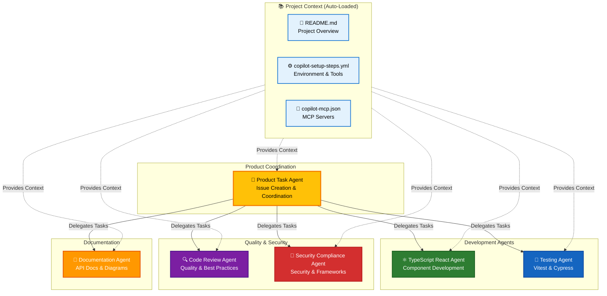
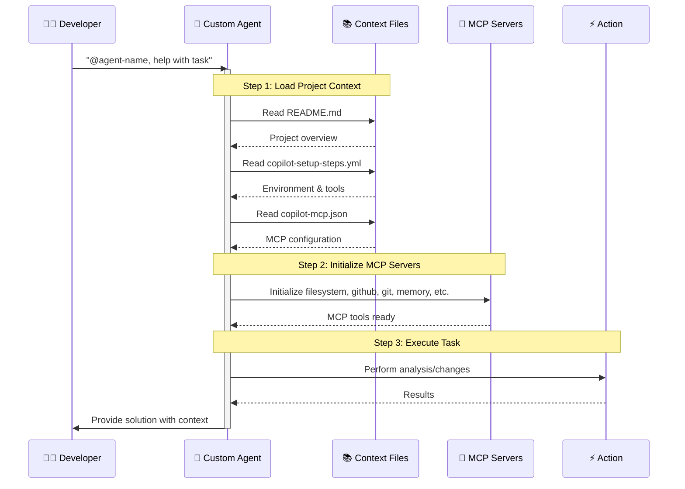
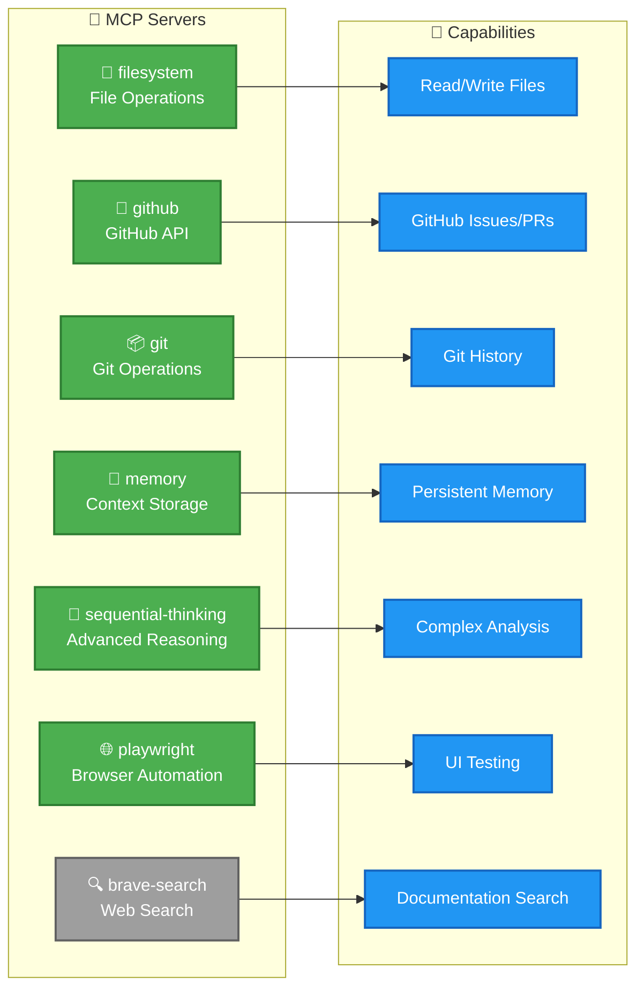
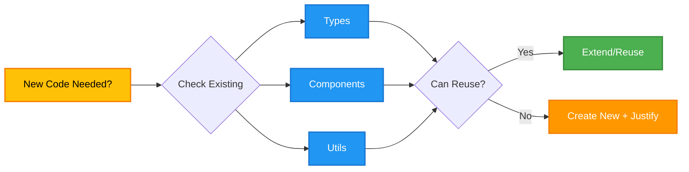
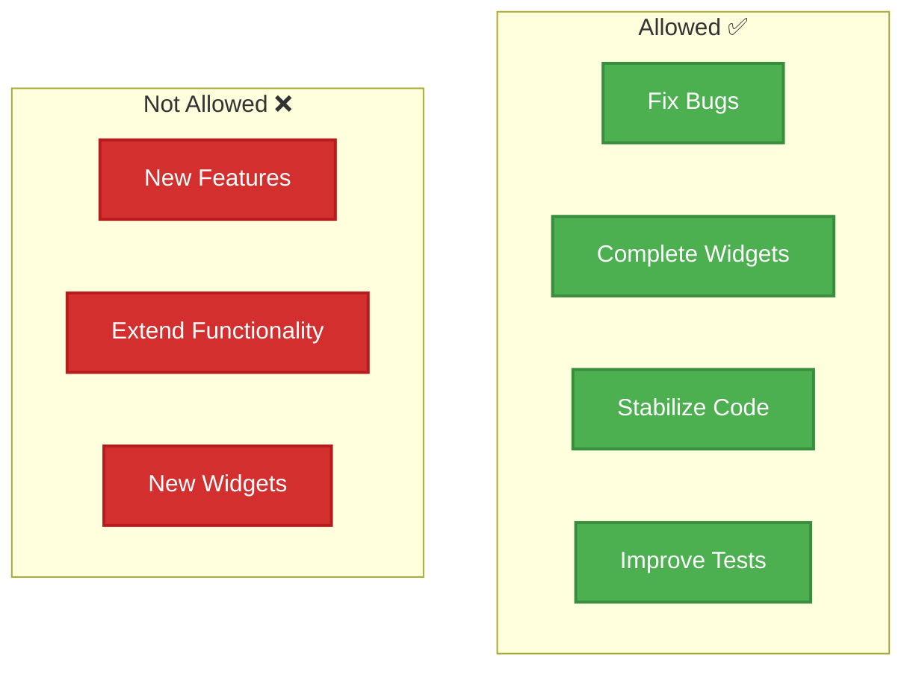
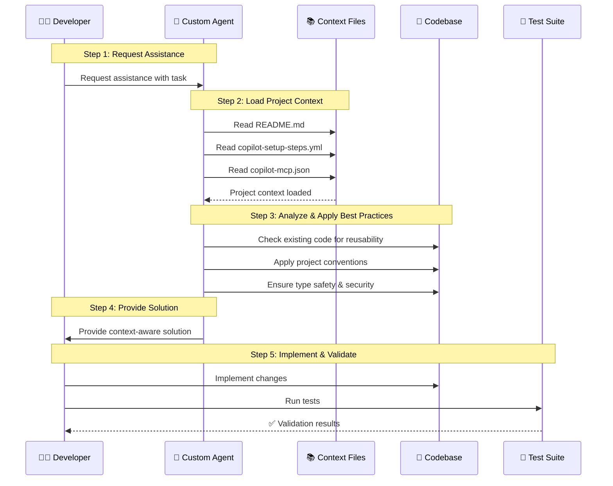

# 🤖 GitHub Copilot Custom Agents

This directory contains specialized agent configurations for the **CIA Compliance Manager** project. Each agent is an expert in a specific domain, providing targeted assistance and following project-specific best practices.

## 🎯 Agent Context & Setup

All agents in this project are configured to **automatically read** key context files to understand the project environment:

1. **📖 README.md** - Main project context, features, architecture, and overview
2. **⚙️ .github/workflows/copilot-setup-steps.yml** - Environment setup steps, Node.js version (24), available tools, build/test commands, and GitHub Actions permissions
3. **🔧 .github/copilot-mcp.json** - MCP server configuration including:
   - **filesystem** - Secure filesystem access for reading/editing project files
   - **github** - GitHub repository data, issues, PRs, and workflows
   - **git** - Git operations and repository history
   - **memory** - Conversation history and context persistence
   - **sequential-thinking** - Advanced reasoning capabilities
   - **playwright** - Browser automation for testing and debugging
   - **brave-search** - Web search (optional, requires API key)

These context files ensure agents have a consistent understanding of the development environment, tools, and project structure.

## 📋 Available Agents

### Agent Architecture Overview



### Agent Initialization Flow



### 🎯 Product Task Agent
**File:** `product-task-agent.md`

Expert product coordinator for creating GitHub issues, assigning tasks to agents, and ensuring quality across all dimensions.

**🎯 Core Expertise:**
- Comprehensive product analysis (code quality, UX, ISMS)
- GitHub issue creation and task coordination
- Multi-dimensional quality assessment
- Agent assignment and workflow coordination
- ISMS compliance alignment

**💡 Use Cases:**
- Conducting product audits and creating improvement backlogs
- Analyzing UI/UX and creating accessibility issues
- Coordinating cross-functional quality improvements
- Security and ISMS compliance assessments
- Creating structured GitHub issues with agent assignments

**🛠️ Special Tools:**
- GitHub issue management (create, list, update, comment)
- Playwright for UI/UX testing (navigate, screenshot, click)
- Code analysis and quality metrics
- ISMS policy mapping

---

### ⚛️ TypeScript React Agent
**File:** `typescript-react-agent.md`

Expert in TypeScript and React development for building secure, type-safe components.

**🎯 Core Expertise:**
- TypeScript strict typing and best practices
- React 19.x functional components and hooks
- State management patterns
- Code reusability enforcement
- Type-safe props and interfaces

**💡 Use Cases:**
- Creating new React components
- Defining TypeScript types and interfaces
- Implementing state management
- Refactoring component code
- Type-safe API integrations

---

### 🧪 Testing Agent
**File:** `testing-agent.md`

Expert in comprehensive testing strategies using Vitest and Cypress.

**🎯 Core Expertise:**
- Vitest unit and integration testing
- Cypress end-to-end testing
- React Testing Library patterns
- Test coverage analysis
- Mock creation and test utilities

**💡 Use Cases:**
- Writing unit tests for components
- Creating integration tests
- Building E2E test scenarios
- Improving test coverage
- Debugging failing tests

---

### 🔍 Code Review Agent
**File:** `code-review-agent.md`

Expert in code quality, maintainability, and best practices enforcement.

**🎯 Core Expertise:**
- Code quality analysis
- Security vulnerability detection
- Code reusability assessment
- Performance optimization
- Accessibility (a11y) compliance

**💡 Use Cases:**
- Reviewing pull requests
- Identifying code smells
- Security audits
- Performance bottleneck detection
- Ensuring code reusability

---

### 📝 Documentation Agent
**File:** `documentation-agent.md`

Expert in technical documentation, API docs, and architecture visualization.

**🎯 Core Expertise:**
- JSDoc and TypeDoc documentation
- Markdown documentation
- Mermaid diagrams (flowcharts, C4, sequence)
- API reference documentation
- Architecture documentation

**💡 Use Cases:**
- Writing component documentation
- Creating architecture diagrams
- Documenting APIs and utilities
- Updating README files
- Generating visual workflows

---

### 🔐 Security & Compliance Agent
**File:** `security-compliance-agent.md`

Expert in security best practices and compliance framework mapping.

**🎯 Core Expertise:**
- CIA triad (Confidentiality, Integrity, Availability)
- Compliance frameworks (NIST CSF, ISO 27001, GDPR, HIPAA, SOC2)
- Security vulnerability prevention
- Secure coding practices
- Threat modeling and risk assessment

**💡 Use Cases:**
- Implementing security controls
- Mapping to compliance frameworks
- Security code reviews
- Threat modeling
- Risk assessment and mitigation

---

## 🔧 MCP Server Configuration

All agents have access to the following Model Context Protocol (MCP) servers, configured in `.github/copilot-mcp.json`:

### Available MCP Servers



| MCP Server | Purpose | Status | Environment Variables |
|------------|---------|--------|----------------------|
| **filesystem** | Secure filesystem access for reading/editing project files | ✅ Enabled | Workspace: `/workspaces/cia-compliance-manager` |
| **github** | Access to GitHub repository data, issues, PRs, workflows | ✅ Enabled | `GITHUB_TOKEN`, `GITHUB_PERSONAL_ACCESS_TOKEN`, `GITHUB_OWNER=Hack23`, `GITHUB_REPO=cia-compliance-manager` |
| **git** | Git operations and repository history context | ✅ Enabled | Repository: `/workspaces/cia-compliance-manager` |
| **memory** | Maintains conversation history and context between sessions | ✅ Enabled | - |
| **sequential-thinking** | Advanced reasoning for complex problem-solving | ✅ Enabled | - |
| **playwright** | Browser automation for testing and debugging web applications | ✅ Enabled | - |
| **brave-search** | Web search for React, TypeScript, PixiJS, and Vite documentation | ⚠️ Optional | `BRAVE_API_KEY` (required to enable) |

### Environment Configuration

The development environment is configured in `.github/workflows/copilot-setup-steps.yml`:

- **Node.js Version**: 24
- **Package Manager**: npm
- **TypeScript**: Latest (via npx tsc)
- **Working Directory**: `/workspaces/cia-compliance-manager`
- **Build Output**: `dist/` directory
- **Permissions**: Contents (read), Actions (read), Issues (write), PRs (write), Security events (read), and more

---

## 🚀 How to Use Agents

For comprehensive guidance on using custom agents effectively, see the **[Agent Usage Guide](AGENT_GUIDE.md)**.

### Quick Start

#### Explicit Agent Selection
Reference agents directly in your prompts:

```
"@typescript-react-agent, help me create a new dashboard component"
"@testing-agent, write unit tests for the SecurityMetrics component"
"@security-compliance-agent, review this code for security vulnerabilities"
"@product-task-agent, conduct a product audit and create improvement issues"
```

#### Implicit Selection
GitHub Copilot may automatically select the appropriate agent based on:
- Current file type and context
- Task description in your prompt
- Project structure and patterns

**Pro Tip:** Use `@product-task-agent` for complex tasks requiring coordination across multiple quality dimensions (code, UX, security, ISMS).

## 📊 Agent Selection Guide

Use this matrix to choose the right agent for your task:

| Task Type | Agent | Icon |
|-----------|-------|------|
| **Product Analysis & Issue Creation** | Product Task Agent | 🎯 |
| **Component Development** | TypeScript React Agent | ⚛️ |
| **Writing Tests** | Testing Agent | 🧪 |
| **Code Review** | Code Review Agent | 🔍 |
| **Documentation** | Documentation Agent | 📝 |
| **Security & Compliance** | Security Compliance Agent | 🔐 |

**Quick Examples:**
- Product audit & issue creation → **🎯 Product Task Agent**
- Building a new widget → **⚛️ TypeScript React Agent**
- Adding Vitest tests → **🧪 Testing Agent**
- PR review → **🔍 Code Review Agent**
- Creating Mermaid diagrams → **📝 Documentation Agent**
- NIST CSF mapping → **🔐 Security Compliance Agent**
- UI/UX assessment → **🎯 Product Task Agent** (coordinates with ⚛️ & 🧪)

## ⚙️ Agent Configuration

### Configuration Format

Each agent is a Markdown file with YAML frontmatter:

```yaml
---
name: agent-name
description: Brief description of agent's expertise (max 200 characters)
tools: []  # Optional - omit to allow all available tools
---
```

### Available Tools

GitHub Copilot custom agents can use these tools:

**Core Tools:**
- `view` - Read file contents
- `edit` - Modify file contents  
- `create` - Create new files
- `bash` - Execute shell commands
- `search_code` - Search codebase
- `custom-agent` - Invoke other custom agents

**Playwright Tools** (for UI testing and interaction):
- `playwright-browser_snapshot` - Capture browser state
- `playwright-browser_take_screenshot` - Take screenshots
- `playwright-browser_navigate` - Navigate to URLs
- `playwright-browser_click` - Click elements

**Best Practice:** Omit the `tools` property to give agents access to all available tools unless you need to restrict access for specific reasons.

---

## 🏗️ Project Guidelines

All agents follow these core principles:

### ✨ Code Reusability (MANDATORY)


**Key Reusable Locations:**
- 📁 **Types**: `src/types/*.ts` - All type definitions
- 📁 **Constants**: `src/constants/*.ts` - Shared constants
- 📁 **Utils**: `src/utils/*.ts` - Utility functions
- 📁 **Components**: `src/components/common/*` - Shared components
- 📁 **Services**: `src/services/*.ts` - Business logic services

### 🎯 Release Priority (v1.0 Focus)



### 📏 Quality Standards

- ✅ Strict TypeScript typing (no `any`)
- ✅ 80% minimum test coverage
- ✅ Security-first approach
- ✅ Accessibility (WCAG 2.1 AA) compliance

---

## 🔧 Development Workflow

### Standard Development Flow



### Agent Collaboration Flow

```mermaid
graph TB
    Start([👨‍💻 Developer Task]):::start
    
    Task[🎯 Product Task Agent<br/>Analyzes & Coordinates]:::task
    
    Dev[⚛️ TypeScript React Agent<br/>Implements Code]:::dev
    Test[🧪 Testing Agent<br/>Writes Tests]:::test
    Review[🔍 Code Review Agent<br/>Reviews Quality]:::review
    Sec[🔐 Security Compliance Agent<br/>Checks Security]:::security
    Doc[📝 Documentation Agent<br/>Updates Docs]:::docs
    
    End([✅ Complete Solution]):::end
    
    Start --> Task
    
    Task -->|"Code Changes"| Dev
    Task -->|"Test Coverage"| Test
    Task -->|"Quality Check"| Review
    Task -->|"Security Check"| Sec
    Task -->|"Documentation"| Doc
    
    Dev --> Review
    Test --> Review
    
    Review -->|"✅ Approved"| Sec
    Sec -->|"✅ Secure"| Doc
    Doc -->|"✅ Documented"| End
    
    Review -->|"❌ Issues"| Dev
    Sec -->|"❌ Vulnerabilities"| Dev
    
    classDef start fill:#E8F5E9,stroke:#4CAF50,stroke-width:3px,color:#000
    classDef end fill:#E8F5E9,stroke:#4CAF50,stroke-width:3px,color:#000
    classDef task fill:#FFC107,stroke:#F57C00,stroke-width:3px,color:#000
    classDef dev fill:#2E7D32,stroke:#1B5E20,stroke-width:2px,color:#fff
    classDef test fill:#1565C0,stroke:#0D47A1,stroke-width:2px,color:#fff
    classDef review fill:#7B1FA2,stroke:#4A148C,stroke-width:2px,color:#fff
    classDef security fill:#D32F2F,stroke:#B71C1C,stroke-width:2px,color:#fff
    classDef docs fill:#FF9800,stroke:#E65100,stroke-width:2px,color:#fff
```

---

## 📚 Contributing to Agents

### Creating a New Agent

1. **Create agent file**: `.github/agents/my-agent.md`
2. **Add YAML frontmatter**:
   ```yaml
   ---
   name: my-agent
   description: Expert in specific domain (under 200 chars)
   ---
   ```
3. **Write agent instructions** in Markdown below frontmatter
4. **Validate configuration**: `npm run validate:agents`
5. **Test the agent** with real-world prompts
6. **Update README.md** to document the new agent

### Validation

```bash
# Validate all agents
npm run validate:agents

# Or manually validate a single agent
cd .github/agents
sed -n '/^---$/,/^---$/p' my-agent.md | sed '1d;$d' | npx js-yaml -t
```

**Validation Checklist:**
- ✅ Valid YAML frontmatter syntax
- ✅ `name` property (lowercase with hyphens)
- ✅ `description` under 200 characters
- ✅ Clear, actionable instructions
- ✅ Project-specific guidelines included
- ✅ Examples and use cases documented

---

## 🔗 Related Resources

| Resource | Description | Link |
|----------|-------------|------|
| 📘 **Agent Usage Guide** | Comprehensive guide to using custom agents | [AGENT_GUIDE.md](AGENT_GUIDE.md) |
| 📖 **Main README** | Project overview, features, and getting started | [README.md](../../README.md) |
| ⚙️ **Setup Steps** | Environment setup and available tools | [.github/workflows/copilot-setup-steps.yml](../workflows/copilot-setup-steps.yml) |
| 🔧 **MCP Configuration** | MCP server configuration details | [.github/copilot-mcp.json](../copilot-mcp.json) |
| 🌐 **GitHub Docs** | Official Copilot agent documentation | [View Docs](https://docs.github.com/en/copilot/concepts/agents/coding-agent/about-custom-agents) |
| 📖 **Copilot Instructions** | Global project guidelines | [.github/copilot-instructions.md](../copilot-instructions.md) |
| 🤝 **Contributing** | General contribution guide | [CONTRIBUTING.md](../../CONTRIBUTING.md) |
| 🧪 **Test Plans** | Unit & E2E testing guidelines | [docs/UnitTestPlan.md](../../docs/UnitTestPlan.md), [docs/E2ETestPlan.md](../../docs/E2ETestPlan.md) |
| 🏗️ **Architecture** | System architecture docs | [docs/architecture/](../../docs/architecture/) |
| 🔐 **ISMS Guide** | Security implementation guide | [ISMS_IMPLEMENTATION_GUIDE.md](../../ISMS_IMPLEMENTATION_GUIDE.md) |

---

## ❓ Troubleshooting

### Common Issues

**❌ "Invalid YAML syntax"**
- Use 2 spaces for indentation (no tabs)
- Array syntax: `["item1", "item2"]`
- Check quotes are properly closed

**❌ "Agent not being used"**
- Verify `.md` file extension
- Check frontmatter between `---` markers
- Ensure `name` matches filename
- Description should be clear and specific

**❌ "Tool not available"**
- Remove `tools` property to allow all tools
- Verify tool name spelling
- Check GitHub Copilot version supports the tool

**❌ "Agent gives unexpected responses"**
- Review agent instructions for clarity
- Check if task matches agent's expertise
- Consider using different specialized agent
- Verify project-specific guidelines are followed

### Getting Help

1. 📖 Check [GitHub Copilot documentation](https://docs.github.com/en/copilot/concepts/agents/coding-agent/about-custom-agents)
2. ✅ Run `npm run validate:agents` to check configuration
3. 🔍 Review agent instructions and examples
4. 💬 Ask in project discussions or issues

---

**Made with ❤️ for the CIA Compliance Manager project** | [Report Issues](https://github.com/Hack23/cia-compliance-manager/issues)
