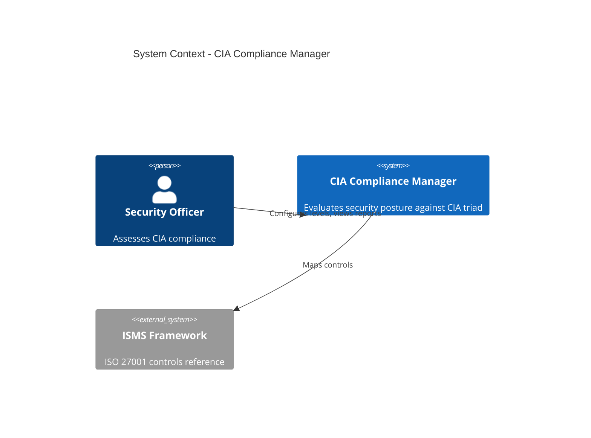
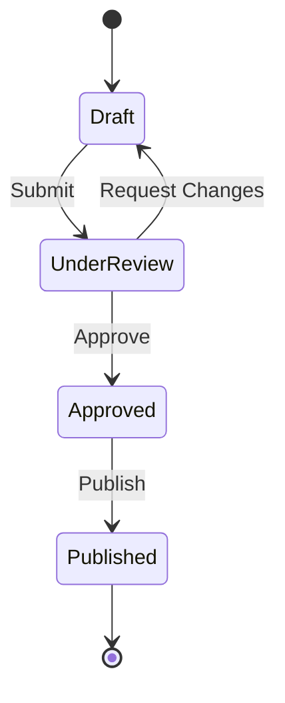

# 🏗️ C4 Architecture Documentation Skill

## Strategic Principle

**Architecture documentation must be living, layered, and security-aware — enabling understanding at every level from business context to code.**

This skill combines C4 modeling, documentation portfolio management, and security architecture documentation into a unified practice aligned with the Hack23 AB ISMS framework and the Secure Development Policy. Every repository MUST maintain a complete documentation portfolio that describes current state, future state, and security posture.

## Core References

- [Hack23 Secure Development Policy (ISMS-PUBLIC)](https://github.com/Hack23/ISMS-PUBLIC)
- [C4 Model by Simon Brown](https://c4model.com/)
- [ISO 27001:2022 — A.8.25 Secure Development Lifecycle](https://www.iso.org/standard/27001)
- [NIST CSF 2.0 — ID.AM (Asset Management)](https://www.nist.gov/cyberframework)
- [CIS Controls v8 — Control 16 (Application Software Security)](https://www.cisecurity.org/controls/)

---

## Core Rules

### 1. Documentation Portfolio (MANDATORY)

**RULE**: Every repository MUST maintain a complete documentation portfolio following the Hack23 Secure Development Policy matrix.

#### Required Documentation Matrix

Each document captures a specific architectural perspective. The current-state document describes the system as-built; the future-state document (`FUTURE_` prefix) describes the target architecture.

| Document | Purpose | MUST/SHOULD | Update Trigger |
|---|---|---|---|
| `ARCHITECTURE.md` | C4 Context + Container diagrams, system overview | **MUST** | Any structural change |
| `FUTURE_ARCHITECTURE.md` | Target architecture, migration roadmap | **MUST** | Strategy or roadmap change |
| `DATA_MODEL.md` | Entity relationships, data flows, storage | **MUST** | Schema or data flow change |
| `FUTURE_DATA_MODEL.md` | Target data model, migration plan | **SHOULD** | Data strategy change |
| `FLOWCHART.md` | Key process flows, decision trees | **MUST** | Workflow or process change |
| `FUTURE_FLOWCHART.md` | Target process flows | **SHOULD** | Process redesign |
| `STATEDIAGRAM.md` | Component lifecycle, state machines | **MUST** | State logic change |
| `FUTURE_STATEDIAGRAM.md` | Target state transitions | **SHOULD** | State model redesign |
| `MINDMAP.md` | Feature taxonomy, domain map | **SHOULD** | Feature scope change |
| `FUTURE_MINDMAP.md` | Target feature landscape | **MAY** | Product roadmap change |
| `SWOT.md` | Strengths, weaknesses, opportunities, threats | **SHOULD** | Quarterly review |
| `FUTURE_SWOT.md` | Target SWOT posture | **MAY** | Strategy change |
| `SECURITY_ARCHITECTURE.md` | Defense-in-depth layers, trust boundaries | **MUST** | Any security change |
| `FUTURE_SECURITY_ARCHITECTURE.md` | Target security posture | **MUST** | Security roadmap change |
| `THREAT_MODEL.md` | STRIDE analysis, attack surfaces, mitigations | **MUST** | New feature or attack surface |

#### File Location

- Place all portfolio documents in the repository **root** (e.g., `docs/ARCHITECTURE.md` or root `ARCHITECTURE.md`).
- Use consistent naming — uppercase with underscores, `.md` extension.

### 2. C4 Model Levels (MANDATORY)

**RULE**: Architecture diagrams MUST follow the C4 model hierarchy. Use Mermaid syntax for all diagrams to keep them version-controlled alongside code.

#### Level 1 — System Context

Shows the system as a box surrounded by its users and external systems.

**MUST include**:
- The system under description (single box)
- All human actors (users, administrators, auditors)
- All external system dependencies (APIs, databases, identity providers)
- Trust boundaries between internal and external
- Data flow direction arrows with labels

**When to create**: Every repository MUST have at least a Level 1 diagram in `ARCHITECTURE.md`.

#### Level 2 — Container

Decomposes the system into deployable containers (web app, API, database, message queue).

**MUST include**:
- All runtime containers (frontend, backend, workers, databases)
- Technology choices per container (React, Node.js, PostgreSQL)
- Communication protocols between containers (HTTPS, gRPC, AMQP)
- Trust boundaries between containers

**When to create**: Required when the system has more than one deployable unit.

#### Level 3 — Component

Decomposes a container into its major components (services, controllers, repositories).

**SHOULD include**:
- Major components within a container
- Responsibilities of each component
- Inter-component dependencies
- Interfaces exposed and consumed

**When to create**: Recommended for containers with complex internal structure.

#### Level 4 — Code (Optional)

Shows how a component is implemented at the code level (classes, interfaces).

**MAY include**:
- Class diagrams
- Interface hierarchies
- Key design patterns used

**When to create**: Only for critical or complex components where code-level documentation aids understanding. Prefer auto-generated diagrams (TypeDoc, dependency graphs) over hand-maintained ones.

### 3. Security Architecture Documentation (MANDATORY)

**RULE**: `SECURITY_ARCHITECTURE.md` MUST document the defense-in-depth layers, trust boundaries, and security controls of the system.

#### Required Sections

```markdown
# Security Architecture

## 1. Trust Boundaries
- External boundary (internet-facing)
- Internal boundary (service-to-service)
- Data boundary (encryption at rest / in transit)

## 2. Defense-in-Depth Layers
- Layer 1: Network (firewalls, WAF, DDoS protection)
- Layer 2: Identity (authentication, authorization, MFA)
- Layer 3: Application (input validation, output encoding, CSRF)
- Layer 4: Data (encryption, tokenization, masking)
- Layer 5: Monitoring (logging, alerting, anomaly detection)

## 3. Authentication & Authorization
- Authentication mechanisms
- Authorization model (RBAC, ABAC, policy-based)
- Session management
- Token lifecycle

## 4. Data Protection
- Classification scheme
- Encryption standards (AES-256, TLS 1.3)
- Key management
- Data retention and disposal

## 5. Security Controls Mapping
- ISO 27001 Annex A controls
- NIST CSF functions
- CIS Controls

## 6. Incident Response
- Detection mechanisms
- Response procedures
- Recovery objectives (RTO, RPO)
```

#### Trust Boundary Diagram

Every security architecture document MUST include a trust boundary diagram showing where trust transitions occur. Use Mermaid `flowchart` or `C4Context` syntax.

### 4. Threat Model Documentation (MANDATORY)

**RULE**: `THREAT_MODEL.md` MUST use STRIDE analysis for every significant attack surface.

#### Required Content

- **System description**: What the system does and its deployment model
- **Data flow diagrams**: How data moves through the system
- **STRIDE per component**: Spoofing, Tampering, Repudiation, Information Disclosure, Denial of Service, Elevation of Privilege
- **Risk ratings**: Likelihood × Impact scoring
- **Mitigations**: Controls in place or planned for each threat
- **Residual risk**: Accepted risks with justification

### 5. Mermaid Diagram Standards (MANDATORY)

**RULE**: All architecture diagrams MUST use Mermaid syntax for version control compatibility.

#### Supported Diagram Types

| Diagram Type | Use For | Mermaid Keyword |
|---|---|---|
| C4 Context | Level 1 overview | `C4Context` |
| C4 Container | Level 2 decomposition | `C4Container` |
| C4 Component | Level 3 internals | `C4Component` |
| Flowchart | Process flows | `flowchart TD` |
| State Diagram | State machines | `stateDiagram-v2` |
| Entity Relationship | Data models | `erDiagram` |
| Mind Map | Feature taxonomy | `mindmap` |
| Sequence | Interactions | `sequenceDiagram` |

#### Example — C4 Context Diagram



#### Example — State Diagram



### 6. Diagram Quality Rules

- ✅ **MUST**: Every diagram has a descriptive `title`
- ✅ **MUST**: Relationships include labels describing the interaction
- ✅ **MUST**: External systems are visually distinguished (`System_Ext`, `_Ext` suffix)
- ✅ **MUST**: Trust boundaries are shown where applicable
- ✅ **SHOULD**: Keep diagrams under 20 elements for readability
- ✅ **SHOULD**: Use consistent naming (PascalCase for system names, camelCase for IDs)
- ✅ **MAY**: Include deployment diagrams for infrastructure-heavy systems

### 7. Compliance Mapping (MANDATORY)

**RULE**: Architecture documentation MUST map to compliance frameworks.

| Framework | Relevant Controls | Documentation Artifact |
|---|---|---|
| **ISO 27001:2022** | A.5.2 (Roles), A.8.25 (Secure Dev), A.8.27 (Architecture) | `ARCHITECTURE.md`, `SECURITY_ARCHITECTURE.md` |
| **NIST CSF 2.0** | ID.AM (Asset Mgmt), PR.DS (Data Security), DE.CM (Monitoring) | `DATA_MODEL.md`, `SECURITY_ARCHITECTURE.md` |
| **CIS Controls v8** | 2 (Software Inventory), 3 (Data Protection), 16 (App Security) | `DATA_MODEL.md`, `THREAT_MODEL.md` |
| **SOC 2 Type II** | CC6 (Logical Access), CC7 (System Operations) | `SECURITY_ARCHITECTURE.md`, `FLOWCHART.md` |

Each `SECURITY_ARCHITECTURE.md` SHOULD include a table mapping implemented controls to framework references.

### 8. Documentation Review Schedule (MANDATORY)

**RULE**: Documentation MUST be reviewed on a regular cadence.

| Document Category | Review Frequency | Reviewer |
|---|---|---|
| `ARCHITECTURE.md` | Every major release or quarterly | Tech Lead + Security |
| `SECURITY_ARCHITECTURE.md` | Quarterly or after security incident | Security Team |
| `THREAT_MODEL.md` | Quarterly or after new attack surface | Security Team |
| `DATA_MODEL.md` | Every schema change | Tech Lead |
| `SWOT.md` | Quarterly | Product + Tech Lead |
| Future-state documents (`FUTURE_*`) | Quarterly | Tech Lead + Product |
| Process diagrams (`FLOWCHART.md`, `STATEDIAGRAM.md`) | Every workflow change | Tech Lead |

**Review checklist**:
- [ ] Diagrams reflect current system state
- [ ] Trust boundaries are accurate
- [ ] External dependencies are up to date
- [ ] Security controls mapping is current
- [ ] Future-state documents align with roadmap

---

## MUST / SHOULD / MAY Summary

### MUST (Block PR if Violated)

- Maintain `ARCHITECTURE.md` with at least a C4 Level 1 diagram
- Maintain `SECURITY_ARCHITECTURE.md` with defense-in-depth layers
- Maintain `THREAT_MODEL.md` with STRIDE analysis
- Maintain `FUTURE_ARCHITECTURE.md` and `FUTURE_SECURITY_ARCHITECTURE.md`
- Use Mermaid syntax for all diagrams
- Label all diagram relationships
- Include trust boundaries in security diagrams
- Map security controls to compliance frameworks
- Update documentation when the system structure changes
- Review documentation on the defined schedule

### SHOULD (Justify if Skipped)

- Maintain `DATA_MODEL.md`, `FLOWCHART.md`, `STATEDIAGRAM.md`
- Maintain future-state variants of data model, flowchart, state diagram
- Maintain `SWOT.md` and `MINDMAP.md`
- Include C4 Level 2 (Container) diagrams
- Keep diagrams under 20 elements
- Include deployment diagrams for production systems
- Document ADRs (Architecture Decision Records) for significant choices
- Use consistent diagram naming conventions

### MAY (Best Practice)

- Include C4 Level 3 (Component) diagrams
- Include C4 Level 4 (Code) diagrams
- Maintain `FUTURE_MINDMAP.md` and `FUTURE_SWOT.md`
- Auto-generate code-level diagrams from source
- Include performance architecture views
- Create animated or interactive diagrams
- Publish architecture documentation as a static site

---

## Quick Decision Guide

```
Need to document a system?
├─ New repository? → Create ARCHITECTURE.md + SECURITY_ARCHITECTURE.md + THREAT_MODEL.md
├─ Adding external dependency? → Update C4 Context diagram + THREAT_MODEL.md
├─ Changing data schema? → Update DATA_MODEL.md + FUTURE_DATA_MODEL.md
├─ Changing authentication? → Update SECURITY_ARCHITECTURE.md
├─ Changing deployment? → Update Container diagram in ARCHITECTURE.md
├─ New feature? → Update MINDMAP.md + FLOWCHART.md + THREAT_MODEL.md
├─ Security incident? → Review SECURITY_ARCHITECTURE.md + THREAT_MODEL.md
├─ Quarterly review? → Review all MUST + SHOULD documents
└─ Planning next version? → Update all FUTURE_* documents
```

```
Which C4 level do I need?
├─ Explaining to stakeholders → Level 1 (Context)
├─ Onboarding developers → Level 2 (Container)
├─ Deep-dive into a service → Level 3 (Component)
└─ Understanding a class → Level 4 (Code) — auto-generate if possible
```

---

## Anti-Patterns

| ❌ Anti-Pattern | ✅ Correct Practice |
|---|---|
| Binary image diagrams (PNG/JPG) checked into repo | Mermaid text diagrams in Markdown |
| Single monolithic architecture doc | Layered C4 levels in separate sections |
| No trust boundaries shown | Explicit trust boundary annotations |
| Documentation only updated at release | Documentation updated with every structural change |
| Security architecture as afterthought | `SECURITY_ARCHITECTURE.md` maintained alongside `ARCHITECTURE.md` |
| No future-state documents | `FUTURE_*` documents maintained for roadmap alignment |
| Threat model created once, never updated | `THREAT_MODEL.md` reviewed quarterly and after new attack surfaces |
| Diagrams without labels or titles | Every diagram titled, every relationship labeled |

---

## Integration with Other Skills

| Skill | Integration Point |
|---|---|
| **Security by Design** | Threat model feeds `THREAT_MODEL.md`; defense-in-depth documented in `SECURITY_ARCHITECTURE.md` |
| **ISMS Compliance** | Compliance mapping table in `SECURITY_ARCHITECTURE.md`; documentation review schedule |
| **Documentation Standards** | JSDoc and API docs complement architecture docs; same Mermaid standards |
| **Code Quality Excellence** | Component diagrams reflect code structure; reuse locations documented |
| **Testing Excellence** | Test architecture documented in `ARCHITECTURE.md`; security test coverage in `THREAT_MODEL.md` |
| **Performance Optimization** | Performance-critical paths documented in `FLOWCHART.md` |

---

## Related Resources

- [C4 Model — Official Site](https://c4model.com/)
- [Mermaid C4 Diagram Syntax](https://mermaid.js.org/syntax/c4.html)
- [Hack23 ISMS-PUBLIC Repository](https://github.com/Hack23/ISMS-PUBLIC)
- [ISO 27001:2022](https://www.iso.org/standard/27001)
- [NIST Cybersecurity Framework 2.0](https://www.nist.gov/cyberframework)
- [CIS Controls v8](https://www.cisecurity.org/controls/)
- [OWASP Threat Modeling](https://owasp.org/www-community/Threat_Modeling)
- [arc42 Documentation Template](https://arc42.org/)
- [Structurizr DSL (C4 tooling)](https://structurizr.com/)

---

**Made with ❤️ for CIA Compliance Manager** | [Hack23 AB](https://www.hack23.com) | C4 Architecture Documentation Skill
