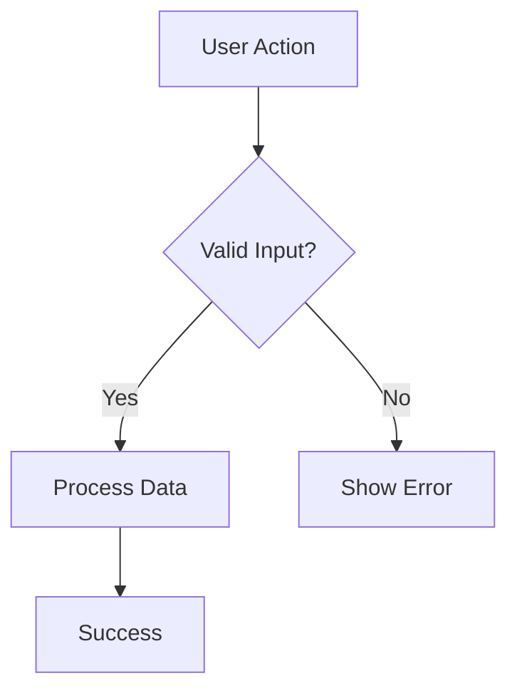
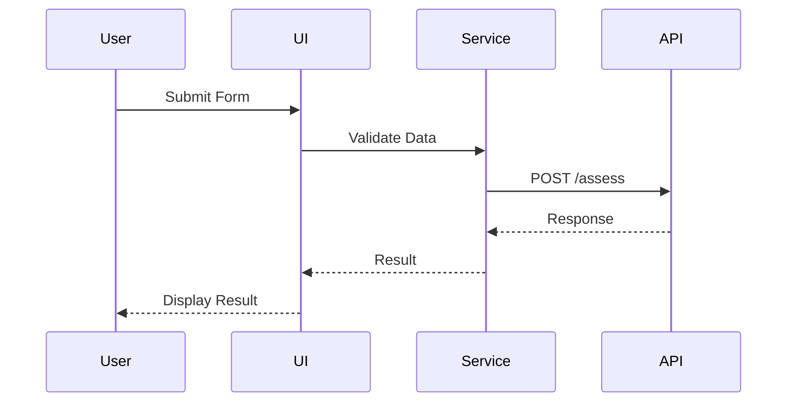
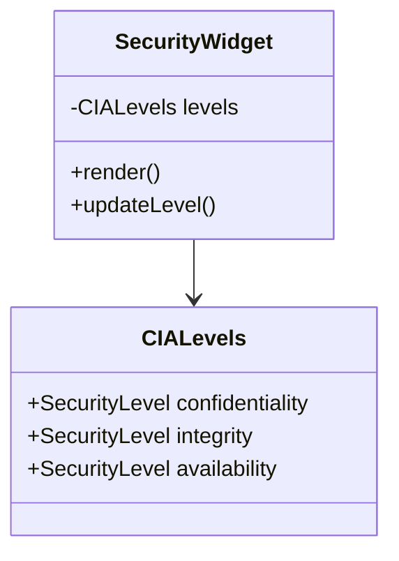
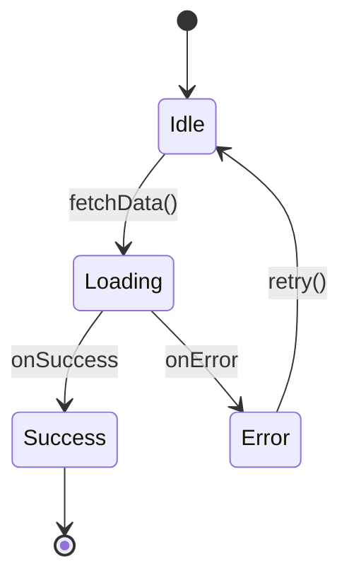

# 📝 Documentation Standards Skill

## Strategic Principle

**Great documentation is as important as great code. Document for clarity, maintainability, and knowledge transfer.**

This skill defines documentation standards for CIA Compliance Manager, ensuring code, APIs, and architecture are well-documented for current and future team members.

## Core Rules

### 1. Code Documentation (MANDATORY)

**RULE**: Document all public APIs with JSDoc comments.

#### JSDoc Format
```typescript
/**
 * Calculates the overall security risk score based on CIA triad levels.
 * 
 * Uses weighted algorithm: Confidentiality (40%), Integrity (35%), Availability (25%)
 * to reflect relative importance in cybersecurity contexts.
 * 
 * @param levels - Security levels for confidentiality, integrity, and availability
 * @returns Risk score between 0 (lowest) and 100 (highest)
 * 
 * @example
 * ```typescript
 * const score = calculateRiskScore({
 *   confidentiality: 'high',
 *   integrity: 'moderate',
 *   availability: 'critical'
 * });
 * // Returns: 82.5
 * ```
 * 
 * @throws {ValidationError} If security levels are invalid
 * @see {@link SecurityLevel} for valid level values
 */
export function calculateRiskScore(
  levels: CIALevels
): number {
  // Implementation
}
```

**JSDoc Tags**:
- `@param` - Parameter description (type inferred from TypeScript)
- `@returns` - Return value description
- `@throws` - Exceptions that may be thrown
- `@example` - Usage examples with code blocks
- `@see` - Links to related functions/types
- `@deprecated` - Mark obsolete code
- `@since` - Version when added
- `@remarks` - Additional notes

**Must-Follow Patterns**:
- ✅ **MUST**: Document all exported functions, classes, and interfaces
- ✅ **MUST**: Include at least one `@example` for complex functions
- ✅ **MUST**: Document parameters and return values
- ✅ **MUST**: List possible exceptions with `@throws`
- ✅ **SHOULD**: Link related types/functions with `@see`
- ✅ **SHOULD**: Explain "why" not just "what"

### 2. Type Documentation (MANDATORY)

**RULE**: Document types, interfaces, and enums with clear descriptions.

```typescript
/**
 * Represents the CIA (Confidentiality, Integrity, Availability) triad
 * security levels for a system or component.
 * 
 * This is the foundational type for security assessments in the application.
 * 
 * @property confidentiality - Protection against unauthorized disclosure
 * @property integrity - Protection against unauthorized modification
 * @property availability - Assurance of reliable access to information
 * 
 * @example
 * ```typescript
 * const assessment: CIALevels = {
 *   confidentiality: 'critical',
 *   integrity: 'high',
 *   availability: 'moderate'
 * };
 * ```
 * 
 * @see {@link SecurityLevel} for valid level values
 * @see {@link calculateRiskScore} to compute overall risk from CIA levels
 */
export interface CIALevels {
  /** Confidentiality protection level */
  confidentiality: SecurityLevel;
  
  /** Integrity protection level */
  integrity: SecurityLevel;
  
  /** Availability protection level */
  availability: SecurityLevel;
}

/**
 * Security classification levels aligned with NIST 800-53 and ISO 27001.
 * 
 * Levels are ordered from highest to lowest risk/impact:
 * - `critical`: Life/death, national security, catastrophic financial loss
 * - `high`: Major business impact, significant data breach, regulatory violations
 * - `moderate`: Moderate business impact, limited data exposure
 * - `low`: Minor impact, limited scope
 * - `public`: Publicly available information, no confidentiality concerns
 * 
 * @see {@link SECURITY_LEVEL_COLORS} for associated color codes
 */
export type SecurityLevel = 
  | 'critical'
  | 'high'
  | 'moderate'
  | 'low'
  | 'public';

/**
 * Configuration options for the security assessment widget.
 * 
 * @property showRiskScore - Display calculated risk score (default: true)
 * @property enableExport - Allow exporting assessment data (default: false)
 * @property readonly - Prevent user modifications (default: false)
 */
export interface SecurityWidgetConfig {
  /** Whether to display the calculated risk score */
  showRiskScore?: boolean;
  
  /** Whether to enable data export functionality */
  enableExport?: boolean;
  
  /** Whether the widget is in read-only mode */
  readonly?: boolean;
}
```

**Must-Follow Patterns**:
- ✅ **MUST**: Document all exported types and interfaces
- ✅ **MUST**: Document enum values with meaning and context
- ✅ **MUST**: Explain each property's purpose
- ✅ **MUST**: Specify valid ranges or patterns for properties
- ✅ **SHOULD**: Provide usage examples
- ✅ **SHOULD**: Link to related types and functions

### 3. Component Documentation (MANDATORY)

**RULE**: Document React components with props, usage, and accessibility info.

```typescript
/**
 * Security level badge component displaying classification with color coding.
 * 
 * Implements WCAG 2.1 AA contrast requirements and includes ARIA labels
 * for screen reader accessibility.
 * 
 * @param props - Component properties
 * @param props.level - Security classification level
 * @param props.size - Badge size variant (default: 'md')
 * @param props.showIcon - Display security icon (default: true)
 * @param props.className - Additional CSS classes
 * 
 * @returns Rendered badge component
 * 
 * @example
 * Basic usage:
 * ```tsx
 * <SecurityBadge level="critical" />
 * ```
 * 
 * @example
 * Custom styling:
 * ```tsx
 * <SecurityBadge 
 *   level="high" 
 *   size="lg"
 *   showIcon={false}
 *   className="ml-2"
 * />
 * ```
 * 
 * @remarks
 * - Uses colors from `SECURITY_LEVEL_COLORS` constant
 * - Automatically announces level to screen readers
 * - Supports all security levels: critical, high, moderate, low, public
 * 
 * @accessibility
 * - Includes `aria-label` with full text description
 * - Meets WCAG 2.1 AA contrast requirements (4.5:1)
 * - Icon marked `aria-hidden` to avoid duplication
 * 
 * @see {@link SecurityLevel} for valid level values
 * @see {@link SECURITY_LEVEL_COLORS} for color definitions
 */
export function SecurityBadge({
  level,
  size = 'md',
  showIcon = true,
  className,
}: SecurityBadgeProps): JSX.Element {
  // Implementation
}

/**
 * Props for the SecurityBadge component.
 * 
 * @interface
 */
export interface SecurityBadgeProps {
  /** Security classification level to display */
  level: SecurityLevel;
  
  /** Badge size variant */
  size?: 'sm' | 'md' | 'lg';
  
  /** Whether to display the security icon */
  showIcon?: boolean;
  
  /** Additional CSS class names */
  className?: string;
}
```

**Must-Follow Patterns**:
- ✅ **MUST**: Document component purpose and behavior
- ✅ **MUST**: Document all props with types and defaults
- ✅ **MUST**: Provide multiple usage examples
- ✅ **MUST**: Document accessibility features
- ✅ **SHOULD**: Include remarks about special behavior
- ✅ **SHOULD**: Link to related components and types
- ✅ **MAY**: Include visual examples or screenshots

### 4. Inline Comments (SPARINGLY)

**RULE**: Use inline comments only for complex logic, not obvious code.

```typescript
// ✅ GOOD: Explains WHY, not WHAT
function calculateWeightedRisk(levels: CIALevels): number {
  // Weights based on NIST 800-53 criticality analysis:
  // Confidentiality is weighted highest (40%) as data breaches
  // have the most severe long-term consequences for compliance
  const weights = {
    confidentiality: 0.40,
    integrity: 0.35,
    availability: 0.25,
  };
  
  // Convert text levels to numeric scores (0-100)
  const scores = {
    confidentiality: levelToScore(levels.confidentiality),
    integrity: levelToScore(levels.integrity),
    availability: levelToScore(levels.availability),
  };
  
  return (
    scores.confidentiality * weights.confidentiality +
    scores.integrity * weights.integrity +
    scores.availability * weights.availability
  );
}

// ❌ BAD: States the obvious
function add(a: number, b: number): number {
  // Add a and b together
  return a + b;  // Return the sum
}

// ✅ GOOD: Complex algorithm explanation
function generateSecureToken(): string {
  // Use Web Crypto API for cryptographically secure randomness.
  // Math.random() is NOT suitable for security-sensitive operations
  // as it's predictable and not cryptographically secure.
  const array = new Uint8Array(32);
  crypto.getRandomValues(array);
  
  // Convert to base64 for URL-safe token
  return btoa(String.fromCharCode(...array))
    .replace(/\+/g, '-')
    .replace(/\//g, '_')
    .replace(/=/g, '');
}
```

**Must-Follow Patterns**:
- ✅ **MUST**: Explain complex algorithms and business logic
- ✅ **MUST**: Document security-critical decisions
- ✅ **MUST**: Explain non-obvious workarounds or hacks
- ✅ **SHOULD**: Reference issue numbers for bug fixes
- ✅ **SHOULD**: Include links to relevant documentation
- ✅ **MAY**: Use TODO comments for future improvements
- ❌ **DON'T**: Comment obvious code
- ❌ **DON'T**: Leave commented-out code

### 5. README Documentation (MANDATORY)

**RULE**: Maintain comprehensive README files for the project and major modules.

**Main README.md Structure**:
```markdown
# Project Title

Brief description (1-2 sentences)

[Badges: build status, coverage, version, license]

## 🎯 Features

- Feature 1
- Feature 2
- Feature 3

## 🚀 Quick Start

### Prerequisites

- Node.js 24+
- npm 10+

### Installation

\`\`\`bash
npm install
\`\`\`

### Running Locally

\`\`\`bash
npm run dev
\`\`\`

## 📚 Documentation

- [Architecture](docs/architecture/)
- [API Reference](docs/api/)
- [Testing Guide](docs/testing/)

## 🧪 Testing

\`\`\`bash
npm test                  # Run all tests
npm run test:unit         # Unit tests only
npm run test:e2e          # E2E tests
npm run test:coverage     # Coverage report
\`\`\`

## 🏗️ Building

\`\`\`bash
npm run build
npm run preview  # Preview production build
\`\`\`

## 📖 Contributing

See [CONTRIBUTING.md](CONTRIBUTING.md)

## 📄 License

See [LICENSE](LICENSE)
```

**Must-Follow Patterns**:
- ✅ **MUST**: Clear project description
- ✅ **MUST**: Quick start instructions
- ✅ **MUST**: Installation and setup steps
- ✅ **MUST**: Testing and building commands
- ✅ **MUST**: Links to detailed documentation
- ✅ **SHOULD**: Include badges (build, coverage, version)
- ✅ **SHOULD**: Table of contents for long READMEs

### 6. Architecture Documentation (MANDATORY)

**RULE**: Document system architecture using C4 model diagrams.

**ARCHITECTURE.md Structure**:
```markdown
# System Architecture

## Context Diagram (Level 1)

System-level view showing external dependencies.

\`\`\`mermaid
graph TB
    User[👤 User]
    System[CIA Compliance Manager]
    GitHub[🐙 GitHub API]
    
    User -->|Uses| System
    System -->|Fetches Data| GitHub
\`\`\`

## Container Diagram (Level 2)

High-level technology choices and containers.

\`\`\`mermaid
graph TB
    subgraph "CIA Compliance Manager"
        Web[🌐 Web Application<br/>React + TypeScript]
        API[🔌 API Layer<br/>REST]
    end
    
    Browser[🖥️ Web Browser]
    
    Browser -->|HTTPS| Web
    Web -->|JSON| API
\`\`\`

## Component Diagram (Level 3)

Internal component structure.

\`\`\`mermaid
graph TB
    subgraph "Web Application"
        UI[UI Components]
        State[State Management]
        Services[Services Layer]
        Utils[Utilities]
    end
    
    UI -->|Updates| State
    State -->|Triggers| Services
    Services -->|Uses| Utils
\`\`\`

## Key Architectural Decisions

### ADR-001: TypeScript Strict Mode
- **Status**: Accepted
- **Context**: Need type safety for security-critical application
- **Decision**: Enable TypeScript strict mode
- **Consequences**: Improved type safety, more verbose code

### ADR-002: Monolithic Frontend
- **Status**: Accepted
- **Context**: Small team, single application
- **Decision**: Single React application, no micro-frontends
- **Consequences**: Simpler deployment, potential scaling limitations
```

**Must-Follow Patterns**:
- ✅ **MUST**: Use C4 model (Context, Container, Component, Code)
- ✅ **MUST**: Include Mermaid diagrams
- ✅ **MUST**: Document architectural decisions (ADRs)
- ✅ **MUST**: Explain technology choices
- ✅ **SHOULD**: Keep diagrams up-to-date with code
- ✅ **SHOULD**: Version control architecture docs

### 7. API Documentation (MANDATORY)

**RULE**: Document all public APIs with complete reference documentation.

**Service API Documentation**:
```typescript
/**
 * CIA Content Service
 * 
 * Manages CIA triad content including security levels, risk calculations,
 * and compliance framework mappings.
 * 
 * @module services/ciaContentService
 * @since 0.5.0
 * 
 * @example
 * Import and usage:
 * ```typescript
 * import { CIAContentService } from '@/services/ciaContentService';
 * 
 * const service = new CIAContentService();
 * const levels = await service.getSecurityLevels();
 * ```
 */

/**
 * Service class for managing CIA triad content and calculations.
 * 
 * Implements singleton pattern to ensure single source of truth
 * for security level data across the application.
 * 
 * @class
 * @extends {BaseService}
 * 
 * @example
 * ```typescript
 * const service = CIAContentService.getInstance();
 * const risk = service.calculateRisk(levels);
 * ```
 */
export class CIAContentService extends BaseService {
  /**
   * Gets singleton instance of CIAContentService.
   * 
   * @returns {CIAContentService} Service instance
   * 
   * @example
   * ```typescript
   * const service = CIAContentService.getInstance();
   * ```
   */
  static getInstance(): CIAContentService {
    // Implementation
  }
  
  /**
   * Retrieves all available security levels.
   * 
   * Returns levels ordered from highest to lowest risk:
   * critical, high, moderate, low, public
   * 
   * @returns {Promise<SecurityLevel[]>} Array of security levels
   * 
   * @throws {ServiceError} If levels cannot be retrieved
   * 
   * @example
   * ```typescript
   * const levels = await service.getSecurityLevels();
   * // Returns: ['critical', 'high', 'moderate', 'low', 'public']
   * ```
   */
  async getSecurityLevels(): Promise<SecurityLevel[]> {
    // Implementation
  }
}
```

**Must-Follow Patterns**:
- ✅ **MUST**: Document all public methods and properties
- ✅ **MUST**: Include module-level documentation
- ✅ **MUST**: Provide usage examples
- ✅ **MUST**: Document errors and edge cases
- ✅ **SHOULD**: Group related methods
- ✅ **SHOULD**: Explain design patterns used

## Mermaid Diagrams

### Diagram Types

**Flowcharts** - Process flows and decision trees:


**Sequence Diagrams** - Interaction flows:


**Class Diagrams** - Type relationships:


**State Diagrams** - State machines:


### Diagram Best Practices

**Must-Follow Patterns**:
- ✅ **MUST**: Use consistent colors (see UI/UX Design System)
- ✅ **MUST**: Include descriptive labels
- ✅ **MUST**: Keep diagrams focused (one concept per diagram)
- ✅ **SHOULD**: Use standard notation (UML, C4)
- ✅ **SHOULD**: Include legends for complex diagrams
- ✅ **MAY**: Use color coding for clarity

## Documentation Checklist

Before merging code:

**Code Documentation**:
- [ ] JSDoc for all exported functions/classes/interfaces
- [ ] Parameter and return value descriptions
- [ ] At least one usage example for complex code
- [ ] Links to related types/functions

**Component Documentation**:
- [ ] Component purpose clearly explained
- [ ] All props documented with defaults
- [ ] Usage examples provided
- [ ] Accessibility features documented

**Architecture Documentation**:
- [ ] Architecture diagrams up-to-date
- [ ] ADRs for significant decisions
- [ ] Technology choices explained

**README Files**:
- [ ] Quick start instructions current
- [ ] All commands documented
- [ ] Links to detailed docs working

**Inline Comments**:
- [ ] Complex logic explained
- [ ] No obvious comments
- [ ] No commented-out code
- [ ] Security decisions documented

## Common Anti-Patterns

### ❌ Anti-Pattern 1: Vague descriptions
```typescript
// ❌ BAD
/**
 * Does stuff with data
 */
function process(data: any): any {
  // Implementation
}

// ✅ GOOD
/**
 * Transforms raw security assessment data into normalized CIA levels.
 * 
 * Validates input format, applies business rules, and returns
 * standardized security levels for use throughout the application.
 * 
 * @param data - Raw assessment data from API
 * @returns Normalized CIA security levels
 * @throws {ValidationError} If data format is invalid
 */
function processAssessmentData(
  data: RawAssessmentData
): CIALevels {
  // Implementation
}
```

### ❌ Anti-Pattern 2: Missing examples
```typescript
// ❌ BAD: No examples
/**
 * Formats date according to locale
 */
function formatDate(date: Date, locale: string): string {
  // Implementation
}

// ✅ GOOD: Clear examples
/**
 * Formats date according to specified locale.
 * 
 * @param date - Date to format
 * @param locale - BCP 47 language tag (e.g., 'en-US', 'sv-SE')
 * @returns Formatted date string
 * 
 * @example
 * ```typescript
 * formatDate(new Date('2024-01-15'), 'en-US');
 * // Returns: "1/15/2024"
 * 
 * formatDate(new Date('2024-01-15'), 'sv-SE');
 * // Returns: "2024-01-15"
 * ```
 */
function formatDate(date: Date, locale: string): string {
  // Implementation
}
```

### ❌ Anti-Pattern 3: Outdated documentation
```typescript
// ❌ BAD: Documentation doesn't match implementation
/**
 * Returns user email
 */
function getUserInfo(): UserProfile {
  // Returns full profile, not just email
}

// ✅ GOOD: Accurate documentation
/**
 * Retrieves complete user profile including email, name, and preferences.
 * 
 * @returns Full user profile object
 */
function getUserProfile(): UserProfile {
  // Implementation
}
```

## Tools

**Documentation Generation**:
- TypeDoc - Generate API docs from JSDoc
- Storybook - Component documentation
- Docusaurus - Documentation site generator

**Diagram Tools**:
- Mermaid - Text-based diagrams
- PlantUML - UML diagrams from text
- Draw.io - Visual diagram editor

**Validation**:
- ESLint `jsdoc` plugin - Lint JSDoc comments
- Markdownlint - Lint Markdown files
- Vale - Prose linter for consistency

## Remember

Documentation is:
- **Essential**: Code without docs is incomplete
- **Living**: Update docs with code changes
- **Clear**: Write for future you and others
- **Helpful**: Provide context, not just facts
- **Accessible**: Use plain language

**If it's not documented, it doesn't exist.**

---

**Related Skills**:
- [Code Quality Excellence](./code-quality-excellence.md) - Code organization
- [UI/UX Design System](./ui-ux-design-system.md) - Visual documentation
- [ISMS Compliance](./isms-compliance.md) - Compliance documentation

**External Resources**:
- [JSDoc Official Documentation](https://jsdoc.app/)
- [TypeDoc Documentation](https://typedoc.org/)
- [Mermaid Diagrams](https://mermaid.js.org/)
- [C4 Model](https://c4model.com/)
