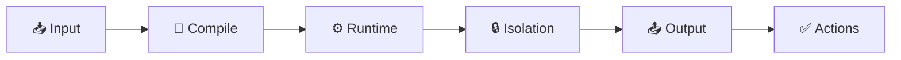
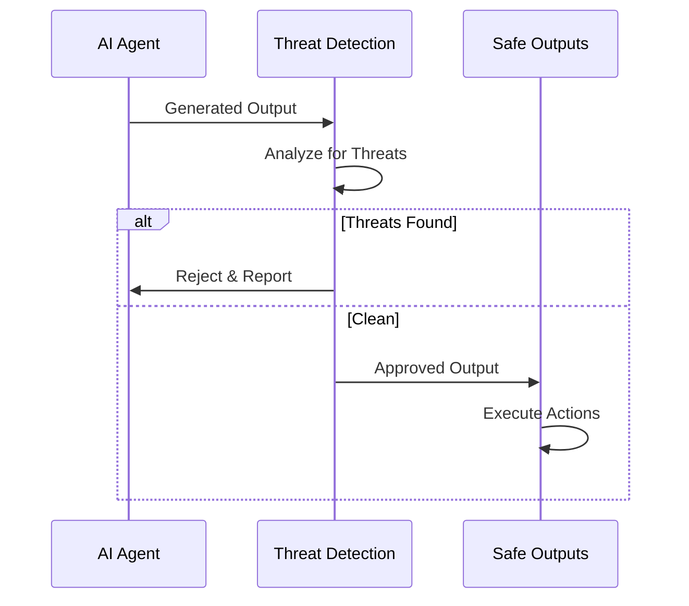

# 🤖 GitHub Agentic Workflows Skill

## Strategic Principle

**GitHub Agentic Workflows enable Continuous AI - systematic, automated application of AI to software collaboration through secure, defensible, and auditable automation.**

This skill provides comprehensive guidance for creating, securing, and operating GitHub Agentic Workflows that combine the reliability of GitHub Actions infrastructure with AI-driven decision-making and autonomous task execution.

**Last Updated**: 2026-02-11  
**Framework Version**: GitHub Agentic Workflows v0.43+  
**Compliance**: ISO 27001:2022, NIST CSF 2.0, OWASP Top 10 for Agentic Applications 2026

---

## Core References

### Hack23 ISMS Policies
- [Secure Development Policy](https://github.com/Hack23/ISMS-PUBLIC/blob/main/Secure_Development_Policy.md)
- [AI Policy](https://github.com/Hack23/ISMS-PUBLIC/blob/main/AI_Policy.md)
- [Access Control Policy](https://github.com/Hack23/ISMS-PUBLIC/blob/main/Access_Control_Policy.md)
- [Open Source Policy](https://github.com/Hack23/ISMS-PUBLIC/blob/main/Open_Source_Policy.md)

### GitHub Agentic Workflows Documentation
- [GitHub Agentic Workflows Repository](https://github.com/github/gh-aw)
- [Creating Workflows Guide](https://github.github.com/gh-aw/setup/creating-workflows/)
- [How They Work](https://github.github.com/gh-aw/introduction/how-they-work/)
- [Reference Glossary](https://github.github.com/gh-aw/reference/glossary/)
- [Security Architecture](https://github.github.io/gh-aw/introduction/architecture/)

### Security Standards (2026)
- [OWASP Top 10 for Agentic Applications 2026](https://genai.owasp.org/resource/owasp-top-10-for-agentic-applications-for-2026/)
- [Model Context Protocol (MCP) Specification](https://blog.modelcontextprotocol.io/)
- [GitHub Agentic Security Principles](https://github.blog/ai-and-ml/github-copilot/how-githubs-agentic-security-principles-make-our-ai-agents-as-secure-as-possible/)

---

## What Are GitHub Agentic Workflows?

### Definition

**Agentic** means having agency - the ability to act independently, make context-aware decisions, and adapt behavior based on circumstances.

**GitHub Agentic Workflows** are AI-powered automation workflows that run in GitHub Actions, using natural language instructions to perform complex, multi-step tasks automatically. Unlike traditional workflows with fixed if/then logic, agentic workflows use AI (GitHub Copilot, Claude, or Codex) to:

- Understand repository context (issues, PRs, code, discussions)
- Make context-aware decisions without explicit conditionals
- Generate content (comments, documentation, code changes)
- Adapt responses to different situations flexibly
- Execute tasks with human-level judgment

### Key Characteristics

| Traditional Workflows | Agentic Workflows |
|----------------------|-------------------|
| Fixed YAML with if/then logic | Natural language Markdown instructions |
| Pre-programmed steps | AI interprets context and decides actions |
| Brittle to context changes | Adapts to situation dynamically |
| Requires explicit conditionals | Infers appropriate behavior |
| Limited to coded scenarios | Handles novel situations |

---

## Core Concepts

### 1. Workflow Structure

Every agentic workflow consists of two main parts:

#### Frontmatter (YAML Configuration)
The configuration section at the top of the workflow file, enclosed between `---` markers:

```yaml
---
# When the workflow runs
on: issues

# What permissions it has (minimal by default)
permissions: read-all

# What tools the AI can use
tools:
  github:
    toolsets: [default]

# Safe outputs for controlled GitHub operations
safe-outputs:
  create-issue-comment:
    max: 5

# Security and network controls
network: defaults
strict: true
---
```

#### Natural Language Instructions (Markdown)
Clear, specific task descriptions that the AI agent interprets:

```markdown
# Issue Triage Agent

When a new issue is created:

1. Analyze the issue content, title, and any linked resources
2. Determine if it's a bug report, feature request, or question
3. Suggest appropriate labels based on content analysis
4. Provide a helpful initial response with:
   - Acknowledgment and thank you
   - Request for any missing information
   - Relevant documentation links
   - Next steps or timeline expectations
5. If the issue appears to be a duplicate, reference similar issues

Be professional, helpful, and concise. Use markdown formatting for readability.
```

### 2. Agentic Engine

The AI system that powers the workflow. Supported engines (as of 2026):

- **GitHub Copilot** (default): Uses GitHub's coding assistant with Copilot CLI
- **Claude by Anthropic**: Uses Anthropic's Claude models with strong reasoning
- **Codex**: OpenAI's code-focused models

Configuration:
```yaml
---
engine: copilot  # or 'claude' or 'codex'
---
```

### 3. Model Context Protocol (MCP)

**MCP** is the standardized protocol (JSON-RPC 2.0 based) that allows AI agents to securely connect to external tools, databases, and services. Think of MCP as "USB-C for AI integrations."

**MCP Architecture**:
- **MCP Servers**: Expose data and tools (GitHub API, file system, databases, custom services)
- **MCP Clients**: AI agents that connect to servers using the protocol
- **MCP Gateway**: Transparent proxy for unified HTTP access to multiple MCP servers

**Key Benefits**:
- Standardized tool integration
- Secure permission management
- Provider-agnostic (works with any AI model)
- Reduces context window overhead (98%+ reduction for large tool sets)

### 4. Safe Outputs

**Critical Security Pattern**: Pre-approved GitHub operations the AI can request without requiring write permissions.

The AI runs with **read-only permissions** and generates structured output describing what it wants to create (issues, comments, PRs). These outputs are:

1. **Validated** against schemas
2. **Threat-scanned** for malicious content
3. **Rate-limited** per action type
4. **Executed** by separate, permission-controlled jobs

This separation provides:
- Defense against prompt injection
- Full auditability
- Least-privilege access
- Controlled blast radius

**Example Configuration**:
```yaml
---
safe-outputs:
  create-issue-comment:
    max: 5  # Maximum 5 comments per run
  create-issue:
    max: 3
  create-pull-request:
    max: 1
  update-project:
    github-token: ${{ secrets.GH_PROJECT_TOKEN }}
    max: 10
---
```

### 5. Safe Inputs

Custom MCP tools defined inline in the workflow using JavaScript or shell scripts. Allows lightweight tool creation without external dependencies while maintaining controlled access to secrets.

**Example**:
```yaml
---
safe-inputs:
  fetch-api-data:
    description: Fetch data from internal API
    schema:
      type: object
      properties:
        endpoint:
          type: string
        apiKey:
          type: string
      required: [endpoint]
    implementation: |
      const response = await fetch(
        inputs.endpoint,
        {
          headers: {
            'Authorization': `Bearer ${process.env.API_KEY}`
          }
        }
      );
      return await response.json();
    env:
      API_KEY: ${{ secrets.INTERNAL_API_KEY }}
---
```

### 6. Compilation

The process of translating Markdown workflows (`.md` files) into GitHub Actions YAML format (`.lock.yml` files).

**Workflow**:
```bash
# Compile workflow
gh aw compile

# Generates .lock.yml file with:
# - Security hardening applied
# - Tools configured
# - Safe outputs processing jobs
# - Network controls enforced
```

**Both files must be committed**:
- `.md` file: Editable source of truth
- `.lock.yml` file: Compiled GitHub Actions workflow

---

## Security Architecture (Defense-in-Depth)

GitHub Agentic Workflows implement a **multi-layered security architecture** to protect against prompt injection, rogue MCP servers, and malicious agents.

### Security Layers


```mermaid
graph LR
    INPUT["📥 Input"] --> COMPILE["🔨 Compile"]
    COMPILE --> RUNTIME["⚙️ Runtime"]
    RUNTIME --> ISOLATION["🔒 Isolation"]
    ISOLATION --> OUTPUT["📤 Output"]
    OUTPUT --> ACTIONS["✅ Actions"]
```

#### Layer 1: Compilation-Time Validation

**Controls**:
- Schema validation for frontmatter
- Tool allowlist enforcement
- Network permission validation
- Strict mode checks
- Security scanner integration (actionlint, zizmor, poutine)

**Example**:
```yaml
---
strict: true  # Enable enhanced validation

tools:
  github:
    toolsets: [default]  # Only allow default toolset
  # Other tools explicitly listed
---
```

#### Layer 2: Runtime Isolation

**Controls**:
- Workflows run in ephemeral GitHub Actions runners
- No write permissions by default
- Sandboxed execution environment
- Network egress filtering
- File system access controls

**Permissions Model**:
```yaml
---
permissions: read-all  # Default: read-only

# Separate job with write permissions for safe outputs
# AI never has direct write access
---
```

#### Layer 3: Permission Separation

**Controls**:
- AI job: read-only permissions
- Safe outputs job: scoped write permissions
- Secrets available only to safe outputs job
- No git credentials in AI job

**Pattern**:
```yaml
# AI Job (read-only)
agent-job:
  permissions:
    contents: read
    issues: read
  # Generates safe output requests

# Safe Outputs Job (scoped write)
safe-outputs-job:
  needs: agent-job
  permissions:
    contents: write
    issues: write
    pull-requests: write
  # Executes validated requests only
```

#### Layer 4: Network Controls

**Controls**:
- Allowlist-based network access
- Default safe domains (GitHub, common infrastructure)
- Custom domain restrictions
- No network access option

**Configuration**:
```yaml
---
network: defaults  # Common development infrastructure

# OR custom allowlist
network:
  allow:
    - github.com
    - api.github.com
    - pypi.org
    - npmjs.com

# OR no network access
network: {}
---
```

#### Layer 5: Output Sanitization & Threat Detection

**Controls**:
- Automated threat detection job analyzes all outputs
- Detects prompt injection attempts
- Identifies secret leaks
- Flags suspicious code patterns
- Validates against SARIF format (security findings)

**Threat Detection Process**:

```mermaid
sequenceDiagram
    participant AI as AI Agent
    participant TD as Threat Detection
    participant SO as Safe Outputs
    
    AI->>TD: Generated Output
    TD->>TD: Analyze for Threats
    alt Threats Found
        TD->>AI: Reject & Report
    else Clean
        TD->>SO: Approved Output
        SO->>SO: Execute Actions
    end
```

---

## Implementation Rules

### MUST Rules (Critical - Non-Negotiable)

#### Security Rules

1. **✅ MUST use safe outputs pattern**
   - Never grant write permissions directly to AI jobs
   - All GitHub operations via safe-outputs
   - Rate limits on all safe output types

   ```yaml
   ---
   permissions: read-all  # AI job read-only
   
   safe-outputs:
     create-issue-comment:
       max: 5
   ---
   ```

2. **✅ MUST enable threat detection**
   - Automated security analysis of all outputs
   - Block suspicious patterns

   ```yaml
   ---
   safe-outputs:
     threat-detection:
       enabled: true  # Default, but be explicit
   ---
   ```

3. **✅ MUST use network controls**
   - Restrict network access to known-safe domains
   - Use `network: defaults` or explicit allowlist

   ```yaml
   ---
   network: defaults  # Or explicit allowlist
   ---
   ```

4. **✅ MUST validate all inputs**
   - Use safe-inputs for custom tools
   - Schema validation for all parameters
   - Type checking and sanitization

   ```yaml
   ---
   safe-inputs:
     my-tool:
       schema:
         type: object
         properties:
           param1:
             type: string
             maxLength: 100
         required: [param1]
   ---
   ```

5. **✅ MUST use least-privilege principle**
   - Minimal permissions for all jobs
   - Scoped GitHub tokens
   - Time-bound credentials where possible

6. **✅ MUST implement audit logging**
   - All actions produce visible artifacts
   - Traceability of decisions
   - Attribution to workflow and trigger

7. **✅ MUST protect secrets**
   - Never hardcode credentials
   - Use GitHub secrets
   - Limit secret access to safe outputs jobs

   ```yaml
   ---
   safe-outputs:
     create-issue:
       github-token: ${{ secrets.GITHUB_TOKEN }}  # Not in AI job
   ---
   ```

8. **✅ MUST test workflows in isolation**
   - Use TrialOps pattern for testing
   - Validate in side repositories
   - Never test directly in production

9. **✅ MUST follow OWASP Top 10 for Agentic Applications 2026**
   - Agent Goal Hijack prevention
   - Tool Misuse controls
   - Privilege Escalation guards
   - Memory Poisoning protection
   - Supply Chain Security

10. **✅ MUST document threat models**
    - Identify potential threats
    - Document mitigations
    - Include in workflow comments

    ```markdown
    ## Threat Model
    
    **Threats Addressed**:
    1. Prompt Injection: Read-only permissions + safe outputs
    2. Secret Leakage: Secrets only in safe outputs job
    3. Unauthorized Actions: Rate limiting + validation
    4. Network Exfiltration: Network allowlist
    ```

#### Operational Rules

11. **✅ MUST compile workflows before commit**
    ```bash
    gh aw compile
    git add .github/workflows/*.md .github/workflows/*.lock.yml
    ```

12. **✅ MUST commit both .md and .lock.yml files**
    - `.md`: Source of truth
    - `.lock.yml`: Compiled workflow with security hardening

13. **✅ MUST use semantic versioning for workflow changes**
    - Breaking changes: Major version bump
    - New features: Minor version bump
    - Bug fixes: Patch version bump

14. **✅ MUST monitor workflow costs**
    ```bash
    gh aw logs --analyze  # Review token usage and costs
    ```

15. **✅ MUST implement human approval for critical actions**
    - Repository settings changes
    - Access control modifications
    - Significant code changes

### SHOULD Rules (Strongly Recommended)

1. **✅ SHOULD use toolsets** instead of explicit tool lists — `toolsets: [default]` is version-safe
2. **✅ SHOULD enable strict mode** — `strict: true` for enhanced validation
3. **✅ SHOULD use workflow labels** — `labels: ["automation", "triage"]` for organization
4. **✅ SHOULD implement concurrency controls** — `concurrency: { group: name, cancel-in-progress: true }`
5. **✅ SHOULD set timeout limits** — `timeout-minutes: 30` to fail fast
6. **✅ SHOULD use memory for stateful workflows** — `cache-memory: { namespace: state }` (7-day retention)
7. **✅ SHOULD document workflow purpose** — include Purpose, Trigger, Actions, Owner in markdown
8. **✅ SHOULD use orchestrator/worker pattern** for complex tasks (see MemoryOps)
9. **✅ SHOULD implement safe output messages** — run-started, run-success, footer with `{run_url}`
10. **✅ SHOULD version control agent prompts** — store in `.github/agents/`, code review changes

### MAY Rules (Optional - Best Practice)

1. **✅ MAY use custom MCP servers** — for specialized integrations with security review
2. **✅ MAY use repo-memory** — `repo-memory: { branch: "data/state" }` for long-term persistence
3. **✅ MAY use workflow inputs** — `workflow_dispatch` with typed inputs for parameterization
4. **✅ MAY use slash commands** — `on: { slash_command: { command: "/review" } }` for interactive workflows
5. **✅ MAY use asset uploads** — `upload-asset: { branch: "assets/reports", allowed-exts: [.png, .pdf] }`

---

## MCP (Model Context Protocol) Integration

### Understanding MCP

MCP standardizes how AI agents connect to tools and data sources. It's protocol-agnostic and works with any AI model provider (GitHub Copilot, Claude, ChatGPT, etc.).

**Key Components**:

1. **MCP Servers**: Provide tools and resources
2. **MCP Clients**: AI agents that use tools
3. **MCP Gateway**: Proxy for unified access
4. **Protocol**: JSON-RPC 2.0 over HTTP/stdio

### Using MCP in Workflows

#### GitHub MCP Server (Built-in)

The most common MCP server, providing GitHub API operations:

```yaml
---
tools:
  github:
    toolsets:
      - default      # context, repos, issues, pull_requests
      - discussions  # GitHub Discussions
      - actions      # GitHub Actions workflows
      - projects     # GitHub Projects v2
      - security     # CodeQL, Dependabot, secret scanning
---
```

**Available Toolsets** (2026):

| Toolset | Purpose | Key Tools |
|---------|---------|-----------|
| `default` | Core operations | context, repos, issues, pull_requests |
| `discussions` | GitHub Discussions | list/create/update discussions |
| `actions` | Workflows & runs | list workflows, get logs, trigger runs |
| `projects` | Projects v2 | manage project boards, update fields |
| `security` | Security scanning | CodeQL, Dependabot, secret scanning alerts |
| `stars` | Repository starring | star/unstar repositories |
| `notifications` | Notification management | list/mark notifications |
| `gists` | Gist operations | create/list gists |

#### Custom MCP Servers

For specialized integrations:

```yaml
---
tools:
  my-custom-server:
    server:
      command: "node"
      args: ["/path/to/mcp-server.js"]
    tools: ["custom-tool-1", "custom-tool-2"]
---
```

#### MCP Best Practices (2026)

1. **Use toolsets, not explicit tool lists**
   ```yaml
   # ✅ GOOD
   tools:
     github:
       toolsets: [default, projects]
   
   # ❌ BAD (deprecated)
   tools:
     github:
       allowed: [create_issue, update_issue, ...]
   ```

2. **Start simple, scale incrementally**
   - Begin with single toolset
   - Add toolsets as needed
   - Monitor context window usage

3. **Leverage code execution for scale**
   - Reduces context overhead by 98%+
   - Enables working with thousands of tools
   - Supported by Anthropic's Claude Code

4. **Centralize security and permissions**
   - Define scopes in MCP configuration
   - Use GitHub secrets for tokens
   - Enforce through MCP server, not environment variables

5. **Maintain portability**
   - Write MCP servers to be provider-agnostic
   - Ensure cross-compatibility (Claude, Copilot, ChatGPT)

---

## Operational Patterns

GitHub Agentic Workflows support multiple operational patterns:

| Pattern | Trigger | Description | Key Use Cases |
|---------|---------|-------------|---------------|
| **ChatOps** | `slash_command` | Interactive automation via `/commands` in comments | Code reviews (`/review`), deployments, analysis |
| **DailyOps** | `daily` | Scheduled daily incremental improvements | Doc maintenance, tech debt, migrations |
| **IssueOps** | `issues` | Automated issue management on creation | Auto-triage, smart routing, initial responses |
| **LabelOps** | `issues: [labeled]` | Workflows triggered by label changes | Priority handling, stage transitions, team routing |
| **MemoryOps** | `weekly`/scheduled | Stateful workflows with persistent data (cache-memory) | Trend analysis, metrics reports, multi-step tasks |
| **ProjectOps** | `issues`/`pull_request` | AI-powered GitHub Projects board management | Auto-assignment, priority estimation, status transitions |
| **SideRepoOps** | `workflow_dispatch` | Workflows in separate repo targeting main codebase | Safe experimentation, high-volume automation |
| **TrialOps** | `workflow_dispatch` | Testing workflows in isolated trial repositories | Prompt validation, approach comparison, demos |

### Pattern Selection Guide

- **Start with TrialOps** for testing, then promote to production
- **Use IssueOps/LabelOps** for event-driven automation
- **Use DailyOps/MemoryOps** for scheduled and stateful work
- **Use SideRepoOps** to keep automation separate from main codebase
- **Use ChatOps** for interactive, on-demand operations

All patterns follow the same security model: `permissions: read-all` + `safe-outputs` with rate limits.

---

## Workflow Development Best Practices

### Prompt Engineering

✅ **DO**: Be specific, use numbered steps, provide examples, set boundaries, define output format.
❌ **DON'T**: Be vague, assume context, over-constrain, mix concerns, forget edge cases.

Good prompts specify: what to analyze, what concerns to check, output format, and limits (e.g., "Maximum 10 comments").

### Testing & Rollout

1. **Start with TrialOps** — test in isolated trial repository first
2. **Use dry-run mode** — `safe-outputs: { dry-run: true }` to simulate
3. **Incremental rollout** — single trigger first, add more gradually
4. **Version control** — tag stable versions, document changes, easy rollback

### Error Handling

- **Graceful degradation**: proceed with available info, note limitations
- **Explicit failures**: "No actionable items" rather than empty output
- **Timeouts**: set `timeout-minutes: 30` to fail fast

### Cost Management

- Monitor usage: `gh aw logs --analyze`
- Set rate limits on all `safe-outputs`
- Use `concurrency: { group: name, cancel-in-progress: true }`
- Use specific event filters; avoid triggering on every push

### Observability

- Use consistent markdown formatting with workflow metadata
- Add footer: `_Generated by [{workflow_name}]({run_url})_`
- Ensure all actions create visible, linked, traceable artifacts

---

## Security Threat Models

### Common Threats & Mitigations

| Threat | Attack Example | Mitigations |
|--------|---------------|-------------|
| **Prompt Injection** | Malicious instructions in issue/PR content hijack agent | Read-only AI permissions, safe outputs validation, threat detection, rate limiting |
| **Secret Leakage** | AI accidentally includes secrets in generated content | Secrets only in safe outputs jobs, AI has no secret access, output sanitization |
| **Network Exfiltration** | Compromised agent sends data to external servers | Network allowlist (`network: defaults`), egress filtering, no arbitrary outbound |
| **Tool Misuse** | Mass issue creation (DoS), label spam, unauthorized access | Toolset allowlists, rate limiting (`max:`), scoped permissions, audit logging |
| **Goal Hijacking** | Agent's intended goal subverted ("triage" → "close all") | Specific bounded instructions, safe outputs validation, human oversight |
| **Memory Poisoning** | Attacker manipulates workflow memory for future runs | Validate memory contents, integrity checks, separate namespaces, time-bound cache (7 days) |

### Key Defense Pattern

```yaml
---
permissions: read-all  # AI never has write access
safe-outputs:
  threat-detection:
    enabled: true
  create-issue-comment:
    max: 5  # Rate limit all outputs
network: defaults  # Restrict network access
---
```

Always use bounded instructions: specify what the agent SHOULD do AND what it must NOT do.

---

## OWASP Top 10 for Agentic Applications 2026

### Compliance Mapping

| OWASP Risk | GitHub Agentic Workflows Control |
|------------|----------------------------------|
| 1. Agent Goal Hijack | Specific instructions, safe outputs, validation |
| 2. Tool Misuse | Toolset allowlists, rate limiting, scoped permissions |
| 3. Prompt Injection | Read-only AI job, threat detection, output sanitization |
| 4. Privilege Escalation | Permission separation, least privilege, safe outputs |
| 5. Memory Poisoning | Validation, integrity checks, separate namespaces |
| 6. Secret Leakage | Secrets in safe outputs only, threat detection |
| 7. Unintended Actions | Human approval, dry-run mode, audit logging |
| 8. Supply Chain | Tool allowlists, compilation validation, security scanning |
| 9. Resource Exhaustion | Rate limiting, timeout limits, concurrency controls |
| 10. Network Risks | Network allowlists, egress filtering, no arbitrary access |

---

## Integration with Hack23 ISMS

### ISO 27001:2022 Mapping

| Control | Workflow Alignment |
|---------|-------------------|
| **A.8.1** Asset Management | Workflows as code assets, version controlled |
| **A.8.2** Information Classification | Secrets management, data handling in workflows |
| **A.8.5** Secure Authentication | Token-based auth, GitHub OIDC, no hardcoded credentials |
| **A.8.9** Configuration Management | Workflow configuration as code, change tracking |
| **A.8.10** Information Deletion | Time-bound cache-memory, controlled repo-memory |
| **A.8.15** Logging | Audit trail, workflow run logs, safe output artifacts |
| **A.8.23** Web Filtering | Network allowlists, egress controls |
| **A.8.26** Application Security | Safe outputs, threat detection, validation |
| **A.8.28** Secure Coding | Prompt engineering standards, code review for workflows |

### NIST CSF 2.0 Mapping

| Function | Implementation |
|----------|---------------|
| **IDENTIFY** | Workflow inventory, threat models, asset classification |
| **PROTECT** | Access controls, safe outputs, network restrictions |
| **DETECT** | Threat detection, audit logging, monitoring |
| **RESPOND** | Rate limiting, safe outputs, human approval gates |
| **RECOVER** | Workflow rollback, version control, incident response |

### CIS Controls v8 Mapping

| Control | Workflow Implementation |
|---------|------------------------|
| **CIS 4** Secure Configuration | Workflow frontmatter validation, strict mode |
| **CIS 5** Account Management | Token-based access, GitHub OIDC, least privilege |
| **CIS 6** Access Control | Permission separation, read-only AI jobs |
| **CIS 8** Audit Log Management | Workflow runs, safe output artifacts, traceability |
| **CIS 10** Malware Defenses | Threat detection, output validation |
| **CIS 12** Network Infrastructure | Network allowlists, egress filtering |
| **CIS 14** Security Awareness | Workflow documentation, threat models |
| **CIS 16** Application Software | Secure workflow development, testing |

---

---

## Quick Decision Guide

### When to Use Agentic Workflows?

**✅ Good Use Cases**:
- Issue triage and labeling
- PR code review assistance
- Documentation maintenance
- Dependency updates
- Security vulnerability analysis
- Project board management
- Weekly reports and metrics
- Slack command automation
- Content generation

**❌ Poor Use Cases**:
- Production deployments (use traditional CI/CD)
- Financial transactions
- Bulk data processing (use APIs directly)
- Real-time monitoring
- High-frequency triggers
- Tasks requiring deterministic behavior
- Safety-critical operations

### Choosing Operational Patterns

| Use Case | Pattern | Trigger |
|----------|---------|---------|
| Interactive commands | ChatOps | slash_command |
| Auto-triage | IssueOps | issues |
| Daily improvements | DailyOps | daily |
| Priority handling | LabelOps | issues (labeled) |
| Trend analysis | MemoryOps | weekly |
| Board management | ProjectOps | issues/pull_request |
| Testing | TrialOps | workflow_dispatch |
| Separate automation | SideRepoOps | * (from side repo) |

### Choosing AI Engine

| Engine | Best For | Considerations |
|--------|----------|---------------|
| **Copilot** | Code analysis, GitHub operations | Default, well-integrated |
| **Claude** | Complex reasoning, long context | Strong analytical capabilities |
| **Codex** | Code generation | OpenAI-based |

---

## Related Resources

- **Hack23 ISMS**: [Secure Development](https://github.com/Hack23/ISMS-PUBLIC/blob/main/Secure_Development_Policy.md) | [AI Policy](https://github.com/Hack23/ISMS-PUBLIC/blob/main/AI_Policy.md)
- **Skills**: [Security by Design](./security-by-design.md) | [Code Quality](./code-quality-excellence.md) | [ISMS Compliance](./isms-compliance.md)
- **GitHub**: [Agentic Workflows](https://github.com/github/gh-aw) | [Actions Docs](https://docs.github.com/en/actions) | [Continuous AI](https://githubnext.com/projects/continuous-ai)
- **Security**: [OWASP Agentic Top 10](https://genai.owasp.org/resource/owasp-top-10-for-agentic-applications-for-2026/) | [MCP Protocol](https://blog.modelcontextprotocol.io/) | [GitHub Security Principles](https://github.blog/ai-and-ml/github-copilot/how-githubs-agentic-security-principles-make-our-ai-agents-as-secure-as-possible/)
- **Standards**: [ISO 27001:2022](https://www.iso.org/standard/27001) | [NIST CSF 2.0](https://www.nist.gov/cyberframework) | [CIS Controls v8](https://www.cisecurity.org/controls/)

---

## Remember

### Core Principles
1. **Security First**: Defense-in-depth, least privilege, safe outputs
2. **Continuous AI**: Systematic automation of AI to software collaboration
3. **Agency with Control**: AI makes decisions within defined boundaries
4. **Auditability**: All actions create visible, traceable artifacts
5. **Fail Secure**: Graceful degradation, explicit failure modes
6. **Human Oversight**: Critical actions require approval

### Best Practices
- Start simple, iterate based on results
- Test in isolation before production (TrialOps)
- Monitor costs and usage patterns
- Version control all workflow changes
- Document threat models
- Use safe outputs pattern always
- Enable threat detection
- Set rate limits
- Implement network controls
- Follow OWASP Top 10 for Agentic Applications 2026

### Common Pitfalls to Avoid
- ❌ Granting write permissions to AI jobs
- ❌ Skipping threat detection
- ❌ No network controls
- ❌ Missing rate limits on safe outputs
- ❌ Vague or ambiguous instructions
- ❌ Testing in production
- ❌ Ignoring cost monitoring
- ❌ Hardcoding secrets
- ❌ Over-constraining agent behavior
- ❌ No human approval for critical actions

---

**Made with ❤️ for CIA Compliance Manager** | [Hack23 AB](https://www.hack23.com) | Continuous AI Excellence
