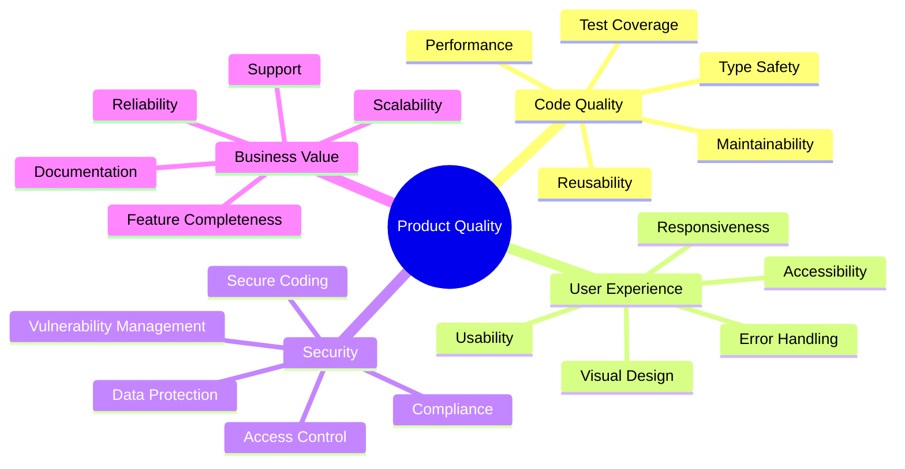

# 🎯 Product Quality Analysis Skill

## Strategic Principle

**Product quality encompasses code quality, user experience, security, and business value. Analyze holistically to deliver excellence.**

This skill provides a framework for comprehensive product quality analysis across all dimensions: technical excellence, user experience, security posture, and business alignment.

## Core Rules

### 1. Multi-Dimensional Quality Assessment (MANDATORY)

**RULE**: Evaluate product quality across all critical dimensions.

**Quality Dimensions**:



**Must-Follow Patterns**:
- ✅ **MUST**: Assess all four quality dimensions
- ✅ **MUST**: Prioritize security and critical bugs
- ✅ **MUST**: Consider user impact in prioritization
- ✅ **SHOULD**: Use objective metrics where possible
- ✅ **MAY**: Adjust weights based on project phase

### 2. Code Quality Analysis

**RULE**: Evaluate code against established standards and best practices.

**Analysis Areas**:

#### Type Safety
```typescript
// Check: Are types explicit? No `any` usage?
function analyzeTypeSafety(file: string): QualityReport {
  const issues: Issue[] = [];
  
  // Scan for `any` types
  if (file.includes(': any')) {
    issues.push({
      severity: 'high',
      category: 'type-safety',
      message: 'Usage of `any` type found',
      recommendation: 'Use explicit types or `unknown`',
    });
  }
  
  // Check for missing return types
  if (/function \w+\(.*\)\s*{/.test(file) && !/:\s*\w+\s*{/.test(file)) {
    issues.push({
      severity: 'medium',
      category: 'type-safety',
      message: 'Missing return type annotation',
      recommendation: 'Add explicit return type',
    });
  }
  
  return { issues };
}
```

#### Code Reusability
```typescript
// Check: Are existing utilities being reused?
function analyzeReusability(newCode: string): QualityReport {
  const issues: Issue[] = [];
  
  // Check for potential duplicates
  const duplicateCandidates = [
    { pattern: /function.*Color.*level/i, existing: 'src/utils/colorUtils.ts' },
    { pattern: /function.*Risk.*calculate/i, existing: 'src/utils/riskUtils.ts' },
    { pattern: /interface.*Level/i, existing: 'src/types/cia.ts' },
  ];
  
  duplicateCandidates.forEach(({ pattern, existing }) => {
    if (pattern.test(newCode)) {
      issues.push({
        severity: 'critical',
        category: 'reusability',
        message: `Potential duplicate of existing code in ${existing}`,
        recommendation: `Review ${existing} for reusable implementations`,
      });
    }
  });
  
  return { issues };
}
```

#### Test Coverage
```typescript
// Check: Is test coverage adequate?
function analyzeTestCoverage(coverage: CoverageReport): QualityReport {
  const issues: Issue[] = [];
  
  if (coverage.overall < 80) {
    issues.push({
      severity: 'high',
      category: 'testing',
      message: `Overall coverage ${coverage.overall}% is below 80% threshold`,
      recommendation: 'Add unit tests for uncovered code paths',
    });
  }
  
  if (coverage.securityCritical < 100) {
    issues.push({
      severity: 'critical',
      category: 'testing',
      message: 'Security-critical code lacks 100% test coverage',
      recommendation: 'Add comprehensive tests for authentication and data handling',
    });
  }
  
  return { issues };
}
```

**Must-Follow Patterns**:
- ✅ **MUST**: Check type safety (no `any`, explicit return types)
- ✅ **MUST**: Verify code reusability (no duplicates)
- ✅ **MUST**: Assess test coverage (80%+ overall, 100% security-critical)
- ✅ **MUST**: Review function complexity (< 50 lines)
- ✅ **SHOULD**: Check for proper error handling
- ✅ **SHOULD**: Verify documentation completeness

### 3. User Experience Analysis

**RULE**: Evaluate UX through user-centric testing and metrics.

**Analysis Approach**:

#### Usability Testing
```typescript
// Playwright-based UX analysis
async function analyzeUsability(page: Page): Promise<QualityReport> {
  const issues: Issue[] = [];
  
  // Check: Can users complete key workflows?
  try {
    await page.goto('/dashboard');
    await page.click('[data-testid="create-assessment"]');
    await page.fill('#confidentiality', 'high');
    await page.click('button[type="submit"]');
    
    // Verify success
    const success = await page.locator('[role="alert"]').textContent();
    if (!success?.includes('success')) {
      issues.push({
        severity: 'high',
        category: 'usability',
        message: 'Assessment creation workflow incomplete or unclear',
        recommendation: 'Add clear success feedback',
      });
    }
  } catch (error) {
    issues.push({
      severity: 'critical',
      category: 'usability',
      message: 'Critical workflow is broken',
      recommendation: 'Fix assessment creation flow',
    });
  }
  
  return { issues };
}
```

#### Accessibility Audit
```typescript
// Automated accessibility checking
async function analyzeAccessibility(page: Page): Promise<QualityReport> {
  const issues: Issue[] = [];
  
  // Run axe accessibility scan
  const violations = await injectAxe(page).then(() => getViolations(page));
  
  violations.forEach(violation => {
    issues.push({
      severity: violation.impact === 'critical' ? 'critical' : 'high',
      category: 'accessibility',
      message: violation.description,
      recommendation: violation.help,
      wcagLevel: violation.tags.includes('wcag2aa') ? 'AA' : 'A',
    });
  });
  
  return { issues };
}
```

#### Performance Metrics
```typescript
// Check: Are performance budgets met?
function analyzePerformance(metrics: PerformanceMetrics): QualityReport {
  const issues: Issue[] = [];
  
  const budgets = {
    fcp: 1500,  // First Contentful Paint (ms)
    lcp: 2500,  // Largest Contentful Paint (ms)
    tti: 3500,  // Time to Interactive (ms)
    tbt: 300,   // Total Blocking Time (ms)
    cls: 0.1,   // Cumulative Layout Shift
  };
  
  Object.entries(budgets).forEach(([metric, budget]) => {
    if (metrics[metric] > budget) {
      issues.push({
        severity: 'medium',
        category: 'performance',
        message: `${metric.toUpperCase()} (${metrics[metric]}) exceeds budget (${budget})`,
        recommendation: `Optimize for better ${metric}`,
      });
    }
  });
  
  return { issues };
}
```

**Must-Follow Patterns**:
- ✅ **MUST**: Test critical user workflows end-to-end
- ✅ **MUST**: Run automated accessibility audits
- ✅ **MUST**: Check performance metrics against budgets
- ✅ **MUST**: Verify responsive design on mobile/tablet/desktop
- ✅ **SHOULD**: Test with real users or stakeholders
- ✅ **SHOULD**: Gather user feedback on changes

### 4. Security and ISMS Compliance Analysis

**RULE**: Validate security posture and ISMS policy alignment.

**Analysis Areas**:

#### Vulnerability Scanning
```typescript
// Check: Are there known vulnerabilities?
function analyzeVulnerabilities(scanResults: VulnScanResults): QualityReport {
  const issues: Issue[] = [];
  
  const criticalVulns = scanResults.vulnerabilities.filter(
    v => v.severity === 'critical'
  );
  
  if (criticalVulns.length > 0) {
    issues.push({
      severity: 'critical',
      category: 'security',
      message: `${criticalVulns.length} critical vulnerabilities found`,
      recommendation: 'Remediate immediately per ISMS vulnerability SLA (24h)',
      ismsControl: 'Vulnerability Management',
    });
  }
  
  return { issues };
}
```

#### ISMS Policy Compliance
```typescript
// Check: Does code align with ISMS policies?
function analyzeISMSCompliance(codeChanges: CodeChange[]): QualityReport {
  const issues: Issue[] = [];
  
  // Check: Is security architecture documented?
  const securityFiles = ['SECURITY_ARCHITECTURE.md', 'SECURITY.md'];
  const hasSecurityDocs = securityFiles.some(file => 
    codeChanges.some(change => change.file === `docs/architecture/${file}`)
  );
  
  if (!hasSecurityDocs && codeChanges.some(isSecurityRelated)) {
    issues.push({
      severity: 'high',
      category: 'isms-compliance',
      message: 'Security changes lack architecture documentation',
      recommendation: 'Update SECURITY_ARCHITECTURE.md',
      ismsPolicy: 'Secure Development Policy',
    });
  }
  
  // Check: Are compliance frameworks mapped?
  const complianceFrameworks = ['ISO 27001', 'NIST CSF', 'CIS Controls'];
  // ... validation logic
  
  return { issues };
}
```

**Must-Follow Patterns**:
- ✅ **MUST**: Scan for known vulnerabilities
- ✅ **MUST**: Verify ISMS policy alignment
- ✅ **MUST**: Check security architecture documentation
- ✅ **MUST**: Validate input validation and sanitization
- ✅ **MUST**: Ensure secure coding practices
- ✅ **SHOULD**: Map features to compliance frameworks
- ✅ **SHOULD**: Review access controls

### 5. Issue Prioritization

**RULE**: Prioritize issues by severity, impact, and effort.

**Prioritization Matrix**:

| Severity | User Impact | Effort | Priority |
|----------|-------------|--------|----------|
| Critical | High | Any | P0 - Immediate |
| High | High | Low | P1 - Next Sprint |
| High | Medium | Low | P1 - Next Sprint |
| High | Low | High | P2 - Backlog |
| Medium | High | Low | P1 - Next Sprint |
| Medium | Medium | Low | P2 - Backlog |
| Medium | Low | High | P3 - Future |
| Low | Any | Any | P3 - Future |

```typescript
function prioritizeIssues(issues: Issue[]): PrioritizedIssue[] {
  return issues.map(issue => {
    let priority: Priority;
    
    // Critical security/functionality issues are always P0
    if (issue.severity === 'critical') {
      priority = 'P0';
    }
    // High severity with high user impact
    else if (issue.severity === 'high' && issue.userImpact === 'high') {
      priority = issue.effort === 'high' ? 'P2' : 'P1';
    }
    // Medium severity
    else if (issue.severity === 'medium') {
      priority = issue.userImpact === 'high' && issue.effort === 'low' 
        ? 'P1' 
        : 'P2';
    }
    // Low severity
    else {
      priority = 'P3';
    }
    
    return { ...issue, priority };
  }).sort((a, b) => {
    const priorityOrder = { P0: 0, P1: 1, P2: 2, P3: 3 };
    return priorityOrder[a.priority] - priorityOrder[b.priority];
  });
}
```

**Must-Follow Patterns**:
- ✅ **MUST**: Prioritize security issues as P0
- ✅ **MUST**: Consider user impact in prioritization
- ✅ **MUST**: Balance severity with effort
- ✅ **SHOULD**: Group related issues
- ✅ **SHOULD**: Create dependencies between issues

### 6. Continuous Quality Monitoring

**RULE**: Track quality metrics over time to identify trends.

**Key Metrics**:

```typescript
interface QualityMetrics {
  // Code Quality
  typeScriptStrictness: number;      // % files with strict mode
  testCoverage: number;               // % overall coverage
  codeReusability: number;            // % reused vs. duplicated
  avgFunctionComplexity: number;      // Lines per function
  
  // User Experience
  lighthouseScore: number;            // Overall Lighthouse score
  accessibilityScore: number;         // WCAG 2.1 AA compliance %
  performanceScore: number;           // Core Web Vitals score
  
  // Security
  vulnerabilityCount: {
    critical: number;
    high: number;
    medium: number;
    low: number;
  };
  securityTestCoverage: number;       // % security paths tested
  
  // Business
  bugCount: number;                   // Open bugs
  defectDensity: number;              // Defects per KLOC
  mttr: number;                       // Mean time to resolution (hours)
}

// Track metrics over time
function generateQualityTrend(
  current: QualityMetrics,
  previous: QualityMetrics
): QualityTrend {
  return {
    typeScriptStrictness: calculateTrend(
      current.typeScriptStrictness,
      previous.typeScriptStrictness
    ),
    // ... other metrics
    summary: generateSummary(current, previous),
  };
}
```

**Must-Follow Patterns**:
- ✅ **MUST**: Track metrics consistently
- ✅ **MUST**: Set quality gates (minimum thresholds)
- ✅ **MUST**: Review metrics in retrospectives
- ✅ **SHOULD**: Automate metric collection
- ✅ **SHOULD**: Visualize trends over time
- ✅ **MAY**: Alert on metric degradation

## Product Quality Report Template

```markdown
# Product Quality Report

**Date**: [Date]
**Version**: [Version]
**Assessed By**: [Agent/Person]

## Executive Summary

Overall Quality Score: [0-100]

- ✅ Strengths: [List 3-5 strengths]
- ⚠️ Concerns: [List 3-5 concerns]
- 🔴 Critical Issues: [Count]

## Quality Dimensions

### 1. Code Quality (Score: X/100)

**Type Safety**: [Score]
- Issues: [Count]
- Key Finding: [Description]

**Reusability**: [Score]
- Duplicates Found: [Count]
- Recommendation: [Actions]

**Test Coverage**: [Percentage]
- Overall: X%
- Security-Critical: Y%
- Gaps: [Areas lacking coverage]

**Technical Debt**: [Assessment]

### 2. User Experience (Score: X/100)

**Usability**: [Score]
- Critical Workflows: [Status]
- Error Handling: [Assessment]

**Accessibility**: [Score]
- WCAG 2.1 AA Compliance: [Percentage]
- Violations: [Count]
- Top Issues: [List]

**Performance**: [Score]
- Core Web Vitals: [Metrics]
- Bundle Size: [Size]

**Responsive Design**: [Status]

### 3. Security & ISMS (Score: X/100)

**Vulnerabilities**: [Count by severity]
- Critical: [Count]
- High: [Count]
- Medium: [Count]
- Low: [Count]

**ISMS Compliance**: [Status]
- Security Architecture: [Status]
- Compliance Mapping: [Status]
- Vulnerability SLA: [Met/Not Met]

**Secure Coding**: [Assessment]

### 4. Business Value (Score: X/100)

**Feature Completeness**: [Percentage]

**Reliability**: [Uptime/Stability]

**Documentation**: [Status]

**Support Readiness**: [Assessment]

## Prioritized Issues

### P0 - Critical (Immediate Action Required)
[List with owner, ETA]

### P1 - High Priority (Next Sprint)
[List with owner, target sprint]

### P2 - Medium Priority (Backlog)
[List]

### P3 - Low Priority (Future)
[List]

## Quality Trends

[Graphs or tables showing metrics over time]

## Recommendations

1. [Top recommendation]
2. [Second recommendation]
3. [Third recommendation]

## Action Items

- [ ] [Action 1] - Owner: [Name], Due: [Date]
- [ ] [Action 2] - Owner: [Name], Due: [Date]
- [ ] [Action 3] - Owner: [Name], Due: [Date]
```

## Quality Analysis Checklist

Before completing analysis:

**Code Quality**:
- [ ] TypeScript strict mode compliance checked
- [ ] Code reusability assessed (no duplicates)
- [ ] Test coverage verified (80%+ overall, 100% security)
- [ ] Function complexity reviewed (< 50 lines)
- [ ] Documentation completeness checked

**User Experience**:
- [ ] Critical workflows tested end-to-end
- [ ] Accessibility audit completed (axe)
- [ ] Performance metrics measured (Lighthouse)
- [ ] Responsive design tested (mobile/tablet/desktop)
- [ ] Error handling evaluated

**Security & ISMS**:
- [ ] Vulnerability scan completed
- [ ] ISMS policy alignment verified
- [ ] Security architecture documented
- [ ] Secure coding practices reviewed
- [ ] Compliance frameworks mapped

**Business Value**:
- [ ] Feature completeness assessed
- [ ] Reliability evaluated
- [ ] Documentation reviewed
- [ ] User impact considered

**Issue Prioritization**:
- [ ] Issues categorized by severity
- [ ] User impact assessed
- [ ] Effort estimated
- [ ] Priorities assigned (P0-P3)
- [ ] Dependencies identified

## Remember

Product quality analysis is:
- **Holistic**: Consider all dimensions (code, UX, security, business)
- **Data-Driven**: Use objective metrics where possible
- **User-Centric**: Prioritize user impact
- **Continuous**: Regular assessment, not one-time
- **Actionable**: Result in concrete improvement tasks

**Great products require great quality across all dimensions.**

---

**Related Skills**:
- [Code Quality Excellence](./code-quality-excellence.md) - Code quality standards
- [UI/UX Design System](./ui-ux-design-system.md) - UX standards
- [Security by Design](./security-by-design.md) - Security standards
- [Testing Excellence](./testing-excellence.md) - Testing standards
- [ISMS Compliance](./isms-compliance.md) - Compliance standards

**Tools**:
- **Code Analysis**: ESLint, TypeScript compiler, SonarQube
- **UX Testing**: Playwright, Cypress, Lighthouse
- **Security**: npm audit, Snyk, OWASP ZAP
- **Monitoring**: GitHub Insights, CodeClimate, Coveralls
