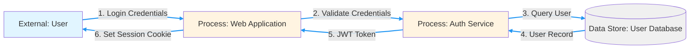

# 🎯 Threat Modeling Skill

## Strategic Principle

**Proactive security through systematic threat analysis must precede all security-critical development activities.**

This skill integrates STRIDE framework threat modeling, MITRE ATT&CK technique mapping, and risk-driven security design into the development lifecycle.

## Core Reference

### Hack23 Threat Modeling Framework

**Primary Policy**: [🎯 Threat Modeling Policy](https://github.com/Hack23/ISMS-PUBLIC/blob/main/Threat_Modeling.md) - Comprehensive STRIDE-based threat analysis with MITRE ATT&CK integration

**Key Components**:
- STRIDE threat categorization (Spoofing, Tampering, Repudiation, Information Disclosure, Denial of Service, Elevation of Privilege)
- MITRE ATT&CK technique mapping for real-world threat scenarios
- Data Flow Diagrams (DFD) for attack surface identification
- Risk-based prioritization using CLASSIFICATION framework
- Automated threat modeling integration in CI/CD

**Supporting Frameworks**:
- [🛠️ Secure Development Policy](https://github.com/Hack23/ISMS-PUBLIC/blob/main/Secure_Development_Policy.md) - Threat modeling in SDLC
- [🏷️ CLASSIFICATION Framework](https://github.com/Hack23/ISMS-PUBLIC/blob/main/CLASSIFICATION.md) - Business impact analysis for threat prioritization
- [📊 Risk Assessment Methodology](https://github.com/Hack23/ISMS-PUBLIC/blob/main/Risk_Assessment_Methodology.md) - Quantified risk scoring

## STRIDE Threat Modeling Framework

### Core Threat Categories

```typescript
enum StrideCategory {
  SPOOFING = 'Spoofing',                     // Impersonating someone/something
  TAMPERING = 'Tampering',                   // Modifying data or code
  REPUDIATION = 'Repudiation',               // Claiming not to have performed an action
  INFORMATION_DISCLOSURE = 'InformationDisclosure',  // Exposing information to unauthorized parties
  DENIAL_OF_SERVICE = 'DenialOfService',     // Denying or degrading service
  ELEVATION_OF_PRIVILEGE = 'ElevationOfPrivilege',   // Gaining unauthorized capabilities
}

interface StrideThreat {
  readonly id: string;
  readonly category: StrideCategory;
  readonly description: string;
  readonly affectedAssets: readonly string[];
  readonly likelihood: 'low' | 'medium' | 'high' | 'critical';
  readonly impact: 'low' | 'medium' | 'high' | 'critical';
  readonly mitreAttackTechniques: readonly string[];
  readonly mitigations: readonly string[];
  readonly residualRisk: 'low' | 'medium' | 'high' | 'critical';
}
```

### Mandatory Threat Modeling Triggers

**RULE**: Threat modeling is MANDATORY before implementing:

1. **Authentication/Authorization features**
2. **Data handling operations (CRUD on sensitive data)**
3. **External API integrations**
4. **File upload/download functionality**
5. **Payment processing**
6. **Admin/privileged functionality**
7. **Cryptographic operations**
8. **Changes to security controls**

```typescript
// ✅ GOOD: Threat model documented before implementation
/**
 * THREAT MODEL: User Authentication Feature
 * 
 * STRIDE Analysis:
 * 
 * S - Spoofing Identity:
 *   - Threat: Attacker impersonates legitimate user
 *   - Mitigation: Multi-factor authentication (MFA)
 *   - MITRE ATT&CK: T1078 (Valid Accounts)
 * 
 * T - Tampering with Data:
 *   - Threat: Session token manipulation
 *   - Mitigation: Signed JWTs with short expiry, secure token storage
 *   - MITRE ATT&CK: T1539 (Steal Web Session Cookie)
 * 
 * R - Repudiation:
 *   - Threat: User denies login activity
 *   - Mitigation: Audit logging of all authentication events
 *   - MITRE ATT&CK: T1070 (Indicator Removal)
 * 
 * I - Information Disclosure:
 *   - Threat: Credentials exposed in logs or errors
 *   - Mitigation: Never log passwords, redact sensitive data
 *   - MITRE ATT&CK: T1552 (Unsecured Credentials)
 * 
 * D - Denial of Service:
 *   - Threat: Brute-force authentication attempts
 *   - Mitigation: Rate limiting, account lockout, CAPTCHA
 *   - MITRE ATT&CK: T1110 (Brute Force)
 * 
 * E - Elevation of Privilege:
 *   - Threat: SQL injection in login query
 *   - Mitigation: Parameterized queries, input validation
 *   - MITRE ATT&CK: T1190 (Exploit Public-Facing Application)
 */

async function authenticateUser(
  email: string, 
  password: string, 
  mfaCode?: string
): Promise<AuthResult> {
  // Implementation with mitigations applied...
}
```

**Reference**: [Threat Modeling Policy - STRIDE Framework](https://github.com/Hack23/ISMS-PUBLIC/blob/main/Threat_Modeling.md#-stride-threat-modeling-framework)

## Data Flow Diagrams (DFD)

### DFD Components

**RULE**: Create DFD to visualize attack surface before threat modeling.

```typescript
enum DFDElementType {
  EXTERNAL_ENTITY = 'External Entity',  // User, external system
  PROCESS = 'Process',                   // Application component
  DATA_STORE = 'Data Store',            // Database, file system
  DATA_FLOW = 'Data Flow',              // Data movement between elements
  TRUST_BOUNDARY = 'Trust Boundary',    // Security boundary crossing
}

interface DFDElement {
  readonly id: string;
  readonly type: DFDElementType;
  readonly name: string;
  readonly trustBoundary?: string;
  readonly description: string;
}

interface DataFlow {
  readonly from: string;  // Element ID
  readonly to: string;    // Element ID
  readonly protocol: string;
  readonly encrypted: boolean;
  readonly authenticated: boolean;
  readonly dataClassification: 'public' | 'internal' | 'confidential' | 'restricted';
}
```

### Example DFD: User Authentication Flow



**Trust Boundaries**:
```typescript
const AUTH_FLOW_DFD: DFDElement[] = [
  {
    id: 'user',
    type: DFDElementType.EXTERNAL_ENTITY,
    name: 'User',
    trustBoundary: 'Internet',
    description: 'External user accessing the application',
  },
  {
    id: 'webapp',
    type: DFDElementType.PROCESS,
    name: 'Web Application',
    trustBoundary: 'DMZ',
    description: 'Frontend application in DMZ',
  },
  {
    id: 'authservice',
    type: DFDElementType.PROCESS,
    name: 'Authentication Service',
    trustBoundary: 'Internal Network',
    description: 'Backend authentication service',
  },
  {
    id: 'userdb',
    type: DFDElementType.DATA_STORE,
    name: 'User Database',
    trustBoundary: 'Internal Network',
    description: 'PostgreSQL database with user credentials',
  },
];

const AUTH_FLOWS: DataFlow[] = [
  {
    from: 'user',
    to: 'webapp',
    protocol: 'HTTPS',
    encrypted: true,
    authenticated: false,
    dataClassification: 'confidential',
  },
  {
    from: 'webapp',
    to: 'authservice',
    protocol: 'HTTPS',
    encrypted: true,
    authenticated: true,
    dataClassification: 'confidential',
  },
];
```

**Trust Boundary Crossing = Threat Surface**

Every time data crosses a trust boundary, apply STRIDE analysis:
- Internet → DMZ: All STRIDE threats apply
- DMZ → Internal Network: Focus on Tampering, Information Disclosure, Elevation of Privilege
- Process → Data Store: Focus on Tampering, Information Disclosure

**Reference**: [Threat Modeling Policy - Data Flow Diagrams](https://github.com/Hack23/ISMS-PUBLIC/blob/main/Threat_Modeling.md#-data-flow-diagrams-dfd)

## MITRE ATT&CK Integration

### Mapping Threats to ATT&CK Techniques

**RULE**: Map identified threats to MITRE ATT&CK techniques for real-world attack context.

```typescript
interface MitreAttackTechnique {
  readonly techniqueId: string;
  readonly techniqueName: string;
  readonly tactic: string;
  readonly description: string;
  readonly mitigations: readonly string[];
  readonly detections: readonly string[];
}

// ✅ GOOD: MITRE ATT&CK technique mapping
const ATTACK_TECHNIQUE_T1078: MitreAttackTechnique = {
  techniqueId: 'T1078',
  techniqueName: 'Valid Accounts',
  tactic: 'Initial Access',
  description: 'Adversary uses legitimate credentials to gain access',
  mitigations: [
    'Multi-factor authentication (MFA) required',
    'Privileged account management (separate admin accounts)',
    'Account use policies (lockout after failed attempts)',
    'Password policies (complexity, rotation)',
  ],
  detections: [
    'Monitor failed login attempts',
    'Detect anomalous login times/locations',
    'Track privileged account usage',
    'Alert on concurrent sessions from different IPs',
  ],
};

const ATTACK_TECHNIQUE_T1190: MitreAttackTechnique = {
  techniqueId: 'T1190',
  techniqueName: 'Exploit Public-Facing Application',
  tactic: 'Initial Access',
  description: 'Adversary exploits vulnerability in public application',
  mitigations: [
    'Input validation on all user inputs',
    'Web application firewall (WAF)',
    'Regular vulnerability scanning and patching',
    'Least privilege application permissions',
  ],
  detections: [
    'WAF alerts on malicious payloads',
    'Application error rate anomalies',
    'Unusual HTTP request patterns',
    'Intrusion detection system (IDS) signatures',
  ],
};
```

### ATT&CK Technique Catalog for Common Features

```typescript
const COMMON_ATTACK_TECHNIQUES = {
  authentication: ['T1078', 'T1110', 'T1539', 'T1552'],
  dataAccess: ['T1530', 'T1213', 'T1114'],
  apiAbuse: ['T1190', 'T1557', 'T1212'],
  privilegeEscalation: ['T1068', 'T1055', 'T1548'],
  persistenc: ['T1098', 'T1136', 'T1505'],
  lateralMovement: ['T1021', 'T1210', 'T1534'],
  exfiltration: ['T1041', 'T1048', 'T1567'],
} as const;
```

**Reference**: [Threat Modeling Policy - MITRE ATT&CK Integration](https://github.com/Hack23/ISMS-PUBLIC/blob/main/Threat_Modeling.md#-mitre-attck-framework-integration)

## Risk-Based Threat Prioritization

### Risk Scoring Formula

**RULE**: Prioritize threats using quantified risk scoring from CLASSIFICATION framework.

```typescript
type ImpactLevel = 'low' | 'medium' | 'high' | 'critical';
type LikelihoodLevel = 'rare' | 'unlikely' | 'possible' | 'likely' | 'certain';

interface ThreatRisk {
  readonly threat: StrideThreat;
  readonly likelihood: LikelihoodLevel;
  readonly confidentialityImpact: ImpactLevel;
  readonly integrityImpact: ImpactLevel;
  readonly availabilityImpact: ImpactLevel;
  readonly riskScore: number;  // 1-25
  readonly riskLevel: 'low' | 'medium' | 'high' | 'critical';
}

function calculateRiskScore(
  likelihood: LikelihoodLevel,
  impact: ImpactLevel
): number {
  const likelihoodMap: Record<LikelihoodLevel, number> = {
    rare: 1,
    unlikely: 2,
    possible: 3,
    likely: 4,
    certain: 5,
  };
  
  const impactMap: Record<ImpactLevel, number> = {
    low: 1,
    medium: 2,
    high: 3,
    critical: 5,
  };
  
  return likelihoodMap[likelihood] * impactMap[impact];
}

function determineRiskLevel(riskScore: number): 'low' | 'medium' | 'high' | 'critical' {
  if (riskScore >= 15) return 'critical';
  if (riskScore >= 10) return 'high';
  if (riskScore >= 5) return 'medium';
  return 'low';
}

// ✅ GOOD: Comprehensive threat risk assessment
const SQL_INJECTION_RISK: ThreatRisk = {
  threat: {
    id: 'TM-001',
    category: StrideCategory.ELEVATION_OF_PRIVILEGE,
    description: 'SQL injection in user authentication query',
    affectedAssets: ['User Database', 'Authentication Service'],
    likelihood: 'likely',
    impact: 'critical',
    mitreAttackTechniques: ['T1190'],
    mitigations: [
      'Parameterized queries',
      'Input validation and sanitization',
      'Least privilege database user',
      'Web application firewall',
    ],
    residualRisk: 'low',
  },
  likelihood: 'likely',
  confidentialityImpact: 'critical',  // All user data could be accessed
  integrityImpact: 'critical',         // Data could be modified/deleted
  availabilityImpact: 'high',          // Database could be crashed
  riskScore: calculateRiskScore('likely', 'critical'),  // 4 * 5 = 20
  riskLevel: determineRiskLevel(20),                    // critical
};
```

**Reference**: 
- [Threat Modeling Policy - Risk Assessment](https://github.com/Hack23/ISMS-PUBLIC/blob/main/Threat_Modeling.md#-risk-based-prioritization)
- [CLASSIFICATION Framework](https://github.com/Hack23/ISMS-PUBLIC/blob/main/CLASSIFICATION.md)
- [Risk Assessment Methodology](https://github.com/Hack23/ISMS-PUBLIC/blob/main/Risk_Assessment_Methodology.md)

## Threat Modeling in SDLC

### Integration Points

**RULE**: Threat modeling must occur at specific SDLC phases.

```typescript
interface ThreatModelingCheckpoint {
  readonly phase: string;
  readonly activities: readonly string[];
  readonly deliverables: readonly string[];
  readonly approvalRequired: boolean;
}

const THREAT_MODELING_SDLC: readonly ThreatModelingCheckpoint[] = [
  {
    phase: 'Requirements',
    activities: [
      'Identify security requirements',
      'Determine data classification',
      'Define trust boundaries',
    ],
    deliverables: [
      'Security requirements document',
      'Initial threat list',
    ],
    approvalRequired: false,
  },
  {
    phase: 'Design',
    activities: [
      'Create Data Flow Diagrams',
      'Apply STRIDE to each DFD element',
      'Map to MITRE ATT&CK techniques',
      'Prioritize threats by risk',
    ],
    deliverables: [
      'Data Flow Diagrams',
      'STRIDE threat model',
      'Risk assessment matrix',
      'Security controls design',
    ],
    approvalRequired: true,  // Security Architect approval required
  },
  {
    phase: 'Implementation',
    activities: [
      'Implement security controls',
      'Code review for threat mitigations',
      'Security testing',
    ],
    deliverables: [
      'Implemented security controls',
      'Security test results',
    ],
    approvalRequired: false,
  },
  {
    phase: 'Verification',
    activities: [
      'Validate threat mitigations',
      'Penetration testing',
      'Update threat model with findings',
    ],
    deliverables: [
      'Penetration test report',
      'Updated threat model',
      'Residual risk assessment',
    ],
    approvalRequired: true,  // CEO approval for residual risk acceptance
  },
];
```

**Reference**: [Secure Development Policy - Threat Modeling in SDLC](https://github.com/Hack23/ISMS-PUBLIC/blob/main/Secure_Development_Policy.md#threat-modeling)

## Automated Threat Modeling

### CI/CD Integration

**RULE**: Automate threat detection where possible.

```yaml
# ✅ GOOD: Automated threat detection in CI/CD
# .github/workflows/security-scan.yml
name: Threat Detection & Security Scanning

on: [push, pull_request]

jobs:
  threat-detection:
    runs-on: ubuntu-latest
    steps:
      - uses: actions/checkout@v4
      
      - name: SAST - CodeQL Analysis
        uses: github/codeql-action/analyze@v3
        with:
          category: "/language:javascript"
      
      - name: Dependency Vulnerability Scan
        run: |
          npm audit --audit-level=high
          npm run snyk-test
      
      - name: Secret Scanning
        uses: trufflesecurity/trufflehog@main
        with:
          path: ./
          base: ${{ github.event.repository.default_branch }}
      
      - name: Container Image Scanning
        uses: aquasecurity/trivy-action@master
        with:
          scan-type: 'fs'
          scan-ref: '.'
          format: 'sarif'
          output: 'trivy-results.sarif'
      
      - name: Upload SARIF Results
        uses: github/codeql-action/upload-sarif@v3
        with:
          sarif_file: 'trivy-results.sarif'
```

**Automated Threat Detection Tools**:
```typescript
const AUTOMATED_THREAT_TOOLS = {
  sast: 'CodeQL, SonarQube, Semgrep',
  dast: 'OWASP ZAP, Burp Suite',
  dependencyScanning: 'npm audit, Snyk, Dependabot',
  secretScanning: 'TruffleHog, GitGuardian, GitHub Secret Scanning',
  containerScanning: 'Trivy, Clair, Anchore',
  infrastructureScanning: 'Checkov, tfsec, Terrascan',
} as const;
```

**Reference**: [Secure Development Policy - Automated Security Testing](https://github.com/Hack23/ISMS-PUBLIC/blob/main/Secure_Development_Policy.md#automated-security-testing)

## Threat Model Documentation Template

```markdown
# Threat Model: [Feature Name]

## Overview
**Feature**: [Brief description]
**Owner**: [Team/Individual]
**Date**: [YYYY-MM-DD]
**Last Updated**: [YYYY-MM-DD]

## Data Flow Diagram
[Include DFD diagram - Mermaid, draw.io, or image]

## Assets
- Asset 1: [Description, Classification]
- Asset 2: [Description, Classification]

## Trust Boundaries
1. Boundary 1: [Description]
2. Boundary 2: [Description]

## STRIDE Analysis

### S - Spoofing Identity
| Threat | MITRE ATT&CK | Likelihood | Impact | Mitigation | Residual Risk |
|--------|--------------|------------|--------|------------|---------------|
| T1 | T1078 | High | Critical | MFA, Strong passwords | Low |

### T - Tampering with Data
[Same format as above]

### R - Repudiation
[Same format as above]

### I - Information Disclosure
[Same format as above]

### D - Denial of Service
[Same format as above]

### E - Elevation of Privilege
[Same format as above]

## Risk Summary
| Risk Level | Count | Priority Actions |
|------------|-------|------------------|
| Critical | 2 | Implement mitigations before release |
| High | 5 | Address in current sprint |
| Medium | 8 | Roadmap for next quarter |
| Low | 12 | Monitor and reassess |

## Approval
- [x] Security Architect Review
- [x] CEO Approval for Residual Risks

**Approved by**: [Name]
**Date**: [YYYY-MM-DD]
```

## Enforcement Rules

### MUST (Critical - Block PR if violated)
1. Threat model MUST be created for all security-critical features (auth, data handling, APIs, file operations, payments, admin functions, crypto)
2. Data Flow Diagrams MUST be created to identify attack surface
3. STRIDE analysis MUST be applied to all DFD elements crossing trust boundaries
4. All identified high and critical threats MUST have mitigations implemented
5. Residual risks MUST be documented and accepted by CEO
6. Threat models MUST be reviewed and updated when architecture changes
7. Security testing MUST validate threat mitigations

### SHOULD (High priority - Require justification)
1. Map threats to MITRE ATT&CK techniques for real-world context
2. Use risk scoring from CLASSIFICATION framework for prioritization
3. Integrate automated threat detection in CI/CD
4. Document threat models using standard template
5. Review threat models quarterly
6. Conduct threat modeling workshops for complex features
7. Share threat modeling lessons learned

### MAY (Recommended - Best practice)
1. Use threat modeling tools (Microsoft Threat Modeling Tool, OWASP Threat Dragon)
2. Conduct red team exercises to validate threat models
3. Perform adversarial simulations using MITRE ATT&CK
4. Create threat model library for common patterns
5. Train team members on threat modeling
6. Participate in threat modeling communities

## Quick Decision Guide

**When designing authentication:**
→ Create DFD showing user → frontend → backend → database
→ Apply STRIDE at each trust boundary crossing
→ Map to T1078 (Valid Accounts), T1110 (Brute Force), T1552 (Unsecured Credentials)
→ Implement MFA, rate limiting, secure storage

**When handling sensitive data:**
→ Identify data classification per CLASSIFICATION.md
→ Map data flows in DFD
→ Focus on Tampering and Information Disclosure
→ Implement encryption, access controls, audit logging

**When integrating external APIs:**
→ DFD: Internal app → API Gateway → External API
→ STRIDE: Spoofing (API key theft), Tampering (MITM), DoS (rate limits)
→ Map to T1557 (Man-in-the-Middle), T1190 (Exploit Public Application)
→ Implement: mTLS, API key rotation, rate limiting, input validation

**When implementing file upload:**
→ DFD: User → Upload Handler → Virus Scanner → Storage
→ STRIDE: Tampering (malicious files), DoS (large files), EoP (code execution)
→ Map to T1203 (Exploitation for Client Execution)
→ Implement: File type validation, size limits, virus scanning, sandboxed storage

## Remember

**Proactive threat modeling prevents reactive incident response. Design security in, don't bolt it on.**

Every feature is a potential attack vector. Model threats, design controls, validate continuously.

## Related Resources

### Hack23 ISMS Threat Modeling Framework
- [🎯 Threat Modeling Policy](https://github.com/Hack23/ISMS-PUBLIC/blob/main/Threat_Modeling.md) - STRIDE + MITRE ATT&CK integration
- [🛠️ Secure Development Policy](https://github.com/Hack23/ISMS-PUBLIC/blob/main/Secure_Development_Policy.md) - Threat modeling in SDLC
- [🏷️ CLASSIFICATION Framework](https://github.com/Hack23/ISMS-PUBLIC/blob/main/CLASSIFICATION.md) - Risk-based prioritization
- [📊 Risk Assessment Methodology](https://github.com/Hack23/ISMS-PUBLIC/blob/main/Risk_Assessment_Methodology.md) - Quantified risk analysis

### External Standards
- [STRIDE Threat Modeling (Microsoft)](https://learn.microsoft.com/en-us/azure/security/develop/threat-modeling-tool-threats)
- [MITRE ATT&CK Framework](https://attack.mitre.org/)
- [OWASP Threat Modeling](https://owasp.org/www-community/Threat_Modeling)
- [NIST SP 800-154 - Guide to Data-Centric System Threat Modeling](https://csrc.nist.gov/publications/detail/sp/800-154/draft)
- [Threat Modeling Manifesto](https://www.threatmodelingmanifesto.org/)
