<p align="center">
  
</p>

<h1 align="center">🛡️ CIA Compliance Manager — ISMS Implementation Guide</h1>

<p align="center">
  <strong>Demonstrating Security Excellence Through Transparent ISMS Compliance</strong><br>
  <em>A Compliance Tool Built with Compliance in Mind</em>
</p>

<p align="center">
  <a href="#"></a>
  <a href="#"></a>
  <a href="#"></a>
  <a href="#"></a>
</p>

**Document Owner:** Security Team | **Version:** 1.0 | **Last Updated:** 2025-01-10 (UTC)  
**Review Cycle:** Quarterly | **Next Review:** 2025-04-10

---

## 🎯 **Purpose Statement**

The **CIA Compliance Manager ISMS Implementation Guide** demonstrates how this compliance assessment tool **practices what it preaches** by implementing the same Hack23 AB Information Security Management System (ISMS) controls it helps customers evaluate.

Our approach to tool development exemplifies **cybersecurity consulting excellence** through systematic security control implementation, comprehensive testing strategies, and transparent documentation. This guide serves as proof that CIA Compliance Manager is not just a theoretical assessment tool—it's a **reference implementation** of secure software development practices.

By documenting our own ISMS compliance, we demonstrate to customers and stakeholders that Hack23 AB builds security into every aspect of software development, creating **trust through transparency** and measurable evidence of security maturity.

_— Security Team, Hack23 AB_

---

## 📋 **Table of Contents**

1. [Secure Development Lifecycle Implementation](#-secure-development-lifecycle-implementation)
2. [Testing Strategy & Quality Assurance](#-testing-strategy--quality-assurance)
3. [Access Control & Authentication](#-access-control--authentication)
4. [Data Classification & Protection](#-data-classification--protection)
5. [Cryptography & Encryption](#-cryptography--encryption)
6. [Network Security](#-network-security)
7. [Vulnerability Management](#-vulnerability-management)
8. [Change Management](#-change-management)
9. [Incident Response](#-incident-response)
10. [Business Continuity](#-business-continuity)
11. [Monitoring & Logging](#-monitoring--logging)
12. [Supply Chain Security](#-supply-chain-security)
13. [Compliance Evidence Matrix](#-compliance-evidence-matrix)

---

## 🛠️ **Secure Development Lifecycle Implementation**

**📋 ISMS Policy:** [Secure Development Policy](https://github.com/Hack23/ISMS-PUBLIC/blob/main/Secure_Development_Policy.md)

### **Implementation Overview**

CIA Compliance Manager follows Hack23 AB's Secure Development Policy throughout its entire software development lifecycle, implementing security controls at every phase.

### **Security-First Architecture**

```mermaid
graph TD
    A[🏗️ Architecture Design] --> B[🔒 Security Review]
    B --> C[💻 Secure Coding]
    C --> D[🧪 Security Testing]
    D --> E[📦 Secure Build]
    E --> F[🚀 Secure Deployment]
    F --> G[📊 Security Monitoring]
    G --> H[🔄 Continuous Improvement]
    H --> A
    
    style A fill:#4CAF50
    style B fill:#FF9800
    style C fill:#2196F3
    style D fill:#9C27B0
    style E fill:#F44336
    style F fill:#00BCD4
    style G fill:#FFC107
    style H fill:#4CAF50
```



### **Control Implementation Evidence**

| 🎯 **SDLC Phase** | 🛡️ **Security Control** | 📋 **Implementation** | 🔗 **Evidence** |
|------------------|-------------------------|----------------------|----------------|
| **🏗️ Architecture** | Security-by-design principles | Comprehensive architecture documentation with security boundaries | [SECURITY_ARCHITECTURE.md](./docs/architecture/SECURITY_ARCHITECTURE.md) |
| **📝 Design** | Threat modeling | STRIDE analysis and attack tree documentation | [THREAT_MODEL.md](./docs/architecture/THREAT_MODEL.md) |
| **💻 Development** | Secure coding standards | TypeScript strict mode, ESLint security rules, code review requirements | [eslint.config.js](./eslint.config.js), [tsconfig.json](./tsconfig.json) |
| **🧪 Testing** | Security testing automation | Unit tests (80%+ coverage), E2E tests, SAST, SCA, DAST | [UnitTestPlan.md](./docs/UnitTestPlan.md), [E2ETestPlan.md](./docs/E2ETestPlan.md) |
| **📦 Build** | Secure build pipeline | Automated builds with SLSA Level 3 attestation | [GitHub Actions Workflows](./.github/workflows/) |
| **🚀 Deployment** | Immutable deployments | Static site deployment with integrity verification | [Release Attestations](https://github.com/Hack23/cia-compliance-manager/attestations) |
| **📊 Operations** | Security monitoring | Automated security scanning, dependency updates, vulnerability tracking | [Security Tab](https://github.com/Hack23/cia-compliance-manager/security) |

### **Key Security Practices**

#### **🔒 Static Application Security Testing (SAST)**

- **Tool:** CodeQL (GitHub Advanced Security)
- **Frequency:** Every commit to main branch
- **Coverage:** JavaScript/TypeScript, configuration files
- **Badge:** [](https://github.com/Hack23/cia-compliance-manager/actions/workflows/codeql.yml)

#### **📦 Software Composition Analysis (SCA)**

- **Tools:** Dependabot, FOSSA, GitHub Dependency Review
- **Frequency:** Continuous monitoring, automated PRs for updates
- **Coverage:** All npm dependencies, transitive dependencies
- **Badge:** [](https://github.com/Hack23/cia-compliance-manager/actions/workflows/dependency-review.yml)

#### **🔍 Dynamic Application Security Testing (DAST)**

- **Tool:** OWASP ZAP
- **Frequency:** On-demand for releases
- **Coverage:** Full application scan with authenticated sessions
- **Badge:** [](https://github.com/Hack23/cia-compliance-manager/actions/workflows/zap-scan.yml)

#### **🔒 Secret Scanning**

- **Tool:** GitHub Secret Scanning
- **Frequency:** Real-time on every commit
- **Coverage:** API keys, tokens, credentials
- **Evidence:** [Security Overview](https://github.com/Hack23/cia-compliance-manager/security)

---

## 🧪 **Testing Strategy & Quality Assurance**

**📋 ISMS Policy:** [Secure Development Policy](https://github.com/Hack23/ISMS-PUBLIC/blob/main/Secure_Development_Policy.md)

### **Testing Pyramid**

```mermaid
graph TD
    A[🧪 Unit Tests<br/>80%+ Coverage] --> B[🔗 Integration Tests<br/>Critical Paths]
    B --> C[🌐 E2E Tests<br/>User Journeys]
    C --> D[🔒 Security Tests<br/>SAST/SCA/DAST]
    D --> E[⚡ Performance Tests<br/>Lighthouse 90+]
    
    style A fill:#4CAF50
    style B fill:#2196F3
    style C fill:#FF9800
    style D fill:#F44336
    style E fill:#9C27B0
```



### **Unit Testing**

**📋 Test Plan:** [UnitTestPlan.md](./docs/UnitTestPlan.md)

| 📊 **Metric** | 🎯 **Target** | ✅ **Current** | 📈 **Status** |
|--------------|--------------|---------------|--------------|
| **Line Coverage** | ≥80% | 85% | ✅ Exceeds Target |
| **Branch Coverage** | ≥70% | 75% | ✅ Exceeds Target |
| **Function Coverage** | ≥80% | 82% | ✅ Meets Target |
| **Test Execution** | Every commit | Automated | ✅ Implemented |

**Evidence:** 
- [](https://github.com/Hack23/cia-compliance-manager/actions/workflows/test-and-report.yml)
- [Coverage Reports](https://ciacompliancemanager.com/coverage)
- [Test Results](https://ciacompliancemanager.com/test-results)

### **End-to-End Testing**

**📋 Test Plan:** [E2ETestPlan.md](./docs/E2ETestPlan.md)

| 🎯 **Test Category** | 📋 **Coverage** | ⚡ **Frequency** | 📊 **Status** |
|---------------------|----------------|-----------------|--------------|
| **Critical User Journeys** | Security assessment workflow | Every PR | ✅ Automated |
| **Component Integration** | Widget interactions | Every PR | ✅ Automated |
| **Browser Compatibility** | Chrome, Firefox, Safari, Edge | Release | ✅ Validated |
| **Accessibility** | WCAG 2.1 AA compliance | Every PR | ✅ Automated |

**Evidence:**
- [E2E Test Reports](https://ciacompliancemanager.com/e2e-report)
- Cypress test execution in CI/CD pipeline

### **Code Quality**

**Tool:** SonarCloud

| 📊 **Quality Gate** | 🎯 **Requirement** | ✅ **Status** |
|--------------------|-------------------|--------------|
| **Security Rating** | A | [](https://sonarcloud.io/summary/new_code?id=Hack23_cia-compliance-manager) |
| **Maintainability** | A | [](https://sonarcloud.io/summary/new_code?id=Hack23_cia-compliance-manager) |
| **Reliability** | A | [](https://sonarcloud.io/summary/new_code?id=Hack23_cia-compliance-manager) |
| **Quality Gate** | Passed | [](https://sonarcloud.io/summary/new_code?id=Hack23_cia-compliance-manager) |

---

## 🔑 **Access Control & Authentication**

**📋 ISMS Policy:** [Access Control Policy](https://github.com/Hack23/ISMS-PUBLIC/blob/main/Access_Control_Policy.md)

### **Application Access Control**

CIA Compliance Manager is a **client-side application** with no backend authentication system, which simplifies the security model while maintaining appropriate controls.

| 🎯 **Control Area** | 🛡️ **Implementation** | 📋 **Compliance** |
|--------------------|----------------------|------------------|
| **📦 Source Code Access** | GitHub repository permissions with role-based access | ✅ Least Privilege |
| **🔒 CI/CD Pipeline** | GitHub Actions with OIDC tokens, no long-lived secrets | ✅ Secure Automation |
| **🚀 Deployment** | GitHub Pages with automated deployment from main branch | ✅ Controlled Release |
| **🔐 Secrets Management** | No application secrets (client-side only), GitHub Secrets for CI/CD | ✅ Secure Storage |
| **👥 User Access** | Public access for read, controlled write access via GitHub permissions | ✅ Appropriate Access |

### **Repository Access Matrix**

| 👤 **Role** | 📖 **Read** | ✏️ **Write** | 🚀 **Deploy** | 🔒 **Admin** |
|------------|------------|-------------|--------------|-------------|
| **Public** | ✅ | ❌ | ❌ | ❌ |
| **Contributors** | ✅ | ✅ (via PR) | ❌ | ❌ |
| **Maintainers** | ✅ | ✅ | ✅ | ❌ |
| **Admins** | ✅ | ✅ | ✅ | ✅ |

### **Authentication Evidence**

- **Repository Settings:** Branch protection rules requiring reviews
- **GitHub Actions:** OIDC authentication for deployment
- **No Application Secrets:** Client-side architecture eliminates authentication attack surface

---

## 🏷️ **Data Classification & Protection**

**📋 ISMS Policy:** [Data Classification Policy](https://github.com/Hack23/ISMS-PUBLIC/blob/main/Data_Classification_Policy.md)

### **Application Data Classification**

| 📊 **Data Type** | 🏷️ **Classification** | 🔐 **Confidentiality** | ✅ **Integrity** | ⏱️ **Availability** | 🛡️ **Protection** |
|-----------------|----------------------|----------------------|----------------|-------------------|------------------|
| **Source Code** | Public | Public | High | High | Version control, code review |
| **Configuration** | Public | Public | Moderate | Standard | Configuration management |
| **Test Data** | Public | Public | Moderate | Standard | Synthetic data only |
| **Documentation** | Public | Public | Moderate | Standard | Version control |
| **User Assessments** | Local Storage | Public | Moderate | Standard | Client-side only, user-managed |
| **Build Artifacts** | Public | Public | High | High | Signed releases, SLSA attestation |

### **Data Protection Controls**

#### **🔒 Data at Rest**

- **Source Code:** GitHub repository with encryption at rest
- **User Data:** Browser localStorage, user-controlled, no server-side storage
- **Build Artifacts:** GitHub release assets with integrity verification

#### **🌐 Data in Transit**

- **Application Delivery:** HTTPS only (enforced by GitHub Pages)
- **TLS Version:** TLS 1.2 minimum (GitHub Pages managed)
- **Certificate Management:** Automated by GitHub Pages

#### **🏷️ Data Handling**

- **No PII Collection:** Application does not collect personal information
- **No Tracking:** No analytics or tracking code
- **User Privacy:** All assessment data stays in user's browser
- **Data Portability:** Export/import functionality for user assessments

### **Classification Evidence**

**📋 CIA Triad Assessment:**

[](https://github.com/Hack23/ISMS-PUBLIC/blob/main/CLASSIFICATION.md#confidentiality-levels)
[](https://github.com/Hack23/ISMS-PUBLIC/blob/main/CLASSIFICATION.md#integrity-levels)
[](https://github.com/Hack23/ISMS-PUBLIC/blob/main/CLASSIFICATION.md#availability-levels)

**See:** [README.md - Project Classification](./README.md#-cia-compliance-manager-project-classification)

---

## 🔒 **Cryptography & Encryption**

**📋 ISMS Policy:** [Cryptography Policy](https://github.com/Hack23/ISMS-PUBLIC/blob/main/Cryptography_Policy.md)

### **Cryptographic Controls**

| 🎯 **Control Area** | 🔐 **Implementation** | 📋 **Standard** | ✅ **Compliance** |
|--------------------|----------------------|----------------|------------------|
| **Transport Encryption** | HTTPS only (GitHub Pages) | TLS 1.2+ | ✅ Industry Standard |
| **Code Signing** | GPG-signed commits (optional) | PGP/GPG | ✅ Available |
| **Build Attestation** | SLSA Level 3 provenance | SLSA Framework | ✅ Supply Chain Security |
| **Dependency Integrity** | npm package lock with SRI | Subresource Integrity | ✅ Verified |
| **Release Signing** | GitHub attestations | Sigstore | ✅ Implemented |

### **Cryptographic Evidence**

#### **🛡️ SLSA Level 3 Attestation**

[](https://github.com/Hack23/cia-compliance-manager/attestations)

- **Build Provenance:** Every release includes verifiable build provenance
- **Attestation Verification:** `gh attestation verify` command support
- **Supply Chain Transparency:** Complete build environment documentation

#### **📦 Software Bill of Materials (SBOM)**

- **Format:** SPDX 2.3 JSON
- **Generation:** Automated in CI/CD pipeline
- **Signing:** Attestation signed with GitHub's signing key
- **Distribution:** Included in every release as `.spdx.json`

**Verification Command:**
```bash
# Verify SBOM attestation
gh attestation verify cia-compliance-manager-*.spdx.json \
  --repo Hack23/cia-compliance-manager
```

---

## 🌐 **Network Security**

**📋 ISMS Policy:** [Network Security Policy](https://github.com/Hack23/ISMS-PUBLIC/blob/main/Network_Security_Policy.md)

### **Deployment Architecture**


### **Network Security Controls**

| 🎯 **Control** | 🛡️ **Implementation** | 📋 **Evidence** |
|---------------|----------------------|----------------|
| **Transport Security** | HTTPS enforced by GitHub Pages | [GitHub Pages Settings](https://docs.github.com/en/pages/getting-started-with-github-pages/securing-your-github-pages-site-with-https) |
| **Content Security Policy** | CSP headers configured | [index.html](./index.html) meta tags |
| **CORS Policy** | Restrictive CORS for API calls | Application configuration |
| **Subresource Integrity** | SRI for external resources | Build configuration |
| **DNS Security** | GitHub's DNS with DNSSEC | Managed by GitHub Pages |

### **Content Security Policy**

```html
<meta http-equiv="Content-Security-Policy" 
      content="default-src 'self'; 
               script-src 'self' 'unsafe-inline'; 
               style-src 'self' 'unsafe-inline'; 
               img-src 'self' data: https:; 
               font-src 'self'; 
               connect-src 'self';">
```

**Policy Objectives:**
- **default-src 'self':** Restrict all content to same origin by default
- **script-src:** Allow inline scripts (React requirement) from same origin
- **img-src:** Allow images from HTTPS sources (for external badges)
- **connect-src 'self':** Restrict API calls to same origin

---

## 🔍 **Vulnerability Management**

**📋 ISMS Policy:** [Vulnerability Management](https://github.com/Hack23/ISMS-PUBLIC/blob/main/Vulnerability_Management.md)

### **Vulnerability Scanning**

```mermaid
graph TD
    A[🔍 Continuous Scanning] --> B{Vulnerability<br/>Detected?}
    B -->|Yes| C[📊 Severity Assessment]
    C -->|Critical/High| D[⚡ Immediate Fix]
    C -->|Medium| E[📅 Scheduled Fix]
    C -->|Low| F[📋 Backlog]
    D --> G[🧪 Test Fix]
    E --> G
    F --> G
    G --> H[🚀 Deploy]
    H --> I[✅ Verify]
    B -->|No| J[📊 Report Status]
    
    style A fill:#4CAF50
    style D fill:#F44336
    style E fill:#FF9800
    style F fill:#FFC107
    style G fill:#2196F3
    style H fill:#9C27B0
    style I fill:#4CAF50
```



### **Scanning Coverage**

| 🔍 **Scan Type** | 🛠️ **Tool** | ⚡ **Frequency** | 📊 **Coverage** | 🔗 **Evidence** |
|-----------------|------------|----------------|----------------|----------------|
| **SAST** | CodeQL | Every commit | TypeScript, JavaScript | [CodeQL Results](https://github.com/Hack23/cia-compliance-manager/security/code-scanning) |
| **SCA** | Dependabot, FOSSA | Continuous | npm dependencies | [Dependency Alerts](https://github.com/Hack23/cia-compliance-manager/network/alerts) |
| **Secret Scanning** | GitHub Secret Scanning | Real-time | All commits | [Security Overview](https://github.com/Hack23/cia-compliance-manager/security) |
| **DAST** | OWASP ZAP | On-demand | Full application | [ZAP Scan Workflow](https://github.com/Hack23/cia-compliance-manager/actions/workflows/zap-scan.yml) |
| **Supply Chain** | OpenSSF Scorecard | Weekly | Repository security | [](https://scorecard.dev/viewer/?uri=github.com/Hack23/cia-compliance-manager) |

### **Coordinated Disclosure**

**📋 Security Policy:** [SECURITY.md](./SECURITY.md)

| 🎯 **Phase** | ⏱️ **Timeline** | 📋 **Action** |
|-------------|----------------|--------------|
| **Report Receipt** | T+0 | Acknowledge within 48 hours |
| **Validation** | T+7 days | Reproduce and assess severity |
| **Fix Development** | T+30 days | Develop and test patch |
| **Disclosure** | T+90 days | Public advisory and credit |

**Reporting Channel:** [GitHub Security Advisories](https://github.com/Hack23/cia-compliance-manager/security/advisories)

### **Vulnerability Response SLA**

| 🚨 **Severity** | ⚡ **Response Time** | 🔧 **Fix Time** | 📊 **Current Status** |
|----------------|---------------------|----------------|---------------------|
| **Critical** | 24 hours | 7 days | ✅ 0 Open |
| **High** | 48 hours | 30 days | ✅ 0 Open |
| **Medium** | 7 days | 90 days | ✅ 0 Open |
| **Low** | 14 days | Next release | ✅ 0 Open |

---

## 📝 **Change Management**

**📋 ISMS Policy:** [Change Management](https://github.com/Hack23/ISMS-PUBLIC/blob/main/Change_Management.md)

### **Change Control Process**

```mermaid
graph TD
    A[📝 Change Request] --> B[👥 Code Review]
    B --> C[🧪 Automated Tests]
    C --> D[🔒 Security Checks]
    D --> E[✅ Approval]
    E --> F[🔀 Merge to Main]
    F --> G[📦 Build]
    G --> H[🚀 Deploy]
    H --> I[📊 Monitoring]
    
    style A fill:#4CAF50
    style B fill:#2196F3
    style C fill:#9C27B0
    style D fill:#F44336
    style E fill:#4CAF50
    style F fill:#FF9800
    style G fill:#2196F3
    style H fill:#9C27B0
    style I fill:#4CAF50
```



### **Change Control Gates**

| 🎯 **Gate** | 🛡️ **Control** | ✅ **Requirement** | 📋 **Enforcement** |
|------------|----------------|-------------------|-------------------|
| **Code Review** | Peer review required | ≥1 approval | GitHub branch protection |
| **Automated Tests** | All tests must pass | 100% pass rate | CI/CD pipeline |
| **Security Scanning** | No high/critical issues | Clean scan | Automated checks |
| **Documentation** | Updated docs | Required for features | Review checklist |
| **Breaking Changes** | Explicit approval | Maintainer sign-off | Manual review |

### **Release Management**

| 🚀 **Release Type** | 📋 **Requirements** | ⚡ **Frequency** | 🔒 **Approval** |
|-------------------|-------------------|----------------|----------------|
| **Major (x.0.0)** | Breaking changes, full testing | As needed | CEO approval |
| **Minor (0.x.0)** | New features, backward compatible | Monthly | Maintainer approval |
| **Patch (0.0.x)** | Bug fixes, security patches | As needed | Automated |
| **Hotfix** | Critical security fixes | Immediate | Maintainer approval |

### **Configuration Management**

| 📦 **Artifact Type** | 🔒 **Version Control** | 🏷️ **Tagging** | 📊 **Integrity** |
|--------------------|----------------------|---------------|----------------|
| **Source Code** | Git (GitHub) | Semantic versioning | Git SHA |
| **Dependencies** | package-lock.json | Exact versions | npm integrity checks |
| **Build Artifacts** | GitHub Releases | Automated tags | SLSA attestation |
| **Documentation** | Git (GitHub) | Same as code | Version controlled |

**Evidence:**
- [Branch Protection Rules](https://github.com/Hack23/cia-compliance-manager/settings/branches)
- [Release History](https://github.com/Hack23/cia-compliance-manager/releases)
- [CODEOWNERS](./CODEOWNERS) file

---

## 🚨 **Incident Response**

**📋 ISMS Policy:** [Incident Response Plan](https://github.com/Hack23/ISMS-PUBLIC/blob/main/Incident_Response_Plan.md)

### **Incident Classification**

| 🚨 **Severity** | 📊 **Impact** | ⚡ **Response Time** | 👥 **Escalation** |
|----------------|--------------|---------------------|------------------|
| **P1 - Critical** | Service down, data breach | 1 hour | CEO, Security Team |
| **P2 - High** | Major functionality impaired | 4 hours | Security Team |
| **P3 - Medium** | Minor functionality impaired | 24 hours | Development Team |
| **P4 - Low** | Cosmetic issues | 72 hours | Development Team |

### **Incident Response Workflow**


### **Security Incident Types**

| 🎯 **Incident Type** | 📋 **Detection Method** | 🛡️ **Response** | 📊 **Current Status** |
|---------------------|------------------------|----------------|---------------------|
| **Vulnerability Exploit** | Security scanning, reports | Patch immediately | ✅ 0 Incidents |
| **Unauthorized Access** | Access logs, GitHub audit | Revoke access, investigate | ✅ 0 Incidents |
| **Data Breach** | Monitoring, alerts | Contain, notify, remediate | ✅ 0 Incidents |
| **Service Disruption** | Monitoring, user reports | Restore service, investigate | ✅ 0 Incidents |
| **Supply Chain Attack** | SBOM verification, scanning | Isolate, replace, verify | ✅ 0 Incidents |

### **Communication Plan**

| 👥 **Stakeholder** | 📢 **Notification Method** | ⏱️ **Timeline** | 📋 **Content** |
|-------------------|---------------------------|----------------|---------------|
| **Security Team** | GitHub notifications | Immediate | Full technical details |
| **Users** | GitHub issue / advisory | 24 hours | Impact and mitigation |
| **Public** | Security advisory | After fix | Summary and lessons learned |

### **Incident Response Evidence**

- **Security Advisories:** [GitHub Security Advisories](https://github.com/Hack23/cia-compliance-manager/security/advisories)
- **Incident Log:** Tracked in private security issues
- **Response Runbooks:** Documented in ISMS Incident Response Plan

---

## 🔄 **Business Continuity**

**📋 ISMS Policies:** 
- [Business Continuity Plan](https://github.com/Hack23/ISMS-PUBLIC/blob/main/Business_Continuity_Plan.md)
- [Disaster Recovery Plan](https://github.com/Hack23/ISMS-PUBLIC/blob/main/Disaster_Recovery_Plan.md)
- [Backup Recovery Policy](https://github.com/Hack23/ISMS-PUBLIC/blob/main/Backup_Recovery_Policy.md)

### **Availability Objectives**

| 🎯 **Service** | ⏱️ **RTO** | 💾 **RPO** | 📊 **Current Uptime** |
|---------------|-----------|-----------|---------------------|
| **Application** | 4 hours | 1 hour | 99.9% |
| **Source Code** | 1 hour | 0 minutes | 99.99% |
| **Documentation** | 4 hours | 1 hour | 99.9% |
| **Build Pipeline** | 1 hour | 0 minutes | 99.95% |

### **Backup & Recovery**

```mermaid
graph TD
    A[📦 Source Code] -->|Git| B[🔄 GitHub Repository]
    B -->|Mirror| C[💾 Git Backup]
    A -->|Build| D[📦 Release Artifacts]
    D --> E[🔒 GitHub Releases]
    E -->|SLSA Attestation| F[✅ Verified Backup]
    
    style A fill:#4CAF50
    style B fill:#2196F3
    style C fill:#9C27B0
    style D fill:#FF9800
    style E fill:#2196F3
    style F fill:#4CAF50
```



### **Recovery Procedures**

| 🚨 **Scenario** | 🔧 **Recovery Action** | ⏱️ **RTO** | 📋 **Verification** |
|----------------|----------------------|-----------|-------------------|
| **Repository Corruption** | Restore from GitHub backup | 1 hour | Verify commit history |
| **Build Pipeline Failure** | Restore pipeline configuration | 1 hour | Execute test build |
| **Deployment Failure** | Rollback to previous release | 4 hours | Verify application loads |
| **Data Loss** | User re-import from export | N/A | User-managed recovery |

### **Disaster Recovery Testing**

| 🧪 **Test Type** | ⚡ **Frequency** | 📊 **Last Tested** | ✅ **Status** |
|-----------------|----------------|-------------------|--------------|
| **Backup Verification** | Monthly | 2025-01-10 | ✅ Passed |
| **Recovery Procedure** | Quarterly | 2024-10-15 | ✅ Passed |
| **Failover Testing** | Annually | 2024-08-01 | ✅ Passed |

---

## 📊 **Monitoring & Logging**

**📋 ISMS Policies:**
- [Security Metrics](https://github.com/Hack23/ISMS-PUBLIC/blob/main/Security_Metrics.md)
- [Incident Response Plan](https://github.com/Hack23/ISMS-PUBLIC/blob/main/Incident_Response_Plan.md)

### **Security Monitoring**

| 🔍 **Monitor Type** | 🛠️ **Tool** | ⚡ **Frequency** | 📊 **Retention** |
|--------------------|------------|----------------|----------------|
| **Build Status** | GitHub Actions | Real-time | 90 days |
| **Security Scanning** | CodeQL, Dependabot | Continuous | Permanent |
| **Dependency Health** | OpenSSF Scorecard | Weekly | Permanent |
| **Code Quality** | SonarCloud | Per commit | Permanent |
| **Performance** | Lighthouse CI | Per PR | 90 days |

### **Key Performance Indicators (KPIs)**

```mermaid
graph LR
    A[📊 Security KPIs] --> B[🔒 Vulnerability Count]
    A --> C[⚡ Response Time]
    A --> D[✅ Test Coverage]
    A --> E[🚀 Deployment Frequency]
    A --> F[📦 Dependency Health]
    
    style A fill:#4CAF50
    style B fill:#F44336
    style C fill:#FF9800
    style D fill:#2196F3
    style E fill:#9C27B0
    style F fill:#4CAF50
```



| 📊 **KPI** | 🎯 **Target** | ✅ **Current** | 📈 **Trend** |
|-----------|--------------|---------------|-------------|
| **Critical Vulnerabilities** | 0 | 0 | ✅ Stable |
| **High Vulnerabilities** | 0 | 0 | ✅ Stable |
| **Test Coverage** | ≥80% | 85% | ✅ Improving |
| **Build Success Rate** | ≥95% | 98% | ✅ Stable |
| **Mean Time to Remediate** | <30 days | 7 days | ✅ Exceeds Target |

### **Monitoring Dashboard**

**Public Security Posture:**
- [](https://scorecard.dev/viewer/?uri=github.com/Hack23/cia-compliance-manager)
- [](https://bestpractices.coreinfrastructure.org/projects/10365)
- [Security Overview](https://github.com/Hack23/cia-compliance-manager/security)

---

## 🔗 **Supply Chain Security**

**📋 ISMS Policies:**
- [Third Party Management](https://github.com/Hack23/ISMS-PUBLIC/blob/main/Third_Party_Management.md)
- [Secure Development Policy](https://github.com/Hack23/ISMS-PUBLIC/blob/main/Secure_Development_Policy.md)

### **Supply Chain Controls**

```mermaid
graph TD
    A[📦 Dependencies] --> B[🔍 SCA Scanning]
    B --> C[✅ License Check]
    C --> D[🔒 Integrity Verification]
    D --> E[🛡️ Vulnerability Scan]
    E --> F[📊 Risk Assessment]
    F --> G{Approved?}
    G -->|Yes| H[✅ Use Dependency]
    G -->|No| I[🚫 Block/Replace]
    
    style A fill:#4CAF50
    style B fill:#2196F3
    style C fill:#FF9800
    style D fill:#9C27B0
    style E fill:#F44336
    style F fill:#FFC107
    style G fill:#FF9800
    style H fill:#4CAF50
    style I fill:#F44336
```



### **Dependency Management**

| 🎯 **Control** | 🛡️ **Implementation** | 📋 **Tool** | ✅ **Status** |
|---------------|----------------------|------------|--------------|
| **Dependency Scanning** | Continuous vulnerability monitoring | Dependabot | ✅ Active |
| **License Compliance** | Automated license checking | FOSSA | [](https://app.fossa.io/projects/git%2Bgithub.com%2FHack23%2Fcia-compliance-manager?ref=badge_shield) |
| **Integrity Verification** | npm package lock, SBOM | npm, SPDX | ✅ Implemented |
| **Automated Updates** | Security patch automation | Dependabot | ✅ Active |
| **Supply Chain Security** | SLSA attestation | GitHub Actions | ✅ Level 3 |

### **Third-Party Risk Assessment**

| 🤝 **Vendor** | 🎯 **Service** | 🔒 **Risk Level** | ✅ **Controls** |
|--------------|---------------|------------------|---------------|
| **GitHub** | Repository hosting, CI/CD | Low | SOC 2, ISO 27001 certified |
| **npm** | Package registry | Low | 2FA, integrity checks |
| **Dependabot** | Security updates | Low | GitHub-managed |
| **SonarCloud** | Code quality | Low | SOC 2 certified |
| **FOSSA** | License compliance | Low | SOC 2 certified |

### **Software Bill of Materials (SBOM)**

**Format:** SPDX 2.3 JSON  
**Generation:** Automated in every release  
**Distribution:** GitHub release assets  
**Signing:** SLSA attestation

**Evidence:**
- [Latest SBOM](https://github.com/Hack23/cia-compliance-manager/releases/latest) (check assets for `.spdx.json`)
- [](https://github.com/Hack23/cia-compliance-manager/attestations)

---

## ✅ **Compliance Evidence Matrix**

### **Framework Alignment**

| 🏛️ **Framework** | 📋 **Standard** | ✅ **Compliance Status** | 🔗 **Evidence** |
|------------------|----------------|------------------------|----------------|
| **NIST CSF 2.0** | Cybersecurity Framework | ✅ Aligned | [control-mapping.md](./control-mapping.md) |
| **ISO 27001:2022** | Information Security Management | ✅ Aligned | [control-mapping.md](./control-mapping.md) |
| **CIS Controls v8.1** | Critical Security Controls | ✅ Aligned | [control-mapping.md](./control-mapping.md) |
| **OWASP ASVS** | Application Security Verification | ✅ Level 2 | Security testing |
| **CII Best Practices** | Open Source Best Practices | [](https://bestpractices.coreinfrastructure.org/projects/10365) | Public badge |
| **SLSA** | Supply Chain Levels | [](https://github.com/Hack23/cia-compliance-manager/attestations) | Build attestations |
| **CRA** | EU Cyber Resilience Act | ✅ Self-assessed | [CRA-ASSESSMENT.md](./CRA-ASSESSMENT.md) |

### **ISMS Control Implementation Evidence**

| 🔐 **ISMS Policy** | 🎯 **Key Controls** | ✅ **Implementation Status** | 📋 **Evidence Location** |
|-------------------|-------------------|----------------------------|------------------------|
| [Information Security Policy](https://github.com/Hack23/ISMS-PUBLIC/blob/main/Information_Security_Policy.md) | Governance, risk management | ✅ Implemented | This document |
| [Secure Development Policy](https://github.com/Hack23/ISMS-PUBLIC/blob/main/Secure_Development_Policy.md) | SDLC security, testing | ✅ Implemented | [Testing section](#-testing-strategy--quality-assurance) |
| [Access Control Policy](https://github.com/Hack23/ISMS-PUBLIC/blob/main/Access_Control_Policy.md) | Authentication, authorization | ✅ Implemented | [Access Control section](#-access-control--authentication) |
| [Cryptography Policy](https://github.com/Hack23/ISMS-PUBLIC/blob/main/Cryptography_Policy.md) | Encryption, key management | ✅ Implemented | [Cryptography section](#-cryptography--encryption) |
| [Network Security Policy](https://github.com/Hack23/ISMS-PUBLIC/blob/main/Network_Security_Policy.md) | Transport security, CSP | ✅ Implemented | [Network Security section](#-network-security) |
| [Data Classification Policy](https://github.com/Hack23/ISMS-PUBLIC/blob/main/Data_Classification_Policy.md) | Data classification | ✅ Implemented | [Data Classification section](#-data-classification--protection) |
| [Vulnerability Management](https://github.com/Hack23/ISMS-PUBLIC/blob/main/Vulnerability_Management.md) | Scanning, disclosure | ✅ Implemented | [Vulnerability Management section](#-vulnerability-management) |
| [Change Management](https://github.com/Hack23/ISMS-PUBLIC/blob/main/Change_Management.md) | Version control, releases | ✅ Implemented | [Change Management section](#-change-management) |
| [Incident Response Plan](https://github.com/Hack23/ISMS-PUBLIC/blob/main/Incident_Response_Plan.md) | Incident handling | ✅ Implemented | [Incident Response section](#-incident-response) |
| [Business Continuity Plan](https://github.com/Hack23/ISMS-PUBLIC/blob/main/Business_Continuity_Plan.md) | Backup, recovery | ✅ Implemented | [Business Continuity section](#-business-continuity) |
| [Third Party Management](https://github.com/Hack23/ISMS-PUBLIC/blob/main/Third_Party_Management.md) | Vendor assessment | ✅ Implemented | [Supply Chain section](#-supply-chain-security) |

---

## 🎯 **Summary: CIA Compliance Manager Self-Compliance**

### **Key Achievements**

✅ **100% ISMS Policy Alignment** - All applicable policies implemented  
✅ **Multi-Framework Compliance** - NIST CSF 2.0, ISO 27001:2022, CIS Controls v8.1  
✅ **Supply Chain Security** - SLSA Level 3, SBOM generation, attestation signing  
✅ **Comprehensive Testing** - 85% code coverage, automated security scanning  
✅ **Transparent Security** - Public evidence badges, OpenSSF Scorecard monitoring  
✅ **Continuous Improvement** - Automated dependency updates, quarterly reviews

### **Competitive Differentiation**

This implementation guide demonstrates that CIA Compliance Manager is not just a theoretical compliance tool—it's a **battle-tested reference implementation** of secure software development practices. By documenting our own ISMS compliance, we provide customers with:

1. **🔍 Proof of Expertise** - We practice what we preach in cybersecurity consulting
2. **📊 Transparency** - Complete visibility into our security practices
3. **🎯 Credibility** - Measurable evidence of security maturity
4. **💡 Best Practices** - Real-world examples customers can follow
5. **🤝 Trust** - Confidence that we understand compliance deeply

### **Continuous Improvement Commitment**

We continuously monitor and improve our ISMS implementation through:

- **📊 Quarterly Reviews** - Regular assessment against ISMS policies
- **🔄 Automated Updates** - Dependabot for security patches
- **🎯 KPI Tracking** - Monthly security metrics review
- **📈 Framework Updates** - Staying current with evolving standards
- **🤝 Community Feedback** - Open to security reports and suggestions

---

**📋 Document Control:**  
**✅ Approved by:** Security Team  
**📤 Distribution:** Public  
**🏷️ Classification:** [](https://github.com/Hack23/ISMS-PUBLIC/blob/main/CLASSIFICATION.md#confidentiality-levels)  
**📅 Effective Date:** 2025-01-10  
**⏰ Next Review:** 2025-04-10  
**🯠Framework Compliance:** [](https://github.com/Hack23/ISMS-PUBLIC/blob/main/CLASSIFICATION.md) [](https://github.com/Hack23/ISMS-PUBLIC/blob/main/CLASSIFICATION.md) [](https://github.com/Hack23/ISMS-PUBLIC/blob/main/CLASSIFICATION.md) [](https://github.com/Hack23/ISMS-PUBLIC/blob/main/CLASSIFICATION.md)  
**📊 ISMS Alignment:** Complete alignment with [Hack23 AB ISMS](https://github.com/Hack23/ISMS-PUBLIC)  
**✅ Compliance Status:** All applicable ISMS policies implemented and evidenced
