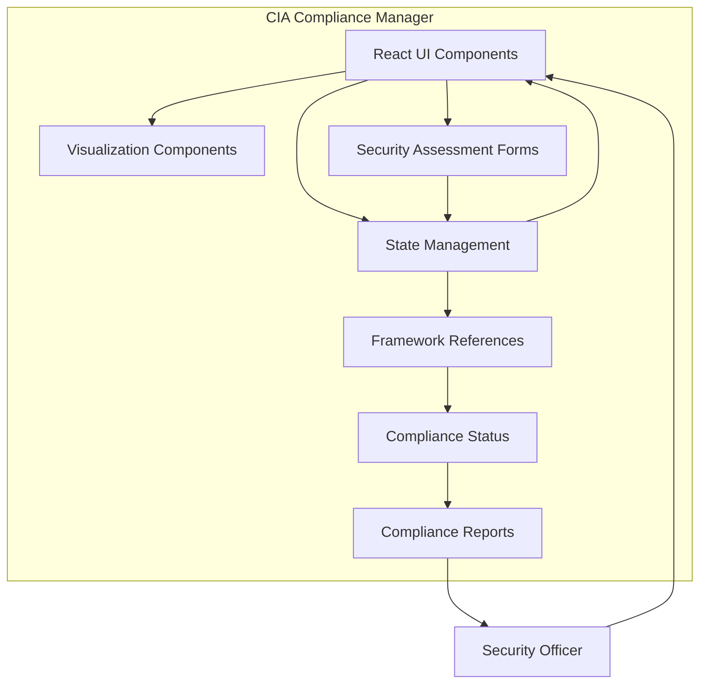

#  CIA Compliance Manager

The CIA Compliance Manager is a comprehensive application designed to help organizations assess, implement, and manage security controls across the CIA triad (Confidentiality, Integrity, and Availability). It provides detailed security assessments, cost estimation tools, business impact analysis, and technical implementation guidance to support organizations in achieving their security objectives within budget constraints.

## Try It Now!

Experience the CIA Compliance Manager in action by testing the application here: [CIA Compliance Manager Application](https://hack23.github.io/cia-compliance-manager/). See how it can help you enhance your organization's security posture today!

## Badges

[](https://github.com/Hack23/cia-compliance-manager/releases)
[](https://github.com/Hack23/cia-compliance-manager/raw/master/LICENSE.md)
[](https://app.fossa.io/projects/git%2Bgithub.com%2FHack23%2Fcia-compliance-manager?ref=badge_shield)
[](https://bestpractices.coreinfrastructure.org/projects/10365)
[](https://scorecard.dev/viewer/?uri=github.com/Hack23/cia-compliance-manager)
[](https://slsa.dev/spec/v1.0/levels)
[](https://github.com/Hack23/cia-compliance-manager/actions/workflows/release.yml)
[](https://github.com/Hack23/cia-compliance-manager/actions/workflows/scorecards.yml)
[](https://isitmaintained.com/project/Hack23/cia-compliance-manager "Average time to resolve an issue")
[](https://isitmaintained.com/project/Hack23/cia-compliance-manager "Percentage of issues still open")


## Executive Summary

### Security Level Summary

#### Basic

**Overview**: Minimal investment, low protection, and high risk of downtime or data breaches. Suitable for non-critical or public-facing systems.

**Business Impact Analysis**:

- **Availability Impact**: Frequent outages (up to 5% downtime annually) could result in lost revenue during business hours, customer frustration, and inefficient operations. For a medium-sized business, this could represent 18 days of disruption per year.
- **Integrity Impact**: Risk of data corruption or loss without proper backup could necessitate costly manual reconstruction, lead to erroneous business decisions, and potentially violate basic compliance requirements.
- **Confidentiality Impact**: Limited protection means sensitive information could be exposed, leading to competitive disadvantage, customer trust erosion, and potential regulatory penalties even for minimally regulated industries.

**Value Creation**:

- Satisfies minimum viable security for non-critical systems
- Minimal upfront costs allow budget allocation to revenue-generating activities
- Appropriate for public data and internal systems with negligible business impact if compromised

#### Moderate

**Overview**: A balanced approach to cost and protection, good for mid-sized companies that need compliance without overspending on redundant systems.

**Business Impact Analysis**:

- **Availability Impact**: Improved uptime (99% availability) limits disruptions to around 3.65 days per year, reducing lost revenue and maintaining operational continuity for most business functions. Recovery can typically be achieved within hours rather than days.
- **Integrity Impact**: Automated validation helps prevent most data corruption issues, preserving decision quality and reducing error correction costs. Basic audit trails support regulatory compliance for standard business operations.
- **Confidentiality Impact**: Standard encryption and access controls protect sensitive internal data from common threats, helping meet basic compliance requirements (GDPR, CCPA) and preserving customer trust.

**Value Creation**:

- Demonstrates security diligence to partners, customers, and regulators
- Reduces operational disruptions by 80% compared to Basic level
- Prevents common security incidents that could impact quarterly financial performance
- Provides competitive advantage over businesses with sub-standard security

#### High

**Overview**: Required for businesses where data integrity, uptime, and confidentiality are critical. High costs, but justified in regulated industries like finance, healthcare, or e-commerce.

**Business Impact Analysis**:

- **Availability Impact**: Near-continuous service (99.9% uptime) limits disruptions to less than 9 hours annually, preserving revenue streams, maintaining brand reputation, and ensuring customer satisfaction. Fast recovery capabilities maintain operational efficiency even during incidents.
- **Integrity Impact**: Immutable records and blockchain validation virtually eliminate data tampering and corruption risks, enabling high-confidence business decisions, supporting non-repudiation for transactions, and satisfying strict regulatory requirements.
- **Confidentiality Impact**: Robust protection for sensitive data prevents most breaches, avoiding regulatory penalties that could reach millions of dollars, preserving market valuation, and maintaining customer loyalty in competitive markets.

**Value Creation**:

- Enables expansion into highly regulated markets and industries
- Provides assurance to high-value customers with stringent security requirements
- Reduces insurance premiums through demonstrated security controls
- Minimizes breach-related costs that average $4.45 million per incident (2023 global average)
- Supports premium service offerings where security is a differentiator

#### Very High

**Overview**: Over-the-top protection and availability designed for mission-critical systems, such as those in defense or high-security finance. Extremely high CAPEX and OPEX.

**Business Impact Analysis**:

- **Availability Impact**: Continuous operation (99.99% uptime) with less than 1 hour of downtime annually preserves mission-critical functions, maintains cash flow during crisis events, and protects market position even during widespread disruptions. Future-proof architecture maintains operational capabilities despite evolving threats.
- **Integrity Impact**: Advanced cryptographic validation through smart contracts creates tamper-proof operational environments, essential for financial markets, defense systems, and critical infrastructure where data corruption could have catastrophic consequences including loss of life or national security implications.
- **Confidentiality Impact**: Military-grade protection with quantum-safe encryption safeguards against even state-sponsored attackers, protecting intellectual property worth billions, preventing corporate espionage, and ensuring continued operations in highly competitive global markets.

**Value Creation**:

- Enables participation in classified or highly restricted business opportunities
- Protects irreplaceable intellectual property and trade secrets that form company valuation
- Creates long-term trust with stakeholders including governments and regulated entities
- Provides resilience against catastrophic events that would destroy competitors
- Supports premium pricing models based on exceptional security guarantees

### Choosing the Right Level for Your Business

- **Low-Cost Solutions**: If your business doesn't handle sensitive data or rely heavily on real-time services, Basic options may suffice. However, be aware of the risks of downtime and data inaccuracy.
- **Balanced Approach**: For businesses with some regulatory requirements (e.g., GDPR, HIPAA), Moderate levels provide good protection at a reasonable cost.
- **High-Value Data or Uptime-Dependent Business**: If service availability or data accuracy is critical, or if you're in a regulated industry, consider High or Very High options.
- **Mission-Critical Systems**: For defense contractors, financial institutions, or businesses that cannot tolerate downtime, Very High levels with quantum-safe encryption and multi-site redundancy are essential.

### Business Impact Analysis

#### Purpose

The Business Impact Analysis (BIA) component helps organizations:

- Identify critical business functions and their dependencies
- Quantify financial and operational impacts of security incidents
- Establish recovery time objectives (RTOs) and recovery point objectives (RPOs)
- Prioritize security investments based on potential business impact
- Align security controls with business criticality

#### Results

A completed Business Impact Analysis provides:

- Clear visibility into which systems require higher security levels
- Quantifiable metrics for justifying security investments to stakeholders
- Risk-based approach to allocating security resources
- Documentation for compliance and regulatory requirements
- Foundation for disaster recovery and business continuity planning

## Core Concepts

### Security Assessment Framework

The application uses the CIA triad (Confidentiality, Integrity, and Availability) as its foundation for security assessment. Each component can be evaluated at different security levels:

- **None**: No security controls implemented
- **Basic**: Minimal security controls to address common threats
- **Moderate**: Standard security controls suitable for most business applications
- **High**: Enhanced security controls for sensitive systems and data
- **Very High**: Maximum security controls for critical systems and highly sensitive data

Each level includes specific controls, technical requirements, and implementation considerations that align with industry standards and best practices.

### Detailed CIA Triad Components

#### 1. Availability

| Level     | Description                                                    | CAPEX / OPEX | Business Impact                                                                                         | Technical Details                                                                                                                                                                                                                                                                                                                                                                                                                                                  |
| --------- | -------------------------------------------------------------- | ------------ | ------------------------------------------------------------------------------------------------------- | ------------------------------------------------------------------------------------------------------------------------------------------------------------------------------------------------------------------------------------------------------------------------------------------------------------------------------------------------------------------------------------------------------------------------------------------------------------------ |
| Basic     | Backup & Restore: Manual recovery, long RTO (~95% uptime)      | 5% / 5%      | Suitable for non-critical systems. Downtime can be costly for e-commerce and uptime-dependent services. | **Technical Implementation**: Manual backup procedures, basic recovery documentation, no redundancy.<br>**CAPEX Drivers**: Low initial investment in basic backup tools and minimal documentation.<br>**OPEX Drivers**: Manual monitoring, reactive troubleshooting, and recovery efforts as needed.                                                                                                                                                               |
| Moderate  | Pilot Light: Standby systems, automated recovery (~99% uptime) | 15% / 15%    | Works for mid-level critical systems, with faster recovery but some SPOFs remain.                       | **Technical Implementation**: Core systems pre-configured with automated recovery scripts, limited redundancy.<br>**CAPEX Drivers**: Redundant infrastructure components, automation tool licenses, initial configuration.<br>**OPEX Drivers**: Regular testing of failover processes, maintenance of standby systems, part-time monitoring.                                                                                                                       |
| High      | Warm Standby: Fast recovery, limited SPOFs (~99.9% uptime)     | 25% / 40%    | Ideal for businesses with high uptime needs, such as online retailers.                                  | **Technical Implementation**: Partially active redundant systems, real-time data replication, automated failover mechanisms.<br>**CAPEX Drivers**: Advanced replication technology, redundant hardware/cloud resources, high-bandwidth connections.<br>**OPEX Drivers**: 24/7 monitoring, regular failover testing, maintenance of parallel systems, specialized staff.                                                                                            |
| Very High | Multi-Site Active/Active: Real-time failover (~99.99% uptime)  | 60% / 70%    | Necessary for mission-critical industries (e.g., finance, healthcare). No SPOFs, continuous uptime.     | **Technical Implementation**: Fully redundant multi-region deployment, global load balancing, automatic failover with zero data loss.<br>**CAPEX Drivers**: Multiple identical infrastructures across geographic regions, advanced orchestration tools, complex networking equipment.<br>**OPEX Drivers**: Dedicated site reliability engineering team, continuous monitoring, regular cross-region testing, high bandwidth costs, complex maintenance procedures. |

#### 2. Integrity

| Level     | Description                                                      | CAPEX / OPEX | Business Impact                                                                                                | Technical Details                                                                                                                                                                                                                                                                                                                                                                                                                                     |
| --------- | ---------------------------------------------------------------- | ------------ | -------------------------------------------------------------------------------------------------------------- | ----------------------------------------------------------------------------------------------------------------------------------------------------------------------------------------------------------------------------------------------------------------------------------------------------------------------------------------------------------------------------------------------------------------------------------------------------- |
| Basic     | Manual Validation: Minimal checks, low auditability              | 5% / 10%     | Risk of data inaccuracies and compliance failures. Suitable for low-compliance businesses.                     | **Technical Implementation**: Manual data entry verification, basic access logs, simple backup strategies.<br>**CAPEX Drivers**: Minimal documentation systems, basic error checking tools.<br>**OPEX Drivers**: Manual audit procedures, error correction, and occasional compliance reviews.                                                                                                                                                        |
| Moderate  | Automated Validation: Enhanced accuracy and auditability         | 20% / 20%    | Meets basic compliance for industries like retail or general business (e.g., GDPR, SOX compliance).            | **Technical Implementation**: Automated data validation rules, audit logging systems, error detection mechanisms.<br>**CAPEX Drivers**: Data validation tools, audit software licenses, initial rule configuration.<br>**OPEX Drivers**: Regular review of validation rules, compliance reporting, log analysis, and error remediation.                                                                                                               |
| High      | Blockchain Validation: Immutable data records, high traceability | 35% / 50%    | Ideal for highly regulated industries (finance, healthcare). Provides full auditability and data immutability. | **Technical Implementation**: Distributed ledger solutions, cryptographic verification, complete audit trails.<br>**CAPEX Drivers**: Blockchain infrastructure, custom development, integration with existing systems, specialized software.<br>**OPEX Drivers**: High computing resources, specialized blockchain engineers, continuous verification processes, complex reporting mechanisms.                                                        |
| Very High | Smart Contracts: Real-time validation, full audit traceability   | 60% / 70%    | Perfect for industries needing full real-time data validation, like stock exchanges and defense contractors.   | **Technical Implementation**: Smart contract execution, automated governance rules, advanced cryptography, real-time compliance verification.<br>**CAPEX Drivers**: Advanced distributed systems, custom smart contract development, extensive integration efforts, regulatory review.<br>**OPEX Drivers**: Dedicated compliance teams, continuous smart contract monitoring, regular code audits, complex system upgrades, high computational costs. |

#### 3. Confidentiality

| Level     | Description                                                      | CAPEX / OPEX | Business Impact                                                                           | Technical Details                                                                                                                                                                                                                                                                                                                                                                                                                                                                                      |
| --------- | ---------------------------------------------------------------- | ------------ | ----------------------------------------------------------------------------------------- | ------------------------------------------------------------------------------------------------------------------------------------------------------------------------------------------------------------------------------------------------------------------------------------------------------------------------------------------------------------------------------------------------------------------------------------------------------------------------------------------------------ |
| Basic     | Public Data: No encryption or access control                     | 5% / 5%      | Suitable for public-facing data, no protection needed.                                    | **Technical Implementation**: Basic HTTPS, simple authentication, minimal access controls.<br>**CAPEX Drivers**: Standard SSL certificates, basic user management systems.<br>**OPEX Drivers**: Minimal maintenance, occasional credential management, basic security reviews.                                                                                                                                                                                                                         |
| Moderate  | Restricted Data: AES-256 encryption and basic monitoring         | 15% / 20%    | Works for sensitive internal data (e.g., HR files, internal documents).                   | **Technical Implementation**: Strong encryption at rest and in transit, role-based access control, security monitoring.<br>**CAPEX Drivers**: Encryption solutions, access management tools, security monitoring setup.<br>**OPEX Drivers**: Regular access reviews, key management, security event monitoring, user provisioning/deprovisioning.                                                                                                                                                      |
| High      | Confidential Data: MFA, robust encryption, continuous monitoring | 30% / 40%    | Essential for industries handling customer or financial data (e.g., banking, healthcare). | **Technical Implementation**: Multi-factor authentication systems, advanced encryption, SIEM solutions, DLP controls, privileged access management.<br>**CAPEX Drivers**: Enterprise security tools, MFA infrastructure, monitoring systems, integration with existing systems.<br>**OPEX Drivers**: 24/7 security operations, regular penetration testing, compliance audits, security training, dedicated security staff.                                                                            |
| Very High | Secret Data: Quantum-safe encryption, 24/7 monitoring            | 50% / 60%    | Required for highly classified data (e.g., military, government).                         | **Technical Implementation**: Quantum-resistant algorithms, hardware security modules, air-gapped systems, advanced threat detection, physical security controls.<br>**CAPEX Drivers**: Specialized encryption hardware, custom security solutions, secure facilities, advanced intrusion prevention systems.<br>**OPEX Drivers**: Dedicated security teams, continuous monitoring, regular security clearances, physical security staff, frequent algorithm updates, extensive compliance procedures. |

### Compliance Framework Mapping

For detailed mapping of all security controls to industry-standard frameworks (NIST 800-53 Rev. 5, NIST CSF 2.0, and ISO/IEC 27001:2022), see the [Control Mapping Documentation](docs/control-mapping.md). This comprehensive reference helps organizations:

- Align implemented controls with regulatory requirements
- Demonstrate compliance during audits
- Identify control gaps for specific frameworks
- Understand how technical controls satisfy multiple compliance needs simultaneously

### Technical Considerations

- **Availability**: Understanding SPOFs and autoscaling is critical. Moving from Basic to High removes single points of failure and introduces real-time failover capabilities.
- **Integrity**: The jump from manual validation to blockchain dramatically increases data accuracy and ensures immutability, vital for industries dealing with transactional data.
- **Confidentiality**: Moving from public data to secret data introduces quantum-safe encryption, an emerging need for high-security industries to safeguard against quantum computing threats.

### Cost Management

The application helps organizations understand and plan security investments through two main cost categories:

#### CAPEX (Capital Expenditure)

One-time investment costs including:

- Initial software development and engineering
- Infrastructure setup and configuration
- System design and architecture planning
- Initial implementation and deployment
- Hardware purchases and installation
- Security tool acquisition

#### OPEX (Operational Expenditure)

Ongoing operational costs including:

- Maintenance and system administration
- Security monitoring and incident response
- Technical support and help desk services
- Recurring infrastructure costs (cloud, hosting, etc.)
- Updates, patches, and security upgrades
- Compliance auditing and reporting
- Staff training and awareness programs

### Cost Estimation Framework

To provide accurate and consistent cost estimates, the CIA Compliance Manager uses a standardized framework that considers:

1. **Baseline IT Budget**: All CAPEX and OPEX percentages are calculated against the organization's total IT budget
2. **Implementation Timeline**: Costs are spread over an implementation period (typically 1-3 years)
3. **Industry Factors**: Cost multipliers for specific industries based on regulatory requirements
4. **Organization Size**: Scaling factors that adjust estimates based on company size and complexity
5. **Existing Infrastructure**: Credits for existing security controls that can be leveraged

The application provides both aggregated and detailed views of cost estimates, allowing decision-makers to:

- Compare different security level combinations
- Identify cost drivers and optimization opportunities
- Create multi-year security investment roadmaps
- Justify security investments with specific business benefits

## Features

- **Dynamic Security Assessment**: Configure and assess security requirements across the CIA triad
- **Cost Estimation Tools**: Calculate both CAPEX and OPEX based on selected security levels with detailed breakdown
- **Business Impact Analysis**: Evaluate potential impacts of security incidents on operations and quantify potential losses
- **Technical Implementation Guidance**: Detailed implementation recommendations for each security level with technology suggestions
- **Compliance Mapping**: Map controls to common compliance frameworks (GDPR, HIPAA, SOC2, etc.)
- **Customizable Security Levels**: Tailor security controls to your organization's specific needs and risk profile
- **Reporting and Documentation**: Generate comprehensive reports for stakeholders at technical and executive levels
- **ROI Calculator**: Measure return on investment for security implementations against potential breach costs

## 🏢 Business Overview

The CIA Compliance Manager is a comprehensive solution designed to help organizations manage and maintain compliance with various security frameworks and standards. The system focuses on the three core principles of information security:

- **Confidentiality**: Ensuring that information is accessible only to those authorized to have access
- **Integrity**: Maintaining the accuracy and completeness of data throughout its lifecycle
- **Availability**: Ensuring that information and systems are available when needed

## 🏛️ Architecture Overview

The CIA Compliance Manager is built with a modular React-based architecture that consists of:

1. **React Component Library and State Management** - Manages the assessment workflow, security state, and interface rendering
2. **Security Framework References and Constants** - Configuration for different compliance frameworks (NIST, ISO, SOC2, etc.)
3. **Dashboard Visualization Components** - Generates compliance visualizations, dashboards, and gap analyses
4. **TypeScript Type System and Interfaces** - Provides type-safe access to all functionality



For detailed architecture diagrams and documentation, see the [Architecture section](https://hack23.github.io/cia-compliance-manager/documentation.html#architecture) in our Documentation Portal. The project also includes [future architecture plans](https://github.com/Hack23/cia-compliance-manager/blob/main/docs/architecture/FUTURE_ARCHITECTURE.md) outlining the roadmap for upcoming enhancements.

### Module Dependencies

This diagram shows the relationship between different modules in the codebase:


## 🔒 Security Features

The application itself is built with security as a priority:

- **Role-Based Access Control** - Granular permissions for different user roles
- **Audit Logging** - Comprehensive logging of all system activities
- **Data Encryption** - All sensitive data is encrypted at rest and in transit
- **Secure Development** - Built following secure coding practices and regular security testing

For comprehensive security documentation, visit the [Security Documentation](https://hack23.github.io/cia-compliance-manager/documentation.html#security) in our Documentation Portal.

## 📚 Documentation Resources

The following resources are available in our [Documentation Portal](https://hack23.github.io/cia-compliance-manager/documentation.html):

| Resource                  | Description                                           | Link                                                                                         |
| ------------------------- | ----------------------------------------------------- | -------------------------------------------------------------------------------------------- |
| API Documentation         | Detailed API reference for all components             | [View](https://hack23.github.io/cia-compliance-manager/api)                                  |
| Architecture Diagrams     | C4 model diagrams and architecture documentation      | [View](/workspaces/cia-compliance-manager/docs/architecture/ARCHITECTURE.md)                 |
| Diagrams & Visualizations | UML and Mermaid diagrams showing system relationships | [View](https://hack23.github.io/cia-compliance-manager/diagrams)                             |
| Code Coverage             | Test coverage reports and metrics                     | [View](https://hack23.github.io/cia-compliance-manager/coverage)                             |
| Dependencies              | Visual representation of module dependencies          | [View](https://hack23.github.io/cia-compliance-manager/dependencies/module-dependencies.svg) |

## 📝 Key Documentation Sections

- [API Reference]s(https://hack23.github.io/cia-compliance-manager/api/) - For developers integrating with our API
  frameworks
- [Current Architecture](/workspaces/cia-compliance-manager/docs/architecture/ARCHITECTURE.md) - Current architecture documentation
- [Future Architecture](/workspaces/cia-compliance-manager/docs/architecture/FUTURE_ARCHITECTURE.md) - Planned architectural improvements
- [Performance Testing](/workspaces/cia-compliance-manager/docs/performance-testing.md) - Performance testing methodology and results

## 👥 Contributing

We welcome contributions to our documentation. Please see the [Contributing Guide](https://github.com/Hack23/cia-compliance-manager/blob/main/CONTRIBUTING.md) for more information.

## Project Technology Stack

| Category              | Technologies                                                                 | Support Status | Latest Version | EOL Notes                                                                                |
| --------------------- | ---------------------------------------------------------------------------- | -------------- | -------------- | ---------------------------------------------------------------------------------------- |
| Core Framework        | [React](https://www.npmjs.com/package/react)                                 | Active         | 19.x           | No official EOL policy, [supports N-2 versions](https://endoflife.date/react)            |
|                       | [TypeScript](https://www.npmjs.com/package/typescript)                       | Active         | 5.x            | [Older versions supported ~12 months](https://endoflife.date/typescript)                 |
| Data Visualization    | [Chart.js](https://www.npmjs.com/package/chart.js)                           | Active         | 4.x            | Community maintained, no formal EOL policy                                               |
| UI/Styling            | [TailwindCSS](https://www.npmjs.com/package/tailwindcss)                     | Active         | 4.x            | Major versions typically maintained for 1-2 years                                        |
|                       | [PostCSS](https://www.npmjs.com/package/postcss)                             | Active         | 8.x            | Community maintained, no formal EOL policy                                               |
| Build Tools           | [Vite](https://www.npmjs.com/package/vite)                                   | Active         | 6.x            | [Follows semver](https://endoflife.date/vite), minor versions supported until next minor |
| Testing               | [Vitest](https://www.npmjs.com/package/vitest)                               | Active         | 3.x            | Actively maintained with Vite compatibility                                              |
|                       | [Cypress](https://www.npmjs.com/package/cypress)                             | Active         | 14.x           | [Regular updates](https://endoflife.date/cypress), typically supports N-1 version        |
|                       | [Testing Library](https://www.npmjs.com/package/@testing-library/react)      | Active         | 16.x           | Community maintained, regular updates                                                    |
| Development Utilities | [Cross-env](https://www.npmjs.com/package/cross-env)                         | Active         | 7.x            | Stable utility, minimal updates needed                                                   |
|                       | [Start-server-and-test](https://www.npmjs.com/package/start-server-and-test) | Active         | 2.x            | Utility package, stable API                                                              |
| Runtime Requirements  | Node.js                                                                      | Required       | ≥22.0.0        | [Node 22 EOL: April 2027](https://endoflife.date/nodejs)                                 |
|                       | npm                                                                          | Required       | ≥10.8.2        | Follows Node.js support lifecycle                                                        |

## Widgets

The application offers several widgets to help manage and visualize security controls:

- **SecuritySummaryWidget**: Provides an overview of the current security posture
- **SecurityLevelWidget**: Allows selection of CIA security levels
- **ComplianceStatusWidget**: Shows compliance status with relevant frameworks
- **CostEstimationWidget**: Estimates implementation costs for security controls
- **ValueCreationWidget**: Shows business value created by security implementations
- **AvailabilityImpactWidget**: Details business impact of availability controls
- **IntegrityImpactWidget**: Details business impact of integrity controls
- **ConfidentialityImpactWidget**: Details business impact of confidentiality controls
- **TechnicalDetailsWidget**: Provides technical implementation details
- **BusinessImpactAnalysisWidget**: Analyzes business impact of security controls
- **SecurityResourcesWidget**: Shows resources relevant to security implementation

## Installation

### `npm start`

Runs the app in the development mode.\
Open [http://localhost:3000](http://localhost:3000) to view it in the browser.

The page will reload if you make edits.\
You will also see any lint errors in the console.

### `npm run build`

Builds the app for production to the `build` folder.\
It correctly bundles React in production mode and optimizes the build for the best performance.

The build is minified and the filenames include the hashes.\
Your app is ready to be deployed!

See the section about [deployment](https://vitejs.dev/guide/static-deploy.html) for more information.

## Learn More

You can learn more in the [Vite documentation](https://vitejs.dev/guide/).

To learn React, check out the [React documentation](https://reactjs.org/).

## Testing

The project implements comprehensive testing strategies to ensure reliability and quality:

### Unit Testing

The CIA Compliance Manager uses Vitest with React Testing Library for component testing. Our unit test approach follows these principles:

- Component isolation with mocked dependencies
- Constant-driven validation
- Test ID selection for reliable element selection
- Behavior verification focused on component functionality

For detailed information on unit test structure, categories, examples, and best practices, see our [Unit Test Plan](docs/UnitTestPlan.md).

### End-to-End Testing

End-to-end tests are implemented using Cypress and follow these core principles:

- User-centric testing with focus on key user flows
- Constant-driven selection for reliable element targeting
- Resilient testing with fallbacks and retry mechanisms
- Comprehensive coverage of both UI components and integrated functionality

For more information about E2E test organization, custom commands, test patterns, and best practices, see our [E2E Test Plan](docs/E2ETestPlan.md).

### Performance Testing

The application includes a comprehensive performance testing framework to ensure optimal user experience:

- Measurement of key operations and interactions
- Performance baseline configuration
- Reporting and visualization tools

For detailed information on performance testing methodology and tools, see our [Performance Testing Documentation](docs/performance-testing.md).

### Running Tests

```bash
# Run unit tests
npm run test

# Run end-to-end tests
npm run cypress:run

# Open Cypress UI for interactive testing
npm run cypress:open

# Run performance tests
npm run cypress:run:perf
```

## Project Governance

We're committed to making this project accessible, inclusive, and secure. Please review these important documents:

- [Contributing Guidelines](CONTRIBUTING.md) - How to contribute code and documentation
- [Code of Conduct](CODE_OF_CONDUCT.md) - Our standards for project participation
- [Security Policy](SECURITY.md) - How to report security vulnerabilities
- [License](LICENSE) - Project license details and terms
