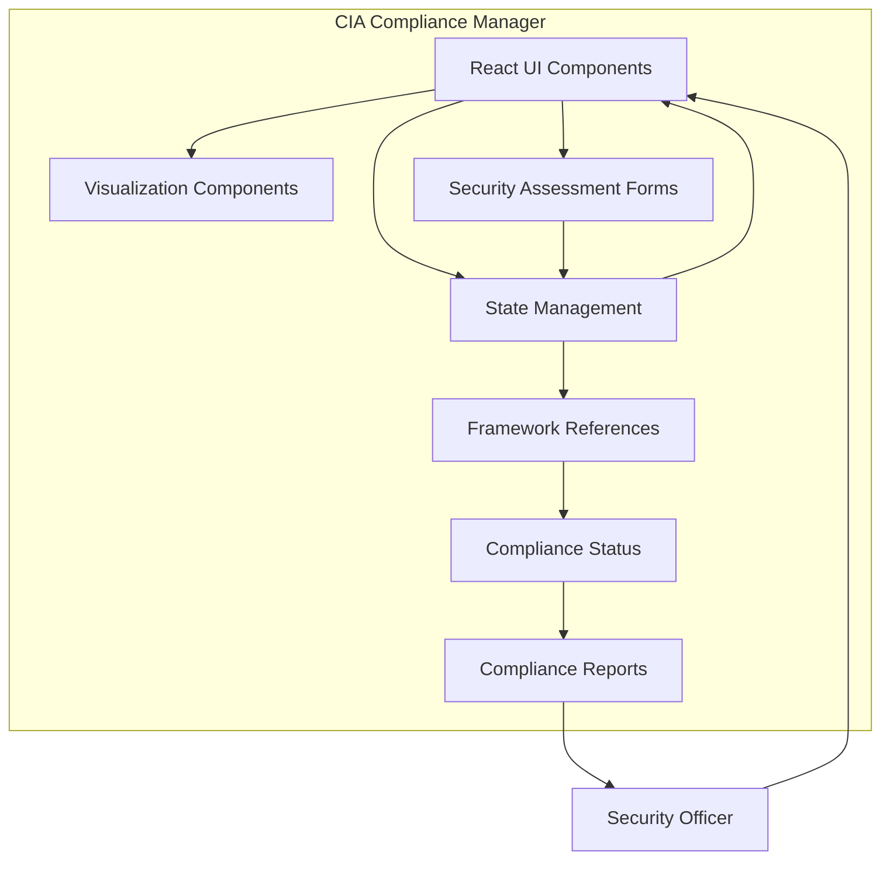

#  CIA Compliance Manager

The CIA Compliance Manager is a comprehensive application designed to help organizations assess, implement, and manage security controls across the CIA triad (Confidentiality, Integrity, and Availability). It provides detailed security assessments, cost estimation tools, business impact analysis, and technical implementation guidance to support organizations in achieving their security objectives within budget constraints.

## Try It Now!

Experience the CIA Compliance Manager in action by testing the application here: [CIA Compliance Manager Application](https://hack23.github.io/cia-compliance-manager/). See how it can help you enhance your organization's security posture today!

## Badges

[](https://github.com/Hack23/cia-compliance-manager/raw/master/LICENSE.md) [](https://scorecard.dev/viewer/?uri=github.com/Hack23/cia-compliance-manager)
[](https://github.com/Hack23/cia-compliance-manager/actions/workflows/scorecards.yml)

## 📑 Table of Contents

- [Executive Summary](#executive-summary)
- [Core Concepts](#core-concepts)
- [Features](#features)
- [Project Technology Stack](#project-technology-stack)
- [Recent Improvements](#recent-improvements)
- [Architecture Overview](#architecture-overview)
- [Documentation Resources](#documentation-resources)
- [Key Documentation Sections](#key-documentation-sections)
- [Widgets](#widgets)
- [Installation](#installation)
- [Testing](#testing)
- [Project Governance](#project-governance)

## 🏢 Business Overview

The CIA Compliance Manager is a comprehensive solution designed to help organizations manage and maintain compliance with various security frameworks and standards. The system focuses on the three core principles of information security:

- **Confidentiality**: Ensuring that information is accessible only to those authorized to have access
- **Integrity**: Maintaining the accuracy and completeness of data throughout its lifecycle
- **Availability**: Ensuring that information and systems are available when needed

## 🏛️ Architecture Overview

The CIA Compliance Manager is built with a modular React-based architecture that consists of:

1. **React Component Library and State Management** - Manages the assessment workflow, security state, and interface rendering
2. **Security Framework References and Constants** - Configuration for different compliance frameworks (NIST, ISO, SOC2, etc.)
3. **Dashboard Visualization Components** - Generates compliance visualizations, dashboards, and gap analyses
4. **TypeScript Type System and Interfaces** - Provides type-safe access to all functionality



For detailed architecture diagrams and documentation, see the [Architecture section](https://hack23.github.io/cia-compliance-manager/documentation.html#architecture) in our Documentation Portal. The project also includes [future architecture plans](https://github.com/Hack23/cia-compliance-manager/blob/main/docs/architecture/FUTURE_ARCHITECTURE.md) outlining the roadmap for upcoming enhancements.

### Module Dependencies

This diagram shows the relationship between different modules in the codebase:


## 🔒 Security Features

The application itself is built with security as a priority:

- **Role-Based Access Control** - Granular permissions for different user roles
- **Audit Logging** - Comprehensive logging of all system activities
- **Data Encryption** - All sensitive data is encrypted at rest and in transit
- **Secure Development** - Built following secure coding practices and regular security testing

For comprehensive security documentation, visit the [Security Documentation](https://hack23.github.io/cia-compliance-manager/documentation.html#security) in our Documentation Portal.

## 📚 Documentation Resources

The following resources are available in our [Documentation Portal](https://hack23.github.io/cia-compliance-manager/documentation.html):

| Resource                  | Description                                             | Link                                                                         |
| ------------------------- | ------------------------------------------------------- | ---------------------------------------------------------------------------- |
| API Documentation         | Detailed API reference for all components               | [View](https://hack23.github.io/cia-compliance-manager/api)                  |
| Architecture Diagrams     | C4 model diagrams and architecture documentation        | [View](https://hack23.github.io/cia-compliance-manager/architecture)         |
| Diagrams & Visualizations | UML and Mermaid diagrams showing system relationships   | [View](https://hack23.github.io/cia-compliance-manager/diagrams)             |
| Code Coverage             | Test coverage reports and metrics                       | [View](https://hack23.github.io/cia-compliance-manager/coverage)             |
| Project Documentation     | C4 model diagrams and other architectural documentation | [View](/workspaces/cia-compliance-manager/docs/architecture/ARCHITECTURE.md) |

## 📝 Key Documentation Sections

- [User Guide](https://github.com/Hack23/cia-compliance-manager/blob/main/docs/user-guide/README.md) - For end users of the system
- [Admin Guide](https://github.com/Hack23/cia-compliance-manager/blob/main/docs/admin-guide/README.md) - For system administrators
- [Integration Guide](https://github.com/Hack23/cia-compliance-manager/blob/main/docs/integration/README.md) - For connecting with other systems
- [API Reference](https://github.com/Hack23/cia-compliance-manager/blob/main/docs/api/README.md) - For developers integrating with our API
- [Security Documentation](https://github.com/Hack23/cia-compliance-manager/blob/main/docs/security/README.md) - Details on security features and certifications
- [Compliance Frameworks](https://github.com/Hack23/cia-compliance-manager/blob/main/docs/frameworks/README.md) - Documentation on supported compliance frameworks
- [Current Architecture](/workspaces/cia-compliance-manager/docs/architecture/ARCHITECTURE.md) - Current architecture documentation
- [Future Architecture](/workspaces/cia-compliance-manager/docs/architecture/FUTURE_ARCHITECTURE.md) - Planned architectural improvements
- [Performance Testing](/workspaces/cia-compliance-manager/docs/performance-testing.md) - Performance testing methodology and results

## 🚀 Getting Started

Please see our [Quick Start Guide](https://github.com/Hack23/cia-compliance-manager/blob/main/docs/getting-started.md) to begin using the CIA Compliance Manager.

## 👥 Contributing

We welcome contributions to our documentation. Please see the [Contributing Guide](https://github.com/Hack23/cia-compliance-manager/blob/main/docs/CONTRIBUTING.md) for more information.

## Project Technology Stack

| Category              | Technologies                                                                 | Support Status | Latest Version | EOL Notes                                                                                |
| --------------------- | ---------------------------------------------------------------------------- | -------------- | -------------- | ---------------------------------------------------------------------------------------- |
| Core Framework        | [React](https://www.npmjs.com/package/react)                                 | Active         | 19.x           | No official EOL policy, [supports N-2 versions](https://endoflife.date/react)            |
|                       | [TypeScript](https://www.npmjs.com/package/typescript)                       | Active         | 5.x            | [Older versions supported ~12 months](https://endoflife.date/typescript)                 |
| Data Visualization    | [Chart.js](https://www.npmjs.com/package/chart.js)                           | Active         | 4.x            | Community maintained, no formal EOL policy                                               |
| UI/Styling            | [TailwindCSS](https://www.npmjs.com/package/tailwindcss)                     | Active         | 4.x            | Major versions typically maintained for 1-2 years                                        |
|                       | [PostCSS](https://www.npmjs.com/package/postcss)                             | Active         | 8.x            | Community maintained, no formal EOL policy                                               |
| Build Tools           | [Vite](https://www.npmjs.com/package/vite)                                   | Active         | 6.x            | [Follows semver](https://endoflife.date/vite), minor versions supported until next minor |
| Testing               | [Vitest](https://www.npmjs.com/package/vitest)                               | Active         | 3.x            | Actively maintained with Vite compatibility                                              |
|                       | [Cypress](https://www.npmjs.com/package/cypress)                             | Active         | 14.x           | [Regular updates](https://endoflife.date/cypress), typically supports N-1 version        |
|                       | [Testing Library](https://www.npmjs.com/package/@testing-library/react)      | Active         | 16.x           | Community maintained, regular updates                                                    |
| Development Utilities | [Cross-env](https://www.npmjs.com/package/cross-env)                         | Active         | 7.x            | Stable utility, minimal updates needed                                                   |
|                       | [Start-server-and-test](https://www.npmjs.com/package/start-server-and-test) | Active         | 2.x            | Utility package, stable API                                                              |
| Runtime Requirements  | Node.js                                                                      | Required       | ≥20.0.0        | [Node 20 EOL: April 2026](https://endoflife.date/nodejs)                                 |
|                       | npm                                                                          | Required       | ≥10.8.2        | Follows Node.js support lifecycle                                                        |

## Widgets

The application offers several widgets to help manage and visualize security controls:

- **SecuritySummaryWidget**: Provides an overview of the current security posture
- **SecurityLevelWidget**: Allows selection of CIA security levels
- **ComplianceStatusWidget**: Shows compliance status with relevant frameworks
- **CostEstimationWidget**: Estimates implementation costs for security controls
- **ValueCreationWidget**: Shows business value created by security implementations
- **AvailabilityImpactWidget**: Details business impact of availability controls
- **IntegrityImpactWidget**: Details business impact of integrity controls
- **ConfidentialityImpactWidget**: Details business impact of confidentiality controls
- **TechnicalDetailsWidget**: Provides technical implementation details
- **BusinessImpactAnalysisWidget**: Analyzes business impact of security controls
- **SecurityResourcesWidget**: Shows resources relevant to security implementation

## Installation

### `npm start`

Runs the app in the development mode.\
Open [http://localhost:3000](http://localhost:3000) to view it in the browser.

The page will reload if you make edits.\
You will also see any lint errors in the console.

### `npm run build`

Builds the app for production to the `build` folder.\
It correctly bundles React in production mode and optimizes the build for the best performance.

The build is minified and the filenames include the hashes.\
Your app is ready to be deployed!

See the section about [deployment](https://vitejs.dev/guide/static-deploy.html) for more information.

## Learn More

You can learn more in the [Vite documentation](https://vitejs.dev/guide/).

To learn React, check out the [React documentation](https://reactjs.org/).

## Testing

The project implements comprehensive testing strategies to ensure reliability and quality:

### Unit Testing

The CIA Compliance Manager uses Vitest with React Testing Library for component testing. Our unit test approach follows these principles:

- Component isolation with mocked dependencies
- Constant-driven validation
- Test ID selection for reliable element selection
- Behavior verification focused on component functionality

For detailed information on unit test structure, categories, examples, and best practices, see our [Unit Test Plan](/workspaces/cia-compliance-manager/docs/UnitTestPlan.md).

### End-to-End Testing

End-to-end tests are implemented using Cypress and follow these core principles:

- User-centric testing with focus on key user flows
- Constant-driven selection for reliable element targeting
- Resilient testing with fallbacks and retry mechanisms
- Comprehensive coverage of both UI components and integrated functionality

For more information about E2E test organization, custom commands, test patterns, and best practices, see our [E2E Test Plan](/workspaces/cia-compliance-manager/docs/E2ETestPlan.md).

### Performance Testing

The application includes a comprehensive performance testing framework to ensure optimal user experience:

- Measurement of key operations and interactions
- Performance baseline configuration
- Reporting and visualization tools

For detailed information on performance testing methodology and tools, see our [Performance Testing Documentation](/workspaces/cia-compliance-manager/docs/performance-testing.md).

### Running Tests

```bash
# Run unit tests
npm run test

# Run end-to-end tests
npm run cypress:run

# Open Cypress UI for interactive testing
npm run cypress:open

# Run performance tests
npm run cypress:run:perf
```

## Project Governance

We're committed to making this project accessible, inclusive, and secure. Please review these important documents:

- [Contributing Guidelines](CONTRIBUTING.md) - How to contribute code and documentation
- [Code of Conduct](CODE_OF_CONDUCT.md) - Our standards for project participation
- [Security Policy](SECURITY.md) - How to report security vulnerabilities
- [License](LICENSE) - Project license details and terms
