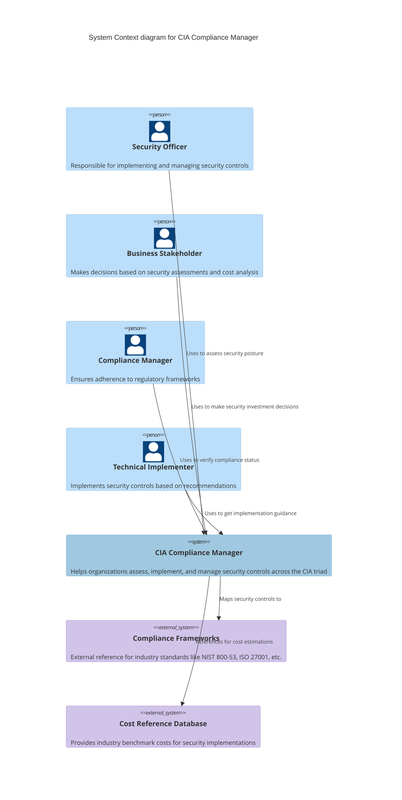
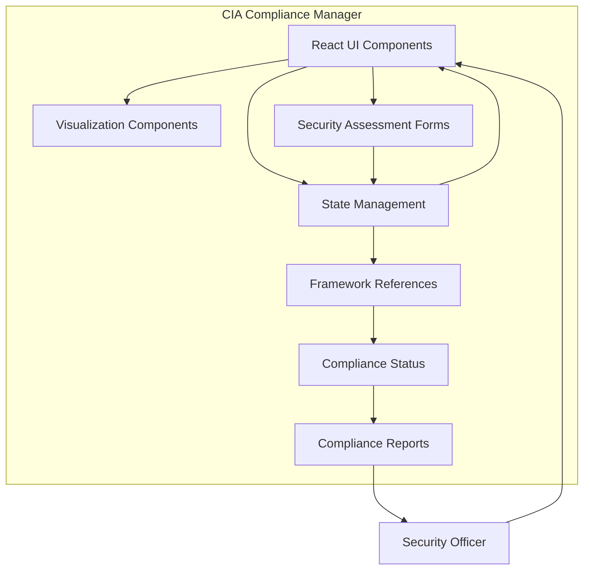

<p align="center">
  
</p>

<h1 align="center">📋 Hack23 AB — CIA Compliance Manager</h1>

<p align="center">
  <strong>🛡️ Security Through Transparency and Compliance Excellence</strong><br>
  <em>🎯 Enterprise-grade Compliance Assessment Platform</em>
</p>

<p align="center">
  <a href="#"></a>
  [](https://github.com/Hack23/cia-compliance-manager/releases)
  <a href="#"></a>
  <a href="#"></a>
</p>

**📋 Document Owner:** CEO | **📄 Version:** [](https://github.com/Hack23/cia-compliance-manager/releases) | **📅 Last Updated:** 2024-11-17 (UTC)  
**🔄 Review Cycle:** Quarterly | **⏰ Next Review:** 2025-02-17

---

## 🎯 **Purpose Statement**

The **CIA Compliance Manager** is a comprehensive application designed to help organizations assess, implement, and manage security controls across the CIA triad (Confidentiality, Integrity, and Availability). It provides detailed security assessments, cost estimation tools, business impact analysis, and technical implementation guidance to support organizations in achieving their security objectives within budget constraints.

This compliance tool demonstrates Hack23 AB's commitment to **security by design** and **transparency**, serving as both an operational platform and a live demonstration of our cybersecurity consulting expertise.

*— James Pether Sörling, CEO/Founder*

---

## Try It Now!

Experience the CIA Compliance Manager in action by testing the application here: [CIA Compliance Manager Application](https://hack23.github.io/cia-compliance-manager/). See how it can help you enhance your organization's security posture today!

---

## 🏆 Business Value & Strategic Impact

### 🎯 Project Classification
[](https://github.com/Hack23/ISMS-PUBLIC/blob/main/CLASSIFICATION.md#project-type-classifications)
[](https://github.com/Hack23/ISMS-PUBLIC/blob/main/CLASSIFICATION.md#project-type-classifications)

### 🔒 Security Classification
[](https://github.com/Hack23/ISMS-PUBLIC/blob/main/CLASSIFICATION.md#confidentiality-levels)
[](https://github.com/Hack23/ISMS-PUBLIC/blob/main/CLASSIFICATION.md#integrity-levels)
[](https://github.com/Hack23/ISMS-PUBLIC/blob/main/CLASSIFICATION.md#availability-levels)

### ⏱️ Business Continuity
[-yellow?style=for-the-badge&logo=clock&logoColor=white)](https://github.com/Hack23/ISMS-PUBLIC/blob/main/CLASSIFICATION.md#rto-classifications)
[-lightgreen?style=for-the-badge&logo=database&logoColor=white)](https://github.com/Hack23/ISMS-PUBLIC/blob/main/CLASSIFICATION.md#rpo-classifications)

### 💰 Business Impact Analysis Matrix

| Impact Category | Financial | Operational | Reputational | Regulatory |
|-----------------|-----------|-------------|--------------|------------|
| **🔒 Confidentiality** | [](https://github.com/Hack23/ISMS-PUBLIC/blob/main/CLASSIFICATION.md#financial-impact-levels) | [](https://github.com/Hack23/ISMS-PUBLIC/blob/main/CLASSIFICATION.md#operational-impact-levels) | [](https://github.com/Hack23/ISMS-PUBLIC/blob/main/CLASSIFICATION.md#reputational-impact-levels) | [](https://github.com/Hack23/ISMS-PUBLIC/blob/main/CLASSIFICATION.md#regulatory-impact-levels) |
| **✅ Integrity** | [](https://github.com/Hack23/ISMS-PUBLIC/blob/main/CLASSIFICATION.md#financial-impact-levels) | [](https://github.com/Hack23/ISMS-PUBLIC/blob/main/CLASSIFICATION.md#operational-impact-levels) | [](https://github.com/Hack23/ISMS-PUBLIC/blob/main/CLASSIFICATION.md#reputational-impact-levels) | [](https://github.com/Hack23/ISMS-PUBLIC/blob/main/CLASSIFICATION.md#regulatory-impact-levels) |
| **⏱️ Availability** | [](https://github.com/Hack23/ISMS-PUBLIC/blob/main/CLASSIFICATION.md#financial-impact-levels) | [](https://github.com/Hack23/ISMS-PUBLIC/blob/main/CLASSIFICATION.md#operational-impact-levels) | [](https://github.com/Hack23/ISMS-PUBLIC/blob/main/CLASSIFICATION.md#reputational-impact-levels) | [](https://github.com/Hack23/ISMS-PUBLIC/blob/main/CLASSIFICATION.md#regulatory-impact-levels) |

### 🛡️ Security Investment Returns
[](https://github.com/Hack23/ISMS-PUBLIC/blob/main/CLASSIFICATION.md#security-investment-returns)
[](https://github.com/Hack23/ISMS-PUBLIC/blob/main/CLASSIFICATION.md#security-investment-returns)
[](https://github.com/Hack23/ISMS-PUBLIC/blob/main/CLASSIFICATION.md#security-investment-returns)

### 🎯 Competitive Differentiation
[](https://github.com/Hack23/ISMS-PUBLIC/blob/main/CLASSIFICATION.md#competitive-differentiation)
[](https://github.com/Hack23/ISMS-PUBLIC/blob/main/CLASSIFICATION.md#competitive-differentiation)
[](https://github.com/Hack23/ISMS-PUBLIC/blob/main/CLASSIFICATION.md#competitive-differentiation)

### 📈 Porter's Five Forces Strategic Impact
[](https://github.com/Hack23/ISMS-PUBLIC/blob/main/CLASSIFICATION.md#porters-five-forces)
[](https://github.com/Hack23/ISMS-PUBLIC/blob/main/CLASSIFICATION.md#porters-five-forces)
[](https://github.com/Hack23/ISMS-PUBLIC/blob/main/CLASSIFICATION.md#porters-five-forces)
[](https://github.com/Hack23/ISMS-PUBLIC/blob/main/CLASSIFICATION.md#porters-five-forces)
[](https://github.com/Hack23/ISMS-PUBLIC/blob/main/CLASSIFICATION.md#porters-five-forces)

---

## 🌟 Key Features

<table>
<tr>
  <td width="33%">
    <h3>🔐 Security Level Assessment</h3>
    <p>Configure and assess security levels across all dimensions of the CIA triad to establish your security baseline.</p>
  </td>
  <td width="33%">
    <h3>📋 Compliance Mapping</h3>
    <p>Map security controls to frameworks like NIST, ISO, GDPR, HIPAA, SOC2, and PCI DSS.</p>
  </td>
  <td width="33%">
    <h3>📊 Business Impact Analysis</h3>
    <p>Analyze financial, operational, and regulatory impacts of your security measures.</p>
  </td>
</tr>
<tr>
  <td width="33%">
    <h3>💰 Cost Estimation</h3>
    <p>Estimate CAPEX and OPEX for security implementations to support ROI analysis and budget planning.</p>
  </td>
  <td width="33%">
    <h3>📈 Interactive Visualizations</h3>
    <p>View security data and compliance status through intuitive interactive charts and dashboards.</p>
  </td>
  <td width="33%">
    <h3>📝 Implementation Guidance</h3>
    <p>Access detailed guidance on deploying and optimizing security controls based on industry best practices.</p>
  </td>
</tr>
</table>

## 📝 Featured Blog Posts

Explore in-depth technical insights and architectural analysis from our expert contributors:

<table>
<tr>
  <td width="50%">
    <h3>⭐ Simon Moon's Architecture Chronicles</h3>
    <p><em>"The Pentagon as a geometric figure suggests five sides, five elements, five senses... Everything happens in fives."</em></p>
    <p><strong>System Architect extraordinaire.</strong> Numerologist. Philosopher-engineer. Pattern recognition expert. Simon Moon reveals the hidden structures in Hack23's products through the Law of Fives and sacred geometry.</p>
    <ul>
      <li>🏛️ <a href="https://hack23.com/blog-compliance-architecture.html">Compliance Manager Architecture</a> - CIA Triad meets sacred geometry</li>
      <li>🛡️ <a href="https://hack23.com/blog-compliance-security.html">Compliance Security Analysis</a> - STRIDE through five dimensions</li>
      <li>🔮 <a href="https://hack23.com/blog-compliance-future.html">Compliance Future Vision</a> - Context-aware security & adaptive defense</li>
    </ul>
    <p><strong><a href="https://hack23.com/blog.html#architecture-simon-moon">View All Architecture Chronicles →</a></strong></p>
  </td>
  <td width="50%">
    <h3>🔍 George Dorn's Code Analysis</h3>
    <p><em>"I cloned the repositories. I analyzed the actual code. Here's what's actually there."</em></p>
    <p><strong>Developer and technical analyst.</strong> George Dorn provides detailed repository deep-dives based on actual code inspection, not assumptions or documentation.</p>
    <ul>
      <li>🔐 <a href="https://hack23.com/blog-george-dorn-compliance-code.html">Compliance Manager Code Analysis</a> - TypeScript, React, zero-backend architecture</li>
      <li>💻 <a href="https://hack23.com/blog-compliance-architecture.html#george-dorn-client-side-reality">Client-Side Implementation Reality</a> - Defense through architectural simplification</li>
      <li>📊 <strong>Metrics:</strong> 220 TypeScript files, 4 runtime dependencies, 95% attack surface eliminated</li>
    </ul>
    <p><strong><a href="https://hack23.com/blog.html#george-dorn-code-analysis">View All Code Analysis →</a></strong></p>
  </td>
</tr>
</table>

<div align="center">
  <p><strong>🎯 Complete Blog Collection</strong></p>
  <p>Explore 50+ blog posts covering ISMS policies, security architecture, and Discordian security philosophy</p>
  <a href="https://hack23.com/blog.html">
    
  </a>
</div>

---

## Badges

[](https://github.com/Hack23/cia-compliance-manager/releases)
[](https://github.com/Hack23/cia-compliance-manager/raw/master/LICENSE.md)
[](https://app.fossa.io/projects/git%2Bgithub.com%2FHack23%2Fcia-compliance-manager?ref=badge_shield)
[](https://bestpractices.coreinfrastructure.org/projects/10365)
[](https://scorecard.dev/viewer/?uri=github.com/Hack23/cia-compliance-manager)
[](https://github.com/Hack23/cia-compliance-manager/attestations)
[](https://github.com/Hack23/cia-compliance-manager/actions/workflows/release.yml)
[](https://github.com/Hack23/cia-compliance-manager/actions/workflows/scorecards.yml)
[](https://isitmaintained.com/project/Hack23/cia-compliance-manager "Average time to resolve an issue")
[](https://isitmaintained.com/project/Hack23/cia-compliance-manager "Percentage of issues still open")
[](https://sonarcloud.io/summary/new_code?id=Hack23_cia-compliance-manager)
[](https://sonarcloud.io/summary/new_code?id=Hack23_cia-compliance-manager)
[](https://sonarcloud.io/summary/new_code?id=Hack23_cia-compliance-manager)
[](https://sonarcloud.io/summary/new_code?id=Hack23_cia-compliance-manager)
[](https://sonarcloud.io/summary/new_code?id=Hack23_cia-compliance-manager)
[](https://deepwiki.com/Hack23/cia-compliance-manager)

## 📊 Test Coverage & Quality

**Current Metrics** (Per [Secure Development Policy §4.1](https://github.com/Hack23/ISMS/blob/main/Secure_Development_Policy.md#-unit-test-coverage--quality)):

[](https://hack23.github.io/cia-compliance-manager/docs/coverage/)
[](https://hack23.github.io/cia-compliance-manager/docs/test-results/)
[](https://github.com/Hack23/cia-compliance-manager/blob/main/docs/UnitTestPlan.md)
[](https://hack23.github.io/cia-compliance-manager/cypress/mochawesome/)
[](https://github.com/Hack23/cia-compliance-manager/blob/main/docs/E2ETestPlan.md)
[](https://sonarcloud.io/summary/new_code?id=Hack23_cia-compliance-manager)

- **Statements**: 81.18% (Target: 80%+) ✅
- **Branches**: 73.1% (Target: 70%+) ✅
- **Functions**: 85.62% (Target: 80%+) ✅
- **Lines**: 81.7% (Target: 80%+) ✅

**🎯 ISMS Compliance Status**: All coverage thresholds now **MEET OR EXCEED** requirements for v1.0 release.

*Coverage reports are automatically generated and deployed with each release. View the [detailed coverage report](https://hack23.github.io/cia-compliance-manager/docs/coverage/) for line-by-line analysis.*

## ⚡ Performance & Optimization

**Performance Metrics** (Per [Secure Development Policy §8](https://github.com/Hack23/ISMS/blob/main/Secure_Development_Policy.md#-performance-testing--monitoring-framework)):

[](https://github.com/Hack23/cia-compliance-manager/blob/main/docs/performance-testing.md)
[-success?style=flat-square&logo=webpack&logoColor=white)](https://github.com/Hack23/cia-compliance-manager/blob/main/docs/performance-testing.md#-current-bundle-size-analysis)
[](https://github.com/Hack23/cia-compliance-manager/actions/workflows/lighthouse-performance.yml)

- **Total Bundle**: ~201 KB (gzip) ✅ (Target: <500 KB)
- **JavaScript**: ~188 KB (gzip) ⚠️ (Target: <180 KB - optimization recommended)
- **Stylesheets**: ~13 KB (gzip) ✅ (Target: <50 KB)
- **Load Time Target**: <2 seconds (GitHub Pages deployment)

*Comprehensive performance benchmarks, testing procedures, and optimization strategies are documented in [performance-testing.md](https://github.com/Hack23/cia-compliance-manager/blob/main/docs/performance-testing.md).*

## 🔐 Commitment to Transparency and Security

At Hack23 AB, we believe that true security comes through transparency and demonstrable practices. Our Information Security Management System (ISMS) is publicly available, showcasing our commitment to security excellence and organizational transparency.

<table>
  <tr>
    <td width="50%">
      <div align="center">
        <h3>📋 Public ISMS Repository</h3>
        <p>Complete Information Security Management System documentation</p>
        <a href="https://github.com/Hack23/ISMS-PUBLIC">
          
        </a>
      </div>
    </td>
    <td width="50%">
      <div align="center">
        <h3>🔒 Information Security Policy</h3>
        <p>Enterprise-grade security framework and governance</p>
        <a href="https://github.com/Hack23/ISMS-PUBLIC/blob/main/Information_Security_Policy.md">
          
        </a>
      </div>
    </td>
  </tr>
</table>

### 🏆 Security Through Transparency

Our approach to cybersecurity consulting is built on a foundation of transparent practices:

- **🔍 Open Documentation**: Complete ISMS framework available for review
- **📋 Policy Transparency**: Detailed security policies and procedures publicly accessible  
- **🎯 Demonstrable Expertise**: Our own security implementation serves as a live demonstration
- **🔄 Continuous Improvement**: Public documentation enables community feedback and enhancement

<div align="center">
  <p><em>"Our commitment to transparency extends to our security practices - demonstrating that true security comes from robust processes, continuous improvement, and a culture where security considerations are integrated into every business decision."</em></p>
  <p><strong>— James Pether Sörling, CEO/Founder</strong></p>
</div>

### 🛡️ CIA Compliance Manager: A Compliance Tool Built with Compliance

CIA Compliance Manager exemplifies our security-first approach by **practicing what it preaches**. This compliance assessment tool is itself built following comprehensive ISMS controls, demonstrating our cybersecurity consulting expertise through transparent implementation.

<table>
  <tr>
    <td width="33%">
      <div align="center">
        <h4>📊 Control Mapping</h4>
        <p>Comprehensive framework-to-ISMS-policy mapping</p>
        <a href="./control-mapping.md">
          
        </a>
      </div>
    </td>
    <td width="33%">
      <div align="center">
        <h4>🔐 ISMS Implementation</h4>
        <p>Documented security control implementation</p>
        <a href="./ISMS_IMPLEMENTATION_GUIDE.md">
          
        </a>
      </div>
    </td>
    <td width="33%">
      <div align="center">
        <h4>🛡️ CRA Compliance</h4>
        <p>EU Cyber Resilience Act assessment</p>
        <a href="./CRA-ASSESSMENT.md">
          
        </a>
      </div>
    </td>
  </tr>
</table>

#### 🎯 **ISMS Compliance Highlights**

Our implementation demonstrates security excellence across all critical domains:

- ✅ **Secure Development**: [80%+ test coverage](./docs/UnitTestPlan.md), automated security scanning, code review requirements
- ✅ **Supply Chain Security**: [SLSA Level 3 attestation](https://github.com/Hack23/cia-compliance-manager/attestations), SBOM generation, dependency scanning
- ✅ **Vulnerability Management**: [Zero critical/high vulnerabilities](https://github.com/Hack23/cia-compliance-manager/security), coordinated disclosure, 48h response SLA
- ✅ **Access Control**: GitHub RBAC, branch protection, least privilege enforcement
- ✅ **Change Management**: Git workflow, automated testing gates, release attestation
- ✅ **Incident Response**: P1-P4 classification, documented runbooks, 24h notification
- ✅ **Business Continuity**: RTO 4h / RPO 1h, automated backups, tested recovery procedures
- ✅ **Cryptography**: TLS 1.2+, signed releases, integrity verification
- ✅ **Monitoring**: [OpenSSF Scorecard](https://scorecard.dev/viewer/?uri=github.com/Hack23/cia-compliance-manager), [SonarCloud quality gates](https://sonarcloud.io/summary/new_code?id=Hack23_cia-compliance-manager), continuous security scanning

**📋 Complete Documentation:**
- **[Control Mapping](./control-mapping.md)** - Framework-to-ISMS-policy mappings (NIST, ISO, CIS)
- **[ISMS Implementation Guide](./ISMS_IMPLEMENTATION_GUIDE.md)** - Detailed security control implementation (790 lines)
- **[Traceability Matrix](./TRACEABILITY_MATRIX.md)** - End-to-end mapping from controls to evidence (100+ controls)
- **[CRA Assessment](./CRA-ASSESSMENT.md)** - EU Cyber Resilience Act compliance documentation

#### 📋 **Framework Alignment**

CIA Compliance Manager maps controls to multiple compliance frameworks:

| 🏛️ **Framework** | 📊 **Coverage** | 🔗 **Documentation** |
|------------------|----------------|---------------------|
| **NIST CSF 2.0** | ✅ Complete | [control-mapping.md](./control-mapping.md) |
| **ISO 27001:2022** | ✅ Complete | [control-mapping.md](./control-mapping.md) |
| **CIS Controls v8.1** | ✅ Complete | [control-mapping.md](./control-mapping.md) |
| **NIST 800-53 Rev. 5** | ✅ Complete | [control-mapping.md](./control-mapping.md) |
| **SLSA** | ✅ Level 3 | [Build Attestations](https://github.com/Hack23/cia-compliance-manager/attestations) |
| **CII Best Practices** | ✅ Passing | [](https://bestpractices.coreinfrastructure.org/projects/10365) |
| **EU CRA** | ✅ Self-Assessed | [CRA-ASSESSMENT.md](./CRA-ASSESSMENT.md) |

#### 🎯 **Why This Matters to You**

When you use CIA Compliance Manager, you're leveraging a tool that:

1. **🏆 Demonstrates Expertise** - Built by security practitioners who understand compliance deeply
2. **📊 Provides Evidence** - Every control mapped to frameworks AND operational implementation
3. **🔍 Enables Traceability** - See exactly how compliance requirements translate to security practices
4. **🤝 Builds Trust** - Transparent documentation shows we practice what we preach
5. **💡 Offers Best Practices** - Use our implementation as a reference for your own security journey

<div align="center">
  <h4>📚 Complete ISMS Documentation</h4>
  <p>Explore our comprehensive security control framework:</p>
  <a href="https://github.com/Hack23/ISMS-PUBLIC"></a>
</div>

---


## 📚 Architecture & Documentation

<table>
<tr>
  <td width="50%">
    <h3>🏛️ Current Architecture</h3>
    <p>C4 model showing current system containers, components, and dynamics of the CIA Compliance Manager.</p>
    <a href="https://github.com/Hack23/cia-compliance-manager/blob/main/docs/architecture/ARCHITECTURE.md">View Architecture</a>
  </td>
  <td width="50%">
    <h3>🏛️ Future Architecture</h3>
    <p>Vision for context-aware security posture management platform and future system evolution.</p>
    <a href="https://github.com/Hack23/cia-compliance-manager/blob/main/docs/architecture/FUTURE_ARCHITECTURE.md">View Future Architecture</a>
  </td>
</tr>
</table>

## Behavior Documentation

<table>
<tr>
  <td width="50%">
    <h3>🔄 State Diagrams</h3>
    <p>Security profile and compliance status state transitions for the current system implementation.</p>
    <a href="https://github.com/Hack23/cia-compliance-manager/blob/main/docs/architecture/STATEDIAGRAM.md">View State Diagrams</a>
  </td>
  <td width="50%">
    <h3>🔄 Future State Diagrams</h3>
    <p>Context-aware and adaptive security state transitions for future platform versions.</p>
    <a href="https://github.com/Hack23/cia-compliance-manager/blob/main/docs/architecture/FUTURE_STATEDIAGRAM.md">View Future States</a>
  </td>
</tr>
</table>

## Process Documentation

<table>
<tr>
  <td width="50%">
    <h3>🔄 Process Flowcharts</h3>
    <p>Security assessment and compliance workflows for the current implementation.</p>
    <a href="https://github.com/Hack23/cia-compliance-manager/blob/main/docs/architecture/FLOWCHART.md">View Flowcharts</a>
  </td>
  <td width="50%">
    <h3>🔄 Future Flowcharts</h3>
    <p>ML-enhanced and context-aware workflows planned for future releases.</p>
    <a href="https://github.com/Hack23/cia-compliance-manager/blob/main/docs/architecture/FUTURE_FLOWCHART.md">View Future Flows</a>
  </td>
</tr>
</table>

## Conceptual Documentation

<table>
<tr>
  <td width="50%">
    <h3>🧠 Concept Mindmaps</h3>
    <p>System structure and component relationships visualized through mind mapping.</p>
    <a href="https://github.com/Hack23/cia-compliance-manager/blob/main/docs/architecture/MINDMAP.md">View Mindmaps</a>
  </td>
  <td width="50%">
    <h3>🧠 Future Concept Maps</h3>
    <p>Evolution roadmap and capability expansion plans for future development.</p>
    <a href="https://github.com/Hack23/cia-compliance-manager/blob/main/docs/architecture/FUTURE_MINDMAP.md">View Future Concepts</a>
  </td>
</tr>
</table>

## Business Documentation

<table>
<tr>
  <td width="50%">
    <h3>💼 SWOT Analysis</h3>
    <p>Strategic strengths, weaknesses, opportunities, and threats for the current platform.</p>
    <a href="https://github.com/Hack23/cia-compliance-manager/blob/main/docs/architecture/SWOT.md">View SWOT Analysis</a>
  </td>
  <td width="50%">
    <h3>💼 Future SWOT</h3>
    <p>Strategic analysis of context-aware security platform and market positioning.</p>
    <a href="https://github.com/Hack23/cia-compliance-manager/blob/main/docs/architecture/FUTURE_SWOT.md">View Future SWOT</a>
  </td>
</tr>
</table>

## DevOps Documentation

<table>
<tr>
  <td width="50%">
    <h3>🔧 CI/CD Workflows</h3>
    <p>Build, test, and deployment automation for the current application architecture.</p>
    <a href="https://github.com/Hack23/cia-compliance-manager/blob/main/docs/architecture/WORKFLOWS.md">View CI/CD Workflows</a>
  </td>
  <td width="50%">
    <h3>🔧 Future Workflows</h3>
    <p>Advanced CI/CD with ML and security automation planned for future releases.</p>
    <a href="https://github.com/Hack23/cia-compliance-manager/blob/main/docs/architecture/FUTURE_WORKFLOWS.md">View Future DevOps</a>
  </td>
</tr>
</table>

## Data Architecture

<table>
<tr>
  <td width="50%">
    <h3>📊 Data Model</h3>
    <p>Current data architecture to support future platform capabilities.</p>
    <a href="https://github.com/Hack23/cia-compliance-manager/blob/main/docs/architecture/DATA_MODEL.md">View Data Architecture</a>
  </td>
  <td width="50%">
    <h3>📊 Future Data Model</h3>
    <p>Enhanced context-aware data architecture to support future platform capabilities.</p>
    <a href="https://github.com/Hack23/cia-compliance-manager/blob/main/docs/architecture/FUTURE_DATA_MODEL.md">View Data Architecture</a>
  </td>
</tr>
</table>

## 🧪 Testing & Quality

<table>
<tr>
  <td width="50%">
    <h3>🧪 Unit Tests</h3>
    <p>Visual representation of unit test results and coverage of the codebase.</p>
    <a href="https://hack23.github.io/cia-compliance-manager/docs/test-results">Test Results</a> •
    <a href="https://github.com/Hack23/cia-compliance-manager/blob/main/docs/UnitTestPlan.md">Test Plan</a>
  </td>
  <td width="50%">
    <h3>📊 Test Coverage</h3>
    <p>Test coverage reports showing how much of the codebase is covered by tests.</p>
    <a href="https://hack23.github.io/cia-compliance-manager/docs/coverage">View Coverage Report</a>
  </td>
</tr>
<tr>
  <td width="50%">
    <h3>🔍 E2E System Tests</h3>
    <p>End-to-end test reports showing full system validation results.</p>
    <a href="https://hack23.github.io/cia-compliance-manager/docs/cypress/mochawesome">View Test Report</a> •
    <a href="https://github.com/Hack23/cia-compliance-manager/blob/main/docs/E2ETestPlan.md">E2E Plan</a>
  </td>
  <td width="50%">
    <h3>⚡ Performance Tests</h3>
    <p>Benchmarks and performance analysis under various load conditions.</p>
    <a href="https://hack23.github.io/cia-compliance-manager/performance">View Performance Data</a>
  </td>
</tr>
</table>

## 📘 Additional Documentation

### 📘 API Documentation
Detailed API reference for all components, types, and functions in the application.

[View API Docs](https://hack23.github.io/cia-compliance-manager/api-docs)

### 🔄 Business Continuity
Comprehensive business continuity planning and recovery strategies aligned with CIA principles.

[View Interactive Plan](https://hack23.github.io/cia-compliance-manager/business-continuity) | [Markdown Version](https://github.com/Hack23/cia-compliance-manager/blob/main/docs/architecture/BCPPlan.md)

## 🔍 System Context



## Executive Summary

### Security Level Summary

#### Basic

**Overview**: Minimal investment, low protection, and high risk of downtime or data breaches. Suitable for non-critical or public-facing systems.

**Business Impact Analysis**:

- **Availability Impact**: Frequent outages (up to 5% downtime annually) could result in lost revenue during business hours, customer frustration, and inefficient operations. For a medium-sized business, this could represent 18 days of disruption per year.
- **Integrity Impact**: Risk of data corruption or loss without proper backup could necessitate costly manual reconstruction, lead to erroneous business decisions, and potentially violate basic compliance requirements.
- **Confidentiality Impact**: Limited protection means sensitive information could be exposed, leading to competitive disadvantage, customer trust erosion, and potential regulatory penalties even for minimally regulated industries.

**Value Creation**:

- Satisfies minimum viable security for non-critical systems
- Minimal upfront costs allow budget allocation to revenue-generating activities
- Appropriate for public data and internal systems with negligible business impact if compromised

#### Moderate

**Overview**: A balanced approach to cost and protection, good for mid-sized companies that need compliance without overspending on redundant systems.

**Business Impact Analysis**:

- **Availability Impact**: Improved uptime (99% availability) limits disruptions to around 3.65 days per year, reducing lost revenue and maintaining operational continuity for most business functions. Recovery can typically be achieved within hours rather than days.
- **Integrity Impact**: Automated validation helps prevent most data corruption issues, preserving decision quality and reducing error correction costs. Basic audit trails support regulatory compliance for standard business operations.
- **Confidentiality Impact**: Standard encryption and access controls protect sensitive internal data from common threats, helping meet basic compliance requirements (GDPR, CCPA) and preserving customer trust.

**Value Creation**:

- Demonstrates security diligence to partners, customers, and regulators
- Reduces operational disruptions by 80% compared to Basic level
- Prevents common security incidents that could impact quarterly financial performance
- Provides competitive advantage over businesses with sub-standard security

#### High

**Overview**: Required for businesses where data integrity, uptime, and confidentiality are critical. High costs, but justified in regulated industries like finance, healthcare, or e-commerce.

**Business Impact Analysis**:

- **Availability Impact**: Near-continuous service (99.9% uptime) limits disruptions to less than 9 hours annually, preserving revenue streams, maintaining brand reputation, and ensuring customer satisfaction. Fast recovery capabilities maintain operational efficiency even during incidents.
- **Integrity Impact**: Immutable records and blockchain validation virtually eliminate data tampering and corruption risks, enabling high-confidence business decisions, supporting non-repudiation for transactions, and satisfying strict regulatory requirements.
- **Confidentiality Impact**: Robust protection for sensitive data prevents most breaches, avoiding regulatory penalties that could reach millions of dollars, preserving market valuation, and maintaining customer loyalty in competitive markets.

**Value Creation**:

- Enables expansion into highly regulated markets and industries
- Provides assurance to high-value customers with stringent security requirements
- Reduces insurance premiums through demonstrated security controls
- Minimizes breach-related costs that average $4.45 million per incident (2023 global average)
- Supports premium service offerings where security is a differentiator

#### Very High

**Overview**: Over-the-top protection and availability designed for mission-critical systems, such as those in defense or high-security finance. Extremely high CAPEX and OPEX.

**Business Impact Analysis**:

- **Availability Impact**: Continuous operation (99.99% uptime) with less than 1 hour of downtime annually preserves mission-critical functions, maintains cash flow during crisis events, and protects market position even during widespread disruptions. Future-proof architecture maintains operational capabilities despite evolving threats.
- **Integrity Impact**: Advanced cryptographic validation through smart contracts creates tamper-proof operational environments, essential for financial markets, defense systems, and critical infrastructure where data corruption could have catastrophic consequences including loss of life or national security implications.
- **Confidentiality Impact**: Military-grade protection with quantum-safe encryption safeguards against even state-sponsored attackers, protecting intellectual property worth billions, preventing corporate espionage, and ensuring continued operations in highly competitive global markets.

**Value Creation**:

- Enables participation in classified or highly restricted business opportunities
- Protects irreplaceable intellectual property and trade secrets that form company valuation
- Creates long-term trust with stakeholders including governments and regulated entities
- Provides resilience against catastrophic events that would destroy competitors
- Supports premium pricing models based on exceptional security guarantees

### Choosing the Right Level for Your Business

- **Low-Cost Solutions**: If your business doesn't handle sensitive data or rely heavily on real-time services, Basic options may suffice. However, be aware of the risks of downtime and data inaccuracy.
- **Balanced Approach**: For businesses with some regulatory requirements (e.g., GDPR, HIPAA), Moderate levels provide good protection at a reasonable cost.
- **High-Value Data or Uptime-Dependent Business**: If service availability or data accuracy is critical, or if you're in a regulated industry, consider High or Very High options.
- **Mission-Critical Systems**: For defense contractors, financial institutions, or businesses that cannot tolerate downtime, Very High levels with quantum-safe encryption and multi-site redundancy are essential.

### Business Impact Analysis

#### Purpose

The Business Impact Analysis (BIA) component helps organizations:

- Identify critical business functions and their dependencies
- Quantify financial and operational impacts of security incidents
- Establish recovery time objectives (RTOs) and recovery point objectives (RPOs)
- Prioritize security investments based on potential business impact
- Align security controls with business criticality

#### Results

A completed Business Impact Analysis provides:

- Clear visibility into which systems require higher security levels
- Quantifiable metrics for justifying security investments to stakeholders
- Risk-based approach to allocating security resources
- Documentation for compliance and regulatory requirements
- Foundation for disaster recovery and business continuity planning

## Core Concepts

### Security Assessment Framework

The application uses the CIA triad (Confidentiality, Integrity, and Availability) as its foundation for security assessment. Each component can be evaluated at different security levels:

- **None**: No security controls implemented
- **Basic**: Minimal security controls to address common threats
- **Moderate**: Standard security controls suitable for most business applications
- **High**: Enhanced security controls for sensitive systems and data
- **Very High**: Maximum security controls for critical systems and highly sensitive data

Each level includes specific controls, technical requirements, and implementation considerations that align with industry standards and best practices.

### Detailed CIA Triad Components

#### 1. Availability

| Level     | Description                                                    | CAPEX / OPEX | Business Impact                                                                                         | Technical Details                                                                                                                                                                                                                                                                                                                                                                                                                                                  |
| --------- | -------------------------------------------------------------- | ------------ | ------------------------------------------------------------------------------------------------------- | ------------------------------------------------------------------------------------------------------------------------------------------------------------------------------------------------------------------------------------------------------------------------------------------------------------------------------------------------------------------------------------------------------------------------------------------------------------------ |
| Basic     | Backup & Restore: Manual recovery, long RTO (~95% uptime)      | 5% / 5%      | Suitable for non-critical systems. Downtime can be costly for e-commerce and uptime-dependent services. | **Technical Implementation**: Manual backup procedures, basic recovery documentation, no redundancy.<br>**CAPEX Drivers**: Low initial investment in basic backup tools and minimal documentation.<br>**OPEX Drivers**: Manual monitoring, reactive troubleshooting, and recovery efforts as needed.                                                                                                                                                               |
| Moderate  | Pilot Light: Standby systems, automated recovery (~99% uptime) | 15% / 15%    | Works for mid-level critical systems, with faster recovery but some SPOFs remain.                       | **Technical Implementation**: Core systems pre-configured with automated recovery scripts, limited redundancy.<br>**CAPEX Drivers**: Redundant infrastructure components, automation tool licenses, initial configuration.<br>**OPEX Drivers**: Regular testing of failover processes, maintenance of standby systems, part-time monitoring.                                                                                                                       |
| High      | Warm Standby: Fast recovery, limited SPOFs (~99.9% uptime)     | 25% / 40%    | Ideal for businesses with high uptime needs, such as online retailers.                                  | **Technical Implementation**: Partially active redundant systems, real-time data replication, automated failover mechanisms.<br>**CAPEX Drivers**: Advanced replication technology, redundant hardware/cloud resources, high-bandwidth connections.<br>**OPEX Drivers**: 24/7 monitoring, regular failover testing, maintenance of parallel systems, specialized staff.                                                                                            |
| Very High | Multi-Site Active/Active: Real-time failover (~99.99% uptime)  | 60% / 70%    | Necessary for mission-critical industries (e.g., finance, healthcare). No SPOFs, continuous uptime.     | **Technical Implementation**: Fully redundant multi-region deployment, global load balancing, automatic failover with zero data loss.<br>**CAPEX Drivers**: Multiple identical infrastructures across geographic regions, advanced orchestration tools, complex networking equipment.<br>**OPEX Drivers**: Dedicated site reliability engineering team, continuous monitoring, regular cross-region testing, high bandwidth costs, complex maintenance procedures. |

#### 2. Integrity

| Level     | Description                                                      | CAPEX / OPEX | Business Impact                                                                                                | Technical Details                                                                                                                                                                                                                                                                                                                                                                                                                                     |
| --------- | ---------------------------------------------------------------- | ------------ | -------------------------------------------------------------------------------------------------------------- | ----------------------------------------------------------------------------------------------------------------------------------------------------------------------------------------------------------------------------------------------------------------------------------------------------------------------------------------------------------------------------------------------------------------------------------------------------- |
| Basic     | Manual Validation: Minimal checks, low auditability              | 5% / 10%     | Risk of data inaccuracies and compliance failures. Suitable for low-compliance businesses.                     | **Technical Implementation**: Manual data entry verification, basic access logs, simple backup strategies.<br>**CAPEX Drivers**: Minimal documentation systems, basic error checking tools.<br>**OPEX Drivers**: Manual audit procedures, error correction, and occasional compliance reviews.                                                                                                                                                        |
| Moderate  | Automated Validation: Enhanced accuracy and auditability         | 20% / 20%    | Meets basic compliance for industries like retail or general business (e.g., GDPR, SOX compliance).            | **Technical Implementation**: Automated data validation rules, audit logging systems, error detection mechanisms.<br>**CAPEX Drivers**: Data validation tools, audit software licenses, initial rule configuration.<br>**OPEX Drivers**: Regular review of validation rules, compliance reporting, log analysis, and error remediation.                                                                                                               |
| High      | Blockchain Validation: Immutable data records, high traceability | 35% / 50%    | Ideal for highly regulated industries (finance, healthcare). Provides full auditability and data immutability. | **Technical Implementation**: Distributed ledger solutions, cryptographic verification, complete audit trails.<br>**CAPEX Drivers**: Blockchain infrastructure, custom development, integration with existing systems, specialized software.<br>**OPEX Drivers**: High computing resources, specialized blockchain engineers, continuous verification processes, complex reporting mechanisms.                                                        |
| Very High | Smart Contracts: Real-time validation, full audit traceability   | 60% / 70%    | Perfect for industries needing full real-time data validation, like stock exchanges and defense contractors.   | **Technical Implementation**: Smart contract execution, automated governance rules, advanced cryptography, real-time compliance verification.<br>**CAPEX Drivers**: Advanced distributed systems, custom smart contract development, extensive integration efforts, regulatory review.<br>**OPEX Drivers**: Dedicated compliance teams, continuous smart contract monitoring, regular code audits, complex system upgrades, high computational costs. |

#### 3. Confidentiality

| Level     | Description                                                      | CAPEX / OPEX | Business Impact                                                                           | Technical Details                                                                                                                                                                                                                                                                                                                                                                                                                                                                                      |
| --------- | ---------------------------------------------------------------- | ------------ | ----------------------------------------------------------------------------------------- | ------------------------------------------------------------------------------------------------------------------------------------------------------------------------------------------------------------------------------------------------------------------------------------------------------------------------------------------------------------------------------------------------------------------------------------------------------------------------------------------------------ |
| Basic     | Public Data: No encryption or access control                     | 5% / 5%      | Suitable for public-facing data, no protection needed.                                    | **Technical Implementation**: Basic HTTPS, simple authentication, minimal access controls.<br>**CAPEX Drivers**: Standard SSL certificates, basic user management systems.<br>**OPEX Drivers**: Minimal maintenance, occasional credential management, basic security reviews.                                                                                                                                                                                                                         |
| Moderate  | Restricted Data: AES-256 encryption and basic monitoring         | 15% / 20%    | Works for sensitive internal data (e.g., HR files, internal documents).                   | **Technical Implementation**: Strong encryption at rest and in transit, role-based access control, security monitoring.<br>**CAPEX Drivers**: Encryption solutions, access management tools, security monitoring setup.<br>**OPEX Drivers**: Regular access reviews, key management, security event monitoring, user provisioning/deprovisioning.                                                                                                                                                      |
| High      | Confidential Data: MFA, robust encryption, continuous monitoring | 30% / 40%    | Essential for industries handling customer or financial data (e.g., banking, healthcare). | **Technical Implementation**: Multi-factor authentication systems, advanced encryption, SIEM solutions, DLP controls, privileged access management.<br>**CAPEX Drivers**: Enterprise security tools, MFA infrastructure, monitoring systems, integration with existing systems.<br>**OPEX Drivers**: 24/7 security operations, regular penetration testing, compliance audits, security training, dedicated security staff.                                                                            |
| Very High | Secret Data: Quantum-safe encryption, 24/7 monitoring            | 50% / 60%    | Required for highly classified data (e.g., military, government).                         | **Technical Implementation**: Quantum-resistant algorithms, hardware security modules, air-gapped systems, advanced threat detection, physical security controls.<br>**CAPEX Drivers**: Specialized encryption hardware, custom security solutions, secure facilities, advanced intrusion prevention systems.<br>**OPEX Drivers**: Dedicated security teams, continuous monitoring, regular security clearances, physical security staff, frequent algorithm updates, extensive compliance procedures. |

### Compliance Framework Mapping

For detailed mapping of all security controls to industry-standard frameworks (NIST 800-53 Rev. 5, NIST CSF 2.0, and ISO/IEC 27001:2022), see the [Control Mapping Documentation](docs/control-mapping.md). This comprehensive reference helps organizations:

- Align implemented controls with regulatory requirements
- Demonstrate compliance during audits
- Identify control gaps for specific frameworks
- Understand how technical controls satisfy multiple compliance needs simultaneously

### Technical Considerations

- **Availability**: Understanding SPOFs and autoscaling is critical. Moving from Basic to High removes single points of failure and introduces real-time failover capabilities.
- **Integrity**: The jump from manual validation to blockchain dramatically increases data accuracy and ensures immutability, vital for industries dealing with transactional data.
- **Confidentiality**: Moving from public data to secret data introduces quantum-safe encryption, an emerging need for high-security industries to safeguard against quantum computing threats.

### Cost Management

The application helps organizations understand and plan security investments through two main cost categories:

#### CAPEX (Capital Expenditure)

One-time investment costs including:

- Initial software development and engineering
- Infrastructure setup and configuration
- System design and architecture planning
- Initial implementation and deployment
- Hardware purchases and installation
- Security tool acquisition

#### OPEX (Operational Expenditure)

Ongoing operational costs including:

- Maintenance and system administration
- Security monitoring and incident response
- Technical support and help desk services
- Recurring infrastructure costs (cloud, hosting, etc.)
- Updates, patches, and security upgrades
- Compliance auditing and reporting
- Staff training and awareness programs

### Cost Estimation Framework

To provide accurate and consistent cost estimates, the CIA Compliance Manager uses a standardized framework that considers:

1. **Baseline IT Budget**: All CAPEX and OPEX percentages are calculated against the organization's total IT budget
2. **Implementation Timeline**: Costs are spread over an implementation period (typically 1-3 years)
3. **Industry Factors**: Cost multipliers for specific industries based on regulatory requirements
4. **Organization Size**: Scaling factors that adjust estimates based on company size and complexity
5. **Existing Infrastructure**: Credits for existing security controls that can be leveraged

The application provides both aggregated and detailed views of cost estimates, allowing decision-makers to:

- Compare different security level combinations
- Identify cost drivers and optimization opportunities
- Create multi-year security investment roadmaps
- Justify security investments with specific business benefits

## Features

- **Dynamic Security Assessment**: Configure and assess security requirements across the CIA triad
- **Cost Estimation Tools**: Calculate both CAPEX and OPEX based on selected security levels with detailed breakdown
- **Business Impact Analysis**: Evaluate potential impacts of security incidents on operations and quantify potential losses
- **Technical Implementation Guidance**: Detailed implementation recommendations for each security level with technology suggestions
- **Compliance Mapping**: Map controls to common compliance frameworks (GDPR, HIPAA, SOC2, etc.)
- **Customizable Security Levels**: Tailor security controls to your organization's specific needs and risk profile
- **Reporting and Documentation**: Generate comprehensive reports for stakeholders at technical and executive levels
- **ROI Calculator**: Measure return on investment for security implementations against potential breach costs

## 🏢 Business Overview

The CIA Compliance Manager is a comprehensive solution designed to help organizations manage and maintain compliance with various security frameworks and standards. The system focuses on the three core principles of information security:

- **Confidentiality**: Ensuring that information is accessible only to those authorized to have access
- **Integrity**: Maintaining the accuracy and completeness of data throughout its lifecycle
- **Availability**: Ensuring that information and systems are available when needed

## 🏛️ Architecture Overview

The CIA Compliance Manager is built with a modular React-based architecture that consists of:

1. **React Component Library and State Management** - Manages the assessment workflow, security state, and interface rendering
2. **Security Framework References and Constants** - Configuration for different compliance frameworks (NIST, ISO, SOC2, etc.)
3. **Dashboard Visualization Components** - Generates compliance visualizations, dashboards, and gap analyses
4. **TypeScript Type System and Interfaces** - Provides type-safe access to all functionality



For detailed architecture diagrams and documentation, see the [Architecture section](https://hack23.github.io/cia-compliance-manager/documentation.html#architecture) in our Documentation Portal. The project also includes [future architecture plans](https://github.com/Hack23/cia-compliance-manager/blob/main/docs/architecture/FUTURE_ARCHITECTURE.md) outlining the roadmap for upcoming enhancements.

### Module Dependencies

This diagram shows the relationship between different modules in the codebase:


## 🔒 Security Features

The application itself is built with security as a priority:

- **Role-Based Access Control** - Granular permissions for different user roles
- **Audit Logging** - Comprehensive logging of all system activities
- **Data Encryption** - All sensitive data is encrypted at rest and in transit
- **Secure Development** - Built following secure coding practices and regular security testing

For comprehensive security documentation, visit the [Security Documentation](https://hack23.github.io/cia-compliance-manager/documentation.html#security) in our Documentation Portal.

## 📚 Documentation Resources

The following resources are available in our [Documentation Portal](https://hack23.github.io/cia-compliance-manager/documentation.html):

| Resource                  | Description                                           | Link                                                                                         |
| ------------------------- | ----------------------------------------------------- | -------------------------------------------------------------------------------------------- |
| API Documentation         | Detailed API reference for all components             | [View](https://hack23.github.io/cia-compliance-manager/api)                                  |
| Architecture Diagrams     | C4 model diagrams and architecture documentation      | [View](/workspaces/cia-compliance-manager/docs/architecture/ARCHITECTURE.md)                 |
| Diagrams & Visualizations | UML and Mermaid diagrams showing system relationships | [View](https://hack23.github.io/cia-compliance-manager/diagrams)                             |
| Code Coverage             | Test coverage reports and metrics                     | [View](https://hack23.github.io/cia-compliance-manager/docs/coverage)                        |
| Dependencies              | Visual representation of module dependencies          | [View](https://hack23.github.io/cia-compliance-manager/dependencies/module-dependencies.svg) |

## 📝 Key Documentation Sections

- [API Reference]s(https://hack23.github.io/cia-compliance-manager/api/) - For developers integrating with our API
  frameworks
- [Current Architecture](/workspaces/cia-compliance-manager/docs/architecture/ARCHITECTURE.md) - Current architecture documentation
- [Future Architecture](/workspaces/cia-compliance-manager/docs/architecture/FUTURE_ARCHITECTURE.md) - Planned architectural improvements
- [Performance Testing](/workspaces/cia-compliance-manager/docs/performance-testing.md) - Performance testing methodology and results

## 👥 Contributing

We welcome contributions to our documentation. Please see the [Contributing Guide](https://github.com/Hack23/cia-compliance-manager/blob/main/CONTRIBUTING.md) for more information.

## Project Technology Stack

| Category              | Technologies                                                                 | Support Status | Latest Version | EOL Notes                                                                                |
| --------------------- | ---------------------------------------------------------------------------- | -------------- | -------------- | ---------------------------------------------------------------------------------------- |
| Core Framework        | [React](https://www.npmjs.com/package/react)                                 | Active         | 19.x           | No official EOL policy, [supports N-2 versions](https://endoflife.date/react)            |
|                       | [TypeScript](https://www.npmjs.com/package/typescript)                       | Active         | 5.x            | [Older versions supported ~12 months](https://endoflife.date/typescript)                 |
| Data Visualization    | [Chart.js](https://www.npmjs.com/package/chart.js)                           | Active         | 4.x            | Community maintained, no formal EOL policy                                               |
| UI/Styling            | [TailwindCSS](https://www.npmjs.com/package/tailwindcss)                     | Active         | 4.x            | Major versions typically maintained for 1-2 years                                        |
|                       | [PostCSS](https://www.npmjs.com/package/postcss)                             | Active         | 8.x            | Community maintained, no formal EOL policy                                               |
| Build Tools           | [Vite](https://www.npmjs.com/package/vite)                                   | Active         | 6.x            | [Follows semver](https://endoflife.date/vite), minor versions supported until next minor |
| Testing               | [Vitest](https://www.npmjs.com/package/vitest)                               | Active         | 3.x            | Actively maintained with Vite compatibility                                              |
|                       | [Cypress](https://www.npmjs.com/package/cypress)                             | Active         | 14.x           | [Regular updates](https://endoflife.date/cypress), typically supports N-1 version        |
|                       | [Testing Library](https://www.npmjs.com/package/@testing-library/react)      | Active         | 16.x           | Community maintained, regular updates                                                    |
| Development Utilities | [Cross-env](https://www.npmjs.com/package/cross-env)                         | Active         | 7.x            | Stable utility, minimal updates needed                                                   |
|                       | [Start-server-and-test](https://www.npmjs.com/package/start-server-and-test) | Active         | 2.x            | Utility package, stable API                                                              |
| Runtime Requirements  | Node.js                                                                      | Required       | ≥24.0.0        | [Node 24 EOL: April 2028](https://endoflife.date/nodejs)                                 |
|                       | npm                                                                          | Required       | ≥11.0.0        | Follows Node.js support lifecycle                                                        |

## Widgets

The application offers several widgets to help manage and visualize security controls:

- **SecuritySummaryWidget**: Provides an overview of the current security posture
- **SecurityLevelWidget**: Allows selection of CIA security levels
- **ComplianceStatusWidget**: Shows compliance status with relevant frameworks
- **CostEstimationWidget**: Estimates implementation costs for security controls
- **ValueCreationWidget**: Shows business value created by security implementations
- **AvailabilityImpactWidget**: Details business impact of availability controls
- **IntegrityImpactWidget**: Details business impact of integrity controls
- **ConfidentialityImpactWidget**: Details business impact of confidentiality controls
- **TechnicalDetailsWidget**: Provides technical implementation details
- **BusinessImpactAnalysisWidget**: Analyzes business impact of security controls
- **SecurityResourcesWidget**: Shows resources relevant to security implementation

## Installation

### `npm start`

Runs the app in the development mode.\
Open [http://localhost:3000](http://localhost:3000) to view it in the browser.

The page will reload if you make edits.\
You will also see any lint errors in the console.

### `npm run build`

Builds the app for production to the `build` folder.\
It correctly bundles React in production mode and optimizes the build for the best performance.

The build is minified and the filenames include the hashes.\
Your app is ready to be deployed!

See the section about [deployment](https://vitejs.dev/guide/static-deploy.html) for more information.

## Learn More

You can learn more in the [Vite documentation](https://vitejs.dev/guide/).

To learn React, check out the [React documentation](https://reactjs.org/).

## Testing

The project implements comprehensive testing strategies to ensure reliability and quality:

### Unit Testing

The CIA Compliance Manager uses Vitest with React Testing Library for component testing. Our unit test approach follows these principles:

- Component isolation with mocked dependencies
- Constant-driven validation
- Test ID selection for reliable element selection
- Behavior verification focused on component functionality

For detailed information on unit test structure, categories, examples, and best practices, see our [Unit Test Plan](docs/UnitTestPlan.md).

### End-to-End Testing

End-to-end tests are implemented using Cypress and follow these core principles:

- User-centric testing with focus on key user flows
- Constant-driven selection for reliable element targeting
- Resilient testing with fallbacks and retry mechanisms
- Comprehensive coverage of both UI components and integrated functionality

For more information about E2E test organization, custom commands, test patterns, and best practices, see our [E2E Test Plan](docs/E2ETestPlan.md).

### Performance Testing

The application includes a comprehensive performance testing framework to ensure optimal user experience:

- Measurement of key operations and interactions
- Performance baseline configuration
- Reporting and visualization tools

For detailed information on performance testing methodology and tools, see our [Performance Testing Documentation](docs/performance-testing.md).

### Running Tests

```bash
# Run unit tests
npm run test

# Run end-to-end tests
npm run cypress:run

# Open Cypress UI for interactive testing
npm run cypress:open

# Run performance tests
npm run cypress:run:perf
```

## Project Governance

We're committed to making this project accessible, inclusive, and secure. Please review these important documents:

- [Contributing Guidelines](CONTRIBUTING.md) - How to contribute code and documentation
- [Code of Conduct](CODE_OF_CONDUCT.md) - Our standards for project participation
- [Security Policy](SECURITY.md) - How to report security vulnerabilities
- [License](LICENSE) - Project license details and terms

---

## 📚 Related Documents

### 🏛️ ISMS Framework & Governance
- [🔐 Information Security Policy](https://github.com/Hack23/ISMS-PUBLIC/blob/main/Information_Security_Policy.md) - Overall security framework
- [🏷️ Classification Framework](https://github.com/Hack23/ISMS-PUBLIC/blob/main/CLASSIFICATION.md) - Business impact and classification methodology
- [🛠️ Secure Development Policy](https://github.com/Hack23/ISMS-PUBLIC/blob/main/Secure_Development_Policy.md) - Development security standards
- [🎯 Threat Modeling Policy](https://github.com/Hack23/ISMS-PUBLIC/blob/main/Threat_Modeling.md) - STRIDE and MITRE ATT&CK framework
- [✅ Compliance Checklist](https://github.com/Hack23/ISMS-PUBLIC/blob/main/Compliance_Checklist.md) - Multi-framework compliance tracking

### 🔐 Security Architecture & Implementation
- [🏗️ Security Architecture](./docs/architecture/SECURITY_ARCHITECTURE.md) - Current security architecture with Mermaid diagrams
- [🔮 Future Security Architecture](./docs/architecture/FUTURE_SECURITY_ARCHITECTURE.md) - Planned security enhancements
- [🎯 Threat Model](./docs/architecture/THREAT_MODEL.md) - Comprehensive threat analysis
- [📋 Control Mapping](./control-mapping.md) - Framework-to-ISMS-policy mappings
- [📊 ISMS Implementation Guide](./ISMS_IMPLEMENTATION_GUIDE.md) - Detailed security control implementation
- [🔍 Traceability Matrix](./TRACEABILITY_MATRIX.md) - End-to-end control-to-evidence mapping

### 🔄 Operational Security
- [🔍 Vulnerability Management](https://github.com/Hack23/ISMS-PUBLIC/blob/main/Vulnerability_Management.md) - Security testing and remediation
- [🚨 Incident Response Plan](https://github.com/Hack23/ISMS-PUBLIC/blob/main/Incident_Response_Plan.md) - Security incident management
- [🔄 Business Continuity Plan](https://github.com/Hack23/ISMS-PUBLIC/blob/main/Business_Continuity_Plan.md) - Business resilience framework
- [💾 Backup & Recovery Policy](https://github.com/Hack23/ISMS-PUBLIC/blob/main/Backup_Recovery_Policy.md) - Data protection procedures

### 📊 Testing & Quality Assurance
- [📝 Unit Test Plan](./docs/UnitTestPlan.md) - Comprehensive unit testing strategy
- [🌐 E2E Test Plan](./docs/E2ETestPlan.md) - End-to-end testing methodology
- [⚡ Performance Testing](./docs/performance-testing.md) - Performance benchmarks and optimization

### 📜 Compliance & Regulatory
- [🛡️ EU Cyber Resilience Act Assessment](./CRA-ASSESSMENT.md) - CRA compliance documentation
- [🔐 Security Policy](./SECURITY.md) - Vulnerability disclosure and security contacts
- [📋 Privacy Policy](https://github.com/Hack23/ISMS-PUBLIC/blob/main/Privacy_Policy.md) - GDPR compliance framework

---

**📋 Document Control:**  
**✅ Approved by:** James Pether Sörling, CEO  
**📤 Distribution:** Public  
**🏷️ Classification:** [](https://github.com/Hack23/ISMS-PUBLIC/blob/main/CLASSIFICATION.md#confidentiality-levels)  
**📅 Effective Date:** 2024-11-17  
**⏰ Next Review:** 2025-02-17  
**🎯 Framework Compliance:** [](https://github.com/Hack23/ISMS-PUBLIC/blob/main/CLASSIFICATION.md) [](https://github.com/Hack23/ISMS-PUBLIC/blob/main/CLASSIFICATION.md) [](https://github.com/Hack23/ISMS-PUBLIC/blob/main/CLASSIFICATION.md) [](https://github.com/Hack23/ISMS-PUBLIC/blob/main/CLASSIFICATION.md)
