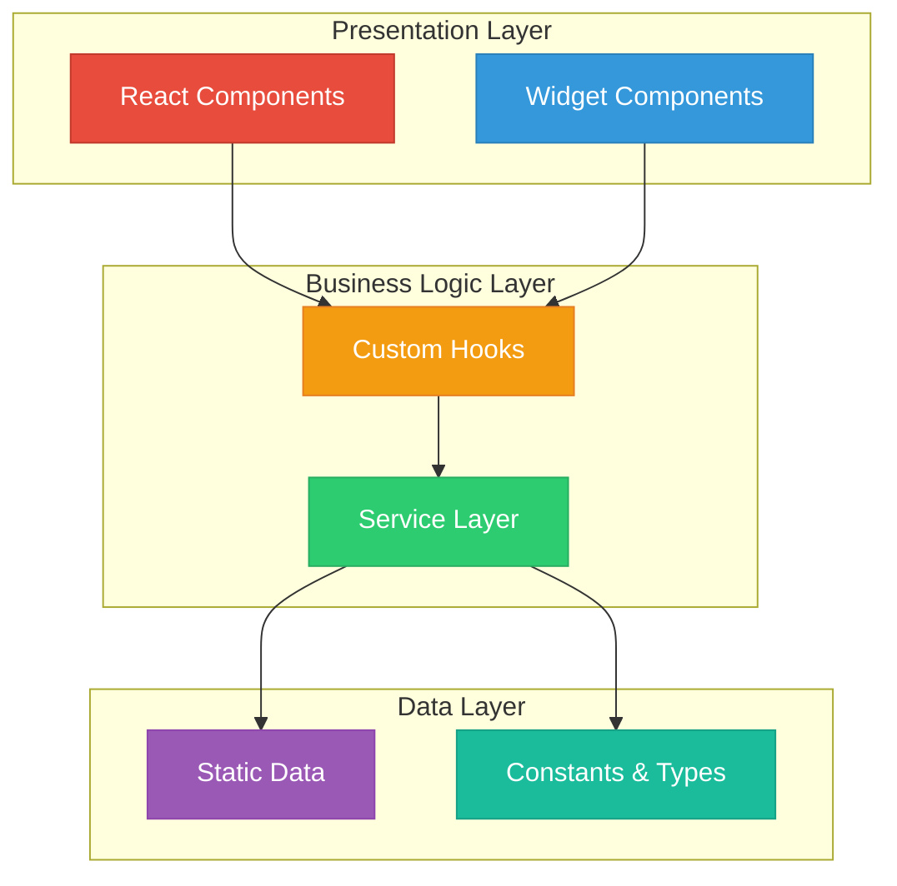

# 👨‍💻 Developer Guide - CIA Compliance Manager

**Version:** 1.1.0 | **Last Updated:** 2025-12-28 | **Status:** ✅ Production Ready

Welcome to the CIA Compliance Manager developer guide! This document provides comprehensive guidance for developers working on this project, from initial setup through advanced development patterns.

## 📚 Quick Navigation

- [Getting Started](#-getting-started)
- [Architecture Overview](#-architecture-overview)
- [Development Workflow](#-development-workflow)
- [Creating Widgets](#-creating-widgets)
- [Adding Services](#-adding-services)
- [Testing Strategy](#-testing-strategy)
- [Best Practices](#-best-practices)
- [Troubleshooting](#-troubleshooting)

## 🚀 Getting Started

### Prerequisites

Before you begin development, ensure you have the following installed:

| Tool | Version | Purpose |
|------|---------|---------|
| **Node.js** | ≥ 24.0.0 | JavaScript runtime |
| **npm** | ≥ 11.0.0 | Package manager |
| **Git** | Latest | Version control |

**Verify your installation:**

```bash
node --version  # Should be 24.x or higher
npm --version   # Should be 11.x or higher
git --version   # Any recent version
```

### Installation

1. **Clone the repository:**

```bash
git clone https://github.com/Hack23/cia-compliance-manager.git
cd cia-compliance-manager
```

2. **Install dependencies:**

```bash
npm ci  # Use 'ci' for reproducible builds
```

3. **Verify the installation:**

```bash
npm run lint    # Check code quality
npm run build   # Build the project
npm test        # Run tests
```

### Running Locally

**Development server:**

```bash
npm start
# or
npm run dev
```

The application will be available at [http://localhost:5173](http://localhost:5173)

**Production build:**

```bash
npm run build    # Build for production
npm run preview  # Preview production build
```

### Running Tests

```bash
# Unit tests (Vitest)
npm test                # Run all tests
npm run test:watch      # Watch mode
npm run coverage        # Generate coverage report

# E2E tests (Cypress)
npm run cypress:open    # Interactive mode
npm run cypress:run     # Headless mode
npm run test:e2e        # Full E2E test suite with server
```

## 🏗️ Architecture Overview

### Layered Architecture

The CIA Compliance Manager follows a layered architecture pattern:



### Project Structure

```
src/
├── application/           # Main application entry point
│   └── CIAClassificationApp.tsx
├── components/           # React components
│   ├── common/          # Reusable common components
│   ├── charts/          # Chart components
│   ├── widgets/         # Feature-specific widgets
│   │   ├── assessmentcenter/
│   │   ├── businessvalue/
│   │   ├── impactanalysis/
│   │   └── implementationguide/
│   └── index.ts         # Component exports
├── services/            # Business logic services
│   ├── BaseService.ts
│   ├── ciaContentService.ts
│   ├── businessImpactService.ts
│   ├── complianceService.ts
│   └── securityMetricsService.ts
├── hooks/               # Custom React hooks
│   ├── useCIAContentService.ts
│   ├── useComplianceService.ts
│   └── useSecurityMetricsService.ts
├── types/               # TypeScript type definitions
│   ├── cia.ts
│   ├── businessImpact.ts
│   ├── widgets.ts
│   └── compliance.ts
├── utils/               # Utility functions
│   ├── securityLevelUtils.ts
│   ├── riskUtils.ts
│   ├── formatUtils.ts
│   └── typeGuards.ts
├── constants/           # Application constants
│   ├── securityLevels.ts
│   ├── businessConstants.ts
│   ├── appConstants.ts
│   └── uiConstants.ts
└── data/                # Static data
    ├── security/
    │   ├── availabilityData.ts
    │   ├── integrityData.ts
    │   └── confidentialityData.ts
    └── riskImpactData.ts
```

### Core Concepts

#### CIA Triad

The foundation of the application is the CIA (Confidentiality, Integrity, Availability) security triad:

- **Confidentiality**: Ensures information is accessible only to authorized parties
- **Integrity**: Maintains data accuracy and completeness
- **Availability**: Ensures systems and data are accessible when needed

#### Security Levels

All components support five security levels:

| Level | Description | Use Case |
|-------|-------------|----------|
| **None** | No security controls | Public data, testing |
| **Low** | Basic security controls | Low-risk systems |
| **Moderate** | Standard security controls | General business systems |
| **High** | Enhanced security controls | Sensitive systems |
| **Very High** | Maximum security controls | Critical infrastructure |

#### Widget System

Widgets are self-contained UI components organized into four categories:

1. **Assessment Center**: Security assessment and analysis
2. **Business Value**: Cost, compliance, and value creation
3. **Impact Analysis**: CIA-specific impact details
4. **Implementation Guide**: Technical details and resources

## 💻 Development Workflow

### Creating a New Feature

1. **Create a feature branch:**

```bash
git checkout -b feature/your-feature-name
```

2. **Make changes following project standards:**
   - Use TypeScript strict mode
   - Follow existing naming conventions
   - Reuse existing types and utilities
   - Add tests for new functionality

3. **Run quality checks:**

```bash
npm run lint        # Check code style
npm run build       # Ensure build succeeds
npm run test        # Run unit tests
npm run coverage    # Check test coverage
```

4. **Commit your changes:**

```bash
git add .
git commit -m "feat: add new feature description"
```

Follow [Conventional Commits](https://www.conventionalcommits.org/):
- `feat:` - New features
- `fix:` - Bug fixes
- `docs:` - Documentation changes
- `test:` - Test additions/modifications
- `refactor:` - Code refactoring
- `style:` - Formatting changes
- `chore:` - Build/tooling changes

5. **Push and create a pull request:**

```bash
git push origin feature/your-feature-name
```

### Code Review Process

All changes must go through code review:

1. Create a pull request with clear description
2. Ensure all CI checks pass
3. Address reviewer feedback
4. Obtain approval from at least one maintainer
5. Squash and merge when approved

## 🧩 Creating Widgets

### Widget Structure

All widgets should follow this pattern:

```typescript
import React from 'react';
import { WidgetContainer } from '../../common/WidgetContainer';
import { SecurityLevel } from '../../../types/cia';

/**
 * Props for YourWidget component
 */
export interface YourWidgetProps {
  /** Current confidentiality level */
  confidentiality: SecurityLevel;
  /** Current integrity level */
  integrity: SecurityLevel;
  /** Current availability level */
  availability: SecurityLevel;
  /** Optional CSS class name */
  className?: string;
}

/**
 * Your widget description
 * 
 * This widget provides [functionality description].
 * 
 * @example
 * ```tsx
 * <YourWidget
 *   confidentiality="High"
 *   integrity="Moderate"
 *   availability="High"
 * />
 * ```
 */
export const YourWidget: React.FC<YourWidgetProps> = ({
  confidentiality,
  integrity,
  availability,
  className,
}) => {
  return (
    <WidgetContainer
      title="Your Widget Title"
      icon="🔒"
      testId="your-widget"
      className={className}
    >
      {/* Widget content */}
    </WidgetContainer>
  );
};
```

### Widget Best Practices

1. **Use WidgetContainer**: Wrap all widgets in the standard `WidgetContainer`
2. **Add test IDs**: Use the `testIds` constant for consistent test targeting
3. **Handle errors**: Implement error boundaries for graceful degradation
4. **Optimize performance**: Use `React.memo()` for expensive renders
5. **Document props**: Add JSDoc comments for all props
6. **Add examples**: Include usage examples in JSDoc

### Adding a New Widget

1. **Create the widget file:**

```bash
# Choose the appropriate category
src/components/widgets/{category}/YourWidget.tsx
```

2. **Define the props interface** in `src/types/widget-props.ts`:

```typescript
export interface YourWidgetProps {
  confidentiality: SecurityLevel;
  integrity: SecurityLevel;
  availability: SecurityLevel;
  className?: string;
}
```

3. **Implement the widget** following the structure above

4. **Add tests** in `YourWidget.test.tsx`:

```typescript
import { render, screen } from '@testing-library/react';
import { YourWidget } from './YourWidget';

describe('YourWidget', () => {
  it('renders with default props', () => {
    render(
      <YourWidget
        confidentiality="Moderate"
        integrity="Moderate"
        availability="Moderate"
      />
    );
    expect(screen.getByTestId('your-widget')).toBeInTheDocument();
  });
});
```

5. **Export the widget** in `src/components/widgets/index.ts`

6. **Update documentation** in `docs/architecture/WIDGET_ANALYSIS.md`

## 🔧 Adding Services

### Service Pattern

All services extend `BaseService`:

```typescript
import { BaseService } from './BaseService';
import { CIADataProvider } from '../types/cia-services';
import { SecurityLevel } from '../types/cia';

/**
 * Your service description
 * 
 * This service provides [functionality description].
 * 
 * @example
 * ```typescript
 * const service = new YourService(dataProvider);
 * const result = service.yourMethod('High');
 * ```
 */
export class YourService extends BaseService {
  public readonly name = 'YourService';

  constructor(dataProvider: CIADataProvider) {
    super(dataProvider);
  }

  /**
   * Your method description
   * 
   * @param level - Security level to process
   * @returns Processed result
   * 
   * @example
   * ```typescript
   * const result = service.yourMethod('High');
   * console.log(result);
   * ```
   */
  public yourMethod(level: SecurityLevel): string {
    this.validateSecurityLevel(level);
    // Implementation
    return 'result';
  }
}
```

### Service Best Practices

1. **Extend BaseService**: Inherit common functionality
2. **Use validation**: Call `validateSecurityLevel()` and `validateComponent()`
3. **Handle errors**: Return `undefined` or default values instead of throwing
4. **Add examples**: Include JSDoc examples for all public methods
5. **Write tests**: Comprehensive unit tests for all methods

### Creating a Custom Hook

Wrap services in custom hooks for React components:

```typescript
import { useMemo } from 'react';
import { YourService } from '../services/YourService';
import { useCIADataProvider } from './useCIADataProvider';

/**
 * Hook for accessing YourService
 * 
 * @returns YourService instance
 * 
 * @example
 * ```typescript
 * const service = useYourService();
 * const result = service.yourMethod('High');
 * ```
 */
export function useYourService(): YourService {
  const dataProvider = useCIADataProvider();
  
  return useMemo(
    () => new YourService(dataProvider),
    [dataProvider]
  );
}
```

## 🧪 Testing Strategy

### Unit Testing (Vitest)

**Test file naming:** `ComponentName.test.tsx` or `serviceName.test.ts`

**Test structure:**

```typescript
import { describe, it, expect } from 'vitest';
import { YourService } from './YourService';

describe('YourService', () => {
  describe('yourMethod', () => {
    it('should return expected result for valid input', () => {
      const service = new YourService(mockDataProvider);
      const result = service.yourMethod('High');
      expect(result).toBe('expected');
    });

    it('should handle invalid input gracefully', () => {
      const service = new YourService(mockDataProvider);
      const result = service.yourMethod('Invalid' as any);
      expect(result).toBe('default');
    });
  });
});
```

**Coverage requirements:**
- Statements: 80%+
- Branches: 70%+
- Functions: 80%+
- Lines: 80%+

### E2E Testing (Cypress)

**Test file naming:** `feature-name.cy.ts`

**Test structure:**

```typescript
describe('Your Feature', () => {
  beforeEach(() => {
    cy.visit('/');
  });

  it('should perform expected action', () => {
    cy.getByTestId('your-widget').should('be.visible');
    cy.getByTestId('your-button').click();
    cy.getByTestId('result').should('contain', 'Expected Result');
  });
});
```

### Testing Best Practices

1. **Use test IDs**: Always use `data-testid` attributes from constants
2. **Test behavior**: Focus on what users see and do
3. **Mock dependencies**: Use mock data providers for services
4. **Test edge cases**: Include invalid inputs and error scenarios
5. **Maintain coverage**: Keep coverage above thresholds

## 📏 Best Practices

### TypeScript Patterns

1. **Strict typing**: Enable all TypeScript strict options
2. **Avoid `any`**: Use `unknown` if type is truly unknown
3. **Use type guards**: Implement type guards for runtime validation
4. **Define return types**: Always specify function return types
5. **Use utility types**: Leverage `Pick`, `Omit`, `Partial`, etc.

```typescript
// ✅ Good
function processLevel(level: SecurityLevel): string {
  // Implementation
}

// ❌ Bad
function processLevel(level: any): any {
  // Implementation
}
```

### React Patterns

1. **Functional components**: Use functional components with hooks
2. **Props interfaces**: Define clear prop interfaces
3. **Memoization**: Use `React.memo()` for expensive components
4. **Error boundaries**: Implement error boundaries for robustness
5. **Accessibility**: Include ARIA attributes and semantic HTML

```typescript
// ✅ Good
export const MyComponent: React.FC<MyComponentProps> = React.memo(({
  prop1,
  prop2,
}) => {
  return <div role="region" aria-label="My Component">...</div>;
});

// ❌ Bad
export function MyComponent(props: any) {
  return <div>...</div>;
}
```

### Reusability Standards

**Always reuse existing code:**

1. **Types**: Use types from `src/types/`
2. **Constants**: Use constants from `src/constants/`
3. **Utilities**: Use utilities from `src/utils/`
4. **Components**: Extend existing components
5. **Services**: Build on `BaseService`

```typescript
// ✅ Good - Reusing existing types and constants
import { SecurityLevel } from '../types/cia';
import { SECURITY_LEVELS } from '../constants/securityLevels';

// ❌ Bad - Defining new types
type MySecurityLevel = 'high' | 'low';
```

### Performance Considerations

1. **Code splitting**: Use dynamic imports for large components
2. **Lazy loading**: Defer non-critical component loading
3. **Memoization**: Cache expensive calculations
4. **Bundle size**: Monitor bundle size with `budget.json`
5. **Tree shaking**: Ensure imports support tree shaking

## 🔧 Troubleshooting

### Common Issues

#### Build Errors

**Issue:** TypeScript compilation errors

```bash
# Clear cache and rebuild
rm -rf node_modules dist
npm ci
npm run build
```

**Issue:** Vite build fails

```bash
# Check Vite configuration
npx vite --help
# Review vite.config.ts for issues
```

#### Test Failures

**Issue:** Tests fail locally but pass in CI

```bash
# Ensure clean test environment
npm run test -- --no-cache
# Check for environment-specific issues
```

**Issue:** Cypress tests timeout

```bash
# Increase timeout in cypress.config.ts
# Check server is running on correct port
npm run dev  # In separate terminal
npm run cypress:open
```

#### Development Server Issues

**Issue:** Port already in use

```bash
# Kill process on port 5173
lsof -ti:5173 | xargs kill -9
# Or use different port
vite --port 5174
```

### Getting Help

1. **Check documentation**: Review existing docs in `docs/`
2. **Search issues**: Look for similar issues on GitHub
3. **Ask in discussions**: Use GitHub Discussions for questions
4. **Create an issue**: If you found a bug, create an issue

## 📚 Additional Resources

### Documentation

- [Architecture Overview](architecture/ARCHITECTURE.md)
- [Widget Analysis](architecture/WIDGET_ANALYSIS.md)
- [Unit Test Plan](UnitTestPlan.md)
- [E2E Test Plan](E2ETestPlan.md)
- [API Documentation](https://hack23.github.io/cia-compliance-manager/api-docs)

### External Resources

- [React Documentation](https://react.dev)
- [TypeScript Handbook](https://www.typescriptlang.org/docs/)
- [Vite Guide](https://vitejs.dev/guide/)
- [Vitest Documentation](https://vitest.dev)
- [Cypress Documentation](https://docs.cypress.io)

### ISMS & Security

- [Secure Development Policy](https://github.com/Hack23/ISMS-PUBLIC/blob/main/Secure_Development_Policy.md)
- [Classification Framework](https://github.com/Hack23/ISMS-PUBLIC/blob/main/CLASSIFICATION.md)
- [ISMS Implementation Guide](../ISMS_IMPLEMENTATION_GUIDE.md)

---

**Document Control:**  
**✅ Approved by:** Documentation Team  
**📤 Distribution:** Public  
**🏷️ Classification:** Public  
**📅 Effective Date:** 2025-12-28  
**⏰ Next Review:** 2026-03-28  
**🎯 Framework Compliance:** ISO 27001, NIST CSF 2.0
