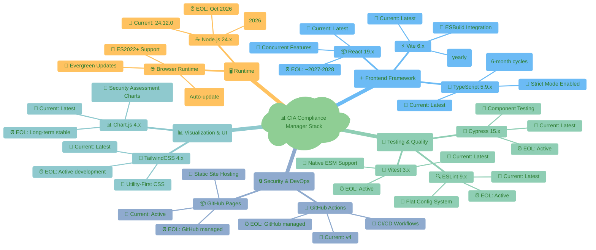
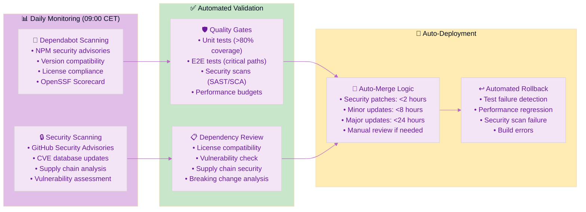
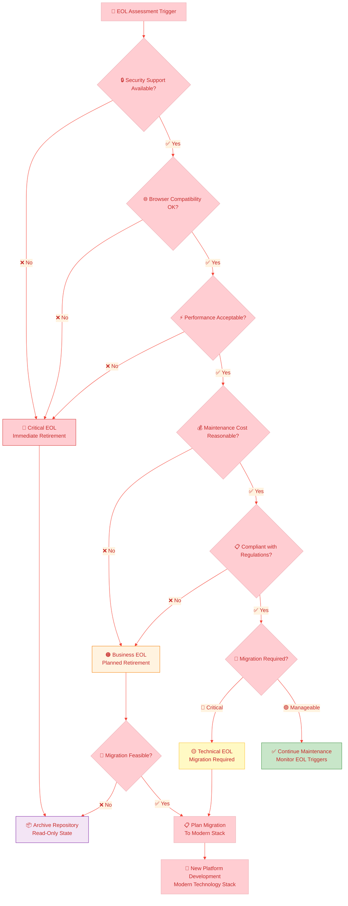
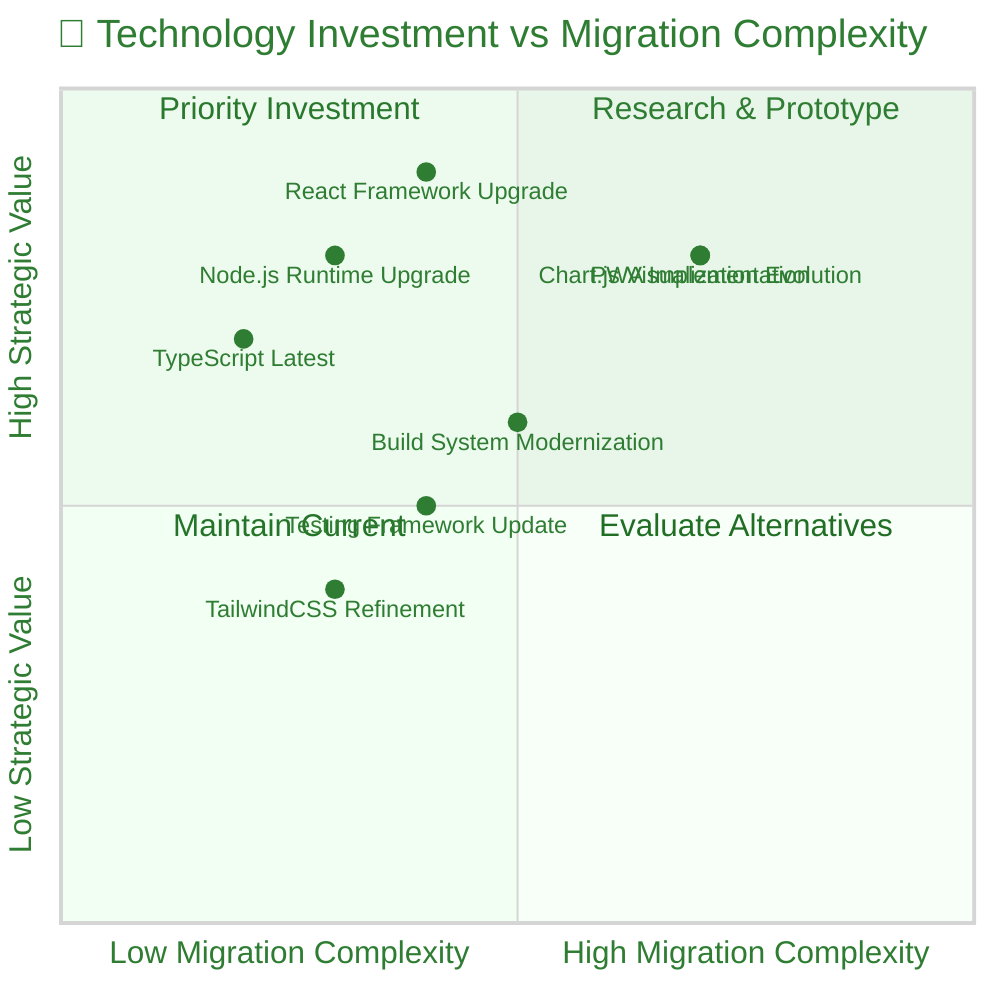
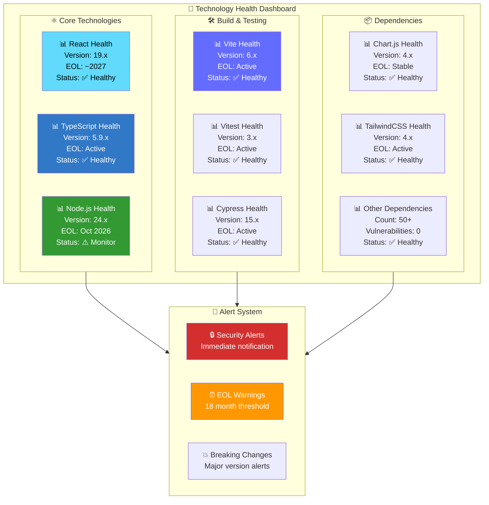

<p align="center">
  
</p>

<h1 align="center">⏰ CIA Compliance Manager — End-of-Life Strategy</h1>

<p align="center">
  <strong>Proactive Technology Lifecycle Management for Security Compliance Platform</strong><br>
  <em>📦 Modern React Stack • 🔄 Node.js 24 Transition • ⚡ Future-Ready Architecture</em>
</p>

<p align="center">
  <a href="#"></a>
  <a href="#"></a>
  <a href="#"></a>
  <a href="#"></a>
</p>

**📋 Document Owner:** Development Team | **📄 Version:** 1.0 | **📅 Last Updated:** 2025-01-23 (UTC)  
**🔄 Review Cycle:** Quarterly | **⏰ Next Review:** 2025-04-23

---

## 🎯 **Purpose Statement**

The **CIA Compliance Manager End-of-Life Strategy** establishes systematic procedures for proactive technology lifecycle management, ensuring sustainable innovation through modern React stack maintenance, bleeding-edge dependency management, and automated EOL monitoring.

Our approach demonstrates **modern web development best practices** through strategic technology selection, comprehensive testing frameworks, and transparent lifecycle planning. This strategy enables **operational excellence** through automated dependency updates, **innovation enablement** through latest technology adoption, and **risk reduction** through proactive EOL management.

This document aligns with Hack23 AB's **bleeding-edge dependency management philosophy** - adopting latest stable releases with comprehensive automated testing, security validation, and proactive migration planning for long-term sustainability.

---

## 📦 **Current Technology Stack Analysis**

### 🏗️ **Core Technology Matrix**



### **📊 Technology Lifecycle Overview**

| **Technology Category** | **Current Version** | **Release Model** | **EOL Timeline** | **Migration Complexity** |
|-------------------------|-------------------|------------------|------------------|-------------------------|
| **⚛️ React Framework** | 19.x (Latest) | Major annually, Minor quarterly | ~2027-2028 | [](https://github.com/Hack23/ISMS-PUBLIC/blob/main/CLASSIFICATION.md) |
| **📝 TypeScript** | 5.9.x (Latest) | Major every 6 months | Active development | [](https://github.com/Hack23/ISMS-PUBLIC/blob/main/CLASSIFICATION.md) |
| **⚡ Vite Build Tool** | 6.x (Latest) | Major annually | Active development | [](https://github.com/Hack23/ISMS-PUBLIC/blob/main/CLASSIFICATION.md) |
| **☕ Node.js Runtime** | 24.x (Current) | Even LTS, Odd Current | **Oct 2026** | [](https://github.com/Hack23/ISMS-PUBLIC/blob/main/CLASSIFICATION.md) |
| **🧪 Testing Stack** | Vitest 3.x + Cypress 15.x | Major annually | Active development | [](https://github.com/Hack23/ISMS-PUBLIC/blob/main/CLASSIFICATION.md) |
| **📊 Chart.js** | 4.x (Latest) | Major annually | Active development | [](https://github.com/Hack23/ISMS-PUBLIC/blob/main/CLASSIFICATION.md) |

---

## ☕ **Node.js 24 → 26 Transition Strategy**

### **🎯 Strategic Node.js Lifecycle Management**

Following [Hack23 AB's Proactive Runtime Management](https://github.com/Hack23/ISMS-PUBLIC/blob/main/Vulnerability_Management.md#proactive-runtime--operations-management), CIA Compliance Manager implements a **current-version-first** approach for optimal security and performance.

```mermaid
%%{
  init: {
    'theme': 'base',
    'themeVariables': {
      'primaryColor': '#fff3e0',
      'primaryTextColor': '#e65100',
      'lineColor': '#ff9800',
      'secondaryColor': '#e8f5e9',
      'tertiaryColor': '#fff8e1'
    }
  }
}%%
gantt
    title ☕ Node.js Lifecycle & CIA Compliance Manager Transition Timeline
    dateFormat YYYY-MM-DD
    axisFormat %Y-%m

    section Node.js Releases
    Node.js 24.x Current    :active, node24, 2024-04-24, 2024-10-29
    Node.js 24.x LTS        :active, node24lts, 2024-10-29, 2027-04-30
    Node.js 25.x Current    :node25, 2024-10-22, 2025-04-01
    Node.js 26.x Current    :node26, 2025-04-22, 2025-10-28
    Node.js 26.x LTS        :milestone, node26lts, 2025-10-28, 2025-10-30
    Node.js 24.x EOL        :crit, node24eol, 2027-04-30, 2027-05-02

    section CIA Compliance Manager Strategy
    Current Node 24.x Production :active, cm24prod, 2024-12-01, 2026-10-01
    Node.js 26.x Testing Phase   :testing, cm26test, 2025-08-01, 2025-10-28
    Node.js 26.x Migration       :migration, cm26mig, 2025-10-28, 2026-01-31
    Node.js 26.x Production      :prod26, 2026-01-31, 2027-04-30
    Legacy 24.x Support End      :milestone, legacy24end, 2026-10-01, 2026-10-03

    section Risk Management
    Compatibility Testing       :testing, compat, 2025-06-01, 2025-10-28
    Dependency Validation       :testing, deps, 2025-07-01, 2025-10-28
    Performance Benchmarking    :testing, perf, 2025-08-01, 2025-10-28
    Migration Risk Assessment    :milestone, riskassess, 2025-09-15, 2025-09-17
```

### **📋 Node.js Transition Trigger Conditions**

#### **🟢 Proactive Migration Triggers (Preferred)**

1. **📅 Node.js 26.x LTS Release:** October 2025 - Begin migration planning
2. **🛡️ Security Feature Advantages:** Enhanced security features in Node.js 26.x
3. **⚡ Performance Improvements:** Significant V8 or runtime optimizations
4. **📦 Ecosystem Compatibility:** Major dependencies requiring Node.js 26+

#### **🟡 Risk-Based Migration Triggers (Monitored)**

1. **⏰ 18-Month Warning:** April 2026 - 12 months before Node.js 24.x EOL
2. **🚨 Security Support Concerns:** Security patch availability degradation
3. **🔧 Tooling Incompatibility:** Build/development tools requiring newer Node.js
4. **☁️ Hosting Platform Changes:** Deployment platform Node.js requirements

#### **🔴 Critical Migration Triggers (Mandatory)**

1. **⛔ Node.js 24.x EOL Announcement:** April 2027 - End of security support
2. **🚨 Critical Vulnerability:** Unpatched security issues in Node.js 24.x
3. **🔧 Build System Incompatibility:** Essential tools no longer supporting Node.js 24.x
4. **🌐 Browser API Requirements:** New web standards requiring newer Node.js features

### **🧪 Node.js 26.x Testing & Validation Strategy**

```mermaid
%%{
  init: {
    'theme': 'base',
    'themeVariables': {
      'primaryColor': '#e3f2fd',
      'primaryTextColor': '#01579b',
      'lineColor': '#2196f3',
      'secondaryColor': '#f1f8e9',
      'tertiaryColor': '#fff8e1'
    }
  }
}%%
flowchart TB
    subgraph PREPARATION["🔬 Pre-Migration Testing (Aug 2025)"]
        COMPAT_TEST["🧪 Compatibility Testing<br/>• Vite 6+ compatibility<br/>• React 19 compatibility<br/>• TypeScript 5+ compatibility<br/>• Chart.js compatibility"]
        DEP_AUDIT["📦 Dependency Audit<br/>• NPM package compatibility<br/>• Native module rebuilds<br/>• Security vulnerability scan<br/>• License compliance check"]
        PERF_BASELINE["📊 Performance Baseline<br/>• Build time comparison<br/>• Runtime performance<br/>• Memory usage analysis<br/>• Bundle size impact"]
    end

    subgraph VALIDATION["✅ Migration Validation (Sep-Oct 2025)"]
        FEATURE_TEST["🛡️ Feature Testing<br/>• Security assessment validation<br/>• Dashboard functionality<br/>• Compliance mapping accuracy<br/>• Export/import features"]
        E2E_VALIDATION["🔍 E2E Validation<br/>• Complete user journeys<br/>• Cross-browser testing<br/>• Mobile compatibility<br/>• Performance regression"]
        SECURITY_SCAN["🔒 Security Validation<br/>• Vulnerability scanning<br/>• Dependency security<br/>• Secret scanning<br/>• SLSA attestation"]
    end

    subgraph DEPLOYMENT["🚀 Controlled Deployment (Oct 2025)"]
        STAGING_DEPLOY["🧪 Staging Deployment<br/>• Node.js 26.x environment<br/>• Full test suite execution<br/>• Performance monitoring<br/>• Error tracking"]
        CANARY_RELEASE["🐦 Canary Release<br/>• Limited production testing<br/>• Performance monitoring<br/>• Error rate analysis<br/>• User feedback collection"]
        FULL_MIGRATION["🎯 Full Migration<br/>• 100% Node.js 26.x<br/>• Legacy cleanup<br/>• Documentation update<br/>• Team notification"]
    end

    COMPAT_TEST --> DEP_AUDIT
    DEP_AUDIT --> PERF_BASELINE
    PERF_BASELINE --> FEATURE_TEST
    FEATURE_TEST --> E2E_VALIDATION
    E2E_VALIDATION --> SECURITY_SCAN
    SECURITY_SCAN --> STAGING_DEPLOY
    STAGING_DEPLOY --> CANARY_RELEASE
    CANARY_RELEASE --> FULL_MIGRATION

    style PREPARATION fill:#bbdefb
    style VALIDATION fill:#c8e6c9
    style DEPLOYMENT fill:#ffecb3
```



### **📊 Node.js Migration Risk Assessment**

| Risk Category | Probability | Impact | Mitigation Strategy | Success Criteria |
|---------------|-------------|---------|-------------------|------------------|
| **📦 Dependency Incompatibility** | [](https://github.com/Hack23/ISMS-PUBLIC/blob/main/CLASSIFICATION.md) | [](https://github.com/Hack23/ISMS-PUBLIC/blob/main/CLASSIFICATION.md) | Early testing + dependency audit | All dependencies compatible |
| **⚡ Performance Regression** | [](https://github.com/Hack23/ISMS-PUBLIC/blob/main/CLASSIFICATION.md) | [](https://github.com/Hack23/ISMS-PUBLIC/blob/main/CLASSIFICATION.md) | Performance benchmarking | <5% performance degradation |
| **🔧 Build System Changes** | [](https://github.com/Hack23/ISMS-PUBLIC/blob/main/CLASSIFICATION.md) | [](https://github.com/Hack23/ISMS-PUBLIC/blob/main/CLASSIFICATION.md) | Vite + ESBuild compatibility testing | Build process unchanged |
| **🌐 Runtime API Changes** | [](https://github.com/Hack23/ISMS-PUBLIC/blob/main/CLASSIFICATION.md) | [](https://github.com/Hack23/ISMS-PUBLIC/blob/main/CLASSIFICATION.md) | API compatibility validation | All APIs function correctly |
| **🔒 Security Control Impact** | [](https://github.com/Hack23/ISMS-PUBLIC/blob/main/CLASSIFICATION.md) | [](https://github.com/Hack23/ISMS-PUBLIC/blob/main/CLASSIFICATION.md) | Security scanning + attestation | Security posture maintained |

---

## ⏰ **End-of-Life Tracking & Monitoring**

### **📊 Technology EOL Dashboard**

Real-time monitoring using [endoflife.date](https://endoflife.date/) references and automated tracking:

```mermaid
%%{
  init: {
    'theme': 'base',
    'themeVariables': {
      'primaryColor': '#ffebee',
      'primaryTextColor': '#c62828',
      'lineColor': '#f44336',
      'secondaryColor': '#e8f5e9',
      'tertiaryColor': '#fff3e0'
    }
  }
}%%
gantt
    title 📅 CIA Compliance Manager Technology End-of-Life Timeline (2025-2030)
    dateFormat YYYY-MM-DD
    axisFormat %Y

    section Runtime & Core
    Node.js 24.x LTS          :active, node24, 2024-10-29, 2027-04-30
    Node.js 26.x LTS (Target) :future, node26, 2025-10-28, 2028-04-30
    Node.js 28.x LTS (Future) :future, node28, 2027-10-28, 2030-04-30

    section Frontend Framework
    React 19.x                :active, react19, 2024-12-05, 2027-12-31
    React 20.x (Future)       :future, react20, 2025-12-01, 2028-12-31
    React 21.x (Future)       :future, react21, 2026-12-01, 2029-12-31

    section Build & Tooling
    Vite 6.x                  :active, vite6, 2024-12-03, 2025-12-31
    Vite 7.x (Future)         :future, vite7, 2025-06-01, 2026-12-31
    TypeScript 5.x            :active, ts5, 2024-03-16, 2025-09-30
    TypeScript 6.x (Future)   :future, ts6, 2025-03-01, 2026-09-30

    section Visualization
    Chart.js 4.x              :active, chartjs4, 2024-01-01, 2026-12-31
    Chart.js 5.x (Future)     :future, chartjs5, 2025-06-01, 2027-06-01
    TailwindCSS 4.x           :active, tailwind4, 2024-12-01, 2025-12-01

    section Critical Milestones
    Node.js 24 Migration Alert :milestone, node24alert, 2026-04-30, 2026-05-02
    React 19 Assessment       :milestone, react19assess, 2026-12-01, 2026-12-03
    Major Stack Review        :milestone, stackreview, 2027-01-01, 2027-01-03
```

### **🚨 EOL Warning System**

#### **📊 Automated EOL Monitoring**

- **⏰ 24-Month Early Warning:** Initial migration planning phase
- **⚠️ 18-Month Alert:** Active migration preparation required
- **🚨 12-Month Critical:** Migration implementation must begin
- **⛔ 6-Month Emergency:** Final migration deadline approach
- **🔴 EOL Reached:** Immediate security risk assessment required

#### **📋 EOL Response Procedures**

| Warning Level | Timeline | Actions Required | Escalation |
|---------------|----------|------------------|------------|
| **🟢 Early Warning** | 24+ months | Technology assessment, alternative evaluation | [](https://github.com/Hack23/ISMS-PUBLIC/blob/main/CLASSIFICATION.md) |
| **🟡 Planning Phase** | 18+ months | Migration strategy development, testing plan | [](https://github.com/Hack23/ISMS-PUBLIC/blob/main/CLASSIFICATION.md) |
| **🟠 Implementation** | 12+ months | Active migration, compatibility testing | [](https://github.com/Hack23/ISMS-PUBLIC/blob/main/CLASSIFICATION.md) |
| **🔴 Critical Phase** | 6+ months | Final testing, production migration | [](https://github.com/Hack23/ISMS-PUBLIC/blob/main/CLASSIFICATION.md) |
| **⛔ Emergency** | <6 months | Security assessment, risk acceptance | [](https://github.com/Hack23/ISMS-PUBLIC/blob/main/CLASSIFICATION.md) |

---

## 🔄 **Ongoing Maintenance Strategy**

### **📦 Dependency Management Philosophy**

Aligned with [Hack23 AB's "Living on the Edge" Strategy](https://github.com/Hack23/ISMS-PUBLIC/blob/main/Vulnerability_Management.md#proactive-dependency-management-strategy):

#### **🚀 Bleeding-Edge with Safety Controls**

- **📦 Always Latest:** Accept Dependabot PRs for latest stable releases immediately
- **🛡️ Security Gates:** Automated testing and security validation before merge
- **🔍 Dependency Review:** GitHub's Dependency Review Action with OpenSSF Scorecard integration
- **✅ Test-Driven Confidence:** Trust comprehensive test suites over manual review
- **🚨 Rapid Response:** <4 hours for critical security vulnerabilities
- **⏰ EOL Tracking:** Proactive monitoring of runtime and dependency lifecycles

### **🔍 Automated Dependency Updates**



### **📋 Update Classification & Response Times**

| Update Type | Response Time | Security Gate | Merge Strategy | EOL Consideration |
|-------------|---------------|---------------|----------------|------------------|
| **🔴 Security Patches** | <4 hours | Dependency Review + Tests | Auto-merge on green | Immediate regardless of EOL |
| **🟠 Major Releases** | <24 hours | Full test suite + review | Auto-merge on green | Check EOL timeline alignment |
| **🟡 Minor Releases** | <8 hours | Standard testing | Auto-merge on green | Prefer LTS versions |
| **🟢 Patch Releases** | <2 hours | Basic validation | Immediate auto-merge | Always apply within support window |

---

## 🎯 **Final EOL Conditions**

### **🛑 Project Retirement Triggers**

CIA Compliance Manager will be designated as EOL and archived in read-only state when ANY of these conditions occur:

#### **🔴 Critical EOL Triggers (Immediate Retirement)**

1. **🚨 Security Support Failure:** No security patches available for critical vulnerabilities in core dependencies
2. **🌐 Browser Compatibility Loss:** Modern browsers no longer support required ES2022+ features
3. **⚡ Performance Degradation:** Framework limitations causing unacceptable user experience
4. **📦 Dependency Chain Collapse:** Critical dependencies (React, TypeScript, Vite) all reach EOL simultaneously

#### **🟠 Business EOL Triggers (Planned Retirement)**

1. **💰 Maintenance Cost Exceeds Value:** Security maintenance costs exceed compliance value delivery
2. **🏆 Technology Replacement:** Superior compliance platform technology becomes available
3. **📋 Compliance Requirements:** New regulations incompatible with frontend-only architecture
4. **🎯 Mission Completion:** Compliance objectives fully achieved through other means

#### **🟡 Technical EOL Triggers (Migration Required)**

1. **☕ Node.js Ecosystem End:** Node.js 26+ unsupported and 24.x EOL reached
2. **⚛️ React Major Breaking Change:** React 20+ incompatible with current architecture
3. **📊 Chart.js Architecture Change:** Visualization framework requiring complete rewrite
4. **🔧 Build System Evolution:** ES Modules/Import Maps requiring Vite replacement

### **📊 EOL Decision Matrix**



---

## 🔄 **Technology Succession Planning**

### **🚀 Future Platform Vision**

Should EOL conditions trigger migration, the successor platform will maintain **security compliance assessment integrity** while leveraging modern technology:

#### **📋 Next-Generation Technology Candidates**

| Component | Current (CIA Compliance Manager) | Future Candidate | Migration Complexity |
|-----------|----------------------------------|------------------|---------------------|
| **⚛️ Frontend Framework** | React 19 + TypeScript 5 | React 22+ or Next.js 15+ | [](https://github.com/Hack23/ISMS-PUBLIC/blob/main/CLASSIFICATION.md) |
| **📊 Visualization Engine** | Chart.js 4.x | D3.js or Observable Plot | [](https://github.com/Hack23/ISMS-PUBLIC/blob/main/CLASSIFICATION.md) |
| **🛠️ Build System** | Vite 6 + ESBuild | Rolldown, Turbopack, or Vite Next | [](https://github.com/Hack23/ISMS-PUBLIC/blob/main/CLASSIFICATION.md) |
| **📱 Platform Target** | Web-only | Progressive Web App + WebAssembly | [](https://github.com/Hack23/ISMS-PUBLIC/blob/main/CLASSIFICATION.md) |
| **☕ Runtime** | Node.js (build only) | Deno, Bun, or Next-gen Node.js | [](https://github.com/Hack23/ISMS-PUBLIC/blob/main/CLASSIFICATION.md) |

#### **🎯 Migration Success Criteria**

- **🛡️ Security Assessment Integrity:** Compliance assessment accuracy maintained exactly
- **📊 Enhanced Analytics:** Improved visualization and reporting capabilities
- **🔒 Security Posture Improved:** Better security controls and vulnerability management
- **⚡ Performance Gains:** >60fps dashboards with better accessibility
- **📦 Maintenance Simplified:** Reduced complexity and better long-term support

### **📊 Technology Investment Strategy**



---

## 📊 **Performance & Success Metrics**

### 🎯 **EOL Management KPIs**

| Metric Category | KPI | Target | Current | Measurement Method | Review Frequency |
|-----------------|-----|--------|---------|-------------------|------------------|
| **⏰ Proactive Management** | % Technologies >12mo from EOL | >90% | TBD | Automated EOL tracking | Monthly |
| **⚡ Update Velocity** | Average days to adopt stable releases | <14 days | TBD | Deployment tracking | Weekly |
| **🛡️ Security Posture** | Days to patch critical vulnerabilities | <1 day | TBD | Security scanning | Daily |
| **🧪 Migration Success** | % Successful migrations without rollback | >95% | TBD | Deployment history | Quarterly |
| **📈 Performance Impact** | % Performance regression post-migration | <5% | TBD | Lighthouse CI | Per migration |
| **💰 Technical Debt** | Legacy technology count | 0 | TBD | Static analysis | Monthly |

### 📊 **Dashboard & Monitoring**

#### **🔍 Technology Health Dashboard**



---

## 📚 **Related Documents**

### **🛠️ Core Development Documentation**
- **[🏗️ Architecture Documentation](./architecture/)** — System design and technical architecture
- **[🔄 Workflows Documentation](./architecture/WORKFLOWS.md)** — CI/CD and automation processes
- **[🧪 Testing Guide](./testing-guide.md)** — Comprehensive testing strategy and implementation

### **📊 Project Documentation**
- **[📖 README](../README.md)** — Project overview and getting started guide
- **[📋 Contributing Guidelines](../CONTRIBUTING.md)** — Development contribution procedures
- **[📄 API Documentation](../docs/)** — Technical documentation and APIs

### **🔐 Security & Compliance**
- **[🛡️ Security Architecture](./architecture/SECURITY_ARCHITECTURE.md)** — Current security implementation
- **[🚀 Future Security Architecture](./architecture/FUTURE_SECURITY_ARCHITECTURE.md)** — Planned security improvements
- **[🔍 Vulnerability Management](https://github.com/Hack23/ISMS-PUBLIC/blob/main/Vulnerability_Management.md)** — Security vulnerability procedures

### **🏢 Organizational Policies**
- **[🛠️ Secure Development Policy](https://github.com/Hack23/ISMS-PUBLIC/blob/main/Secure_Development_Policy.md)** — Development security standards
- **[🏷️ Classification Framework](https://github.com/Hack23/ISMS-PUBLIC/blob/main/CLASSIFICATION.md)** — Data and risk classification methodology

---

**📋 Document Control:**  
**✅ Approved by:** Development Team  
**📤 Distribution:** Public  
**🏷️ Classification:** [](https://github.com/Hack23/ISMS-PUBLIC/blob/main/CLASSIFICATION.md#confidentiality-levels)  
**📅 Effective Date:** 2025-01-23  
**⏰ Next Review:** 2025-04-23  
**🎯 Compliance:** [](https://react.dev/) [](https://github.com/Hack23/ISMS-PUBLIC/blob/main/Secure_Development_Policy.md) [](https://github.com/Hack23/ISMS-PUBLIC/blob/main/Vulnerability_Management.md)