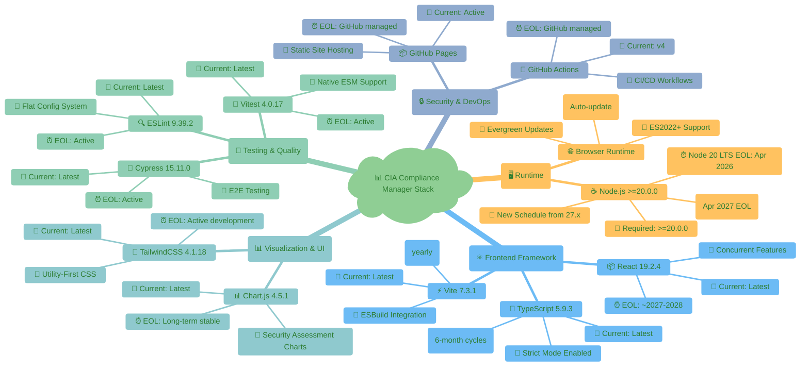
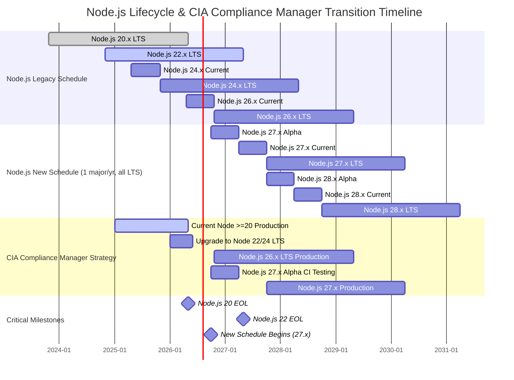
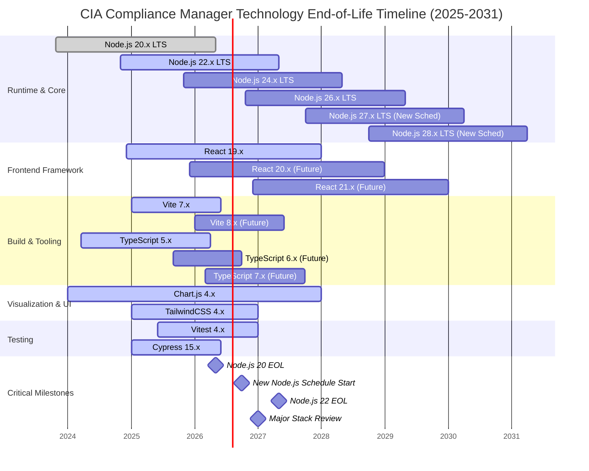
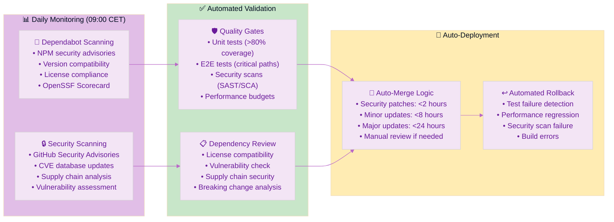
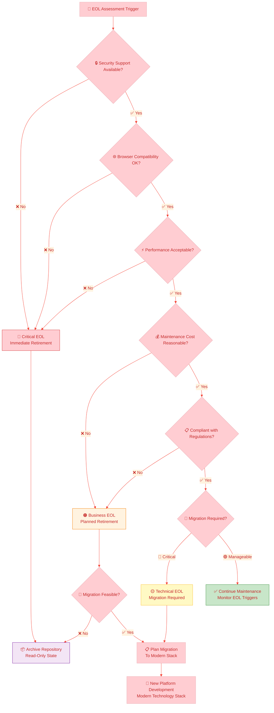
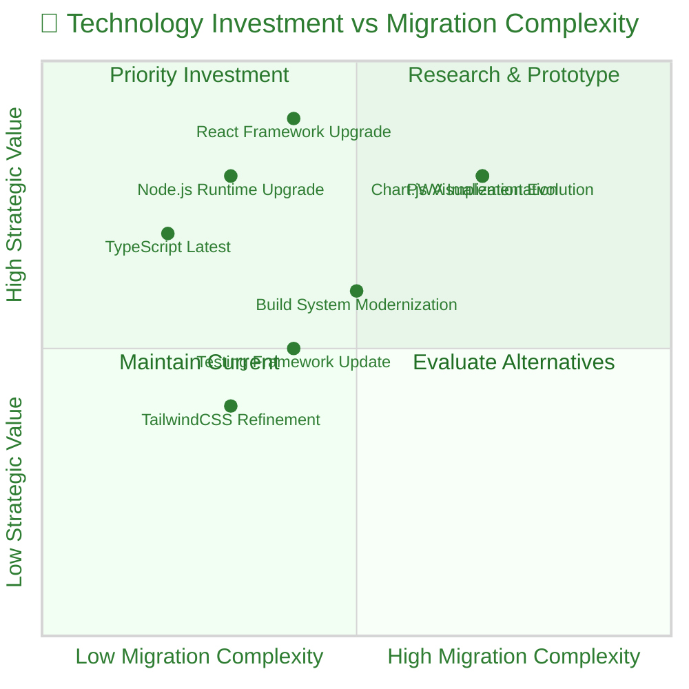
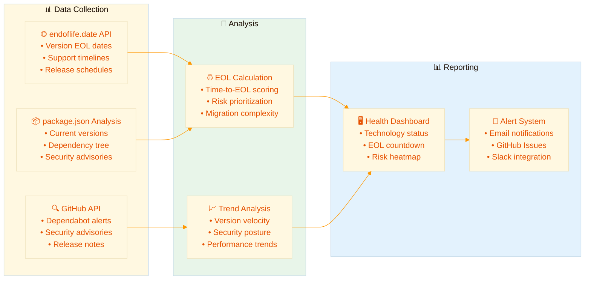
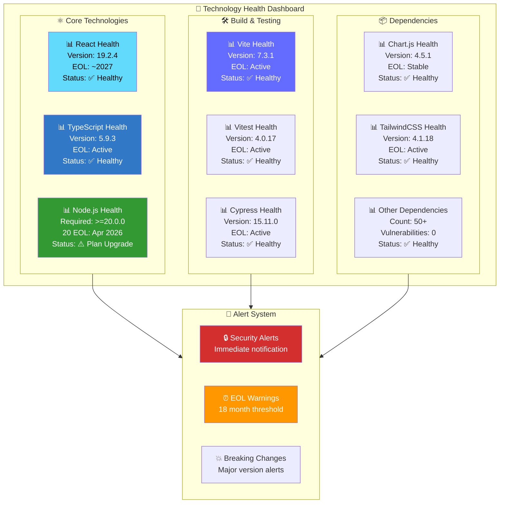

  

<h1 align="center">⏰ CIA Compliance Manager — End-of-Life Strategy</h1>

  <strong>🛡️ Proactive Technology Lifecycle Management for Security Compliance Platform</strong> 
  <em>📦 Current Stack Maintenance • 🔄 Node.js Lifecycle Planning • ⚡ Future-Ready Architecture</em>

  
  
  
  

**📋 Document Owner:** CEO | **📄 Version:** 2.0 | **📅 Last Updated:** 2026-03-12 (UTC)  
**🔄 Review Cycle:** Annual | **⏰ Next Review:** 2027-03-12  
**🏷️ Classification:** Public (Open Source Security Compliance Platform)

---

## 🎯 EOL Strategy Overview

### **📋 Strategic Objective**

**CIA Compliance Manager** will maintain its current frontend-only technology stack, utilizing modern web technologies and the React 19 ecosystem, without requiring backend infrastructure migration. The project will reach EOL when compatibility with the latest browser runtimes or critical dependency security support requires architectural migration beyond cost-effective maintenance.

This strategy aligns with [Hack23 AB's Vulnerability Management Policy](https://github.com/Hack23/ISMS-PUBLIC/blob/main/Vulnerability_Management.md) **"Living on the Edge"** philosophy — maintaining latest stable releases with comprehensive automated testing and security validation.

### **🏷️ Business Impact Classification**

Based on [Hack23 AB Classification Framework](https://github.com/Hack23/ISMS-PUBLIC/blob/main/CLASSIFICATION.md):

| Security Dimension     | Level                                                                                                                                                                      | EOL Impact | Business Rationale                                                          |
| ---------------------- | -------------------------------------------------------------------------------------------------------------------------------------------------------------------------- | ---------- | --------------------------------------------------------------------------- |
| **🔐 Confidentiality** |    | Low        | Open source compliance assessment tool, no sensitive data processed         |
| **🔒 Integrity**       |                 | High       | Security compliance assessments must be accurate and trustworthy            |
| **⚡ Availability**    |  | Medium     | Compliance platform; tolerates maintenance windows for non-urgent use cases |

**🎯 RTO/RPO Alignment:** Medium RTO (4-24hrs), Daily RPO acceptable for compliance assessment platform

---

## 📦 Current Technology Stack Analysis

### **🏗️ Core Technology Matrix**

```mermaid
%%{
  init: {
    'theme': 'base',
    'themeVariables': {
      'primaryColor': '#e8f5e9',
      'primaryTextColor': '#2e7d32',
      'lineColor': '#4caf50',
      'secondaryColor': '#fff3e0',
      'tertiaryColor': '#e3f2fd'
    }
  }
}%%
mindmap
  root)📊 CIA Compliance Manager Stack(
    (🖥️ Runtime)
      ☕ Node.js >=20.0.0
        📅 Required: >=20.0.0
        ⏰ Node 20 LTS EOL: Apr 2026
        🔄 Next: Node 22 LTS (Apr 2027 EOL)
        📢 New Schedule from 27.x
      🌐 Browser Runtime
        📅 Evergreen Updates
        ⏰ EOL: N/A (Auto-update)
        🔄 ES2022+ Support
    (⚛️ Frontend Framework)
      📦 React 19.2.4
        📅 Current: Latest
        ⏰ EOL: ~2027-2028
        🔄 Concurrent Features
      📝 TypeScript 5.9.3
        📅 Current: Latest
        ⏰ EOL: Active (6-month cycles)
        🔄 Strict Mode Enabled
      ⚡ Vite 7.3.1
        📅 Current: Latest
        ⏰ EOL: Active (yearly)
        🔄 ESBuild Integration
    (🧪 Testing & Quality)
      🧪 Vitest 4.0.17
        📅 Current: Latest
        ⏰ EOL: Active
        🔄 Native ESM Support
      🔧 Cypress 15.11.0
        📅 Current: Latest
        ⏰ EOL: Active
        🔄 E2E Testing
      🔍 ESLint 9.39.2
        📅 Current: Latest
        ⏰ EOL: Active
        🔄 Flat Config System
    (📊 Visualization & UI)
      📊 Chart.js 4.5.1
        📅 Current: Latest
        ⏰ EOL: Long-term stable
        🔄 Security Assessment Charts
      🎨 TailwindCSS 4.1.18
        📅 Current: Latest
        ⏰ EOL: Active development
        🔄 Utility-First CSS
    (🔒 Security & DevOps)
      🔐 GitHub Actions
        📅 Current: v4
        ⏰ EOL: GitHub managed
        🔄 CI/CD Workflows
      📦 GitHub Pages
        📅 Current: Active
        ⏰ EOL: GitHub managed
        🔄 Static Site Hosting
```

### **📊 Technology Lifecycle Overview**

| **Technology Category** | **Current Version**       | **Release Model**               | **EOL Timeline**   | **Migration Complexity**                                                                                                                                |
| ----------------------- | ------------------------- | ------------------------------- | ------------------ | ------------------------------------------------------------------------------------------------------------------------------------------------------- |
| **⚛️ React Framework**  | 19.2.4 (Latest)           | Major annually, Minor quarterly | ~2027-2028         |  |
| **📝 TypeScript**       | 5.9.3 (Latest)            | Major every 6 months            | Active development |    |
| **⚡ Vite Build Tool**  | 7.3.1 (Latest)            | Major annually                  | Active development |    |
| **☕ Node.js Runtime**  | >=20.0.0 (Engine Req)     | New: 1 major/year from 27.x    | See schedule below |      |
| **🧪 Testing Stack**    | Vitest 4.x + Cypress 15.x | Major annually                  | Active development |  |
| **📊 Chart.js**         | 4.5.1 (Latest)            | Major annually                  | Active development |    |
| **🎨 TailwindCSS**      | 4.1.18 (Latest)           | Major annually                  | Active development |    |

---

## ☕ Node.js Release Schedule Evolution

### **📢 New Release Schedule (Starting Node.js 27.x)**

As [announced by the Node.js project](https://nodejs.org/en/blog/announcements/evolving-the-nodejs-release-schedule), starting with **Node.js 27.x** (October 2026), the release model is fundamentally changing:

| Aspect | Old Schedule (≤26.x) | New Schedule (≥27.x) |
|--------|----------------------|---------------------|
| **Releases per year** | 2 majors (Apr + Oct) | **1 major (April)** |
| **LTS eligibility** | Even-numbered only | **Every release becomes LTS** |
| **Odd/even distinction** | Odd = Current only, Even = LTS | **No distinction** |
| **Alpha channel** | N/A | **6 months (Oct–Mar), semver-major allowed** |
| **Current phase** | 6 months | **6 months (Apr–Oct)** |
| **LTS duration** | 30 months | **30 months** |
| **Total support** | 36 months (LTS only) | **36 months (every release)** |
| **Version numbering** | Sequential | **Calendar-year aligned (27 in 2027, 28 in 2028)** |

### **📅 New Node.js Lifecycle Phases**

| Phase | Duration | Description |
|-------|----------|-------------|
| **🔬 Alpha** | 6 months (Oct–Mar) | Early testing, semver-major changes allowed. Versioned as e.g. `27.0.0-alpha.1` |
| **⚡ Current** | 6 months (Apr–Oct) | Stabilization period, production-ready |
| **🛡️ LTS** | 30 months | Long-term support with security fixes |
| **⛔ EOL** | — | No further support provided |

> **Impact for CIA Compliance Manager:** Since we already follow an LTS-only upgrade strategy (`engines.node >= 20.0.0`), the primary change is that **every future Node.js release will become LTS**, simplifying our upgrade planning. Library authors should integrate Alpha releases into CI as early as possible to report bugs before they affect users.

### **🎯 Strategic Node.js Lifecycle Management**

Following [Hack23 AB's Proactive Runtime Management](https://github.com/Hack23/ISMS-PUBLIC/blob/main/Vulnerability_Management.md#proactive-runtime--operations-management), CIA Compliance Manager implements a **current-version-first** approach for optimal security and performance.

```mermaid
gantt
    title Node.js Lifecycle & CIA Compliance Manager Transition Timeline
    dateFormat YYYY-MM-DD
    axisFormat %Y-%m

    section Node.js Legacy Schedule
    Node.js 20.x LTS           :done, node20lts, 2023-10-24, 2026-04-30
    Node.js 22.x LTS           :active, node22lts, 2024-10-29, 2027-04-30
    Node.js 24.x Current       :node24cur, 2025-04-22, 2025-10-28
    Node.js 24.x LTS           :node24lts, 2025-10-28, 2028-04-30
    Node.js 26.x Current       :node26cur, 2026-04-21, 2026-10-20
    Node.js 26.x LTS           :node26lts, 2026-10-20, 2029-04-30

    section Node.js New Schedule (1 major/yr, all LTS)
    Node.js 27.x Alpha         :node27a, 2026-10-01, 2027-03-31
    Node.js 27.x Current       :node27cur, 2027-04-01, 2027-10-01
    Node.js 27.x LTS           :node27lts, 2027-10-01, 2030-04-01
    Node.js 28.x Alpha         :node28a, 2027-10-01, 2028-03-31
    Node.js 28.x Current       :node28cur, 2028-04-01, 2028-10-01
    Node.js 28.x LTS           :node28lts, 2028-10-01, 2031-04-01

    section CIA Compliance Manager Strategy
    Current Node >=20 Production :active, cmcurrent, 2025-01-01, 2026-05-01
    Upgrade to Node 22/24 LTS    :cmupgrade, 2026-01-01, 2026-06-01
    Node.js 26.x LTS Production  :cm26prod, 2026-10-20, 2029-04-30
    Node.js 27.x Alpha CI Testing:cm27alpha, 2026-10-01, 2027-04-01
    Node.js 27.x Production      :cm27prod, 2027-10-01, 2030-04-01

    section Critical Milestones
    Node.js 20 EOL             :milestone, node20eol, 2026-04-30, 0d
    Node.js 22 EOL             :milestone, node22eol, 2027-04-30, 0d
    New Schedule Begins (27.x) :milestone, newschedule, 2026-10-01, 0d
```

### **📋 Node.js Transition Trigger Conditions**

#### **🟢 Proactive Migration Triggers (Preferred)**

1. **📅 New LTS Release Available:** Upgrade within 3 months of LTS promotion
2. **🛡️ Security Feature Advantages:** Enhanced security features in newer Node.js
3. **⚡ Performance Improvements:** Significant V8 or runtime optimizations
4. **📦 Ecosystem Compatibility:** Major dependencies requiring newer Node.js
5. **🔬 Alpha Channel Integration:** Test against Node.js alpha in CI starting from 27.x

#### **🟡 Risk-Based Migration Triggers (Monitored)**

1. **⏰ 18-Month Warning:** 18 months before current Node.js version EOL
2. **🚨 Security Support Concerns:** Security patch availability degradation
3. **🔧 Tooling Incompatibility:** Build/development tools requiring newer Node.js
4. **☁️ Hosting Platform Changes:** Deployment platform Node.js requirements

#### **🔴 Critical Migration Triggers (Mandatory)**

1. **⛔ Node.js EOL Announcement:** End of security support for current version
2. **🚨 Critical Vulnerability:** Unpatched security issues in current Node.js version
3. **🔧 Build System Incompatibility:** Essential tools no longer supporting current Node.js
4. **🌐 Browser API Requirements:** New web standards requiring newer Node.js features

### **🧪 Node.js Testing & Validation Strategy**

```mermaid
%%{
  init: {
    'theme': 'base',
    'themeVariables': {
      'primaryColor': '#e3f2fd',
      'primaryTextColor': '#01579b',
      'lineColor': '#2196f3',
      'secondaryColor': '#f1f8e9',
      'tertiaryColor': '#fff8e1'
    }
  }
}%%
flowchart TB
    subgraph PREPARATION["🔬 Pre-Migration Testing"]
        COMPAT_TEST["🧪 Compatibility Testing<br/>• Vite 7+ compatibility<br/>• React 19 compatibility<br/>• TypeScript 5+ compatibility<br/>• Chart.js compatibility"]
        DEP_AUDIT["📦 Dependency Audit<br/>• NPM package compatibility<br/>• Native module rebuilds<br/>• Security vulnerability scan<br/>• License compliance check"]
        PERF_BASELINE["📊 Performance Baseline<br/>• Build time comparison<br/>• Runtime performance<br/>• Memory usage analysis<br/>• Bundle size impact"]
    end

    subgraph ALPHA_CI["🔬 Alpha Channel CI (from 27.x)"]
        ALPHA_TEST["🧪 Alpha Integration<br/>• Run full CI on alpha releases<br/>• Report bugs early<br/>• Track semver-major changes<br/>• Validate ecosystem readiness"]
    end

    subgraph VALIDATION["✅ Migration Validation"]
        FEATURE_TEST["🛡️ Feature Testing<br/>• Security assessment validation<br/>• Dashboard functionality<br/>• Compliance mapping accuracy<br/>• Export/import features"]
        E2E_VALIDATION["🔍 E2E Validation<br/>• Complete user journeys<br/>• Cross-browser testing<br/>• Mobile compatibility<br/>• Performance regression"]
        SECURITY_SCAN["🔒 Security Validation<br/>• Vulnerability scanning<br/>• Dependency security<br/>• Secret scanning<br/>• SLSA attestation"]
    end

    subgraph DEPLOYMENT["🚀 Controlled Deployment"]
        STAGING_DEPLOY["🧪 Staging Deployment<br/>• New Node.js environment<br/>• Full test suite execution<br/>• Performance monitoring<br/>• Error tracking"]
        CANARY_RELEASE["🐦 Canary Release<br/>• Limited production testing<br/>• Performance monitoring<br/>• Error rate analysis<br/>• User feedback collection"]
        FULL_MIGRATION["🎯 Full Migration<br/>• 100% new Node.js<br/>• Legacy cleanup<br/>• Documentation update<br/>• Team notification"]
    end

    COMPAT_TEST --> DEP_AUDIT
    DEP_AUDIT --> PERF_BASELINE
    PERF_BASELINE --> ALPHA_TEST
    ALPHA_TEST --> FEATURE_TEST
    FEATURE_TEST --> E2E_VALIDATION
    E2E_VALIDATION --> SECURITY_SCAN
    SECURITY_SCAN --> STAGING_DEPLOY
    STAGING_DEPLOY --> CANARY_RELEASE
    CANARY_RELEASE --> FULL_MIGRATION

    style PREPARATION fill:#bbdefb
    style ALPHA_CI fill:#e1bee7
    style VALIDATION fill:#c8e6c9
    style DEPLOYMENT fill:#ffecb3
```

### **📊 Node.js Migration Risk Assessment**

| Risk Category | Probability | Impact | Mitigation Strategy | Success Criteria |
|---------------|-------------|---------|-------------------|------------------|
| **📦 Dependency Incompatibility** |  |  | Early alpha CI testing + dependency audit | All dependencies compatible |
| **⚡ Performance Regression** |  |  | Performance benchmarking | <5% performance degradation |
| **🔧 Build System Changes** |  |  | Vite + ESBuild compatibility testing | Build process unchanged |
| **🌐 Runtime API Changes** |  |  | API compatibility validation | All APIs function correctly |
| **🔒 Security Control Impact** |  |  | Security scanning + attestation | Security posture maintained |

---

## ⏰ End-of-Life Tracking & Monitoring

### **📊 Technology EOL Dashboard**

Real-time monitoring using [endoflife.date](https://endoflife.date/) references and automated tracking:

```mermaid
gantt
    title CIA Compliance Manager Technology End-of-Life Timeline (2025-2031)
    dateFormat YYYY-MM-DD
    axisFormat %Y

    section Runtime & Core
    Node.js 20.x LTS          :done, node20, 2023-10-24, 2026-04-30
    Node.js 22.x LTS          :active, node22, 2024-10-29, 2027-04-30
    Node.js 24.x LTS          :node24, 2025-10-28, 2028-04-30
    Node.js 26.x LTS          :node26, 2026-10-20, 2029-04-30
    Node.js 27.x LTS (New Sched) :node27, 2027-10-01, 2030-04-01
    Node.js 28.x LTS (New Sched) :node28, 2028-10-01, 2031-04-01

    section Frontend Framework
    React 19.x                :active, react19, 2024-12-05, 2027-12-31
    React 20.x (Future)       :react20, 2025-12-01, 2028-12-31
    React 21.x (Future)       :react21, 2026-12-01, 2029-12-31

    section Build & Tooling
    Vite 7.x                  :active, vite7, 2025-01-01, 2026-06-01
    Vite 8.x (Future)         :vite8, 2026-01-01, 2027-06-01
    TypeScript 5.x            :active, ts5, 2024-03-16, 2026-03-31
    TypeScript 6.x (Future)   :ts6, 2025-09-01, 2026-09-30
    TypeScript 7.x (Future)   :ts7, 2026-03-01, 2027-09-30

    section Visualization & UI
    Chart.js 4.x              :active, chartjs4, 2024-01-01, 2027-12-31
    TailwindCSS 4.x           :active, tailwind4, 2025-01-01, 2027-01-01

    section Testing
    Vitest 4.x                :active, vitest4, 2025-06-01, 2026-12-31
    Cypress 15.x              :active, cypress15, 2025-01-01, 2026-06-01

    section Critical Milestones
    Node.js 20 EOL            :milestone, node20eol, 2026-04-30, 0d
    New Node.js Schedule Start :milestone, newschedstart, 2026-10-01, 0d
    Node.js 22 EOL            :milestone, node22eol, 2027-04-30, 0d
    Major Stack Review        :milestone, stackreview, 2027-01-01, 0d
```

### **🚨 EOL Warning System**

#### **📊 Automated EOL Monitoring**

- **⏰ 24-Month Early Warning:** Initial migration planning phase
- **⚠️ 18-Month Alert:** Active migration preparation required
- **🚨 12-Month Critical:** Migration implementation must begin
- **⛔ 6-Month Emergency:** Final migration deadline approach
- **🔴 EOL Reached:** Immediate security risk assessment required

#### **📋 EOL Response Procedures**

| Warning Level | Timeline | Actions Required | Escalation |
|---------------|----------|------------------|------------|
| **🟢 Early Warning** | 24+ months | Technology assessment, alternative evaluation |  |
| **🟡 Planning Phase** | 18+ months | Migration strategy development, testing plan |  |
| **🟠 Implementation** | 12+ months | Active migration, compatibility testing |  |
| **🔴 Critical Phase** | 6+ months | Final testing, production migration |  |
| **⛔ Emergency** | <6 months | Security assessment, risk acceptance |  |

---

## 🔄 Ongoing Maintenance Strategy

### **📦 Dependency Management Philosophy**

Aligned with [Hack23 AB's "Living on the Edge" Strategy](https://github.com/Hack23/ISMS-PUBLIC/blob/main/Vulnerability_Management.md#proactive-dependency-management-strategy):

#### **🚀 Bleeding-Edge with Safety Controls**

- **📦 Always Latest:** Accept Dependabot PRs for latest stable releases immediately
- **🛡️ Security Gates:** Automated testing and security validation before merge
- **🔍 Dependency Review:** GitHub's Dependency Review Action with OpenSSF Scorecard integration
- **✅ Test-Driven Confidence:** Trust comprehensive test suites over manual review
- **🚨 Rapid Response:** <4 hours for critical security vulnerabilities
- **⏰ EOL Tracking:** Proactive monitoring of runtime and dependency lifecycles
- **🔬 Alpha CI (from Node.js 27.x):** Integrate Node.js alpha releases into CI to detect issues early

### **🔍 Automated Dependency Updates**

```mermaid
%%{
  init: {
    'theme': 'base',
    'themeVariables': {
      'primaryColor': '#f3e5f5',
      'primaryTextColor': '#6a1b9a',
      'lineColor': '#ba68c8',
      'secondaryColor': '#e8f5e9',
      'tertiaryColor': '#fff3e0'
    }
  }
}%%
flowchart LR
    subgraph MONITORING["📊 Daily Monitoring (09:00 CET)"]
        DEPENDABOT["🤖 Dependabot Scanning<br/>• NPM security advisories<br/>• Version compatibility<br/>• License compliance<br/>• OpenSSF Scorecard"]
        SECURITY_SCAN["🔒 Security Scanning<br/>• GitHub Security Advisories<br/>• CVE database updates<br/>• Supply chain analysis<br/>• Vulnerability assessment"]
    end

    subgraph VALIDATION["✅ Automated Validation"]
        QUALITY_GATES["🛡️ Quality Gates<br/>• Unit tests (>80% coverage)<br/>• E2E tests (critical paths)<br/>• Security scans (SAST/SCA)<br/>• Performance budgets"]
        REVIEW_ACTION["📋 Dependency Review<br/>• License compatibility<br/>• Vulnerability check<br/>• Supply chain security<br/>• Breaking change analysis"]
    end

    subgraph DEPLOYMENT["🚀 Auto-Deployment"]
        AUTO_MERGE["🔄 Auto-Merge Logic<br/>• Security patches: <2 hours<br/>• Minor updates: <8 hours<br/>• Major updates: <24 hours<br/>• Manual review if needed"]
        ROLLBACK["↩️ Automated Rollback<br/>• Test failure detection<br/>• Performance regression<br/>• Security scan failure<br/>• Build errors"]
    end

    DEPENDABOT --> QUALITY_GATES
    SECURITY_SCAN --> REVIEW_ACTION
    QUALITY_GATES --> AUTO_MERGE
    REVIEW_ACTION --> AUTO_MERGE
    AUTO_MERGE --> ROLLBACK

    style MONITORING fill:#e1bee7
    style VALIDATION fill:#c8e6c9
    style DEPLOYMENT fill:#ffecb3
```

### **📋 Update Classification & Response Times**

| Update Type | Response Time | Security Gate | Merge Strategy | EOL Consideration |
|-------------|---------------|---------------|----------------|------------------|
| **🔴 Security Patches** | <4 hours | Dependency Review + Tests | Auto-merge on green | Immediate regardless of EOL |
| **🟠 Major Releases** | <24 hours | Full test suite + review | Auto-merge on green | Check EOL timeline alignment |
| **🟡 Minor Releases** | <8 hours | Standard testing | Auto-merge on green | Prefer LTS versions |
| **🟢 Patch Releases** | <2 hours | Basic validation | Immediate auto-merge | Always apply within support window |

---

## 🎯 Final EOL Conditions

### **🛑 Project Retirement Triggers**

CIA Compliance Manager will be designated as EOL and archived in read-only state when ANY of these conditions occur:

#### **🔴 Critical EOL Triggers (Immediate Retirement)**

1. **🚨 Security Support Failure:** No security patches available for critical vulnerabilities in core dependencies
2. **🌐 Browser Compatibility Loss:** Modern browsers no longer support required ES2022+ features
3. **⚡ Performance Degradation:** Framework limitations causing unacceptable user experience
4. **📦 Dependency Chain Collapse:** Critical dependencies (React, TypeScript, Vite) all reach EOL simultaneously

#### **🟠 Business EOL Triggers (Planned Retirement)**

1. **💰 Maintenance Cost Exceeds Value:** Security maintenance costs exceed compliance value delivery
2. **🏆 Technology Replacement:** Superior compliance platform technology becomes available
3. **📋 Compliance Requirements:** New regulations incompatible with frontend-only architecture
4. **🎯 Mission Completion:** Compliance objectives fully achieved through other means

#### **🟡 Technical EOL Triggers (Migration Required)**

1. **☕ Node.js Ecosystem End:** Current LTS Node.js version unsupported and no upgrade path available
2. **⚛️ React Major Breaking Change:** Next React major incompatible with current architecture
3. **📊 Chart.js Architecture Change:** Visualization framework requiring complete rewrite
4. **🔧 Build System Evolution:** ES Modules/Import Maps requiring Vite replacement

### **📊 EOL Decision Matrix**

```mermaid
%%{
  init: {
    'theme': 'base',
    'themeVariables': {
      'primaryColor': '#ffcdd2',
      'primaryTextColor': '#c62828',
      'lineColor': '#f44336',
      'secondaryColor': '#fff3e0',
      'tertiaryColor': '#e8f5e9'
    }
  }
}%%
flowchart TD
    START[🎯 EOL Assessment Trigger] --> SECURITY{🔒 Security Support Available?}

    SECURITY -->|❌ No| CRITICAL[🚨 Critical EOL<br/>Immediate Retirement]
    SECURITY -->|✅ Yes| BROWSER{🌐 Browser Compatibility OK?}

    BROWSER -->|❌ No| CRITICAL
    BROWSER -->|✅ Yes| PERFORMANCE{⚡ Performance Acceptable?}

    PERFORMANCE -->|❌ No| CRITICAL
    PERFORMANCE -->|✅ Yes| MAINTENANCE{💰 Maintenance Cost Reasonable?}

    MAINTENANCE -->|❌ No| BUSINESS[🟠 Business EOL<br/>Planned Retirement]
    MAINTENANCE -->|✅ Yes| COMPLIANCE{📋 Compliant with Regulations?}

    COMPLIANCE -->|❌ No| BUSINESS
    COMPLIANCE -->|✅ Yes| MIGRATION{🔄 Migration Required?}

    MIGRATION -->|🔴 Critical| TECHNICAL[🟡 Technical EOL<br/>Migration Required]
    MIGRATION -->|🟢 Manageable| CONTINUE[✅ Continue Maintenance<br/>Monitor EOL Triggers]

    CRITICAL --> ARCHIVE[📦 Archive Repository<br/>Read-Only State]
    BUSINESS --> MIGRATE_OR_ARCHIVE{🤔 Migration Feasible?}
    TECHNICAL --> PLAN_MIGRATION[📋 Plan Migration<br/>To Modern Stack]

    MIGRATE_OR_ARCHIVE -->|❌ No| ARCHIVE
    MIGRATE_OR_ARCHIVE -->|✅ Yes| PLAN_MIGRATION

    PLAN_MIGRATION --> NEW_PLATFORM[🚀 New Platform Development<br/>Modern Technology Stack]

    style CRITICAL fill:#ffcdd2,stroke:#d32f2f
    style BUSINESS fill:#fff3e0,stroke:#f57c00
    style TECHNICAL fill:#fff9c4,stroke:#fbc02d
    style CONTINUE fill:#c8e6c9,stroke:#388e3c
    style ARCHIVE fill:#f3e5f5,stroke:#7b1fa2
```

---

## 🔄 Technology Succession Planning

### **🚀 Future Platform Vision**

Should EOL conditions trigger migration, the successor platform will maintain **security compliance assessment integrity** while leveraging modern technology:

#### **📋 Next-Generation Technology Candidates**

| Component | Current (CIA Compliance Manager) | Future Candidate | Migration Complexity |
|-----------|----------------------------------|------------------|---------------------|
| **⚛️ Frontend Framework** | React 19 + TypeScript 5 | React 22+ or Next.js 15+ |  |
| **📊 Visualization Engine** | Chart.js 4.x | D3.js or Observable Plot |  |
| **🛠️ Build System** | Vite 7 + ESBuild | Rolldown, Turbopack, or Vite Next |  |
| **📱 Platform Target** | Web-only | Progressive Web App + WebAssembly |  |
| **☕ Runtime** | Node.js (build only) | Deno, Bun, or Next-gen Node.js |  |

#### **🎯 Migration Success Criteria**

- **🛡️ Security Assessment Integrity:** Compliance assessment accuracy maintained exactly
- **📊 Enhanced Analytics:** Improved visualization and reporting capabilities
- **🔒 Security Posture Improved:** Better security controls and vulnerability management
- **⚡ Performance Gains:** >60fps dashboards with better accessibility
- **📦 Maintenance Simplified:** Reduced complexity and better long-term support

### **📊 Technology Investment Strategy**

```mermaid
%%{
  init: {
    'theme': 'base',
    'themeVariables': {
      'primaryColor': '#e8f5e9',
      'primaryTextColor': '#2e7d32',
      'lineColor': '#4caf50',
      'secondaryColor': '#e3f2fd',
      'tertiaryColor': '#fff8e1'
    }
  }
}%%
quadrantChart
    title 🎯 Technology Investment vs Migration Complexity
    x-axis Low Migration Complexity --> High Migration Complexity
    y-axis Low Strategic Value --> High Strategic Value

    quadrant-1 Research & Prototype
    quadrant-2 Priority Investment
    quadrant-3 Maintain Current
    quadrant-4 Evaluate Alternatives

    Node.js Runtime Upgrade: [0.3, 0.8]
    React Framework Upgrade: [0.4, 0.9]
    Chart.js Visualization Evolution: [0.7, 0.8]
    Build System Modernization: [0.5, 0.6]
    TypeScript Latest: [0.2, 0.7]
    Testing Framework Update: [0.4, 0.5]
    TailwindCSS Refinement: [0.3, 0.4]
    PWA Implementation: [0.7, 0.8]
```

---

## 📋 Compliance & Documentation

### **📄 Required Documentation Maintenance**

Per [Hack23 AB Secure Development Policy](https://github.com/Hack23/ISMS-PUBLIC/blob/main/Secure_Development_Policy.md), all EOL planning must maintain:

#### **📚 Architecture Documentation**

- **🏛️ [ARCHITECTURE.md](./architecture/ARCHITECTURE.md)** — Current system design with EOL considerations
- **🚀 [FUTURE_ARCHITECTURE.md](./architecture/FUTURE_ARCHITECTURE.md)** — Migration path and next-generation vision
- **🛡️ [SECURITY_ARCHITECTURE.md](./architecture/SECURITY_ARCHITECTURE.md)** — Security controls aligned with EOL timeline
- **🔄 [WORKFLOWS.md](./architecture/WORKFLOWS.md)** — CI/CD processes adapted for EOL management

#### **🔍 Testing & Quality Assurance**

- **🧪 [UnitTestPlan.md](./UnitTestPlan.md)** — Test coverage for legacy compatibility
- **🔍 [E2ETestPlan.md](./E2ETestPlan.md)** — End-to-end validation through EOL transitions
- **⚡ [performance-testing.md](./performance-testing.md)** — Performance benchmarks for EOL decisions

#### **📊 Business & Strategic Documentation**

- **📋 [BCPPlan.md](./architecture/BCPPlan.md)** — Business continuity planning and recovery strategies
- **💰 [FinancialSecurityPlan.md](./FinancialSecurityPlan.md)** — Cost analysis and security investment planning
- **🧠 [MINDMAP.md](./architecture/MINDMAP.md)** — System relationships and EOL impact analysis
- **💼 [SWOT.md](./architecture/SWOT.md)** — Strategic assessment including EOL risks and opportunities

### **🎖️ Security & Compliance Badges**

EOL strategy compliance demonstrated through continuous monitoring:

---

## 📊 Monitoring & Alerting Framework

### **🔍 Continuous EOL Monitoring**

Integration with [Hack23 AB Security Metrics](https://github.com/Hack23/ISMS-PUBLIC/blob/main/Security_Metrics.md) for proactive EOL management:

#### **📈 Key EOL Metrics**

- **⏰ Days Until EOL:** Automated countdown for all critical dependencies
- **🛡️ Security Patch Availability:** Response time and availability tracking
- **📦 Dependency Health Score:** OpenSSF Scorecard and vulnerability status
- **⚡ Performance Regression Tracking:** Automated benchmark comparison
- **💰 Maintenance Cost Trending:** Development effort and resource allocation

#### **🚨 Alerting Thresholds**

- **🔴 Critical (0-6 months to EOL):** Daily alerts to CEO and development team
- **🟠 High (6-12 months to EOL):** Weekly status reports and planning meetings
- **🟡 Medium (12-18 months to EOL):** Monthly reviews and migration assessment
- **🟢 Low (18+ months to EOL):** Quarterly strategic planning inclusion

### **📋 Automated Reporting**

```mermaid
%%{
  init: {
    'theme': 'base',
    'themeVariables': {
      'primaryColor': '#fff8e1',
      'primaryTextColor': '#e65100',
      'lineColor': '#ff9800',
      'secondaryColor': '#e8f5e9',
      'tertiaryColor': '#e3f2fd'
    }
  }
}%%
flowchart LR
    subgraph COLLECTION["📊 Data Collection"]
        EOL_API["🌐 endoflife.date API<br/>• Version EOL dates<br/>• Support timelines<br/>• Release schedules"]
        PACKAGE_JSON["📦 package.json Analysis<br/>• Current versions<br/>• Dependency tree<br/>• Security advisories"]
        GITHUB_API["🔍 GitHub API<br/>• Dependabot alerts<br/>• Security advisories<br/>• Release notes"]
    end

    subgraph ANALYSIS["🔬 Analysis"]
        EOL_CALC["⏰ EOL Calculation<br/>• Time-to-EOL scoring<br/>• Risk prioritization<br/>• Migration complexity"]
        TREND_ANALYSIS["📈 Trend Analysis<br/>• Version velocity<br/>• Security posture<br/>• Performance trends"]
    end

    subgraph REPORTING["📊 Reporting"]
        DASHBOARD["🖥️ Health Dashboard<br/>• Technology status<br/>• EOL countdown<br/>• Risk heatmap"]
        ALERTS["🚨 Alert System<br/>• Email notifications<br/>• GitHub Issues<br/>• Slack integration"]
    end

    EOL_API --> EOL_CALC
    PACKAGE_JSON --> EOL_CALC
    GITHUB_API --> TREND_ANALYSIS
    EOL_CALC --> DASHBOARD
    TREND_ANALYSIS --> DASHBOARD
    DASHBOARD --> ALERTS

    style COLLECTION fill:#fff8e1
    style ANALYSIS fill:#e8f5e9
    style REPORTING fill:#e3f2fd
```

---

## 📊 Performance & Success Metrics

### 🎯 **EOL Management KPIs**

| Metric Category | KPI | Target | Measurement Method | Review Frequency |
|-----------------|-----|--------|--------------------|------------------|
| **⏰ Proactive Management** | % Technologies >12mo from EOL | >90% | Automated EOL tracking | Monthly |
| **⚡ Update Velocity** | Average days to adopt stable releases | <14 days | Deployment tracking | Weekly |
| **🛡️ Security Posture** | Days to patch critical vulnerabilities | <1 day | Security scanning | Daily |
| **🧪 Migration Success** | % Successful migrations without rollback | >95% | Deployment history | Quarterly |
| **📈 Performance Impact** | % Performance regression post-migration | <5% | Lighthouse CI | Per migration |
| **💰 Technical Debt** | Legacy technology count | 0 | Static analysis | Monthly |

### 📊 **Dashboard & Monitoring**

#### **🔍 Technology Health Dashboard**

```mermaid
graph TB
    subgraph HEALTH["🏥 Technology Health Dashboard"]
        subgraph CORE["⚛️ Core Technologies"]
            REACT[📊 React Health<br/>Version: 19.2.4<br/>EOL: ~2027<br/>Status: ✅ Healthy]
            TS[📊 TypeScript Health<br/>Version: 5.9.3<br/>EOL: Active<br/>Status: ✅ Healthy]
            NODE[📊 Node.js Health<br/>Required: >=20.0.0<br/>20 EOL: Apr 2026<br/>Status: ⚠️ Plan Upgrade]
        end
        
        subgraph TOOLS["🛠️ Build & Testing"]
            VITE[📊 Vite Health<br/>Version: 7.3.1<br/>EOL: Active<br/>Status: ✅ Healthy]
            VITEST[📊 Vitest Health<br/>Version: 4.0.17<br/>EOL: Active<br/>Status: ✅ Healthy]
            CYPRESS[📊 Cypress Health<br/>Version: 15.11.0<br/>EOL: Active<br/>Status: ✅ Healthy]
        end
        
        subgraph DEPS["📦 Dependencies"]
            CHART[📊 Chart.js Health<br/>Version: 4.5.1<br/>EOL: Stable<br/>Status: ✅ Healthy]
            TAILWIND[📊 TailwindCSS Health<br/>Version: 4.1.18<br/>EOL: Active<br/>Status: ✅ Healthy]
            OTHER[📊 Other Dependencies<br/>Count: 50+<br/>Vulnerabilities: 0<br/>Status: ✅ Healthy]
        end
    end
    
    subgraph ALERTS["🚨 Alert System"]
        SECURITY[🔒 Security Alerts<br/>Immediate notification]
        EOL[⏰ EOL Warnings<br/>18 month threshold]
        BREAKING[💥 Breaking Changes<br/>Major version alerts]
    end
    
    CORE --> ALERTS
    TOOLS --> ALERTS
    DEPS --> ALERTS
    
    style REACT fill:#61dafb,color:#000
    style TS fill:#3178c6,color:#fff
    style NODE fill:#339933,color:#fff
    style VITE fill:#646cff,color:#fff
    style SECURITY fill:#d32f2f,color:#fff
    style EOL fill:#ff9800,color:#fff
```

---

## 📚 Related Documents

### **🛠️ Core Development Documentation**
- **[🏗️ Architecture Documentation](./architecture/)** — System design and technical architecture
- **[🔄 Workflows Documentation](./architecture/WORKFLOWS.md)** — CI/CD and automation processes
- **[🧪 Testing Guide](./testing-guide.md)** — Comprehensive testing strategy and implementation

### **📊 Project Documentation**
- **[📖 README](../README.md)** — Project overview and getting started guide
- **[📋 Contributing Guidelines](../CONTRIBUTING.md)** — Development contribution procedures
- **[📄 API Documentation](../docs/)** — Technical documentation and APIs

### **📊 Business & Strategic Documentation**
- **[📋 BCPPlan](./architecture/BCPPlan.md)** — Business continuity planning and recovery strategies
- **[💰 Financial Security Plan](./FinancialSecurityPlan.md)** — Cost analysis and security investment planning

### **🔐 Security & Compliance**
- **[🛡️ Security Architecture](./architecture/SECURITY_ARCHITECTURE.md)** — Current security implementation
- **[🚀 Future Security Architecture](./architecture/FUTURE_SECURITY_ARCHITECTURE.md)** — Planned security improvements
- **[🔍 Vulnerability Management](https://github.com/Hack23/ISMS-PUBLIC/blob/main/Vulnerability_Management.md)** — Security vulnerability procedures

### **🏢 Organizational Policies**
- **[🛠️ Secure Development Policy](https://github.com/Hack23/ISMS-PUBLIC/blob/main/Secure_Development_Policy.md)** — Development security standards
- **[🏷️ Classification Framework](https://github.com/Hack23/ISMS-PUBLIC/blob/main/CLASSIFICATION.md)** — Data and risk classification methodology
- **[📊 Security Metrics](https://github.com/Hack23/ISMS-PUBLIC/blob/main/Security_Metrics.md)** — Security measurement and monitoring

---

## 📋 Document Control

**Approved by:** James Pether Sörling, CEO, Hack23 AB  
**Distribution:** Public (GitHub Repository)  
**Classification:** 

---

### 🏆 Framework Alignment

