<p align="center">
  
</p>

<h1 align="center">⏰ CIA Compliance Manager — End-of-Life Strategy</h1>

<p align="center">
  <strong>Proactive Technology Lifecycle Management for Sustainable Innovation</strong><br>
  <em>Modern React Stack • Bleeding-Edge Dependencies • Automated EOL Monitoring</em>
</p>

<p align="center">
  <a href="#"></a>
  <a href="#"></a>
  <a href="#"></a>
  <a href="#"></a>
</p>

**📋 Document Owner:** Development Team | **📄 Version:** 1.0 | **📅 Last Updated:** 2025-01-23 (UTC)  
**🔄 Review Cycle:** Quarterly | **⏰ Next Review:** 2025-04-23

---

## 🎯 **Purpose Statement**

The **CIA Compliance Manager End-of-Life Strategy** establishes systematic procedures for proactive technology lifecycle management, ensuring sustainable innovation through modern React stack maintenance, bleeding-edge dependency management, and automated EOL monitoring.

Our approach demonstrates **modern web development best practices** through strategic technology selection, comprehensive testing frameworks, and transparent lifecycle planning. This strategy enables **operational excellence** through automated dependency updates, **innovation enablement** through latest technology adoption, and **risk reduction** through proactive EOL management.

This document aligns with Hack23 AB's **bleeding-edge dependency management philosophy** - adopting latest stable releases with comprehensive automated testing, security validation, and proactive migration planning for long-term sustainability.

---

## 🔍 **Scope & Strategic Context**

### 📊 **Project Overview**
**CIA Compliance Manager** is a modern React-based web application for security compliance management and CIA triad assessment, utilizing cutting-edge frontend technologies with comprehensive testing and security automation.

**Strategic Positioning:**
- **🎯 Demonstration Platform:** Showcasing modern web development and security practices
- **🛡️ Security Reference:** Best practices implementation for compliance management
- **💡 Innovation Laboratory:** Testing ground for emerging frontend technologies
- **📚 Educational Resource:** Public documentation and transparency

### 🛠️ **Technology Stack Scope**
This EOL strategy covers all technology components:

| Category | Technologies | EOL Management Priority |
|----------|-------------|------------------------|
| **⚛️ Frontend Framework** | React 19, TypeScript 5.x | [](https://endoflife.date/react) |
| **🛠️ Build Tools** | Vite 6.x, Node.js 24.x | [](https://endoflife.date/nodejs) |
| **🧪 Testing Framework** | Vitest 3.x, Cypress 15.x | [](https://endoflife.date/vitest) |
| **🨠UI Components** | Chart.js 4.x, TailwindCSS 4.x | [](https://endoflife.date/chartjs) |
| **📦 Dependencies** | 200+ npm packages | [](https://endoflife.date/npm) |
| **☁️ Infrastructure** | GitHub Pages, AWS | [](https://endoflife.date/github-pages) |

---

## 📊 **Current Technology Stack Matrix**

### ⚛️ **Core Frontend Technologies**

| Technology | Current Version | Latest Stable | EOL Date | Migration Trigger | Risk Level |
|------------|----------------|---------------|----------|------------------|------------|
| **⚛️ React** | 19.x (Latest) | 19.0.0 | ~2031 (estimated) | React 20 stable release | [](https://react.dev/blog) |
| **📘 TypeScript** | 5.7.x (Latest) | 5.7.2 | No formal EOL | Major version changes | [](https://devblogs.microsoft.com/typescript/) |
| **⚡ Vite** | 6.x (Latest) | 6.0.0 | Active LTS | Performance/security needs | [](https://vitejs.dev/guide/migration.html) |
| **📦 Node.js** | 24.x (Current) | 24.0.0 | Oct 2026 | Node.js 26 LTS available | [](https://endoflife.date/nodejs) |

### 🧪 **Testing & Quality Assurance**

| Tool | Current Version | Latest Stable | EOL Date | Migration Strategy | Integration |
|------|----------------|---------------|----------|-------------------|-------------|
| **🧪 Vitest** | 3.2.x (Latest) | 3.2.4 | Active development | Follow Vite compatibility | [](https://vitest.dev/) |
| **🌠Cypress** | 15.x (Latest) | 15.2.0 | Active development | Browser compatibility driven | [](https://www.cypress.io/) |
| **📊 Coverage Tools** | v8, Istanbul | Latest | Active development | Testing framework dependent | [](https://istanbul.js.org/) |
| **🔠ESLint** | 9.x (Latest) | 9.36.0 | Active development | TypeScript compatibility | [](https://eslint.org/) |

### 🎨 **UI & Visualization Libraries**

| Library | Current Version | Latest Stable | EOL Considerations | Replacement Strategy |
|---------|----------------|---------------|-------------------|---------------------|
| **📊 Chart.js** | 4.5.x (Latest) | 4.5.0 | Long-term stable | Monitor v5 development |
| **🎨 TailwindCSS** | 4.x (Beta/Latest) | 4.1.13 | Cutting-edge adoption | Maintain compatibility |
| **⚛️ React Error Boundary** | 6.x (Latest) | 6.0.0 | React version dependent | React compatibility |
| **🧪 Testing Library** | Latest | Current | Active maintenance | Framework updates |

---

## 📅 **EOL Timeline & Monitoring Strategy**

### 🗓️ **EOL Timeline Visualization**

```mermaid
gantt
    title 🗓️ CIA Compliance Manager Technology EOL Timeline (2025-2030)
    dateFormat YYYY-MM-DD
    axisFormat %Y
    
    section Core Framework
    React 19.x Lifecycle    :active, react19, 2024-12-05, 2030-12-31
    React 20.x Planning     :planning, react20, 2027-01-01, 2028-06-30
    TypeScript 5.x Active  :active, ts5, 2024-01-01, 2026-12-31
    TypeScript 6.x Preview :preview, ts6, 2025-06-01, 2026-01-01
    
    section Build Tools
    Node.js 24.x Current   :active, node24, 2024-04-24, 2026-10-30
    Node.js 26.x LTS      :future, node26, 2025-04-30, 2028-04-30
    Vite 6.x Current      :active, vite6, 2024-12-01, 2026-12-01
    Vite 7.x Future       :future, vite7, 2025-12-01, 2027-12-01
    
    section Testing Stack
    Vitest 3.x Active     :active, vitest3, 2024-12-01, 2026-06-01
    Cypress 15.x Active   :active, cypress15, 2024-12-01, 2025-12-01
    Test Migration Period :migration, 2025-06-01, 2025-12-01
    
    section Dependencies
    Chart.js 4.x Stable   :active, chartjs4, 2024-01-01, 2026-12-31
    TailwindCSS 4.x Beta  :active, tailwind4, 2024-12-01, 2025-12-01
    Tailwind Stable Phase :stable, 2025-01-01, 2027-01-01
    
    section Migration Windows
    Q2 2025 Assessment    :milestone, assess1, 2025-04-23, 0d
    Q4 2025 Major Review  :milestone, review1, 2025-10-23, 0d
    2026 Stack Evaluation :milestone, eval2026, 2026-01-01, 0d
    2027 Migration Planning :milestone, plan2027, 2027-01-01, 0d
```

### 📊 **Proactive Monitoring Framework**

#### **🤖 Automated EOL Tracking**

| Monitoring Type | Tool/Service | Frequency | Alert Threshold | Action Trigger |
|-----------------|--------------|-----------|-----------------|----------------|
| **📦 npm Dependencies** | Dependabot | Daily | Security vulnerabilities | Immediate PR creation |
| **⚛️ React Ecosystem** | Manual + RSS | Weekly | Major version announcements | Planning cycle start |
| **📘 TypeScript Releases** | GitHub Releases | Weekly | Release candidate available | Testing branch creation |
| **📊 EOL Database** | endoflife.date API | Monthly | <12 months to EOL | Migration planning |
| **🔒 Security Advisories** | GitHub Security | Real-time | Any severity | Immediate assessment |

#### **📋 EOL Risk Assessment Matrix**

| Technology | Current Risk | Time to EOL | Migration Complexity | Business Impact |
|------------|-------------|-------------|---------------------|-----------------|
| **⚛️ React 19** | [](https://react.dev/) | >5 years | Medium | High |
| **📦 Node.js 24** | [](https://endoflife.date/nodejs) | ~18 months | Low | Medium |
| **⚡ Vite 6** | [](https://vitejs.dev/) | ~2 years | Low | Medium |
| **🧪 Testing Stack** | [](https://vitest.dev/) | Active | Medium | Low |
| **🨠UI Libraries** | [](https://tailwindcss.com/) | Varies | Low-Medium | Low |

---

## 🔄 **Migration Strategies & Triggers**

### ⚡ **Bleeding-Edge Adoption Strategy**

#### **🚀 "Living on the Cutting Edge" Principles**

```mermaid
flowchart TD
    PHILOSOPHY[🌊 Cutting Edge Philosophy<br/>Modern React Development]
    
    PHILOSOPHY --> LATEST[📦 Latest Stable<br/>Immediate adoption of stable releases]
    PHILOSOPHY --> BETA[🧪 Beta Testing<br/>Early adoption of promising features]
    PHILOSOPHY --> SECURITY[🛡️ Security First<br/>Immediate security updates]
    PHILOSOPHY --> TESTING[✅ Comprehensive Testing<br/>Automated validation over manual review]
    PHILOSOPHY --> FUTURE[🔮 Future Ready<br/>Proactive technology assessment]
    
    LATEST --> BENEFITS[🏆 Strategic Benefits]
    BETA --> BENEFITS
    SECURITY --> BENEFITS
    TESTING --> BENEFITS
    FUTURE --> BENEFITS
    
    BENEFITS --> B1[⚡ Latest Features<br/>Modern development capabilities]
    BENEFITS --> B2[🛡️ Security Patches<br/>Immediate vulnerability fixes]
    BENEFITS --> B3[📈 Performance<br/>Optimized runtime performance]
    BENEFITS --> B4[🧑‍💻 Developer Experience<br/>Best-in-class tooling]
    BENEFITS --> B5[🎯 Competitive Edge<br/>Technical leadership demonstration]
    
    style PHILOSOPHY fill:#4caf50,color:#fff
    style LATEST fill:#e8f5e9
    style BETA fill:#fff3e0
    style SECURITY fill:#ffebee
    style TESTING fill:#e3f2fd
    style FUTURE fill:#f3e5f5
    style BENEFITS fill:#fff9c4
    style B1 fill:#c8e6c9
    style B2 fill:#ffcdd2
    style B3 fill:#bbdefb
    style B4 fill:#c8e6c9
    style B5 fill:#f8bbd9
```



### 📋 **Migration Decision Matrix**

#### **🎯 Technology Update Triggers**

| Trigger Type | Condition | Response Time | Decision Process | Example |
|-------------|-----------|---------------|------------------|---------|
| **🔴 Security Critical** | CVE with CVSS >7.0 | <24 hours | Immediate update + testing | React security patch |
| **🟠 Major Version** | New stable major release | <2 weeks | Full evaluation + migration plan | React 19 → 20 |
| **🟡 Feature Enhancement** | Compelling new features | <1 month | Benefit analysis + roadmap | Vite 6 → 7 features |
| **🟢 Maintenance** | LTS or stability improvements | <3 months | Standard update cycle | TypeScript patches |
| **⚫ EOL Warning** | <18 months to EOL | <6 months | Migration planning start | Node.js version planning |

#### **🔄 Migration Methodology**

```mermaid
flowchart LR
    subgraph ASSESS["📊 Assessment Phase"]
        A1[🔍 Technology Analysis<br/>Current vs Target]
        A2[📈 Impact Assessment<br/>Breaking changes review]
        A3[🧪 Testing Strategy<br/>Migration test plan]
        A4[⏱️ Timeline Planning<br/>Phased approach]
    end
    
    subgraph PREPARE["🛠️ Preparation Phase"]
        P1[🌿 Feature Branch<br/>Migration workspace]
        P2[📦 Dependency Updates<br/>Incremental updates]
        P3[🧪 Test Environment<br/>Parallel testing setup]
        P4[📚 Documentation<br/>Migration tracking]
    end
    
    subgraph EXECUTE["🚀 Execution Phase"]
        E1[⚡ Core Migration<br/>Framework updates]
        E2[🔧 Configuration<br/>Build tool updates]
        E3[✅ Validation<br/>Comprehensive testing]
        E4[🔄 Rollback Plan<br/>Safety mechanisms]
    end
    
    subgraph VALIDATE["✅ Validation Phase"]
        V1[🧪 Test Suite<br/>Full test execution]
        V2[📊 Performance<br/>Benchmark comparison]
        V3[🔒 Security<br/>Vulnerability scanning]
        V4[📈 Monitoring<br/>Post-migration tracking]
    end
    
    ASSESS --> PREPARE
    PREPARE --> EXECUTE
    EXECUTE --> VALIDATE
    V4 -.->|Issues Found| P1
    
    style ASSESS fill:#e3f2fd
    style PREPARE fill:#f3e5f5
    style EXECUTE fill:#fff3e0
    style VALIDATE fill:#e8f5e9
```



---

## 🛡️ **Risk Management & Contingency Planning**

### ⚠️ **Identified Risks & Mitigation Strategies**

#### **🔴 High Priority Risks**

| Risk Category | Specific Risk | Likelihood | Impact | Mitigation Strategy | Contingency Plan |
|---------------|---------------|------------|--------|-------------------|------------------|
| **⚛️ React Breaking Changes** | Major API changes in React 20+ | Medium | High | Early adopter testing, gradual migration | Maintain React 19 LTS fork |
| **📦 Node.js EOL** | Node.js 24 reaches EOL Oct 2026 | High | Medium | Proactive Node.js 26 migration by Q2 2026 | Container-based version isolation |
| **🧪 Testing Framework Changes** | Vitest/Cypress compatibility issues | Low | Medium | Comprehensive test coverage, parallel testing | Fallback to Jest/Testing Library |
| **📊 Chart.js v5 Migration** | Breaking changes in future versions | Medium | Low | Monitor v5 development, gradual adoption | Alternative charting libraries |

#### **🟡 Medium Priority Risks**

| Risk Category | Specific Risk | Mitigation | Timeline |
|---------------|---------------|------------|----------|
| **🎨 TailwindCSS v4 Stability** | Beta version instability | Monitor stable release, fallback plan | Q1 2025 |
| **📘 TypeScript Breaking Changes** | Major version compatibility | Incremental adoption, compiler options | Ongoing |
| **⚡ Vite Ecosystem Changes** | Plugin compatibility issues | Plugin update monitoring | Continuous |
| **🔒 Security Vulnerability** | Zero-day in dependencies | Automated scanning, rapid response | Real-time |

### 🔄 **Rollback & Recovery Procedures**

#### **📋 Emergency Rollback Protocol**

```mermaid
flowchart TD
    INCIDENT[🚨 Migration Issue Detected] --> ASSESS{📊 Impact Assessment}
    
    ASSESS -->|🔴 Critical| IMMEDIATE[⚡ Immediate Rollback<br/>< 1 hour]
    ASSESS -->|🟠 High| PLANNED[📋 Planned Rollback<br/>< 4 hours]
    ASSESS -->|🟡 Medium| HOTFIX[🔧 Hotfix Attempt<br/>< 24 hours]
    ASSESS -->|🟢 Low| CONTINUE[➡️ Continue with Fixes<br/>Monitor closely]
    
    IMMEDIATE --> RESTORE[🔄 Git Revert<br/>Restore last known good]
    PLANNED --> SCHEDULE[📅 Schedule Rollback<br/>Coordinate with stakeholders]
    HOTFIX --> TEST[🧪 Test Fix<br/>Validate solution]
    
    RESTORE --> VALIDATE_ROLLBACK[✅ Validate Rollback<br/>Full system check]
    SCHEDULE --> VALIDATE_ROLLBACK
    TEST -->|✅ Success| DEPLOY_FIX[🚀 Deploy Fix]
    TEST -->|❌ Failed| PLANNED
    
    VALIDATE_ROLLBACK --> INVESTIGATE[🔍 Root Cause Analysis<br/>Document lessons learned]
    DEPLOY_FIX --> MONITOR[📊 Enhanced Monitoring<br/>Watch for issues]
    CONTINUE --> MONITOR
    
    INVESTIGATE --> IMPROVE[📈 Process Improvement<br/>Update migration strategy]
    MONITOR --> STABLE{🎯 System Stable?}
    STABLE -->|✅ Yes| COMPLETE[✅ Issue Resolved]
    STABLE -->|❌ No| ASSESS
    
    style INCIDENT fill:#d32f2f,color:#fff
    style IMMEDIATE fill:#f44336,color:#fff
    style RESTORE fill:#ff9800,color:#fff
    style COMPLETE fill:#4caf50,color:#fff
```



---

## 📊 **Performance & Success Metrics**

### 🎯 **EOL Management KPIs**

| Metric Category | KPI | Target | Current | Measurement Method | Review Frequency |
|-----------------|-----|--------|---------|-------------------|------------------|
| **⏰ Proactive Management** | % Technologies >12mo from EOL | >90% | TBD | Automated EOL tracking | Monthly |
| **⚡ Update Velocity** | Average days to adopt stable releases | <14 days | TBD | Deployment tracking | Weekly |
| **🛡️ Security Posture** | Days to patch critical vulnerabilities | <1 day | TBD | Security scanning | Daily |
| **🧪 Migration Success** | % Successful migrations without rollback | >95% | TBD | Deployment history | Quarterly |
| **📈 Performance Impact** | % Performance regression post-migration | <5% | TBD | Lighthouse CI | Per migration |
| **💰 Technical Debt** | Legacy technology count | 0 | TBD | Static analysis | Monthly |

### 📊 **Dashboard & Monitoring**

#### **🔍 Technology Health Dashboard**


---

## 🔮 **Future Technology Roadmap**

### 📅 **Strategic Technology Evolution**

#### **🚀 2025-2027 Roadmap**

| Timeline | Technology Focus | Key Initiatives | Expected Outcomes |
|----------|------------------|-----------------|-------------------|
| **Q1 2025** | Stability & Optimization | TailwindCSS 4 stable adoption, Performance tuning | Production-ready modern UI stack |
| **Q2 2025** | Testing Enhancement | Advanced E2E testing, Visual regression testing | Comprehensive test coverage |
| **Q3 2025** | Security & Compliance | Enhanced security scanning, Compliance automation | Improved security posture |
| **Q4 2025** | Performance & UX | Advanced analytics, User experience optimization | Enhanced user experience |
| **2026** | Next-Gen Preparation | React 20 evaluation, Node.js 26 migration | Future-ready technology stack |
| **2027** | Innovation & Scale | Emerging technology adoption, Scalability improvements | Competitive technology advantage |

#### **🧪 Emerging Technology Evaluation**

| Technology | Evaluation Status | Adoption Timeline | Strategic Value |
|------------|------------------|-------------------|-----------------|
| **⚛️ React 20** | Monitoring | TBD (when available) | Core framework evolution |
| **📦 Bun Runtime** | Evaluation | 2025 (if stable) | Performance improvement |
| **🎨 CSS Container Queries** | Testing | Q2 2025 | Enhanced responsive design |
| **🔒 Web Crypto API** | Research | Q3 2025 | Client-side security |
| **📊 Web Components** | Monitoring | TBD | Potential architecture shift |
| **⚡ Edge Computing** | Research | 2026 | Performance optimization |

---

## 📚 **Documentation & Communication**

### 📋 **EOL Communication Framework**

#### **👥 Stakeholder Communication Matrix**

| Stakeholder | Communication Trigger | Method | Timeline | Content |
|-------------|---------------------|--------|----------|---------|
| **👨‍💻 Development Team** | All EOL events | Slack + GitHub Issues | Immediate | Technical details + action items |
| **📋 Project Manager** | Migration planning | Email + Meeting | Weekly | Progress updates + timeline |
| **🏢 Hack23 Management** | Major technology changes | Report + Presentation | Monthly | Strategic impact + recommendations |
| **🌐 Community** | Public releases | Blog + Documentation | Per release | Features + migration guides |

### 📖 **Documentation Requirements**

#### **📄 Maintained Documentation**

| Document Type | Location | Update Frequency | Owner |
|---------------|----------|------------------|-------|
| **📋 This EOL Strategy** | `/docs/End-of-Life-Strategy.md` | Quarterly | Development Team |
| **🏗️ Architecture Documentation** | `/docs/architecture/` | Per major change | Development Team |
| **📦 Dependency List** | `package.json` + documentation | Weekly (automated) | Dependabot + Team |
| **🔄 Migration Guides** | `/docs/migrations/` | Per migration | Development Team |
| **📊 Performance Benchmarks** | `/docs/performance/` | Monthly | Automated + Team |

---

## 🎯 **EOL Strategy Compliance Checklist**

### ✅ **Implementation Verification**

- [ ] **📋 EOL Strategy Document** - Complete strategy with technology matrix ✅ (This document)
- [ ] **📊 Dependency Tracking** - Automated EOL date monitoring via Dependabot
- [ ] **⚡ Clear Trigger Conditions** - Specific retirement criteria defined
- [ ] **🔄 Migration Planning** - Documented paths for major transitions
- [ ] **🌟 Public Transparency** - EOL status visible to stakeholders
- [ ] **🤖 Automated Monitoring** - Dependency and EOL tracking integration
- [ ] **📈 Performance Metrics** - KPI tracking for EOL management effectiveness
- [ ] **🛡️ Risk Assessment** - Comprehensive risk analysis and mitigation plans
- [ ] **📚 Documentation Standards** - Complete documentation framework
- [ ] **👥 Communication Plan** - Stakeholder notification procedures

### 🔄 **Continuous Improvement Process**

| Review Type | Frequency | Participants | Outcomes |
|-------------|-----------|-------------|----------|
| **📊 Technology Assessment** | Monthly | Development Team | Updated risk matrix |
| **🔄 Migration Retrospective** | Per migration | Full team | Process improvements |
| **📋 Strategy Review** | Quarterly | Management + Team | Strategy updates |
| **🎯 Annual Planning** | Yearly | All stakeholders | Roadmap updates |

---

## 📚 **Related Documents**

### **🛠️ Core Development Documentation**
- **[🏗️ Architecture Documentation](./architecture/)** — System design and technical architecture
- **[🔄 Workflows Documentation](./architecture/WORKFLOWS.md)** — CI/CD and automation processes
- **[🧪 Testing Guide](./testing-guide.md)** — Comprehensive testing strategy and implementation

### **📊 Project Documentation**
- **[📖 README](../README.md)** — Project overview and getting started guide
- **[📋 Contributing Guidelines](../CONTRIBUTING.md)** — Development contribution procedures
- **[📄 API Documentation](../docs/)** — Technical documentation and APIs

### **🔐 Security & Compliance**
- **[🛡️ Security Architecture](./architecture/SECURITY_ARCHITECTURE.md)** — Current security implementation
- **[🚀 Future Security Architecture](./architecture/FUTURE_SECURITY_ARCHITECTURE.md)** — Planned security improvements
- **[🔍 Vulnerability Management](https://github.com/Hack23/ISMS-PUBLIC/blob/main/Vulnerability_Management.md)** — Security vulnerability procedures

### **🏢 Organizational Policies**
- **[🛠️ Secure Development Policy](https://github.com/Hack23/ISMS-PUBLIC/blob/main/Secure_Development_Policy.md)** — Development security standards
- **[🏷️ Classification Framework](https://github.com/Hack23/ISMS-PUBLIC/blob/main/CLASSIFICATION.md)** — Data and risk classification methodology

---

**📋 Document Control:**  
**✅ Approved by:** Development Team  
**📤 Distribution:** Public  
**🏷️ Classification:** [](https://github.com/Hack23/ISMS-PUBLIC/blob/main/CLASSIFICATION.md#confidentiality-levels)  
**📅 Effective Date:** 2025-09-19  
**⏰ Next Review:** 2025-12-19  
**🯠Compliance:** [](https://react.dev/) [](https://github.com/Hack23/ISMS-PUBLIC/blob/main/Secure_Development_Policy.md) [](https://github.com/Hack23/ISMS-PUBLIC/blob/main/Vulnerability_Management.md)