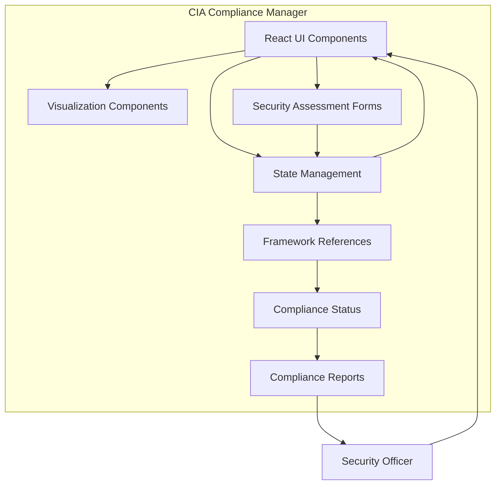

# CIA Compliance Manager Documentation

> For an interactive documentation experience, visit our [Documentation Portal](https://ciacompliancemanager.com/documentation.html)

## 📑 Table of Contents

- [Business Overview](#business-overview)
- [Architecture Overview](#architecture-overview)
- [Security Features](#security-features)
- [Documentation Resources](#documentation-resources)
- [Key Documentation Sections](#key-documentation-sections)
- [DevSecOps Practices](#devsecops-practices)
- [Getting Started](#getting-started)
- [Contributing](#contributing)

## 🏢 Business Overview

The CIA Compliance Manager is a comprehensive solution designed to help organizations manage and maintain compliance with various security frameworks and standards. The system focuses on the three core principles of information security:

- **Confidentiality**: Ensuring that information is accessible only to those authorized to have access
- **Integrity**: Maintaining the accuracy and completeness of data throughout its lifecycle
- **Availability**: Ensuring that information and systems are available when needed

## 🏛️ Architecture Overview

The CIA Compliance Manager is built with a modular React-based architecture that consists of:

1. **React Component Library and State Management** - Manages the assessment workflow, security state, and interface rendering
2. **Security Framework References and Constants** - Configuration for different compliance frameworks (NIST, ISO, SOC2, etc.)
3. **Dashboard Visualization Components** - Generates compliance visualizations, dashboards, and gap analyses
4. **TypeScript Type System and Interfaces** - Provides type-safe access to all functionality

For detailed architecture diagrams and documentation, see the [Architecture section](https://ciacompliancemanager.com/documentation.html#architecture) in our Documentation Portal. The project also includes [future architecture plans](https://github.com/Hack23/cia-compliance-manager/blob/main/docs/architecture/FUTURE_ARCHITECTURE.md) outlining the roadmap for upcoming enhancements.

### Module Dependencies

This diagram shows the relationship between different modules in the codebase:

## 🔒 Security Features

The application itself is built with security as a priority:

- **Role-Based Access Control** - Granular permissions for different user roles
- **Audit Logging** - Comprehensive logging of all system activities
- **Data Encryption** - All sensitive data is encrypted at rest and in transit
- **Secure Development** - Built following secure coding practices and regular security testing

For comprehensive security documentation, visit the [Security Documentation](https://ciacompliancemanager.com/documentation.html#security) in our Documentation Portal.

## 📚 Documentation Resources

The following resources are available in our [Documentation Portal](https://ciacompliancemanager.com/documentation.html):

| Resource                  | Description                                           | Link                                                                                         |
| ------------------------- | ----------------------------------------------------- | -------------------------------------------------------------------------------------------- |
| API Documentation         | Detailed API reference for all components             | [View](https://ciacompliancemanager.com/api)                                  |
| Architecture Diagrams     | C4 model diagrams and architecture documentation      | [View](/workspaces/cia-compliance-manager/docs/architecture/ARCHITECTURE.md)                 |
| Diagrams & Visualizations | UML and Mermaid diagrams showing system relationships | [View](https://ciacompliancemanager.com/diagrams)                             |
| Code Coverage             | Test coverage reports and metrics                     | [View](https://ciacompliancemanager.com/coverage)                             |
| Dependencies              | Visual representation of module dependencies          | [View](https://ciacompliancemanager.com/dependencies/module-dependencies.svg) |

## 📝 Key Documentation Sections

- [User Guide](https://github.com/Hack23/cia-compliance-manager/blob/main/docs/user-guide/README.md) - For end users of the system
- [Admin Guide](https://github.com/Hack23/cia-compliance-manager/blob/main/docs/admin-guide/README.md) - For system administrators
- [Integration Guide](https://github.com/Hack23/cia-compliance-manager/blob/main/docs/integration/README.md) - For connecting with other systems
- [API Reference](https://github.com/Hack23/cia-compliance-manager/blob/main/docs/api/README.md) - For developers integrating with our API
- [Security Documentation](https://github.com/Hack23/cia-compliance-manager/blob/main/docs/security/README.md) - Details on security features and certifications
- [Compliance Frameworks](https://github.com/Hack23/cia-compliance-manager/blob/main/docs/frameworks/README.md) - Documentation on supported compliance frameworks
- [Current Architecture](/workspaces/cia-compliance-manager/docs/architecture/ARCHITECTURE.md) - Current architecture documentation
- [Future Architecture](/workspaces/cia-compliance-manager/docs/architecture/FUTURE_ARCHITECTURE.md) - Planned architectural improvements
- [Performance Testing](/workspaces/cia-compliance-manager/docs/performance-testing.md) - Performance testing methodology and results

## 🛡️ DevSecOps Practices

The CIA Compliance Manager follows secure development practices, including:

### GitHub Actions Security

- **Principle of Least Privilege**: Workflows are configured with minimal required permissions
- **Permission Scoping**: Permissions are scoped at the job level rather than workflow level where possible
- **Supply Chain Security**: All releases include SBOM and build provenance attestations
- **Dependency Scanning**: Automated scanning of dependencies for vulnerabilities
- **OpenSSF Scorecard**: Regular security scoring through OpenSSF Scorecard ([View Current Score](https://scorecard.dev/viewer/?uri=github.com/Hack23/cia-compliance-manager))

### Continuous Security Testing

- **SAST**: Static Application Security Testing through CodeQL
- **SCA**: Software Composition Analysis through Dependabot
- **Security Monitoring**: Continuous monitoring of security issues

## 🚀 Getting Started

Please see our [Quick Start Guide](https://github.com/Hack23/cia-compliance-manager/blob/main/docs/getting-started.md) to begin using the CIA Compliance Manager.

## 👥 Contributing

We welcome contributions to our documentation. Please see the [Contributing Guide](https://github.com/Hack23/cia-compliance-manager/blob/main/docs/CONTRIBUTING.md) for more information.
