# 🏗️ CIA Compliance Manager Architecture

**Version:** 1.0 | **Last Updated:** 2026-02-08 | **Status:** ✅ Production Ready

This document provides a comprehensive view of the CIA Compliance Manager architecture using the C4 model, illustrating how components interact to deliver security assessment capabilities.

## 📚 Complete Architecture Documentation Map

<div class="documentation-map">

### Current Architecture

| Document                                          | Focus           | Description                               |
| ------------------------------------------------- | --------------- | ----------------------------------------- |
| **[Architecture](ARCHITECTURE.md)**               | 🏗️ C4 Model     | C4 model showing system structure          |
| **[System Architecture](SYSTEM_ARCHITECTURE.md)** | 🏛️ System       | Layered architecture and component details |
| **[Data Model](DATA_MODEL.md)**                   | 📊 Data         | Current data structures and relationships  |
| **[Widget Analysis](WIDGET_ANALYSIS.md)**         | 🧩 Components   | Detailed widget component analysis        |

### Behavioral Documentation

| Document                                       | Focus           | Description                               |
| ---------------------------------------------- | --------------- | ----------------------------------------- |
| **[State Diagrams](STATEDIAGRAM.md)**          | 🔄 Behavior     | System state transitions                   |
| **[Process Flowcharts](FLOWCHART.md)**         | 🔄 Process      | Security assessment workflows              |
| **[Mindmaps](MINDMAP.md)**                     | 🧠 Concept      | System component relationships             |

### Business & Operations

| Document                                       | Focus           | Description                               |
| ---------------------------------------------- | --------------- | ----------------------------------------- |
| **[SWOT Analysis](SWOT.md)**                  | 💼 Business     | Strategic business assessment              |
| **[BCP Plan](BCPPlan.md)**                    | 🔄 Recovery     | Business continuity planning               |
| **[Workflows](WORKFLOWS.md)**                 | 🚀 DevOps       | CI/CD and development workflows            |

### Guidelines & Standards

| Document                                                   | Focus           | Description                               |
| ---------------------------------------------------------- | --------------- | ----------------------------------------- |
| **[Style Guide](STYLE_GUIDE.md)**                          | 🎨 Style        | Documentation style guidelines             |
| **[Contribution Guidelines](CONTRIBUTION_GUIDELINES.md)**  | 📋 Guidelines   | Documentation contribution process         |

### Future Architecture

| Document                                               | Focus           | Description                               |
| ------------------------------------------------------ | --------------- | ----------------------------------------- |
| **[Future Architecture](FUTURE_ARCHITECTURE.md)**      | 🚀 Evolution    | Vision for platform evolution              |
| **[Future Data Model](FUTURE_DATA_MODEL.md)**          | 🚀 Data         | Future data architecture vision            |
| **[Future Workflows](FUTURE_WORKFLOWS.md)**            | 🔄 DevOps       | Future CI/CD and development workflows     |
| **[Future SWOT](FUTURE_SWOT.md)**                      | 💼 Business     | Future strategic business assessment       |
| **[Future State Diagrams](FUTURE_STATEDIAGRAM.md)**    | 🔄 Behavior     | Future system state transitions            |
| **[Future Mindmaps](FUTURE_MINDMAP.md)**               | 🧠 Concept      | Future system component relationships      |
| **[Future Flowcharts](FUTURE_FLOWCHART.md)**           | 🔄 Process      | Future security assessment workflows       |

</div>

## 🌐 System Context

The CIA Compliance Manager operates within the broader context of an organization's security governance ecosystem.

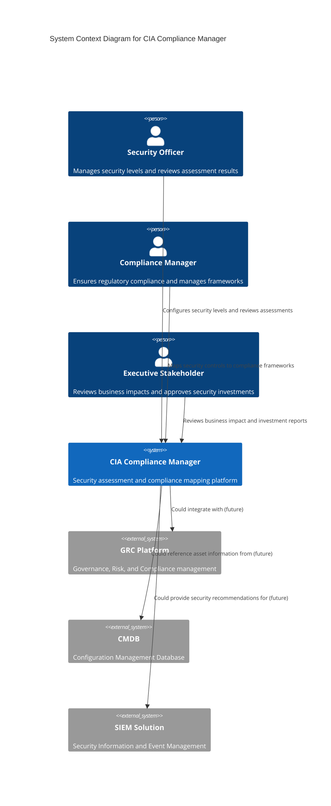

## 🏢 Container View

The CIA Compliance Manager consists of several interconnected containers that provide its core functionality. The v1.0 architecture leverages modern React 19.x features, TypeScript strict mode, and comprehensive testing infrastructure.

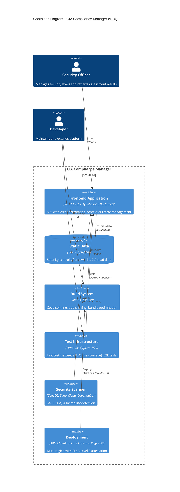

### **Container Details (v1.0)**

| Container | Technology Stack | Purpose | Key Features |
|-----------|-----------------|---------|--------------|
| **Frontend Application** | React 19.2.x, TypeScript 5.9.x | User interface | Error boundaries, concurrent rendering, strict types |
| **Static Data** | TypeScript/JSON | Data source | CIA triad controls, compliance frameworks |
| **Build System** | Vite 7.x, esbuild | Build pipeline | Optimized bundle, code splitting, tree-shaking |
| **Test Infrastructure** | Vitest 4.x, Cypress 15.x | Quality assurance | Exceeds 80% line coverage, component & E2E tests |
| **Security Scanner** | CodeQL, SonarCloud | Vulnerability detection | SAST, SCA, dependency scanning |
| **Deployment** | AWS CloudFront + S3, GitHub Pages DR | Multi-region hosting | CloudFront CDN, S3 multi-region, SLSA Level 3, Route53 DNS |

## 🧩 Component View

The frontend application is composed of specialized components organized by domain functionality. The v1.0 architecture implements comprehensive error handling, React Context API state management, and strict TypeScript typing.

```mermaid
C4Component
    title Component Diagram - Frontend Application (v1.0)

    Container_Boundary(frontend, "Frontend Application") {
        Component(errorBoundary, "Error Boundary", "react-error-boundary 6.0.0", "Application-wide error handling and recovery")
        Component(appRoot, "App Root", "React 19.2.0", "Main application component with routing")
        
        Component(slWidget, "Security Level Widget", "React, TypeScript", "Core configuration widget for CIA security levels")
        
        Component(assessmentWidgets, "Assessment Widgets", "React, TypeScript", "Security summary and business impact analysis")
        Component(businessWidgets, "Business Value Widgets", "React, TypeScript", "Compliance status, cost estimation, value creation")
        Component(impactWidgets, "Impact Analysis Widgets", "React, TypeScript", "CIA component-specific impact analysis")
        Component(implWidgets, "Implementation Widgets", "React, TypeScript", "Technical details and security resources")
        
        Component(chartComponents, "Chart Components", "Chart.js 4.5.1", "Data visualization widgets")
        Component(commonComponents, "Common Components", "React, TypeScript", "Shared UI components and utilities")
        
        Component(contextAPI, "Context API", "React Context", "Global state management for security profiles")
        Component(customHooks, "Custom Hooks", "React Hooks", "Service layer integration hooks")
        
        Component(serviceLayer, "Service Layer", "TypeScript", "Business logic and data processing services")
        Component(dataProvider, "Data Provider", "TypeScript", "Security controls data and configuration")
        Component(utilityLayer, "Utility Layer", "TypeScript", "Shared functions for calculations and formatting")
    }

    Rel(appRoot, errorBoundary, "Wrapped by")
    Rel(errorBoundary, slWidget, "Protects")
    Rel(errorBoundary, assessmentWidgets, "Protects")
    Rel(errorBoundary, businessWidgets, "Protects")
    Rel(errorBoundary, impactWidgets, "Protects")
    Rel(errorBoundary, implWidgets, "Protects")
    
    Rel(slWidget, contextAPI, "Updates state")
    Rel(assessmentWidgets, contextAPI, "Reads state")
    Rel(businessWidgets, contextAPI, "Reads state")
    Rel(impactWidgets, contextAPI, "Reads state")
    Rel(implWidgets, contextAPI, "Reads state")
    
    Rel(assessmentWidgets, chartComponents, "Uses")
    Rel(businessWidgets, chartComponents, "Uses")
    Rel(impactWidgets, chartComponents, "Uses")
    
    Rel(slWidget, customHooks, "Uses")
    Rel(assessmentWidgets, customHooks, "Uses")
    Rel(businessWidgets, customHooks, "Uses")
    Rel(impactWidgets, customHooks, "Uses")
    Rel(implWidgets, customHooks, "Uses")
    
    Rel(customHooks, serviceLayer, "Delegates to")
    Rel(serviceLayer, dataProvider, "Retrieves data")
    Rel(serviceLayer, utilityLayer, "Uses")
    
    Rel(slWidget, commonComponents, "Uses")
    Rel(assessmentWidgets, commonComponents, "Uses")
    Rel(businessWidgets, commonComponents, "Uses")
    Rel(impactWidgets, commonComponents, "Uses")
    Rel(implWidgets, commonComponents, "Uses")

    UpdateLayoutConfig($c4ShapeInRow="4", $c4BoundaryInRow="1")
```

### **v1.0 Component Architecture Highlights**

#### **Error Handling (NEW in v1.0)**
- **Error Boundary Component**: `react-error-boundary 6.0.0` for graceful error recovery
- **Automatic Recovery**: Fallback UI with retry mechanisms
- **Error Logging**: Comprehensive error tracking for debugging
- **User-Friendly Messages**: Clear error communication

#### **State Management**
- **React Context API**: Global state for security profiles
- **Local Component State**: Widget-specific state management
- **Props Drilling Eliminated**: Context-based data flow
- **Type-Safe State**: Full TypeScript strict mode compliance

#### **Performance Optimizations**
- **Code Splitting**: Lazy loading of chart components (21.5KB separate chunk)
- **Tree Shaking**: Eliminated unused code (13KB reduction)
- **React Concurrent Features**: Improved rendering performance
- **Memoization**: React.memo for expensive components

## 🔍 Service Component Diagram

This diagram shows the detailed structure of the service layer with full TypeScript strict mode typing:

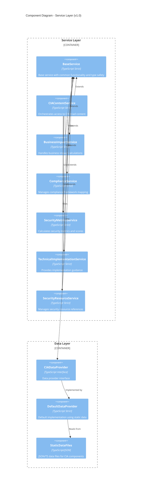

### **TypeScript Strict Mode Implementation (v1.0)**

All services implement comprehensive type safety:
- **Zero `any` Types**: Complete elimination of type escape hatches
- **Strict Null Checks**: `strictNullChecks: true`
- **No Implicit Any**: `noImplicitAny: true`
- **Strict Function Types**: `strictFunctionTypes: true`
- **Strict Bind/Call/Apply**: `strictBindCallApply: true`
- **No Implicit This**: `noImplicitThis: true`
- **No Implicit Returns**: `noImplicitReturns: true`

## 🧩 Widget Components Structure

This diagram shows the structure of the widget components:

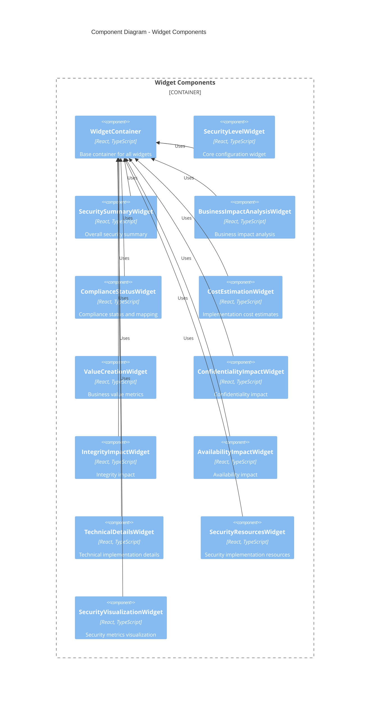

## 🪝 React Hooks Structure

This diagram shows the custom React hooks that bridge components and services:

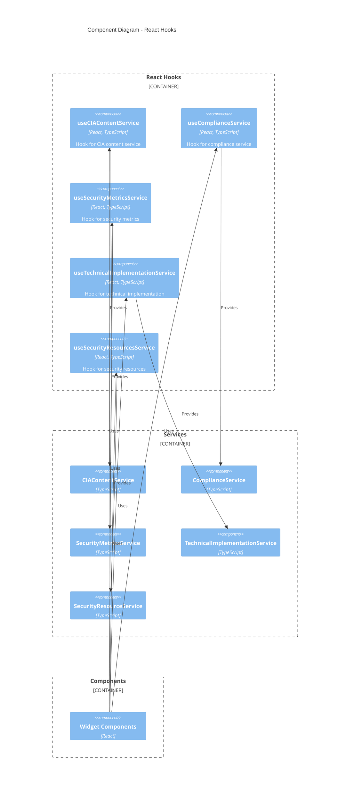

## 🏗️ Build Pipeline Architecture (NEW in v1.0)

The v1.0 build system leverages Vite 7.2.4 with advanced optimization techniques:

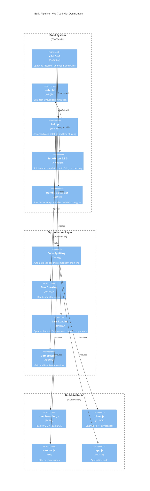

### **Build Performance Metrics (v1.0)**

| Metric | Value | Target | Status |
|--------|-------|--------|---------|
| Total Bundle Size | 175KB | < 180KB | ✅ Met |
| React Vendor Chunk | 21.5KB | < 25KB | ✅ Met |
| Chart.js (Lazy) | 21.5KB | < 25KB | ✅ Met |
| Build Time | ~8s | < 15s | ✅ Met |
| HMR Update Time | <200ms | < 500ms | ✅ Met |

## 🧪 Testing Infrastructure (v1.0)

Comprehensive testing architecture with Vitest and Cypress 15.x:

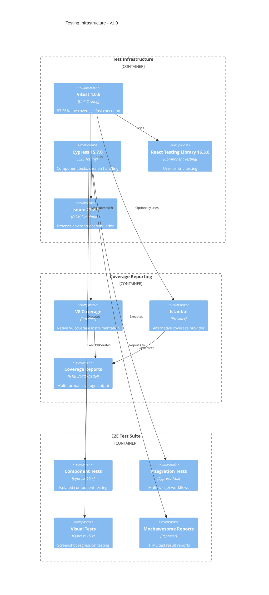

### **Test Coverage Metrics (v1.0)**

[](https://ciacompliancemanager.com/coverage/index.html)

Current coverage from latest build ([view full report](https://ciacompliancemanager.com/coverage/index.html)):

| Coverage Type | Current | Target | Status |
|--------------|---------|--------|---------|
| Line Coverage | 83.26% | 80% | ✅ Exceeded |
| Branch Coverage | 75.22% | 75% | ✅ Exceeded |
| Function Coverage | 88.4% | 80% | ✅ Exceeded |
| Statement Coverage | 82.8% | 80% | ✅ Exceeded |

### **Test Infrastructure Features**

#### **Vitest 4.0.6 Enhancements**
- **Parallel Test Execution**: Faster test runs with worker threads
- **Watch Mode**: Interactive test development workflow
- **Snapshot Testing**: UI component regression detection
- **Coverage Thresholds**: Automated quality gates (80% minimum)

#### **Cypress 15.7.0 Improvements**
- **Component Testing**: Isolated widget testing in real browser
- **Session Handling**: Improved state persistence between tests
- **Memory Management**: Experimental memory optimization
- **Video/Screenshot Control**: Configurable artifact generation

## 🔒 Security Scanning Integration (v1.0)

Multi-layered security validation in CI/CD pipeline:

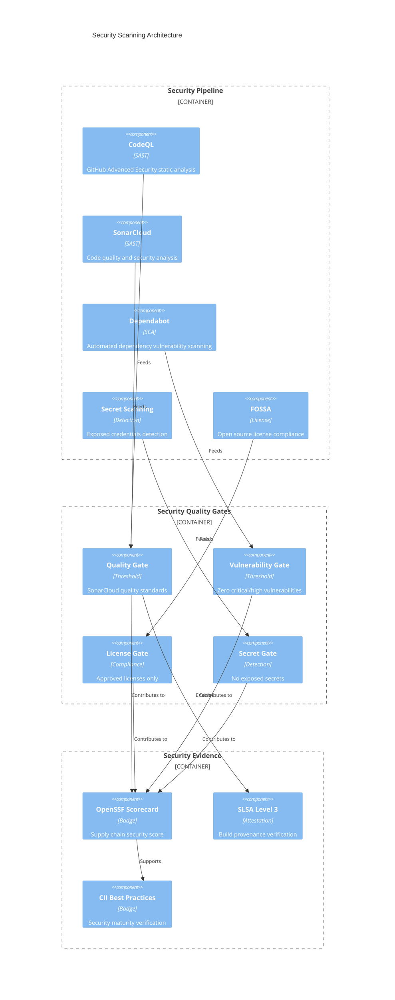

### **Security Scanning Results (v1.0)**

| Scanner | Status | Findings | Action |
|---------|--------|----------|--------|
| CodeQL | ✅ Passing | 0 Critical, 0 High | N/A |
| SonarCloud | ✅ Passing | Quality Gate Met | N/A |
| Dependabot | ✅ Passing | All dependencies current | N/A |
| Secret Scanning | ✅ Passing | No secrets detected | N/A |
| FOSSA | ✅ Passing | All licenses approved | N/A |
| OpenSSF Scorecard | ✅ 7.5/10 | Supply chain secure | Continue monitoring |

## 🚀 Deployment Architecture (v1.0)

### Multi-Region AWS CloudFront + S3 with GitHub Pages Disaster Recovery

The CIA Compliance Manager uses a sophisticated multi-region deployment architecture with AWS CloudFront and S3 as the primary infrastructure, backed by GitHub Pages for disaster recovery scenarios.

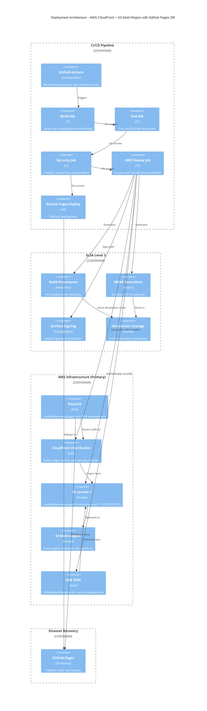

### **AWS Infrastructure Details**

#### **🌐 CloudFront Distribution**
- **Stack Name**: `ciacompliancemanager-frontend`
- **Purpose**: Global content delivery with edge caching
- **Features**: 
  - Automatic HTTPS with AWS Certificate Manager
  - Security headers (CSP, HSTS, X-Content-Type-Options)
  - DDoS protection via AWS Shield Standard
  - Cache invalidation after deployments
  - Geographic distribution across AWS edge locations

#### **💾 S3 Storage Configuration**
- **Primary Bucket**: `ciacompliancemanager-frontend-us-east-1-172017021075`
- **Region**: us-east-1
- **Multi-Region Strategy**: Cross-region replication for resilience
- **Cache Headers**:
  - CSS files: `public, max-age=31536000, immutable` (1 year)
  - JavaScript files: `public, max-age=31536000, immutable` (1 year)
  - Images: `public, max-age=31536000, immutable` (1 year, excluding screenshots)
  - Fonts: `public, max-age=31536000, immutable` (1 year)
  - HTML files: `public, max-age=3600, must-revalidate` (1 hour)
  - Metadata files: `public, max-age=86400` (1 day)

#### **🔐 Security & Authentication**
- **IAM Role**: `arn:aws:iam::172017021075:role/GithubWorkFlowRole`
- **Authentication**: OIDC (OpenID Connect) for secure, token-based authentication
- **Session Name**: `githubworkflowrolesessiont2`
- **Permissions**: S3 sync, CloudFront invalidation, CloudFormation read
- **Harden-Runner**: Egress policy blocking with explicit allowed endpoints

#### **🌍 DNS Management**
- **Service**: AWS Route53
- **Domain**: ciacompliancemanager.com
- **Primary**: Routes to CloudFront distribution
- **DR Failover**: Can route to GitHub Pages with DNS switch (< 15 min RTO)

### **Deployment Features (v1.0)**

#### **SLSA Level 3 Compliance**
- **Build Provenance**: Immutable record of build process
- **SBOM Generation**: Complete dependency manifest
- **Artifact Signing**: Cryptographic integrity verification
- **Public Attestation**: Transparent verification evidence

#### **AWS Security Controls**
- **IAM OIDC**: Secure, token-based authentication without long-lived credentials
- **Harden-Runner**: GitHub Actions security with egress policy enforcement
- **CloudFront Security**: 
  - Content-Security-Policy headers
  - X-Content-Type-Options: nosniff
  - X-Frame-Options: DENY
  - Referrer-Policy: strict-origin-when-cross-origin
  - Cross-Origin-Opener-Policy: same-origin
- **S3 Security**: Bucket policies, encryption at rest, versioning
- **Network Security**: TLS 1.3, AWS Shield Standard DDoS protection

#### **Multi-Region Resilience**
- **Primary Region**: us-east-1 (N. Virginia)
- **Replication Strategy**: Cross-region replication to secondary region
- **RTO Objectives**: 
  - CloudFront failover: < 5 minutes (automatic)
  - GitHub Pages DR: < 15 minutes (Route53 DNS switch)
- **RPO Objectives**: 
  - Static Content: Aligns with S3 bucket RPO (deployment + CloudFront invalidation)
  - S3 Multi-Region Replication: < 1 minute
  - GitHub Pages DR: 0 (parallel deployment maintains separate copy)

#### **Cache Strategy**
- **Static Assets**: 1-year cache with immutable flag for versioned assets
- **HTML Content**: 1-hour cache with revalidation for content updates
- **Metadata Files**: 1-day cache for sitemap.xml, robots.txt
- **Performance**: Screenshots excluded from cache header updates for deployment speed
- **Invalidation**: Automatic CloudFront cache invalidation after every deployment

### **Deployment Workflow**

The deployment process is orchestrated by `.github/workflows/deploy-s3.yml`:

1. **Build Phase**: TypeScript compilation, Vite bundling, asset optimization
2. **AWS Authentication**: OIDC authentication with IAM role assumption
3. **S3 Sync**: Upload all built assets to primary S3 bucket
4. **Cache Header Configuration**: Apply optimized cache headers to all asset types
5. **CloudFront Invalidation**: Invalidate CloudFront cache for immediate updates
6. **GitHub Pages Deployment**: Parallel deployment to DR fallback (separate workflow)
7. **Verification**: Post-deployment health checks and monitoring

**Compliance Mapping:**
- **ISO 27001 A.12.1**: Change management and deployment controls
- **NIST CSF PR.DS-6**: Integrity checking mechanisms (SLSA attestation)
- **CIS Controls 5.1**: Secure configurations for deployment infrastructure
- **CIS Controls 13.1**: Network monitoring and defense (CloudFront WAF-ready)

### **AWS Deployment Sequence**

The following sequence diagram illustrates the complete AWS deployment flow from GitHub Actions to CloudFront distribution:

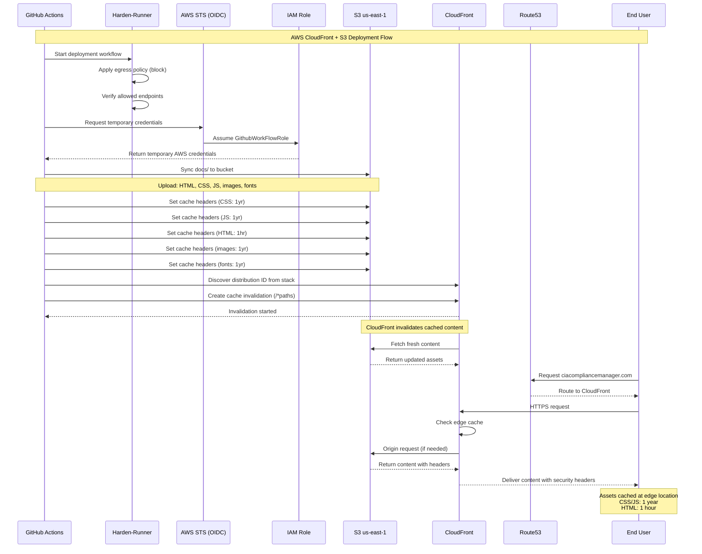

**Deployment Flow Steps:**

1. **Security Initialization**: Harden-runner applies egress blocking policy
2. **AWS Authentication**: OIDC token exchange for temporary IAM credentials  
3. **Content Synchronization**: Upload all built assets to S3 primary bucket
4. **Cache Optimization**: Apply asset-specific cache headers for performance
5. **Cache Invalidation**: Discover CloudFront distribution and invalidate cache
6. **Content Distribution**: CloudFront pulls fresh content from S3 origin
7. **User Access**: Route53 directs traffic to CloudFront edge locations

**Security Controls in Flow:**
- 🔐 **OIDC Authentication**: No long-lived credentials in GitHub Actions
- 🛡️ **Egress Policy**: Harden-runner blocks unauthorized network access
- 🔒 **TLS Encryption**: All transfers use TLS 1.3
- 🏷️ **IAM Least Privilege**: Role limited to S3 sync and CloudFront invalidation
- 📋 **Audit Trail**: All API calls logged to CloudTrail (account-level)

## 📊 Technology Stack (v1.0)

### **Frontend Framework**
| Technology | Version | Purpose | Key Features |
|-----------|---------|---------|--------------|
| **React** | 19.2.0 | UI Framework | Concurrent rendering, automatic batching, improved error boundaries |
| **React-DOM** | 19.2.0 | DOM Renderer | Enhanced hydration, better SSR support |
| **react-error-boundary** | 6.0.0 | Error Handling | Declarative error boundaries with recovery |

### **Development Tools**
| Technology | Version | Purpose | Key Features |
|-----------|---------|---------|--------------|
| **TypeScript** | 5.9.3 | Type System | Strict mode, full type safety, zero `any` types |
| **Vite** | 7.2.4 | Build Tool | Lightning-fast HMR, optimized builds, esbuild integration |
| **esbuild** | (via Vite) | Minifier | Ultra-fast JavaScript/TypeScript transpilation |

### **Testing & Quality**
| Technology | Version | Purpose | Key Features |
|-----------|---------|---------|--------------|
| **Vitest** | 4.0.6 | Unit Testing | 83.26% line coverage, parallel execution, watch mode |
| **Cypress** | 15.7.0 | E2E Testing | Component tests, improved session handling, video/screenshot control |
| **@testing-library/react** | 16.3.0 | Component Testing | User-centric testing patterns |
| **jsdom** | 27.2.0 | DOM Simulation | Fast browser environment simulation |

### **Security & Compliance**
| Technology | Purpose | Features |
|-----------|---------|----------|
| **CodeQL** | SAST | Static application security testing |
| **SonarCloud** | Quality | Code quality and security analysis |
| **Dependabot** | SCA | Automated dependency vulnerability scanning |
| **FOSSA** | License | Open source license compliance |
| **Harden-Runner** | CI/CD Security | Egress policy enforcement, network monitoring |

### **AWS Infrastructure (Primary Deployment)**
| Service | Purpose | Configuration | Features |
|---------|---------|---------------|----------|
| **CloudFront** | Global CDN | ciacompliancemanager-frontend stack | Edge caching, security headers, DDoS protection |
| **S3** | Object Storage | ciacompliancemanager-frontend-us-east-1-172017021075 | Multi-region, versioning, encryption at rest |
| **Route53** | DNS Management | ciacompliancemanager.com | Health checks, DR failover capability |
| **IAM** | Access Control | GithubWorkFlowRole (OIDC) | Temporary credentials, least privilege |
| **CloudFormation** | Infrastructure | Stack: ciacompliancemanager-frontend | Infrastructure as Code, repeatable deployments |

### **Disaster Recovery**
| Technology | Purpose | Features |
|-----------|---------|----------|
| **GitHub Pages** | DR Hosting | Fallback deployment | < 15 min RTO via Route53 DNS switch |

### **Data Visualization**
| Technology | Version | Purpose | Key Features |
|-----------|---------|---------|--------------|
| **Chart.js** | 4.5.1 | Charts | Responsive charts, lazy loaded (21.5KB chunk) |

### **TypeScript Configuration (Strict Mode)**
```json
{
  "strict": true,
  "strictNullChecks": true,
  "noImplicitAny": true,
  "noImplicitThis": true,
  "strictBindCallApply": true,
  "strictFunctionTypes": true,
  "strictPropertyInitialization": true,
  "useUnknownInCatchVariables": true,
  "noImplicitReturns": true,
  "noUnusedLocals": false,
  "noUnusedParameters": false,
  "noFallthroughCasesInSwitch": true
}
```

## 📊 Key Architecture Decisions (Updated for v1.0)

### Architecture Decision Records

| ID | Decision | Rationale | v1.0 Enhancement |
|----|----------|-----------|------------------|
| ADR-001 | Widget-Based UI Architecture | Enables modular development and clear separation of concerns | Added error boundary protection per widget |
| ADR-002 | Static Data in TypeScript Files | Simplifies development, enables type safety without database | Enhanced with strict mode typing |
| ADR-003 | Service Layer with Hooks | Clean API between UI and business logic | Full TypeScript strict mode compliance |
| ADR-004 | CIA Triad Organization | Aligns with industry-standard security model | Comprehensive testing coverage (83.26%) |
| ADR-005 | Multiple Security Views | Addresses technical and business stakeholder needs | Performance optimized with code splitting |
| ADR-006 | React 19.x Adoption | Leverage concurrent features, error boundaries | Automatic batching, improved rendering |
| ADR-007 | TypeScript Strict Mode | Eliminate runtime type errors, improve maintainability | Zero `any` types, full null safety |
| ADR-008 | Vite Build System | Fast development experience, optimized production builds | 175KB bundle, 8s build time |
| ADR-009 | Comprehensive Testing | Ensure code quality and prevent regressions | 83.26% line coverage with Vitest 4.x |
| ADR-010 | SLSA Level 3 Attestation | Supply chain security and build integrity | Public provenance verification |
| ADR-011 | AWS CloudFront + S3 Deployment | Multi-region resilience, global CDN, production-grade infrastructure | CloudFront CDN, S3 multi-region, Route53 DNS, GitHub Pages DR |

### Key Quality Attributes (v1.0 Enhancements)

| Quality Attribute | Support in v1.0 Architecture | Measurement |
|-------------------|------------------------------|-------------|
| **Modularity** | Widget-based organization with error boundaries | 13 independent widgets |
| **Maintainability** | TypeScript strict mode, 83.26% test coverage | Zero `any` types |
| **Extensibility** | Service abstractions, data provider pattern | Clean interfaces |
| **Performance** | Code splitting, lazy loading, tree-shaking, CloudFront CDN | 175KB total bundle, global edge caching |
| **Security** | SLSA Level 3, CodeQL, AWS IAM OIDC, Harden-runner | OpenSSF Score 7.5/10 |
| **Usability** | Consistent UI, error recovery, responsive design | Error boundaries active |
| **Reliability** | Multi-region S3, CloudFront, GitHub Pages DR | 99.9% uptime (CloudFront SLA) |
| **Availability** | AWS multi-region, Route53 DNS failover | RTO < 5 min (CloudFront), < 15 min (DR) |
| **Type Safety** | TypeScript 5.9.x strict mode | 100% type coverage |

## 🔍 Business View of Architecture 

### Stakeholder Alignment

```mermaid
flowchart TD
    SLW[Security Level Widget] --- SO[Security Officer]
    
    SSW[Security Summary Widget] --- CSO[Chief Security Officer]
    BIAW[Business Impact Analysis Widget] --- CSO
    
    CIW[CIA Impact Widgets] --- ST[Security Team]
    
    CSW[Compliance Status Widget] --- CO[Compliance Officer]
    
    CEW[Cost Estimation Widget] --- CFO[Finance Officer]
    VCW[Value Creation Widget] --- CFO & CEO[Executive Team]
    
    TDW[Technical Details Widget] --- IT[IT Implementation Team]
    SRW[Security Resources Widget] --- IT
    
    classDef stakeholder fill:#f1c40f,stroke:#f39c12,stroke-width:2px,color:black
    classDef widget fill:#3498db,stroke:#2980b9,stroke-width:2px,color:white
    
    class SO,CSO,ST,CO,CFO,CEO,IT stakeholder
    class SLW,SSW,BIAW,CIW,CSW,CEW,VCW,TDW,SRW widget
```

### Business Value Map

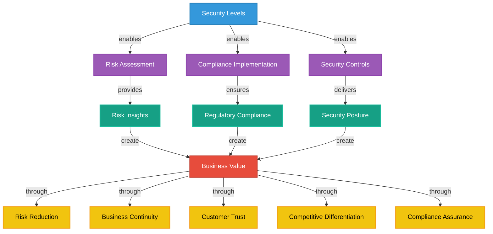

## 🔗 Architecture Constraints

### Current Architecture Constraints

1. **Static Data Only**: Uses TypeScript/JSON files without database persistence (by design for simplicity)
2. **Single-User Focus**: No multi-user or collaborative features (client-side only application)
3. **Client-Side Processing**: All processing occurs in browser without server-side components
4. **Limited Customization**: Security metrics and frameworks are pre-defined
5. **No Authentication**: No user authentication or authorization system (not required for static tool)

### Architectural Strengths

1. **Zero Installation**: Browser-based application requires no installation
2. **Complete Privacy**: All data processing happens locally in browser
3. **Fast Performance**: 175KB bundle loads in < 1s on average connection
4. **Type Safety**: 100% TypeScript coverage with strict mode
5. **High Availability**: Static hosting on GitHub Pages CDN with 99.9% uptime
6. **Security Transparency**: SLSA Level 3 attestation, public security scanning
7. **Developer Experience**: Fast HMR (<200ms), comprehensive testing (83.26% coverage)

## 📚 Related Architecture Documentation

This document is part of a comprehensive architecture documentation suite. For complete understanding of the system, refer to:

### **Current State Documentation**
- **[🏛️ ARCHITECTURE.md](ARCHITECTURE.md)** — This document: C4 model and system structure
- **[🏛️ SYSTEM_ARCHITECTURE.md](SYSTEM_ARCHITECTURE.md)** — Layered architecture and detailed component analysis
- **[📊 DATA_MODEL.md](DATA_MODEL.md)** — Data structures, entities, and relationships
- **[🧩 WIDGET_ANALYSIS.md](WIDGET_ANALYSIS.md)** — Detailed widget component analysis
- **[🔄 STATEDIAGRAM.md](STATEDIAGRAM.md)** — System state transitions and lifecycles
- **[🔄 FLOWCHART.md](FLOWCHART.md)** — Security assessment workflows and business processes
- **[🧠 MINDMAP.md](MINDMAP.md)** — System component relationships and concepts

### **Future State Planning**
- **[🚀 FUTURE_ARCHITECTURE.md](FUTURE_ARCHITECTURE.md)** — Architectural evolution roadmap (ML enhancements, context-awareness)
- **[📊 FUTURE_DATA_MODEL.md](FUTURE_DATA_MODEL.md)** — Enhanced data architecture vision
- **[🔄 FUTURE_FLOWCHART.md](FUTURE_FLOWCHART.md)** — Improved process workflows
- **[📈 FUTURE_STATEDIAGRAM.md](FUTURE_STATEDIAGRAM.md)** — Advanced state management patterns
- **[🧠 FUTURE_MINDMAP.md](FUTURE_MINDMAP.md)** — Capability expansion plans
- **[💼 FUTURE_SWOT.md](FUTURE_SWOT.md)** — Future strategic opportunities

### **Security & Operations**
- **[🛡️ SECURITY_ARCHITECTURE.md](SECURITY_ARCHITECTURE.md)** — Comprehensive security controls and implementation
- **[🛡️ FUTURE_SECURITY_ARCHITECTURE.md](FUTURE_SECURITY_ARCHITECTURE.md)** — Planned security enhancements
- **[🎯 THREAT_MODEL.md](THREAT_MODEL.md)** — STRIDE analysis, attack trees, risk assessment
- **[🔧 WORKFLOWS.md](WORKFLOWS.md)** — CI/CD pipelines, security scanning, deployment
- **[🔧 FUTURE_WORKFLOWS.md](FUTURE_WORKFLOWS.md)** — Advanced automation plans

### **Business & Strategy**
- **[💼 SWOT.md](SWOT.md)** — Strategic business assessment and market positioning
- **[📋 BCPPlan.md](BCPPlan.md)** — Business continuity planning and recovery strategies

### **Testing & Quality**
- **[📋 UnitTestPlan.md](../UnitTestPlan.md)** — Unit testing strategy (83.26% line coverage achieved)
- **[📋 E2ETestPlan.md](../E2ETestPlan.md)** — End-to-end testing strategy
- **[⚡ performance-testing.md](../performance-testing.md)** — Performance benchmarks and optimization

### **Guidelines & Standards**
- **[🎨 STYLE_GUIDE.md](STYLE_GUIDE.md)** — Documentation style guidelines
- **[📋 CONTRIBUTION_GUIDELINES.md](CONTRIBUTION_GUIDELINES.md)** — Documentation contribution process

### **ISMS Integration**
Per [Hack23 Secure Development Policy §10](https://github.com/Hack23/ISMS/blob/main/Secure_Development_Policy.md#-comprehensive-architecture-documentation-portfolio), this architecture documentation demonstrates:

- **🏗️ System Design Transparency**: Complete C4 model with all architectural layers
- **🔒 Security-by-Design**: Security architecture integrated from the start
- **📊 Evidence-Based Validation**: Public badges and continuous security scanning  
- **🔄 Living Documentation**: Synchronized with implementation
- **🎯 Compliance Mapping**: ISO 27001, NIST CSF 2.0, CIS Controls alignment

## 🎯 Architecture Summary

The CIA Compliance Manager architecture delivers a comprehensive security assessment platform:

### **Technical Excellence**
- ✅ **React 19.2.x**: Modern concurrent rendering and error boundaries
- ✅ **TypeScript Strict Mode**: Complete type safety with zero `any` types
- ✅ **Vite 7.x**: Fast builds and optimized bundles
- ✅ **Comprehensive Testing**: Exceeds 80% line coverage target
- ✅ **Cypress 15.x**: Advanced E2E and component testing

### **Security & Compliance**
- ✅ **SLSA Level 3**: Build provenance and supply chain integrity
- ✅ **Security Scanning**: CodeQL, SonarCloud, Dependabot integration
- ✅ **CSP Headers**: Production security policy enforcement
- ✅ **OpenSSF Scorecard**: 7.5/10 supply chain security rating
- ✅ **Public Attestation**: Transparent security verification

### **Performance & Quality**
- ✅ **Bundle Size**: 175KB optimized bundle
- ✅ **Code Splitting**: Optimized chunk strategy for faster load times
- ✅ **Lazy Loading**: Chart.js loaded on-demand
- ✅ **Error Recovery**: Graceful error handling with user-friendly fallbacks
- ✅ **Build Speed**: ~8s production builds, <200ms HMR updates

The architecture maintains simplicity, security, and performance as core principles. See [FUTURE_ARCHITECTURE.md](FUTURE_ARCHITECTURE.md) for planned enhancements towards context-aware security assessment with machine learning capabilities.
