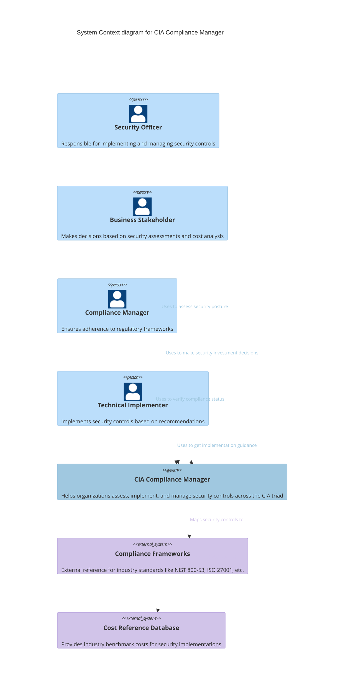
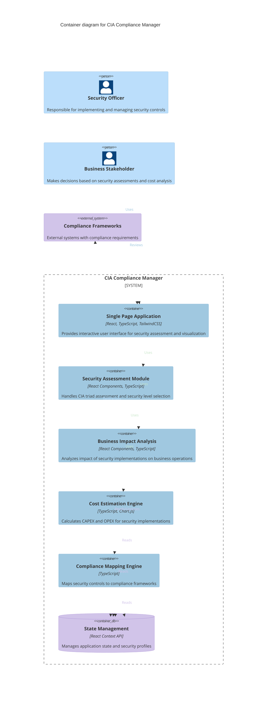
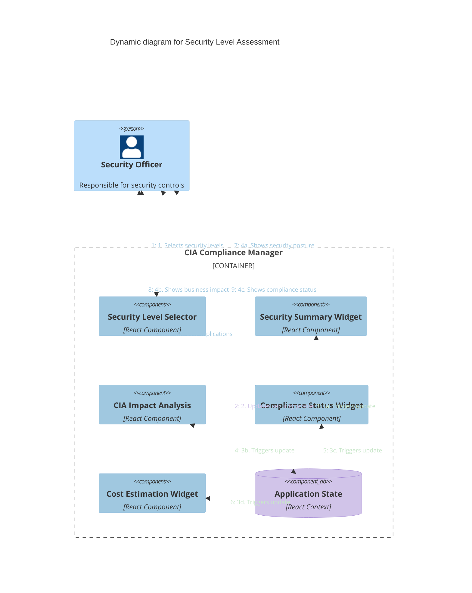

# CIA Compliance Manager Architecture

This document serves as the primary entry point for the CIA Compliance Manager's architectural documentation. It provides a comprehensive view of the system's design using the C4 model approach, starting from a high-level system context and drilling down to component interactions.

> **Note:** For a more interactive experience, you can also view this documentation in our [Documentation Portal](../documentation.html).

## 📚 Architecture Documentation Map

| Document                                            | Type    | Focus           | Description                                                          | Documentation Link                                   |
| --------------------------------------------------- | ------- | --------------- | -------------------------------------------------------------------- | ---------------------------------------------------- |
| **[Current Architecture](ARCHITECTURE.md)**         | Core    | 🏛️ Architecture | C4 model showing current system containers, components, and dynamics | [View in Portal](../documentation.html#architecture) |
| **[Future Architecture](FUTURE_ARCHITECTURE.md)**   | Future  | 🏛️ Architecture | Vision for context-aware security posture management platform        | [View in Portal](../documentation.html#architecture) |
| **[State Diagrams](STATEDIAGRAM.md)**               | Current | 🔄 Behavior     | Security profile and compliance status state transitions             | [View in Portal](../documentation.html#diagrams)     |
| **[Future State Diagrams](FUTURE_STATEDIAGRAM.md)** | Future  | 🔄 Behavior     | Context-aware and adaptive security state transitions                | [View in Portal](../documentation.html#diagrams)     |
| **[Process Flowcharts](FLOWCHART.md)**              | Current | 🔄 Process      | Security assessment and compliance workflows                         | [View in Portal](../documentation.html#diagrams)     |
| **[Future Flowcharts](FUTURE_FLOWCHART.md)**        | Future  | 🔄 Process      | ML-enhanced and context-aware workflows                              | [View in Portal](../documentation.html#diagrams)     |
| **[Mindmaps](MINDMAP.md)**                          | Current | 🧠 Concept      | System structure and component relationships                         | [View in Portal](../documentation.html#diagrams)     |
| **[Future Mindmaps](FUTURE_MINDMAP.md)**            | Future  | 🧠 Concept      | Evolution roadmap and capability expansion                           | [View in Portal](../documentation.html#diagrams)     |
| **[SWOT Analysis](SWOT.md)**                        | Current | 💼 Business     | Strategic strengths, weaknesses, opportunities, and threats          | [View in Portal](../documentation.html#architecture) |
| **[Future SWOT Analysis](FUTURE_SWOT.md)**          | Future  | 💼 Business     | Strategic analysis of context-aware security platform                | [View in Portal](../documentation.html#architecture) |
| **[CI/CD Workflows](WORKFLOWS.md)**                 | Current | 🔧 DevOps       | Build, test, and deployment automation                               | [View in Portal](../documentation.html#architecture) |
| **[Future Workflows](FUTURE_WORKFLOWS.md)**         | Future  | 🔧 DevOps       | Advanced CI/CD with ML and security automation                       | [View in Portal](../documentation.html#architecture) |
| **[Future Data Model](FUTURE_DATA_MODEL.md)**       | Future  | 📊 Data         | Enhanced context-aware data architecture                             | [View in Portal](../documentation.html#architecture) |

## C4 System Context Diagram

**💼 Business Focus:** Illustrates how different stakeholders interact with the system and the external dependencies required for compliance references and cost estimation.

**🔒 Security Focus:** Demonstrates clear boundaries between internal system components and external data sources, establishing the trust boundaries for security analysis.

> For interactive diagrams and visualizations, visit our [Documentation Portal](../documentation.html#diagrams)

## C4 Container Diagram

**🏛️ Architecture Focus:** Reveals the modular construction of the application with distinct components for security assessment, business impact analysis, cost estimation, and compliance mapping.

**🔧 Technical Focus:** Highlights how the single-page application architecture leverages React and TypeScript to create a responsive, client-side experience with centralized state management.

> For API documentation related to these containers, see the [API Documentation](../documentation.html#api-documentation) section in our portal.

## C4 Component Diagram

**🏛️ Architecture Focus:** Demonstrates the internal structure of the Security Assessment Module, showing how individual UI components interact with data repositories and state management.

**🔧 Technical Focus:** Illustrates the component-based approach to security assessment, with specialized components for selection, visualization, calculation, and recommendations.

> For detailed module dependencies, see the [Dependencies](../documentation.html#dependencies) section in our documentation portal.

```mermaid
C4Component
  title Component diagram for Security Assessment Module

  Container_Boundary(securityAssessment, "Security Assessment Module") {
    Component(securityLevelSelector, "Security Level Selector", "React Component", "Allows selection of security levels for CIA components")
    Component(securitySummary, "Security Summary Widget", "React Component", "Displays overall security posture and recommendations")
    Component(ciaImpactAnalysis, "CIA Impact Analysis", "React Component", "Shows detailed impact analysis for each CIA element")
    Component(securityRadarChart, "Security Radar Chart", "Chart.js", "Visualizes security level selections across CIA dimensions")
    Component(securityScoreCalculator, "Security Score Calculator", "TypeScript", "Calculates overall security score based on selections")
    Component(securityRecommendations, "Security Recommendations", "React Component", "Provides actionable security recommendations")

    ComponentDb(securityLevels, "Security Levels Repository", "TypeScript", "Stores definitions of security levels and their characteristics")
  }

  System_Ext(complianceFrameworks, "Compliance Frameworks", "External systems providing compliance requirements")

  Container(stateManager, "State Management", "React Context API", "Manages application state")

  Rel(securityLevelSelector, securityLevels, "Reads levels from")
  Rel(securityLevelSelector, stateManager, "Updates security selections in")
  Rel(securitySummary, stateManager, "Reads security state from")
  Rel(ciaImpactAnalysis, stateManager, "Reads security state from")
  Rel(securityRadarChart, stateManager, "Reads security state from")
  Rel(securityScoreCalculator, stateManager, "Reads security state from")
  Rel(securityRecommendations, securityLevels, "Gets recommendations from")
  Rel(securityRecommendations, complianceFrameworks, "Maps recommendations to")

  UpdateLayoutConfig($c4ShapeInRow="3", $c4BoundaryInRow="1")

  %% Cool color scheme
  UpdateElementStyle(securityLevelSelector, $fontColor="#333333", $bgColor="#a0c8e0", $borderColor="#86b5d9")
  UpdateElementStyle(securitySummary, $fontColor="#333333", $bgColor="#a0c8e0", $borderColor="#86b5d9")
  UpdateElementStyle(ciaImpactAnalysis, $fontColor="#333333", $bgColor="#a0c8e0", $borderColor="#86b5d9")
  UpdateElementStyle(securityRadarChart, $fontColor="#333333", $bgColor="#c8e6c9", $borderColor="#66bb6a")
  UpdateElementStyle(securityScoreCalculator, $fontColor="#333333", $bgColor="#c8e6c9", $borderColor="#66bb6a")
  UpdateElementStyle(securityRecommendations, $fontColor="#333333", $bgColor="#a0c8e0", $borderColor="#86b5d9")
  UpdateElementStyle(securityLevels, $fontColor="#333333", $bgColor="#d1c4e9", $borderColor="#9575cd")
  UpdateElementStyle(stateManager, $fontColor="#333333", $bgColor="#d1c4e9", $borderColor="#9575cd")
  UpdateElementStyle(complianceFrameworks, $fontColor="#333333", $bgColor="#bbdefb", $borderColor="#64b5f6")

  UpdateRelStyle(securityLevelSelector, securityLevels, "#d1c4e9", "solid")
  UpdateRelStyle(securityLevelSelector, stateManager, "#d1c4e9", "solid")
  UpdateRelStyle(securitySummary, stateManager, "#d1c4e9", "solid")
  UpdateRelStyle(ciaImpactAnalysis, stateManager, "#d1c4e9", "solid")
  UpdateRelStyle(securityRadarChart, stateManager, "#d1c4e9", "solid")
  UpdateRelStyle(securityScoreCalculator, stateManager, "#d1c4e9", "solid")
  UpdateRelStyle(securityRecommendations, securityLevels, "#d1c4e9", "solid")
  UpdateRelStyle(securityRecommendations, complianceFrameworks, "#bbdefb", "dashed")
```

## C4 Dynamic Diagram

**👤 User Experience Focus:** Maps the sequence of interactions from initial security level selection to the display of various business impacts and compliance status.

**📊 Data Flow Focus:** Reveals how changes to security levels propagate through the application state to update multiple visualization components.

> For comprehensive code coverage information on these flows, see our [Code Coverage](../documentation.html#code-coverage) dashboard.

## Security Architecture Layers

### 1. Application Security

- **Content Security Policy (CSP)**: Restricts resource loading to prevent XSS attacks
- **Security Headers**: Implements modern web security headers (HSTS, X-Content-Type-Options, etc.)
- **Input Validation**: Validates all user inputs before processing
- **Output Sanitization**: Sanitizes data before rendering to prevent XSS
- **Error Handling**: Uses error boundaries to prevent exposing sensitive information

### 2. State Management Security

- **Immutable State**: Ensures state cannot be modified directly
- **State Validation**: Validates state transitions to prevent impossible states
- **Deep Object Freezing**: Prevents accidental state mutations

### 3. Network Security

- **HTTPS Only**: Enforces secure connections
- **API Request Validation**: Validates all API requests
- **Response Validation**: Validates API responses against expected schemas

### 4. Development Security

- **Dependency Scanning**: Automatically scans for vulnerable dependencies
- **Static Code Analysis**: Uses TypeScript strict mode and linting for code quality
- **Secrets Management**: No hardcoded secrets in codebase

> For a comprehensive security overview, visit the [Security Documentation](../documentation.html) section in our portal.

## Architecture Color Legend

The color schemes used throughout the C4 diagrams follow these conventions:

| Element Type        | Color                  | Description                                         |
| ------------------- | ---------------------- | --------------------------------------------------- |
| Person              | #bbdefb (Light Blue)   | External users or roles interacting with the system |
| System              | #a0c8e0 (Medium Blue)  | The main system being described                     |
| Container           | #a0c8e0 (Medium Blue)  | Main application containers within the system       |
| Component           | #a0c8e0 (Medium Blue)  | Individual components within containers             |
| Database            | #d1c4e9 (Light Purple) | Data storage components                             |
| External System     | #d1c4e9 (Light Purple) | External systems or services                        |
| Process Component   | #c8e6c9 (Light Green)  | Processing and calculation components               |
| Active Relationship | #a0c8e0 (Medium Blue)  | User interactions with the system                   |
| Data Flow           | #d1c4e9 (Light Purple) | Data flows between components                       |
| Process Flow        | #c8e6c9 (Light Green)  | Process flows between components                    |
| Reference           | #bbdefb (Light Blue)   | References to external systems or resources         |

This cool color scheme provides visual consistency across all architectural diagrams and helps distinguish between different types of components and their relationships.

## Testing Architecture

The CIA Compliance Manager implements comprehensive testing strategies to ensure reliability, security, and quality across all components.

### Unit Testing Strategy

[Unit Test Plan](../UnitTestPlan.md) - Our unit testing approach focuses on isolated component testing with mocked dependencies, using Vitest and React Testing Library. The plan details:

- Test organization and structure
- TestID patterns for reliable element selection
- Different types of component tests (rendering, interaction, state management)
- Best practices for testable components

### End-to-End Testing Strategy

[E2E Test Plan](../E2ETestPlan.md) - Our end-to-end testing strategy uses Cypress to validate complete user flows and business outcomes. The plan covers:

- User-centric testing approaches
- Resilient selector strategies
- Test patterns for business outcomes and user flows
- Custom commands and utilities for stable tests

### Performance Testing Strategy

[Performance Testing Framework](../performance-testing.md) - Our performance testing approach uses Cypress with custom commands to measure and verify application performance. The framework provides:

- Operation measurement methodology
- Performance baseline configuration
- Visualization and reporting tools
- Performance optimization guidance

These testing strategies work together to ensure the CIA Compliance Manager delivers consistent, reliable functionality while maintaining its security controls and architecture integrity.

> View our [Code Coverage Reports](../documentation.html#code-coverage) in the Documentation Portal for more details on test coverage.
