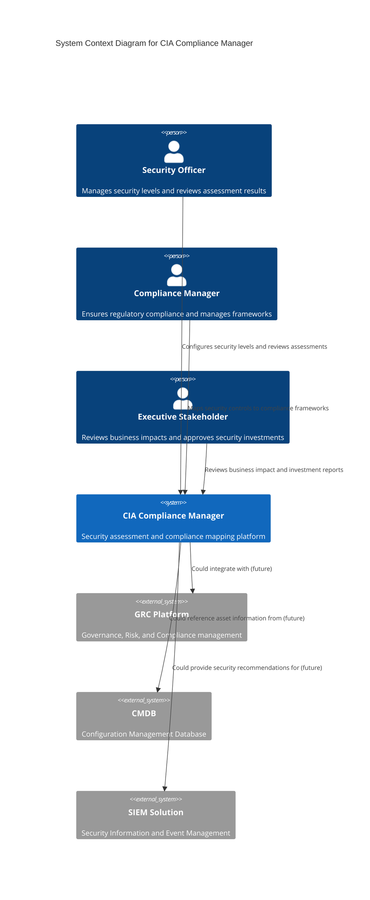
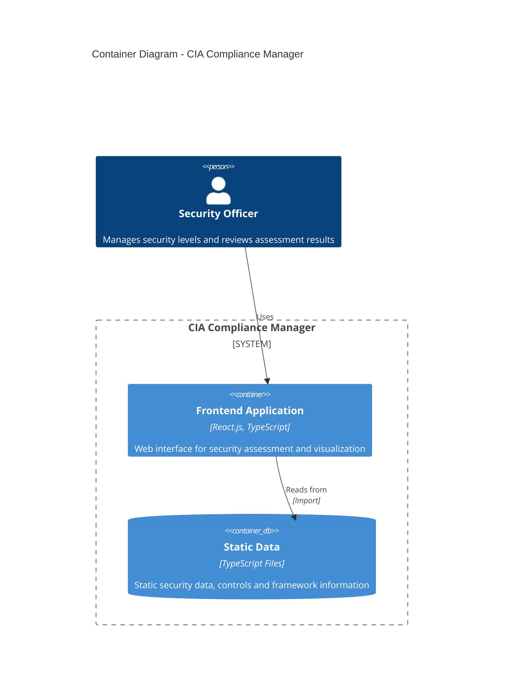
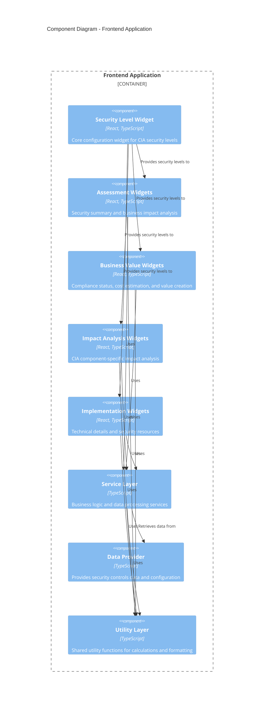
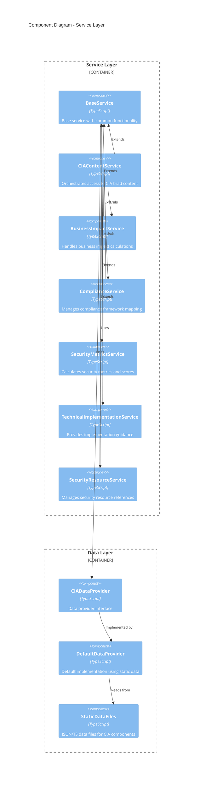
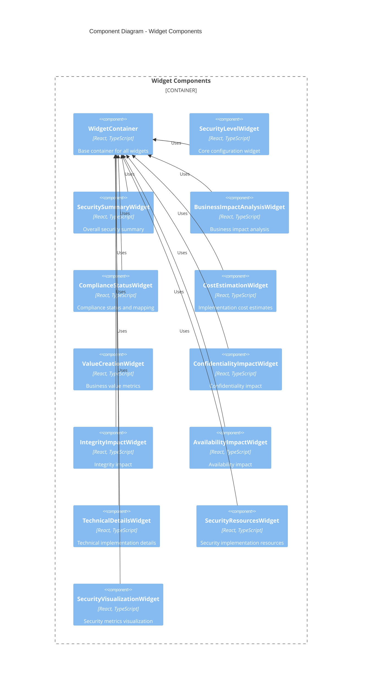
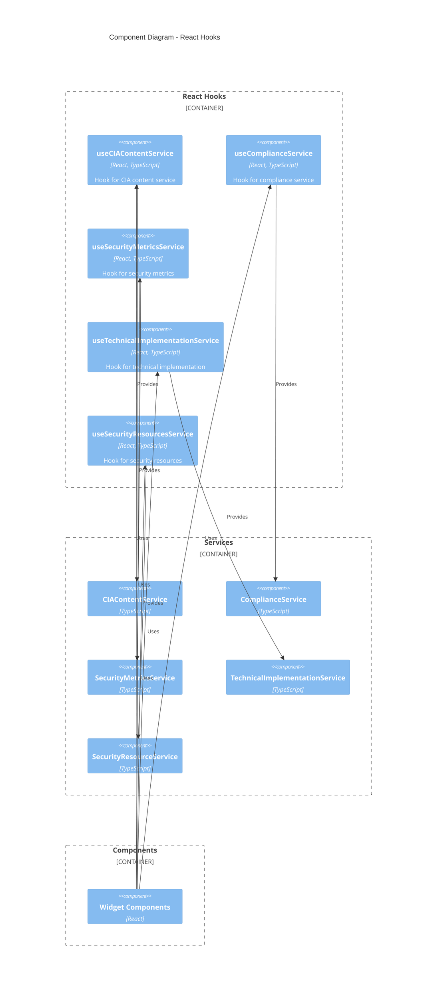
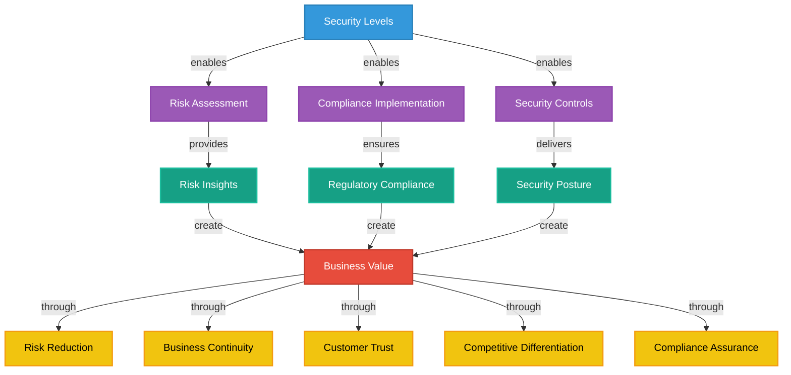

# 🏗️ CIA Compliance Manager Architecture

This document provides a comprehensive view of the CIA Compliance Manager architecture using the C4 model, illustrating how components interact to deliver security assessment capabilities.

## 📚 Complete Architecture Documentation Map

### Current Architecture

| Document                                          | Focus           | Description                               |
| ------------------------------------------------- | --------------- | ----------------------------------------- |
| **[Architecture](ARCHITECTURE.md)**               | 🏗️ C4 Model     | C4 model showing system structure          |
| **[System Architecture](SYSTEM_ARCHITECTURE.md)** | 🏛️ System       | Layered architecture and component details |
| **[Data Model](DATA_MODEL.md)**                   | 📊 Data         | Current data structures and relationships  |
| **[Widget Analysis](WIDGET_ANALYSIS.md)**         | 🧩 Components   | Detailed widget component analysis        |

### Behavioral Documentation

| Document                                       | Focus           | Description                               |
| ---------------------------------------------- | --------------- | ----------------------------------------- |
| **[State Diagrams](STATEDIAGRAM.md)**          | 🔄 Behavior     | System state transitions                   |
| **[Process Flowcharts](FLOWCHART.md)**         | 🔄 Process      | Security assessment workflows              |
| **[Mindmaps](MINDMAP.md)**                     | 🧠 Concept      | System component relationships             |

### Business & Operations

| Document                                       | Focus           | Description                               |
| ---------------------------------------------- | --------------- | ----------------------------------------- |
| **[SWOT Analysis](SWOT.md)**                  | 💼 Business     | Strategic business assessment              |
| **[BCP Plan](BCPPlan.md)**                    | 🔄 Recovery     | Business continuity planning               |
| **[Workflows](WORKFLOWS.md)**                 | 🚀 DevOps       | CI/CD and development workflows            |

### Guidelines & Standards

| Document                                                   | Focus           | Description                               |
| ---------------------------------------------------------- | --------------- | ----------------------------------------- |
| **[Style Guide](STYLE_GUIDE.md)**                          | 🎨 Style        | Documentation style guidelines             |
| **[Contribution Guidelines](CONTRIBUTION_GUIDELINES.md)**  | 📋 Guidelines   | Documentation contribution process         |

### Future Architecture

| Document                                               | Focus           | Description                               |
| ------------------------------------------------------ | --------------- | ----------------------------------------- |
| **[Future Architecture](FUTURE_ARCHITECTURE.md)**      | 🚀 Evolution    | Vision for platform evolution              |
| **[Future Data Model](FUTURE_DATA_MODEL.md)**          | 🚀 Data         | Future data architecture vision            |
| **[Future Workflows](FUTURE_WORKFLOWS.md)**            | 🔄 DevOps       | Future CI/CD and development workflows     |
| **[Future SWOT](FUTURE_SWOT.md)**                      | 💼 Business     | Future strategic business assessment       |
| **[Future State Diagrams](FUTURE_STATEDIAGRAM.md)**    | 🔄 Behavior     | Future system state transitions            |
| **[Future Mindmaps](FUTURE_MINDMAP.md)**               | 🧠 Concept      | Future system component relationships      |
| **[Future Flowcharts](FUTURE_FLOWCHART.md)**           | 🔄 Process      | Future security assessment workflows       |

## 🌐 System Context

The CIA Compliance Manager operates within the broader context of an organization's security governance ecosystem.

## 🏢 Container View

The CIA Compliance Manager consists of several interconnected containers that provide its core functionality.

## 🧩 Component View

The frontend application is composed of specialized components organized by domain functionality.

## 🔍 Service Component Diagram

This diagram shows the detailed structure of the service layer:

## 🧩 Widget Components Structure

This diagram shows the structure of the widget components:

## 🪝 React Hooks Structure

This diagram shows the custom React hooks that bridge components and services:

## 📊 Key Architecture Decisions

### Architecture Decision Records

| ID | Decision | Rationale |
|----|----------|-----------|
| ADR-001 | Widget-Based UI Architecture | Enables modular development and clear separation of concerns between different security assessment areas |
| ADR-002 | Static Data in TypeScript Files | Simplifies initial development and enables type safety without requiring a database |
| ADR-003 | Service Layer with Hooks | Provides clean API between UI components and business logic with React-idiomatic state management |
| ADR-004 | CIA Triad as Organizational Principle | Aligns with industry-standard security model and provides intuitive organization for security controls |
| ADR-005 | Multiple Views of Security (Technical, Business) | Addresses needs of different stakeholders, from technical implementers to business decision makers |

### Key Quality Attributes

| Quality Attribute | Support in Current Architecture |
|-------------------|--------------------------------|
| Modularity | Achieved through widget-based organization and service layer |
| Maintainability | Supported by TypeScript typing, consistent patterns, and clear interfaces |
| Extensibility | Enabled by service abstractions and data provider pattern |
| Performance | Basic performance considerations with React best practices |
| Security | Security-focused design reflects security best practices in application itself |
| Usability | Widget-based UI with consistent styling and interaction patterns |

## 🔍 Business View of Architecture 

### Stakeholder Alignment

```mermaid
flowchart TD
    SLW[Security Level Widget] --- SO[Security Officer]
    
    SSW[Security Summary Widget] --- CSO[Chief Security Officer]
    BIAW[Business Impact Analysis Widget] --- CSO
    
    CIW[CIA Impact Widgets] --- ST[Security Team]
    
    CSW[Compliance Status Widget] --- CO[Compliance Officer]
    
    CEW[Cost Estimation Widget] --- CFO[Finance Officer]
    VCW[Value Creation Widget] --- CFO & CEO[Executive Team]
    
    TDW[Technical Details Widget] --- IT[IT Implementation Team]
    SRW[Security Resources Widget] --- IT
    
    classDef stakeholder fill:#f1c40f,stroke:#f39c12,stroke-width:2px,color:black
    classDef widget fill:#3498db,stroke:#2980b9,stroke-width:2px,color:white
    
    class SO,CSO,ST,CO,CFO,CEO,IT stakeholder
    class SLW,SSW,BIAW,CIW,CSW,CEW,VCW,TDW,SRW widget
```

### Business Value Map

## Current Architecture Constraints

1. **Static Data Only**: The current implementation uses static TypeScript data files without database persistence
2. **Single-User Focus**: No multi-user or collaborative features are currently implemented  
3. **Client-Side Processing**: All processing occurs in the browser without server-side components
4. **Limited Customization**: Security metrics and frameworks are pre-defined without custom framework support
5. **No Authentication**: No user authentication or authorization system is currently implemented
