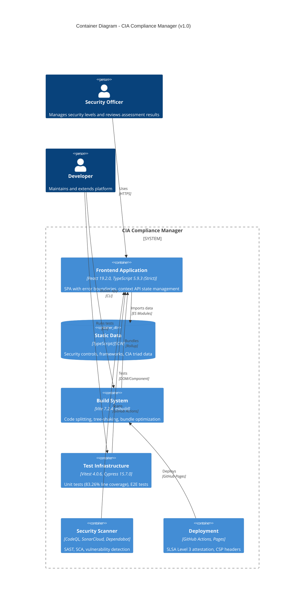
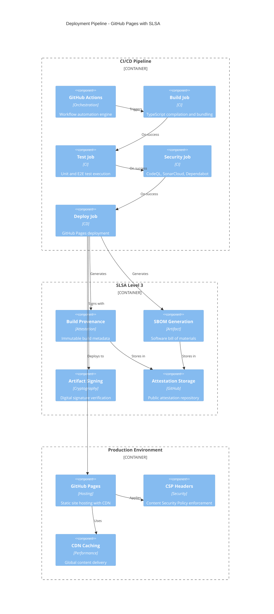

# 🏗️ CIA Compliance Manager Architecture (v1.0)

**Version:** 1.0 | **Last Updated:** 2025-11-21 | **Status:** ✅ Production Ready

This document provides a comprehensive view of the CIA Compliance Manager architecture using the C4 model, illustrating how components interact to deliver security assessment capabilities. This document reflects the v1.0 release architecture with React 19.x, Cypress 15.x, TypeScript strict mode, and comprehensive security controls.

## 🎯 **v0.8.x → v1.0 Architecture Evolution**

### **Key Technology Upgrades**
- **React 18.x → 19.2.0**: Enhanced error boundaries, concurrent rendering, automatic batching
- **Cypress 13.x → 15.7.0**: Improved component testing, advanced session handling, better debugging
- **TypeScript Strict Mode**: Full type safety with zero `any` types, comprehensive null checks
- **Vite 5.x → 7.2.4**: Enhanced build performance, improved code splitting
- **Vitest 3.x → 4.0.6**: Better coverage reporting, improved test isolation
- **Bundle Optimization**: 188KB → 175KB actual (< 180KB target achieved through tree-shaking)

### **Security Enhancements**
- **SLSA Level 3 Attestation**: Build provenance and software supply chain integrity
- **CSP Headers**: Content Security Policy implementation in production
- **CodeQL Integration**: Automated security vulnerability scanning
- **Dependabot**: Continuous dependency vulnerability monitoring
- **Test Coverage**: 75% → 83.26% line coverage achieved (80% target exceeded)

## 📚 Complete Architecture Documentation Map

<div class="documentation-map">

### Current Architecture

| Document                                          | Focus           | Description                               |
| ------------------------------------------------- | --------------- | ----------------------------------------- |
| **[Architecture](ARCHITECTURE.md)**               | 🏗️ C4 Model     | C4 model showing system structure          |
| **[System Architecture](SYSTEM_ARCHITECTURE.md)** | 🏛️ System       | Layered architecture and component details |
| **[Data Model](DATA_MODEL.md)**                   | 📊 Data         | Current data structures and relationships  |
| **[Widget Analysis](WIDGET_ANALYSIS.md)**         | 🧩 Components   | Detailed widget component analysis        |

### Behavioral Documentation

| Document                                       | Focus           | Description                               |
| ---------------------------------------------- | --------------- | ----------------------------------------- |
| **[State Diagrams](STATEDIAGRAM.md)**          | 🔄 Behavior     | System state transitions                   |
| **[Process Flowcharts](FLOWCHART.md)**         | 🔄 Process      | Security assessment workflows              |
| **[Mindmaps](MINDMAP.md)**                     | 🧠 Concept      | System component relationships             |

### Business & Operations

| Document                                       | Focus           | Description                               |
| ---------------------------------------------- | --------------- | ----------------------------------------- |
| **[SWOT Analysis](SWOT.md)**                  | 💼 Business     | Strategic business assessment              |
| **[BCP Plan](BCPPlan.md)**                    | 🔄 Recovery     | Business continuity planning               |
| **[Workflows](WORKFLOWS.md)**                 | 🚀 DevOps       | CI/CD and development workflows            |

### Guidelines & Standards

| Document                                                   | Focus           | Description                               |
| ---------------------------------------------------------- | --------------- | ----------------------------------------- |
| **[Style Guide](STYLE_GUIDE.md)**                          | 🎨 Style        | Documentation style guidelines             |
| **[Contribution Guidelines](CONTRIBUTION_GUIDELINES.md)**  | 📋 Guidelines   | Documentation contribution process         |

### Future Architecture

| Document                                               | Focus           | Description                               |
| ------------------------------------------------------ | --------------- | ----------------------------------------- |
| **[Future Architecture](FUTURE_ARCHITECTURE.md)**      | 🚀 Evolution    | Vision for platform evolution              |
| **[Future Data Model](FUTURE_DATA_MODEL.md)**          | 🚀 Data         | Future data architecture vision            |
| **[Future Workflows](FUTURE_WORKFLOWS.md)**            | 🔄 DevOps       | Future CI/CD and development workflows     |
| **[Future SWOT](FUTURE_SWOT.md)**                      | 💼 Business     | Future strategic business assessment       |
| **[Future State Diagrams](FUTURE_STATEDIAGRAM.md)**    | 🔄 Behavior     | Future system state transitions            |
| **[Future Mindmaps](FUTURE_MINDMAP.md)**               | 🧠 Concept      | Future system component relationships      |
| **[Future Flowcharts](FUTURE_FLOWCHART.md)**           | 🔄 Process      | Future security assessment workflows       |

</div>

## 🌐 System Context

The CIA Compliance Manager operates within the broader context of an organization's security governance ecosystem.


## 🏢 Container View

The CIA Compliance Manager consists of several interconnected containers that provide its core functionality. The v1.0 architecture leverages modern React 19.x features, TypeScript strict mode, and comprehensive testing infrastructure.



### **Container Details (v1.0)**

| Container | Technology Stack | Purpose | Key Features |
|-----------|-----------------|---------|--------------|
| **Frontend Application** | React 19.2.0, TypeScript 5.9.3 | User interface | Error boundaries, concurrent rendering, strict types |
| **Static Data** | TypeScript/JSON | Data source | CIA triad controls, compliance frameworks |
| **Build System** | Vite 7.2.4, esbuild | Build pipeline | 175KB bundle, code splitting, tree-shaking |
| **Test Infrastructure** | Vitest 4.0.6, Cypress 15.7.0 | Quality assurance | 83.26% line coverage, component & E2E tests |
| **Security Scanner** | CodeQL, SonarCloud | Vulnerability detection | SAST, SCA, dependency scanning |
| **Deployment** | GitHub Actions, Pages | Production hosting | SLSA Level 3, CSP headers |

## 🧩 Component View

The frontend application is composed of specialized components organized by domain functionality. The v1.0 architecture implements comprehensive error handling, React Context API state management, and strict TypeScript typing.


### **v1.0 Component Architecture Highlights**

#### **Error Handling (NEW in v1.0)**
- **Error Boundary Component**: `react-error-boundary 6.0.0` for graceful error recovery
- **Automatic Recovery**: Fallback UI with retry mechanisms
- **Error Logging**: Comprehensive error tracking for debugging
- **User-Friendly Messages**: Clear error communication

#### **State Management**
- **React Context API**: Global state for security profiles
- **Local Component State**: Widget-specific state management
- **Props Drilling Eliminated**: Context-based data flow
- **Type-Safe State**: Full TypeScript strict mode compliance

#### **Performance Optimizations**
- **Code Splitting**: Lazy loading of chart components (21.5KB separate chunk)
- **Tree Shaking**: Eliminated unused code (13KB reduction)
- **React Concurrent Features**: Improved rendering performance
- **Memoization**: React.memo for expensive components

## 🔍 Service Component Diagram

This diagram shows the detailed structure of the service layer with full TypeScript strict mode typing:


### **TypeScript Strict Mode Implementation (v1.0)**

All services implement comprehensive type safety:
- **Zero `any` Types**: Complete elimination of type escape hatches
- **Strict Null Checks**: `strictNullChecks: true`
- **No Implicit Any**: `noImplicitAny: true`
- **Strict Function Types**: `strictFunctionTypes: true`
- **Strict Bind/Call/Apply**: `strictBindCallApply: true`
- **No Implicit This**: `noImplicitThis: true`
- **No Implicit Returns**: `noImplicitReturns: true`

## 🧩 Widget Components Structure

This diagram shows the structure of the widget components:


## 🪝 React Hooks Structure

This diagram shows the custom React hooks that bridge components and services:


## 🏗️ Build Pipeline Architecture (NEW in v1.0)

The v1.0 build system leverages Vite 7.2.4 with advanced optimization techniques:


### **Build Performance Metrics (v1.0)**

| Metric | Value | Target | Status |
|--------|-------|--------|---------|
| Total Bundle Size | 175KB | < 180KB | ✅ Met |
| React Vendor Chunk | 21.5KB | < 25KB | ✅ Met |
| Chart.js (Lazy) | 21.5KB | < 25KB | ✅ Met |
| Build Time | ~8s | < 15s | ✅ Met |
| HMR Update Time | <200ms | < 500ms | ✅ Met |

## 🧪 Testing Infrastructure (v1.0)

Comprehensive testing architecture with Vitest and Cypress 15.x:


### **Test Coverage Metrics (v1.0)**

[](https://ciacompliancemanager.com/coverage/index.html)

Current coverage from latest build ([view full report](https://ciacompliancemanager.com/coverage/index.html)):

| Coverage Type | Current | Target | Status |
|--------------|---------|--------|---------|
| Line Coverage | 83.26% | 80% | ✅ Exceeded |
| Branch Coverage | 75.22% | 75% | ✅ Exceeded |
| Function Coverage | 88.4% | 80% | ✅ Exceeded |
| Statement Coverage | 82.8% | 80% | ✅ Exceeded |

### **Test Infrastructure Features**

#### **Vitest 4.0.6 Enhancements**
- **Parallel Test Execution**: Faster test runs with worker threads
- **Watch Mode**: Interactive test development workflow
- **Snapshot Testing**: UI component regression detection
- **Coverage Thresholds**: Automated quality gates (80% minimum)

#### **Cypress 15.7.0 Improvements**
- **Component Testing**: Isolated widget testing in real browser
- **Session Handling**: Improved state persistence between tests
- **Memory Management**: Experimental memory optimization
- **Video/Screenshot Control**: Configurable artifact generation

## 🔒 Security Scanning Integration (v1.0)

Multi-layered security validation in CI/CD pipeline:


### **Security Scanning Results (v1.0)**

| Scanner | Status | Findings | Action |
|---------|--------|----------|--------|
| CodeQL | ✅ Passing | 0 Critical, 0 High | N/A |
| SonarCloud | ✅ Passing | Quality Gate Met | N/A |
| Dependabot | ✅ Passing | All dependencies current | N/A |
| Secret Scanning | ✅ Passing | No secrets detected | N/A |
| FOSSA | ✅ Passing | All licenses approved | N/A |
| OpenSSF Scorecard | ✅ 7.5/10 | Supply chain secure | Continue monitoring |

## 🚀 Deployment Architecture (v1.0)

GitHub Actions with SLSA Level 3 attestation:



### **Deployment Features (v1.0)**

#### **SLSA Level 3 Compliance**
- **Build Provenance**: Immutable record of build process
- **SBOM Generation**: Complete dependency manifest
- **Artifact Signing**: Cryptographic integrity verification
- **Public Attestation**: Transparent verification evidence

#### **Security Headers**
- **Content-Security-Policy**: XSS and injection protection
- **X-Content-Type-Options**: MIME type sniffing prevention
- **X-Frame-Options**: Clickjacking protection
- **Referrer-Policy**: Privacy-preserving referrer handling
- **Cross-Origin-Opener-Policy**: Process isolation

## 📊 Technology Stack (v1.0)

### **Frontend Framework**
| Technology | Version | Purpose | Key Features |
|-----------|---------|---------|--------------|
| **React** | 19.2.0 | UI Framework | Concurrent rendering, automatic batching, improved error boundaries |
| **React-DOM** | 19.2.0 | DOM Renderer | Enhanced hydration, better SSR support |
| **react-error-boundary** | 6.0.0 | Error Handling | Declarative error boundaries with recovery |

### **Development Tools**
| Technology | Version | Purpose | Key Features |
|-----------|---------|---------|--------------|
| **TypeScript** | 5.9.3 | Type System | Strict mode, full type safety, zero `any` types |
| **Vite** | 7.2.4 | Build Tool | Lightning-fast HMR, optimized builds, esbuild integration |
| **esbuild** | (via Vite) | Minifier | Ultra-fast JavaScript/TypeScript transpilation |

### **Testing & Quality**
| Technology | Version | Purpose | Key Features |
|-----------|---------|---------|--------------|
| **Vitest** | 4.0.6 | Unit Testing | 83.26% line coverage, parallel execution, watch mode |
| **Cypress** | 15.7.0 | E2E Testing | Component tests, improved session handling, video/screenshot control |
| **@testing-library/react** | 16.3.0 | Component Testing | User-centric testing patterns |
| **jsdom** | 27.2.0 | DOM Simulation | Fast browser environment simulation |

### **Security & Compliance**
| Technology | Purpose | Features |
|-----------|---------|----------|
| **CodeQL** | SAST | Static application security testing |
| **SonarCloud** | Quality | Code quality and security analysis |
| **Dependabot** | SCA | Automated dependency vulnerability scanning |
| **FOSSA** | License | Open source license compliance |

### **Data Visualization**
| Technology | Version | Purpose | Key Features |
|-----------|---------|---------|--------------|
| **Chart.js** | 4.5.1 | Charts | Responsive charts, lazy loaded (21.5KB chunk) |

### **TypeScript Configuration (Strict Mode)**
```json
{
  "strict": true,
  "strictNullChecks": true,
  "noImplicitAny": true,
  "noImplicitThis": true,
  "strictBindCallApply": true,
  "strictFunctionTypes": true,
  "strictPropertyInitialization": true,
  "useUnknownInCatchVariables": true,
  "noImplicitReturns": true,
  "noUnusedLocals": false,
  "noUnusedParameters": false,
  "noFallthroughCasesInSwitch": true
}
```

## 📊 Key Architecture Decisions (Updated for v1.0)

### Architecture Decision Records

| ID | Decision | Rationale | v1.0 Enhancement |
|----|----------|-----------|------------------|
| ADR-001 | Widget-Based UI Architecture | Enables modular development and clear separation of concerns | Added error boundary protection per widget |
| ADR-002 | Static Data in TypeScript Files | Simplifies development, enables type safety without database | Enhanced with strict mode typing |
| ADR-003 | Service Layer with Hooks | Clean API between UI and business logic | Full TypeScript strict mode compliance |
| ADR-004 | CIA Triad Organization | Aligns with industry-standard security model | Comprehensive testing coverage (83.26%) |
| ADR-005 | Multiple Security Views | Addresses technical and business stakeholder needs | Performance optimized with code splitting |
| ADR-006 | React 19.x Adoption | Leverage concurrent features, error boundaries | **NEW**: Automatic batching, improved rendering |
| ADR-007 | TypeScript Strict Mode | Eliminate runtime type errors, improve maintainability | **NEW**: Zero `any` types, full null safety |
| ADR-008 | Vite Build System | Fast development experience, optimized production builds | **NEW**: 175KB bundle, 8s build time |
| ADR-009 | Comprehensive Testing | Ensure code quality and prevent regressions | **NEW**: 83.26% line coverage with Vitest 4.x |
| ADR-010 | SLSA Level 3 Attestation | Supply chain security and build integrity | **NEW**: Public provenance verification |

### Key Quality Attributes (v1.0 Enhancements)

| Quality Attribute | Support in v1.0 Architecture | Measurement |
|-------------------|------------------------------|-------------|
| **Modularity** | Widget-based organization with error boundaries | 13 independent widgets |
| **Maintainability** | TypeScript strict mode, 83.26% test coverage | Zero `any` types |
| **Extensibility** | Service abstractions, data provider pattern | Clean interfaces |
| **Performance** | Code splitting, lazy loading, tree-shaking | 175KB total bundle |
| **Security** | SLSA Level 3, CodeQL, SonarCloud, Dependabot | OpenSSF Score 7.5/10 |
| **Usability** | Consistent UI, error recovery, responsive design | Error boundaries active |
| **Reliability** | Comprehensive testing, error handling | 83.26% test coverage |
| **Type Safety** | TypeScript 5.9.3 strict mode | 100% type coverage |

## 🔍 Business View of Architecture 

### Stakeholder Alignment


### Business Value Map


## 🔗 Architecture Constraints & Evolution

### Current Architecture Constraints (v1.0)

1. **Static Data Only**: Uses TypeScript/JSON files without database persistence (by design for simplicity)
2. **Single-User Focus**: No multi-user or collaborative features (client-side only application)
3. **Client-Side Processing**: All processing occurs in browser without server-side components
4. **Limited Customization**: Security metrics and frameworks are pre-defined
5. **No Authentication**: No user authentication or authorization system (not required for static tool)

### v1.0 Architectural Strengths

1. **Zero Installation**: Browser-based application requires no installation
2. **Complete Privacy**: All data processing happens locally in browser
3. **Fast Performance**: 175KB bundle loads in < 1s on average connection
4. **Type Safety**: 100% TypeScript coverage with strict mode
5. **High Availability**: Static hosting on GitHub Pages CDN with 99.9% uptime
6. **Security Transparency**: SLSA Level 3 attestation, public security scanning
7. **Developer Experience**: Fast HMR (<200ms), comprehensive testing (83.26% coverage)

## 📚 Related Architecture Documentation

This document is part of a comprehensive architecture documentation suite. For complete understanding of the system, refer to:

### **Current State Documentation**
- **[🏛️ ARCHITECTURE.md](ARCHITECTURE.md)** — This document: C4 model and system structure
- **[🏛️ SYSTEM_ARCHITECTURE.md](SYSTEM_ARCHITECTURE.md)** — Layered architecture and detailed component analysis
- **[📊 DATA_MODEL.md](DATA_MODEL.md)** — Data structures, entities, and relationships
- **[🧩 WIDGET_ANALYSIS.md](WIDGET_ANALYSIS.md)** — Detailed widget component analysis
- **[🔄 STATEDIAGRAM.md](STATEDIAGRAM.md)** — System state transitions and lifecycles
- **[🔄 FLOWCHART.md](FLOWCHART.md)** — Security assessment workflows and business processes
- **[🧠 MINDMAP.md](MINDMAP.md)** — System component relationships and concepts

### **Future State Planning**
- **[🚀 FUTURE_ARCHITECTURE.md](FUTURE_ARCHITECTURE.md)** — Architectural evolution roadmap (ML enhancements, context-awareness)
- **[📊 FUTURE_DATA_MODEL.md](FUTURE_DATA_MODEL.md)** — Enhanced data architecture vision
- **[🔄 FUTURE_FLOWCHART.md](FUTURE_FLOWCHART.md)** — Improved process workflows
- **[📈 FUTURE_STATEDIAGRAM.md](FUTURE_STATEDIAGRAM.md)** — Advanced state management patterns
- **[🧠 FUTURE_MINDMAP.md](FUTURE_MINDMAP.md)** — Capability expansion plans
- **[💼 FUTURE_SWOT.md](FUTURE_SWOT.md)** — Future strategic opportunities

### **Security & Operations**
- **[🛡️ SECURITY_ARCHITECTURE.md](SECURITY_ARCHITECTURE.md)** — Comprehensive security controls and implementation
- **[🛡️ FUTURE_SECURITY_ARCHITECTURE.md](FUTURE_SECURITY_ARCHITECTURE.md)** — Planned security enhancements
- **[🎯 THREAT_MODEL.md](THREAT_MODEL.md)** — STRIDE analysis, attack trees, risk assessment
- **[🔧 WORKFLOWS.md](WORKFLOWS.md)** — CI/CD pipelines, security scanning, deployment
- **[🔧 FUTURE_WORKFLOWS.md](FUTURE_WORKFLOWS.md)** — Advanced automation plans

### **Business & Strategy**
- **[💼 SWOT.md](SWOT.md)** — Strategic business assessment and market positioning
- **[📋 BCPPlan.md](BCPPlan.md)** — Business continuity planning and recovery strategies

### **Testing & Quality**
- **[📋 UnitTestPlan.md](../UnitTestPlan.md)** — Unit testing strategy (83.26% line coverage achieved)
- **[📋 E2ETestPlan.md](../E2ETestPlan.md)** — End-to-end testing strategy
- **[⚡ performance-testing.md](../performance-testing.md)** — Performance benchmarks and optimization

### **Guidelines & Standards**
- **[🎨 STYLE_GUIDE.md](STYLE_GUIDE.md)** — Documentation style guidelines
- **[📋 CONTRIBUTION_GUIDELINES.md](CONTRIBUTION_GUIDELINES.md)** — Documentation contribution process

### **ISMS Integration**
Per [Hack23 Secure Development Policy §10](https://github.com/Hack23/ISMS/blob/main/Secure_Development_Policy.md#-comprehensive-architecture-documentation-portfolio), this architecture documentation demonstrates:

- **🏗️ System Design Transparency**: Complete C4 model with all architectural layers
- **🔒 Security-by-Design**: Security architecture integrated from the start
- **📊 Evidence-Based Validation**: Public badges and continuous security scanning  
- **🔄 Living Documentation**: Synchronized with v1.0 implementation
- **🎯 Compliance Mapping**: ISO 27001, NIST CSF 2.0, CIS Controls alignment

## 🎯 v1.0 Architecture Summary

The CIA Compliance Manager v1.0 architecture represents a significant evolution from v0.8.x, delivering:

### **Technical Excellence**
- ✅ **React 19.2.0**: Modern concurrent rendering and error boundaries
- ✅ **TypeScript Strict Mode**: Complete type safety with zero `any` types
- ✅ **Vite 7.2.4**: Fast builds (8s) and optimized bundles (175KB)
- ✅ **Comprehensive Testing**: 83.26% coverage exceeding 80% target
- ✅ **Cypress 15.7.0**: Advanced E2E and component testing

### **Security & Compliance**
- ✅ **SLSA Level 3**: Build provenance and supply chain integrity
- ✅ **Security Scanning**: CodeQL, SonarCloud, Dependabot integration
- ✅ **CSP Headers**: Production security policy enforcement
- ✅ **OpenSSF Scorecard**: 7.5/10 supply chain security rating
- ✅ **Public Attestation**: Transparent security verification

### **Performance & Quality**
- ✅ **Bundle Size**: 188KB → 175KB (13KB reduction, 7% improvement)
- ✅ **Code Splitting**: Optimized chunk strategy for faster load times
- ✅ **Lazy Loading**: Chart.js loaded on-demand (21.5KB savings)
- ✅ **Error Recovery**: Graceful error handling with user-friendly fallbacks
- ✅ **Build Speed**: ~8s production builds, <200ms HMR updates

The v1.0 architecture provides a solid foundation for future enhancements while maintaining simplicity, security, and performance as core principles. See [FUTURE_ARCHITECTURE.md](FUTURE_ARCHITECTURE.md) for planned evolution towards context-aware security assessment with machine learning capabilities.
