# 🔄 Business Continuity Planning for CIA Compliance Manager

## 📋 Executive Summary

This Business Continuity Plan (BCP) outlines strategies to ensure the CIA Compliance Manager application and its data remain available during disruptions while maintaining the confidentiality and integrity of security assessments. The plan is tailored specifically for our GitHub-based infrastructure and provides comprehensive analysis of business impacts, recovery objectives, and resilience strategies.

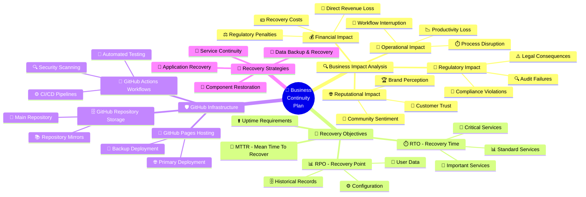

## 🏢 Related Architecture Documentation

| Document                                      | Purpose                          | Link                                                                                 |
| --------------------------------------------- | -------------------------------- | ------------------------------------------------------------------------------------ |
| [Architecture Overview](ARCHITECTURE.md)      | Current system architecture      | [View in Portal](https://ciacompliancemanager.com/documentation.html) |
| [Future Architecture](FUTURE_ARCHITECTURE.md) | Planned architectural evolution  | [View in Portal](https://ciacompliancemanager.com/documentation.html) |
| [Process Flowcharts](FLOWCHART.md)            | Critical workflows and processes | [View in Portal](https://ciacompliancemanager.com/documentation.html) |
| [CI/CD Workflows](WORKFLOWS.md)               | Build and deployment automation  | [View in Portal](https://ciacompliancemanager.com/documentation.html) |

## 🔍 Business Impact Analysis (BIA)

### 📊 Critical Function Identification

Our GitHub-based infrastructure supports several critical functions that require comprehensive business continuity planning.

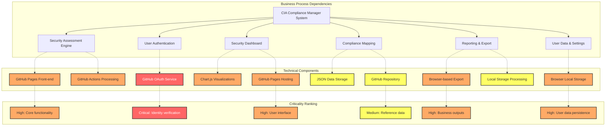

#### 🔗 Process Dependencies

| Business Process        | Dependent Processes                     | Technical System Components   | Criticality |
| ----------------------- | --------------------------------------- | ----------------------------- | ----------- |
| Security Assessment     | User Authentication, Compliance Mapping | GitHub Pages, Local Storage   | High        |
| User Authentication     | GitHub OAuth                            | GitHub OAuth API              | Critical    |
| Dashboard Visualization | Security Assessment, User Data          | GitHub Pages, Chart.js        | High        |
| Compliance Mapping      | Security Assessment                     | GitHub Repository, JSON Data  | Medium      |
| Reporting               | Security Assessment, Compliance Mapping | Browser Export, Local Storage | High        |
| User Data Management    | User Authentication                     | Browser Local Storage         | High        |

#### 🖥️ Technical System Mapping

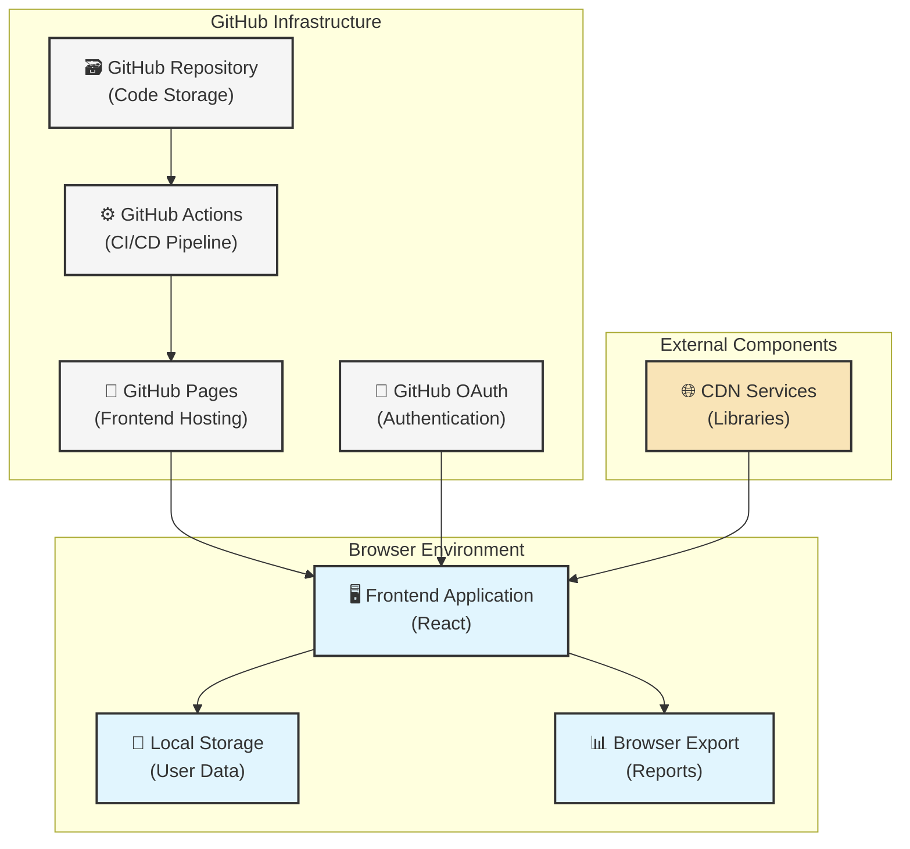

#### 🔝 Priority Matrix

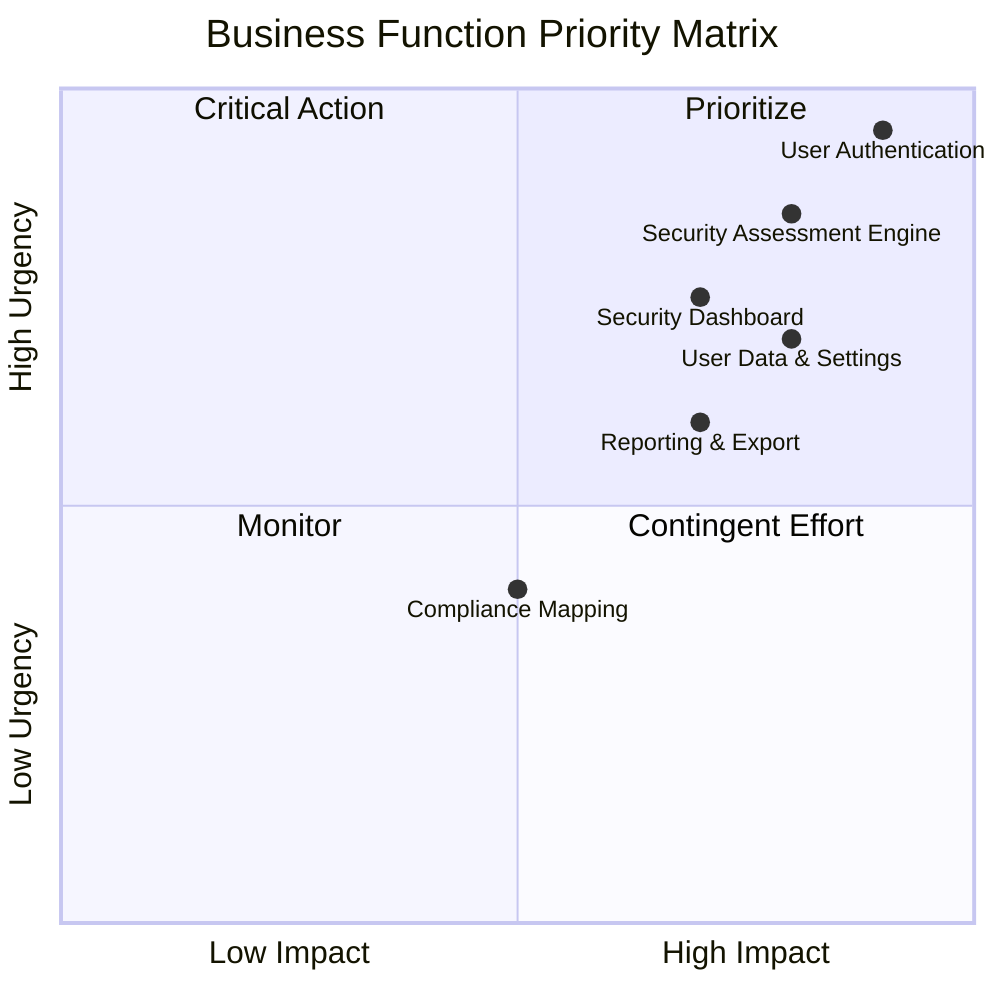

### 💰 Impact Quantification

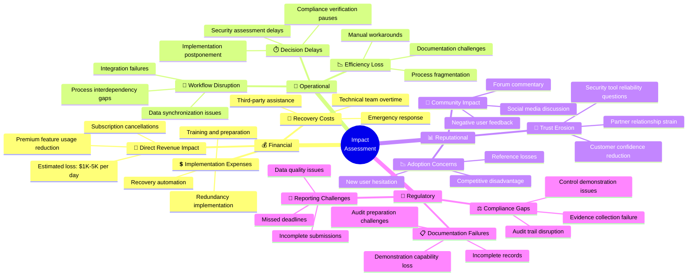

#### Financial Impact

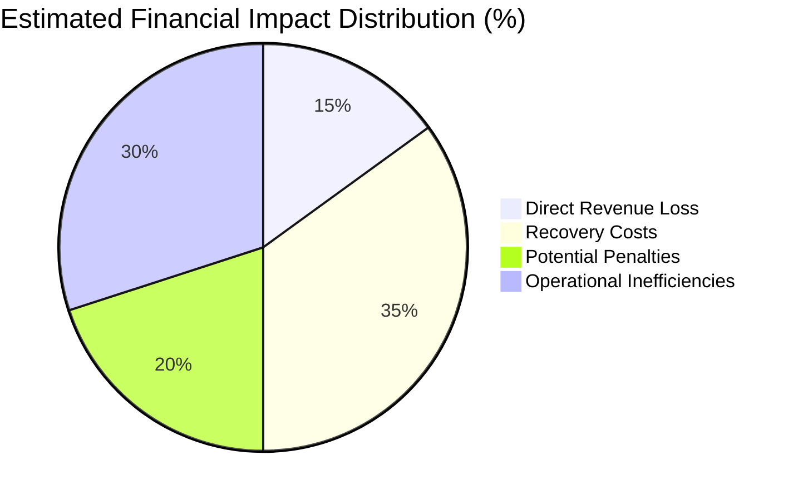

| Impact Category               | Description                                                       | Estimated Impact              | Mitigation Approach                                         |
| ----------------------------- | ----------------------------------------------------------------- | ----------------------------- | ----------------------------------------------------------- |
| 💸 Direct Revenue Loss        | Lost trust leads to usage reduction in monetized premium features | $1,000-5,000 per day          | Implement redundant GitHub Pages deployments across regions |
| 💰 Recovery Costs             | Technical team overtime and emergency response                    | $500-2,000 per incident       | Develop automated recovery scripts within GitHub Actions    |
| ⚖️ Potential Penalties        | SLA violations or data protection breaches                        | Varies by customer agreements | Ensure data backup integrity and frequent verification      |
| 📉 Operational Inefficiencies | Organizations revert to manual processes                          | Indirect cost to users        | Provide offline-mode capability with local data retention   |

#### 🏭 Operational Impact

```mermaid
gantt
    title Operational Impact Timeline
    dateFormat HH:mm
    axisFormat %H:%M

    section Short Outage
    Initial Disruption      :milestone, m1, 00:00, 0min
    User Recognition        :after m1, 15min
    Initial Workarounds     :after m1, 30min
    Support Ticket Volume Increases :after m1, 45min

    section Medium Outage (2-8h)
    Security Decision Delays  :crit, 02:00, 6h
    Manual Process Adoption   :03:00, 5h
    Compliance Activity Delays :04:00, 4h

    section Extended Outage
    Switch to Alternative Tools :crit, 12:00, 12h
    Data Synchronization Issues :14:00, 10h
    Trust Erosion Begins        :18:00, 6h
```

| Impact Category          | Description                              | Recovery Timeline | Business Consequence             |
| ------------------------ | ---------------------------------------- | ----------------- | -------------------------------- |
| 🛑 Process Disruption    | Security assessment processes stall      | 2-24 hours        | Security decisions delayed       |
| ⏱️ Productivity Loss     | Manual alternative processes required    | Immediate         | 40-60% efficiency reduction      |
| 📊 Decision Quality      | Less data-driven security decisions      | 4-24 hours        | Increased security risk exposure |
| 🔄 Workflow Interruption | Loss of continuous assessment capability | 2-8 hours         | Compliance activity delays       |

#### 🌐 Reputational Impact

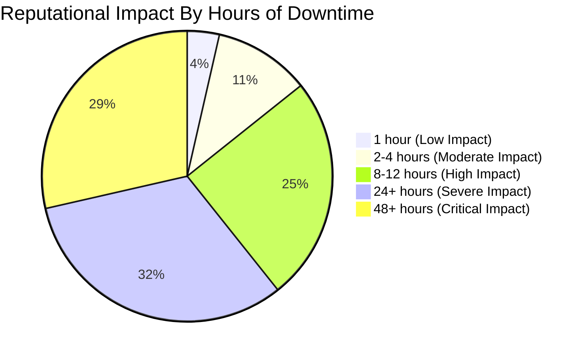

| Impact Category     | Description                            | Recovery Timeline | Mitigation Strategy                                  |
| ------------------- | -------------------------------------- | ----------------- | ---------------------------------------------------- |
| 🤝 Customer Trust   | Erosion of confidence in security tool | 3-10 days         | Transparent communication via GitHub Status & Issues |
| 🏷️ Brand Perception | Decreased reliability perception       | 7-30 days         | Post-incident analysis published openly on GitHub    |
| 🔊 Public Relations | Social media and forum discussions     | 1-7 days          | Monitor GitHub Discussions and respond promptly      |
| 📱 User Community   | Negative feedback in GitHub Issues     | Immediate         | Assign community managers to engage users            |

#### 📜 Regulatory Impact

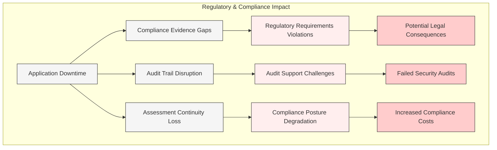

| Impact Category          | Description                                 | Affected Regulations                                                                                                                                                                   | Risk Level  |
| ------------------------ | ------------------------------------------- | -------------------------------------------------------------------------------------------------------------------------------------------------------------------------------------- | ----------- |
| 📝 Compliance Violations | Inability to demonstrate controls efficacy  | [GDPR](https://gdpr.eu/), [HIPAA](https://www.hhs.gov/hipaa/), [SOC2](https://www.aicpa.org/interestareas/frc/assuranceadvisoryservices/aicpasoc2report.html)                          | High        |
| ⚖️ Legal Consequences    | Potential penalties for compliance failures | Varies by jurisdiction                                                                                                                                                                 | Medium-High |
| 🔍 Evidence Collection   | Gaps in compliance documentation            | All frameworks                                                                                                                                                                         | Medium      |
| 🧮 Framework Alignment   | Temporary misalignment with requirements    | [NIST 800-53](https://csrc.nist.gov/publications/detail/sp/800-53/rev-5/final), [ISO 27001](https://www.iso.org/standard/54534.html), [PCI DSS](https://www.pcisecuritystandards.org/) | Medium      |

### ⏱️ Recovery Objectives

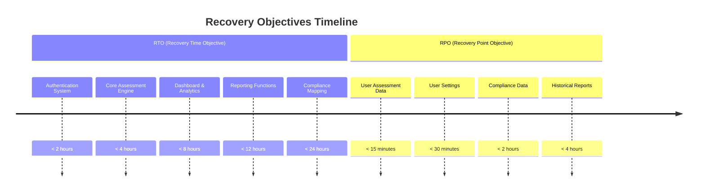

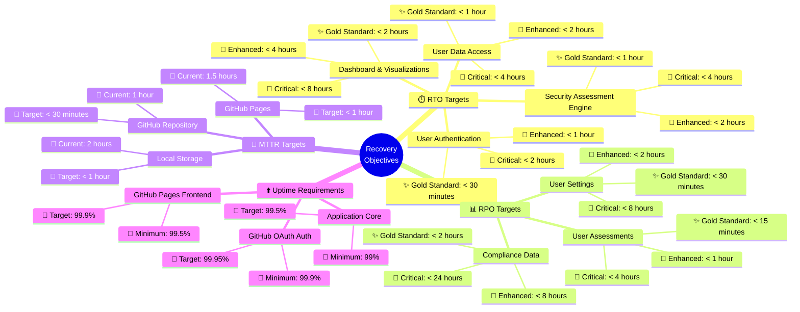

#### Recovery Time Objectives (RTO)

| Component                  | Basic Target | Enhanced Target | Critical Target | GitHub Infrastructure Component      |
| -------------------------- | ------------ | --------------- | --------------- | ------------------------------------ |
| User Authentication        | < 4 hours    | < 2 hours       | < 30 minutes    | GitHub OAuth, GitHub Pages           |
| Security Assessment Engine | < 8 hours    | < 4 hours       | < 1 hour        | GitHub Pages, JavaScript Application |
| Dashboard & Visualizations | < 12 hours   | < 6 hours       | < 2 hours       | GitHub Pages, Chart.js Integration   |
| User Data Access           | < 8 hours    | < 4 hours       | < 1 hour        | Browser Local Storage, GitHub Pages  |
| Reporting Functions        | < 24 hours   | < 12 hours      | < 4 hours       | Browser Processing, GitHub Pages     |
| Compliance Mapping         | < 48 hours   | < 24 hours      | < 8 hours       | GitHub Repository, JSON Data         |

#### Recovery Point Objectives (RPO)

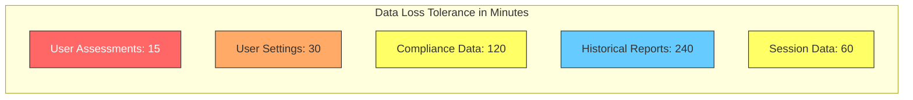

| Data Type          | Basic RPO  | Enhanced RPO | Critical RPO | Storage Mechanism                     |
| ------------------ | ---------- | ------------ | ------------ | ------------------------------------- |
| User Assessments   | < 4 hours  | < 1 hour     | < 15 minutes | Browser Local Storage, Export to File |
| User Settings      | < 8 hours  | < 2 hours    | < 30 minutes | Browser Local Storage, Export to File |
| Compliance Data    | < 24 hours | < 8 hours    | < 2 hours    | GitHub Repository (JSON)              |
| Historical Reports | < 48 hours | < 12 hours   | < 4 hours    | Export Files, Local Storage           |
| Session Data       | < 12 hours | < 4 hours    | < 1 hour     | Browser Session Storage               |

#### MTTR (Mean Time To Recover) Targets

```mermaid
gantt
    title MTTR Targets by Component
    dateFormat HH:mm
    axisFormat %H:%M

    section GitHub Infrastructure
    GitHub Pages       :done, 00:00, 01:30
    GitHub Repository  :done, 00:00, 01:00
    GitHub Actions     :done, 00:00, 02:00
    GitHub OAuth       :done, 00:00, 01:15

    section Application Components
    Authentication     :done, 00:00, 01:45
    Assessment Engine  :done, 00:00, 03:30
    Dashboard          :done, 00:00, 05:15
    Reporting          :done, 00:00, 06:00

    section Data Components
    User Assessments   :done, 00:00, 02:00
    User Settings      :done, 00:00, 01:30
    Compliance Data    :done, 00:00, 03:00
```

| Component               | Current MTTR | Target MTTR  | Improvement Strategy                            |
| ----------------------- | ------------ | ------------ | ----------------------------------------------- |
| GitHub Pages Deployment | 1.5 hours    | < 1 hour     | Automated rollback via GitHub Actions           |
| GitHub Repository       | 1 hour       | < 30 minutes | Redundant mirrors and automated synchronization |
| Local Storage Data      | 2 hours      | < 1 hour     | Enhanced backup/export notifications and guides |
| Application Code        | 2 hours      | < 1 hour     | Automated canary deployment and monitoring      |

#### ⬆️ Uptime Requirements

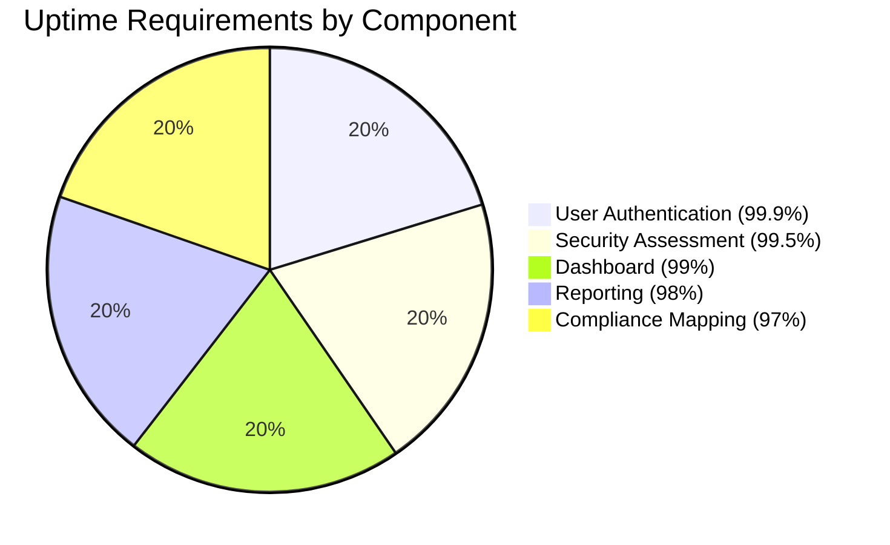

| Component             | Minimum Uptime | Target Uptime | Maximum Downtime (Annual) | Measurement Method                |
| --------------------- | -------------- | ------------- | ------------------------- | --------------------------------- |
| GitHub Pages Frontend | 99.5%          | 99.9%         | 8.77 hours                | GitHub Status & Custom Monitoring |
| GitHub OAuth Auth     | 99.9%          | 99.95%        | 4.38 hours                | GitHub Status & Auth Success Rate |
| Application Core      | 99%            | 99.5%         | 43.83 hours               | Health Check Endpoint             |
| User Data Access      | 99.5%          | 99.9%         | 8.77 hours                | Data Access Success Rate          |
| Export Functions      | 98%            | 99%           | 87.66 hours               | Function Availability Tests       |

## 🛡️ GitHub-Specific Resilience Strategy

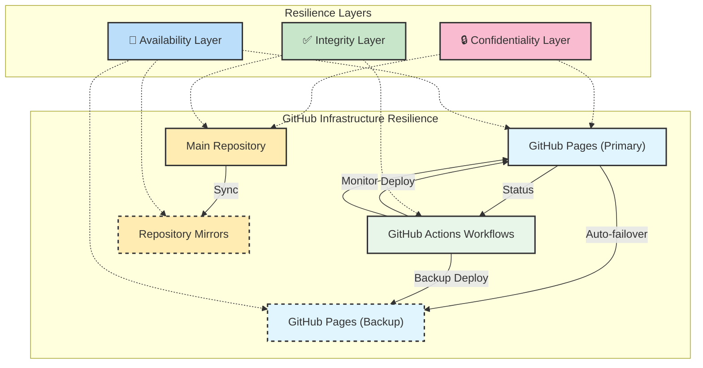

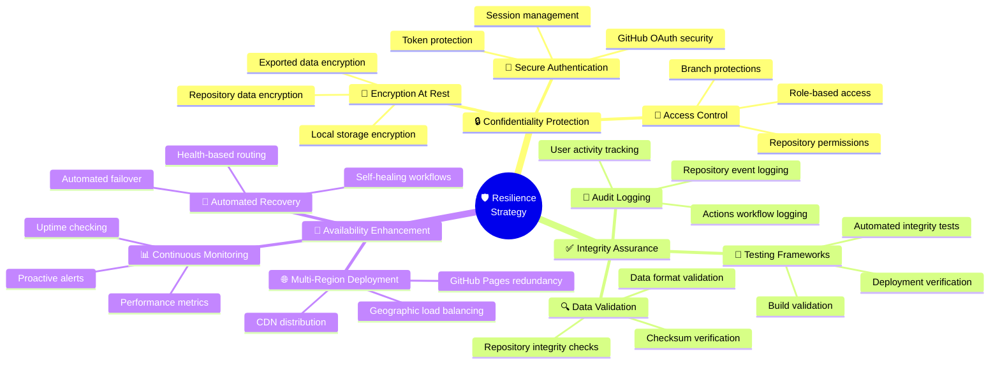

### 🔄 GitHub Pages Redundancy

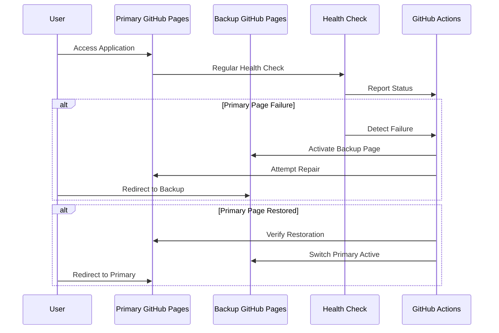

| Redundancy Strategy                       | Implementation        | Activation Time | Testing Frequency |
| ----------------------------------------- | --------------------- | --------------- | ----------------- |
| 🔄 Multiple GitHub Pages Branches         | prod/staging branches | < 5 minutes     | Weekly            |
| 🌐 GitHub Pages Custom Domain with Backup | Domain failover       | < 15 minutes    | Monthly           |
| 📦 Multiple Repository Deployments        | Separate repositories | < 30 minutes    | Quarterly         |
| 🔌 CDN Cache Fallback                     | Cache static content  | < 1 minute      | Daily             |

### 💾 Data Recovery for GitHub-Based Infrastructure

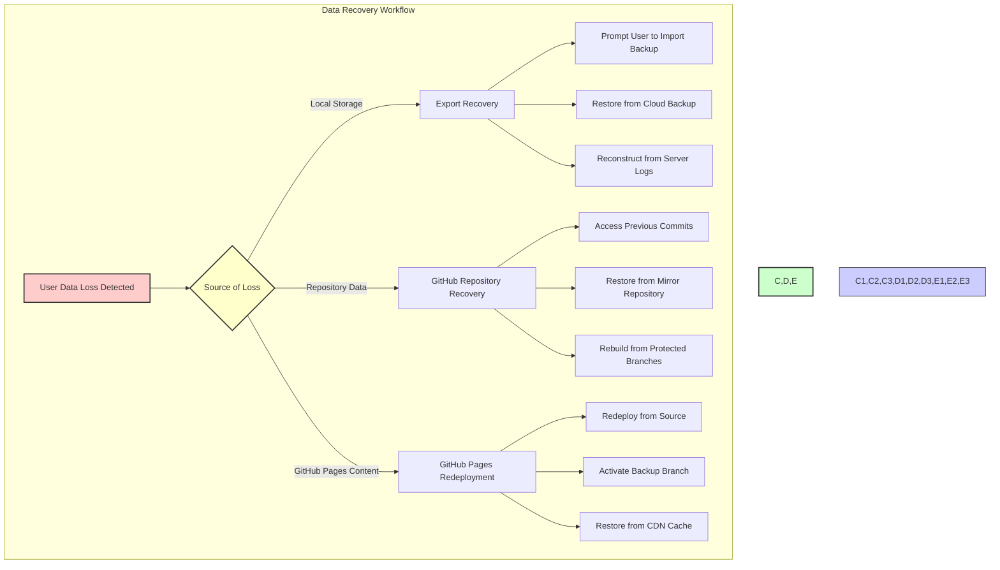

| Data Type               | GitHub Recovery Mechanism | Recovery Process              | Recovery Time |
| ----------------------- | ------------------------- | ----------------------------- | ------------- |
| 🗄️ Repository Code      | Git History               | Revert to previous commit     | < 5 minutes   |
| 📊 JSON Data Files      | Git History               | Restore from previous version | < 10 minutes  |
| 🖥️ GitHub Pages Content | GitHub Actions Rebuild    | Trigger workflow redeploy     | < 15 minutes  |
| 👤 User Data (Local)    | Export File Import        | Guide for user-driven restore | < 30 minutes  |
| ⚙️ Configuration Data   | Protected Branches        | Merge from protected branch   | < 20 minutes  |

### 🧪 Testing Strategy for GitHub Infrastructure

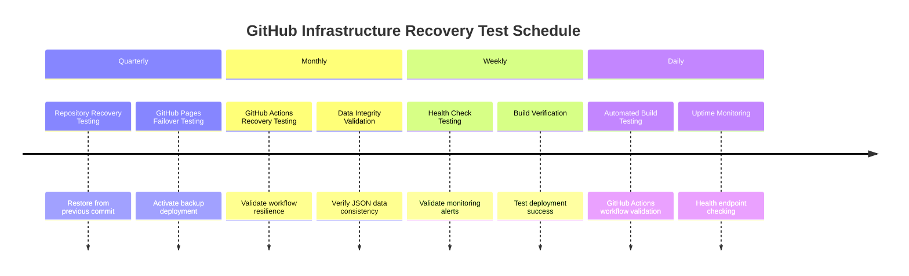

| Test Type                  | GitHub Components            | Frequency | Success Criteria                               |
| -------------------------- | ---------------------------- | --------- | ---------------------------------------------- |
| 📝 Repository Restore Test | GitHub Repository            | Quarterly | Successful restore < 10 minutes                |
| 🌐 GitHub Pages Failover   | GitHub Pages                 | Monthly   | Automatic detection and switch < 5 minutes     |
| ⚙️ GitHub Actions Recovery | GitHub Actions               | Monthly   | Workflow resumption after failure < 15 minutes |
| 📊 Data Integrity Test     | GitHub Pages + Local Storage | Weekly    | Data consistency across environments           |
| 🔍 Security Scan Test      | All GitHub Components        | Weekly    | No new vulnerabilities detected                |

## 📈 Maturity Roadmap for GitHub-Based Resilience

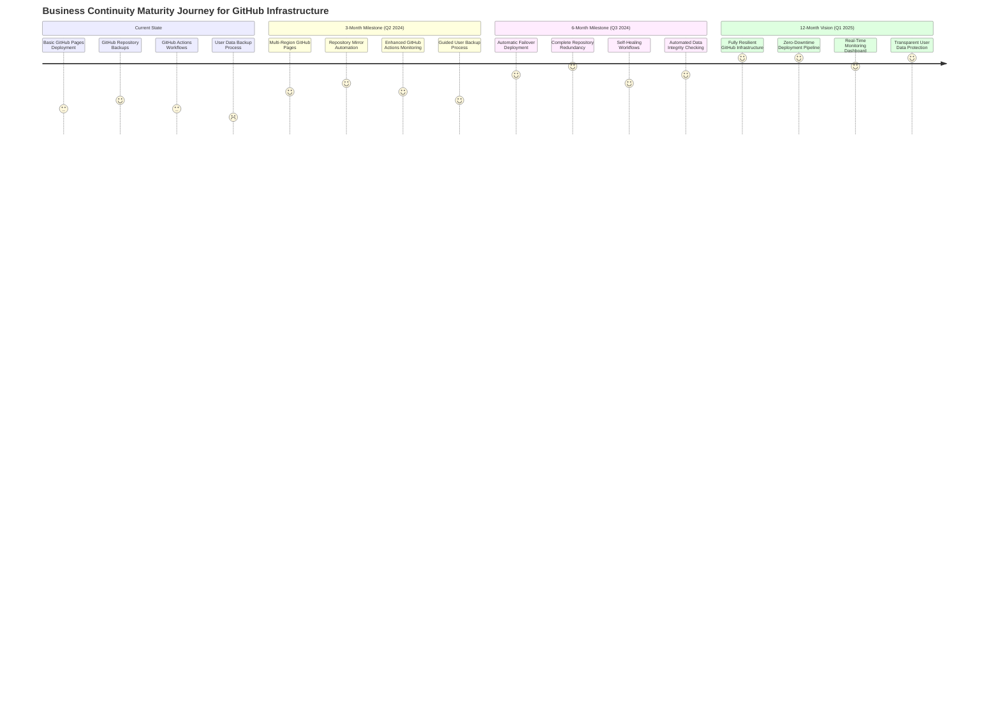

```mermaid
mindmap
  root((📈 Maturity<br>Roadmap))
    🏆 Current State Assessment
      GitHub Pages Resilience: ⭐⭐⭐☆☆
      Repository Redundancy: ⭐⭐⭐⭐☆
      GitHub Actions Reliability: ⭐⭐⭐☆☆
      User Data Protection: ⭐⭐☆☆☆
      Monitoring Capabilities: ⭐⭐☆☆☆
    🎯 3-Month Targets (Q2 2024)
      Enhanced Pages Deployment
        Multi-branch strategy
        Health monitoring
        Automatic rebuilds
      Repository Mirror Strategy
        Automated syncing
        Integrity checking
        Multiple locations
      Workflow Enhancements
        Error handling
        Retry mechanisms
        Notifications
    🚀 6-Month Goals (Q3 2024)
      Automated Failover
        Health-based routing
        Zero manual intervention
        Sub-minute detection
      Comprehensive Monitoring
        Custom dashboard
        Predictive alerts
        Trend analysis
      Data Integrity Framework
        Automated validation
        Cross-reference checking
        Corruption detection
    🔮 12-Month Vision (Q1 2025)
      Zero-Downtime Architecture
      AI-Enhanced Monitoring
      Seamless Data Protection
      Full Regulatory Compliance
```

| Maturity Area                | Current State            | 3-Month Goal                    | 6-Month Goal                | 12-Month Vision                       |
| ---------------------------- | ------------------------ | ------------------------------- | --------------------------- | ------------------------------------- |
| 🌐 GitHub Pages Deployment   | Single branch deployment | Multi-branch with manual switch | Automated health monitoring | Zero-downtime deployment              |
| 🗄️ Repository Resilience     | Regular backups          | Automated mirrors               | Cross-region redundancy     | Multi-provider backup strategy        |
| ⚙️ GitHub Actions Resilience | Basic workflows          | Enhanced error handling         | Self-healing capabilities   | Comprehensive monitoring and recovery |
| 💾 User Data Protection      | Manual export option     | Guided backup process           | Automated reminder system   | Seamless multi-device sync            |
| 📊 Monitoring Capabilities   | Basic GitHub status      | Custom health endpoints         | Comprehensive dashboard     | Predictive issue detection            |

## 📋 Communication Plan for GitHub-Based Infrastructure Incidents

```mermaid
flowchart TD
    subgraph "GitHub Incident Detection & Communication"
        A[Incident Detected] --> B{Severity Assessment}

        B -->|"Critical"| C1[Immediate Response]
        B -->|"High"| C2[Urgent Response]
        B -->|"Medium"| C3[Standard Response]
        B -->|"Low"| C4[Routine Response]

        C1 --> D1[Create GitHub Issue]
        C1 --> D2[Update Repository README]
        C1 --> D3[Direct User Notification]

        C2 --> D1
        C2 --> D2

        C3 --> D1

        C4 --> D4[Document for Next Update]

        D1 --> E[Regular Status Updates]
        D2 --> E
        D3 --> E

        E --> F[Resolution Communication]
        F --> G[Post-Incident Analysis]
    end

    style A fill:#ffcccc,stroke:#333,stroke-width:2px
    style B fill:#ffffcc,stroke:#333,stroke-width:2px
    style C1,C2,C3,C4 fill:#ccffcc,stroke:#333,stroke-width:2px
    style D1,D2,D3,D4 fill:#ccccff,stroke:#333,stroke-width:1px
    style E,F,G fill:#ffccff,stroke:#333,stroke-width:1px
```

```mermaid
mindmap
  root((📱 Communication<br>Plan))
    🚨 Incident Classification
      🔴 Critical (Complete Outage)
        Initial notification: <15 min
        Update frequency: Every 30 min
        All channels enabled
      🟠 Major (Partial Outage)
        Initial notification: <30 min
        Update frequency: Every 60 min
        Primary channels
      🟡 Moderate (Performance Issues)
        Initial notification: <60 min
        Update frequency: Every 4 hours
        Status page + email
      🔵 Minor (Isolated Issues)
        Initial notification: <4 hours
        Update frequency: Daily
        Status page only
    📢 Communication Channels
      🌐 Public Channels
        GitHub Status Page
        Repository README
        GitHub Issues
        GitHub Discussions
      🔒 Internal Channels
        Team Chat
        Email Notifications
        Video Conferences
        Direct Messaging
      🔔 Automated Alerts
        GitHub Actions Notifications
        Monitoring System Alerts
        Scheduled Status Reports
    👥 Stakeholder Groups
      End Users
        General public
        Active users
        Organizations
      Contributors
        Active contributors
        Pull request authors
        Issue reporters
      Maintainers
        Core team members
        Repository admins
        Technical leads
    📝 Message Templates
      Initial Notification
      Status Update
      Resolution Notice
      Post-Incident Summary
```

| Stakeholder      | Communication Channel                   | Response Time     | Message Content                                     |
| ---------------- | --------------------------------------- | ----------------- | --------------------------------------------------- |
| 👥 End Users     | GitHub Issues, Repository README        | Within 30 minutes | Incident summary, estimated resolution, workarounds |
| 👨‍💻 Contributors  | GitHub Discussions, Direct Notification | Within 15 minutes | Technical details, assistance requests              |
| 🔧 Maintainers   | Internal Chat, Direct Contact           | Immediate         | Full incident details, action items                 |
| 🔍 Security Team | Security Advisory (if applicable)       | Within 60 minutes | Security impact assessment, containment status      |

## 🔒 Security Considerations for GitHub-Based Recovery

```mermaid
flowchart TB
    subgraph "Security During Recovery"
        A[Recovery Process Initiated] --> B{Authentication Verification}
        B -->|"Authenticated"| C[GitHub Permission Verification]
        B -->|"Unauthenticated"| R[Access Denied]

        C -->|"Authorized"| D[Repository Access Granted]
        C -->|"Unauthorized"| R

        D --> E{Recovery Type}

        E -->|"Code Restoration"| F1[Verify Branch Protections]
        E -->|"Data Recovery"| F2[Validate Data Integrity]
        E -->|"Environment Rebuild"| F3[Verify Build Security]

        F1 --> G[Execute Recovery With Audit]
        F2 --> G
        F3 --> G

        G --> H[Verify Recovery Success]
        H --> I[Security Scan Recovery Result]
        I --> J[Document Recovery Process]
    end

    style A fill:#ffcccc,stroke:#333,stroke-width:2px
    style B,C,E fill:#ffffcc,stroke:#333,stroke-width:2px
    style D,F1,F2,F3,G,H,I,J fill:#ccffcc,stroke:#333,stroke-width:1px
    style R fill:#ff9999,stroke:#333,stroke-width:2px
```

```mermaid
mindmap
  root((🔒 Security<br>Considerations))
    👤 Access Control
      Multi-Factor Authentication
        Required for recovery operations
        Hardware key support
        Temporary access expirations
      Permission Boundaries
        Principle of least privilege
        Recovery-specific roles
        Time-limited access
      Audit Logging
        Comprehensive logging
        Tamper-evident logs
        Real-time monitoring
    🛡️ Data Protection
      Encryption Requirements
        In-transit encryption
        At-rest encryption
        End-to-end protection
      Data Validation
        Integrity checking
        Format validation
        Source verification
      Secure Transfer
        Authorized channels only
        Encrypted connections
        Transfer validation
    📝 Process Security
      Documented Procedures
        Step-by-step guides
        Security checkpoints
        Verification steps
      Dual Control
        Two-person rule for critical actions
        Independent verification
        Segregation of duties
      Post-Recovery Verification
        Security scanning
        Compliance validation
        Vulnerability assessment
```

| Security Consideration | Implementation in GitHub          | Verification Method                   | Reference Standard                                                                                                                                                                                     |
| ---------------------- | --------------------------------- | ------------------------------------- | ------------------------------------------------------------------------------------------------------------------------------------------------------------------------------------------------------ |
| 🔐 Access Control      | GitHub Repository Permissions     | Permission audit before recovery      | [NIST 800-53 AC-2](https://csrc.nist.gov/projects/risk-management/sp800-53-controls/release-search#!/control?version=5.1&number=AC-2), [ISO 27001 A.9.2](https://www.iso.org/standard/54534.html)      |
| 🔏 Data Encryption     | HTTPS for all GitHub interactions | Connection security verification      | [NIST 800-53 SC-8](https://csrc.nist.gov/projects/risk-management/sp800-53-controls/release-search#!/control?version=5.1&number=SC-8), [ISO 27001 A.10.1.1](https://www.iso.org/standard/54534.html)   |
| 📝 Audit Logging       | GitHub Audit Log                  | Review logs during/after recovery     | [NIST 800-53 AU-2](https://csrc.nist.gov/projects/risk-management/sp800-53-controls/release-search#!/control?version=5.1&number=AU-2), [ISO 27001 A.12.4](https://www.iso.org/standard/54534.html)     |
| 🛡️ Branch Protection   | Protected Branches                | Verify protection rules before merge  | [NIST 800-53 CM-5](https://csrc.nist.gov/projects/risk-management/sp800-53-controls/release-search#!/control?version=5.1&number=CM-5), [ISO 27001 A.12.1.2](https://www.iso.org/standard/54534.html)   |
| 🧪 Code Validation     | Required CI Checks                | All tests must pass before deployment | [NIST 800-53 SA-11](https://csrc.nist.gov/projects/risk-management/sp800-53-controls/release-search#!/control?version=5.1&number=SA-11), [ISO 27001 A.14.2.8](https://www.iso.org/standard/54534.html) |
| 🔍 Security Scanning   | GitHub Code Scanning              | Scan recovery code before activation  | [NIST 800-53 RA-5](https://csrc.nist.gov/projects/risk-management/sp800-53-controls/release-search#!/control?version=5.1&number=RA-5), [ISO 27001 A.12.6.1](https://www.iso.org/standard/54534.html)   |

## 📋 Plan Maintenance

This business continuity plan should be reviewed and updated:

- After any significant changes to GitHub infrastructure or features
- Following any recovery event (incorporating lessons learned)
- At least quarterly
- When new GitHub-dependent functionality is added

```mermaid
timeline
    title Business Continuity Plan Maintenance Schedule

    section Q2 2024
        April 2024 : Regular Review
        May 2024 : GitHub Actions Updates
        June 2024 : Local Storage Strategy Review

    section Q3 2024
        July 2024 : Regular Review
        August 2024 : GitHub Pages Resilience Update
        September 2024 : Full Recovery Simulation

    section Q4 2024
        October 2024 : Regular Review
        November 2024 : Annual BCP Exercise
        December 2024 : 2025 Planning Updates
```

```mermaid
mindmap
  root((📋 Plan<br>Maintenance))
    📅 Scheduled Reviews
      Quarterly Assessments
        April, July, October, January
        Documentation updates
        Component verification
      Semi-Annual Deep Reviews
        June, December
        Gap analysis
        Compliance verification
      Annual Full Exercise
        November
        Simulation scenario
        Full team participation
    📊 Review Components
      Infrastructure
        GitHub architecture
        Repository structure
        Pages deployment
      Procedures
        Recovery steps
        Communication flows
        Security protocols
      Documentation
        Technical guides
        User instructions
        Compliance mappings
    🛠️ Maintenance Process
      Gap Assessment
        Identify weaknesses
        Log improvement needs
        Prioritize updates
      Document Revision
        Version control
        Change tracking
        Approvals workflow
      Capability Testing
        Validate changes
        Confirm procedures
        Measure performance
    📝 Version Control
      GitHub Repository
        Branch strategy
        Pull request reviews
        Commit signing
      Change Record
        Detailed changelog
        Contributor tracking
        Approval documentation
```

## 🔬 Testing and Validation Strategy

```mermaid
gantt
    title BCP Testing Schedule with Regulatory Alignment
    dateFormat  YYYY-MM-DD
    axisFormat  %b
    todayMarker off

    section 📋 Quarterly Testing
        Repository Recovery Test (CP-4)        :q1, 2024-01-15, 3d
        GitHub Pages Failover Test (CP-4(2))   :q1, after q1, 2d
        Data Validation Test (SI-7)            :q1, after q1, 2d

        Repository Recovery Test               :q2, 2024-04-15, 3d
        GitHub Pages Failover Test             :q2, after q2, 2d
        Data Validation Test                   :q2, after q2, 2d

        Repository Recovery Test               :q3, 2024-07-15, 3d
        GitHub Pages Failover Test             :q3, after q3, 2d
        Data Validation Test                   :q3, after q3, 2d

        Repository Recovery Test               :q4, 2024-10-15, 3d
        GitHub Pages Failover Test             :q4, after q4, 2d
        Data Validation Test                   :q4, after q4, 2d

    section 📋 Annual Testing
        Full Recovery Simulation (CP-4(1))     :a1, 2024-06-01, 10d
        End-to-End Verification (CA-2(2))      :a2, after a1, 5d
        External Audit Review (CA-2)           :a3, after a2, 5d
        Framework Compliance Evaluation (CA-7) :a4, after a3, 5d
        Report & Improvement Plan (PM-4)       :a5, after a4, 10d

    section 📋 Continuous
        Automated Health Checks (SI-4)         :c1, 2024-01-01, 365d
        Commit Validation (CM-3(2))            :c2, 2024-01-01, 365d
        Security Scanning (RA-5)               :c3, 2024-01-01, 365d
```

```mermaid
mindmap
  root((🧪 Testing<br>Strategy))
    📊 Test Categories
      Repository Recovery
        Previous commit restoration
        Mirror repository failover
        Branch protection verification
      GitHub Pages Resilience
        Backup branch activation
        DNS failover testing
        CDN cache validation
      GitHub Actions Continuity
        Workflow interruption recovery
        Error handling validation
        Dependency failure simulation
      User Data Protection
        Export/import validation
        Corruption recovery
        Historic data access
    ⏱️ Test Frequency
      Daily Checks
        Health probe monitoring
        Build verification
        Deployment success
      Weekly Tests
        Limited component tests
        Integration verification
        Security scanning
      Monthly Tests
        Function recovery tests
        Cross-component validation
        Extended disruption tests
      Quarterly Exercises
        Full component recovery
        Business impact assessment
        Major incident simulation
    📝 Documentation Requirements
      Test Plans
        Test scenarios
        Success criteria
        Resource requirements
      Execution Records
        Test results
        Issues encountered
        Resolution steps
      Analysis Reports
        Performance metrics
        Gap identification
        Improvement recommendations
```

### 🧪 Test Scenarios with Regulatory Mapping

| Test Scenario                 | Description                                       | Frequency | Success Criteria                       | Regulatory Controls                                                                                                                                             |
| ----------------------------- | ------------------------------------------------- | --------- | -------------------------------------- | --------------------------------------------------------------------------------------------------------------------------------------------------------------- |
| 📊 GitHub Repository Recovery | Test restoration from backup repository           | Quarterly | Complete in < 15 minutes               | [NIST 800-53 (CP-4, CP-9(1))](https://csrc.nist.gov/publications/detail/sp/800-53/rev-5/final), [ISO 27001 (A.17.1.3)](https://www.iso.org/standard/54534.html) |
| 🌐 GitHub Pages Failover      | Simulate primary host failure and verify failover | Quarterly | Auto-detection and routing < 5 minutes | [NIST 800-53 (CP-4(2))](https://csrc.nist.gov/publications/detail/sp/800-53/rev-5/final), [ISO 27001 (A.17.1.3)](https://www.iso.org/standard/54534.html)       |
| 🔄 GitHub Actions Recovery    | Validate workflow resilience after disruption     | Quarterly | Resume workflows < 10 minutes          | [NIST 800-53 (CP-4)](https://csrc.nist.gov/publications/detail/sp/800-53/rev-5/final), [ISO 27001 (A.17.1.3)](https://www.iso.org/standard/54534.html)          |
| 🔍 Integrity Verification     | Cryptographic verification of data integrity      | Quarterly | 100% data consistency                  | [NIST 800-53 (SI-7)](https://csrc.nist.gov/publications/detail/sp/800-53/rev-5/final), [ISO 27001 (A.12.2.1)](https://www.iso.org/standard/54534.html)          |
| 🚨 Full Recovery Simulation   | Comprehensive outage and recovery exercise        | Annual    | Complete recovery within RTO           | [NIST 800-53 (CP-4(1))](https://csrc.nist.gov/publications/detail/sp/800-53/rev-5/final), [ISO 27001 (A.17.1.3)](https://www.iso.org/standard/54534.html)       |
| 📝 Audit Review               | Independent assessment of recovery capabilities   | Annual    | No critical findings                   | [NIST 800-53 (CA-2, CA-7)](https://csrc.nist.gov/publications/detail/sp/800-53/rev-5/final), [ISO 27001 (A.18.2)](https://www.iso.org/standard/54534.html)      |

### 📋 Test Documentation Requirements

```mermaid
mindmap
  root((🔬 BCP Test<br>Documentation))
    📅 Test Schedule
      ✓ Testing Calendar
      ✓ Resource Assignments
      ✓ Regulatory Requirements Mapping
    📝 Test Plans
      ✓ Detailed Test Procedures
      ✓ Expected Outcomes
      ✓ Test Data Requirements
      ✓ Success Criteria
    🔍 Test Execution
      ✓ Test Results Documentation
      ✓ Issue Tracking
      ✓ Evidence Collection
    📊 Test Reports
      ✓ Performance Against RTOs/RPOs
      ✓ Identified Gaps
      ✓ Compliance Status
    📈 Improvement Plan
      ✓ Remediation Activities
      ✓ Timeline for Implementation
      ✓ Validation Approach
```

### 🔍 Test Result Analysis Framework

```mermaid
flowchart TB
    subgraph "🔬 Test Result Analysis Process"
        A[🚀 Execute Test Case] --> B{🔍 Success Criteria<br>Met?}
        B -->|Yes| C[✅ Document Success]
        B -->|No| D[❌ Document Failure]

        C --> E[📊 Measure Against<br>Targets]
        D --> F[🔎 Root Cause<br>Analysis]

        E --> G[📝 Compare to<br>Regulatory Requirements]
        F --> H[🛠️ Develop<br>Remediation Plan]

        G -->|Compliant| I[📗 Update Compliance<br>Documentation]
        G -->|Non-Compliant| J[⚠️ Document<br>Compliance Gap]

        H --> K[🏗️ Implement<br>Improvements]
        J --> K

        I --> L[📅 Schedule Next<br>Test Cycle]
        K --> M[🔄 Retest to<br>Validate Fix]
        M --> L
    end

    subgraph "📜 Regulatory Framework Mapping"
        R1["📘 NIST 800-53: CP-4, CA-7"]
        R2["🌐 ISO 27001: A.17.1.3, A.18.2.2"]
        R3["📊 SOC 2: CC7.5, CC9.1"]
        R4["💳 PCI DSS: 12.10.2"]
    end

    E -.-> R1
    E -.-> R2
    G -.-> R1
    G -.-> R3
    G -.-> R4
    J -.-> R1
    J -.-> R2
    J -.-> R3
    K -.-> R1
    K -.-> R2
```

## 📱 Communication Plan and Notification Procedures

```mermaid
flowchart TD
    subgraph "📣 Incident Detection & Communication"
        A[🚨 BCP Event Detected] --> B{⚖️ Event<br>Classification}

        B -->|"⚫ Critical<br>(Complete Outage)"| C1["🔴 CRITICAL RESPONSE<br>Initial Notification: <15 min"]
        B -->|"🔴 Major<br>(Partial Outage)"| C2["🟠 MAJOR RESPONSE<br>Initial Notification: <30 min"]
        B -->|"🟠 Moderate<br>(Performance Issues)"| C3["🟡 MODERATE RESPONSE<br>Initial Notification: <60 min"]
        B -->|"🟡 Minor<br>(Isolated Issues)"| C4["🔵 MINOR RESPONSE<br>Initial Notification: <4 hours"]

        C1 --> D1["📱 Enable All Communication Channels"]
        C2 --> D2["📱 Enable Primary Communication Channels"]
        C3 --> D3["📧 Email Communication + Status Page"]
        C4 --> D4["📄 Status Page Update"]

        D1 --> E1["⏱️ Update Every 30 Min"]
        D2 --> E2["⏱️ Update Every 60 Min"]
        D3 --> E3["⏱️ Update Every 4 Hours"]
        D4 --> E4["⏱️ Update Daily"]

        E1 --> F["✅ Recovery Status Communication"]
        E2 --> F
        E3 --> F
        E4 --> F

        F --> G["📋 Post-Incident Report"]
    end

    subgraph "👥 Stakeholder Groups"
        S1["👤 Users/Organizations"]
        S2["👥 Contributors/Maintainers"]
        S3["🏢 Infrastructure Providers"]
        S4["⚖️ Regulatory Stakeholders"]
    end

    subgraph "📢 Communication Channels"
        CH1["📃 GitHub Status Page"]
        CH2["📊 Status Dashboard"]
        CH3["📧 Email Notification"]
        CH4["💬 Discussion Forums"]
        CH5["📱 Instant Messaging"]
        CH6["📞 Emergency Calls"]
    end

    D1 -.-> CH1
    D1 -.-> CH2
    D1 -.-> CH3
    D1 -.-> CH4
    D1 -.-> CH5
    D1 -.-> CH6

    D2 -.-> CH1
    D2 -.-> CH2
    D2 -.-> CH3
    D2 -.-> CH4

    D3 -.-> CH1
    D3 -.-> CH3

    D4 -.-> CH1

    CH1 -.-> S1
    CH1 -.-> S2
    CH2 -.-> S1
    CH2 -.-> S2
    CH3 -.-> S1
    CH3 -.-> S2
    CH3 -.-> S3
    CH3 -.-> S4
    CH4 -.-> S1
    CH4 -.-> S2
    CH5 -.-> S2
    CH5 -.-> S3
    CH6 -.-> S2
    CH6 -.-> S3

    classDef critical fill:#ff6666,stroke:#333,stroke-width:2px;
    classDef major fill:#ff9966,stroke:#333,stroke-width:2px;
    classDef moderate fill:#ffcc66,stroke:#333,stroke-width:2px;
    classDef minor fill:#66ccff,stroke:#333,stroke-width:2px;

    class C1,D1,E1 critical;
    class C2,D2,E2 major;
    class C3,D3,E3 moderate;
    class C4,D4,E4 minor;
```

### 📞 Communication Matrix with GitHub-Specific Channels

| Stakeholder Group    | Communication Channels                               | Initial Notification                       | Follow-up Frequency                 | Regulatory Requirements                                                                                                                                    |
| -------------------- | ---------------------------------------------------- | ------------------------------------------ | ----------------------------------- | ---------------------------------------------------------------------------------------------------------------------------------------------------------- |
| 👤 End Users         | GitHub Status Page, Repository Issues, README Notice | Based on severity                          | Based on severity                   | [NIST 800-53 (IR-6)](https://csrc.nist.gov/publications/detail/sp/800-53/rev-5/final), [ISO 27001 (A.16.1.2)](https://www.iso.org/standard/54534.html)     |
| 👥 Contributors      | Direct Email, Discussion Forum, GitHub Pull Requests | < 15 minutes for critical                  | Every 30-60 minutes until resolved  | [NIST 800-53 (IR-6)](https://csrc.nist.gov/publications/detail/sp/800-53/rev-5/final), [ISO 27001 (A.16.1.2)](https://www.iso.org/standard/54534.html)     |
| 🏢 Service Providers | GitHub Support Channels, Direct Contact              | < 15 minutes for critical                  | Every 30 minutes until resolved     | [NIST 800-53 (IR-4(10))](https://csrc.nist.gov/publications/detail/sp/800-53/rev-5/final), [ISO 27001 (A.16.1.2)](https://www.iso.org/standard/54534.html) |
| ⚖️ Regulatory Bodies | Formal Notification (if applicable)                  | Within timeframes specified by regulations | As required by specific regulations | [NIST 800-53 (IR-6(1))](https://csrc.nist.gov/publications/detail/sp/800-53/rev-5/final), [ISO 27001 (A.16.1.2)](https://www.iso.org/standard/54534.html)  |

### 🔔 Notification Templates and Guidelines

```mermaid
sequenceDiagram
    participant Initiator as 👤 Initiator
    participant Team as 👥 Response Team
    participant Users as 👥 Users
    participant Ext as 🏢 External Parties

    Note over Initiator,Ext: Notification Process (IR-6, A.16.1.2)

    Initiator->>Team: 🚨 Detect & Report Incident
    Team->>Team: 🔍 Assess Impact & Classification

    alt Critical Incident
        Team->>Users: 🔴 Critical Incident Notification
        Team->>Ext: 📞 Direct Contact for Critical Support
    else Major Incident
        Team->>Users: 🟠 Major Incident Notification
        Team->>Ext: 📧 Service Provider Notification
    else Moderate/Minor Incident
        Team->>Users: 🟡 Service Status Update
    end

    loop Until Resolved
        Team->>Team: 📊 Update Status Assessment
        Team->>Users: 📝 Provide Status Updates
        Note over Team,Users: Update frequency based on severity
    end

    Team->>Users: ✅ Resolution Notification
    Team->>Team: 📋 Prepare Post-Incident Report
    Team->>Users: 📊 Share Incident Summary
```

#### 📝 Critical Incident Template
````
<copilot-edited-file>````
