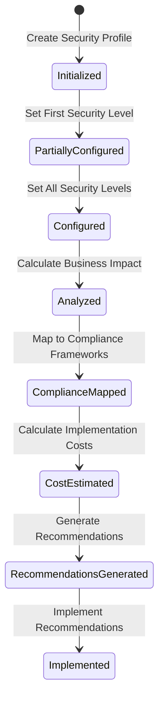

# Business Continuity Planning for CIA Compliance Manager

This document outlines how the CIA Compliance Manager addresses business continuity planning requirements and maps them to industry-standard security frameworks. It provides a comprehensive overview of how business continuity controls align with the CIA triad and how the application supports business impact analysis up to Moderate security levels.

## 📚 Related Architecture Documentation

| Document                                                | Focus           | Description                               |
| ------------------------------------------------------- | --------------- | ----------------------------------------- |
| **[Current Architecture](ARCHITECTURE.md)**             | 🏛️ Architecture | C4 model showing current system structure |
| **[State Diagrams](STATEDIAGRAM.md)**                   | 🔄 Behavior     | Current system state transitions          |
| **[Process Flowcharts](FLOWCHART.md)**                  | 🔄 Process      | Current security workflows                |
| **[Mindmaps](MINDMAP.md)**                              | 🧠 Concept      | Current system component relationships    |
| **[SWOT Analysis](SWOT.md)**                            | 💼 Business     | Current strategic assessment              |
| **[BusinessContinuityPlan](BusinessContinuityPlan.md)** | 🔄 Process      | BCP and business impact analysis          |

## 1. Business Continuity Overview

Business Continuity Planning (BCP) represents a critical subset of security controls within the Availability dimension of the CIA triad. However, effective business continuity also depends on proper Integrity and Confidentiality controls to ensure complete recovery of accurate and protected information.
Based on the CIA Compliance Manager's implementation of commonly used information security standards, here's a comprehensive overview of business continuity planning requirements:

## Core Business Continuity Standards

The CIA Compliance Manager maps continuity controls to several major frameworks:

### NIST 800-53 Rev. 5

- **CP-2**: Contingency Plan development
- **CP-7**: Alternate Processing Site requirements
- **CP-9**: System Backup requirements
- **CP-10**: System Recovery and Reconstitution
- **CP-4(2)**: Contingency Plan Testing with alternate processing site

### NIST CSF 2.0

- **Recover.Recovery Planning.RC.RP**: Recovery processes execution
- **Recover.Recovery Planning.RC.RP-4**: RTOs and RPOs alignment
- **Protect.Data Security.PR.DS-9**: Backup solution protection
- **Identify.Business Environment.ID.BE-5**: Resilience requirements for critical services

### ISO 27001:2022

- **A.17.1.1**: Planning information security continuity
- **A.17.1.2**: Implementing information security continuity
- **A.17.1.3**: Verify, review and evaluate continuity
- **A.17.2.1**: Availability of information processing facilities
- **A.12.3.1**: Information backup

## Business Impact Analysis Requirements

The Business Impact Analysis (BIA) component must include:

1. **Critical Function Identification**

   - Document dependencies between business processes
   - Map technical systems to business functions
   - Prioritize based on criticality to operations

2. **Impact Quantification**

   - **Financial Impact**: Revenue loss, recovery costs, potential penalties
   - **Operational Impact**: Process disruption, productivity loss, decision quality
   - **Reputational Impact**: Customer trust, brand damage assessment
   - **Regulatory Impact**: Compliance violations, legal consequences

3. **Recovery Objectives**
   - **RTO (Recovery Time Objective)**: Maximum acceptable downtime
   - **RPO (Recovery Point Objective)**: Maximum acceptable data loss
   - **MTTR (Mean Time To Recover)**: Average time to restore operations
   - **Uptime Requirements**: Availability percentage targets (95%-99.99%)

## 1. Risk Mapping Overview

The application uses the following mapping between security levels and risk levels:

- **None**: Critical  
  _(Extreme risk)_
- **Low**: High  
  _(High risk)_
- **Moderate**: Medium  
  _(Moderate risk)_
- **High**: Low  
  _(Low risk)_
- **Very High**: Minimal  
  _(Minimal risk)_

## 2. Impact Details by Security Level

### Financial Impact

| Security Level | Risk Level | Description                                                  | Annual Revenue Loss |
| -------------- | ---------- | ------------------------------------------------------------ | ------------------- |
| None           | Critical   | Extreme financial impact with potential for business failure | 15% or more         |
| Low            | High       | Significant impact requiring major budget adjustments        | 5-15%               |
| Moderate       | Medium     | Moderate impact affecting department budgets                 | 1-5%                |
| High           | Low        | Limited impact within planned security budget                | Less than 1%        |
| Very High      | Minimal    | Minimal financial impact with negligible business disruption | Negligible          |

### Operational Impact

| Security Level | Risk Level | Description                                        | Mean Time to Recover (MTTR) |
| -------------- | ---------- | -------------------------------------------------- | --------------------------- |
| None           | Critical   | Complete operational shutdown for extended periods | Weeks or longer             |
| Low            | High       | Major disruption affecting multiple areas          | Days                        |
| Moderate       | Medium     | Significant disruption with limited duration       | Hours                       |
| High           | Low        | Minor disruption with quick recovery               | Minutes to hours            |
| Very High      | Minimal    | Minimal impact with immediate failover             | \<5 minutes                 |

### Reputational Impact

| Security Level | Risk Level | Description                                                 |
| -------------- | ---------- | ----------------------------------------------------------- |
| None           | Critical   | Severe brand damage with long-term customer trust erosion   |
| Low            | High       | Significant negative press and public relations challenges  |
| Moderate       | Medium     | Moderate damage requiring active reputation management      |
| High           | Low        | Limited impact with minimal public awareness                |
| Very High      | Minimal    | Negligible impact with potential positive public perception |

## 3. Risk Impact Label Definitions

The following labels are used to describe the overall business impact:

- **Critical**: Severe business impact requiring immediate action.
- **High**: Major business impact requiring prioritized remediation.
- **Medium**: Moderate business impact warranting planned action.
- **Low**: Minor business impact to be addressed in normal operations.
- **Minimal**: Negligible business impact requiring routine monitoring.

### Key BCP Components in Security Architecture

1. **Recovery Time Objective (RTO)**: The targeted duration of time within which a business process must be restored after a disruption.
2. **Recovery Point Objective (RPO)**: The maximum targeted period in which data might be lost due to a major incident.
3. **Mean Time to Recover (MTTR)**: The average time required to repair a failed component.
4. **Business Impact Analysis (BIA)**: The process of analyzing activities and the effect that a business disruption might have on them.

## 2. Security Level Progression for Business Continuity

The CIA Compliance Manager defines five distinct security levels for business continuity planning, each mapped to specific controls across major security frameworks:

### None Level

- **Recovery Capabilities**: No defined recovery processes
- **Uptime Target**: <90% (>36.5 days of downtime per year)
- **Framework Alignment**: None
- **Business Impact**: Critical - Unpredictable recovery capabilities

### Low Level (Basic)

- **Recovery Capabilities**: Manual backup procedures with 24-48 hour recovery SLA
- **Uptime Target**: 95% (18.25 days of downtime per year)
- **RTO**: 24-48 hours
- **RPO**: 24 hours or more
- **Framework Alignment**: NIST SP 800-34 (Basic)
- **Controls Mapped**:
  - [CP-2 Contingency Plan](https://csrc.nist.gov/projects/risk-management/sp800-53-controls/release-search#!/control?version=5.1&number=CP-2) (Low)
  - [CP-9 System Backup](https://csrc.nist.gov/projects/risk-management/sp800-53-controls/release-search#!/control?version=5.1&number=CP-9) (Basic)

### Moderate Level

- **Recovery Capabilities**: Automated recovery with 4-8 hour SLA
- **Uptime Target**: 99% (3.65 days of downtime per year)
- **RTO**: 4-8 hours
- **RPO**: 4 hours
- **MTTR**: 4-6 hours
- **Framework Alignment**: NIST SP 800-34, ISO 22301 (Partial)
- **Controls Mapped**:
  - [CP-4 Contingency Plan Testing](https://csrc.nist.gov/projects/risk-management/sp800-53-controls/release-search#!/control?version=5.1&number=CP-4)
  - [CP-6 Alternate Storage Site](https://csrc.nist.gov/projects/risk-management/sp800-53-controls/release-search#!/control?version=5.1&number=CP-6)
  - [CP-10 System Recovery and Reconstitution](https://csrc.nist.gov/projects/risk-management/sp800-53-controls/release-search#!/control?version=5.1&number=CP-10)
  - [SC-6 Resource Availability](https://csrc.nist.gov/projects/risk-management/sp800-53-controls/release-search#!/control?version=5.1&number=SC-6)

### High Level

- **Recovery Capabilities**: Automated failover with 15-60 minute SLA
- **Uptime Target**: 99.9% (8.76 hours of downtime per year)
- **RTO**: 15-60 minutes
- **RPO**: 15 minutes
- **MTTR**: <60 minutes
- **Framework Alignment**: NIST SP 800-34, ISO 22301, FFIEC
- **Controls Mapped**:
  - [CP-7 Alternate Processing Site](https://csrc.nist.gov/projects/risk-management/sp800-53-controls/release-search#!/control?version=5.1&number=CP-7)
  - [CP-9(5) System Backup - Transfer to Alternate Storage Site](https://csrc.nist.gov/projects/risk-management/sp800-53-controls/release-search#!/control?version=5.1&number=CP-9)
  - [CP-10(4) System Recovery and Reconstitution](https://csrc.nist.gov/projects/risk-management/sp800-53-controls/release-search#!/control?version=5.1&number=CP-10)

### Very High Level

- **Recovery Capabilities**: Continuous availability with <5 minute recovery
- **Uptime Target**: 99.99% (52.6 minutes of downtime per year)
- **RTO**: <5 minutes
- **RPO**: Near zero
- **MTTR**: <5 minutes
- **Framework Alignment**: NIST SP 800-34 (Advanced), ISO 22301 (Full), FFIEC, PCI DSS, HIPAA
- **Controls Mapped**:
  - [CP-7(3) Alternate Processing Site - Priority of Service](https://csrc.nist.gov/projects/risk-management/sp800-53-controls/release-search#!/control?version=5.1&number=CP-7)
  - [CP-10(2) System Recovery and Reconstitution - Transaction Recovery](https://csrc.nist.gov/projects/risk-management/sp800-53-controls/release-search#!/control?version=5.1&number=CP-10)
  - [CP-4(2) Contingency Plan Testing - Alternate Processing Site](https://csrc.nist.gov/projects/risk-management/sp800-53-controls/release-search#!/control?version=5.1&number=CP-4)

## 1. Availability Controls

### Basic Level (Backup & Restore)

| Technical Control                       | NIST 800-53 Rev. 5                                                                                                                                                       | NIST CSF 2.0                                                                                                                                                                      | ISO 27001:2022                                    |
| --------------------------------------- | ------------------------------------------------------------------------------------------------------------------------------------------------------------------------ | --------------------------------------------------------------------------------------------------------------------------------------------------------------------------------- | ------------------------------------------------- |
| Manual backup procedures                | [CP-9 System Backup](https://csrc.nist.gov/projects/risk-management/sp800-53-controls/release-search#!/control?version=5.1&number=CP-9) (Basic)                          | [Protect.Data Security.PR.DS-9](https://www.nist.gov/cyberframework/framework): Implement backup processes                                                                        | A.12.3.1 Information backup                       |
| Basic recovery documentation            | [CP-2 Contingency Plan](https://csrc.nist.gov/projects/risk-management/sp800-53-controls/release-search#!/control?version=5.1&number=CP-2) (Low)                         | [Recover.Recovery Planning.RC.RP](https://www.nist.gov/cyberframework/framework): Recovery processes and procedures are executed and maintained                                   | A.17.1.1 Planning information security continuity |
| Single Points of Failure identification | [CP-2(8) Contingency Plan - Identify Critical Assets](https://csrc.nist.gov/projects/risk-management/sp800-53-controls/release-search#!/control?version=5.1&number=CP-2) | [Identify.Business Environment.ID.BE-5](https://www.nist.gov/cyberframework/framework): Resilience requirements to support delivery of critical services for all operating states | A.11.2.2 Supporting utilities                     |

### Moderate Level (Pilot Light)

Critically reviewed for automation, consistency, and a balance between cost and resilience:

| Technical Control                     | NIST 800-53 Rev. 5                                                                                                                                             | NIST CSF 2.0                                                                                                                           | ISO 27001:2022                                                       |
| ------------------------------------- | -------------------------------------------------------------------------------------------------------------------------------------------------------------- | -------------------------------------------------------------------------------------------------------------------------------------- | -------------------------------------------------------------------- |
| Automated recovery scripts            | [CP-10 System Recovery and Reconstitution](https://csrc.nist.gov/projects/risk-management/sp800-53-controls/release-search#!/control?version=5.1&number=CP-10) | [Recover.Improvements.RC.IM](https://www.nist.gov/cyberframework/framework): Recovery planning and processes are improved              | A.17.1.2 Implementing information security continuity                |
| Standby systems                       | [CP-6 Alternate Storage Site](https://csrc.nist.gov/projects/risk-management/sp800-53-controls/release-search#!/control?version=5.1&number=CP-6)               | [Protect.Data Security.PR.DS-4](https://www.nist.gov/cyberframework/framework): Adequate capacity to ensure availability is maintained | A.17.2.1 Availability of information processing facilities           |
| Limited redundancy                    | [SC-6 Resource Availability](https://csrc.nist.gov/projects/risk-management/sp800-53-controls/release-search#!/control?version=5.1&number=SC-6)                | [Protect.Data Security.PR.DS-4](https://www.nist.gov/cyberframework/framework): Adequate capacity to ensure availability is maintained | A.11.2.3 Cabling security                                            |
| Regular testing of failover processes | [CP-4 Contingency Plan Testing](https://csrc.nist.gov/projects/risk-management/sp800-53-controls/release-search#!/control?version=5.1&number=CP-4)             | [Recover.Testing.RC.TE](https://www.nist.gov/cyberframework/framework): Recovery testing is performed                                  | A.17.1.3 Verify, review and evaluate information security continuity |

### High Level (Warm Standby)

Ensuring near-continuity with additional technical controls and monitoring:

| Technical Control                  | NIST 800-53 Rev. 5                                                                                                                                                                             | NIST CSF 2.0                                                                                                                                             | ISO 27001:2022                                             |
| ---------------------------------- | ---------------------------------------------------------------------------------------------------------------------------------------------------------------------------------------------- | -------------------------------------------------------------------------------------------------------------------------------------------------------- | ---------------------------------------------------------- |
| Partially active redundant systems | [CP-7 Alternate Processing Site](https://csrc.nist.gov/projects/risk-management/sp800-53-controls/release-search#!/control?version=5.1&number=CP-7) with CP-7(1) Separation from Primary Site  | [Protect.Data Security.PR.DS-4](https://www.nist.gov/cyberframework/framework): Adequate capacity to ensure availability is maintained                   | A.17.2.1 Availability of information processing facilities |
| Real-time data replication         | [CP-9(5) System Backup - Transfer to Alternate Storage Site](https://csrc.nist.gov/projects/risk-management/sp800-53-controls/release-search#!/control?version=5.1&number=CP-9)                | [Protect.Data Security.PR.DS-9](https://www.nist.gov/cyberframework/framework): Backup solutions are protected                                           | A.12.3.1 Information backup                                |
| Automated failover mechanisms      | [CP-10(4) System Recovery and Reconstitution - Restore Within Time Period](https://csrc.nist.gov/projects/risk-management/sp800-53-controls/release-search#!/control?version=5.1&number=CP-10) | [Recover.Recovery Planning.RC.RP](https://www.nist.gov/cyberframework/framework): Executed recovery processes ensure restoration of systems or assets    | A.17.1.2 Implementing information security continuity      |
| 24/7 monitoring                    | [SI-4 System Monitoring](https://csrc.nist.gov/projects/risk-management/sp800-53-controls/release-search#!/control?version=5.1&number=SI-4)                                                    | [Detect.Continuous Monitoring.DE.CM](https://www.nist.gov/cyberframework/framework): Monitoring is performed continuously to detect cybersecurity events | A.12.4.1 Event logging                                     |

### Very High Level (Multi-Site Active/Active)

The controls here demonstrate the highest degree of resilience and zero downtime:

| Technical Control                       | NIST 800-53 Rev. 5                                                                                                                                                                       | NIST CSF 2.0                                                                                                                                                           | ISO 27001:2022                                                       |
| --------------------------------------- | ---------------------------------------------------------------------------------------------------------------------------------------------------------------------------------------- | ---------------------------------------------------------------------------------------------------------------------------------------------------------------------- | -------------------------------------------------------------------- |
| Fully redundant multi-region deployment | [CP-7(3) Alternate Processing Site - Priority of Service](https://csrc.nist.gov/projects/risk-management/sp800-53-controls/release-search#!/control?version=5.1&number=CP-7)             | [Protect.Data Security.PR.DS-7](https://www.nist.gov/cyberframework/framework): Separate environments for development/testing vs. production                           | A.17.2.1 Availability of information processing facilities           |
| Global load balancing                   | [SC-5 Denial of Service Protection](https://csrc.nist.gov/projects/risk-management/sp800-53-controls/release-search#!/control?version=5.1&number=SC-5)                                   | [Protect.Applications Security.PR.AP-9](https://www.nist.gov/cyberframework/framework): Protects against application compromise through load balancing                 | A.13.1.3 Segregation in networks                                     |
| Automatic failover with zero data loss  | [CP-10(2) System Recovery and Reconstitution - Transaction Recovery](https://csrc.nist.gov/projects/risk-management/sp800-53-controls/release-search#!/control?version=5.1&number=CP-10) | [Recover.Recovery Planning.RC.RP-4](https://www.nist.gov/cyberframework/framework): Meets Recovery Time Objectives (RTOs) and Recovery Point Objectives (RPOs)         | A.17.1.2 Implementing information security continuity                |
| Dedicated site reliability engineering  | [CP-2(2) Contingency Plan - Capacity Planning](https://csrc.nist.gov/projects/risk-management/sp800-53-controls/release-search#!/control?version=5.1&number=CP-2)                        | [Identify.Risk Management Strategy.ID.RM](https://www.nist.gov/cyberframework/framework): Ensures risk management processes are robust and agreed upon by stakeholders | A.5.8 Project management                                             |
| Regular cross-region testing            | [CP-4(2) Contingency Plan Testing - Alternate Processing Site](https://csrc.nist.gov/projects/risk-management/sp800-53-controls/release-search#!/control?version=5.1&number=CP-4)        | [Recover.Testing.RC.TE-1](https://www.nist.gov/cyberframework/framework): Periodic recovery testing to verify operational resilience                                   | A.17.1.3 Verify, review and evaluate information security continuity |

---

## 2. Integrity Controls

### Basic Level (Manual Validation)

| Technical Control              | NIST 800-53 Rev. 5                                                                                                                                               | NIST CSF 2.0                                                                                                                            | ISO 27001:2022                                |
| ------------------------------ | ---------------------------------------------------------------------------------------------------------------------------------------------------------------- | --------------------------------------------------------------------------------------------------------------------------------------- | --------------------------------------------- |
| Manual data entry verification | [SI-10 Information Input Validation](https://csrc.nist.gov/projects/risk-management/sp800-53-controls/release-search#!/control?version=5.1&number=SI-10) (Basic) | [Protect.Data Security.PR.DS-6](https://www.nist.gov/cyberframework/framework): Ensures data integrity via manual checks                | A.14.2.5 Secure system engineering principles |
| Basic access logs              | [AU-2 Audit Events](https://csrc.nist.gov/projects/risk-management/sp800-53-controls/release-search#!/control?version=5.1&number=AU-2) (Basic)                   | [Detect.Security Continuous Monitoring.DE.CM-7](https://www.nist.gov/cyberframework/framework): Monitors for unauthorized access events | A.12.4.1 Event logging                        |
| Simple backup strategies       | [CP-9 System Backup](https://csrc.nist.gov/projects/risk-management/sp800-53-controls/release-search#!/control?version=5.1&number=CP-9) (Basic)                  | [Protect.Data Security.PR.DS-9](https://www.nist.gov/cyberframework/framework): Ensures basic backup strategies are implemented         | A.12.3.1 Information backup                   |

### Moderate Level (Automated Validation)

Critically, the controls here must catch errors automatically and maintain version consistency:

| Technical Control               | NIST 800-53 Rev. 5                                                                                                                                                                               | NIST CSF 2.0                                                                                                                          | ISO 27001:2022                          |
| ------------------------------- | ------------------------------------------------------------------------------------------------------------------------------------------------------------------------------------------------ | ------------------------------------------------------------------------------------------------------------------------------------- | --------------------------------------- |
| Automated data validation rules | [SI-10(5) Information Input Validation - Restrict Inputs to Trusted Sources](https://csrc.nist.gov/projects/risk-management/sp800-53-controls/release-search#!/control?version=5.1&number=SI-10) | [Protect.Data Security.PR.DS-6](https://www.nist.gov/cyberframework/framework): Validates data integrity automatically                | A.14.2.8 System security testing        |
| Audit logging systems           | [AU-12 Audit Record Generation](https://csrc.nist.gov/projects/risk-management/sp800-53-controls/release-search#!/control?version=5.1&number=AU-12)                                              | [Detect.Security Continuous Monitoring.DE.CM-1](https://www.nist.gov/cyberframework/framework): Logs are analyzed in real-time        | A.12.4.1 Event logging                  |
| Error detection mechanisms      | [SI-11 Error Handling](https://csrc.nist.gov/projects/risk-management/sp800-53-controls/release-search#!/control?version=5.1&number=SI-11)                                                       | [Protect.Data Security.PR.DS-6](https://www.nist.gov/cyberframework/framework): Detects anomalies and errors automatically            | A.14.2.6 Secure development environment |
| Version control                 | [CM-3 Configuration Change Control](https://csrc.nist.gov/projects/risk-management/sp800-53-controls/release-search#!/control?version=5.1&number=CM-3)                                           | [Protect.Configuration Management.PR.CM-3](https://www.nist.gov/cyberframework/framework): Manages versioning and changes effectively | A.12.1.2 Change management              |

### High Level (Cryptographic Verification)

For enhanced assurance, integrity controls include strong cryptographic measures:

| Technical Control               | NIST 800-53 Rev. 5                                                                                                                                                          | NIST CSF 2.0                                                                                                                                    | ISO 27001:2022                                           |
| ------------------------------- | --------------------------------------------------------------------------------------------------------------------------------------------------------------------------- | ----------------------------------------------------------------------------------------------------------------------------------------------- | -------------------------------------------------------- |
| Cryptographic hash verification | [SC-16 Transmission of Security and Privacy Attributes](https://csrc.nist.gov/projects/risk-management/sp800-53-controls/release-search#!/control?version=5.1&number=SC-16) | [Protect.Data Security.PR.DS-8](https://www.nist.gov/cyberframework/framework): Uses hashes to ensure data has not been altered                 | A.14.1.3 Protection of application services transactions |
| Digital signatures              | [SC-13 Cryptographic Protection](https://csrc.nist.gov/projects/risk-management/sp800-53-controls/release-search#!/control?version=5.1&number=SC-13)                        | [Protect.Data Security.PR.DS-6](https://www.nist.gov/cyberframework/framework): Applies digital signing to certify authenticity                 | A.10.1.1 Policy on the use of cryptographic controls     |
| Complete audit trails           | [AU-10 Non-repudiation](https://csrc.nist.gov/projects/risk-management/sp800-53-controls/release-search#!/control?version=5.1&number=AU-10)                                 | [Detect.Security Continuous Monitoring.DE.CM-3](https://www.nist.gov/cyberframework/framework): Provides non-repudiation by logging all actions | A.12.4.4 Clock synchronization                           |
| Tamper-evident logging          | [AU-9 Protection of Audit Information](https://csrc.nist.gov/projects/risk-management/sp800-53-controls/release-search#!/control?version=5.1&number=AU-9)                   | [Protect.Data Security.PR.DS-8](https://www.nist.gov/cyberframework/framework): Ensures log integrity to detect tampering                       | A.12.4.2 Protection of log information                   |

### Very High Level (Distributed Ledger/Blockchain)

Here the controls are designed for a zero–trust environment with advanced cryptography:

| Technical Control                          | NIST 800-53 Rev. 5                                                                                                                                                                                    | NIST CSF 2.0                                                                                                                                            | ISO 27001:2022                                           |
| ------------------------------------------ | ----------------------------------------------------------------------------------------------------------------------------------------------------------------------------------------------------- | ------------------------------------------------------------------------------------------------------------------------------------------------------- | -------------------------------------------------------- |
| Blockchain/distributed ledger verification | [SC-16(1) Transmission of Security & Privacy Attributes - Integrity Verification](https://csrc.nist.gov/projects/risk-management/sp800-53-controls/release-search#!/control?version=5.1&number=SC-16) | [Protect.Data Security.PR.DS-6](https://www.nist.gov/cyberframework/framework): Verifies integrity using decentralized methods                          | A.14.1.3 Protection of application services transactions |
| Zero-knowledge proofs                      | [SC-13(1) Cryptographic Protection - FIPS-Validated Cryptography](https://csrc.nist.gov/projects/risk-management/sp800-53-controls/release-search#!/control?version=5.1&number=SC-13)                 | [Protect.Identity Management.PR.ID-5](https://www.nist.gov/cyberframework/framework): Strengthens access control without revealing secrets              | A.10.1.1 Policy on the use of cryptographic controls     |
| Immutable audit logs                       | [AU-9(3) Protection of Audit Information - Cryptographic Protection](https://csrc.nist.gov/projects/risk-management/sp800-53-controls/release-search#!/control?version=5.1&number=AU-9)               | [Detect.Security Continuous Monitoring.DE.CM-7](https://www.nist.gov/cyberframework/framework): Provides immutable logs for high-assurance audits       | A.12.4.2 Protection of log information                   |
| Formal verification methods                | [SA-11 Developer Testing and Evaluation](https://csrc.nist.gov/projects/risk-management/sp800-53-controls/release-search#!/control?version=5.1&number=SA-11)                                          | [Protect.Data Security.PR.DS-6](https://www.nist.gov/cyberframework/framework): Ensures systems meet defined security requirements via formal methods   | A.14.2.8 System security testing                         |
| Independent verification systems           | [CA-8 Penetration Testing](https://csrc.nist.gov/projects/risk-management/sp800-53-controls/release-search#!/control?version=5.1&number=CA-8)                                                         | [Detect.Detection Processes.DE.DP-4](https://www.nist.gov/cyberframework/framework): Independently verifies system security through third–party testing | A.14.2.8 System security testing                         |

---

## 3. Confidentiality Controls

### Basic Level (Basic Access Control)

| Technical Control           | NIST 800-53 Rev. 5                                                                                                                                                  | NIST CSF 2.0                                                                                                                            | ISO 27001:2022                                             |
| --------------------------- | ------------------------------------------------------------------------------------------------------------------------------------------------------------------- | --------------------------------------------------------------------------------------------------------------------------------------- | ---------------------------------------------------------- |
| Basic authentication        | [IA-2 Identification and Authentication](https://csrc.nist.gov/projects/risk-management/sp800-53-controls/release-search#!/control?version=5.1&number=IA-2) (Basic) | [Protect.Identity Management.PR.ID-3](https://www.nist.gov/cyberframework/framework): Authenticates users and devices accordingly       | A.8.3.2 User access provisioning                           |
| Simple access control lists | [AC-3 Access Enforcement](https://csrc.nist.gov/projects/risk-management/sp800-53-controls/release-search#!/control?version=5.1&number=AC-3) (Basic)                | [Protect.Access Control.PR.AC-4](https://www.nist.gov/cyberframework/framework): Manages access permissions effectively                 | A.8.2.1 User registration and de-registration              |
| Password policies           | [IA-5 Authenticator Management](https://csrc.nist.gov/projects/risk-management/sp800-53-controls/release-search#!/control?version=5.1&number=IA-5) (Basic)          | [Protect.Identity Management.PR.ID-1](https://www.nist.gov/cyberframework/framework): Enforces robust password lifecycle management     | A.8.3.1 User access management                             |
| Data classification scheme  | [RA-2 Security Categorization](https://csrc.nist.gov/projects/risk-management/sp800-53-controls/release-search#!/control?version=5.1&number=RA-2)                   | [Identify.Asset Management.ID.AM-5](https://www.nist.gov/cyberframework/framework): Categorizes resources based on business criticality | A.5.9 Inventory of information and other associated assets |

### Moderate Level (Standard Encryption)

Controls at this level include stronger encryption and role-based permissions:

| Technical Control                | NIST 800-53 Rev. 5                                                                                                                                                 | NIST CSF 2.0                                                                                                                | ISO 27001:2022                                       |
| -------------------------------- | ------------------------------------------------------------------------------------------------------------------------------------------------------------------ | --------------------------------------------------------------------------------------------------------------------------- | ---------------------------------------------------- |
| Role-based access control (RBAC) | [AC-2 Account Management](https://csrc.nist.gov/projects/risk-management/sp800-53-controls/release-search#!/control?version=5.1&number=AC-2)                       | [Protect.Access Control.PR.AC-4](https://www.nist.gov/cyberframework/framework): Implements least privilege access          | A.8.2.2 User access provisioning                     |
| Standard encryption in transit   | [SC-8 Transmission Confidentiality](https://csrc.nist.gov/projects/risk-management/sp800-53-controls/release-search#!/control?version=5.1&number=SC-8)             | [Protect.Data Security.PR.DS-2](https://www.nist.gov/cyberframework/framework): Secures data transmission                   | A.10.1.1 Policy on the use of cryptographic controls |
| Standard encryption at rest      | [SC-28 Protection of Information at Rest](https://csrc.nist.gov/projects/risk-management/sp800-53-controls/release-search#!/control?version=5.1&number=SC-28)      | [Protect.Data Security.PR.DS-1](https://www.nist.gov/cyberframework/framework): Protects data-at-rest                       | A.10.1.1 Policy on the use of cryptographic controls |
| Regular access reviews           | [AC-2(3) Account Management - Disable Accounts](https://csrc.nist.gov/projects/risk-management/sp800-53-controls/release-search#!/control?version=5.1&number=AC-2) | [Protect.Identity Management.PR.ID-4](https://www.nist.gov/cyberframework/framework): Periodic review of access permissions | A.8.2.3 Management of privileged access rights       |
| Data loss prevention controls    | [AC-4 Information Flow Enforcement](https://csrc.nist.gov/projects/risk-management/sp800-53-controls/release-search#!/control?version=5.1&number=AC-4)             | [Protect.Data Security.PR.DS-5](https://www.nist.gov/cyberframework/framework): Prevents data leakage effectively           | A.8.3.1 Management of removable media                |

### High Level (Advanced Encryption)

Enhanced controls with multi-factor authentication and advanced monitoring:

| Technical Control             | NIST 800-53 Rev. 5                                                                                                                                                                   | NIST CSF 2.0                                                                                                                           | ISO 27001:2022                                        |
| ----------------------------- | ------------------------------------------------------------------------------------------------------------------------------------------------------------------------------------ | -------------------------------------------------------------------------------------------------------------------------------------- | ----------------------------------------------------- |
| Multi-factor authentication   | [IA-2(1) Identification and Authentication - MFA](https://csrc.nist.gov/projects/risk-management/sp800-53-controls/release-search#!/control?version=5.1&number=IA-2)                 | [Protect.Identity Management.PR.ID-3](https://www.nist.gov/cyberframework/framework): Enhances user authentication through MFA         | A.8.3.3 Access to source code                         |
| End-to-end encryption         | [SC-8(1) Transmission Confidentiality - Cryptographic Protection](https://csrc.nist.gov/projects/risk-management/sp800-53-controls/release-search#!/control?version=5.1&number=SC-8) | [Protect.Data Security.PR.DS-2](https://www.nist.gov/cyberframework/framework): Secures data in transit end-to-end                     | A.10.1.1 Policy on the use of cryptographic controls  |
| Privileged access management  | [AC-6 Least Privilege](https://csrc.nist.gov/projects/risk-management/sp800-53-controls/release-search#!/control?version=5.1&number=AC-6)                                            | [Protect.Access Control.PR.AC-4](https://www.nist.gov/cyberframework/framework): Enforces least privilege for sensitive resources      | A.8.2.3 Management of privileged access rights        |
| Advanced data loss prevention | [SI-4 System Monitoring](https://csrc.nist.gov/projects/risk-management/sp800-53-controls/release-search#!/control?version=5.1&number=SI-4)                                          | [Protect.Data Security.PR.DS-5](https://www.nist.gov/cyberframework/framework): Implements data loss prevention measures               | A.13.2.1 Information transfer policies and procedures |
| Comprehensive monitoring      | [AU-6 Audit Record Review, Analysis, and Reporting](https://csrc.nist.gov/projects/risk-management/sp800-53-controls/release-search#!/control?version=5.1&number=AU-6)               | [Detect.Security Continuous Monitoring.DE.CM](https://www.nist.gov/cyberframework/framework): Monitors systems and assets continuously | A.12.4.1 Event logging                                |
| Data tokenization             | [SC-12 Cryptographic Key Establishment and Management](https://csrc.nist.gov/projects/risk-management/sp800-53-controls/release-search#!/control?version=5.1&number=SC-12)           | [Protect.Data Security.PR.DS-1](https://www.nist.gov/cyberframework/framework): Protects stored data through tokenization              | A.10.1.2 Key management                               |

### Very High Level (Zero-Trust Architecture)

For the most critical environments, these controls are essential:

| Technical Control                  | NIST 800-53 Rev. 5                                                                                                                                                                             | NIST CSF 2.0                                                                                                                               | ISO 27001:2022                                                   |
| ---------------------------------- | ---------------------------------------------------------------------------------------------------------------------------------------------------------------------------------------------- | ------------------------------------------------------------------------------------------------------------------------------------------ | ---------------------------------------------------------------- |
| Zero-trust architecture            | [AC-3(3) Access Enforcement - Mandatory Access Control](https://csrc.nist.gov/projects/risk-management/sp800-53-controls/release-search#!/control?version=5.1&number=AC-3)                     | [Protect.Access Control.PR.AC-3](https://www.nist.gov/cyberframework/framework): Enforces a zero–trust model for remote access             | A.8.5 Access control for programming and operational environment |
| Military-grade encryption          | [SC-13 Cryptographic Protection](https://csrc.nist.gov/projects/risk-management/sp800-53-controls/release-search#!/control?version=5.1&number=SC-13) (High)                                    | [Protect.Data Security.PR.DS-1](https://www.nist.gov/cyberframework/framework): Applies top–tier encryption for stored data                | A.10.1.1 Policy on the use of cryptographic controls             |
| Quantum-resistant algorithms       | [SC-13(2) Cryptographic Protection - Quantum-Resistant](https://csrc.nist.gov/projects/risk-management/sp800-53-controls/release-search#!/control?version=5.1&number=SC-13) (Draft)            | [Protect.Data Security.PR.DS-2](https://www.nist.gov/cyberframework/framework): Prepares for next–generation cryptography to secure data   | A.10.1.2 Key management                                          |
| Behavioral analytics               | [SI-4(16) System Monitoring - Correlate Monitoring Information](https://csrc.nist.gov/projects/risk-management/sp800-53-controls/release-search#!/control?version=5.1&number=SI-4)             | [Detect.Anomalies and Events.DE.AE](https://www.nist.gov/cyberframework/framework): Uses behavioral patterns to detect anomalies           | A.12.4.1 Event logging                                           |
| Just-in-time access provisioning   | [AC-2(11) Account Management - Usage Conditions](https://csrc.nist.gov/projects/risk-management/sp800-53-controls/release-search#!/control?version=5.1&number=AC-2)                            | [Protect.Identity Management.PR.ID-1](https://www.nist.gov/cyberframework/framework): Grants temporary access strictly based on need       | A.8.2.2 User access provisioning                                 |
| Secure enclaves                    | [SC-39 Process Isolation](https://csrc.nist.gov/projects/risk-management/sp800-53-controls/release-search#!/control?version=5.1&number=SC-39)                                                  | [Protect.Data Security.PR.DS-5](https://www.nist.gov/cyberframework/framework): Isolates sensitive data within secure runtime environments | A.13.1.3 Segregation in networks                                 |
| Homomorphic encryption             | [SC-28(1) Protection of Information at Rest - Cryptographic Protection](https://csrc.nist.gov/projects/risk-management/sp800-53-controls/release-search#!/control?version=5.1&number=SC-28)    | [Protect.Data Security.PR.DS-1](https://www.nist.gov/cyberframework/framework): Applies advanced methods to process encrypted data         | A.10.1.1 Policy on the use of cryptographic controls             |
| Strict isolation of sensitive data | [SC-7(21) Boundary Protection - Isolation of Information System Components](https://csrc.nist.gov/projects/risk-management/sp800-53-controls/release-search#!/control?version=5.1&number=SC-7) | [Protect.Data Security.PR.DS-7](https://www.nist.gov/cyberframework/framework): Ensures complete segregation of critical environments      | A.13.1.3 Segregation in networks                                 |

---

## 4. Business Continuity Impact Analysis

### Uptime and Recovery Metrics

| Security Level | Uptime Target | Annual Downtime         | RTO           | RPO              | MTTR          | Business Impact Level |
| -------------- | ------------- | ----------------------- | ------------- | ---------------- | ------------- | --------------------- |
| None           | <90%          | >36.5 days              | Unpredictable | Unpredictable    | Unpredictable | Critical              |
| Low            | 95%           | 18.25 days (~438 hours) | 24–48 hours   | 24 hours or more | 24–48 hours   | High                  |
| Moderate       | 99%           | 3.65 days (~87.6 hours) | 4–8 hours     | 4 hours          | 4–6 hours     | Medium                |
| High           | 99.9%         | 8.76 hours              | 15–60 minutes | 15 minutes       | <60 minutes   | Low                   |
| Very High      | 99.99%        | 52.6 minutes            | <5 minutes    | Near zero        | <5 minutes    | Minimal               |

### Financial Impact Analysis

| Security Level | Revenue Impact                 | Implementation Cost Scale  | Expected ROI | Recovery Cost Scale     | Resource Requirements               |
| -------------- | ------------------------------ | -------------------------- | ------------ | ----------------------- | ----------------------------------- |
| None           | 15% or more of annual revenue  | Minimal                    | None         | Extreme (unpredictable) | Ad-hoc resources only               |
| Low            | 5–15% of annual revenue        | Low CAPEX, Low OPEX        | ~50%         | High                    | Part-time dedicated resources       |
| Moderate       | 1–5% of annual revenue         | Medium CAPEX, Medium OPEX  | ~200%        | Medium                  | Dedicated resources                 |
| High           | Less than 1% of annual revenue | High CAPEX, Medium OPEX    | ~350%        | Low                     | Specialized dedicated resources     |
| Very High      | Negligible                     | Very High CAPEX, High OPEX | ~500%        | Minimal                 | Specialized team with 24/7 coverage |

### Business Continuity Testing Requirements

| Security Level | Testing Cadence                               | Test Types                                                 | Documentation Requirements                                 |
| -------------- | --------------------------------------------- | ---------------------------------------------------------- | ---------------------------------------------------------- |
| None           | None                                          | None                                                       | None                                                       |
| Low            | Annual tabletop exercise                      | Discussion-based review of plans                           | Basic documented recovery procedures and contact list      |
| Moderate       | Semi-annual testing with functional exercises | Limited functional testing of recovery procedures          | Complete BCP documentation, test results, improvement plan |
| High           | Quarterly testing with full operational tests | Full simulation of recovery procedures in test environment | Comprehensive testing documentation, metrics, analysis     |
| Very High      | Monthly testing with production verification  | Regular testing in production with chaos engineering       | Continuous validation reports, improvement metrics         |

---

## 5. Implementation Guidance for Moderate Security Level

The CIA Compliance Manager supports comprehensive business continuity planning up to the Moderate security level (99% uptime, 4–8 hour RTO) because this level provides the optimal balance between technical capabilities and business objectives:

1. **Implementation Feasibility:**  
   Moderate controls rely on automated tech such as backup systems, standby components, and standardized recovery scripts. These can be implemented within a standard IT infrastructure without extensive specialist intervention.

2. **Cost-Benefit Optimization:**  
   With medium CAPEX and OPEX, the Moderate level reduces manual recovery tasks and minimizes disruption, leading to an estimated ROI of ~200% over a three–year period. The reduction in revenue loss (1–5% annually) coupled with controlled recovery costs makes it attractive for most organizations.

3. **Technical Implementation:**

   - Automated backup systems with verification
   - Standby systems and limited redundancy for resiliency
   - Regular testing and automated failover processes to ensure swift recovery

4. **Process Alignment:**  
   Organizations must develop formal business continuity documentation, define RTO/RPO targets, and integrate incident response procedures with continuity plans. Semi–annual testing validates these processes.

5. **Business Alignment & ROI:**  
   This moderate approach aligns with most standard business functions and regulatory requirements. The balance between risk mitigation and cost results in a strong financial case, with reduced annual revenue loss and limited recovery costs, achieving an attractive business ROI.

## 3. Cross-Framework Control Mapping for Business Continuity

The following table maps business continuity requirements across major security frameworks:

| Security Level | NIST 800-53 Rev. 5                                                                                                                                                | NIST CSF 2.0                                                                                                                                    | ISO 27001:2022                                                       |
| -------------- | ----------------------------------------------------------------------------------------------------------------------------------------------------------------- | ----------------------------------------------------------------------------------------------------------------------------------------------- | -------------------------------------------------------------------- |
| Low            | [CP-2 Contingency Plan](https://csrc.nist.gov/projects/risk-management/sp800-53-controls/release-search#!/control?version=5.1&number=CP-2)                        | [Recover.Recovery Planning.RC.RP](https://www.nist.gov/cyberframework/framework): Recovery processes and procedures are executed and maintained | A.17.1.1 Planning information security continuity                    |
| Low            | [CP-9 System Backup](https://csrc.nist.gov/projects/risk-management/sp800-53-controls/release-search#!/control?version=5.1&number=CP-9)                           | [Protect.Data Security.PR.DS-9](https://www.nist.gov/cyberframework/framework): Backup solutions are implemented                                | A.12.3.1 Information backup                                          |
| Moderate       | [CP-4 Contingency Plan Testing](https://csrc.nist.gov/projects/risk-management/sp800-53-controls/release-search#!/control?version=5.1&number=CP-4)                | [Recover.Testing.RC.TE](https://www.nist.gov/cyberframework/framework): Recovery testing is performed                                           | A.17.1.3 Verify, review and evaluate information security continuity |
| Moderate       | [CP-6 Alternate Storage Site](https://csrc.nist.gov/projects/risk-management/sp800-53-controls/release-search#!/control?version=5.1&number=CP-6)                  | [Protect.Data Security.PR.DS-4](https://www.nist.gov/cyberframework/framework): Adequate capacity to ensure availability is maintained          | A.17.2.1 Availability of information processing facilities           |
| Moderate       | [CP-10 System Recovery and Reconstitution](https://csrc.nist.gov/projects/risk-management/sp800-53-controls/release-search#!/control?version=5.1&number=CP-10)    | [Recover.Improvements.RC.IM](https://www.nist.gov/cyberframework/framework): Recovery planning and processes are improved                       | A.17.1.2 Implementing information security continuity                |
| Moderate       | [SC-6 Resource Availability](https://csrc.nist.gov/projects/risk-management/sp800-53-controls/release-search#!/control?version=5.1&number=SC-6)                   | [Protect.Data Security.PR.DS-4](https://www.nist.gov/cyberframework/framework): Adequate capacity to ensure availability is maintained          | A.11.2.3 Cabling security                                            |
| High           | [CP-7 Alternate Processing Site](https://csrc.nist.gov/projects/risk-management/sp800-53-controls/release-search#!/control?version=5.1&number=CP-7)               | [Protect.Data Security.PR.DS-4](https://www.nist.gov/cyberframework/framework): Adequate capacity to ensure availability is maintained          | A.17.2.1 Availability of information processing facilities           |
| Very High      | [CP-10(2) System Recovery and Reconstitution](https://csrc.nist.gov/projects/risk-management/sp800-53-controls/release-search#!/control?version=5.1&number=CP-10) | [Recover.Recovery Planning.RC.RP-4](https://www.nist.gov/cyberframework/framework): Recovery capabilities meet RTOs and RPOs                    | A.17.1.2 Implementing information security continuity                |

## 4. CIA Compliance Manager Business Impact Analysis Support

The CIA Compliance Manager supports comprehensive business impact analysis through multiple components that align with business continuity planning requirements:

### Business Impact Analysis Widget

The Business Impact Analysis Widget translates technical security levels into business outcomes, helping stakeholders understand:

1. **Financial Impact**: Revenue effects of downtime at each security level
2. **Operational Impact**: Business disruption quantification and MTTR assessments
3. **Reputational Impact**: Customer trust implications and SLA requirements
4. **Regulatory Impact**: Compliance violations from availability failures

For Moderate-level implementations, the application provides:

- **Downtime Quantification**: ~3.65 days of annual downtime at 99% availability
- **Financial Impact Calculation**: Revenue impact estimation of 1-5% annually
- **Recovery Metrics**: 4-8 hour RTO visualization and planning
- **Compliance Mapping**: Framework-specific control coverage analysis

### State Transitions for Business Continuity Planning

The application implements state transitions that show the progression of security profiles through business continuity validation:

# Business Continuity Plan for CIA Compliance Manager

## 1. Introduction

This document outlines the Business Continuity Plan (BCP) for the CIA Compliance Manager application. It provides guidance for maintaining critical business functions during and after a disruption, ensuring that the application's security assessment and compliance capabilities remain available to users.

## 2. Business Impact Analysis

### 2.1 Critical Functions

The following functions are considered critical for the CIA Compliance Manager:

| Function | Recovery Time Objective (RTO) | Recovery Point Objective (RPO) | Impact |
|----------|-------------------------------|--------------------------------|--------|
| Security assessment capabilities | 4 hours | 1 hour | High |
| Compliance reporting | 8 hours | 4 hours | Medium |
| User authentication | 2 hours | 0 (zero data loss) | Critical |
| Data storage and retrieval | 4 hours | 1 hour | High |

### 2.2 Dependencies

- Cloud infrastructure provider (AWS/Azure/GCP)
- Authentication service
- Database services
- API services

## 3. Recovery Strategies

### 3.1 Data Backup and Recovery

- Daily automated backups of all application data
- Geo-redundant storage with cross-region replication
- Point-in-time recovery capability for database services
- Regular backup restoration testing (quarterly)

### 3.2 Infrastructure Redundancy

- Multi-region deployment with active-standby configuration
- Load balancing across multiple availability zones
- Auto-scaling groups to handle load variations
- Redundant database instances with automated failover

### 3.3 Incident Response

- Automated monitoring and alerting
- 24/7 on-call rotation for critical incidents
- Established escalation procedures
- Regular incident response drills (bi-annually)

## 4. Recovery Procedures

### 4.1 Service Disruption

1. Detect and assess the disruption via monitoring systems
2. Initiate incident response protocol
3. Communicate with stakeholders about the disruption
4. Activate failover mechanisms if applicable
5. Restore service from backups if necessary
6. Verify system integrity and functionality
7. Return to normal operations

### 4.2 Data Corruption or Loss

1. Identify the scope and cause of corruption/loss
2. Isolate affected systems to prevent further damage
3. Restore data from the most recent valid backup
4. Validate data integrity post-restoration
5. Address the root cause to prevent recurrence
6. Return to normal operations

### 4.3 Critical Dependency Failure

1. Identify the failed dependency
2. Switch to redundant systems or alternative providers
3. Implement temporary workarounds if necessary
4. Monitor service levels during the disruption
5. Return to primary systems once dependency is restored

## 5. Testing and Maintenance

### 5.1 Testing Schedule

- Quarterly restoration testing
- Bi-annual disaster recovery simulation
- Annual full business continuity exercise

### 5.2 Plan Maintenance

- Review and update the plan semi-annually
- Update after significant system changes
- Incorporate lessons learned from incidents and drills

## 6. Communication Plan

### 6.1 Stakeholder Communication

| Stakeholder Group | Communication Method | Frequency During Disruption |
|-------------------|----------------------|---------------------------|
| Application users | Email, in-app notifications | Initial + every 4 hours |
| IT operations team | Slack, SMS, phone calls | Continuous |
| Executive leadership | Email, phone calls | Initial + daily |
| Compliance officers | Email, scheduled calls | Initial + daily |

### 6.2 Communication Templates

- Initial incident notification
- Status update during recovery
- Service restoration announcement
- Post-incident review invitation

## 7. Roles and Responsibilities

### 7.1 Incident Response Team

- **Incident Commander**: Coordinates the overall response
- **Operations Lead**: Manages technical recovery procedures
- **Communications Coordinator**: Handles stakeholder communications
- **Security Officer**: Assesses security implications
- **Business Continuity Manager**: Ensures BCP procedures are followed

### 7.2 Contact Information

*[Contact details for all key personnel would be listed here]*

## 8. Compliance and Reporting

- Document all incidents and response actions
- Conduct post-incident analysis for each disruption
- Update risk register based on findings
- Report significant incidents to relevant regulatory authorities if required

## 9. Appendices

### 9.1 Vendor Contact Information

*[Contact information for all critical vendors would be listed here]*

### 9.2 Recovery Checklists

*[Detailed step-by-step checklists for various recovery scenarios]*

### 9.3 Technical Architecture Diagrams

*[Diagrams showing system architecture with recovery components]*

## 10. Document Control

| Version | Date | Author | Changes |
|---------|------|--------|---------|
| 1.0 | 2023-06-01 | Security Team | Initial version |
| 1.1 | 2023-12-15 | Security Team | Updated recovery procedures |

---

*This document should be reviewed and updated regularly to ensure it remains current and effective.*
