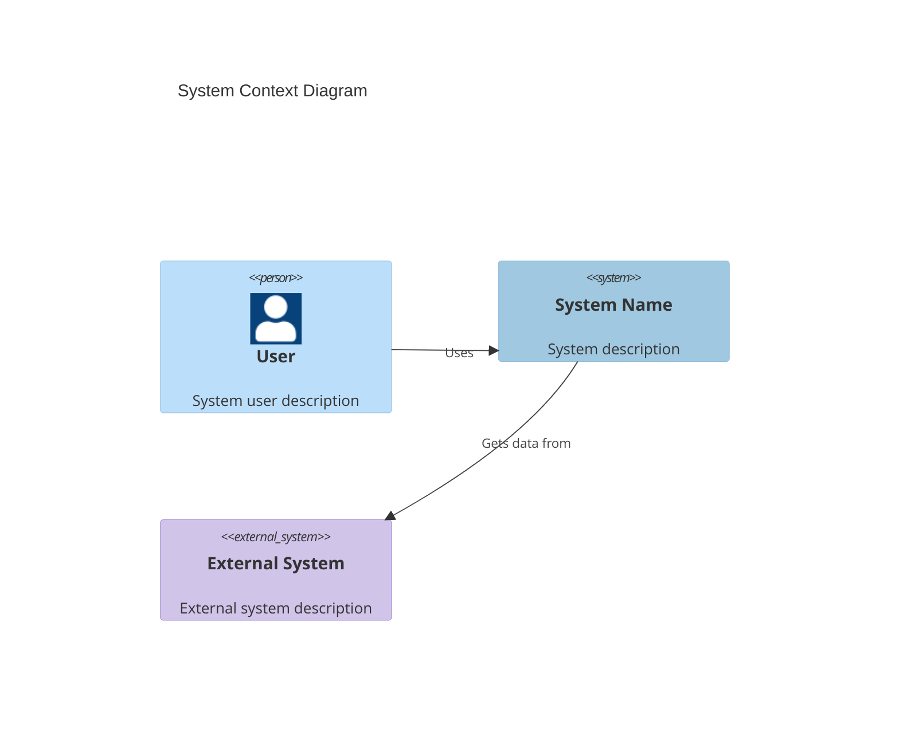
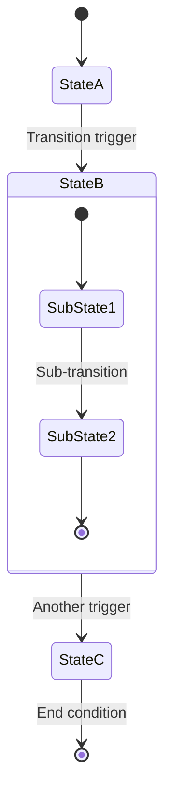
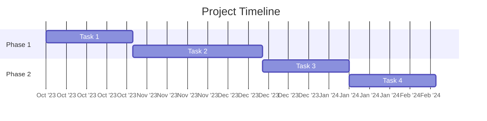

# 📋 Architecture Documentation Contribution Guidelines

This document provides guidelines for contributing to the CIA Compliance Manager's architecture documentation to maintain consistency, readability, and quality across all documentation.

## 📚 Documentation Structure

The architecture documentation follows a structured approach:

1. **Current Architecture Documents** - Present state of the system
2. **Future Architecture Documents** - Vision and roadmap for evolution
3. **Shared Documentation Elements** - Common components across documents

## 🎨 Style Guidelines

### 📊 Diagram Consistency

All architecture diagrams should follow these guidelines:

#### 🎯 Color Scheme

Use this standardized color palette across all diagrams:

| Element Type           | Hex Color  | Usage                                  |
|------------------------|------------|-----------------------------------------|
| 🔷 Core Components     | `#a0c8e0`  | Primary system components               |
| 🔶 Process Elements    | `#ffda9e`  | Workflows, processes, activities        |
| 🔴 Critical Items      | `#ff6666`  | High-priority or security-critical      |
| 🟢 Success States      | `#c8e6c9`  | Completion, successful outcomes         |
| 🟣 Data Elements       | `#d1c4e9`  | Information, storage, data flows        |
| 🔵 External Systems    | `#bbdefb`  | Integrations, third-party systems       |

#### 📝 Text Formatting

- **Headers:** Use sentence case with emoji prefixes for section headers
- **Lists:** Use parallel structure and start action items with verbs
- **Terminology:** Be consistent with technical terms across documents
- **Acronyms:** Define acronyms on first use in each document

#### 📊 Diagram Best Practices

1. **Always include a title** that clearly describes the diagram's purpose
2. **Add a legend or class definitions** when using multiple colors/styles
3. **Keep diagram complexity manageable** (limit nodes to ~15-20 per diagram)
4. **Use consistent direction** (typically top-to-bottom or left-to-right)
5. **Balance visual elements** for aesthetic appeal and readability

### 🧩 Mermaid Diagram Templates

#### Flowchart Template

```mermaid
flowchart TD
    A[Start Process] --> B{Decision Point}
    B -->|Option 1| C[Process Step 1]
    B -->|Option 2| D[Process Step 2]
    C --> E[End Process]
    D --> E

    %% Style definitions
    classDef start fill:#bbdefb,stroke:#333,stroke-width:1px,color:black
    classDef process fill:#a0c8e0,stroke:#333,stroke-width:1px,color:black
    classDef decision fill:#d1c4e9,stroke:#333,stroke-width:1px,color:black
    classDef end fill:#c8e6c9,stroke:#333,stroke-width:1px,color:black

    %% Apply styles
    class A start
    class B decision
    class C,D process
    class E end
```

#### C4 Diagram Template



#### State Diagram Template



#### Gantt Chart Template



### 🔤 File Naming Conventions

1. Use UPPERCASE for all markdown files (e.g., `ARCHITECTURE.md`)
2. Use underscores for multi-word file names (e.g., `FUTURE_DATA_MODEL.md`)
3. Prefix future state documents with `FUTURE_` (e.g., `FUTURE_ARCHITECTURE.md`)

## 📝 Documentation Structure Template

Each architecture document should include these standard sections:

