# 📊 CIA Compliance Manager Data Model

This document provides a comprehensive view of the current data model used in the CIA Compliance Manager. It outlines the key data structures, relationships, and organization that power the security assessment, business impact analysis, and compliance mapping functionalities.

## 📚 Related Architecture Documentation

<div class="documentation-map">

| Document                                            | Focus           | Description                               |
| --------------------------------------------------- | --------------- | ----------------------------------------- |
| **[Current Architecture](ARCHITECTURE.md)**         | 🏛️ Architecture | C4 model showing current system structure |
| **[Future Architecture](FUTURE_ARCHITECTURE.md)**   | 🏛️ Architecture | Vision for context-aware platform         |
| **[Future Data Model](FUTURE_DATA_MODEL.md)**       | 📊 Data         | Enhanced context-aware data architecture  |
| **[State Diagrams](STATEDIAGRAM.md)**               | 🔄 Behavior     | Current system state transitions          |
| **[Process Flowcharts](FLOWCHART.md)**              | 🔄 Process      | Current security workflows                |
| **[Mindmaps](MINDMAP.md)**                          | 🧠 Concept      | Current system component relationships    |
| **[CI/CD Workflows](WORKFLOWS.md)**                 | 🔧 DevOps       | Current automation processes              |

</div>

## 🧩 Core Data Model Overview

The CIA Compliance Manager's data model revolves around three primary domains:

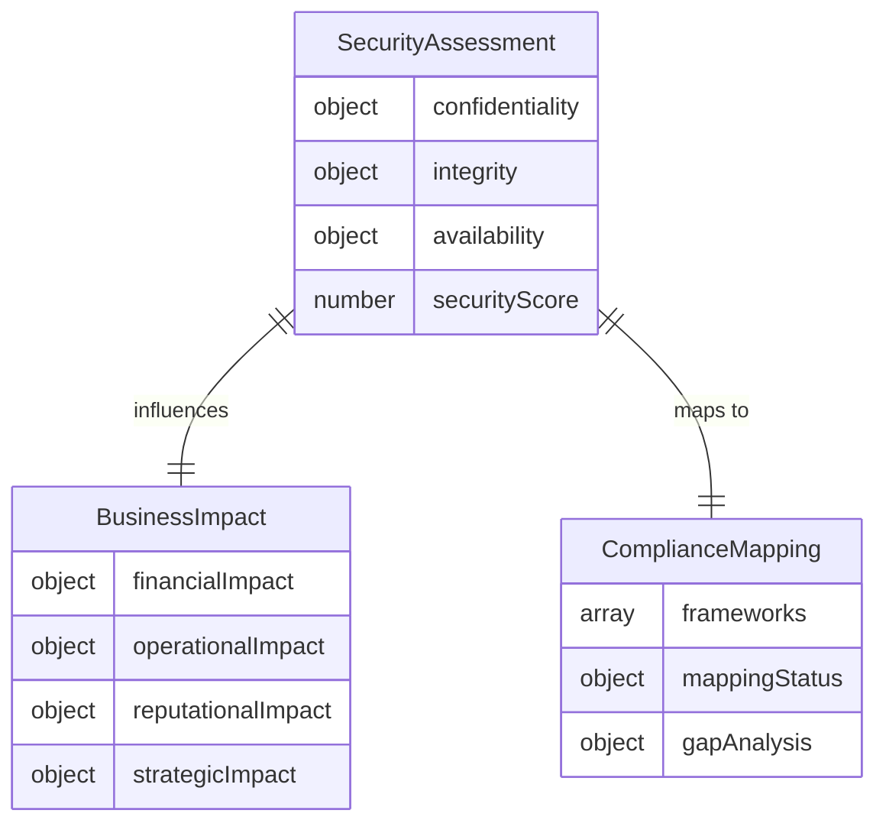

## 🔒 CIA Triad Data Model

**🔧 Technical Focus:** Illustrates the structure of the CIA Triad security levels and their implementation in the system.

**🔒 Security Focus:** Shows how security levels are defined, categorized, and used for security posture assessment.

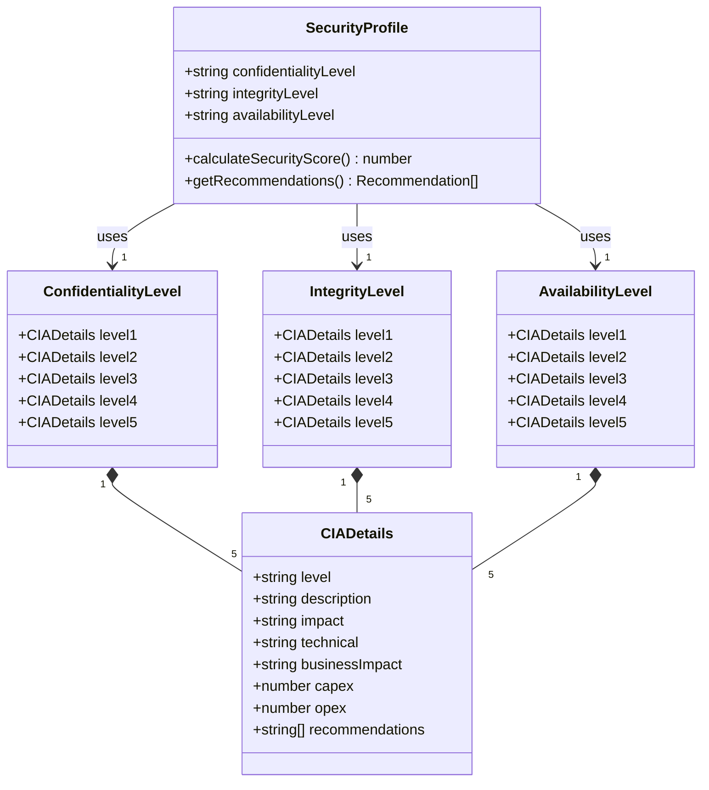

### 📊 Security Level Data Structure

The core data structures for the CIA triad components follow a consistent pattern:

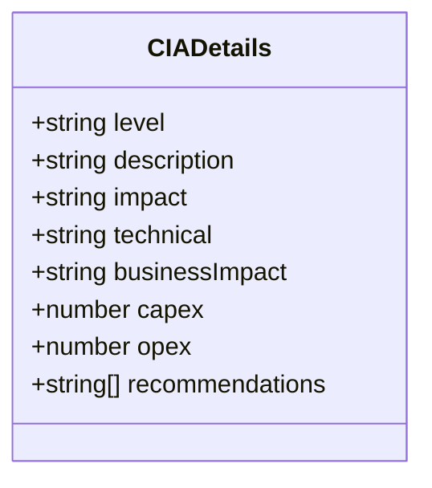

| Property         | Type       | Description                                               | Example                                                  |
|------------------|------------|-----------------------------------------------------------|----------------------------------------------------------|
| 🏷️ level         | string     | Identifier for the security level                         | "Level 1", "Level 2", etc.                               |
| 📝 description   | string     | Detailed description of the security level                | "Basic protection for non-sensitive data"                 |
| 💥 impact        | string     | Impact of implementing this security level                | "Minimal protection against common threats"               |
| 🔧 technical     | string     | Technical aspects of implementation                       | "Simple access controls and basic encryption"            |
| 💼 businessImpact| string     | Business considerations for this level                    | "Suitable for low-value, public information"              |
| 💰 capex         | number     | Capital expenditure required                              | 5000                                                     |
| 💸 opex          | number     | Operational expenditure required                          | 1000                                                     |
| 📋 recommendations| string[]  | List of recommended controls and actions                   | ["Implement basic access controls", "Train users"]       |

## 💼 Business Impact Data Model

**💰 Financial Focus:** Illustrates the structure of business impact data used for ROI calculations and financial projections.

**📊 Analysis Focus:** Shows how business impacts are categorized and calculated across different dimensions.

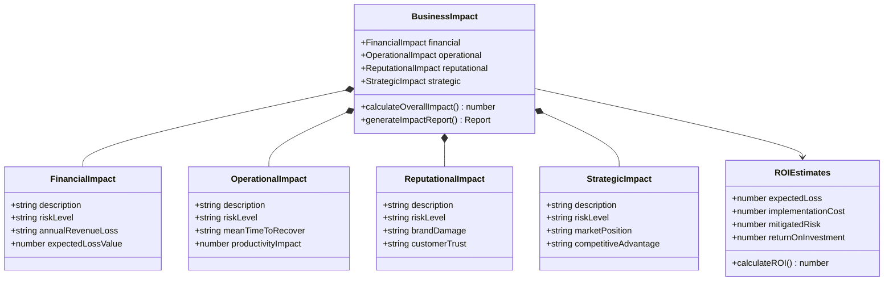

### 💰 Financial Impact Structure

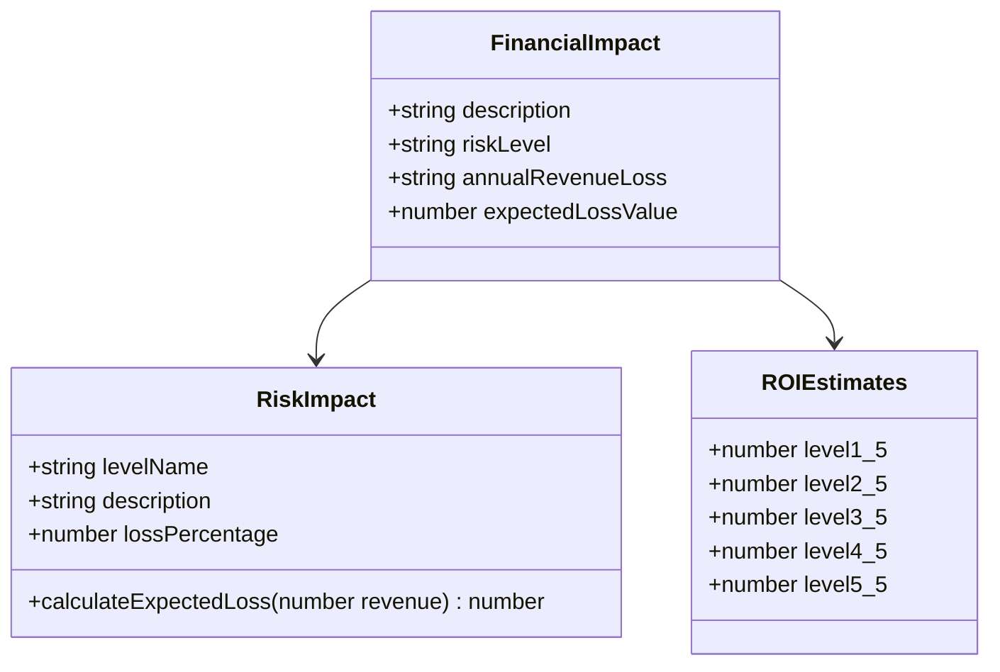

## 🔄 Value Creation Data Model

**💼 Business Focus:** Shows the data structures used to calculate and demonstrate value creation from security investments.

**📊 ROI Focus:** Illustrates how ROI and business value are calculated from security implementations.

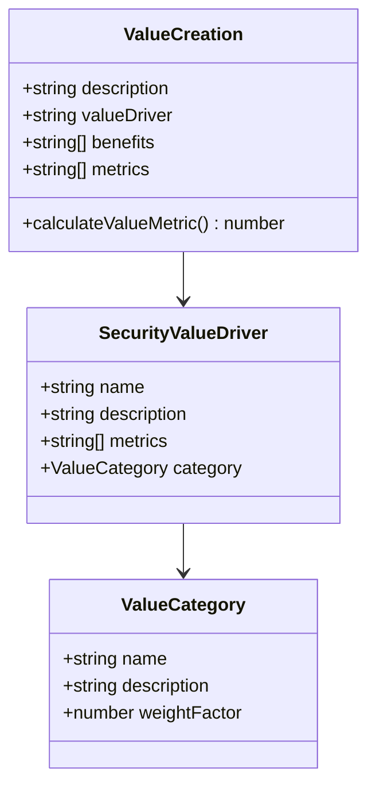

## 📋 Compliance Mapping Data Model

**🔒 Security Focus:** Illustrates how security controls are mapped to compliance frameworks.

**📋 Regulatory Focus:** Shows the data structures used for compliance tracking and gap analysis.

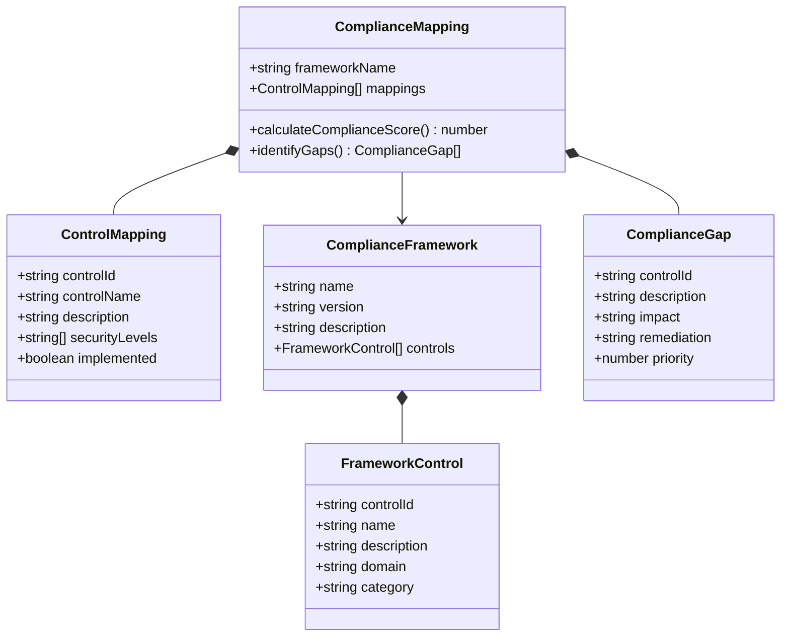

## 🔄 Data Relationships

**🔗 Integration Focus:** Shows how the different data domains relate to each other in the overall system.

**🏛️ Architecture Focus:** Illustrates the core relationships that drive the CIA Compliance Manager functionality.

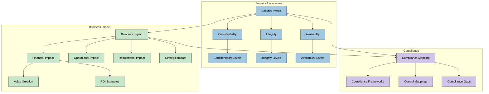

## 📊 Data Flow Diagram

**🔄 Process Focus:** Shows how data flows through the system from security assessment to business impact and compliance mapping.

**📊 Data Focus:** Illustrates the key data transformations and processing steps.

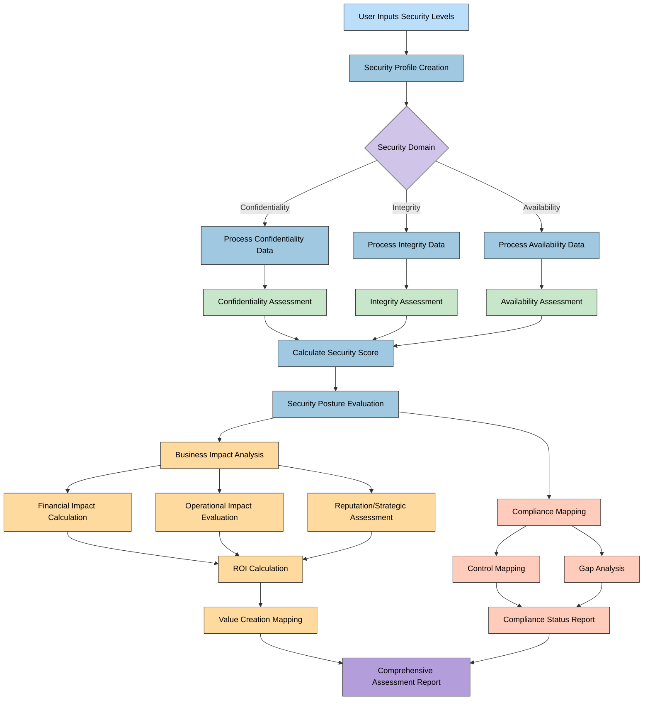

## 💾 Data Storage and Persistence

**🔧 Technical Focus:** Shows how data is stored and persisted within the application.

**📊 Implementation Focus:** Illustrates the storage mechanisms and persistence approaches.

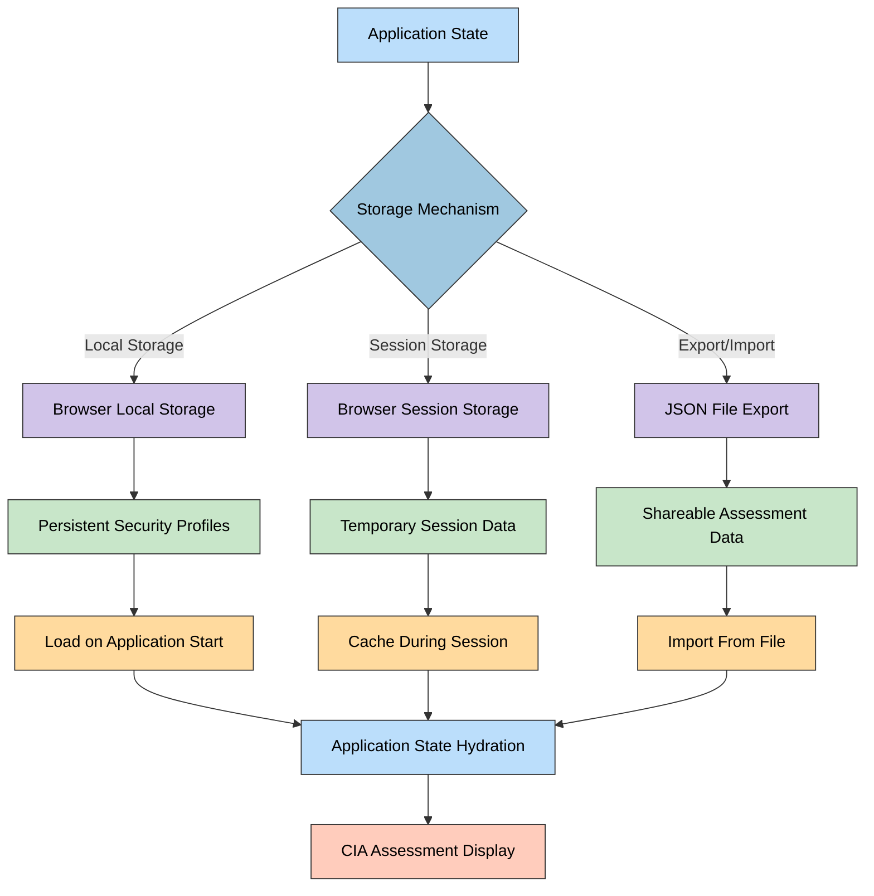

## 🧩 Key Data Model Components

| Component                     | Purpose                                                   | Related Files                                                    | Primary Interfaces          |
|------------------------------|-----------------------------------------------------------|-----------------------------------------------------------------|----------------------------|
| 🔒 CIA Security Levels       | Define security levels for confidentiality, integrity, availability | `confidentialityData.ts`, `integrityData.ts`, `availabilityData.ts` | `CIADetails` interface      |
| 💰 ROI Estimates             | Calculate return on investment for security implementations | `roiEstimatesData.ts`                                            | `ROIEstimates` interface    |
| 📊 Business Impact           | Quantify business impact of security decisions            | `riskImpactData.ts`                                             | `RiskImpact` interface      |
| 💼 Value Creation            | Map security investments to business value                 | `valueCreationData.ts`                                           | `ValueCreation` interface   |
| 🔄 CIA Options               | Expose security level options for selection               | `ciaOptionsData.ts`                                              | Various export constants    |
| 📋 Compliance Mapping        | Map security controls to compliance frameworks            | Component-specific implementation                               | `ComplianceMapping` interface |

## 🔗 Data Model Implementation Details

**🔧 Technical Focus:** Details how the data model is technically implemented in the codebase.

**💻 Code Focus:** Illustrates the key TypeScript data structures and interfaces.

```typescript
// CIA Details Interface - Core model for security level details
interface CIADetails {
    level: string;
    description: string;
    impact: string;
    technical: string;
    businessImpact: string;
    capex: number;
    opex: number;
    recommendations: string[];
}

// Business Impact Interface
interface BusinessImpactDetails {
    financialImpact: {
        description: string;
        riskLevel: string;
        annualRevenueLoss: string;
        expectedLossValue: number;
    };
    operationalImpact: {
        description: string;
        riskLevel: string;
        meanTimeToRecover: string;
        productivityImpact: number;
    };
    reputationalImpact: {
        description: string;
        riskLevel: string;
        brandDamage: string;
        customerTrust: string;
    };
    strategicImpact: {
        description: string;
        riskLevel: string;
        marketPosition: string;
        competitiveAdvantage: string;
    };
}

// Security Profile Interface
interface SecurityProfile {
    confidentialityLevel: string;
    integrityLevel: string;
    availabilityLevel: string;
    assessmentDate: Date;
    businessContext: string;
    securityScore: number;
}
```

## 🔄 Data Model Evolution

**🚀 Future Focus:** Shows how the current data model will evolve into the future context-aware model.

**🧩 Architecture Focus:** Illustrates the planned enhancements and extensions to the data model.

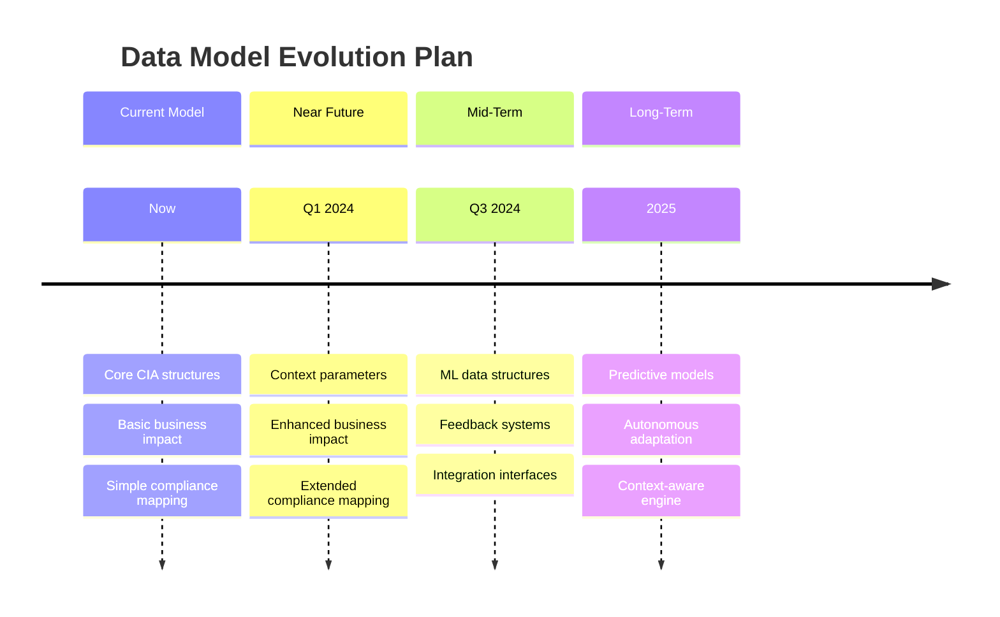

## 📈 Data Flow Between Components

**🏛️ Architecture Focus:** Shows how data flows between different components in the system.

**🔄 Process Focus:** Illustrates the key data transformations and exchange patterns.

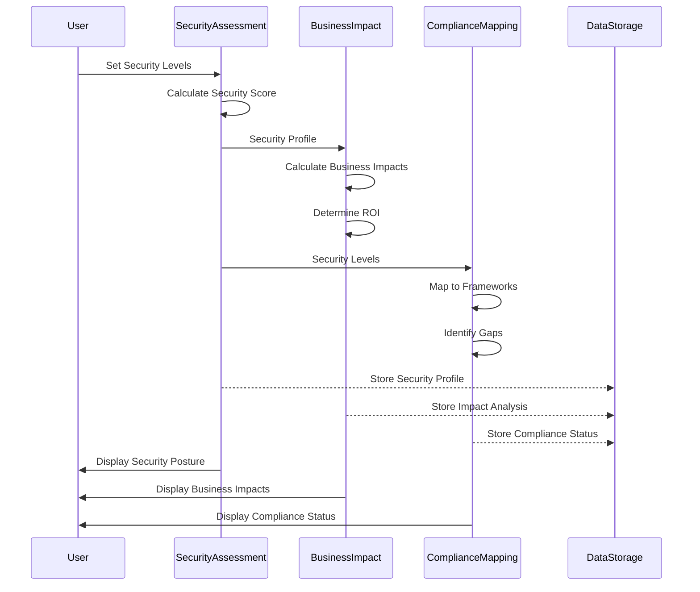

This documentation provides a comprehensive view of the current data model powering the CIA Compliance Manager. It illustrates the key structures, relationships, and implementation patterns that enable the system's security assessment, business impact analysis, and compliance mapping capabilities.
