<p align="center">
  
</p>

<h1 align="center">📊 Hack23 AB — CIA Compliance Manager Data Model</h1>

<p align="center">
  <strong>🔐 Comprehensive Type-Safe Data Architecture</strong><br>
  <em>🎯 v1.0 Data Structures and Entity Relationships</em>
</p>

<p align="center">
  <a href="#"></a>
  <a href="#"></a>
  <a href="#"></a>
  <a href="#"></a>
</p>

**📋 Document Owner:** Technical Lead | **📄 Version:** 1.0 | **📅 Last Updated:** 2025-01-22 (UTC)  
**🔄 Review Cycle:** Quarterly | **⏰ Next Review:** 2025-04-22

---

## 🎯 **Purpose Statement**

The CIA Compliance Manager data model demonstrates how **type-safe architecture creates operational excellence** through comprehensive data structure documentation. Our data types serve as both development foundation and stakeholder communication of our security assessment platform capabilities.

This document embodies our **🌟 transparency principle** - making data structures publicly verifiable while showcasing our **🏆 technical excellence** through strict TypeScript typing and **🤝 customer trust** via demonstrable data integrity.

*— James Pether Sörling, CEO/Founder*

---

## 📚 **Related Documentation**

- [🏛️ System Architecture](./SYSTEM_ARCHITECTURE.md) - Layered architecture and component details
- [🏗️ Architecture](./ARCHITECTURE.md) - C4 model showing system structure
- [🔐 Security Architecture](./SECURITY_ARCHITECTURE.md) - Security controls and implementation
- [🎯 Threat Model](./THREAT_MODEL.md) - STRIDE analysis and attack trees
- [🔄 State Diagrams](./STATEDIAGRAM.md) - System state transitions
- [🔄 Process Flowcharts](./FLOWCHART.md) - Security assessment workflows
- [🧩 Widget Analysis](./WIDGET_ANALYSIS.md) - Detailed widget component analysis
- [🚀 Future Data Model](./FUTURE_DATA_MODEL.md) - Future data architecture vision
- [🛠️ Secure Development Policy](https://github.com/Hack23/ISMS/blob/main/Secure_Development_Policy.md) - Architecture documentation requirements

---

## 🌐 **Data Model Overview**

The CIA Compliance Manager implements a comprehensive type-safe data model using TypeScript interfaces and types that define security assessments, business impacts, and compliance mappings. The v1.0 data model eliminates all `any` types and provides strict typing across 50+ interfaces supporting 36 widget components.

### **📊 Architecture Principles**

- **🔐 Type Safety**: Zero tolerance for `any` types; explicit interfaces throughout
- **🔄 Reusability**: Shared base interfaces via extension and composition
- **📋 Documentation**: JSDoc comments on all public interfaces
- **🎯 Consistency**: Standardized prop patterns across all widgets
- **🛡️ Validation**: Runtime type guards for API boundaries

---

## 🏗️ **Core Data Architecture**

### **Entity Relationship Overview**

The core data model revolves around the CIA triad (Confidentiality, Integrity, Availability) with supporting entities for business impact, compliance, and resources:


---

## 📋 **Core Type Definitions**

### **Security Levels and Components**

The foundation of the system is built on the CIA triad with five security levels:

```typescript
/**
 * Security levels available for CIA triad components
 * 
 * Location: src/types/cia.ts
 * 
 * Each level represents increasing security controls and associated costs:
 * - None: No security controls (not recommended for production)
 * - Low: Basic security controls for low-risk systems
 * - Moderate: Standard controls for typical business systems (recommended baseline)
 * - High: Enhanced controls for sensitive systems
 * - Very High: Maximum controls for critical systems
 */
export type SecurityLevel = "None" | "Low" | "Moderate" | "High" | "Very High";

/**
 * CIA triad component types
 * 
 * Location: src/types/cia.ts
 */
export type CIAComponent = 'confidentiality' | 'integrity' | 'availability';

/**
 * Risk levels derived from security level combinations
 * 
 * Location: src/types/cia.ts
 */
export type RiskLevel = 
  | "Critical"   // Severe impact requiring immediate attention
  | "High"       // Significant impact requiring prompt action
  | "Medium"     // Moderate impact for planned remediation
  | "Low"        // Minor impact with standard handling
  | "Minimal"    // Negligible impact requiring monitoring only
  | "Unknown";   // Insufficient information for assessment
```

### **Security Profile Interface**

```typescript
/**
 * Core security profile representing CIA triad selections
 * 
 * Location: src/types/cia.ts (line 324)
 * Used by: All assessment widgets, compliance service, business impact calculators
 */
export interface SecurityProfile {
  /** Selected availability security level */
  availabilityLevel: SecurityLevel;
  
  /** Selected integrity security level */
  integrityLevel: SecurityLevel;
  
  /** Selected confidentiality security level */
  confidentialityLevel: SecurityLevel;
  
  /** Overall security level (typically the highest of the three components) */
  securityLevel: SecurityLevel;
}

// Note: Security level calculations are provided by utility functions:
// - calculateOverallSecurityLevel(availability, integrity, confidentiality)
// - calculateRiskLevel(availability, integrity, confidentiality)
// See src/types/cia.ts lines 147-208
```

### **SecurityLevels Interface**

```typescript
/**
 * Alternative security profile structure (without Level suffix)
 * 
 * Location: src/types/cia.ts (line 505)
 * Used by: Service layer, data providers
 * Note: Property names differ from SecurityProfile (no "Level" suffix)
 */
export interface SecurityLevels {
  /** Selected availability security level */
  availability: SecurityLevel;
  
  /** Selected integrity security level */
  integrity: SecurityLevel;
  
  /** Selected confidentiality security level */
  confidentiality: SecurityLevel;
}
```

---

## 🔐 **CIA Details Interface**

The `CIADetails` interface provides comprehensive information about a specific security component at a given security level:

```typescript
/**
 * Detailed information for a CIA component at specific security level
 * 
 * Location: src/types/cia-services.ts (lines 231-296)
 * Used by: Content service, impact widgets, recommendation engine
 * 
 * Note: This is a simplified view. See source file for complete interface with all properties.
 */
export interface CIADetails {
  // Core descriptive fields
  /** Human-readable description of security level implications */
  description: string;
  
  /** Technical implementation details and requirements */
  technical: string;
  
  /** Business impact assessment summary */
  businessImpact: string;
  
  /** List of recommended actions and improvements (required) */
  recommendations: string[];
  
  // Financial metrics
  /** Capital expenditure */
  capex?: number;
  
  /** Operational expenditure */
  opex?: number;
  
  // Styling properties
  /** Background color */
  bg?: string;
  
  /** Text color */
  text?: string;
  
  // Business impact analysis
  /** Structured business impact details */
  businessImpactDetails?: BusinessImpactDetails;
  
  // Availability-specific metrics
  /** System uptime requirement (e.g., "99.9%", "99.99%") */
  uptime?: string;
  
  /** Recovery Time Objective - maximum tolerable downtime */
  rto?: string;
  
  /** Recovery Point Objective - maximum tolerable data loss window */
  rpo?: string;
  
  /** Mean Time To Repair */
  mttr?: string;
  
  /** Service Level Agreement target */
  sla?: string;
  
  // Integrity-specific metrics
  /** Data validation method */
  validationMethod?: string;
  
  /** Data validation level (e.g., "Checksums", "Digital Signatures") */
  validationLevel?: string;
  
  /** Acceptable error rate (e.g., "< 0.01%", "< 0.0001%") */
  errorRate?: string;
  
  // Confidentiality-specific metrics
  /** Protection method (e.g., "AES-256", "TLS 1.3") */
  protectionMethod?: string;
  
  /** Privacy impact description */
  privacyImpact?: string;
  
  // Implementation details
  /** Implementation complexity level */
  implementationComplexity?: string;
  
  /** Ongoing maintenance requirements */
  maintenanceRequirements?: string;
  
  /** Required expertise areas */
  requiredExpertise?: string;
  
  /** Control family categories */
  controlFamily?: string[];
  
  /** Applicable compliance frameworks */
  applicableFrameworks?: string[];
  
  // Business perspective and value creation
  /** Business perspective description */
  businessPerspective?: string;
  
  /** Step-by-step implementation guide */
  implementationSteps?: string[];
  
  /** Implementation effort breakdown */
  effort?: ImplementationEffort;
  
  /** Key business impact */
  keyImpact?: string;
  
  /** Security metric */
  metric?: string;
  
  /** Value creation points */
  valuePoints?: string[];
  
  /** ROI estimate */
  roiEstimate?: ROIEstimate;
  
  /** Implementation considerations */
  implementationConsiderations?: string;
  
  // Visual and compliance indicators
  /** Security icon identifier */
  securityIcon?: string;
  
  /** Compliance impact details */
  complianceImpact?: ComplianceImpact;
  
  // Implementation guidance
  /** Code examples */
  codeExamples?: CodeExample[];
  
  /** Technical implementation details */
  technicalImplementation?: TechnicalImplementationDetails;
  
  /** Required expertise level */
  expertise?: string;
  
  /** Implementation timeframe */
  timeframe?: string;
}
```

> **Note:** The complete interface includes 30+ optional properties for extensibility. See `src/types/cia-services.ts` lines 231-296 for the authoritative definition.

---

## 💼 **Business Impact Data Structures**

### **BusinessImpactDetails Interface**

```typescript
/**
 * Comprehensive business impact analysis across categories
 * 
 * Location: src/types/cia-services.ts
 * Used by: BusinessImpactAnalysisWidget, ROI calculators, risk assessments
 */
export interface BusinessImpactDetails {
  /** Overall impact summary */
  summary?: string;
  
  /** Financial impact assessment */
  financial?: BusinessImpactDetail;
  
  /** Operational impact assessment */
  operational?: BusinessImpactDetail;
  
  /** Reputational impact assessment */
  reputational?: BusinessImpactDetail;
  
  /** Regulatory/compliance impact assessment */
  regulatory?: BusinessImpactDetail;
  
  // Legacy property names for backward compatibility
  financialImpact?: BusinessImpactDetail;
  operationalImpact?: BusinessImpactDetail;
  reputationalImpact?: BusinessImpactDetail;
  strategic?: BusinessImpactDetail;
}

/**
 * Detailed impact information for a specific category
 * 
 * Location: src/types/cia-services.ts (lines 76-116)
 */
export interface BusinessImpactDetail {
  /** Impact description */
  description: string;
  
  /** Risk level (Critical, High, Medium, Low, Minimal) */
  riskLevel: string;
  
  /** Estimated annual revenue loss (e.g., "$50K-$100K") */
  annualRevenueLoss?: string;
  
  /** Mean time to recover from incidents */
  meanTimeToRecover?: string;
  
  /** List of potential compliance violations */
  complianceViolations?: string[];
  
  /** Competitive advantage implications */
  competitiveAdvantage?: string;
  
  /** Compliance impact description */
  complianceImpact?: string;
  
  /** Reputational impact description */
  reputationalImpact?: string;
}
```

### **BusinessImpact Interface (Legacy)**

```typescript
/**
 * Legacy business impact structure
 * 
 * Location: src/types/businessImpact.ts
 * Status: Maintained for backward compatibility
 */
export interface BusinessImpact {
  /** Impact category description */
  category: string;
  
  /** Severity level */
  severity: "Low" | "Medium" | "High" | "Critical";
  
  /** Detailed impact description */
  description: string;
  
  /** Service Level Agreement metrics */
  sla?: SLAMetrics;
}

/**
 * SLA metrics for business operations
 * 
 * Location: src/types/businessImpact.ts
 */
export interface SLAMetrics {
  /** Uptime percentage (e.g., 99.9) */
  uptime: number;
  
  /** Response time in milliseconds */
  responseTime: number;
  
  /** Recovery Time Objective in hours */
  rto: number;
  
  /** Recovery Point Objective in hours */
  rpo: number;
}
```

---

## 📊 **Compliance Data Structures**

### **ComplianceStatus Interface**

```typescript
/**
 * Overall compliance status assessment
 * 
 * Location: src/types/compliance.ts
 * Used by: ComplianceStatusWidget, framework mapping, reporting
 */
export interface ComplianceStatus {
  /** Overall status (Compliant, Partially Compliant, Non-Compliant) */
  status: string;
  
  /** Compliance score (0-100) */
  complianceScore: number;
  
  /** Frameworks with full compliance */
  compliantFrameworks: string[];
  
  /** Frameworks with partial compliance */
  partiallyCompliantFrameworks: string[];
  
  /** Frameworks with non-compliance */
  nonCompliantFrameworks: string[];
  
  /** Recommended remediation actions */
  recommendations: string[];
  
  /** Optional detailed framework information */
  frameworks?: ComplianceFramework[];
  
  /** Optional requirements list */
  requirements?: string[];
  
  // Additional optional properties for extended analysis
  remediationSteps?: string[];
  statusText?: string;
  frameworkName?: string;
  findings?: string[];
  metRequirements?: string[];
  unmetRequirements?: string[];
}
```

### **ComplianceFramework Interface**

```typescript
/**
 * Compliance framework definition
 * 
 * Location: src/types/compliance.ts
 * Used by: Framework service, compliance mapping
 */
export interface ComplianceFramework {
  /** Unique framework identifier */
  id: string;
  
  /** Framework display name */
  name: string;
  
  /** Framework description */
  description: string;
  
  /** Current compliance status */
  status: string;
  
  /** Required availability level for compliance */
  requiredAvailabilityLevel: SecurityLevel;
  
  /** Required integrity level for compliance */
  requiredIntegrityLevel: SecurityLevel;
  
  /** Required confidentiality level for compliance */
  requiredConfidentialityLevel: SecurityLevel;
  
  /** Applicable industries */
  applicableIndustries?: string[];
  
  /** Applicable geographic regions */
  applicableRegions?: string[];
  
  /** Specific framework requirements */
  requirements?: string[];
}

/**
 * Framework compliance status types
 * 
 * Location: src/types/compliance.ts
 */
export type FrameworkComplianceStatusType =
  | "compliant"
  | "partially-compliant"
  | "non-compliant";
```

---

## 🛡️ **Security Resources Data**

```typescript
/**
 * Security resource reference
 * 
 * Location: src/types/securityResources.ts (lines 11-101)
 * Used by: SecurityResourcesWidget, recommendation system
 */
export interface SecurityResource {
  /** Resource ID (required) */
  id: string;
  
  /** Resource title */
  title: string;
  
  /** Resource URL (required) */
  url: string;
  
  /** Resource description */
  description?: string;
  
  /** Resource type or category */
  type?: string;
  
  /** Resource tags */
  tags?: string[];
  
  /** CIA component relevance */
  component?: "availability" | "integrity" | "confidentiality" | "general";
  
  /** Security level relevance */
  level?: string;
  
  /** Resource source/provider */
  source?: string;
  
  /** Resource category */
  category?: string;
  
  /** Resource priority/relevance score (0-100) */
  priority?: number;
  
  /** Security levels this resource applies to */
  securityLevels?: string[];
  
  /** Components this resource applies to (multiple possible) */
  components?: string[];
  
  /** Levels this resource is relevant for */
  relevantLevels?: string[];
  
  /** Format of the resource (e.g., PDF, Website, Video) */
  format?: string;
  
  /** Resource relevance score */
  relevance?: number;
  
  /** Implementation complexity (1-5) */
  complexity?: number;
  
  /** Whether the resource is premium/paid */
  isPremium?: boolean;
}
```

---

## 🔧 **Technical Implementation Data**

```typescript
/**
 * Technical implementation details
 * 
 * Location: src/types/cia-services.ts (lines 151-168)
 * Used by: Implementation planning, effort estimation
 */
export interface TechnicalImplementationDetails {
  /** Implementation description */
  description: string;
  
  /** Step-by-step implementation guide */
  implementationSteps: string[];
  
  /** Effort breakdown for implementation */
  effort: {
    /** Development effort estimate (e.g., "2-4 weeks") */
    development: string;
    /** Ongoing maintenance effort */
    maintenance: string;
    /** Required expertise level */
    expertise: string;
  };
  
  /** Required expertise level (optional) */
  expertiseLevel?: string;
  
  /** Additional development effort details (optional) */
  developmentEffort?: string;
  
  /** Validation method used (optional, for integrity) */
  validationMethod?: string;
  
  /** Protection method used (optional, for confidentiality) */
  protectionMethod?: string;
  
  /** Recovery method used (optional, for availability) */
  recoveryMethod?: string;
  
  /** Extensible for additional properties */
  [key: string]: unknown;
}

/**
 * Implementation effort breakdown
 * 
 * Location: src/types/cia-services.ts
 * Note: This interface is nested within TechnicalImplementationDetails.effort
 */
export interface ImplementationEffort {
  /** Development effort estimate */
  development: string;
  
  /** Ongoing maintenance effort */
  maintenance: string;
  
  /** Required expertise level */
  expertise: string;
}
```

---

## 💰 **Cost and ROI Data Structures**

> **Note:** The `CostEstimationDetails` and `CostBreakdown` interfaces documented below do not currently exist in the v1.0 codebase. They are planned for future implementation and are documented here for reference.

```typescript
/**
 * Return on Investment estimation
 * 
 * Location: src/types/cia-services.ts
 * Status: ✅ Implemented
 * Used by: ValueCreationWidget, executive reporting
 */
export interface ROIEstimate {
  /** Break-even timeline */
  breakEvenPeriod: string;
  
  /** Annual savings estimate */
  annualSavings: string;
  
  /** ROI percentage (3-year) */
  roiPercentage: number;
  
  /** Value creation areas */
  valueCreation?: string[];
  
  /** Risk reduction benefits */
  riskReduction?: string[];
}
```

```typescript
/**
 * 📋 Planned Interfaces for Future Implementation
 * 
 * The following interfaces are planned but not yet implemented in v1.0:
 */

/**
 * Cost estimation details (PLANNED)
 * 
 * Planned Location: src/types/cia-services.ts
 * Status: 🚀 Planned for v1.x
 */
export interface CostEstimationDetails {
  /** Initial implementation cost */
  initialCost: string;
  
  /** Annual maintenance cost */
  annualCost: string;
  
  /** Total cost of ownership (3-year) */
  totalCostOfOwnership: string;
  
  /** Cost breakdown by category */
  costBreakdown?: CostBreakdown;
  
  /** ROI estimate */
  roiEstimate?: ROIEstimate;
}

/**
 * Cost breakdown by category (PLANNED)
 * 
 * Planned Location: src/types/cia-services.ts
 * Status: 🚀 Planned for v1.x
 */
export interface CostBreakdown {
  /** Infrastructure costs */
  infrastructure: string;
  
  /** Personnel costs */
  personnel: string;
  
  /** Software/licensing costs */
  software: string;
  
  /** Training costs */
  training: string;
  
  /** Other costs */
  other?: string;
}
```

---

## 🧩 **Widget Prop Architecture**

### **Base Widget Props Hierarchy**

The v1.0 architecture implements a consistent prop hierarchy for all widgets:


### **Widget Props Reference**

#### **Base Props (src/types/widget-props.ts)**

| Interface | Extends | Purpose | Key Properties |
|-----------|---------|---------|----------------|
| `CommonWidgetProps` | - | Common styling/testing | `className`, `testId` |
| `BaseWidgetProps` | `CommonWidgetProps` | Widget foundation | `children`, `onError` |
| `WithSecurityLevelProps` | - | Security level management | CIA triad levels + change handlers |
| `AllCIAComponentsProps` | `BaseWidgetProps` | Full CIA triad display | CIA triad levels (immutable) |
| `CIAComponentWidgetProps` | `BaseWidgetProps` | Single component display | `component`, `level` |
| `SecurityLevelChangeWidgetProps` | `CIAComponentWidgetProps` | Interactive selection | `onLevelChange`, `disabled` |

#### **Assessment Widget Props (src/types/widget-props.ts)**

| Interface | Purpose | Additional Properties |
|-----------|---------|---------------------|
| `SecurityLevelWidgetProps` | Security level selector widget | All CIA levels |
| `SecuritySummaryWidgetProps` | Overall security summary | All CIA levels |
| `BusinessImpactAnalysisWidgetProps` | Business impact display | All CIA levels |
| `CostEstimationWidgetProps` | Cost/ROI estimation | All CIA levels |
| `ComplianceStatusWidgetProps` | Compliance status display | All CIA levels |
| `ValueCreationWidgetProps` | Value creation analysis | All CIA levels |
| `SecurityResourcesWidgetProps` | Resource recommendations | All CIA levels |
| `SecurityVisualizationWidgetProps` | Visual dashboards | All CIA levels |

#### **CIA Component Widget Props (src/types/widget-props.ts)**

| Interface | Purpose | Component Type |
|-----------|---------|----------------|
| `AvailabilityImpactWidgetProps` | Availability impact display | Availability-specific |
| `IntegrityImpactWidgetProps` | Integrity impact display | Integrity-specific |
| `ConfidentialityImpactWidgetProps` | Confidentiality impact display | Confidentiality-specific |

---

## 🎨 **Component Prop Exports**

### **Common Components (src/types/componentPropExports.ts)**

#### **Display Components**

| Interface | Purpose | Key Properties |
|-----------|---------|----------------|
| `BusinessImpactSectionProps` | Section header display | `title`, `description`, `icon` |
| `BusinessRiskDisplayProps` | Risk level display | `riskLevel`, `description`, `showIcon` |
| `CIAImpactCardProps` | Impact card component | `title`, `icon`, `value`, `impact` |
| `KeyValuePairProps` | Key-value display | `label`, `value` |
| `MetricsCardProps` | Metrics card display | `title`, `value`, `icon`, `description` |

#### **Badge Components**

| Interface | Purpose | Key Properties |
|-----------|---------|----------------|
| `RiskLevelBadgeProps` | Risk level badge | `level`, `showIcon` |
| `SecurityLevelBadgeProps` | Security level badge | `level`, `category`, `showIcon` |
| `StatusBadgeProps` | Generic status badge | `status`, `variant`, `icon` |

#### **Assessment Components**

| Interface | Purpose | Key Properties |
|-----------|---------|----------------|
| `RiskAssessmentProps` | Risk assessment display | `riskLevel`, `recommendations` |
| `SecurityRiskScoreProps` | Risk score display | `score`, `level`, `description` |
| `SecurityLevelSummaryItemProps` | Summary item display | `label`, `value`, `icon`, `color` |

#### **Utility Components**

| Interface | Purpose | Key Properties |
|-----------|---------|----------------|
| `CodeBlockProps` | Code display | `code`, `language`, `showLineNumbers` |
| `TooltipProps` | Tooltip display | `content`, `position`, `children` |
| `TabProps` | Tab component | `label`, `content`, `icon` |
| `ThemeToggleProps` | Theme switcher | `theme`, `onThemeChange` |

#### **Chart Components**

| Interface | Purpose | Key Properties |
|-----------|---------|----------------|
| `RadarChartProps` | Radar chart visualization | `data`, `dimensions`, `labels` |

#### **Widget Structure Components**

| Interface | Purpose | Key Properties |
|-----------|---------|----------------|
| `WidgetHeaderProps` | Widget header | `title`, `subtitle`, `icon` |
| `WidgetActionsProps` | Widget actions | `actions` |
| `WidgetActionButtonProps` | Action button | `label`, `onClick`, `icon` |
| `WidgetContainerProps` | Widget container | `children`, `loading`, `error` |

#### **Selection Components**

| Interface | Purpose | Key Properties |
|-----------|---------|----------------|
| `SecurityLevelSelectorProps` | Level selector | `value`, `onChange`, `component` |
| `SelectionProps` | Generic selection | `options`, `value`, `onChange` |
| `SecurityLevelChangeTrackerProps` | Change tracking | `component`, `previousLevel`, `newLevel` |

#### **State Management**

| Interface | Purpose | Key Properties |
|-----------|---------|----------------|
| `SecurityLevelContextType` | Context type definition | CIA levels + handlers |
| `SecurityLevelProviderProps` | Provider props | `children`, initial levels |
| `UseSecurityLevelStateOptions` | Hook options | Configuration options |

#### **Error & Loading States**

| Interface | Purpose | Key Properties |
|-----------|---------|----------------|
| `ErrorMessageProps` | Error display | `message`, `details`, `onRetry` |
| `LoadingSpinnerProps` | Loading spinner | `size`, `color`, `text` |
| `LoadingSkeletonProps` | Skeleton loader | `variant`, `width`, `height` |
| `WidgetErrorBoundaryProps` | Error boundary | `children`, `fallback` |

---

## 📡 **Service Layer Interfaces**

### **CIA Content Service**

```typescript
/**
 * CIA content service interface
 * 
 * Location: src/services/ciaContentService.ts
 * Status: Implemented ✅
 * Provides: Security level content and recommendations
 */
interface CIAContentService {
  /** Get details for confidentiality level */
  getConfidentialityDetails(level: SecurityLevel): CIADetails;
  
  /** Get details for integrity level */
  getIntegrityDetails(level: SecurityLevel): CIADetails;
  
  /** Get details for availability level */
  getAvailabilityDetails(level: SecurityLevel): CIADetails;
  
  /** Get all supported frameworks */
  getSupportedFrameworks(): string[];
  
  /** Get framework-specific details */
  getFrameworkDetails(framework: string): ComplianceFramework;
  
  /** Get security resources for component/level */
  getSecurityResources(
    component: CIAComponent,
    level: SecurityLevel
  ): SecurityResource[];
}
```

### **Compliance Service**

```typescript
/**
 * Compliance service interface
 * 
 * Location: src/services/complianceService.ts
 * Status: Implemented ✅
 * Provides: Compliance assessment and framework mapping
 * 
 * Note: This is a class implementation, not an interface. Main public methods shown below.
 */
interface ComplianceService {
  /**
   * Get compliance status for given security levels
   * 
   * Actual method signature:
   * getComplianceStatus(
   *   availabilityLevel: SecurityLevel,
   *   integrityLevel: SecurityLevel,
   *   confidentialityLevel: SecurityLevel
   * ): ComplianceStatusDetails
   */
  getComplianceStatus(
    availabilityLevel: SecurityLevel,
    integrityLevel: SecurityLevel,
    confidentialityLevel: SecurityLevel
  ): ComplianceStatusDetails;
  
  /**
   * Get compliance gap analysis
   * 
   * Actual method signature:
   * getComplianceGapAnalysis(
   *   availabilityLevel: SecurityLevel,
   *   integrityLevel: SecurityLevel,
   *   confidentialityLevel: SecurityLevel,
   *   frameworks?: string[]
   * ): ComplianceGapAnalysis
   */
  getComplianceGapAnalysis(
    availabilityLevel: SecurityLevel,
    integrityLevel: SecurityLevel,
    confidentialityLevel: SecurityLevel,
    frameworks?: string[]
  ): ComplianceGapAnalysis;
}

/**
 * Compliance status details returned by getComplianceStatus
 * 
 * Location: src/services/complianceService.ts (lines 21-29)
 */
interface ComplianceStatusDetails {
  status: string;
  compliantFrameworks: string[];
  partiallyCompliantFrameworks: string[];
  nonCompliantFrameworks: string[];
  remediationSteps?: string[];
  requirements?: string[];
  complianceScore: number;
}
```

### **Business Impact Service**

```typescript
/**
 * Business impact service interface
 * 
 * Location: src/services/businessImpactService.ts
 * Status: Implemented ✅
 * Provides: Business impact analysis and ROI calculation
 */
interface BusinessImpactService {
  /** Calculate business impact for profile */
  calculateBusinessImpact(profile: SecurityProfile): BusinessImpactDetails;
  
  /** Estimate implementation costs */
  estimateCosts(profile: SecurityProfile): CostEstimationDetails;
  
  /** Calculate ROI estimate */
  calculateROI(
    currentProfile: SecurityProfile,
    targetProfile: SecurityProfile
  ): ROIEstimate;
  
  /** Get value creation opportunities */
  getValueCreation(profile: SecurityProfile): string[];
}
```

### **Security Metrics Service**

```typescript
/**
 * Security metrics service interface
 * 
 * Location: src/services/securityMetricsService.ts
 * Status: Implemented ✅
 * Provides: Security scoring and metrics calculation
 */
interface SecurityMetricsService {
  /** Calculate overall security score (0-100) */
  calculateSecurityScore(profile: SecurityProfile): number;
  
  /** Calculate risk score */
  calculateRiskScore(profile: SecurityProfile): number;
  
  /** Get security metrics dashboard data */
  getMetricsDashboard(profile: SecurityProfile): SecurityMetrics;
}

/**
 * Security metrics dashboard data
 * 
 * Location: src/services/securityMetricsService.ts
 */
interface SecurityMetrics {
  /** Overall security score */
  securityScore: number;
  
  /** Overall risk level */
  riskLevel: RiskLevel;
  
  /** Compliance score */
  complianceScore: number;
  
  /** Business value score */
  valueScore: number;
  
  /** Recommended improvements */
  recommendations: string[];
}
```

---

## 🔄 **Data Provider Pattern**

The application uses a provider pattern to abstract data sources:

```typescript
/**
 * CIA data provider interface
 * 
 * Location: src/services/dataProviders.ts
 * Implements: Strategy pattern for data sourcing
 */
interface CIADataProvider {
  /** Get confidentiality options map */
  getConfidentialityOptions(): Record<SecurityLevel, CIADetails>;
  
  /** Get integrity options map */
  getIntegrityOptions(): Record<SecurityLevel, CIADetails>;
  
  /** Get availability options map */
  getAvailabilityOptions(): Record<SecurityLevel, CIADetails>;
  
  /** Get supported frameworks list */
  getSupportedFrameworks(): string[];
  
  /** Get framework details by ID */
  getFrameworkDetails(framework: string): ComplianceFramework;
  
  /** Get security resources for component and level */
  getSecurityResources(
    component: CIAComponent,
    level: SecurityLevel
  ): SecurityResource[];
}
```

### **Provider Implementation Diagram**


---

## 🔄 **Data Flow Architecture**

### **State Management Pattern**

```mermaid
flowchart TD
    Start[🚀 User Interaction] --> Selection[🎯 Security Level Selection]
    Selection --> State[📊 Component State Update]
    State --> Provider[🔌 Data Provider Query]
    Provider --> Service[⚙️ Service Layer Processing]
    Service --> Transform[🔄 Data Transformation]
    Transform --> Widgets[🧩 Widget Update]
    Widgets --> Display[📱 UI Render]
    
    Provider --> Cache{💾 Cache?}
    Cache -->|Hit| Transform
    Cache -->|Miss| Fetch[📡 Fetch Data]
    Fetch --> Cache
    
    classDef user fill:#3498db,stroke:#2980b9,stroke-width:2px,color:#fff
    classDef state fill:#2ecc71,stroke:#27ae60,stroke-width:2px,color:#fff
    classDef service fill:#9b59b6,stroke:#8e44ad,stroke-width:2px,color:#fff
    classDef data fill:#e74c3c,stroke:#c0392b,stroke-width:2px,color:#fff
    classDef ui fill:#f39c12,stroke:#e67e22,stroke-width:2px,color:#fff
    
    class Start,Selection user
    class State,Cache state
    class Provider,Service service
    class Fetch,Transform data
    class Widgets,Display ui
```



### **Hook-Based State Management**

The application uses React hooks for state management (no Context API):

```typescript
/**
 * CIA data provider hook
 * 
 * Location: src/hooks/useCIADataProvider.ts (lines 9-54)
 * Provides: Access to the CIA data provider instance and state
 */
function useCIADataProvider(): {
  /** The CIA data provider instance (implements CIADataProvider), or null if not loaded */
  dataProvider: CIADataProvider | null;
  
  /** Error state */
  error: Error | null;
  
  /** Loading state */
  isLoading: boolean;
  
  /** Refreshes the data provider (reloads data) */
  refreshDataProvider: () => Promise<void>;
}
```

> **Note:** The hook returns the raw `dataProvider` object which implements the `CIADataProvider` interface. To use it, access methods like `dataProvider.getConfidentialityOptions()`, `dataProvider.getIntegrityOptions()`, etc.

---

## 💾 **Local Storage Schema**

The application persists user selections in local storage:

```typescript
/**
 * Local storage key constants
 * 
 * Locations:
 *   - src/constants/appConstants.ts (lines 431-436)
 *   - src/constants/coreConstants.ts (lines 291-295)
 */
const STORAGE_KEYS = {
  /** Theme preference key */
  THEME: 'cia-theme',

  /** Security levels key */
  SECURITY_LEVELS: 'cia-security-levels',

  /** Dashboard layout key */
  DASHBOARD_LAYOUT: 'cia-dashboard-layout',

  /** User preferences key */
  USER_PREFERENCES: 'cia-user-preferences',

  /** Manager settings key */
  SETTINGS: 'cia-manager-settings',

  /** Selected levels key */
  SELECTED_LEVELS: 'cia-manager-levels',

  /** Last visit key */
  LAST_VISIT: 'cia-manager-last-visit',
} as const;
```

> **Note:** The `StoredSecurityProfile` and `UserPreferences` interfaces shown in earlier versions do not exist in the v1.0 codebase. Local storage implementation uses the keys above with flexible data structures.

---

## 🛡️ **Type Guards and Validation**

### **Runtime Type Validation**

```typescript
/**
 * Type guard for SecurityLevel
 * 
 * Location: src/types/cia.ts
 * Usage: Runtime validation of security level values
 */
export function isSecurityLevel(value: unknown): value is SecurityLevel {
  return (
    typeof value === 'string' &&
    ['None', 'Low', 'Moderate', 'High', 'Very High'].includes(value)
  );
}

/**
 * Type guard for CIAComponent
 * 
 * Location: src/types/cia-services.ts
 * Usage: Runtime validation of CIA component types
 */
export function isCIAComponentType(value: unknown): value is CIAComponent {
  return (
    typeof value === 'string' &&
    ['confidentiality', 'integrity', 'availability'].includes(value)
  );
}

/**
 * Validate security profile structure
 * 
 * Location: src/utils/typeGuards.ts
 * Usage: Validate external data (API, local storage)
 */
export function isSecurityProfile(value: unknown): value is SecurityProfile {
  if (typeof value !== 'object' || value === null) {
    return false;
  }
  
  const profile = value as Partial<SecurityProfile>;
  
  return (
    isSecurityLevel(profile.availabilityLevel) &&
    isSecurityLevel(profile.integrityLevel) &&
    isSecurityLevel(profile.confidentialityLevel)
  );
}
```

---

## 🔄 **Data Transformation Flows**

### **Assessment Data Flow**


### **Compliance Assessment Flow**


---

## 📊 **Entity Count Summary**

### **Type Definitions**

| Category                | Verified Count | Planned | Files                        |
|------------------------|---------------|---------|------------------------------|
| **Core Types**         | 13            | 2       | `cia.ts`, `cia-services.ts`  |
| **Widget Props**       | 19            | 0       | `widget-props.ts`            |
| **Component Props**    | 30            | 0       | `componentPropExports.ts`    |
| **Legacy Widget Types**| 15            | 0       | `widgets.ts`                 |
| **Business Impact**    | 5             | 0       | `businessImpact.ts`          |
| **Compliance**         | 8             | 0       | `compliance.ts`              |
| **Risk**               | 4             | 0       | `risk.ts`                    |
| **Security Resources** | 2             | 0       | `securityResources.ts`       |
| **Total Interfaces**   | **96**        | **2**   | **8 files**                  |

> **Note:** The counts above reflect verified, implemented interfaces as of v1.0. Planned interfaces (`CostEstimationDetails`, `CostBreakdown`) are listed separately and marked as 🚀 Planned for v1.x. Some interfaces like `SecurityResource`, `TechnicalImplementationDetails`, and `CIADetails` have been updated to match actual implementation. Please refer to the respective type files for the most current definitions.

### **Widget Components**

| Category | Count | Location |
|----------|-------|----------|
| **Assessment Widgets** | 8 | `src/components/widgets/` |
| **CIA Component Widgets** | 3 | `src/components/widgets/` |
| **Chart Widgets** | 5 | `src/components/charts/` |
| **Common Components** | 20+ | `src/components/common/` |
| **Total Components** | **36** | **3 directories** |

---

## 🔐 **Compliance Framework Mapping**

### **ISO 27001:2022 Alignment**

| Control | Data Model Implementation | Evidence |
|---------|-------------------------|----------|
| **A.8.3** Asset Handling | `SecurityProfile`, `CIADetails` | Type-safe asset classification |
| **A.8.10** Information Deletion | Local storage schema versioning | Data migration support |
| **A.8.11** Data Masking | `confidentialityLevel` mapping | Privacy level controls |
| **A.8.12** Data Leakage Prevention | Type guards, validation | Runtime type checking |

### **NIST CSF 2.0 Alignment**

| Function | Category | Implementation |
|----------|----------|----------------|
| **Identify** | ID.AM-5 | `SecurityResource`, `CIADetails` |
| **Protect** | PR.DS-1 | `SecurityLevel` typing, encryption references |
| **Detect** | DE.CM-1 | `ComplianceStatus`, gap detection |
| **Respond** | RS.AN-1 | `BusinessImpactDetails`, impact analysis |
| **Recover** | RC.RP-1 | `rto`, `rpo` properties in `CIADetails` |

### **CIS Controls v8.1 Alignment**

| Control | Safeguard | Implementation |
|---------|-----------|----------------|
| **1.1** | Asset Inventory | `SecurityProfile`, `CIAData` |
| **3.3** | Data Classification | `SecurityLevel`, `CIAComponent` |
| **4.1** | Configuration Management | `TechnicalImplementationDetails` |
| **5.1** | Account Management | `SecurityLevels`, access level tracking |

---

## 📚 **Cross-Reference Index**

### **Type Definition Files**

| File | Purpose | Key Exports | Lines |
|------|---------|-------------|-------|
| `src/types/cia.ts` | Core CIA types | `SecurityLevel`, `CIAComponent`, type guards | 300+ |
| `src/types/cia-services.ts` | Service interfaces | `CIADetails`, `BusinessImpactDetails`, `TechnicalImplementationDetails` | 400+ |
| `src/types/widget-props.ts` | Widget prop interfaces | 19 widget prop types | 820 |
| `src/types/componentPropExports.ts` | Component props | 30 component prop types | 364 |
| `src/types/widgets.ts` | Legacy widget types | Widget-specific interfaces | 500 |
| `src/types/compliance.ts` | Compliance types | `ComplianceStatus`, `ComplianceFramework` | 150+ |
| `src/types/businessImpact.ts` | Business impact | `BusinessImpact`, `SLAMetrics` | 100+ |
| `src/types/securityResources.ts` | Resources | `SecurityResource` | 50+ |

### **Service Layer Files**

| File | Purpose | Key Exports |
|------|---------|-------------|
| `src/services/ciaContentService.ts` | CIA content provider | Content retrieval methods |
| `src/services/complianceService.ts` | Compliance assessment | Framework evaluation |
| `src/services/businessImpactService.ts` | Impact analysis | ROI calculation |
| `src/services/securityMetricsService.ts` | Metrics calculation | Security scoring |
| `src/services/dataProviders.ts` | Data provider pattern | `CIADataProvider` interface |

### **Hook Files**

| File | Purpose | Key Exports |
|------|---------|-------------|
| `src/hooks/useCIADataProvider.ts` | Data provider hook | `useCIADataProvider` |
| `src/hooks/useSecurityLevel.ts` | Security level management | State management |

---

## 🚀 **Future Data Model Evolution**

For planned enhancements to the data model, see:
- **[Future Data Model](./FUTURE_DATA_MODEL.md)** - ML-enhanced data structures
- **[Future Architecture](./FUTURE_ARCHITECTURE.md)** - Context-aware platform vision

---

## 📋 **Related Documents**

- [🏛️ System Architecture](./SYSTEM_ARCHITECTURE.md) - Layered architecture and components
- [🏗️ Architecture](./ARCHITECTURE.md) - C4 model system structure
- [🔐 Security Architecture](./SECURITY_ARCHITECTURE.md) - Security controls
- [🎯 Threat Model](./THREAT_MODEL.md) - STRIDE analysis
- [🔄 State Diagrams](./STATEDIAGRAM.md) - State transitions
- [🔄 Flowcharts](./FLOWCHART.md) - Process workflows
- [🧩 Widget Analysis](./WIDGET_ANALYSIS.md) - Widget components
- [🚀 Future Data Model](./FUTURE_DATA_MODEL.md) - Evolution roadmap
- [🛠️ Secure Development Policy](https://github.com/Hack23/ISMS/blob/main/Secure_Development_Policy.md) - Development requirements
- [🏷️ Classification Framework](https://github.com/Hack23/ISMS/blob/main/CLASSIFICATION.md) - Data classification standards

---

**📋 Document Control:**  
**✅ Approved by:** Technical Lead  
**📤 Distribution:** Public  
**🏷️ Classification:** [](https://github.com/Hack23/ISMS/blob/main/CLASSIFICATION.md#confidentiality-levels)  
**📅 Effective Date:** 2025-01-22  
**⏰ Next Review:** 2025-04-22  
**🎯 Framework Compliance:** [](https://github.com/Hack23/ISMS/blob/main/CLASSIFICATION.md) [](https://github.com/Hack23/ISMS/blob/main/CLASSIFICATION.md) [](https://github.com/Hack23/ISMS/blob/main/CLASSIFICATION.md)
