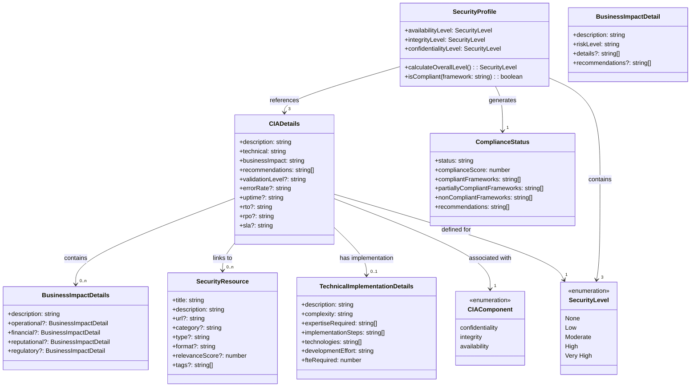
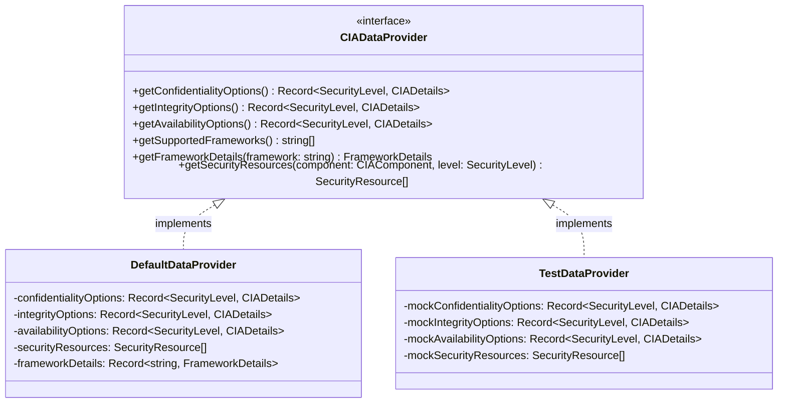
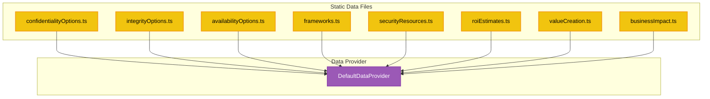

# 📊 CIA Compliance Manager Data Model

This document outlines the data structures and relationships that form the foundation of the CIA Compliance Manager, illustrating how different data entities are organized and interact with each other.

## 📚 Related Documentation

<div class="documentation-map">

| Document                                            | Focus           | Description                               |
| --------------------------------------------------- | --------------- | ----------------------------------------- |
| **[System Architecture](SYSTEM_ARCHITECTURE.md)**   | 🏛️ System       | Layered architecture and component details |
| **[Architecture](ARCHITECTURE.md)**                 | 🏗️ C4 Model     | C4 model showing system structure          |
| **[State Diagrams](STATEDIAGRAM.md)**               | 🔄 Behavior     | System state transitions                   |
| **[Process Flowcharts](FLOWCHART.md)**              | 🔄 Process      | Security assessment workflows              |
| **[Widget Analysis](WIDGET_ANALYSIS.md)**           | 🧩 Components   | Detailed widget component analysis         |
| **[Future Data Model](FUTURE_DATA_MODEL.md)**       | 🚀 Evolution    | Future data architecture vision            |

</div>

## 🌐 Data Model Overview

The CIA Compliance Manager uses a TypeScript-based data model with interfaces and types that define the structure of security assessments, business impacts, and compliance mappings. The diagram below illustrates the key data entities and their relationships:



## 📋 Core Data Types

### Security Levels and Components

The foundation of the system is built on the CIA triad (Confidentiality, Integrity, Availability) security components and their corresponding security levels:

```typescript
// Security Components
type CIAComponent = 'confidentiality' | 'integrity' | 'availability';

// Security Levels
type SecurityLevel = 'None' | 'Low' | 'Moderate' | 'High' | 'Very High';
```

These types are used throughout the application to represent security capabilities and requirements.

### Security Profile

A security profile represents the selected security levels for each CIA component:

```typescript
interface SecurityProfile {
  availabilityLevel: SecurityLevel;
  integrityLevel: SecurityLevel;
  confidentialityLevel: SecurityLevel;
}
```

### CIA Details

The `CIADetails` interface provides information about a specific security component at a given security level:

```typescript
interface CIADetails {
  description: string;
  technical: string;
  businessImpact: string;
  recommendations: string[];
  
  // Component-specific details
  validationLevel?: string;  // For integrity
  errorRate?: string;        // For integrity
  uptime?: string;           // For availability
  rto?: string;              // For availability
  rpo?: string;              // For availability
  privacyImpact?: string;    // For confidentiality
  protectionMethod?: string; // For confidentiality
}
```

### Business Impact

Business impact details reflect how security levels affect different aspects of business operations:

```typescript
interface BusinessImpactDetails {
  description: string;
  operational?: BusinessImpactDetail;
  financial?: BusinessImpactDetail;
  reputational?: BusinessImpactDetail;
  regulatory?: BusinessImpactDetail;
}

interface BusinessImpactDetail {
  description: string;
  riskLevel: string;
  details?: string[];
  recommendations?: string[];
}
```

### Compliance Status

Compliance status represents how well the selected security levels meet various regulatory frameworks:

```typescript
interface ComplianceStatus {
  status: string;
  complianceScore: number;
  compliantFrameworks: string[];
  partiallyCompliantFrameworks: string[];
  nonCompliantFrameworks: string[];
  recommendations: string[];
}
```

## 📊 Data Provider Model

The application uses a data provider interface to abstract the source of CIA-related data:



This provider pattern allows for different data sources to be used (such as static files for the current implementation, or potentially a database in the future) without changing the service layer code.

## 🗃️ Static Data Structure

The current implementation uses static TypeScript files as the data source:



## 📄 File Organization

The data files are organized in the following structure:

```
/docs
  /architecture
    SYSTEM_ARCHITECTURE.md
    ARCHITECTURE.md
    STATEDIAGRAM.md
    FLOWCHART.md
    WIDGET_ANALYSIS.md
    FUTURE_DATA_MODEL.md
  /data
    confidentialityOptions.ts
    integrityOptions.ts
    availabilityOptions.ts
    businessImpactData.ts
    riskImpactData.ts
    frameworks.ts
    complianceMapping.ts
    securityResources.ts
    technicalImplementation.ts
```

- **Architecture Documents**: Describe the overall system architecture and data flow.
- **Data Files**: Contain the actual data used by the application, organized by type and purpose.
