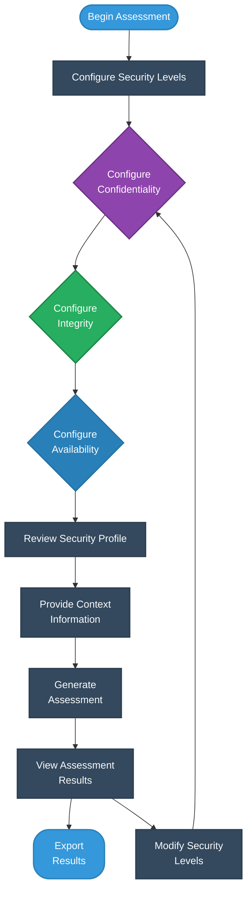
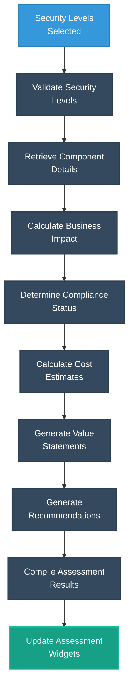
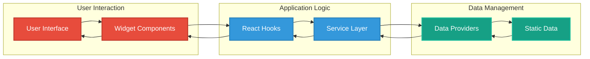

# 🔄 CIA Compliance Manager Process Flowcharts

This document illustrates the key processes and workflows within the CIA Compliance Manager application, showing how different components interact to deliver security assessment capabilities.

## 📚 Related Documentation

<div class="documentation-map">

| Document                                          | Focus           | Description                               |
| ------------------------------------------------- | --------------- | ----------------------------------------- |
| **[System Architecture](SYSTEM_ARCHITECTURE.md)** | 🏛️ System       | Layered architecture and component details |
| **[Architecture](ARCHITECTURE.md)**               | 🏗️ C4 Model     | C4 model showing system structure          |
| **[State Diagrams](STATEDIAGRAM.md)**             | 🔄 Behavior     | System state transitions                   |

</div>

## 🔍 Security Level Configuration Process

The following flowchart illustrates the process of configuring security levels and generating assessments:



## 🔄 Assessment Generation Process

This flowchart details how the system generates assessments based on selected security levels:



## 🔄 Data Flow Process

This flowchart shows how data flows through the application components:



## 🧪 Testing Process

This flowchart illustrates the testing process for the application:

```mermaid
flowchart TD
    CodeChange[Code Change] --> UnitTests[Run Unit Tests]
    UnitTests --> IntegrationTests[Run Integration Tests]
    IntegrationTests --> UITests[Run UI Tests]
    UITests --> CoverageMeasurement[Measure Code Coverage]
    CoverageMeasurement --> Adequate{Coverage<br>Adequate?}
    Adequate -->|Yes| MergeCode[Merge Code]
    Adequate -->|No| AddTests[Add More Tests]
    AddTests --> UnitTests
    
    %% Apply styles using class definitions
    classDef start fill:#3498db,stroke:#2980b9,stroke-width:2px,color:white
    classDef process fill:#34495e,stroke:#2c3e50,stroke-width:2px,color:white
    classDef decision fill:#9b59b6,stroke:#8e44ad,stroke-width:2px,color:white
    classDef end fill:#16a085,stroke:#1abc9c,stroke-width:2px,color:white
    
    class CodeChange start
    class UnitTests,IntegrationTests,UITests,CoverageMeasurement,AddTests process
    class Adequate decision
    class MergeCode end
```

## 🔍 Widget Component Interaction

This flowchart shows how different widget components interact:

```mermaid
flowchart TD
    SLW[Security Level Widget] --> SSW[Security Summary Widget]
    SLW --> BIAW[Business Impact Widget]
    SLW --> CIA[CIA Component Widgets]
    SLW --> BV[Business Value Widgets]
    SLW --> IG[Implementation Guide Widgets]
    
    subgraph "CIA Components"
        CIA --> CIW[Confidentiality Impact]
        CIA --> IIW[Integrity Impact]
        CIA --> AIW[Availability Impact]
    end
    
    subgraph "Business Value"
        BV --> CSW[Compliance Status]
        BV --> CEW[Cost Estimation]
        BV --> VCW[Value Creation]
    end
    
    subgraph "Implementation Guide"
        IG --> TDW[Technical Details]
        IG --> SRW[Security Resources]
        IG --> SVW[Security Visualization]
    end
    
    %% Apply styles using class definitions
    classDef core fill:#e74c3c,stroke:#c0392b,stroke-width:2px,color:white
    classDef assessment fill:#3498db,stroke:#2980b9,stroke-width:2px,color:white
    classDef cia fill:#9b59b6,stroke:#8e44ad,stroke-width:2px,color:white
    classDef business fill:#f1c40f,stroke:#f39c12,stroke-width:2px,color:black
    classDef implementation fill:#16a085,stroke:#1abc9c,stroke-width:2px,color:white
    classDef confidentiality fill:#8e44ad,stroke:#6c3483,stroke-width:2px,color:white
    classDef integrity fill:#27ae60,stroke:#1e8449,stroke-width:2px,color:white
    classDef availability fill:#2980b9,stroke:#2471a3,stroke-width:2px,color:white
    
    class SLW core
    class SSW,BIAW assessment
    class CIA,CIW,IIW,AIW cia
    class BV,CSW,CEW,VCW business
    class IG,TDW,SRW,SVW implementation
```



These flowcharts provide a clear visualization of the key processes and component interactions within the CIA Compliance Manager application, helping team members understand how the system operates.
