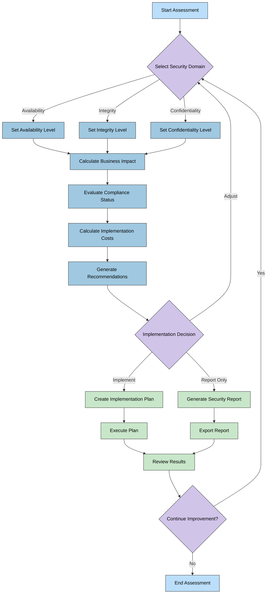
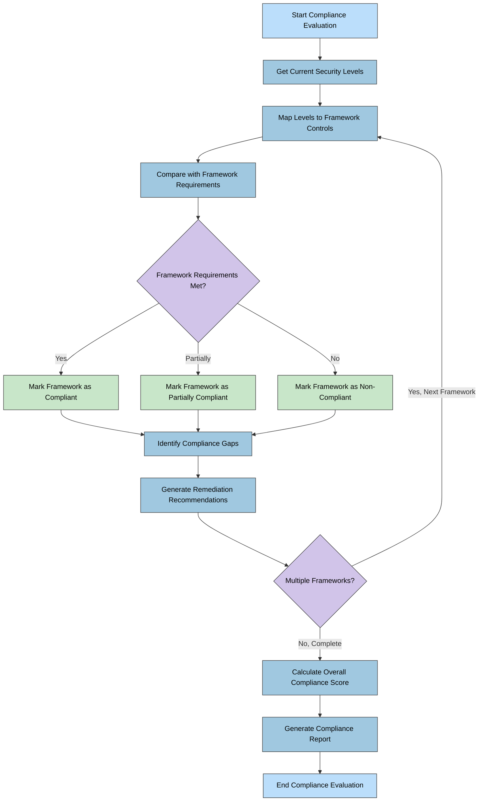
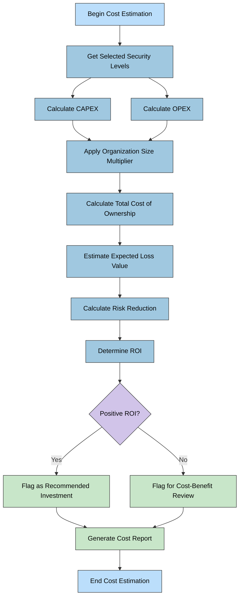
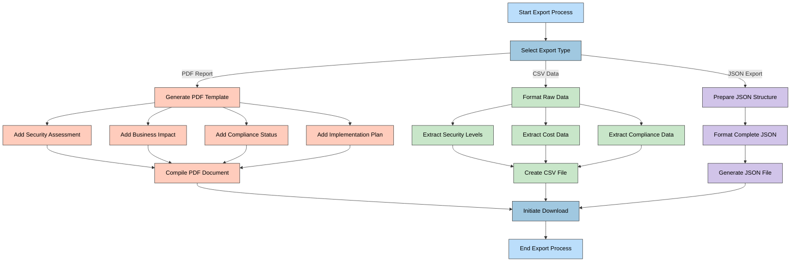
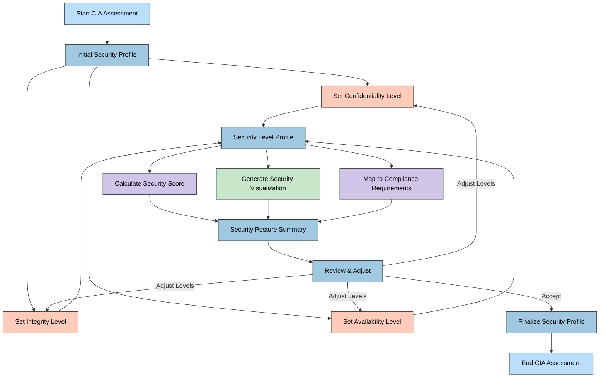
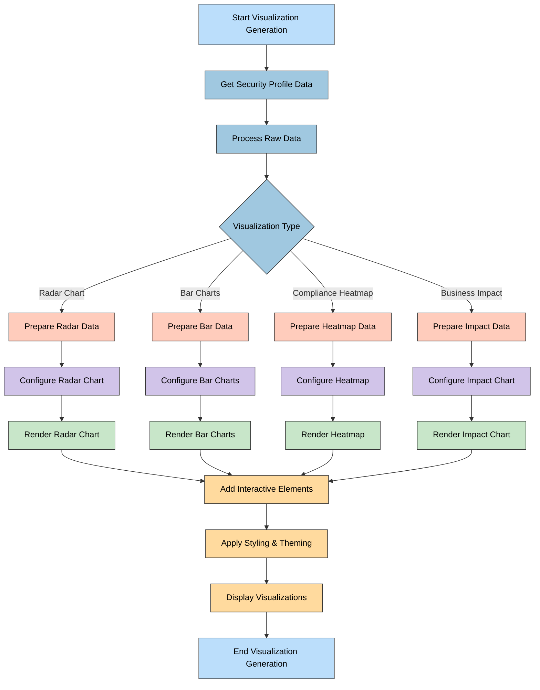
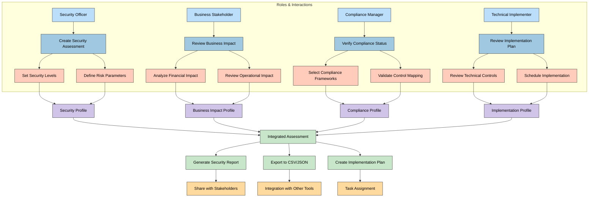

# CIA Compliance Manager Flowcharts

This document contains flowcharts that illustrate key processes within the CIA Compliance Manager.

## 📚 Related Architecture Documentation

| Document                                            | Focus           | Description                               |
| --------------------------------------------------- | --------------- | ----------------------------------------- |
| **[Current Architecture](ARCHITECTURE.md)**         | 🏛️ Architecture | C4 model showing current system structure |
| **[Future Architecture](FUTURE_ARCHITECTURE.md)**   | 🏛️ Architecture | Vision for context-aware platform         |
| **[State Diagrams](STATEDIAGRAM.md)**               | 🔄 Behavior     | Current system state transitions          |
| **[Future State Diagrams](FUTURE_STATEDIAGRAM.md)** | 🔄 Behavior     | Enhanced adaptive state transitions       |
| **[Future Flowcharts](FUTURE_FLOWCHART.md)**        | 🔄 Process      | Enhanced context-aware workflows          |
| **[Mindmaps](MINDMAP.md)**                          | 🧠 Concept      | Current system component relationships    |
| **[Future Mindmaps](FUTURE_MINDMAP.md)**            | 🧠 Concept      | Future capability evolution               |
| **[SWOT Analysis](SWOT.md)**                        | 💼 Business     | Current strategic assessment              |
| **[Future SWOT Analysis](FUTURE_SWOT.md)**          | 💼 Business     | Future strategic opportunities            |
| **[CI/CD Workflows](WORKFLOWS.md)**                 | 🔧 DevOps       | Current automation processes              |
| **[Future Workflows](FUTURE_WORKFLOWS.md)**         | 🔧 DevOps       | Enhanced CI/CD with ML                    |
| **[Future Data Model](FUTURE_DATA_MODEL.md)**       | 📊 Data         | Context-aware data architecture           |

## Security Level Assessment Workflow

**💼 Business Focus:** Maps the decision process from security domain selection through business impact analysis, compliance evaluation, and cost calculation to final recommendations.

**👤 User Journey Focus:** Illustrates the complete user flow for conducting a security assessment, showing decision points and alternative paths based on implementation choices.

## Compliance Evaluation Process

**📋 Compliance Focus:** Illustrates how security levels are mapped to compliance frameworks to determine compliance status.

**🔄 Process Focus:** Shows the step-by-step process of evaluating compliance based on security levels and generating remediation recommendations.

## Cost Estimation Workflow

**💰 Financial Focus:** Illustrates the process of calculating implementation costs for security controls.

**📊 ROI Focus:** Shows how costs are analyzed alongside security benefits to determine return on investment.

## 📋 Reporting and Export Process

**📄 Documentation Focus:** Illustrates the process of generating reports and exporting security assessment data.

**📊 Presentation Focus:** Shows how data is formatted, visualized, and packaged for different stakeholders.

## 🔄 CIA Triad Assessment Flow

**🔒 Security Focus:** Shows the user interaction flow for setting CIA triad security levels.

**🔄 Process Focus:** Illustrates how security level selections affect multiple assessment components.

## 📊 Visualization Generation Process

**🎨 Visual Focus:** Illustrates the process of generating data visualizations for security assessment results.

**📊 Data Focus:** Shows how data is transformed, aggregated, and presented in visual formats.

## 💼 User Role Interaction Flow

**👤 User Focus:** Maps the different interaction flows for various user roles within the system.

**🔄 Process Focus:** Shows how different stakeholder roles interact with system features and each other.

## Color Legend

The color scheme used throughout these flowcharts follows a consistent pattern to enhance readability:

| Element Type             | Color                  | Description                                       |
| ------------------------ | ---------------------- | ------------------------------------------------- |
| Start/End States         | #bbdefb (Light Blue)   | Beginning and ending points of processes          |
| Core Process Steps       | #a0c8e0 (Medium Blue)  | Main process activities and decision points       |
| Data Preparation         | #ffccbc (Light Coral)  | Data processing and preparation activities        |
| Calculations             | #d1c4e9 (Light Purple) | Computational and analytical operations           |
| Results & Visualization  | #c8e6c9 (Light Green)  | Output generation and visualization               |
| User Interaction Points  | #ffda9e (Light Orange) | Points where users make decisions or take actions |

This consistent color scheme helps distinguish between different types of process steps and creates visual continuity across all flowcharts in the documentation.
