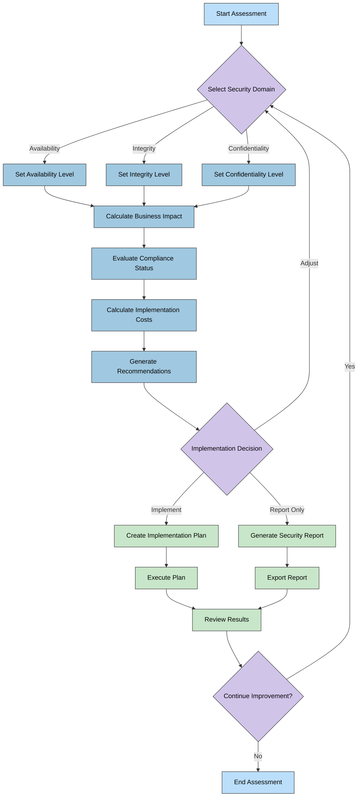
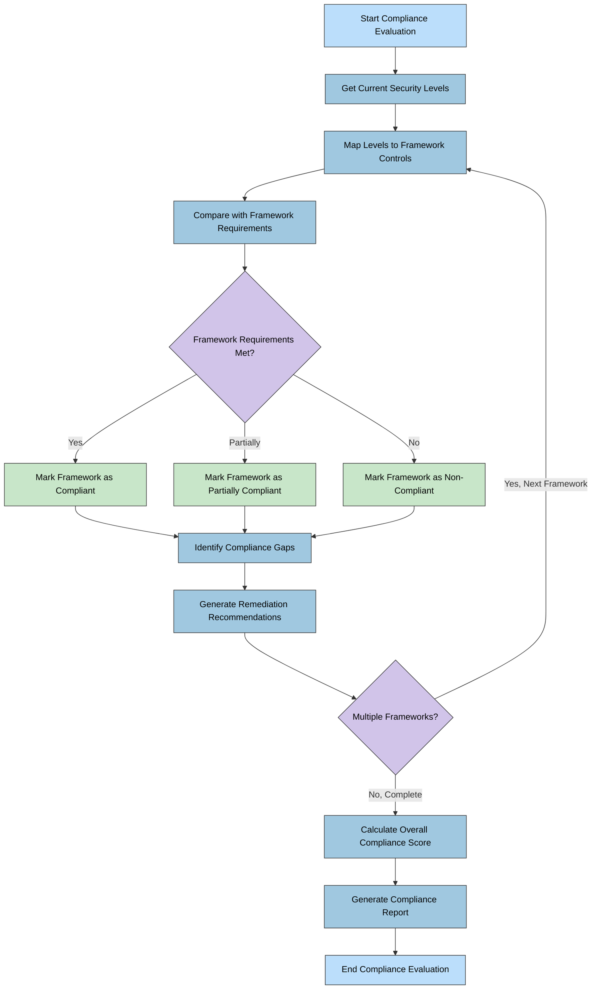
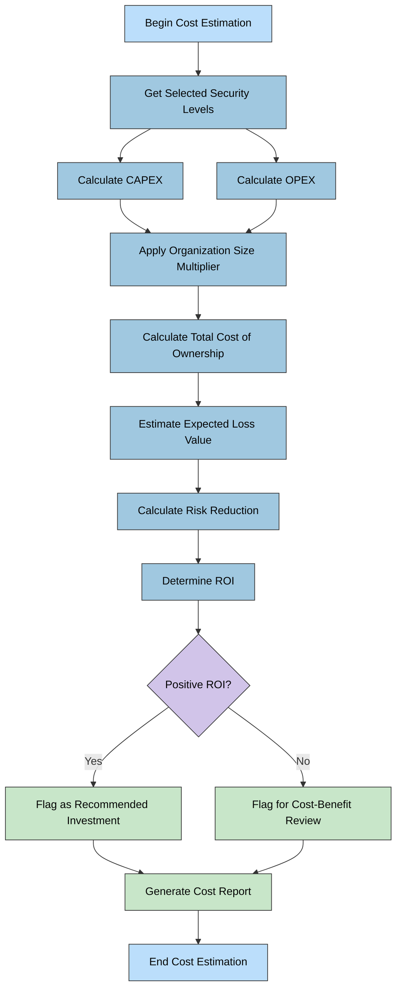

# CIA Compliance Manager Flowcharts

This document contains flowcharts that illustrate key processes within the CIA Compliance Manager.

## 📚 Related Architecture Documentation

| Document                                            | Focus           | Description                               |
| --------------------------------------------------- | --------------- | ----------------------------------------- |
| **[Current Architecture](ARCHITECTURE.md)**         | 🏛️ Architecture | C4 model showing current system structure |
| **[Future Architecture](FUTURE_ARCHITECTURE.md)**   | 🏛️ Architecture | Vision for context-aware platform         |
| **[State Diagrams](STATEDIAGRAM.md)**               | 🔄 Behavior     | Current system state transitions          |
| **[Future State Diagrams](FUTURE_STATEDIAGRAM.md)** | 🔄 Behavior     | Enhanced adaptive state transitions       |
| **[Future Flowcharts](FUTURE_FLOWCHART.md)**        | 🔄 Process      | Enhanced context-aware workflows          |
| **[Mindmaps](MINDMAP.md)**                          | 🧠 Concept      | Current system component relationships    |
| **[Future Mindmaps](FUTURE_MINDMAP.md)**            | 🧠 Concept      | Future capability evolution               |
| **[SWOT Analysis](SWOT.md)**                        | 💼 Business     | Current strategic assessment              |
| **[Future SWOT Analysis](FUTURE_SWOT.md)**          | 💼 Business     | Future strategic opportunities            |
| **[CI/CD Workflows](WORKFLOWS.md)**                 | 🔧 DevOps       | Current automation processes              |
| **[Future Workflows](FUTURE_WORKFLOWS.md)**         | 🔧 DevOps       | Enhanced CI/CD with ML                    |
| **[Future Data Model](FUTURE_DATA_MODEL.md)**       | 📊 Data         | Context-aware data architecture           |

## Security Level Assessment Workflow

**💼 Business Focus:** Maps the decision process from security domain selection through business impact analysis, compliance evaluation, and cost calculation to final recommendations.

**👤 User Journey Focus:** Illustrates the complete user flow for conducting a security assessment, showing decision points and alternative paths based on implementation choices.

## Compliance Evaluation Process

**📋 Compliance Focus:** Illustrates how security levels are mapped to compliance frameworks to determine compliance status.

**🔄 Process Focus:** Shows the step-by-step process of evaluating compliance based on security levels and generating remediation recommendations.

## Cost Estimation Workflow

**💰 Financial Focus:** Illustrates the process of calculating implementation costs for security controls.

**📊 ROI Focus:** Shows how costs are analyzed alongside security benefits to determine return on investment.

These flowcharts provide a visual representation of the key processes within the CIA Compliance Manager. They illustrate the decision flows and process steps that users typically follow when working with the application, from security assessment to compliance evaluation and cost estimation.

