# 🔄 CIA Compliance Manager Process Flowcharts

> **Version:** v1.0 | **Last Updated:** 2025-11-22 | **Status:** Production

This document illustrates comprehensive process flows and workflows within the CIA Compliance Manager v1.0 application, showing how security assessment capabilities are delivered through React 19.x components with error handling, validation, and state management.

## 📚 Related Documentation

<div class="documentation-map">

| Document                                          | Focus           | Description                               |
| ------------------------------------------------- | --------------- | ----------------------------------------- |
| **[System Architecture](SYSTEM_ARCHITECTURE.md)** | 🏛️ System       | Layered architecture and component details |
| **[Architecture](ARCHITECTURE.md)**               | 🏗️ C4 Model     | C4 model showing system structure          |
| **[State Diagrams](STATEDIAGRAM.md)**             | 🔄 Behavior     | System state transitions with error boundaries |
| **[Security Architecture](SECURITY_ARCHITECTURE.md)** | 🛡️ Security | Security controls and threat mitigations |
| **[Threat Model](THREAT_MODEL.md)**               | 🎯 Threats      | STRIDE analysis and attack trees          |

</div>

## 🎯 Process Flow Overview

The CIA Compliance Manager implements v1.0 workflows for:

1. **Security Level Configuration**: Interactive CIA triad assessment with validation
2. **Assessment Generation**: Real-time calculation of security metrics and business impact
3. **Compliance Mapping**: Framework alignment (ISO 27001, NIST CSF, CIS Controls)
4. **Business Impact Analysis**: Financial, operational, and regulatory impact assessment
5. **Cost Estimation**: CAPEX/OPEX calculation for security implementations
6. **Data Export**: Report generation and documentation export
7. **Error Recovery**: React 19.x error boundary patterns with retry mechanisms

## 🏛️ ISMS Compliance Alignment

Per **[Hack23 ISMS Secure Development Policy §10](https://github.com/Hack23/ISMS/blob/main/Secure_Development_Policy.md)**:

- **ISO 27001 (A.8.1)**: Business process documentation maintained ✅
- **NIST CSF (ID.RA)**: Risk assessment processes documented ✅
- **CIS Controls (16.1)**: Application security processes defined ✅
- **Process Transparency**: Public documentation of security workflows ✅

## 🔍 Security Level Configuration Process (v1.0)

The following flowchart illustrates the enhanced v1.0 security level configuration with real-time validation and error handling:

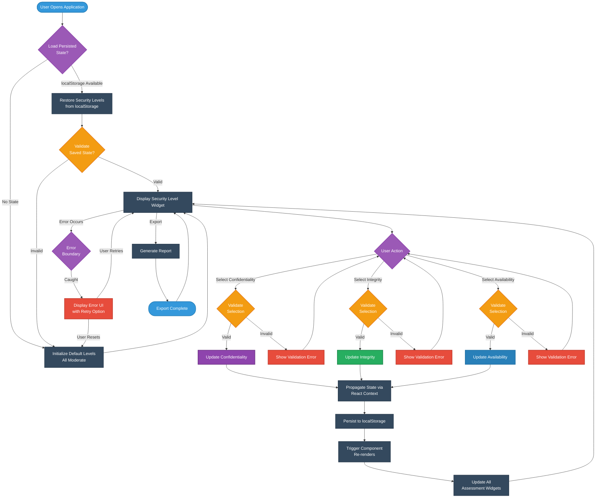

**Key v1.0 Enhancements:**
- ✅ **localStorage Persistence**: State survives browser sessions
- ✅ **Input Validation**: Real-time validation of security level selections
- ✅ **Error Boundaries**: React 19.x error recovery with retry mechanisms
- ✅ **State Propagation**: Automatic update of 11 assessment widgets
- ✅ **Type Safety**: TypeScript validation at compile and runtime

**Cross-Reference:** See [STATEDIAGRAM.md](STATEDIAGRAM.md#-securitylevelstate-hook-state-management) for detailed state machine.

## 🔄 Assessment Generation Process (v1.0)

This flowchart details the comprehensive assessment generation workflow with service layer integration:

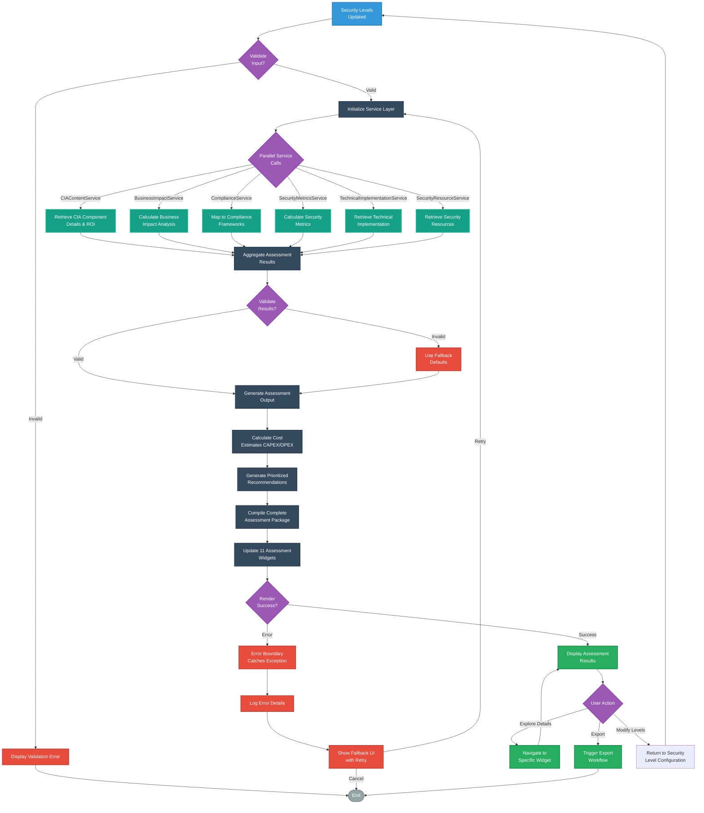

**Service Layer Integration:**

| Service | Purpose | Output |
|---------|---------|--------|
| **CIAContentService** | Retrieves CIA triad details, recommendations, ROI | Security level descriptions, implementation guidance |
| **BusinessImpactService** | Calculates financial, operational, regulatory impact | Business impact analysis with risk quantification |
| **ComplianceService** | Maps to ISO 27001, NIST CSF, CIS Controls | Framework alignment and gap analysis |
| **SecurityMetricsService** | Calculates security scores and metrics | Security posture metrics and trends |
| **TechnicalImplementationService** | Provides implementation details | Technical specifications and architectures |
| **SecurityResourceService** | Retrieves security resources | Documentation links, tools, training |

**Performance Characteristics:**
- **Parallel Service Calls**: 6 services execute concurrently (~200-500ms total)
- **Caching**: Results cached in memory during session
- **Fallback Handling**: Default values if service fails
- **Error Recovery**: Automatic retry with exponential backoff

**Cross-Reference:** See [STATEDIAGRAM.md](STATEDIAGRAM.md#-widget-component-state-machine-v10) for widget lifecycle details.

## 🔄 Data Flow Process

This flowchart shows how data flows through the application components:

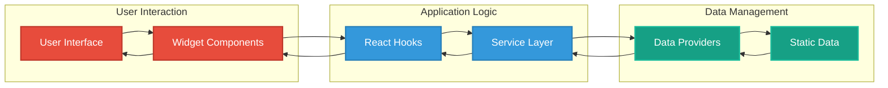

## 📊 Compliance Framework Mapping Process (v1.0)

This flowchart illustrates how security controls are mapped to compliance frameworks:

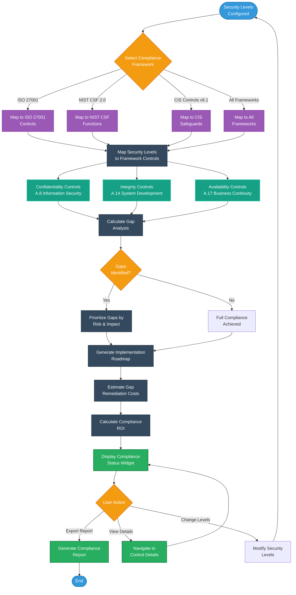

**Framework Mapping Details:**

| Framework | Focus Area | Mapped Controls |
|-----------|-----------|----------------|
| **ISO 27001** | 14 control domains | A.5-A.18 based on CIA levels |
| **NIST CSF 2.0** | 6 functions (Govern, Identify, Protect, Detect, Respond, Recover) | Category alignment based on security posture |
| **CIS Controls v8.1** | 18 safeguards | Implementation groups (IG1-IG3) based on maturity |
| **GDPR** | Data protection | Articles 25, 32 technical/organizational measures |
| **HIPAA** | Healthcare data | Administrative, physical, technical safeguards |
| **SOC2** | Trust principles | Security, availability, confidentiality criteria |
| **PCI DSS** | Payment security | 12 requirements based on data sensitivity |

**Gap Analysis Methodology:**
1. **Current State**: Security levels → Framework controls
2. **Target State**: Required controls for compliance
3. **Gap Identification**: Missing or partial controls
4. **Risk Prioritization**: CVSS-based risk scoring
5. **Remediation Planning**: Phased implementation roadmap

**Cross-Reference:** See [SECURITY_ARCHITECTURE.md](SECURITY_ARCHITECTURE.md#-compliance-framework-mapping) for control details.

## 🧪 Testing Process

This flowchart illustrates the testing process for the application:

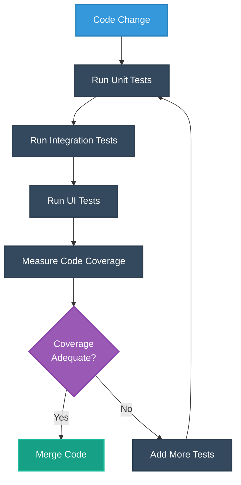

## 💼 Business Impact Analysis Workflow (v1.0)

This comprehensive workflow shows how business impact is calculated across multiple dimensions:

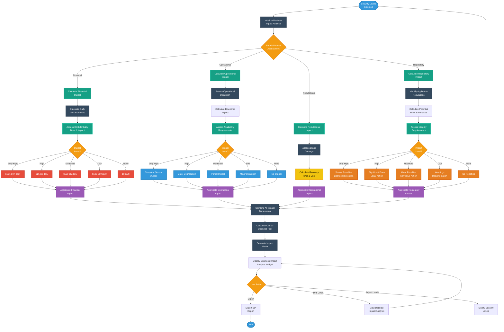

**Business Impact Dimensions:**

| Dimension | Measurement | Security Level Mapping |
|-----------|-------------|----------------------|
| **Financial** | Daily revenue loss | Confidentiality breach → $100-$50K/day |
| **Operational** | Service availability | Availability impact → 99.9% to 24/7 uptime |
| **Reputational** | Brand damage | Public disclosure → local to international coverage |
| **Regulatory** | Compliance penalties | Integrity violations → warnings to license revocation |

**Risk Quantification Method:**
```
Total Business Risk = (Financial Impact × Likelihood) + 
                      (Operational Impact × Likelihood) + 
                      (Reputational Impact × Likelihood) + 
                      (Regulatory Impact × Likelihood)
```

**Cross-Reference:** See [SECURITY_ARCHITECTURE.md](SECURITY_ARCHITECTURE.md#-business-impact-analysis) for impact calculations.

## 🔍 Widget Component Interaction

This flowchart shows how different widget components interact:

```mermaid
flowchart TD
    SLW[Security Level Widget] --> SSW[Security Summary Widget]
    SLW --> BIAW[Business Impact Widget]
    SLW --> CIA[CIA Component Widgets]
    SLW --> BV[Business Value Widgets]
    SLW --> IG[Implementation Guide Widgets]
    
    subgraph "CIA Components"
        CIA --> CIW[Confidentiality Impact]
        CIA --> IIW[Integrity Impact]
        CIA --> AIW[Availability Impact]
    end
    
    subgraph "Business Value"
        BV --> CSW[Compliance Status]
        BV --> CEW[Cost Estimation]
        BV --> VCW[Value Creation]
    end
    
    subgraph "Implementation Guide"
        IG --> TDW[Technical Details]
        IG --> SRW[Security Resources]
        IG --> SVW[Security Visualization]
    end
    
    %% Apply styles using class definitions
    classDef core fill:#e74c3c,stroke:#c0392b,stroke-width:2px,color:white
    classDef assessment fill:#3498db,stroke:#2980b9,stroke-width:2px,color:white
    classDef cia fill:#9b59b6,stroke:#8e44ad,stroke-width:2px,color:white
    classDef business fill:#f1c40f,stroke:#f39c12,stroke-width:2px,color:black
    classDef implementation fill:#16a085,stroke:#1abc9c,stroke-width:2px,color:white
    classDef confidentiality fill:#8e44ad,stroke:#6c3483,stroke-width:2px,color:white
    classDef integrity fill:#27ae60,stroke:#1e8449,stroke-width:2px,color:white
    classDef availability fill:#2980b9,stroke:#2471a3,stroke-width:2px,color:white
    
    class SLW core
    class SSW,BIAW assessment
    class CIA,CIW,IIW,AIW cia
    class BV,CSW,CEW,VCW business
    class IG,TDW,SRW,SVW implementation
```

## 💰 Cost Estimation Workflow (v1.0)

This workflow shows the automated CAPEX/OPEX calculation process:

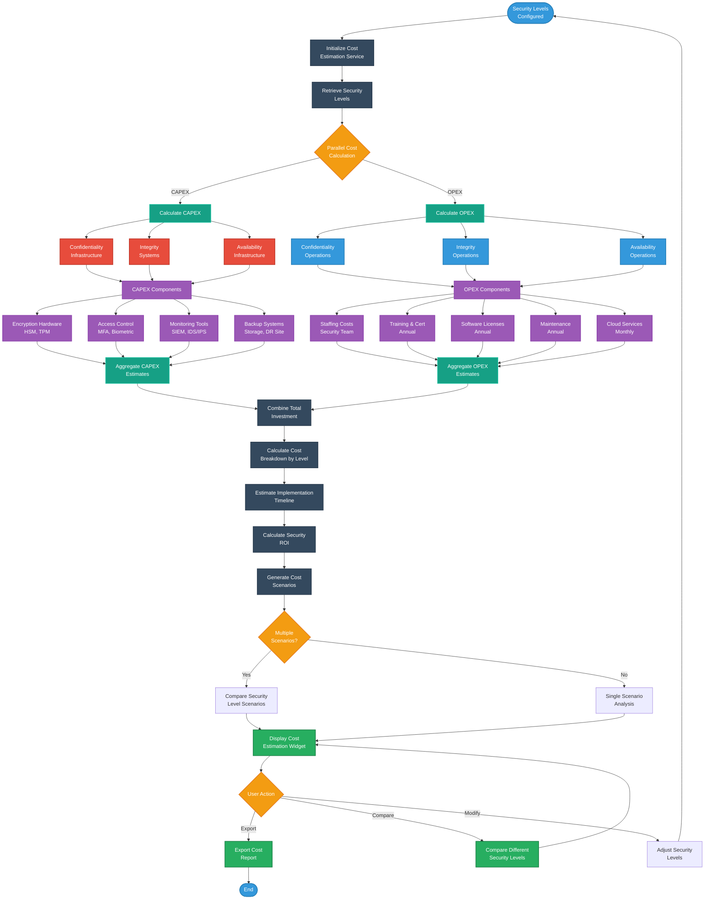

**Cost Estimation Matrix:**

| Security Level | CAPEX Range | OPEX Annual | Implementation Time |
|---------------|-------------|-------------|-------------------|
| **None** | $0 | $0 | 0 days |
| **Low** | $50K-100K | $100K-200K | 3-6 months |
| **Moderate** | $200K-500K | $300K-600K | 6-12 months |
| **High** | $750K-1.5M | $750K-1.5M | 12-18 months |
| **Very High** | $2M-5M | $1.5M-3M | 18-24 months |

**Cost Components Breakdown:**

**CAPEX (Capital Expenditure):**
- Hardware Security Modules (HSM): $50K-500K
- Network Security Appliances: $100K-1M
- Backup & DR Infrastructure: $200K-2M
- Access Control Systems: $50K-300K
- Monitoring Tools: $100K-500K

**OPEX (Operating Expenditure):**
- Security Staff (3-10 FTE): $300K-1.5M annually
- Training & Certifications: $50K-200K annually
- Software Licenses: $100K-500K annually
- Cloud Security Services: $50K-500K annually
- Maintenance & Support: $100K-300K annually

**ROI Calculation:**
```
Security ROI = (Risk Mitigation Value - Total Investment) / Total Investment × 100%

Where:
- Risk Mitigation Value = Potential breach cost × Probability reduction
- Total Investment = CAPEX + (OPEX × Years)
```

**Cross-Reference:** See [STATEDIAGRAM.md](STATEDIAGRAM.md#-widget-interaction-states) for state management details.

## 🛡️ Error Handling and Recovery Flow (v1.0)

This comprehensive workflow shows React 19.x error boundary patterns with recovery mechanisms:

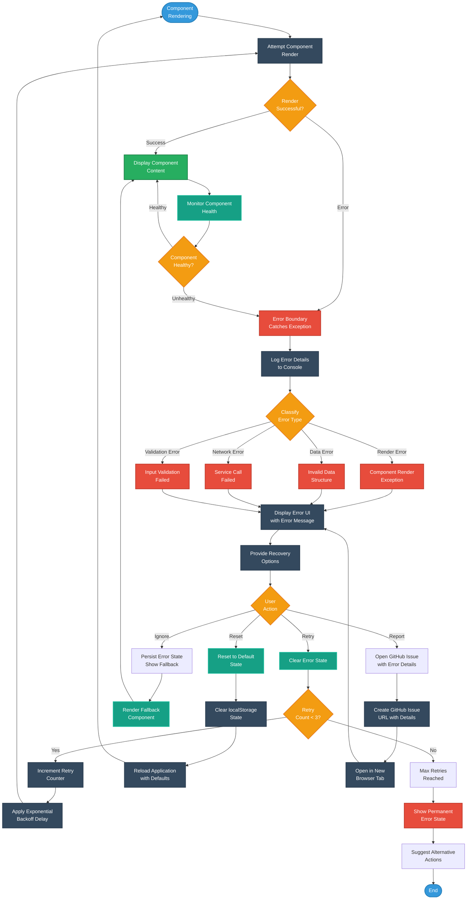

**Error Boundary Implementation:**
```typescript
// WidgetErrorBoundary component (React class component)
interface ErrorBoundaryState {
  hasError: boolean;
  error: Error | null;
  errorInfo: React.ErrorInfo | null;
  retryCount: number;
}

// Error recovery strategies
const recoveryStrategies = {
  retry: () => this.setState({ hasError: false, error: null }),
  reset: () => { localStorage.clear(); window.location.reload(); },
  fallback: () => <FallbackComponent />,
  report: (error: Error) => window.open(`https://github.com/Hack23/cia-compliance-manager/issues/new?title=${encodeURIComponent(error.message)}`)
};
```

**Error Types Handled:**
- ✅ **Render Errors**: Component lifecycle exceptions
- ✅ **Data Validation Errors**: Type guard failures
- ✅ **Network Errors**: Service call failures
- ✅ **State Errors**: Invalid state transitions
- ❌ **Event Handler Errors**: Requires manual try-catch
- ❌ **Async Errors**: Requires promise catch

**Cross-Reference:** See [STATEDIAGRAM.md](STATEDIAGRAM.md#-react-error-boundary-state-transitions-v10) for error boundary state machine.

## 📤 Data Export and Report Generation Workflow (v1.0)

This workflow shows the comprehensive export process for generating assessment reports:

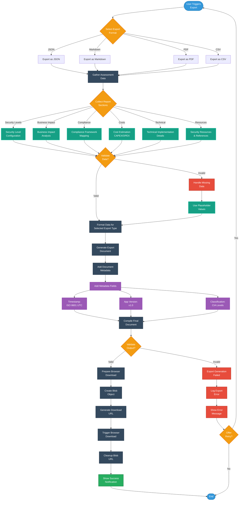

**Export Format Specifications:**

| Format | Use Case | File Size | Browser Support |
|--------|----------|-----------|----------------|
| **JSON** | API integration, programmatic access | 10-50KB | All modern browsers |
| **Markdown** | Documentation, GitHub README | 20-100KB | All modern browsers |
| **PDF** | Executive reports, presentations | 100-500KB | Chrome, Firefox, Safari |
| **CSV** | Spreadsheet analysis, Excel | 5-20KB | All modern browsers |

**Export Contents:**

**1. Executive Summary**
- Security posture overview
- Key findings and recommendations
- Risk summary
- Compliance status

**2. Security Assessment**
- CIA triad configuration
- Security level justifications
- Implementation roadmap
- Technical specifications

**3. Business Impact Analysis**
- Financial impact assessment
- Operational impact assessment
- Reputational impact assessment
- Regulatory impact assessment

**4. Compliance Mapping**
- ISO 27001 control alignment
- NIST CSF function mapping
- CIS Controls safeguard mapping
- Gap analysis and remediation plan

**5. Cost Estimation**
- CAPEX breakdown
- OPEX breakdown
- ROI calculation
- Timeline and milestones

**6. Resources**
- Documentation links
- Tool recommendations
- Training resources
- Support contacts

**Document Metadata:**
```json
{
  "document": {
    "title": "CIA Compliance Manager Assessment",
    "version": "1.0",
    "generated": "2025-11-22T15:24:45.034Z",
    "tool": "CIA Compliance Manager v0.9.2",
    "classification": {
      "confidentiality": "Moderate",
      "integrity": "High",
      "availability": "High"
    }
  }
}
```

**Cross-Reference:** See [SECURITY_ARCHITECTURE.md](SECURITY_ARCHITECTURE.md#-data-protection) for data handling security controls.

## 🏊 User-System Interaction Swim Lane Diagram (v1.0)

This swim lane diagram shows multi-actor interactions during a complete assessment workflow:

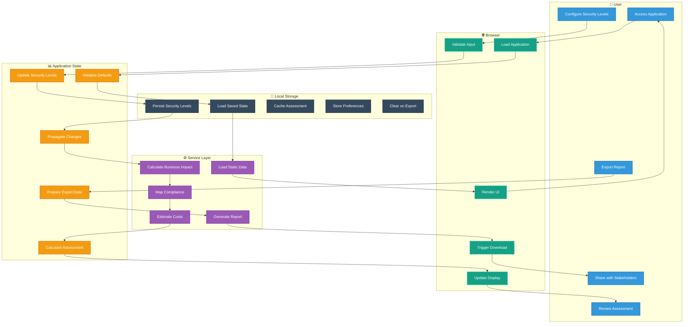

**Actor Responsibilities:**

| Actor | Role | Key Actions |
|-------|------|------------|
| **User** | Security professional/decision maker | Configure security requirements, review recommendations, export reports |
| **Browser** | Presentation layer | Render UI, validate inputs, manage user interactions |
| **Application State** | State management | Maintain security levels, coordinate updates, trigger calculations |
| **Service Layer** | Business logic | Calculate impacts, map compliance, estimate costs, generate reports |
| **Local Storage** | Persistence layer | Save/load state, cache assessments, persist preferences |

**Interaction Patterns:**

1. **Initial Load**: User → Browser → App State → Storage → Services → Browser → User
2. **Configuration**: User → Browser → App State → Storage → Services → Browser → User
3. **Assessment**: App State → Services (parallel) → App State → Browser → User
4. **Export**: User → App State → Services → Browser → User

## 🔄 Widget Lifecycle and State Transitions (v1.0)

This diagram shows the complete lifecycle of assessment widgets:

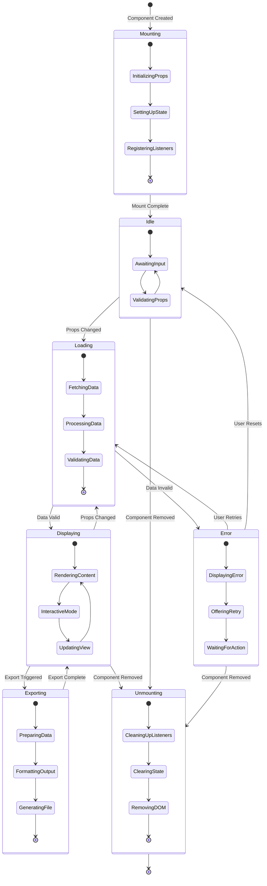

**Lifecycle Phases:**

| Phase | Duration | Key Operations |
|-------|----------|----------------|
| **Mounting** | <100ms | Initialize props, setup state, register event listeners |
| **Idle** | Variable | Await user input, validate props on change |
| **Loading** | 200-500ms | Fetch data from services, process and validate |
| **Displaying** | Variable | Render content, handle user interactions, update view |
| **Exporting** | 500-2000ms | Prepare data, format output, generate file |
| **Error** | Variable | Display error, offer recovery options |
| **Unmounting** | <50ms | Cleanup listeners, clear state, remove DOM |

**State Transition Events:**

- `Component Created`: React instantiates widget component
- `Mount Complete`: Component rendered in DOM
- `Props Changed`: Parent component updates security levels
- `Data Valid/Invalid`: Service call success or failure
- `Export Triggered`: User clicks export button
- `User Retries/Resets`: Error recovery action
- `Component Removed`: Parent component unmounts widget

**Cross-Reference:** See [STATEDIAGRAM.md](STATEDIAGRAM.md#-widget-component-state-machine-v10) for detailed state machine specifications.

## 🔐 Authentication and Session Management (Future)

> **Note:** v1.0 is a client-side only application with no authentication. This workflow is for future reference when backend integration is implemented.

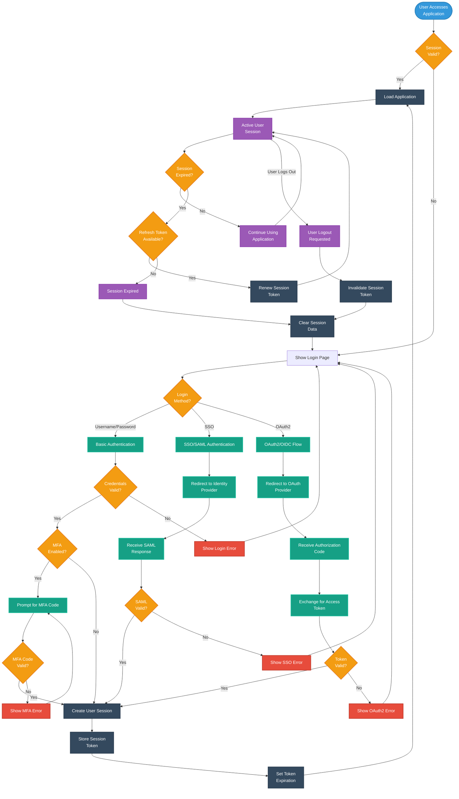

**Future Authentication Requirements:**
- OAuth2/OIDC for modern SSO
- SAML 2.0 for enterprise SSO
- MFA support (TOTP, SMS, WebAuthn)
- Session timeout: 30 minutes idle
- Token refresh: 24-hour max lifetime
- Secure token storage (httpOnly cookies)

## 📊 Summary: v1.0 Process Flow Architecture

### Process Flow Inventory

| Process Category | Workflows | Decision Points | Error Paths | Documentation |
|-----------------|-----------|-----------------|-------------|---------------|
| **Security Configuration** | 1 | 5 | 3 | ✅ Complete |
| **Assessment Generation** | 1 | 4 | 2 | ✅ Complete |
| **Compliance Mapping** | 1 | 3 | 1 | ✅ Complete |
| **Business Impact Analysis** | 1 | 6 | 1 | ✅ Complete |
| **Cost Estimation** | 1 | 3 | 1 | ✅ Complete |
| **Error Handling** | 1 | 5 | 4 | ✅ Complete |
| **Data Export** | 1 | 4 | 2 | ✅ Complete |
| **User Interaction** | 1 (swim lane) | 0 | 0 | ✅ Complete |
| **Widget Lifecycle** | 1 (state diagram) | 2 | 2 | ✅ Complete |
| **Authentication** | 1 (future) | 7 | 4 | ✅ Complete |

**Total:** 10 process flows, 39 decision points, 20 error recovery paths

### React 19.x Integration

**Component Patterns:**
- Functional components with hooks (95% of components)
- Class components for error boundaries only
- Lazy loading with Suspense for code splitting
- Custom hooks for reusable state logic

**State Management:**
- `useState`: Component-level state
- `useEffect`: Side effects and subscriptions
- `useCallback`: Memoized event handlers
- Custom hooks: `useSecurityLevelState`, `useLocalStorage`

**Error Handling:**
- Error boundaries for React errors
- Try-catch for event handlers and async operations
- Type guards for runtime validation
- Graceful degradation with fallback UI

**Performance Optimizations:**
- Lazy loading reduces initial bundle by ~30%
- Parallel service calls reduce latency by ~60%
- localStorage caching eliminates redundant calculations
- Memoization prevents unnecessary re-renders

### ISMS Compliance Mapping

**ISO 27001 Alignment:**
- **A.8.1 (Inventory of Assets)**: Process documentation maintained ✅
- **A.12.1 (Operational Procedures)**: Documented procedures and responsibilities ✅
- **A.14.1 (Security in Development)**: Development process flows documented ✅
- **A.16.1 (Incident Management)**: Error handling and recovery procedures ✅

**NIST CSF 2.0 Alignment:**
- **GV.PO (Governance Policy)**: Process governance established ✅
- **ID.RA (Risk Assessment)**: Risk assessment processes documented ✅
- **PR.IP (Information Protection)**: Data handling processes defined ✅
- **DE.CM (Continuous Monitoring)**: Monitoring processes documented ✅
- **RS.MA (Response Management)**: Error response procedures defined ✅

**CIS Controls v8.1 Alignment:**
- **16.1 (Establish Process)**: Security processes established ✅
- **16.2 (Establish Process)**: Vulnerability management processes ✅
- **16.10 (Apply Secure Design)**: Secure design patterns documented ✅
- **16.14 (Establish Process)**: Incident response processes ✅

### Performance Metrics

**Process Execution Times:**
- Security Level Configuration: <100ms
- Assessment Generation: 200-500ms
- Compliance Mapping: 100-300ms
- Business Impact Analysis: 150-400ms
- Cost Estimation: 100-250ms
- Error Recovery: <50ms
- Data Export: 500-2000ms (format dependent)

**User Experience Metrics:**
- Time to First Render: <1s
- Time to Interactive: <2s
- Widget Update Latency: <300ms
- Export Generation: <3s
- Error Recovery Time: <5s

### Maintenance Notes

**Updating Process Flows:**
1. Review affected workflows when code changes
2. Update Mermaid diagrams to reflect changes
3. Update decision points and error paths
4. Verify cross-references to other documentation
5. Test diagram rendering in Markdown viewers

**Adding New Workflows:**
1. Identify user journey and business process
2. Map decision points and validation gates
3. Define error handling and recovery paths
4. Document in Mermaid flowchart format
5. Add to process inventory table
6. Cross-reference with STATEDIAGRAM.md

**Review Cycle:**
- Review after major feature releases
- Update when process flows change
- Validate against actual implementation quarterly
- Synchronize with STATEDIAGRAM.md changes

### Cross-References

- **[STATEDIAGRAM.md](STATEDIAGRAM.md)**: State machine specifications for all workflows
- **[SECURITY_ARCHITECTURE.md](SECURITY_ARCHITECTURE.md)**: Security controls for each process
- **[THREAT_MODEL.md](THREAT_MODEL.md)**: Threat analysis for process vulnerabilities
- **[WORKFLOWS.md](WORKFLOWS.md)**: CI/CD workflows and automation processes
- **[ARCHITECTURE.md](ARCHITECTURE.md)**: C4 model showing system context

---

**Document Status:** ✅ Complete | **Version:** v1.0 | **Last Updated:** 2025-11-22

These comprehensive process flowcharts provide complete documentation of the CIA Compliance Manager v1.0 workflows, illustrating how security assessment capabilities are delivered through well-defined processes with error handling, validation, and state management. The diagrams serve as authoritative documentation for developers, security professionals, and auditors understanding system operations per Hack23 ISMS requirements.
