# 📊 Future CIA Compliance Manager Data Model

**Version:** 2.0-DRAFT | **Based on:** v1.0 Baseline | **Last Updated:** 2025-01-23 | **Status:** 🚀 Evolution Roadmap

This document outlines the comprehensive data architecture evolution for the CIA Compliance Manager, detailing how the data layer transforms from client-side TypeScript types into a robust, AWS-powered serverless data architecture with DynamoDB Global Tables, multi-region replication, and enterprise data management capabilities.

## 🎯 v1.0 Baseline → v2.0 AWS Serverless Data Evolution

### **v1.0 Data Model Achievements (Current State)**
- ✅ **96+ TypeScript Interfaces**: Complete type-safe data model with zero `any` types
- ✅ **Client-Side State Management**: React hooks for local state (no Context API overhead)
- ✅ **Local Storage Persistence**: Browser-based profile storage with encryption support
- ✅ **Type Guards & Validation**: Runtime type checking at API boundaries
- ✅ **Immutable Data Patterns**: Functional programming approach to state updates
- ✅ **Comprehensive Type Coverage**: 8 type definition files covering all domains
- ✅ **No Backend Dependencies**: Pure frontend architecture with no server requirements

### **v2.0 AWS Serverless Data Vision (Future State)**
- 🚀 **DynamoDB Global Tables**: Multi-region data persistence with automatic replication
- 🚀 **Multi-Tenancy Support**: Organization hierarchies with user roles and permissions
- 🚀 **Audit Trail System**: Immutable append-only logs for compliance evidence
- 🚀 **Schema Versioning**: Automated migration with backward compatibility
- 🚀 **Offline-First Architecture**: IndexedDB for client-side caching with sync
- 🚀 **Historical Data Storage**: Time-series compliance data for trend analysis
- 🚀 **Event-Driven Sync**: AWS EventBridge for real-time data synchronization
- 🚀 **Encryption Everywhere**: AWS KMS for data at rest, TLS 1.3 in transit

## 📚 Related Architecture Documentation

<div class="documentation-map">

### Current Architecture (v1.0 Baseline)
| Document                                            | Focus           | Description                               |
| --------------------------------------------------- | --------------- | ----------------------------------------- |
| **[Data Model](DATA_MODEL.md)**                     | 📊 Data         | **v1.0 baseline** - Current TypeScript data structures |
| **[Current Architecture](ARCHITECTURE.md)**         | 🏛️ Architecture | C4 model showing v1.0 frontend-only structure |
| **[Security Architecture](SECURITY_ARCHITECTURE.md)** | 🛡️ Security   | v1.0 security controls and CSP implementation |
| **[State Diagrams](STATEDIAGRAM.md)**               | 🔄 Behavior     | Current system state transitions          |
| **[Process Flowcharts](FLOWCHART.md)**              | 🔄 Process      | Current security assessment workflows     |
| **[Mindmaps](MINDMAP.md)**                          | 🧠 Concept      | Current system component relationships    |
| **[SWOT Analysis](SWOT.md)**                        | 💼 Business     | Current strategic assessment              |
| **[CI/CD Workflows](WORKFLOWS.md)**                 | 🔧 DevOps       | Current GitHub Actions automation         |

### Future Architecture Evolution (v2.0+)
| Document                                            | Focus           | Description                               |
| --------------------------------------------------- | --------------- | ----------------------------------------- |
| **[Future Data Model](FUTURE_DATA_MODEL.md)**       | 📊 Data         | **This document** - AWS serverless data evolution |
| **[Future Architecture](FUTURE_ARCHITECTURE.md)**   | 🚀 Evolution    | AWS serverless architecture roadmap       |
| **[Future Security Architecture](FUTURE_SECURITY_ARCHITECTURE.md)** | 🛡️ Security | Planned AWS security enhancements |
| **[Future State Diagrams](FUTURE_STATEDIAGRAM.md)** | 🔄 Behavior     | Context-aware state transitions           |
| **[Future Flowcharts](FUTURE_FLOWCHART.md)**        | 🔄 Process      | Enhanced context-aware workflows          |
| **[Future Mindmaps](FUTURE_MINDMAP.md)**            | 🧠 Concept      | Future capability evolution               |
| **[Future SWOT Analysis](FUTURE_SWOT.md)**          | 💼 Business     | Future strategic opportunities            |
| **[Future Workflows](FUTURE_WORKFLOWS.md)**         | 🔧 DevOps       | Enhanced CI/CD with AWS integration       |

</div>

## 📊 v1.0 Baseline Data Model (Current State)

### **Core Type System Architecture**

The v1.0 data model demonstrates production-ready type safety through 96+ TypeScript interfaces across 8 type definition files. This establishes the foundation for future persistence and backend evolution.

#### **Primary Type Files**

| File | Purpose | Key Exports | Line Count |
|------|---------|-------------|------------|
| `src/types/cia.ts` | Core CIA types | `SecurityLevel`, `CIAComponent`, type guards | 300+ |
| `src/types/cia-services.ts` | Service interfaces | `CIADetails`, `BusinessImpactDetails`, `TechnicalImplementationDetails` | 400+ |
| `src/types/widget-props.ts` | Widget prop interfaces | 19 widget prop types | 820 |
| `src/types/componentPropExports.ts` | Component props | 30 component prop types | 364 |
| `src/types/widgets.ts` | Legacy widget types | Widget-specific interfaces | 500 |
| `src/types/compliance.ts` | Compliance types | `ComplianceStatus`, `ComplianceFramework` | 150+ |
| `src/types/businessImpact.ts` | Business impact | `BusinessImpact`, `SLAMetrics` | 100+ |
| `src/types/securityResources.ts` | Resources | `SecurityResource` | 50+ |

#### **v1.0 Entity Relationship Diagram (Client-Side)**


**Key Characteristics:**
- **No Database**: All data exists as TypeScript types and runtime objects
- **Local Storage**: Browser-based persistence with localStorage API
- **No User Identity**: Single-user desktop application model
- **No Multi-Tenancy**: Designed for individual security assessments
- **No Audit Trail**: No historical tracking of changes
- **No Sync**: No server-side storage or synchronization

### **Current Data Flow (v1.0)**

```mermaid
flowchart LR
    User[👤 User] -->|Interacts| UI[React 19.x UI]
    UI -->|Updates| State[React Hooks State]
    State -->|Persists| LS[localStorage]
    
    State -->|Queries| Services[Service Layer]
    Services -->|Returns| Data[Static Data]
    Data -->|Transforms| UI
    
    LS -.->|Loads on startup| State
    
    style User fill:#3498db,stroke:#2980b9,stroke-width:2px,color:#fff
    style UI fill:#2ecc71,stroke:#27ae60,stroke-width:2px,color:#fff
    style State fill:#9b59b6,stroke:#8e44ad,stroke-width:2px,color:#fff
    style LS fill:#e74c3c,stroke:#c0392b,stroke-width:2px,color:#fff
    style Services fill:#f39c12,stroke:#e67e22,stroke-width:2px,color:#fff
    style Data fill:#1abc9c,stroke:#16a085,stroke-width:2px,color:#fff
```



## 🗄️ Persistence Layer Architecture (v2.0 Evolution)

### **Multi-Tier Persistence Strategy**

The v2.0 architecture implements a three-tier persistence strategy balancing performance, cost, and data durability:


### **1. Client-Side Persistence: IndexedDB**

#### **Purpose & Rationale**
- **Offline-First**: Enable full application functionality without network connectivity
- **Performance**: Sub-millisecond data access for instant UI updates
- **Data Privacy**: Sensitive assessment data stays on device until user syncs
- **Sync Conflicts**: Client-side conflict resolution before server sync

#### **IndexedDB Schema Design**

```typescript
/**
 * IndexedDB schema for client-side caching
 * 
 * Database: cia-compliance-manager-cache
 * Version: 1
 */

interface IDBSecurityProfile {
  id: string;                    // UUID primary key
  userId: string;                // User identifier (synced from Cognito)
  organizationId?: string;       // Organization if multi-tenant
  availabilityLevel: SecurityLevel;
  integrityLevel: SecurityLevel;
  confidentialityLevel: SecurityLevel;
  securityLevel: SecurityLevel;
  createdAt: number;             // Timestamp (ms since epoch)
  updatedAt: number;             // Timestamp (ms since epoch)
  lastSyncedAt?: number;         // Last successful sync timestamp
  syncStatus: 'pending' | 'synced' | 'conflict';
  version: number;               // Optimistic locking version
  _deleted?: boolean;            // Soft delete flag
}

interface IDBAssessmentHistory {
  id: string;                    // UUID primary key
  profileId: string;             // FK to IDBSecurityProfile
  assessment: SecurityProfile;   // Full snapshot
  timestamp: number;             // Timestamp (ms since epoch)
  userId: string;
  changeDescription?: string;    // User-provided change note
}

interface IDBSyncQueue {
  id: string;                    // UUID primary key
  operation: 'create' | 'update' | 'delete';
  entityType: 'profile' | 'assessment';
  entityId: string;
  data: unknown;                 // Serialized entity
  timestamp: number;             // Timestamp (ms since epoch)
  retryCount: number;
  lastError?: string;
}
```

#### **IndexedDB Indexes**

```typescript
// Object Stores and Indexes
const stores = [
  {
    name: 'profiles',
    keyPath: 'id',
    indexes: [
      { name: 'userId', keyPath: 'userId', unique: false },
      { name: 'organizationId', keyPath: 'organizationId', unique: false },
      { name: 'updatedAt', keyPath: 'updatedAt', unique: false },
      { name: 'syncStatus', keyPath: 'syncStatus', unique: false },
    ]
  },
  {
    name: 'assessmentHistory',
    keyPath: 'id',
    indexes: [
      { name: 'profileId', keyPath: 'profileId', unique: false },
      { name: 'userId', keyPath: 'userId', unique: false },
      { name: 'timestamp', keyPath: 'timestamp', unique: false },
    ]
  },
  {
    name: 'syncQueue',
    keyPath: 'id',
    indexes: [
      { name: 'timestamp', keyPath: 'timestamp', unique: false },
      { name: 'entityType', keyPath: 'entityType', unique: false },
    ]
  },
];
```

#### **Offline-First Data Flow**


### **2. Server-Side Persistence: DynamoDB Global Tables**

#### **Purpose & Rationale**
- **Multi-Region**: Data replicated across us-east-1, eu-west-1, ap-southeast-1
- **Scalability**: Automatic scaling with on-demand billing
- **Performance**: Single-digit millisecond latency globally
- **Durability**: 99.999999999% (11 nines) data durability
- **Consistency**: Eventual consistency with < 1 second replication

#### **DynamoDB Table Design**

**Core Tables:**

| Table Name | Purpose | Partition Key | Sort Key | GSI | Capacity Mode |
|------------|---------|---------------|----------|-----|---------------|
| `SecurityProfiles` | User security assessments | `userId` | `profileId` | `organizationId-createdAt-index` | On-Demand |
| `Organizations` | Multi-tenant org data | `organizationId` | - | - | On-Demand |
| `Users` | User profiles and roles | `userId` | - | `organizationId-email-index` | On-Demand |
| `ComplianceSnapshots` | Historical compliance data | `profileId` | `timestamp` | - | On-Demand |
| `AuditLogs` | Immutable audit trail | `entityId` | `timestamp` | `userId-timestamp-index` | On-Demand |
| `IntegrationData` | External system sync | `organizationId` | `connectorId-timestamp` | - | On-Demand |

**SecurityProfiles Table Schema:**

```typescript
/**
 * DynamoDB SecurityProfiles table item
 * 
 * Partition Key: userId (String)
 * Sort Key: profileId (String)
 * Global Secondary Index: organizationId-createdAt-index
 */
interface DDBSecurityProfile {
  // Primary Keys
  userId: string;                          // PK: User who owns the profile
  profileId: string;                       // SK: UUID of the assessment
  
  // Core Assessment Data
  availabilityLevel: SecurityLevel;
  integrityLevel: SecurityLevel;
  confidentialityLevel: SecurityLevel;
  securityLevel: SecurityLevel;
  
  // Business Context (Future v2.0+)
  organizationId?: string;                 // For multi-tenant deployments
  industry?: string;
  cashFlow?: string;
  capability?: string;
  department?: string[];
  dataClassification?: string[];
  hasPersonalData?: boolean;
  usesAI?: boolean;
  
  // Timestamps
  createdAt: number;                       // Unix timestamp (ms)
  updatedAt: number;                       // Unix timestamp (ms)
  assessmentDate: number;                  // Unix timestamp (ms)
  
  // Versioning & Sync
  version: number;                         // Optimistic locking version
  lastModifiedBy: string;                  // userId who last modified
  syncSource: 'web' | 'mobile' | 'api';   // Source of last update
  
  // Compliance & Impact (Computed Fields)
  complianceScore: number;                 // 0-100
  compliantFrameworks: string[];           // ISO 27001, NIST CSF, etc.
  businessImpactSummary?: string;          // Cached impact analysis
  
  // Soft Delete & Archival
  isDeleted?: boolean;                     // Soft delete flag
  deletedAt?: number;                      // Unix timestamp (ms)
  archivedAt?: number;                     // Unix timestamp (ms)
  
  // TTL for automatic expiration (optional)
  ttl?: number;                            // Unix timestamp (s) for DynamoDB TTL
}
```

**Organizations Table Schema:**

```typescript
/**
 * DynamoDB Organizations table item
 * 
 * Partition Key: organizationId (String)
 */
interface DDBOrganization {
  organizationId: string;                  // PK: UUID of organization
  name: string;
  industry: string;
  size: 'startup' | 'small' | 'medium' | 'large' | 'enterprise';
  cashFlow: 'negative' | 'breakeven' | 'positive' | 'profitable';
  
  // Geographic & Regulatory
  primaryRegion: string;                   // us-east-1, eu-west-1, etc.
  dataResidencyRegions: string[];          // Compliance requirement
  applicableRegulations: string[];         // GDPR, CCPA, HIPAA, etc.
  
  // Subscription & Billing
  subscriptionTier: 'free' | 'professional' | 'enterprise';
  subscriptionStatus: 'active' | 'suspended' | 'cancelled';
  billingEmail: string;
  
  // Timestamps
  createdAt: number;
  updatedAt: number;
  
  // Feature Flags
  features: {
    multiUserEnabled: boolean;
    aiRecommendationsEnabled: boolean;
    integrationEnabled: boolean;
    advancedComplianceEnabled: boolean;
  };
  
  // Quotas & Limits
  quotas: {
    maxUsers: number;
    maxProfiles: number;
    maxHistoricalDays: number;
  };
}
```

**AuditLogs Table Schema:**

```typescript
/**
 * DynamoDB AuditLogs table item (Append-Only)
 * 
 * Partition Key: entityId (String)
 * Sort Key: timestamp (Number)
 * Global Secondary Index: userId-timestamp-index
 */
interface DDBauditLog {
  // Primary Keys
  entityId: string;                        // PK: profileId, organizationId, etc.
  timestamp: number;                       // SK: Unix timestamp (ms)
  
  // Audit Metadata
  logId: string;                           // UUID for this audit entry
  userId: string;                          // Who made the change
  action: 'create' | 'update' | 'delete' | 'view' | 'export';
  entityType: 'profile' | 'organization' | 'user' | 'integration';
  
  // Change Details
  changes?: {
    field: string;
    oldValue: unknown;
    newValue: unknown;
  }[];
  
  // Context
  ipAddress: string;                       // Source IP (anonymized for GDPR)
  userAgent: string;                       // Browser/client info
  sessionId: string;                       // Session identifier
  
  // Compliance Evidence
  complianceRelevant: boolean;             // Flag for compliance reporting
  retentionPeriodYears: number;            // Retention requirement
  
  // Immutability Proof
  previousLogId?: string;                  // Chain of logs
  checksumSHA256: string;                  // Integrity verification
}
```

#### **Multi-Region Replication Strategy**


**Key Replication Features:**
- **Sub-Second Replication**: Typically 300-800ms between regions
- **Automatic Conflict Resolution**: Last-writer-wins with version vectors
- **Active-Active**: Write to any region, read from nearest
- **Consistency**: Eventual consistency with guaranteed replication
- **Failover**: Automatic regional failover if primary unavailable

### **3. Archive Storage: S3 + Glacier**

#### **Purpose & Rationale**
- **Cost Optimization**: S3 Glacier for long-term compliance archives at $0.004/GB/month
- **Regulatory Compliance**: Meet 7-year retention requirements for ISO 27001, SOC 2
- **Data Lake**: Foundation for future big data analytics and ML training
- **Disaster Recovery**: Immutable backups outside DynamoDB

#### **S3 Storage Architecture**

```typescript
/**
 * S3 Bucket Structure
 * 
 * Bucket: cia-compliance-manager-archives-{region}
 * Encryption: SSE-KMS with customer-managed CMK
 * Versioning: Enabled
 * Replication: Cross-region to secondary bucket
 */

// S3 Object Key Pattern
const archiveKey = 
  `archives/{organizationId}/{year}/{month}/{profileId}_{timestamp}.json.gz`;

// Example: archives/org-123/2025/01/profile-456_1705968000000.json.gz

interface S3ArchivedProfile {
  profile: DDBSecurityProfile;             // Full profile snapshot
  complianceData: ComplianceStatus[];      // Historical compliance
  businessImpactHistory: BusinessImpactDetails[];
  auditTrail: DDBauditLog[];               // Related audit logs
  
  // Archive Metadata
  archivedAt: number;                      // Unix timestamp (ms)
  archivedBy: string;                      // userId or system
  archiveReason: 'retention_policy' | 'manual' | 'data_lifecycle';
  retentionUntil: number;                  // Unix timestamp (ms)
  complianceFrameworks: string[];          // Which frameworks require this
  
  // Integrity
  checksumSHA256: string;                  // File integrity verification
  originalDDBKey: { userId: string; profileId: string };
}
```

#### **Lifecycle Policy**

```yaml
# S3 Lifecycle Policy for Cost Optimization
LifecycleConfiguration:
  Rules:
    - Id: ArchiveOldProfiles
      Status: Enabled
      Filter:
        Prefix: archives/
      Transitions:
        - Days: 90                         # Move to S3 Glacier after 90 days
          StorageClass: GLACIER
        - Days: 180                        # Move to Glacier Deep Archive after 180 days
          StorageClass: DEEP_ARCHIVE
      Expiration:
        Days: 2555                         # Delete after 7 years (ISO 27001)
      
    - Id: DeleteOldBackups
      Status: Enabled
      Filter:
        Prefix: backups/
      Expiration:
        Days: 35                           # Delete backups after 35 days
```

## 🧩 Enhanced Data Model Overview (v2.0)

The v2.0 data model extends the v1.0 baseline to support multi-tenancy, audit trails, historical data, and enterprise integration while maintaining backward compatibility with the client-side TypeScript types.


### **Enhanced v2.0 Entity Relationship Diagram (Multi-User Persistence)**


### **Key v2.0 Data Model Enhancements**

| Enhancement | v1.0 Baseline | v2.0 Evolution | Business Value |
|-------------|---------------|----------------|----------------|
| **Multi-Tenancy** | Single user desktop app | Organizations with multiple users | Enterprise sales, SaaS model |
| **User Management** | No user concept | Cognito-backed users with RBAC | Team collaboration, audit |
| **Audit Trail** | No change tracking | Immutable append-only audit logs | Compliance evidence, forensics |
| **Historical Data** | No history | Time-series compliance snapshots | Trend analysis, maturity tracking |
| **Persistence** | localStorage only | DynamoDB Global Tables | Multi-device, team sharing |
| **Sync** | No sync | Offline-first with EventBridge | Mobile support, reliability |
| **Encryption** | Client-side only | KMS + TLS 1.3 end-to-end | Enterprise security, compliance |
| **Backup** | User export only | Automated S3 + Glacier archival | Disaster recovery, compliance |

## 📐 Schema Versioning & Evolution Strategy

### **Versioning Philosophy**

The CIA Compliance Manager implements a **semantic versioning** approach for data schemas to ensure backward compatibility while enabling continuous evolution:

- **Major Version (X.0.0)**: Breaking changes requiring migration
- **Minor Version (1.X.0)**: Backward-compatible additions (new fields, tables)
- **Patch Version (1.0.X)**: Bug fixes, documentation updates

### **Schema Version Tracking**

```typescript
/**
 * Schema version metadata stored in DynamoDB
 * 
 * Table: SchemaVersions
 * Partition Key: schemaName (String)
 * Sort Key: version (String)
 */
interface SchemaVersion {
  schemaName: string;                      // PK: Table or entity name
  version: string;                         // SK: Semantic version (e.g., "2.1.0")
  deployedAt: number;                      // Unix timestamp (ms)
  deployedBy: string;                      // userId or 'system'
  description: string;                     // Change summary
  migrationRequired: boolean;              // Does this need data migration?
  migrationScriptS3Key?: string;           // S3 key for migration Lambda
  backwardCompatible: boolean;             // Can old clients read new data?
  forwardCompatible: boolean;              // Can new clients read old data?
  deprecationDate?: number;                // When this version will be removed
  
  // Migration Status Tracking
  affectedRecords?: number;                // How many records need migration
  migratedRecords?: number;                // How many have been migrated
  migrationStatus: 'pending' | 'in_progress' | 'completed' | 'failed';
  migrationStartedAt?: number;
  migrationCompletedAt?: number;
  migrationErrors?: string[];
}
```

### **Backward Compatibility Layer**

#### **Field Addition (Minor Version)**

```typescript
/**
 * Example: Adding 'aiContext' field to SecurityProfile (v2.1.0)
 * 
 * Approach: Make field optional, provide default value
 */

// v2.0.0 Schema
interface SecurityProfileV2_0 {
  userId: string;
  profileId: string;
  availabilityLevel: SecurityLevel;
  integrityLevel: SecurityLevel;
  confidentialityLevel: SecurityLevel;
  createdAt: number;
  updatedAt: number;
}

// v2.1.0 Schema (Backward Compatible)
interface SecurityProfileV2_1 extends SecurityProfileV2_0 {
  aiContext?: {                            // Optional field
    usesAI: boolean;
    modelTypes: string[];
    hasTrainingData: boolean;
    isPublicFacing: boolean;
  };
}

// Read handler provides default
function readProfile(data: unknown): SecurityProfileV2_1 {
  const profile = data as SecurityProfileV2_1;
  
  // Provide default for missing field
  if (!profile.aiContext) {
    profile.aiContext = {
      usesAI: false,
      modelTypes: [],
      hasTrainingData: false,
      isPublicFacing: false,
    };
  }
  
  return profile;
}
```

#### **Field Renaming (Major Version)**

```typescript
/**
 * Example: Renaming 'cashFlow' to 'financialHealth' (v3.0.0)
 * 
 * Approach: Support both fields during transition period
 */

// v2.x Schema
interface OrganizationV2 {
  organizationId: string;
  name: string;
  cashFlow: 'negative' | 'breakeven' | 'positive' | 'profitable';
}

// v3.0.0 Schema (Breaking Change)
interface OrganizationV3 {
  organizationId: string;
  name: string;
  financialHealth: 'negative' | 'breakeven' | 'positive' | 'profitable';  // Renamed
  
  // Keep old field for 90 days with @deprecated tag
  /** @deprecated Use financialHealth instead. Will be removed in v4.0.0 */
  cashFlow?: 'negative' | 'breakeven' | 'positive' | 'profitable';
}

// Write handler writes both fields during transition
function writeOrganization(org: OrganizationV3): void {
  const data = {
    ...org,
    cashFlow: org.financialHealth,        // Duplicate data to old field
  };
  
  dynamodb.put({ TableName: 'Organizations', Item: data });
}

// Read handler normalizes to new schema
function readOrganization(data: unknown): OrganizationV3 {
  const org = data as OrganizationV3;
  
  // Migrate old field to new field if needed
  if (!org.financialHealth && org.cashFlow) {
    org.financialHealth = org.cashFlow;
  }
  
  return org;
}
```

### **Migration Automation Architecture**


### **Migration Execution Strategy**

#### **1. Pre-Migration Validation**

```typescript
/**
 * Step 1: Validate migration prerequisites
 */
interface PreMigrationCheck {
  schemaVersion: string;
  tableName: string;
  estimatedRecords: number;
  estimatedDurationMinutes: number;
  backupCompleted: boolean;
  testMigrationCompleted: boolean;
  approvalRequired: boolean;
  approvedBy?: string;
  approvedAt?: number;
}

async function validatePreMigration(
  schemaName: string,
  newVersion: string
): Promise<PreMigrationCheck> {
  // 1. Count affected records
  const count = await dynamodb.scan({
    TableName: schemaName,
    Select: 'COUNT',
  }).promise();
  
  // 2. Verify backup exists
  const backup = await dynamodb.listBackups({
    TableName: schemaName,
    TimeRangeLowerBound: Date.now() - 24 * 60 * 60 * 1000,  // Last 24 hours
  }).promise();
  
  // 3. Check test migration results
  const testResults = await getTestMigrationResults(schemaName, newVersion);
  
  return {
    schemaVersion: newVersion,
    tableName: schemaName,
    estimatedRecords: count.Count || 0,
    estimatedDurationMinutes: Math.ceil((count.Count || 0) / 1000 * 0.5),  // 0.5min per 1000 records
    backupCompleted: backup.BackupSummaries.length > 0,
    testMigrationCompleted: testResults.success,
    approvalRequired: count.Count > 10000,  // Require approval for large migrations
  };
}
```

#### **2. Batch Migration with Progress Tracking**

```typescript
/**
 * Step 2: Execute batch migration with progress updates
 */
async function executeBatchMigration(
  schemaName: string,
  newVersion: string,
  transformFunction: (item: unknown) => unknown
): Promise<MigrationResult> {
  let lastEvaluatedKey: unknown = undefined;
  let migratedCount = 0;
  let errorCount = 0;
  const errors: string[] = [];
  
  do {
    // Read batch
    const result = await dynamodb.scan({
      TableName: schemaName,
      Limit: 1000,
      ExclusiveStartKey: lastEvaluatedKey as Record<string, unknown>,
    }).promise();
    
    // Transform items
    const transformedItems = result.Items?.map((item) => {
      try {
        return transformFunction(item);
      } catch (error) {
        errorCount++;
        errors.push(`Failed to transform ${JSON.stringify(item)}: ${error}`);
        return null;
      }
    }).filter((item) => item !== null);
    
    // Write batch
    if (transformedItems && transformedItems.length > 0) {
      await dynamodb.batchWrite({
        RequestItems: {
          [schemaName]: transformedItems.map((item) => ({
            PutRequest: { Item: item },
          })),
        },
      }).promise();
      
      migratedCount += transformedItems.length;
    }
    
    // Update progress
    await updateMigrationProgress(schemaName, newVersion, {
      migratedRecords: migratedCount,
      errors: errors.slice(-100),  // Keep last 100 errors
    });
    
    lastEvaluatedKey = result.LastEvaluatedKey;
    
  } while (lastEvaluatedKey);
  
  return {
    success: errorCount === 0,
    migratedCount,
    errorCount,
    errors: errors.slice(0, 100),  // Return first 100 errors
  };
}
```

#### **3. Post-Migration Validation**

```typescript
/**
 * Step 3: Validate migration success
 */
async function validatePostMigration(
  schemaName: string,
  newVersion: string
): Promise<ValidationResult> {
  // 1. Count records in new schema
  const newCount = await dynamodb.scan({
    TableName: schemaName,
    Select: 'COUNT',
  }).promise();
  
  // 2. Sample records for schema compliance
  const sample = await dynamodb.scan({
    TableName: schemaName,
    Limit: 100,
  }).promise();
  
  const schemaErrors = sample.Items?.filter((item) => {
    return !validateSchemaCompliance(item, newVersion);
  });
  
  // 3. Compare with pre-migration count
  const preMigrationCount = await getPreMigrationCount(schemaName);
  
  return {
    success: schemaErrors.length === 0 && newCount.Count === preMigrationCount,
    recordCount: newCount.Count || 0,
    expectedCount: preMigrationCount,
    schemaComplianceRate: 1 - (schemaErrors.length / 100),
    errors: schemaErrors.map((item) => `Schema violation: ${JSON.stringify(item)}`),
  };
}
```

### **Migration Rollback Strategy**

```typescript
/**
 * Rollback procedure if migration fails
 */
async function rollbackMigration(
  schemaName: string,
  version: string
): Promise<RollbackResult> {
  // 1. Stop ongoing migration
  await stopMigrationStateMachine(schemaName, version);
  
  // 2. Restore from point-in-time recovery
  const restoreTime = await getPreMigrationTimestamp(schemaName, version);
  
  await dynamodb.restoreTableToPointInTime({
    SourceTableName: schemaName,
    TargetTableName: `${schemaName}-restored-${Date.now()}`,
    RestoreDateTime: new Date(restoreTime),
  }).promise();
  
  // 3. Swap tables (requires API Gateway/Lambda config update)
  await swapTables(schemaName, `${schemaName}-restored-${Date.now()}`);
  
  // 4. Mark schema version as failed
  await updateSchemaVersion(schemaName, version, {
    migrationStatus: 'failed',
    rollbackCompletedAt: Date.now(),
  });
  
  // 5. Send alerts
  await sns.publish({
    Topic ARN: process.env.ALERT_TOPIC_ARN,
    Subject: `CRITICAL: Migration rollback for ${schemaName} v${version}`,
    Message: `Migration failed and was rolled back to pre-migration state.`,
  }).promise();
  
  return {
    success: true,
    rolledBackTo: restoreTime,
    restoredTableName: `${schemaName}-restored-${Date.now()}`,
  };
}
```

## 🔄 Data Synchronization Patterns

### **Offline-First Architecture**

The v2.0 architecture implements offline-first data synchronization to ensure the application works without network connectivity and gracefully syncs when online.

#### **Sync Architecture Overview**


#### **Conflict Resolution Strategy**

```typescript
/**
 * Conflict resolution for concurrent updates
 * 
 * Strategy: Last-Writer-Wins with Version Vectors
 */

interface ConflictResolution {
  strategy: 'last_writer_wins' | 'user_prompt' | 'merge';
  clientVersion: number;
  serverVersion: number;
  resolvedVersion: number;
  resolution: 'client' | 'server' | 'merged';
}

async function resolveConflict(
  clientItem: SecurityProfile,
  serverItem: SecurityProfile
): Promise<ConflictResolution> {
  // Simple case: No conflict (versions match)
  if (clientItem.version === serverItem.version) {
    return {
      strategy: 'last_writer_wins',
      clientVersion: clientItem.version,
      serverVersion: serverItem.version,
      resolvedVersion: serverItem.version + 1,
      resolution: 'client',
    };
  }
  
  // Client is behind server
  if (clientItem.version < serverItem.version) {
    // Check if client has local changes
    const hasLocalChanges = await hasUnsyncedChanges(clientItem.profileId);
    
    if (!hasLocalChanges) {
      // No local changes, accept server version
      return {
        strategy: 'last_writer_wins',
        clientVersion: clientItem.version,
        serverVersion: serverItem.version,
        resolvedVersion: serverItem.version,
        resolution: 'server',
      };
    }
    
    // Has local changes, need to merge
    const merged = await mergeProfiles(clientItem, serverItem);
    return {
      strategy: 'merge',
      clientVersion: clientItem.version,
      serverVersion: serverItem.version,
      resolvedVersion: Math.max(clientItem.version, serverItem.version) + 1,
      resolution: 'merged',
    };
  }
  
  // Client is ahead of server (normal case)
  return {
    strategy: 'last_writer_wins',
    clientVersion: clientItem.version,
    serverVersion: serverItem.version,
    resolvedVersion: clientItem.version + 1,
    resolution: 'client',
  };
}

/**
 * Merge conflicting profiles
 */
async function mergeProfiles(
  clientItem: SecurityProfile,
  serverItem: SecurityProfile
): Promise<SecurityProfile> {
  // Merge strategy: Take newer timestamp for each field
  return {
    ...serverItem,                          // Start with server as base
    
    // Use client values if they're newer
    availabilityLevel: clientItem.updatedAt > serverItem.updatedAt 
      ? clientItem.availabilityLevel 
      : serverItem.availabilityLevel,
      
    integrityLevel: clientItem.updatedAt > serverItem.updatedAt
      ? clientItem.integrityLevel
      : serverItem.integrityLevel,
      
    confidentialityLevel: clientItem.updatedAt > serverItem.updatedAt
      ? clientItem.confidentialityLevel
      : serverItem.confidentialityLevel,
    
    // Metadata from most recent update
    updatedAt: Math.max(clientItem.updatedAt, serverItem.updatedAt),
    lastModifiedBy: clientItem.updatedAt > serverItem.updatedAt 
      ? clientItem.lastModifiedBy 
      : serverItem.lastModifiedBy,
    
    // Increment version
    version: Math.max(clientItem.version, serverItem.version) + 1,
  };
}
```

#### **EventBridge-Driven Real-Time Sync**


#### **Sync Strategies**

| Strategy | When Used | Bandwidth | Latency | Conflict Risk |
|----------|-----------|-----------|---------|---------------|
| **Full Sync** | Initial load, after long offline | High | High | Low |
| **Incremental Sync** | Regular background sync | Low | Low | Medium |
| **Real-Time Push** | Active collaboration | Very Low | Very Low | High |
| **Batch Sync** | Scheduled daily sync | Medium | Medium | Low |

```typescript
/**
 * Sync strategy selector based on conditions
 */
function selectSyncStrategy(context: SyncContext): SyncStrategy {
  const {
    isOnline,
    lastSyncTimestamp,
    queuedOperations,
    activeCollaboration,
    batteryLevel,
    networkType,
  } = context;
  
  // Offline: Queue operations
  if (!isOnline) {
    return 'queue';
  }
  
  // First sync or long offline period: Full sync
  if (!lastSyncTimestamp || Date.now() - lastSyncTimestamp > 24 * 60 * 60 * 1000) {
    return 'full';
  }
  
  // Active collaboration: Real-time push
  if (activeCollaboration) {
    return 'realtime';
  }
  
  // Large queue or cellular network: Batch sync
  if (queuedOperations > 100 || networkType === 'cellular') {
    return 'batch';
  }
  
  // Default: Incremental sync
  return 'incremental';
}
```

### **Multi-Region Replication Flows**

#### **DynamoDB Global Tables Replication**


**Replication Characteristics:**
- **Latency**: Sub-second replication (typically 300-800ms)
- **Consistency**: Eventual consistency with conflict resolution
- **Direction**: Bidirectional - write to any region, read from nearest
- **Failover**: Automatic regional failover if primary unavailable
- **Conflict Resolution**: Last-writer-wins with version vectors

## 🔐 Data Encryption & Security

### **Encryption Architecture**


### **Encryption Implementation**

#### **1. Client-Side Field-Level Encryption**

```typescript
/**
 * Encrypt sensitive fields before sending to server
 * 
 * Use Web Crypto API for browser-based encryption
 */

interface EncryptedField {
  ciphertext: string;                      // Base64-encoded encrypted data
  iv: string;                              // Base64-encoded initialization vector
  algorithm: 'AES-GCM';
  keyId: string;                           // Reference to encryption key
}

async function encryptSensitiveField(
  plaintext: string,
  keyId: string
): Promise<EncryptedField> {
  // Get encryption key from KMS (cached)
  const key = await getEncryptionKey(keyId);
  
  // Generate random IV
  const iv = crypto.getRandomValues(new Uint8Array(12));
  
  // Encrypt using AES-GCM
  const ciphertext = await crypto.subtle.encrypt(
    {
      name: 'AES-GCM',
      iv,
    },
    key,
    new TextEncoder().encode(plaintext)
  );
  
  return {
    ciphertext: btoa(String.fromCharCode(...new Uint8Array(ciphertext))),
    iv: btoa(String.fromCharCode(...iv)),
    algorithm: 'AES-GCM',
    keyId,
  };
}

async function decryptSensitiveField(
  encrypted: EncryptedField
): Promise<string> {
  // Get decryption key from KMS (cached)
  const key = await getEncryptionKey(encrypted.keyId);
  
  // Decode base64
  const ciphertext = Uint8Array.from(atob(encrypted.ciphertext), c => c.charCodeAt(0));
  const iv = Uint8Array.from(atob(encrypted.iv), c => c.charCodeAt(0));
  
  // Decrypt
  const plaintext = await crypto.subtle.decrypt(
    {
      name: 'AES-GCM',
      iv,
    },
    key,
    ciphertext
  );
  
  return new TextDecoder().decode(plaintext);
}
```

#### **2. AWS KMS Integration**

```typescript
/**
 * AWS KMS for server-side encryption key management
 */

interface KMSConfig {
  keyId: string;                           // Customer-managed CMK
  keyAlias: string;                        // Key alias for rotation
  region: string;                          // Primary region
  replicaRegions: string[];                // Multi-region key replicas
  rotationEnabled: boolean;                // Automatic key rotation
  rotationPeriodDays: number;              // Rotation frequency
}

const kmsConfig: KMSConfig = {
  keyId: 'arn:aws:kms:us-east-1:123456789012:key/12345678-1234-1234-1234-123456789012',
  keyAlias: 'alias/cia-compliance-manager-data-key',
  region: 'us-east-1',
  replicaRegions: ['eu-west-1', 'ap-southeast-1'],
  rotationEnabled: true,
  rotationPeriodDays: 365,                 // Annual rotation
};

async function encryptWithKMS(
  plaintext: string,
  context: Record<string, string>
): Promise<string> {
  const kms = new AWS.KMS({ region: kmsConfig.region });
  
  const result = await kms.encrypt({
    KeyId: kmsConfig.keyAlias,
    Plaintext: plaintext,
    EncryptionContext: context,            // Additional authentication data
  }).promise();
  
  return result.CiphertextBlob.toString('base64');
}

async function decryptWithKMS(
  ciphertext: string,
  context: Record<string, string>
): Promise<string> {
  const kms = new AWS.KMS({ region: kmsConfig.region });
  
  const result = await kms.decrypt({
    CiphertextBlob: Buffer.from(ciphertext, 'base64'),
    EncryptionContext: context,            // Must match encryption context
  }).promise();
  
  return result.Plaintext.toString('utf-8');
}
```

#### **3. DynamoDB Encryption at Rest**

```typescript
/**
 * DynamoDB table encryption configuration
 */

const tableEncryptionConfig = {
  SSESpecification: {
    Enabled: true,
    SSEType: 'KMS',                        // Use AWS KMS
    KMSMasterKeyId: kmsConfig.keyAlias,    // Customer-managed CMK
  },
  PointInTimeRecoverySpecification: {
    PointInTimeRecoveryEnabled: true,      // Enable PITR
  },
};

// CloudFormation template
Resources:
  SecurityProfilesTable:
    Type: AWS::DynamoDB::Table
    Properties:
      TableName: SecurityProfiles
      SSESpecification:
        SSEEnabled: true
        SSEType: KMS
        KMSMasterKeyId: !Ref DataEncryptionKey
      PointInTimeRecoverySpecification:
        PointInTimeRecoveryEnabled: true
```

#### **4. S3 Server-Side Encryption**

```typescript
/**
 * S3 bucket encryption for archives
 */

const s3EncryptionConfig = {
  ServerSideEncryptionConfiguration: {
    Rules: [
      {
        ApplyServerSideEncryptionByDefault: {
          SSEAlgorithm: 'aws:kms',
          KMSMasterKeyID: kmsConfig.keyAlias,
        },
        BucketKeyEnabled: true,              // Reduce KMS API calls
      },
    ],
  },
  BucketVersioning: {
    Status: 'Enabled',                       // Enable versioning
  },
  PublicAccessBlockConfiguration: {
    BlockPublicAcls: true,
    BlockPublicPolicy: true,
    IgnorePublicAcls: true,
    RestrictPublicBuckets: true,
  },
};
```

### **Data Retention & Archival Policies**

#### **Retention Requirements by Data Type**

| Data Type | Hot Storage | Warm Storage | Cold Storage | Retention Period | Regulatory Basis |
|-----------|-------------|--------------|--------------|------------------|------------------|
| **Security Profiles** | DynamoDB (90 days) | S3 Standard (1 year) | S3 Glacier (7 years) | 7 years | ISO 27001, SOC 2 |
| **Compliance Snapshots** | DynamoDB (180 days) | S3 Standard (2 years) | S3 Glacier (7 years) | 7 years | ISO 27001 |
| **Audit Logs** | DynamoDB (365 days) | S3 Standard-IA (3 years) | S3 Glacier Deep Archive (10 years) | 10 years | GDPR Art. 30, SOC 2 |
| **Integration Data** | DynamoDB (30 days) | S3 Standard (90 days) | Delete | 90 days | Operational only |
| **User Profiles** | DynamoDB (Active) | N/A | N/A | While active + 30 days | GDPR Art. 17 |

#### **Automated Lifecycle Management**

```typescript
/**
 * S3 Lifecycle rules for automatic data archival
 */

const lifecycleRules = [
  {
    Id: 'ArchiveSecurityProfiles',
    Status: 'Enabled',
    Filter: { Prefix: 'profiles/' },
    Transitions: [
      {
        Days: 90,
        StorageClass: 'STANDARD_IA',         // Move to Infrequent Access after 90 days
      },
      {
        Days: 365,
        StorageClass: 'GLACIER',             // Move to Glacier after 1 year
      },
    ],
    Expiration: {
      Days: 2555,                            // Delete after 7 years
    },
  },
  {
    Id: 'ArchiveAuditLogs',
    Status: 'Enabled',
    Filter: { Prefix: 'audit-logs/' },
    Transitions: [
      {
        Days: 365,
        StorageClass: 'GLACIER',
      },
      {
        Days: 1095,                          // 3 years
        StorageClass: 'DEEP_ARCHIVE',
      },
    },
    Expiration: {
      Days: 3650,                            // Delete after 10 years
    },
  },
];
```

## 🔌 API Data Contracts

### **RESTful API Schema**

#### **Base URL Structure**

```
https://api.cia-compliance-manager.com/v2/{resource}
```

#### **Security Profiles API**

```typescript
/**
 * POST /v2/profiles
 * Create new security profile
 */
interface CreateProfileRequest {
  availabilityLevel: SecurityLevel;
  integrityLevel: SecurityLevel;
  confidentialityLevel: SecurityLevel;
  organizationId?: string;                 // Optional for multi-tenant
  metadata?: Record<string, string>;
}

interface CreateProfileResponse {
  profileId: string;
  userId: string;
  organizationId?: string;
  availabilityLevel: SecurityLevel;
  integrityLevel: SecurityLevel;
  confidentialityLevel: SecurityLevel;
  securityLevel: SecurityLevel;
  complianceScore: number;
  createdAt: number;
  version: number;
}

/**
 * GET /v2/profiles/{profileId}
 * Retrieve security profile
 */
interface GetProfileResponse extends CreateProfileResponse {
  updatedAt: number;
  lastModifiedBy: string;
  complianceStatus: {
    status: string;
    compliantFrameworks: string[];
    partiallyCompliantFrameworks: string[];
    nonCompliantFrameworks: string[];
  };
}

/**
 * PUT /v2/profiles/{profileId}
 * Update security profile
 */
interface UpdateProfileRequest {
  availabilityLevel?: SecurityLevel;
  integrityLevel?: SecurityLevel;
  confidentialityLevel?: SecurityLevel;
  version: number;                         // For optimistic locking
}

interface UpdateProfileResponse extends GetProfileResponse {
  previousVersion: number;
}

/**
 * DELETE /v2/profiles/{profileId}
 * Soft delete security profile
 */
interface DeleteProfileResponse {
  profileId: string;
  deletedAt: number;
  success: boolean;
}
```

#### **Organizations API**

```typescript
/**
 * POST /v2/organizations
 * Create organization (admin only)
 */
interface CreateOrganizationRequest {
  name: string;
  industry: string;
  size: 'startup' | 'small' | 'medium' | 'large' | 'enterprise';
  primaryRegion: string;
  subscriptionTier: 'free' | 'professional' | 'enterprise';
}

interface CreateOrganizationResponse {
  organizationId: string;
  name: string;
  industry: string;
  size: string;
  subscriptionTier: string;
  createdAt: number;
  features: {
    multiUserEnabled: boolean;
    aiRecommendationsEnabled: boolean;
    integrationEnabled: boolean;
    advancedComplianceEnabled: boolean;
  };
  quotas: {
    maxUsers: number;
    maxProfiles: number;
    maxHistoricalDays: number;
  };
}

/**
 * GET /v2/organizations/{organizationId}
 * Retrieve organization details
 */
interface GetOrganizationResponse extends CreateOrganizationResponse {
  updatedAt: number;
  userCount: number;
  profileCount: number;
}
```

### **GraphQL Schema**

```graphql
# GraphQL Schema for advanced queries

type SecurityProfile {
  profileId: ID!
  userId: ID!
  organizationId: ID
  availabilityLevel: SecurityLevel!
  integrityLevel: SecurityLevel!
  confidentialityLevel: SecurityLevel!
  securityLevel: SecurityLevel!
  complianceScore: Float!
  createdAt: Float!
  updatedAt: Float!
  version: Int!
  lastModifiedBy: ID!
  isDeleted: Boolean!
  
  # Relationships
  user: User!
  organization: Organization
  complianceSnapshots(limit: Int, offset: Int): [ComplianceSnapshot!]!
  auditLogs(limit: Int, offset: Int): [AuditLog!]!
}

type Organization {
  organizationId: ID!
  name: String!
  industry: String!
  size: OrganizationSize!
  cashFlow: CashFlowStatus
  subscriptionTier: SubscriptionTier!
  features: Features!
  quotas: Quotas!
  createdAt: Float!
  updatedAt: Float!
  
  # Relationships
  users(limit: Int, offset: Int): [User!]!
  profiles(limit: Int, offset: Int): [SecurityProfile!]!
  integrations: [IntegrationConnector!]!
}

type User {
  userId: ID!
  email: String!
  role: UserRole!
  mfaEnabled: Boolean!
  permissions: [String!]!
  createdAt: Float!
  lastLoginAt: Float
  
  # Relationships
  organization: Organization
  profiles(limit: Int, offset: Int): [SecurityProfile!]!
  auditLogs(limit: Int, offset: Int): [AuditLog!]!
}

type ComplianceSnapshot {
  profileId: ID!
  timestamp: Float!
  status: String!
  complianceScore: Float!
  compliantFrameworks: [String!]!
  partiallyCompliantFrameworks: [String!]!
  nonCompliantFrameworks: [String!]!
  frameworkDetails: [FrameworkDetail!]!
  createdAt: Float!
}

type AuditLog {
  entityId: ID!
  timestamp: Float!
  logId: ID!
  userId: ID!
  action: AuditAction!
  entityType: EntityType!
  changes: [ChangeDetail!]
  ipAddress: String!
  userAgent: String!
  complianceRelevant: Boolean!
  checksumSHA256: String!
  
  # Relationships
  user: User!
}

enum SecurityLevel {
  NONE
  LOW
  MODERATE
  HIGH
  VERY_HIGH
}

enum OrganizationSize {
  STARTUP
  SMALL
  MEDIUM
  LARGE
  ENTERPRISE
}

enum SubscriptionTier {
  FREE
  PROFESSIONAL
  ENTERPRISE
}

enum UserRole {
  ADMIN
  SECURITY_OFFICER
  COMPLIANCE_MANAGER
  VIEWER
}

enum AuditAction {
  CREATE
  UPDATE
  DELETE
  VIEW
  EXPORT
}

enum EntityType {
  PROFILE
  ORGANIZATION
  USER
  INTEGRATION
}

# Queries
type Query {
  # Security Profiles
  getProfile(profileId: ID!): SecurityProfile
  listProfiles(
    userId: ID
    organizationId: ID
    limit: Int
    offset: Int
  ): [SecurityProfile!]!
  
  # Organizations
  getOrganization(organizationId: ID!): Organization
  listOrganizations(limit: Int, offset: Int): [Organization!]!
  
  # Users
  getUser(userId: ID!): User
  listUsers(
    organizationId: ID
    role: UserRole
    limit: Int
    offset: Int
  ): [User!]!
  
  # Compliance
  getComplianceSnapshots(
    profileId: ID!
    startTime: Float
    endTime: Float
    limit: Int
  ): [ComplianceSnapshot!]!
  
  # Audit Logs
  getAuditLogs(
    entityId: ID
    userId: ID
    entityType: EntityType
    startTime: Float
    endTime: Float
    limit: Int
  ): [AuditLog!]!
}

# Mutations
type Mutation {
  # Security Profiles
  createProfile(input: CreateProfileInput!): SecurityProfile!
  updateProfile(profileId: ID!, input: UpdateProfileInput!): SecurityProfile!
  deleteProfile(profileId: ID!): DeleteResult!
  
  # Organizations
  createOrganization(input: CreateOrganizationInput!): Organization!
  updateOrganization(organizationId: ID!, input: UpdateOrganizationInput!): Organization!
  
  # Users
  createUser(input: CreateUserInput!): User!
  updateUser(userId: ID!, input: UpdateUserInput!): User!
  deleteUser(userId: ID!): DeleteResult!
}

# Subscriptions (Real-Time)
type Subscription {
  profileUpdated(profileId: ID!): SecurityProfile!
  complianceScoreChanged(profileId: ID!): Float!
  auditLogCreated(entityId: ID): AuditLog!
}
```

### **API Versioning Strategy**

| Version | Status | Release Date | EOL Date | Notes |
|---------|--------|--------------|----------|-------|
| **v1** | Deprecated | 2024-01 | 2025-07 | Client-side only, no backend |
| **v2** | Current | 2025-Q2 | TBD | AWS serverless backend, DynamoDB |
| **v3** | Planned | 2026-Q1 | TBD | ML recommendations, advanced context |

**Versioning Approach:**
- **URL Path Versioning**: `/v2/profiles` vs `/v3/profiles`
- **Backward Compatibility**: v2 maintains v1 data structures where possible
- **Deprecation Policy**: 12-month deprecation notice before EOL
- **Migration Tools**: Automated migration scripts for version upgrades

## 🚀 Migration Path from v1.0 to v2.0

### **Migration Strategy Overview**

The migration from v1.0 (client-only) to v2.0 (AWS serverless) follows a **phased, zero-downtime** approach:


### **Phase 1: Backend Foundation (Months 1-3)**

#### **Objectives**
- Deploy AWS serverless infrastructure
- Create backward-compatible API endpoints
- Enable hybrid mode (local + cloud optional)

#### **Implementation Steps**

1. **AWS Infrastructure Deployment**
   ```bash
   # Deploy core infrastructure with CloudFormation/CDK
   cdk deploy CIAComplianceManagerStack --all
   
   # Resources created:
   # - DynamoDB Global Tables (SecurityProfiles, Organizations, Users)
   # - API Gateway with RESTful endpoints
   # - Lambda functions for CRUD operations
   # - AWS Cognito user pools
   # - CloudFront distribution
   # - S3 buckets for archives
   ```

2. **API Development**
   ```typescript
   // Create v2 API endpoints that mirror v1 local operations
   
   // POST /v2/profiles - matches v1 local save
   export async function createProfile(
     event: APIGatewayProxyEvent
   ): Promise<APIGatewayProxyResult> {
     const profile: SecurityProfile = JSON.parse(event.body || '{}');
     
     // Validate using v1 type guards
     if (!isSecurityProfile(profile)) {
       return {
         statusCode: 400,
         body: JSON.stringify({ error: 'Invalid profile' }),
       };
     }
     
     // Save to DynamoDB
     await dynamodb.put({
       TableName: 'SecurityProfiles',
       Item: profile,
     }).promise();
     
     return {
       statusCode: 201,
       body: JSON.stringify(profile),
     };
   }
   ```

3. **Client Updates (Backward Compatible)**
   ```typescript
   /**
    * Update v1 client to optionally sync to cloud
    * Maintain full local functionality
    */
   
   interface StorageAdapter {
     save(profile: SecurityProfile): Promise<void>;
     load(profileId: string): Promise<SecurityProfile | undefined>;
     list(): Promise<SecurityProfile[]>;
   }
   
   class LocalStorageAdapter implements StorageAdapter {
     async save(profile: SecurityProfile): Promise<void> {
       const profiles = this.loadAll();
       profiles[profile.profileId] = profile;
       localStorage.setItem('profiles', JSON.stringify(profiles));
     }
     
     // ... other methods for local storage
   }
   
   class HybridStorageAdapter implements StorageAdapter {
     constructor(
       private local: LocalStorageAdapter,
       private api: APIClient,
       private syncEnabled: boolean = false
     ) {}
     
     async save(profile: SecurityProfile): Promise<void> {
       // Always save locally first (immediate)
       await this.local.save(profile);
       
       // Optionally sync to cloud (background)
       if (this.syncEnabled && navigator.onLine) {
         try {
           await this.api.post('/v2/profiles', profile);
         } catch (error) {
           console.warn('Cloud sync failed, data saved locally', error);
         }
       }
     }
     
     // ... other methods with hybrid logic
   }
   ```

#### **Testing & Validation**

```typescript
/**
 * Migration Phase 1 acceptance tests
 */
describe('Phase 1: Backend Foundation', () => {
  it('should save profile locally (v1 behavior)', async () => {
    const adapter = new LocalStorageAdapter();
    const profile = createTestProfile();
    
    await adapter.save(profile);
    const loaded = await adapter.load(profile.profileId);
    
    expect(loaded).toEqual(profile);
  });
  
  it('should save profile to cloud when sync enabled', async () => {
    const adapter = new HybridStorageAdapter(
      new LocalStorageAdapter(),
      new APIClient(),
      true  // Sync enabled
    );
    const profile = createTestProfile();
    
    await adapter.save(profile);
    
    // Verify saved to both local and cloud
    const localProfile = await localStorage.getItem(`profile-${profile.profileId}`);
    expect(localProfile).toBeDefined();
    
    const cloudProfile = await apiClient.get(`/v2/profiles/${profile.profileId}`);
    expect(cloudProfile).toEqual(profile);
  });
  
  it('should work offline (v1 compatibility)', async () => {
    // Simulate offline
    Object.defineProperty(navigator, 'onLine', { value: false, writable: true });
    
    const adapter = new HybridStorageAdapter(
      new LocalStorageAdapter(),
      new APIClient(),
      true
    );
    const profile = createTestProfile();
    
    // Should not throw error when offline
    await expect(adapter.save(profile)).resolves.not.toThrow();
    
    // Profile saved locally
    const loaded = await adapter.load(profile.profileId);
    expect(loaded).toEqual(profile);
  });
});
```

### **Phase 2: Data Migration (Months 3-6)**

#### **Objectives**
- Export existing v1 local data
- Transform to v2 schema
- Import to DynamoDB with validation
- Maintain local backups

#### **Migration Tool**

```typescript
/**
 * Client-side migration tool for v1 → v2 data export
 */

interface MigrationResult {
  success: boolean;
  profilesExported: number;
  profilesImported: number;
  errors: string[];
  backupPath: string;
}

class V1toV2Migrator {
  constructor(
    private apiClient: APIClient,
    private localStorage: LocalStorageAdapter
  ) {}
  
  async migrate(): Promise<MigrationResult> {
    const result: MigrationResult = {
      success: false,
      profilesExported: 0,
      profilesImported: 0,
      errors: [],
      backupPath: '',
    };
    
    try {
      // Step 1: Create backup
      result.backupPath = await this.createBackup();
      
      // Step 2: Export all local profiles
      const profiles = await this.localStorage.list();
      result.profilesExported = profiles.length;
      
      // Step 3: Transform each profile to v2 schema
      const transformedProfiles = profiles.map((profile) => 
        this.transformToV2(profile)
      );
      
      // Step 4: Import to cloud (with retry)
      for (const profile of transformedProfiles) {
        try {
          await this.apiClient.post('/v2/profiles', profile);
          result.profilesImported++;
        } catch (error) {
          result.errors.push(`Failed to import ${profile.profileId}: ${error}`);
        }
      }
      
      // Step 5: Validate migration
      const validation = await this.validateMigration(profiles);
      result.success = validation.success;
      
      return result;
      
    } catch (error) {
      result.errors.push(`Migration failed: ${error}`);
      return result;
    }
  }
  
  private transformToV2(v1Profile: SecurityProfileV1): SecurityProfileV2 {
    // Transform v1 schema to v2 schema
    return {
      // Core v1 fields (unchanged)
      profileId: v1Profile.profileId || generateUUID(),
      availabilityLevel: v1Profile.availabilityLevel,
      integrityLevel: v1Profile.integrityLevel,
      confidentialityLevel: v1Profile.confidentialityLevel,
      securityLevel: v1Profile.securityLevel,
      
      // New v2 fields with defaults
      userId: getCurrentUserId(),
      organizationId: undefined,           // Set later if multi-tenant
      createdAt: v1Profile.createdAt || Date.now(),
      updatedAt: Date.now(),
      version: 1,
      lastModifiedBy: getCurrentUserId(),
      syncSource: 'web',
      isDeleted: false,
      
      // Compute v2 fields from v1 data
      complianceScore: this.calculateComplianceScore(v1Profile),
      compliantFrameworks: this.getCompliantFrameworks(v1Profile),
    };
  }
  
  private async createBackup(): Promise<string> {
    const profiles = await this.localStorage.list();
    const backup = {
      version: '1.0',
      exportDate: new Date().toISOString(),
      profiles,
    };
    
    const blob = new Blob([JSON.stringify(backup, null, 2)], {
      type: 'application/json',
    });
    
    const url = URL.createObjectURL(blob);
    const a = document.createElement('a');
    a.href = url;
    a.download = `cia-backup-${Date.now()}.json`;
    a.click();
    
    return a.download;
  }
  
  private async validateMigration(
    originalProfiles: SecurityProfileV1[]
  ): Promise<{ success: boolean; message: string }> {
    // Fetch all profiles from cloud
    const cloudProfiles = await this.apiClient.get<SecurityProfileV2[]>('/v2/profiles');
    
    // Check counts match
    if (cloudProfiles.length !== originalProfiles.length) {
      return {
        success: false,
        message: `Profile count mismatch: ${originalProfiles.length} local, ${cloudProfiles.length} cloud`,
      };
    }
    
    // Verify each profile migrated correctly
    for (const originalProfile of originalProfiles) {
      const cloudProfile = cloudProfiles.find(
        (p) => p.profileId === originalProfile.profileId
      );
      
      if (!cloudProfile) {
        return {
          success: false,
          message: `Profile ${originalProfile.profileId} not found in cloud`,
        };
      }
      
      // Verify core fields match
      if (
        cloudProfile.availabilityLevel !== originalProfile.availabilityLevel ||
        cloudProfile.integrityLevel !== originalProfile.integrityLevel ||
        cloudProfile.confidentialityLevel !== originalProfile.confidentialityLevel
      ) {
        return {
          success: false,
          message: `Profile ${originalProfile.profileId} data mismatch`,
        };
      }
    }
    
    return {
      success: true,
      message: `Successfully migrated ${originalProfiles.length} profiles`,
    };
  }
}
```

#### **Migration UI**

```typescript
/**
 * React component for guided migration
 */

function MigrationWizard() {
  const [step, setStep] = useState<'backup' | 'export' | 'import' | 'validate' | 'complete'>('backup');
  const [result, setResult] = useState<MigrationResult | null>(null);
  const [loading, setLoading] = useState(false);
  
  const migrator = useMemo(() => new V1toV2Migrator(apiClient, localStorage), []);
  
  const handleMigrate = async () => {
    setLoading(true);
    setStep('export');
    
    try {
      const migrationResult = await migrator.migrate();
      setResult(migrationResult);
      setStep('complete');
    } catch (error) {
      setResult({
        success: false,
        profilesExported: 0,
        profilesImported: 0,
        errors: [String(error)],
        backupPath: '',
      });
    } finally {
      setLoading(false);
    }
  };
  
  return (
    <div className="migration-wizard">
      <h2>Migrate to v2.0</h2>
      
      {step === 'backup' && (
        <div>
          <p>We'll create a backup of your local data before migrating to the cloud.</p>
          <button onClick={handleMigrate} disabled={loading}>
            Start Migration
          </button>
        </div>
      )}
      
      {step === 'export' && (
        <div>
          <p>Exporting local profiles...</p>
          <ProgressBar />
        </div>
      )}
      
      {step === 'complete' && result && (
        <div>
          {result.success ? (
            <>
              <h3>✅ Migration Successful!</h3>
              <p>Migrated {result.profilesImported} profiles to the cloud.</p>
              <p>Backup saved to: {result.backupPath}</p>
            </>
          ) : (
            <>
              <h3>❌ Migration Failed</h3>
              <ul>
                {result.errors.map((error, i) => (
                  <li key={i}>{error}</li>
                ))}
              </ul>
            </>
          )}
        </div>
      )}
    </div>
  );
}
```

### **Phase 3: Feature Parity (Months 6-12)**

**Objectives:**
- Implement multi-user support with AWS Cognito
- Add audit trail for compliance evidence
- Enable offline-first synchronization
- Build external integrations framework

**Key Features:**
- Organization management
- User roles and permissions (RBAC)
- Immutable audit logs
- Real-time collaboration
- Integration connectors

### **Phase 4: v1.0 Deprecation (Months 12-24)**

**Timeline:**

| Month | Milestone | Action |
|-------|-----------|--------|
| 12 | **Announce EOL** | Announce v1.0 end-of-life with 12-month notice |
| 15 | **Migration Assistance** | Provide migration support and documentation |
| 18 | **Feature Freeze** | No new v1.0 features, security patches only |
| 21 | **Final Warning** | 90-day warning before v1.0 shutdown |
| 24 | **v1.0 EOL** | End support for v1.0, redirect to v2.0 |

## 📊 Cross-References & Related Documentation

### **v1.0 Baseline References**

- **[Data Model (v1.0)](DATA_MODEL.md)** - Current TypeScript data structures and types
- **[Architecture (v1.0)](ARCHITECTURE.md)** - C4 model showing v1.0 frontend-only structure
- **[Security Architecture (v1.0)](SECURITY_ARCHITECTURE.md)** - v1.0 security controls and CSP

### **v2.0 Evolution References**

- **[Future Architecture](FUTURE_ARCHITECTURE.md)** - AWS serverless architecture roadmap
- **[Future Security Architecture](FUTURE_SECURITY_ARCHITECTURE.md)** - Planned AWS security enhancements
- **[Future Workflows](FUTURE_WORKFLOWS.md)** - Enhanced CI/CD with AWS integration

### **ISMS Policy References**

- **[Secure Development Policy](https://github.com/Hack23/ISMS/blob/main/Secure_Development_Policy.md)** - Architecture documentation requirements
- **[Data Classification](https://github.com/Hack23/ISMS/blob/main/CLASSIFICATION.md)** - Data classification standards
- **[Vulnerability Management](https://github.com/Hack23/ISMS/blob/main/Vulnerability_Management.md)** - Security testing and remediation

### **AWS Reference Implementations**

- **[CIA Project](https://github.com/Hack23/cia/blob/master/SECURITY_ARCHITECTURE.md)** - Java/Spring Boot + AWS patterns
- **[Black Trigram](https://github.com/Hack23/blacktrigram/blob/main/SECURITY_ARCHITECTURE.md)** - React/TypeScript + Firebase patterns

## 📋 Summary

This Future Data Model document outlines the comprehensive evolution of the CIA Compliance Manager's data architecture from v1.0 (client-side TypeScript types) to v2.0 (AWS serverless multi-region persistence).

### **Key Achievements Documented**

✅ **v1.0 Baseline**: Accurate documentation of 96+ TypeScript interfaces across 8 type files  
✅ **Persistence Strategy**: IndexedDB (client), DynamoDB Global Tables (server), S3 + Glacier (archive)  
✅ **Schema Evolution**: Versioning, backward compatibility, automated migration  
✅ **Multi-User Model**: Organizations, users, RBAC, audit trails  
✅ **Synchronization**: Offline-first with conflict resolution and real-time push  
✅ **Encryption**: KMS for data at rest, TLS 1.3 in transit, client-side field encryption  
✅ **Data Retention**: Automated lifecycle management per regulatory requirements  
✅ **API Contracts**: RESTful and GraphQL schemas with versioning  
✅ **Migration Path**: Phased, zero-downtime migration from v1.0 to v2.0

### **Alignment with ISMS Standards**

- **ISO 27001 (A.8.3)**: Data lifecycle planning and management
- **NIST CSF (PR.DS-1, PR.DS-2)**: Data-at-rest and in-transit protection
- **CIS Controls (3.1, 3.3)**: Data management and classification strategy
- **GDPR (Art. 30, Art. 32)**: Records of processing, data protection by design

### **AWS Well-Architected Alignment**

- **Security Pillar**: KMS encryption, IAM least privilege, CloudTrail audit logging
- **Reliability Pillar**: Multi-region replication, point-in-time recovery, automatic failover
- **Performance Pillar**: DynamoDB on-demand, CloudFront caching, optimized data access patterns
- **Cost Optimization Pillar**: S3 lifecycle policies, on-demand billing, reserved capacity for baseline
- **Operational Excellence Pillar**: Automated schema migration, Infrastructure as Code, continuous monitoring

---

**📋 Document Control:**  
**✅ Approved by:** Technical Lead  
**📤 Distribution:** Public  
**🏷️ Classification:** [](https://github.com/Hack23/ISMS/blob/main/CLASSIFICATION.md#confidentiality-levels)  
**📅 Effective Date:** 2025-01-23  
**⏰ Next Review:** 2025-04-23  
**🎯 Framework Compliance:** [](https://github.com/Hack23/ISMS/blob/main/CLASSIFICATION.md) [](https://github.com/Hack23/ISMS/blob/main/CLASSIFICATION.md) [](https://github.com/Hack23/ISMS/blob/main/CLASSIFICATION.md)
