# 📊 Future CIA Compliance Manager Data Model

This document outlines the future data architecture for the CIA Compliance Manager as it evolves into a context-aware security posture management platform. The enhanced data model will support organizational context, machine learning capabilities, and integration with external systems.

## 📚 Related Architecture Documentation

<div class="documentation-map">

| Document                                            | Focus           | Description                               |
| --------------------------------------------------- | --------------- | ----------------------------------------- |
| **[Current Architecture](ARCHITECTURE.md)**         | 🏛️ Architecture | C4 model showing current system structure |
| **[Future Architecture](FUTURE_ARCHITECTURE.md)**   | 🏛️ Architecture | Vision for context-aware platform         |
| **[State Diagrams](STATEDIAGRAM.md)**               | 🔄 Behavior     | Current system state transitions          |
| **[Future State Diagrams](FUTURE_STATEDIAGRAM.md)** | 🔄 Behavior     | Enhanced adaptive state transitions       |
| **[Process Flowcharts](FLOWCHART.md)**              | 🔄 Process      | Current security workflows                |
| **[Future Flowcharts](FUTURE_FLOWCHART.md)**        | 🔄 Process      | Enhanced context-aware workflows          |
| **[Mindmaps](MINDMAP.md)**                          | 🧠 Concept      | Current system component relationships    |
| **[Future Mindmaps](FUTURE_MINDMAP.md)**            | 🧠 Concept      | Future capability evolution               |
| **[SWOT Analysis](SWOT.md)**                        | 💼 Business     | Current strategic assessment              |
| **[Future SWOT Analysis](FUTURE_SWOT.md)**          | 💼 Business     | Future strategic opportunities            |
| **[CI/CD Workflows](WORKFLOWS.md)**                 | 🔧 DevOps       | Current automation processes              |
| **[Future Workflows](FUTURE_WORKFLOWS.md)**         | 🔧 DevOps       | Enhanced CI/CD with ML                    |
| **[Data Model](DATA_MODEL.md)**                     | 📊 Data         | Current data structures and relationships |

</div>

## 🧩 Core Data Model Overview

The future data model expands the current structure to accommodate context awareness, machine learning, and extensive integration capabilities. The diagram below illustrates the high-level relationships between key data entities.


## 🏢 Organizational Context Data Model

The organizational context model captures the multi-dimensional aspects of an organization that influence security requirements and recommendations.

```mermaid
classDiagram
    class OrganizationalContext {
        +string contextId
        +string organizationId
        +IndustryContext industryContext
        +SizeContext sizeContext
        +GeographicContext geographicContext
        +BusinessContext businessContext
        +TechnicalContext technicalContext
        +DataContext dataContext
        +RegulatoryContext regulatoryContext
        +getContextualProfile() SecurityProfile
        +getContextualWeight(parameterType) number
        +compareWithSimilarOrgs() SimilarityAnalysis
    }
    
    class IndustryContext {
        +string primaryIndustry
        +array secondaryIndustries
        +object industryRisks
        +array commonThreats
        +array typicalControls
        +getIndustryRiskProfile() RiskProfile
    }
    
    class SizeContext {
        +string sizeCategory
        +number employeeCount
        +number annualRevenue
        +number resourceCapacity
        +array organizationalTiers
        +getScaledControls() ControlSet
    }
    
    class GeographicContext {
        +array locations
        +array jurisdictions
        +object regionalRequirements
        +array dataResidencyRequirements
        +getJurisdictionalRequirements() RegulatorySet
    }
    
    class BusinessContext {
        +array businessFunctions
        +array criticalProcesses
        +object businessPriorities
        +array stakeholders
        +array businessObjectives
        +getBusinessCriticalAssets() AssetList
    }
    
    class TechnicalContext {
        +array technologies
        +object environments
        +array integrations
        +object architecturalPatterns
        +array technicalConstraints
        +getTechnicalCompatibility() CompatibilityMatrix
    }
    
    class DataContext {
        +object dataClassification
        +array dataSources
        +array dataFlows
        +object dataVolume
        +array sensitiveDataTypes
        +getDataProtectionRequirements() ProtectionProfile
    }
    
    class RegulatoryContext {
        +array applicableRegulations
        +array complianceFrameworks
        +object contractualRequirements
        +array industryStandards
        +getRegulatoryObligations() ComplianceProfile
    }

    OrganizationalContext *-- IndustryContext
    OrganizationalContext *-- SizeContext
    OrganizationalContext *-- GeographicContext
    OrganizationalContext *-- BusinessContext
    OrganizationalContext *-- TechnicalContext
    OrganizationalContext *-- DataContext
    OrganizationalContext *-- RegulatoryContext
```



## 🔒 Enhanced Security Profile Data Model

The security profile model extends beyond basic CIA triad levels to include context-specific adaptations and ML-enhanced recommendations.


## 💼 Business Impact Data Model

The business impact model quantifies the relationship between security controls and business outcomes across multiple dimensions.


## 📋 Compliance Mapping Data Model

The compliance model supports mapping security controls to multiple regulatory frameworks with context-specific adaptations.


## 🧠 ML Enhancement Data Model

The machine learning model supports continuous improvement of security recommendations through feedback loops and pattern recognition.


## 🔌 Integration Ecosystem Data Model

The integration model defines how the platform connects with external systems while maintaining data consistency and security.


## 📊 Context Relationship Matrix

The relationship matrix shows how different context parameters influence security controls, compliance requirements, and business impact assessments.

| Context Parameter     | Security Control Influence | Compliance Impact | Business Impact Influence | Integration Requirements |
|----------------------|----------------------------|-------------------|---------------------------|--------------------------|
| 🏭 Industry          | Threat model, controls     | Industry regulations | Risk quantification     | Industry-specific tools  |
| 📊 Organization Size | Control scaling, resources | Documentation level | Budget constraints       | Enterprise system integration |
| 🌐 Geographic Presence | Regional threats          | Jurisdictional laws | Regional operations      | Multi-region data sharing |
| 💾 Data Classification | Protection controls       | Data privacy requirements | Data value assessment | DLP integration          |
| 💼 Business Functions | Function-specific controls | Process compliance  | Operational impact       | Business system integration |
| 🤖 Technology Stack   | Compatible controls        | Technical requirements | Implementation costs    | Compatible security tools |
| 📑 Regulatory Profile | Mandatory controls        | Framework selection  | Compliance costs         | GRC platform integration  |
| 🛡️ Security Maturity | Control sophistication    | Evidence requirements | Implementation resources | Security tool integration |

## 🔄 Continuous Adaptation Data Model

The continuous adaptation model captures how the system evolves based on context changes, feedback, and learning.


## 📈 Schema Evolution Roadmap

The data model will evolve through several phases to support the platform's transformation:

```mermaid
timeline
    title Data Schema Evolution Roadmap
    section Phase 1: Basic Context Model
        Q4 2023 : Core organizational context schema
                : Security profile extensions
                : Basic compliance mapping enhancements
    section Phase 2: ML Foundation
        Q1 2024 : ML model schema
                : Feedback data structures
                : Training data organization
    section Phase 3: Integration Framework
        Q2 2024 : Connector architecture
                : Data mapping framework
                : Synchronization management
    section Phase 4: Advanced Context
        Q3 2024 : Advanced context parameters
                : Context relationship modeling
                : Dynamic context adaptation
    section Phase 5: Autonomous Security
        Q1 2025 : Self-adapting model structures
                : Predictive data architecture
                : Continuous evolution framework
```

## 🔄 Schema Migration Strategy

To support the evolutionary development of the data model while ensuring backward compatibility, a comprehensive migration strategy will be implemented:


| Migration Phase           | Key Activities                                | Compatibility Strategy                   | Rollback Plan                            |
|---------------------------|----------------------------------------------|------------------------------------------|------------------------------------------|
| 🔄 Schema Version Control | Define schema versioning system               | Version tagging and metadata             | Version history in repository            |
| 🔄 Compatibility Layer    | Implement data transformation adapters        | Bidirectional transformers               | Runtime fallback to previous versions    |
| 🔄 Migration Testing      | Create comprehensive test suite               | Test cases for all schema versions       | Automated validation of migrations       |
| 🔄 Incremental Deployment | Roll out schema changes in phases             | Partial schema upgrades                  | Isolated deployments with safe fallback  |
| 🔄 Data Backfill         | Process existing data for new schema          | Background processing with verification  | Transaction-based backfill with rollback |

## 📊 Data Flow Diagram

The data flow diagram illustrates how information moves through the future CIA Compliance Manager architecture:


## 🔐 Data Security and Privacy Architecture

The future data model incorporates comprehensive security and privacy controls:


| Security Component         | Implementation Approach                                       | Regulatory Alignment                                                                                              |
|---------------------------|--------------------------------------------------------------|------------------------------------------------------------------------------------------------------------------|
| 🔒 Data Classification    | Automated classification based on sensitivity and context     | GDPR Art. 30, ISO 27001 A.8.2, NIST 800-53 RA-2                                                                   |
| 🔐 Encryption             | End-to-end encryption for sensitive data                      | GDPR Art. 32, ISO 27001 A.10.1, NIST 800-53 SC-13                                                                 |
| 🔑 Access Control         | Context-aware, least privilege access model                   | GDPR Art. 25, ISO 27001 A.9.2, NIST 800-53 AC-3                                                                   |
| 👤 Privacy Controls       | Privacy by design implementation                              | GDPR Art. 25, ISO 27701, NIST Privacy Framework                                                                   |
| 📊 Differential Privacy   | Statistical noise addition to ML training data                | GDPR Art. 89, CCPA/CPRA data minimization principles                                                              |
| 🧠 Federated Learning     | Distributed model training without central data collection    | GDPR Art. 5 (data minimization), EU AI Act (proposed) requirements                                                |
| 📜 Consent Management     | Granular, purpose-specific data usage permissions             | GDPR Art. 7, CCPA/CPRA consent requirements                                                                       |
| 🔍 Data Lineage           | End-to-end tracking of data sources and transformations       | GDPR Art. 30 (records of processing), NIST 800-53 AU-3                                                            |
| 📝 Audit Logging          | Comprehensive logging of data access and processing           | GDPR Art. 30, ISO 27001 A.12.4, NIST 800-53 AU-2                                                                  |

## 🔄 Future Data Architecture Design Principles

The evolution of the CIA Compliance Manager data model is guided by several key design principles:

```mermaid
mindmap
  root((Data Architecture<br>Principles))
    🔄 Evolvability
      Schema Versioning
      Progressive Enhancement
      Backward Compatibility
      Incremental Migration
    🔌 Interoperability
      Standard Data Formats
      API-First Design
      Universal Exchange Formats
      Integration Patterns
    📊 Context Awareness
      Multi-dimensional Context
      Organizational Adaptation
      Environmental Sensing
      Parameter Relationships
    🔒 Security by Design
      Classification-driven Protection
      Privacy-enhancing Technologies
      Least Privilege Enforcement
      Data Residency Controls
    🧠 ML Readiness
      Training Data Structures
      Feature Engineering Support
      Feedback Loop Integration
      Model Versioning
    ⚖️ Regulatory Compliance
      Framework Mappings
      Evidence Collection
      Audit Support
      Dynamic Adaptation
```



These principles provide guidance for all data model evolutions, ensuring that the system remains adaptable, secure, and aligned with the vision of context-aware security posture management.

<div class="data-evolution-notes">
This data model architecture forms the foundation for the CIA Compliance Manager's transformation into a context-aware security posture management platform. By building a flexible, evolvable data architecture that supports machine learning, integration with external systems, and comprehensive security controls, the platform can deliver increasingly sophisticated and tailored security recommendations.

The phased evolution approach ensures that each enhancement builds upon previous capabilities while maintaining backward compatibility, allowing organizations to benefit from new features without disrupting existing implementations. The focus on privacy and security by design ensures that the platform can meet even the most stringent regulatory requirements while protecting sensitive organizational data.
</div>
