# 📊 Future CIA Compliance Manager Data Model

**Version:** 2.0-DRAFT | **Based on:** v1.0 Baseline | **Last Updated:** 2025-01-23 | **Status:** 🚀 Evolution Roadmap

This document outlines the comprehensive data architecture evolution for the CIA Compliance Manager, detailing how the data layer transforms from client-side TypeScript types into a robust, AWS-powered serverless data architecture with DynamoDB Global Tables, multi-region replication, and enterprise data management capabilities.

## 🎯 v1.0 Baseline → v2.0 AWS Serverless Data Evolution

### **v1.0 Data Model Achievements (Current State)**
- ✅ **96+ TypeScript Interfaces**: Complete type-safe data model with zero `any` types
- ✅ **Client-Side State Management**: React hooks for local state (no Context API overhead)
- ✅ **Local Storage Persistence**: Browser-based profile storage with encryption support
- ✅ **Type Guards & Validation**: Runtime type checking at API boundaries
- ✅ **Immutable Data Patterns**: Functional programming approach to state updates
- ✅ **Comprehensive Type Coverage**: 8 type definition files covering all domains
- ✅ **No Backend Dependencies**: Pure frontend architecture with no server requirements

### **v2.0 AWS Serverless Data Vision (Future State)**
- 🚀 **DynamoDB Global Tables**: Multi-region data persistence with automatic replication
- 🚀 **Multi-Tenancy Support**: Organization hierarchies with user roles and permissions
- 🚀 **Audit Trail System**: Immutable append-only logs for compliance evidence
- 🚀 **Schema Versioning**: Automated migration with backward compatibility
- 🚀 **Offline-First Architecture**: IndexedDB for client-side caching with sync
- 🚀 **Historical Data Storage**: Time-series compliance data for trend analysis
- 🚀 **Event-Driven Sync**: AWS EventBridge for real-time data synchronization
- 🚀 **Encryption Everywhere**: AWS KMS for data at rest, TLS 1.3 in transit

## 📚 Related Architecture Documentation

<div class="documentation-map">

### Current Architecture (v1.0 Baseline)
| Document                                            | Focus           | Description                               |
| --------------------------------------------------- | --------------- | ----------------------------------------- |
| **[Data Model](DATA_MODEL.md)**                     | 📊 Data         | **v1.0 baseline** - Current TypeScript data structures |
| **[Current Architecture](ARCHITECTURE.md)**         | 🏛️ Architecture | C4 model showing v1.0 frontend-only structure |
| **[Security Architecture](SECURITY_ARCHITECTURE.md)** | 🛡️ Security   | v1.0 security controls and CSP implementation |
| **[State Diagrams](STATEDIAGRAM.md)**               | 🔄 Behavior     | Current system state transitions          |
| **[Process Flowcharts](FLOWCHART.md)**              | 🔄 Process      | Current security assessment workflows     |
| **[Mindmaps](MINDMAP.md)**                          | 🧠 Concept      | Current system component relationships    |
| **[SWOT Analysis](SWOT.md)**                        | 💼 Business     | Current strategic assessment              |
| **[CI/CD Workflows](WORKFLOWS.md)**                 | 🔧 DevOps       | Current GitHub Actions automation         |

### Future Architecture Evolution (v2.0+)
| Document                                            | Focus           | Description                               |
| --------------------------------------------------- | --------------- | ----------------------------------------- |
| **[Future Data Model](FUTURE_DATA_MODEL.md)**       | 📊 Data         | **This document** - AWS serverless data evolution |
| **[Future Architecture](FUTURE_ARCHITECTURE.md)**   | 🚀 Evolution    | AWS serverless architecture roadmap       |
| **[Future Security Architecture](FUTURE_SECURITY_ARCHITECTURE.md)** | 🛡️ Security | Planned AWS security enhancements |
| **[Future State Diagrams](FUTURE_STATEDIAGRAM.md)** | 🔄 Behavior     | Context-aware state transitions           |
| **[Future Flowcharts](FUTURE_FLOWCHART.md)**        | 🔄 Process      | Enhanced context-aware workflows          |
| **[Future Mindmaps](FUTURE_MINDMAP.md)**            | 🧠 Concept      | Future capability evolution               |
| **[Future SWOT Analysis](FUTURE_SWOT.md)**          | 💼 Business     | Future strategic opportunities            |
| **[Future Workflows](FUTURE_WORKFLOWS.md)**         | 🔧 DevOps       | Enhanced CI/CD with AWS integration       |

</div>

## 📊 v1.0 Baseline Data Model (Current State)

### **Core Type System Architecture**

The v1.0 data model demonstrates production-ready type safety through 96+ TypeScript interfaces across 8 type definition files. This establishes the foundation for future persistence and backend evolution.

#### **Primary Type Files**

| File | Purpose | Key Exports | Line Count |
|------|---------|-------------|------------|
| `src/types/cia.ts` | Core CIA types | `SecurityLevel`, `CIAComponent`, type guards | 300+ |
| `src/types/cia-services.ts` | Service interfaces | `CIADetails`, `BusinessImpactDetails`, `TechnicalImplementationDetails` | 400+ |
| `src/types/widget-props.ts` | Widget prop interfaces | 19 widget prop types | 820 |
| `src/types/componentPropExports.ts` | Component props | 30 component prop types | 364 |
| `src/types/widgets.ts` | Legacy widget types | Widget-specific interfaces | 500 |
| `src/types/compliance.ts` | Compliance types | `ComplianceStatus`, `ComplianceFramework` | 150+ |
| `src/types/businessImpact.ts` | Business impact | `BusinessImpact`, `SLAMetrics` | 100+ |
| `src/types/securityResources.ts` | Resources | `SecurityResource` | 50+ |

#### **v1.0 Entity Relationship Diagram (Client-Side)**


**Key Characteristics:**
- **No Database**: All data exists as TypeScript types and runtime objects
- **Local Storage**: Browser-based persistence with localStorage API
- **No User Identity**: Single-user desktop application model
- **No Multi-Tenancy**: Designed for individual security assessments
- **No Audit Trail**: No historical tracking of changes
- **No Sync**: No server-side storage or synchronization

### **Current Data Flow (v1.0)**

```mermaid
flowchart LR
    User[👤 User] -->|Interacts| UI[React 19.x UI]
    UI -->|Updates| State[React Hooks State]
    State -->|Persists| LS[localStorage]
    
    State -->|Queries| Services[Service Layer]
    Services -->|Returns| Data[Static Data]
    Data -->|Transforms| UI
    
    LS -.->|Loads on startup| State
    
    style User fill:#3498db,stroke:#2980b9,stroke-width:2px,color:#fff
    style UI fill:#2ecc71,stroke:#27ae60,stroke-width:2px,color:#fff
    style State fill:#9b59b6,stroke:#8e44ad,stroke-width:2px,color:#fff
    style LS fill:#e74c3c,stroke:#c0392b,stroke-width:2px,color:#fff
    style Services fill:#f39c12,stroke:#e67e22,stroke-width:2px,color:#fff
    style Data fill:#1abc9c,stroke:#16a085,stroke-width:2px,color:#fff
```



## 🗄️ Persistence Layer Architecture (v2.0 Evolution)

### **Multi-Tier Persistence Strategy**

The v2.0 architecture implements a three-tier persistence strategy balancing performance, cost, and data durability:


### **1. Client-Side Persistence: IndexedDB**

#### **Purpose & Rationale**
- **Offline-First**: Enable full application functionality without network connectivity
- **Performance**: Sub-millisecond data access for instant UI updates
- **Data Privacy**: Sensitive assessment data stays on device until user syncs
- **Sync Conflicts**: Client-side conflict resolution before server sync

#### **IndexedDB Schema Design**

```typescript
/**
 * IndexedDB schema for client-side caching
 * 
 * Database: cia-compliance-manager-cache
 * Version: 1
 */

interface IDBSecurityProfile {
  id: string;                    // UUID primary key
  userId: string;                // User identifier (synced from Cognito)
  organizationId?: string;       // Organization if multi-tenant
  availabilityLevel: SecurityLevel;
  integrityLevel: SecurityLevel;
  confidentialityLevel: SecurityLevel;
  securityLevel: SecurityLevel;
  createdAt: number;             // Timestamp (ms since epoch)
  updatedAt: number;             // Timestamp (ms since epoch)
  lastSyncedAt?: number;         // Last successful sync timestamp
  syncStatus: 'pending' | 'synced' | 'conflict';
  version: number;               // Optimistic locking version
  _deleted?: boolean;            // Soft delete flag
}

interface IDBAssessmentHistory {
  id: string;                    // UUID primary key
  profileId: string;             // FK to IDBSecurityProfile
  assessment: SecurityProfile;   // Full snapshot
  timestamp: number;             // Timestamp (ms since epoch)
  userId: string;
  changeDescription?: string;    // User-provided change note
}

interface IDBSyncQueue {
  id: string;                    // UUID primary key
  operation: 'create' | 'update' | 'delete';
  entityType: 'profile' | 'assessment';
  entityId: string;
  data: unknown;                 // Serialized entity
  timestamp: number;             // Timestamp (ms since epoch)
  retryCount: number;
  lastError?: string;
}
```

#### **IndexedDB Indexes**

```typescript
// Object Stores and Indexes
const stores = [
  {
    name: 'profiles',
    keyPath: 'id',
    indexes: [
      { name: 'userId', keyPath: 'userId', unique: false },
      { name: 'organizationId', keyPath: 'organizationId', unique: false },
      { name: 'updatedAt', keyPath: 'updatedAt', unique: false },
      { name: 'syncStatus', keyPath: 'syncStatus', unique: false },
    ]
  },
  {
    name: 'assessmentHistory',
    keyPath: 'id',
    indexes: [
      { name: 'profileId', keyPath: 'profileId', unique: false },
      { name: 'userId', keyPath: 'userId', unique: false },
      { name: 'timestamp', keyPath: 'timestamp', unique: false },
    ]
  },
  {
    name: 'syncQueue',
    keyPath: 'id',
    indexes: [
      { name: 'timestamp', keyPath: 'timestamp', unique: false },
      { name: 'entityType', keyPath: 'entityType', unique: false },
    ]
  },
];
```

#### **Offline-First Data Flow**


### **2. Server-Side Persistence: DynamoDB Global Tables**

#### **Purpose & Rationale**
- **Multi-Region**: Data replicated across us-east-1, eu-west-1, ap-southeast-1
- **Scalability**: Automatic scaling with on-demand billing
- **Performance**: Single-digit millisecond latency globally
- **Durability**: 99.999999999% (11 nines) data durability
- **Consistency**: Eventual consistency with < 1 second replication

#### **DynamoDB Table Design**

**Core Tables:**

| Table Name | Purpose | Partition Key | Sort Key | GSI | Capacity Mode |
|------------|---------|---------------|----------|-----|---------------|
| `SecurityProfiles` | User security assessments | `userId` | `profileId` | `organizationId-createdAt-index` | On-Demand |
| `Organizations` | Multi-tenant org data | `organizationId` | - | - | On-Demand |
| `Users` | User profiles and roles | `userId` | - | `organizationId-email-index` | On-Demand |
| `ComplianceSnapshots` | Historical compliance data | `profileId` | `timestamp` | - | On-Demand |
| `AuditLogs` | Immutable audit trail | `entityId` | `timestamp` | `userId-timestamp-index` | On-Demand |
| `IntegrationData` | External system sync | `organizationId` | `connectorId-timestamp` | - | On-Demand |

**SecurityProfiles Table Schema:**

```typescript
/**
 * DynamoDB SecurityProfiles table item
 * 
 * Partition Key: userId (String)
 * Sort Key: profileId (String)
 * Global Secondary Index: organizationId-createdAt-index
 */
interface DDBSecurityProfile {
  // Primary Keys
  userId: string;                          // PK: User who owns the profile
  profileId: string;                       // SK: UUID of the assessment
  
  // Core Assessment Data
  availabilityLevel: SecurityLevel;
  integrityLevel: SecurityLevel;
  confidentialityLevel: SecurityLevel;
  securityLevel: SecurityLevel;
  
  // Business Context (Future v2.0+)
  organizationId?: string;                 // For multi-tenant deployments
  industry?: string;
  cashFlow?: string;
  capability?: string;
  department?: string[];
  dataClassification?: string[];
  hasPersonalData?: boolean;
  usesAI?: boolean;
  
  // Timestamps
  createdAt: number;                       // Unix timestamp (ms)
  updatedAt: number;                       // Unix timestamp (ms)
  assessmentDate: number;                  // Unix timestamp (ms)
  
  // Versioning & Sync
  version: number;                         // Optimistic locking version
  lastModifiedBy: string;                  // userId who last modified
  syncSource: 'web' | 'mobile' | 'api';   // Source of last update
  
  // Compliance & Impact (Computed Fields)
  complianceScore: number;                 // 0-100
  compliantFrameworks: string[];           // ISO 27001, NIST CSF, etc.
  businessImpactSummary?: string;          // Cached impact analysis
  
  // Soft Delete & Archival
  isDeleted?: boolean;                     // Soft delete flag
  deletedAt?: number;                      // Unix timestamp (ms)
  archivedAt?: number;                     // Unix timestamp (ms)
  
  // TTL for automatic expiration (optional)
  ttl?: number;                            // Unix timestamp (s) for DynamoDB TTL
}
```

**Organizations Table Schema:**

```typescript
/**
 * DynamoDB Organizations table item
 * 
 * Partition Key: organizationId (String)
 */
interface DDBOrganization {
  organizationId: string;                  // PK: UUID of organization
  name: string;
  industry: string;
  size: 'startup' | 'small' | 'medium' | 'large' | 'enterprise';
  cashFlow: 'negative' | 'breakeven' | 'positive' | 'profitable';
  
  // Geographic & Regulatory
  primaryRegion: string;                   // us-east-1, eu-west-1, etc.
  dataResidencyRegions: string[];          // Compliance requirement
  applicableRegulations: string[];         // GDPR, CCPA, HIPAA, etc.
  
  // Subscription & Billing
  subscriptionTier: 'free' | 'professional' | 'enterprise';
  subscriptionStatus: 'active' | 'suspended' | 'cancelled';
  billingEmail: string;
  
  // Timestamps
  createdAt: number;
  updatedAt: number;
  
  // Feature Flags
  features: {
    multiUserEnabled: boolean;
    aiRecommendationsEnabled: boolean;
    integrationEnabled: boolean;
    advancedComplianceEnabled: boolean;
  };
  
  // Quotas & Limits
  quotas: {
    maxUsers: number;
    maxProfiles: number;
    maxHistoricalDays: number;
  };
}
```

**AuditLogs Table Schema:**

```typescript
/**
 * DynamoDB AuditLogs table item (Append-Only)
 * 
 * Partition Key: entityId (String)
 * Sort Key: timestamp (Number)
 * Global Secondary Index: userId-timestamp-index
 */
interface DDBauditLog {
  // Primary Keys
  entityId: string;                        // PK: profileId, organizationId, etc.
  timestamp: number;                       // SK: Unix timestamp (ms)
  
  // Audit Metadata
  logId: string;                           // UUID for this audit entry
  userId: string;                          // Who made the change
  action: 'create' | 'update' | 'delete' | 'view' | 'export';
  entityType: 'profile' | 'organization' | 'user' | 'integration';
  
  // Change Details
  changes?: {
    field: string;
    oldValue: unknown;
    newValue: unknown;
  }[];
  
  // Context
  ipAddress: string;                       // Source IP (anonymized for GDPR)
  userAgent: string;                       // Browser/client info
  sessionId: string;                       // Session identifier
  
  // Compliance Evidence
  complianceRelevant: boolean;             // Flag for compliance reporting
  retentionPeriodYears: number;            // Retention requirement
  
  // Immutability Proof
  previousLogId?: string;                  // Chain of logs
  checksumSHA256: string;                  // Integrity verification
}
```

#### **Multi-Region Replication Strategy**


**Key Replication Features:**
- **Sub-Second Replication**: Typically 300-800ms between regions
- **Automatic Conflict Resolution**: Last-writer-wins with version vectors
- **Active-Active**: Write to any region, read from nearest
- **Consistency**: Eventual consistency with guaranteed replication
- **Failover**: Automatic regional failover if primary unavailable

### **3. Archive Storage: S3 + Glacier**

#### **Purpose & Rationale**
- **Cost Optimization**: S3 Glacier for long-term compliance archives at $0.004/GB/month
- **Regulatory Compliance**: Meet 7-year retention requirements for ISO 27001, SOC 2
- **Data Lake**: Foundation for future big data analytics and ML training
- **Disaster Recovery**: Immutable backups outside DynamoDB

#### **S3 Storage Architecture**

```typescript
/**
 * S3 Bucket Structure
 * 
 * Bucket: cia-compliance-manager-archives-{region}
 * Encryption: SSE-KMS with customer-managed CMK
 * Versioning: Enabled
 * Replication: Cross-region to secondary bucket
 */

// S3 Object Key Pattern
const archiveKey = 
  `archives/{organizationId}/{year}/{month}/{profileId}_{timestamp}.json.gz`;

// Example: archives/org-123/2025/01/profile-456_1705968000000.json.gz

interface S3ArchivedProfile {
  profile: DDBSecurityProfile;             // Full profile snapshot
  complianceData: ComplianceStatus[];      // Historical compliance
  businessImpactHistory: BusinessImpactDetails[];
  auditTrail: DDBauditLog[];               // Related audit logs
  
  // Archive Metadata
  archivedAt: number;                      // Unix timestamp (ms)
  archivedBy: string;                      // userId or system
  archiveReason: 'retention_policy' | 'manual' | 'data_lifecycle';
  retentionUntil: number;                  // Unix timestamp (ms)
  complianceFrameworks: string[];          // Which frameworks require this
  
  // Integrity
  checksumSHA256: string;                  // File integrity verification
  originalDDBKey: { userId: string; profileId: string };
}
```

#### **Lifecycle Policy**

```yaml
# S3 Lifecycle Policy for Cost Optimization
LifecycleConfiguration:
  Rules:
    - Id: ArchiveOldProfiles
      Status: Enabled
      Filter:
        Prefix: archives/
      Transitions:
        - Days: 90                         # Move to S3 Glacier after 90 days
          StorageClass: GLACIER
        - Days: 180                        # Move to Glacier Deep Archive after 180 days
          StorageClass: DEEP_ARCHIVE
      Expiration:
        Days: 2555                         # Delete after 7 years (ISO 27001)
      
    - Id: DeleteOldBackups
      Status: Enabled
      Filter:
        Prefix: backups/
      Expiration:
        Days: 35                           # Delete backups after 35 days
```

## 🧩 Enhanced Data Model Overview (v2.0)

The v2.0 data model extends the v1.0 baseline to support multi-tenancy, audit trails, historical data, and enterprise integration while maintaining backward compatibility with the client-side TypeScript types.


## 🏢 Organizational Context Data Model

The organizational context model captures the multi-dimensional aspects of an organization that influence security requirements and recommendations.


## 🔒 Enhanced Security Profile Data Model

The security profile model extends beyond basic CIA triad levels to include context-specific adaptations and ML-enhanced recommendations.


## 💼 Business Impact Data Model

The business impact model quantifies the relationship between security controls and business outcomes across multiple dimensions.


## 📋 Compliance Mapping Data Model

The compliance model supports mapping security controls to multiple regulatory frameworks with context-specific adaptations.


## 🧠 ML Enhancement Data Model

The machine learning model supports continuous improvement of security recommendations through feedback loops and pattern recognition.


## 🔌 Integration Ecosystem Data Model

The integration model defines how the platform connects with external systems while maintaining data consistency and security.


## 📊 Context Relationship Matrix

The relationship matrix shows how different context parameters influence security controls, compliance requirements, and business impact assessments.

| Context Parameter     | Security Control Influence | Compliance Impact | Business Impact Influence | Integration Requirements |
|----------------------|----------------------------|-------------------|---------------------------|--------------------------|
| 🏭 Industry          | Threat model, controls     | Industry regulations | Risk quantification     | Industry-specific tools  |
| 📊 Organization Size | Control scaling, resources | Documentation level | Budget constraints       | Enterprise system integration |
| 🌐 Geographic Presence | Regional threats          | Jurisdictional laws | Regional operations      | Multi-region data sharing |
| 💾 Data Classification | Protection controls       | Data privacy requirements | Data value assessment | DLP integration          |
| 💼 Business Functions | Function-specific controls | Process compliance  | Operational impact       | Business system integration |
| 🤖 Technology Stack   | Compatible controls        | Technical requirements | Implementation costs    | Compatible security tools |
| 📑 Regulatory Profile | Mandatory controls        | Framework selection  | Compliance costs         | GRC platform integration  |
| 🛡️ Security Maturity | Control sophistication    | Evidence requirements | Implementation resources | Security tool integration |

## 🔄 Continuous Adaptation Data Model

The continuous adaptation model captures how the system evolves based on context changes, feedback, and learning.


## 📈 Schema Evolution Roadmap

The data model will evolve through several phases to support the platform's transformation:

```mermaid
timeline
    title Data Schema Evolution Roadmap
    section Phase 1: Basic Context Model
        Q4 2023 : Core organizational context schema
                : Security profile extensions
                : Basic compliance mapping enhancements
    section Phase 2: ML Foundation
        Q1 2024 : ML model schema
                : Feedback data structures
                : Training data organization
    section Phase 3: Integration Framework
        Q2 2024 : Connector architecture
                : Data mapping framework
                : Synchronization management
    section Phase 4: Advanced Context
        Q3 2024 : Advanced context parameters
                : Context relationship modeling
                : Dynamic context adaptation
    section Phase 5: Autonomous Security
        Q1 2025 : Self-adapting model structures
                : Predictive data architecture
                : Continuous evolution framework
```

## 🔄 Schema Migration Strategy

To support the evolutionary development of the data model while ensuring backward compatibility, a comprehensive migration strategy will be implemented:


| Migration Phase           | Key Activities                                | Compatibility Strategy                   | Rollback Plan                            |
|---------------------------|----------------------------------------------|------------------------------------------|------------------------------------------|
| 🔄 Schema Version Control | Define schema versioning system               | Version tagging and metadata             | Version history in repository            |
| 🔄 Compatibility Layer    | Implement data transformation adapters        | Bidirectional transformers               | Runtime fallback to previous versions    |
| 🔄 Migration Testing      | Create comprehensive test suite               | Test cases for all schema versions       | Automated validation of migrations       |
| 🔄 Incremental Deployment | Roll out schema changes in phases             | Partial schema upgrades                  | Isolated deployments with safe fallback  |
| 🔄 Data Backfill         | Process existing data for new schema          | Background processing with verification  | Transaction-based backfill with rollback |

## 📊 Data Flow Diagram

The data flow diagram illustrates how information moves through the future CIA Compliance Manager architecture:


## 🔐 Data Security and Privacy Architecture

The future data model incorporates comprehensive security and privacy controls:


| Security Component         | Implementation Approach                                       | Regulatory Alignment                                                                                              |
|---------------------------|--------------------------------------------------------------|------------------------------------------------------------------------------------------------------------------|
| 🔒 Data Classification    | Automated classification based on sensitivity and context     | GDPR Art. 30, ISO 27001 A.8.2, NIST 800-53 RA-2                                                                   |
| 🔐 Encryption             | End-to-end encryption for sensitive data                      | GDPR Art. 32, ISO 27001 A.10.1, NIST 800-53 SC-13                                                                 |
| 🔑 Access Control         | Context-aware, least privilege access model                   | GDPR Art. 25, ISO 27001 A.9.2, NIST 800-53 AC-3                                                                   |
| 👤 Privacy Controls       | Privacy by design implementation                              | GDPR Art. 25, ISO 27701, NIST Privacy Framework                                                                   |
| 📊 Differential Privacy   | Statistical noise addition to ML training data                | GDPR Art. 89, CCPA/CPRA data minimization principles                                                              |
| 🧠 Federated Learning     | Distributed model training without central data collection    | GDPR Art. 5 (data minimization), EU AI Act (proposed) requirements                                                |
| 📜 Consent Management     | Granular, purpose-specific data usage permissions             | GDPR Art. 7, CCPA/CPRA consent requirements                                                                       |
| 🔍 Data Lineage           | End-to-end tracking of data sources and transformations       | GDPR Art. 30 (records of processing), NIST 800-53 AU-3                                                            |
| 📝 Audit Logging          | Comprehensive logging of data access and processing           | GDPR Art. 30, ISO 27001 A.12.4, NIST 800-53 AU-2                                                                  |

## 🔄 Future Data Architecture Design Principles

The evolution of the CIA Compliance Manager data model is guided by several key design principles:

```mermaid
mindmap
  root((Data Architecture<br>Principles))
    🔄 Evolvability
      Schema Versioning
      Progressive Enhancement
      Backward Compatibility
      Incremental Migration
    🔌 Interoperability
      Standard Data Formats
      API-First Design
      Universal Exchange Formats
      Integration Patterns
    📊 Context Awareness
      Multi-dimensional Context
      Organizational Adaptation
      Environmental Sensing
      Parameter Relationships
    🔒 Security by Design
      Classification-driven Protection
      Privacy-enhancing Technologies
      Least Privilege Enforcement
      Data Residency Controls
    🧠 ML Readiness
      Training Data Structures
      Feature Engineering Support
      Feedback Loop Integration
      Model Versioning
    ⚖️ Regulatory Compliance
      Framework Mappings
      Evidence Collection
      Audit Support
      Dynamic Adaptation
```



These principles provide guidance for all data model evolutions, ensuring that the system remains adaptable, secure, and aligned with the vision of context-aware security posture management.

<div class="data-evolution-notes">
This data model architecture forms the foundation for the CIA Compliance Manager's transformation into a context-aware security posture management platform. By building a flexible, evolvable data architecture that supports machine learning, integration with external systems, and comprehensive security controls, the platform can deliver increasingly sophisticated and tailored security recommendations.

The phased evolution approach ensures that each enhancement builds upon previous capabilities while maintaining backward compatibility, allowing organizations to benefit from new features without disrupting existing implementations. The focus on privacy and security by design ensures that the platform can meet even the most stringent regulatory requirements while protecting sensitive organizational data.
</div>
