# 🔄 Future CIA Compliance Manager Process Flows

**Version:** 2.0-DRAFT | **Based on:** v1.0 Baseline | **Last Updated:** 2025-11-23 | **Status:** 🚀 Evolution Roadmap

This document outlines the future process flows for the CIA Compliance Manager as it evolves from the v1.0 frontend-only baseline into a comprehensive AWS-powered serverless security posture management platform. These enhanced workflows build upon proven v1.0 manual processes, incorporating ML-powered automation, real-time collaboration, and continuous adaptation to provide more efficient and effective security recommendations.

## 🎯 v1.0 Baseline → v2.0 ML-Enhanced Evolution

### **v1.0 Workflow Achievements (Current State)**
The following manual workflows serve as the foundation for automation:

- ✅ **Manual Security Level Selection**: 5-step interactive CIA triad configuration
- ✅ **Framework Compliance Mapping**: 4-step manual alignment (ISO 27001, NIST CSF, CIS Controls)
- ✅ **Business Impact Analysis**: 6-step financial/operational/regulatory impact assessment
- ✅ **Cost Estimation Workflow**: 3-step CAPEX/OPEX calculation
- ✅ **Error Boundary Recovery**: React 19.x error handling with retry mechanisms
- ✅ **Real-time State Management**: localStorage persistence and React Context propagation
- ✅ **Service Layer Integration**: 6 parallel service calls for assessment generation

**Cross-Reference:** See [FLOWCHART.md](FLOWCHART.md) for detailed v1.0 baseline workflow documentation.

### **v2.0 ML-Enhanced Vision (Future State)**
Building on v1.0 manual workflows, the following enhancements are planned:

- 🚀 **ML-Powered Security Recommendations**: Auto-suggest security levels based on industry, size, and context
- 🚀 **Automated Gap Analysis**: AI-powered control suggestions with framework alignment
- 🚀 **Real-time Multi-User Collaboration**: Concurrent assessments with conflict resolution
- 🚀 **Continuous Assessment Engine**: Automated re-evaluation triggers and change detection
- 🚀 **SIEM/GRC Integration**: Bi-directional data synchronization with enterprise platforms
- 🚀 **Automated Report Generation**: Scheduled compliance reporting with customizable templates
- 🚀 **Intelligent Notifications**: Context-aware alerting with priority-based routing
- 🚀 **Approval Workflow Automation**: Multi-stage review with delegation and escalation

**Cross-Reference:** See [FUTURE_ARCHITECTURE.md](FUTURE_ARCHITECTURE.md) for AWS serverless architecture details.

## 📚 Related Architecture Documentation

<div class="documentation-map">

| Document                                            | Focus           | Description                               |
| --------------------------------------------------- | --------------- | ----------------------------------------- |
| **[Current Architecture](ARCHITECTURE.md)**         | 🏛️ Architecture | C4 model showing current system structure |
| **[Future Architecture](FUTURE_ARCHITECTURE.md)**   | 🏛️ Architecture | Vision for context-aware platform         |
| **[State Diagrams](STATEDIAGRAM.md)**               | 🔄 Behavior     | Current system state transitions          |
| **[Future State Diagrams](FUTURE_STATEDIAGRAM.md)** | 🔄 Behavior     | Enhanced adaptive state transitions       |
| **[Process Flowcharts](FLOWCHART.md)**              | 🔄 Process      | Current security workflows                |
| **[Mindmaps](MINDMAP.md)**                          | 🧠 Concept      | Current system component relationships    |
| **[Future Mindmaps](FUTURE_MINDMAP.md)**            | 🧠 Concept      | Future capability evolution               |
| **[SWOT Analysis](SWOT.md)**                        | 💼 Business     | Current strategic assessment              |
| **[Future SWOT Analysis](FUTURE_SWOT.md)**          | 💼 Business     | Future strategic opportunities            |
| **[CI/CD Workflows](WORKFLOWS.md)**                 | 🔧 DevOps       | Current automation processes              |
| **[Future Workflows](FUTURE_WORKFLOWS.md)**         | 🔧 DevOps       | Enhanced CI/CD with ML                    |
| **[Future Data Model](FUTURE_DATA_MODEL.md)**       | 📊 Data         | Context-aware data architecture           |

</div>

## 🧠 Context-Aware Security Assessment Flow

**💼 Business Focus:** Shows how organizational context influences security assessments to produce more tailored, implementable security guidance.

**🔒 Security Focus:** Illustrates how security assessments adapt to specific organizational contexts to deliver more effective security controls.

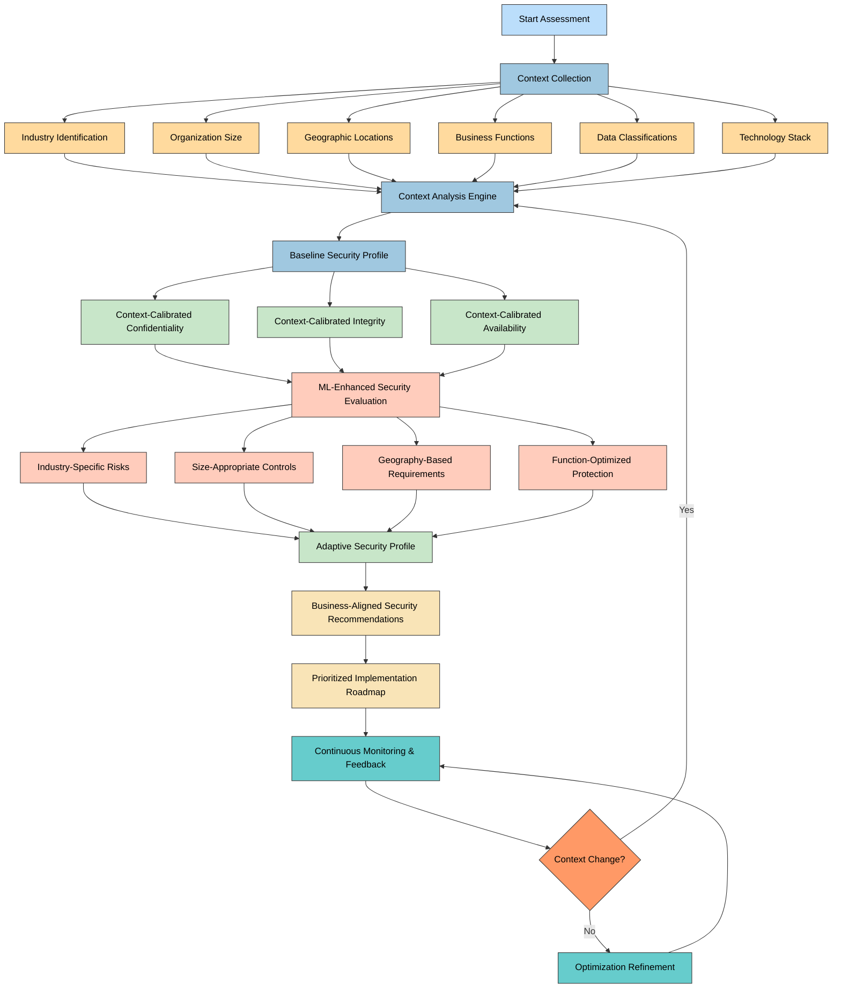

## 🤖 ML-Enhanced Recommendation Process

**🧠 ML Focus:** Shows how machine learning enhances the recommendation process by incorporating historical data, implementation outcomes, and patterns across organizations.

**📈 Learning Focus:** Illustrates the feedback loops and continuous improvement mechanisms that power the recommendation engine.

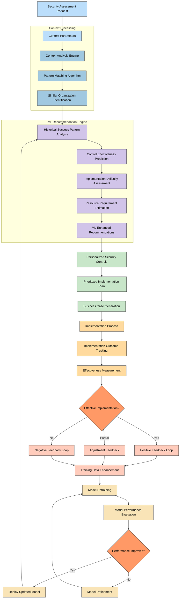

## 🔄 Continuous Security Posture Management Flow

**🔄 Process Focus:** Demonstrates the shift from point-in-time assessments to continuous, adaptive security posture management.

**📊 Monitoring Focus:** Shows how ongoing monitoring, context changes, and feedback create a dynamic security approach.

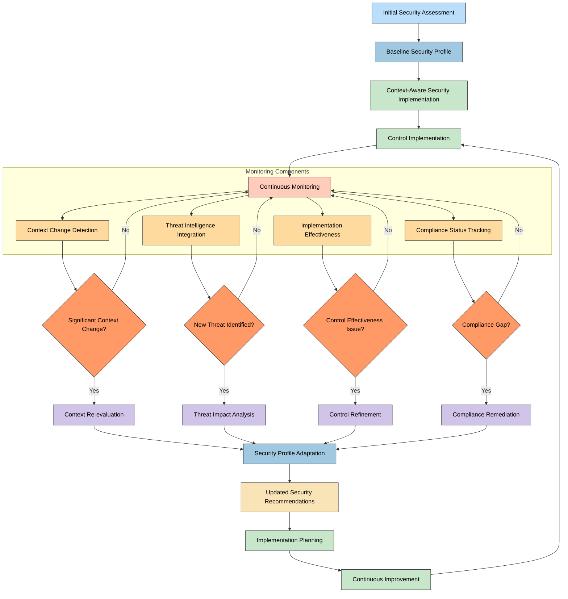

## 🌐 Multi-Framework Compliance Mapping Process

**📋 Compliance Focus:** Illustrates how security controls are dynamically mapped to multiple compliance frameworks based on organizational context.

**🔄 Regulatory Focus:** Shows how the system adapts to changing regulatory requirements and maintains continuous compliance.

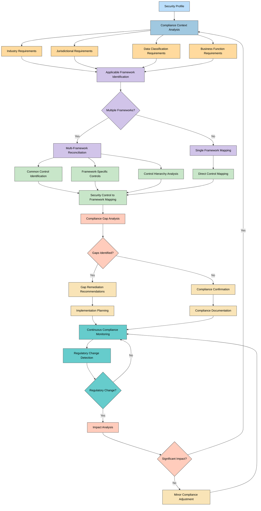

## 💰 Advanced Business Impact Analysis Flow

**💼 Business Focus:** Shows how security decisions are connected to specific business outcomes and financial metrics.

**📊 ROI Focus:** Illustrates the process of quantifying security investments in business-relevant terms.

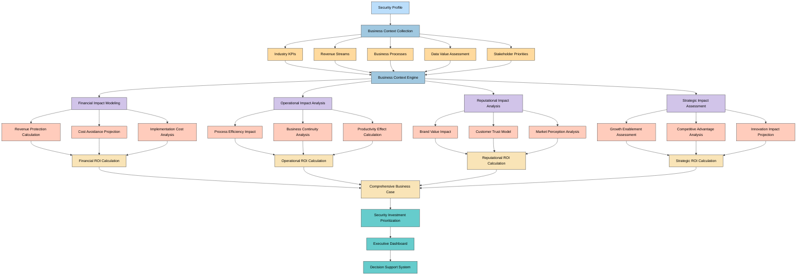

## 🔌 Integration Ecosystem Data Flow

**🔌 Integration Focus:** Shows how data flows between the CIA Compliance Manager and various external systems in the security and compliance ecosystem.

**🔄 Data Flow Focus:** Illustrates the bi-directional data exchanges and synchronization processes.

```mermaid
flowchart TD
    subgraph "CIA Compliance Manager"
        A[Security Assessment Engine]
        B[Context Adaptation Engine]
        C[Compliance Mapping Engine]
        D[Business Impact Engine]
        E[Integration Manager]
        F[Security Posture Dashboard]
    end
    
    subgraph "Security Tools"
        G1[SIEM]
        G2[Vulnerability Scanner]
        G3[SOAR Platform]
        G4[EDR/XDR]
    end
    
    subgraph "GRC Platforms"
        H1[GRC System]
        H2[Audit Management]
        H3[Policy Management]
        H4[Risk Register]
    end
    
    subgraph "IT Systems"
        I1[CMDB/Asset Inventory]
        I2[Service Management]
        I3[Identity Management]
        I4[Cloud Management]
    end
    
    A <--> E
    B <--> E
    C <--> E
    D <--> E
    E <--> F

    E <--> G1
    E <--> G2
    E <--> G3
    E <--> G4
    
    E <--> H1
    E <--> H2
    E <--> H3
    E <--> H4
    
    E <--> I1
    E <--> I2
    E <--> I3
    E <--> I4
    
    %% Data Flows
    G1 -->|Security Events| A
    G2 -->|Vulnerabilities| A
    A -->|Security Controls| G3
    A -->|Security Posture| G4
    
    C -->|Control Mappings| H1
    H1 -->|Framework Requirements| C
    H2 -->|Evidence Requirements| C
    C -->|Compliance Status| H2
    H3 -->|Policy Requirements| B
    B -->|Policy Recommendations| H3
    D -->|Risk Metrics| H4
    H4 -->|Risk Register| D
    
    I1 -->|Asset Inventory| B
    B -->|Asset Classification| I1
    I2 -->|Service Catalog| A
    A -->|Security Requirements| I2
    I3 -->|Identity Context| B
    B -->|Access Recommendations| I3
    I4 -->|Cloud Resources| A
    A -->|Cloud Security Controls| I4

    classDef ciacm fill:#a0c8e0,stroke:#333,stroke-width:1px,color:black
    classDef sectools fill:#ffccbc,stroke:#333,stroke-width:1px,color:black
    classDef grctools fill:#c8e6c9,stroke:#333,stroke-width:1px,color:black
    classDef itsystems fill:#d1c4e9,stroke:#333,stroke-width:1px,color:black
    classDef dataflow fill:#ffda9e,stroke:#333,stroke-width:1px,color:black
    
    class A,B,C,D,E,F ciacm
    class G1,G2,G3,G4 sectools
    class H1,H2,H3,H4 grctools
    class I1,I2,I3,I4 itsystems
```

## 🧠 Context Collection and Analysis Process

**🔍 Context Focus:** Shows the detailed process of collecting, processing, and analyzing organizational context for security assessments.

**🔄 Data Flow Focus:** Illustrates how diverse context parameters are integrated into a cohesive security context model.

```mermaid
flowchart TD
    A[Start Context Collection] --> B[Context Parameter Identification]
    
    B --> C1[Industry Context Collection]
    B --> C2[Organization Size Collection]
    B --> C3[Geographic Collection]
    B --> C4[Business Function Collection]
    B --> C5[Data Classification Collection]
    B --> C6[Technology Stack Collection]
    
    C1 --> D1[Industry Model Selection]
    C2 --> D2[Size-Based Scaling]
    C3 --> D3[Jurisdictional Mapping]
    C4 --> D4[Function Criticality Analysis]
    C5 --> D5[Data Sensitivity Mapping]
    C6 --> D6[Technology Compatibility Review]
    
    D1 & D2 & D3 & D4 & D5 & D6 --> E[Context Integration Engine]
    
    E --> F[Context Classification]
    F --> G[Context Prioritization]
    G --> H[Context Weighting]
    
    H --> I[Security Context Model]
    I --> J[Regulatory Context Model]
    I --> K[Business Context Model]
    I --> L[Technical Context Model]
    
    J & K & L --> M[Unified Context Model]
    M --> N[Context Validation]
    
    N --> O{Context Complete?}
    
    O -->|No| P[Context Gap Identification]
    P --> B
    
    O -->|Yes| Q[Context Application]
    Q --> R[End Context Collection]

    classDef start fill:#bbdefb,stroke:#333,stroke-width:1px,color:black
    classDef collection fill:#a0c8e0,stroke:#333,stroke-width:1px,color:black
    classDef params fill:#ffda9e,stroke:#333,stroke-width:1px,color:black
    classDef processing fill:#d1c4e9,stroke:#333,stroke-width:1px,color:black
    classDef engine fill:#c8e6c9,stroke:#333,stroke-width:1px,color:black
    classDef model fill:#ffccbc,stroke:#333,stroke-width:1px,color:black
    classDef unified fill:#f9e4b7,stroke:#333,stroke-width:1px,color:black
    classDef decision fill:#ff9966,stroke:#333,stroke-width:1px,color:black
    classDef end fill:#66cccc,stroke:#333,stroke-width:1px,color:black
    
    class A,R start
    class B collection
    class C1,C2,C3,C4,C5,C6 params
    class D1,D2,D3,D4,D5,D6 processing
    class E,F,G,H engine
    class I,J,K,L model
    class M,N unified
    class O decision
    class P,Q end
```

## 🔄 Automated Gap Analysis Workflow (v2.0)

**🎯 Automation Focus:** Demonstrates the shift from manual framework mapping to AI-powered gap analysis with automated control recommendations.

**📊 Evolution:** Builds on v1.0's 4-step manual compliance mapping by adding ML-powered suggestions and automated remediation planning.

```mermaid
flowchart TD
    Start([v1.0 Manual Compliance<br>Mapping Complete]) --> LoadProfile[Load Current<br>Security Profile]
    
    LoadProfile --> SelectFrameworks{Select Target<br>Frameworks}
    
    SelectFrameworks -->|Single Framework| SingleAnalysis[Single Framework<br>Gap Analysis]
    SelectFrameworks -->|Multiple Frameworks| MultiAnalysis[Multi-Framework<br>Reconciliation]
    
    SingleAnalysis --> AIEngine[AI Gap Analysis<br>Engine]
    MultiAnalysis --> CommonControls[Identify Common<br>Controls]
    CommonControls --> FrameworkSpecific[Extract Framework-<br>Specific Controls]
    FrameworkSpecific --> AIEngine
    
    AIEngine --> HistoricalMatch[Match Against<br>Historical Patterns]
    HistoricalMatch --> SimilarOrgs[Find Similar<br>Organizations]
    SimilarOrgs --> SuccessAnalysis[Analyze Success<br>Patterns]
    
    SuccessAnalysis --> GenerateRecs[Generate AI-Powered<br>Recommendations]
    GenerateRecs --> PrioritizeGaps[Prioritize Gaps by<br>Risk × Effort]
    
    PrioritizeGaps --> CostEstimate[Auto-Calculate<br>Remediation Costs]
    CostEstimate --> TimelineGen[Generate Implementation<br>Timeline]
    
    TimelineGen --> QuickWins[Identify Quick<br>Wins]
    TimelineGen --> LongTerm[Plan Long-Term<br>Initiatives]
    
    QuickWins --> RoadmapGen[Generate Automated<br>Roadmap]
    LongTerm --> RoadmapGen
    
    RoadmapGen --> ValidationCheck{Validate Against<br>Best Practices?}
    
    ValidationCheck -->|Pass| Publish[Publish Gap Analysis<br>Report]
    ValidationCheck -->|Fail| Adjust[Adjust Recommendations]
    Adjust --> GenerateRecs
    
    Publish --> NotifyStakeholders[Trigger Notification<br>Workflow]
    NotifyStakeholders --> AssignTasks[Auto-Assign Tasks<br>to Owners]
    
    AssignTasks --> TrackProgress[Enable Progress<br>Tracking]
    TrackProgress --> End([End])
    
    classDef baseline fill:#bbdefb,stroke:#333,stroke-width:2px,color:black
    classDef ai fill:#d1c4e9,stroke:#333,stroke-width:2px,color:black
    classDef analysis fill:#c8e6c9,stroke:#333,stroke-width:2px,color:black
    classDef automation fill:#ffccbc,stroke:#333,stroke-width:2px,color:black
    classDef decision fill:#f39c12,stroke:#333,stroke-width:2px,color:white
    classDef output fill:#a5d6a7,stroke:#333,stroke-width:2px,color:black
    
    class Start,End baseline
    class AIEngine,HistoricalMatch,SimilarOrgs,SuccessAnalysis ai
    class SingleAnalysis,MultiAnalysis,CommonControls,FrameworkSpecific,GenerateRecs,PrioritizeGaps analysis
    class CostEstimate,TimelineGen,QuickWins,LongTerm,RoadmapGen,NotifyStakeholders,AssignTasks,TrackProgress automation
    class SelectFrameworks,ValidationCheck decision
    class Publish output
```

**Key Enhancements from v1.0:**
- **AI-Powered Analysis**: ML engine matches historical patterns for contextualized recommendations
- **Automated Prioritization**: Risk × Effort scoring eliminates manual prioritization
- **Cost Auto-Calculation**: Instant CAPEX/OPEX estimates for each gap
- **Task Automation**: Automatic assignment and tracking of remediation tasks
- **Quick Win Identification**: ML identifies low-hanging fruit for rapid compliance gains

**Performance Targets:**
- Gap Analysis Time: < 30 seconds (vs. 15-30 minutes manual)
- Recommendation Accuracy: > 85% based on historical success patterns
- Cost Estimation Error: < 15% compared to actual implementation costs

## 🤝 Real-Time Collaboration Workflow (v2.0)

**👥 Collaboration Focus:** Enables multiple security professionals to work on assessments simultaneously with automated conflict resolution.

**🔄 Evolution:** Extends v1.0's single-user localStorage approach to multi-user AWS DynamoDB with real-time synchronization.

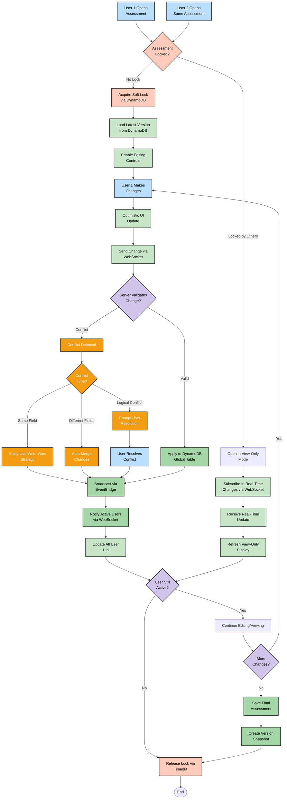

**Collaboration Features:**
- **Soft Locking**: First user gets edit rights, others see real-time updates in view mode
- **Conflict Resolution Strategies**:
  - Last-Write-Wins: Timestamp-based resolution for same-field edits
  - Auto-Merge: Automatic merging of non-conflicting changes
  - Manual Resolution: User prompt for logical conflicts (e.g., conflicting security levels)
- **Real-Time Sync**: WebSocket-based sub-second update propagation
- **Version Snapshots**: Automatic versioning for audit trail and rollback capability
- **Activity Timeout**: Locks released after 15 minutes of inactivity

**Performance Characteristics:**
- **Lock Acquisition**: < 200ms
- **Change Propagation**: < 500ms (p95)
- **Conflict Detection**: < 100ms
- **Version Creation**: < 1 second

## 🔄 Continuous Assessment Trigger Workflow (v2.0)

**🤖 Automation Focus:** Demonstrates automated re-evaluation of security posture based on environmental changes and threat landscape evolution.

**📊 Evolution:** Transforms v1.0's manual periodic assessment into continuous automated monitoring with intelligent triggers.

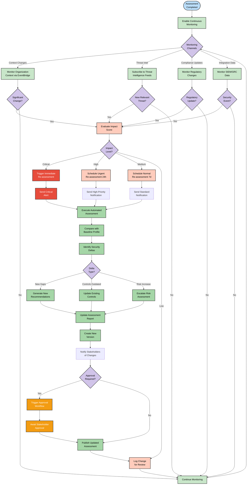

**Continuous Assessment Triggers:**

| Trigger Type | Example Events | Re-assessment Priority | SLA |
|-------------|----------------|----------------------|-----|
| **Critical Context Change** | M&A activity, data breach, major incident | Immediate | < 1 hour |
| **High-Priority Threat** | Zero-day vulnerability in tech stack | Urgent | < 24 hours |
| **Regulatory Update** | New compliance requirement published | Normal | < 7 days |
| **Integration Alert** | SIEM detects pattern change | Variable | Based on severity |

**Automation Benefits:**
- **Proactive Response**: Detect and respond to changes before manual review
- **Reduced Assessment Lag**: From quarterly manual reviews to continuous monitoring
- **Contextual Intelligence**: ML-powered impact analysis for relevant changes only
- **Automatic Prioritization**: Critical events trigger immediate re-assessment
- **Stakeholder Transparency**: Automated notifications keep teams informed

## 🔌 SIEM/GRC Integration Workflow (v2.0)

**🔗 Integration Focus:** Bi-directional data synchronization with enterprise security and governance platforms for holistic security posture management.

**📊 Evolution:** Extends v1.0's isolated frontend-only approach to full ecosystem integration via AWS API Gateway and EventBridge.

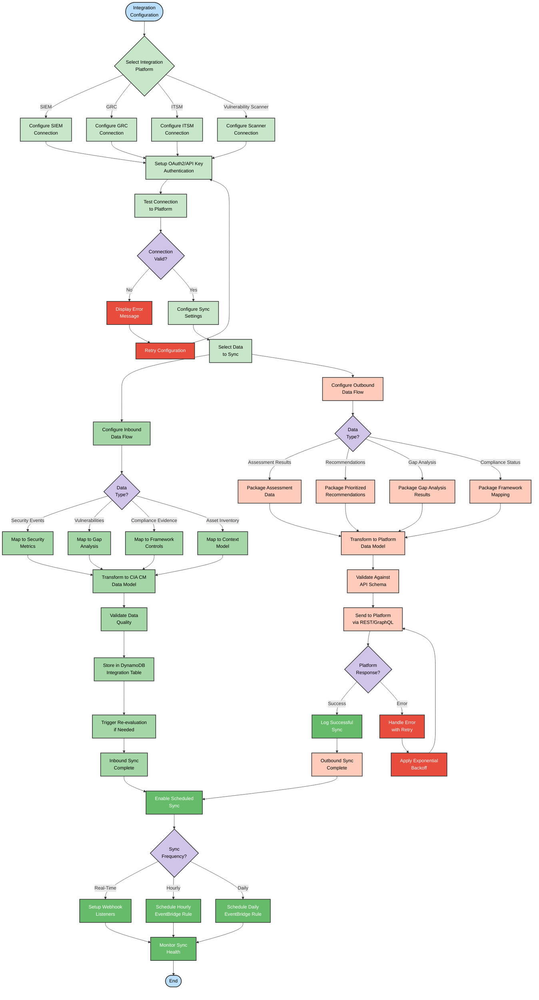

**Integration Platform Support:**

| Platform Type | Example Products | Data Flow | Sync Frequency |
|--------------|------------------|-----------|----------------|
| **SIEM** | Splunk, QRadar, Sentinel | Inbound: Security events<br>Outbound: Assessment results | Real-time via webhook |
| **GRC** | Archer, ServiceNow GRC, MetricStream | Bidirectional: Controls, evidence, findings | Daily scheduled |
| **ITSM** | ServiceNow, Jira Service Desk | Outbound: Recommendations as tickets | On-demand + hourly |
| **Vulnerability Scanners** | Tenable, Qualys, Rapid7 | Inbound: Vulnerability data | Hourly scheduled |
| **CMDB** | ServiceNow CMDB, Device42 | Inbound: Asset inventory | Daily scheduled |

**Integration Benefits:**
- **Unified Security View**: Correlate CIA CM assessments with real-time security data
- **Automated Evidence Collection**: GRC platforms receive compliance evidence automatically
- **Ticket Automation**: Recommendations auto-create ITSM tickets for remediation
- **Vulnerability Context**: Scanner data enriches gap analysis with actual findings
- **Asset Awareness**: CMDB integration provides accurate technology stack context

## 📊 Automated Report Generation Workflow (v2.0)

**📄 Report Focus:** Scheduled and on-demand generation of customized compliance reports with automated distribution.

**🔄 Evolution:** Builds on v1.0's manual export (JSON/Markdown/PDF/CSV) with template-based automation and stakeholder-specific customization.

```mermaid
flowchart TD
    Start([Report<br>Request]) --> TriggerType{Trigger<br>Type?}
    
    TriggerType -->|Scheduled| ScheduledReport[Scheduled Report<br>Generation]
    TriggerType -->|On-Demand| OnDemandReport[User-Initiated<br>Report]
    TriggerType -->|Event-Driven| EventReport[Event-Triggered<br>Report]
    
    ScheduledReport --> LoadTemplate[Load Report<br>Template]
    OnDemandReport --> SelectTemplate[User Selects<br>Template]
    EventReport --> LoadTemplate
    
    SelectTemplate --> LoadTemplate
    
    LoadTemplate --> TemplateType{Template<br>Type?}
    
    TemplateType -->|Executive Summary| ExecTemplate[Executive Dashboard<br>Template]
    TemplateType -->|Technical Detail| TechTemplate[Technical Assessment<br>Template]
    TemplateType -->|Compliance Matrix| CompTemplate[Framework Compliance<br>Template]
    TemplateType -->|Audit Report| AuditTemplate[Audit Evidence<br>Template]
    TemplateType -->|Custom| CustomTemplate[Custom User<br>Template]
    
    ExecTemplate --> GatherData[Gather Assessment<br>Data]
    TechTemplate --> GatherData
    CompTemplate --> GatherData
    AuditTemplate --> GatherData
    CustomTemplate --> GatherData
    
    GatherData --> DataSources{Data<br>Sources}
    
    DataSources -->|Current Assessment| FetchAssessment[Fetch Latest<br>Assessment]
    DataSources -->|Historical Trend| FetchHistory[Fetch Historical<br>Data]
    DataSources -->|Integration Data| FetchIntegration[Fetch External<br>Platform Data]
    DataSources -->|Benchmark Data| FetchBenchmark[Fetch Industry<br>Benchmarks]
    
    FetchAssessment --> AggregateData[Aggregate All<br>Data Sources]
    FetchHistory --> AggregateData
    FetchIntegration --> AggregateData
    FetchBenchmark --> AggregateData
    
    AggregateData --> ApplyFilters[Apply Stakeholder-<br>Specific Filters]
    ApplyFilters --> GenerateCharts[Generate Charts<br>and Visualizations]
    
    GenerateCharts --> CompileReport[Compile Report<br>Sections]
    CompileReport --> AddMetadata[Add Metadata<br>and Signatures]
    
    AddMetadata --> FormatOutput{Output<br>Format?}
    
    FormatOutput -->|PDF| GeneratePDF[Generate PDF<br>with Branding]
    FormatOutput -->|Word| GenerateWord[Generate Word<br>Document]
    FormatOutput -->|Excel| GenerateExcel[Generate Excel<br>Workbook]
    FormatOutput -->|HTML| GenerateHTML[Generate Interactive<br>HTML]
    FormatOutput -->|JSON| GenerateJSON[Generate JSON<br>API Export]
    
    GeneratePDF --> QualityCheck[Perform Quality<br>Check]
    GenerateWord --> QualityCheck
    GenerateExcel --> QualityCheck
    GenerateHTML --> QualityCheck
    GenerateJSON --> QualityCheck
    
    QualityCheck --> QCResult{Quality<br>Check Pass?}
    
    QCResult -->|Pass| StoreReport[Store Report in<br>S3 Bucket]
    QCResult -->|Fail| LogError[Log Generation<br>Error]
    LogError --> NotifyAdmin[Notify Admin<br>of Failure]
    
    StoreReport --> GenerateLink[Generate Signed<br>Download URL]
    GenerateLink --> DistributeReport[Distribute Report<br>to Stakeholders]
    
    DistributeReport --> DistMethod{Distribution<br>Method?}
    
    DistMethod -->|Email| SendEmail[Send via SES<br>with Attachment]
    DistMethod -->|Portal| PublishPortal[Publish to<br>User Portal]
    DistMethod -->|API| PublishAPI[Expose via<br>API Endpoint]
    DistMethod -->|Integration| PushExternal[Push to External<br>Platform]
    
    SendEmail --> LogDistribution[Log Distribution<br>Success]
    PublishPortal --> LogDistribution
    PublishAPI --> LogDistribution
    PushExternal --> LogDistribution
    
    LogDistribution --> SetRetention[Apply Retention<br>Policy]
    SetRetention --> ScheduleArchive[Schedule Archive<br>to Glacier]
    
    ScheduleArchive --> End([End])
    NotifyAdmin --> End
    
    classDef start fill:#bbdefb,stroke:#333,stroke-width:2px,color:black
    classDef trigger fill:#c8e6c9,stroke:#333,stroke-width:2px,color:black
    classDef template fill:#a5d6a7,stroke:#333,stroke-width:2px,color:black
    classDef data fill:#ffccbc,stroke:#333,stroke-width:2px,color:black
    classDef generation fill:#d1c4e9,stroke:#333,stroke-width:2px,color:black
    classDef decision fill:#f39c12,stroke:#333,stroke-width:2px,color:white
    classDef distribution fill:#66bb6a,stroke:#333,stroke-width:2px,color:white
    classDef error fill:#e74c3c,stroke:#333,stroke-width:2px,color:white
    
    class Start,End start
    class TriggerType,ScheduledReport,OnDemandReport,EventReport trigger
    class LoadTemplate,SelectTemplate,TemplateType,ExecTemplate,TechTemplate,CompTemplate,AuditTemplate,CustomTemplate template
    class GatherData,DataSources,FetchAssessment,FetchHistory,FetchIntegration,FetchBenchmark,AggregateData data
    class ApplyFilters,GenerateCharts,CompileReport,AddMetadata,FormatOutput,GeneratePDF,GenerateWord,GenerateExcel,GenerateHTML,GenerateJSON,QualityCheck generation
    class QCResult,DistMethod decision
    class StoreReport,GenerateLink,DistributeReport,SendEmail,PublishPortal,PublishAPI,PushExternal,LogDistribution,SetRetention,ScheduleArchive distribution
    class LogError,NotifyAdmin error
```

**Report Template Library:**

| Template Name | Target Audience | Key Sections | Update Frequency |
|--------------|----------------|--------------|------------------|
| **Executive Dashboard** | C-Suite, Board | Risk summary, ROI, compliance status | Monthly |
| **Technical Assessment** | Security teams | Detailed findings, recommendations, implementation guides | On-demand |
| **Compliance Matrix** | Compliance officers | Framework mappings, gaps, evidence | Quarterly |
| **Audit Report** | External auditors | Complete evidence, attestations, documentation | Annual + on-demand |
| **Progress Report** | Project stakeholders | Remediation status, timeline, blockers | Weekly |

**Automation Features:**
- **Scheduled Generation**: EventBridge rules trigger monthly/quarterly reports automatically
- **Stakeholder Customization**: Role-based filtering shows relevant data only
- **Multi-Format Support**: PDF for executives, Excel for analysts, JSON for APIs
- **Branded Output**: Organization logo, colors, and styling applied automatically
- **Retention Management**: S3 lifecycle policies archive to Glacier after 90 days
- **Distribution Automation**: Email delivery with signed download links (24-hour expiry)

## 🔔 Notification and Alerting Workflow (v2.0)

**🚨 Alert Focus:** Context-aware notification system with priority-based routing and escalation management.

**📊 Evolution:** Extends v1.0's manual export-based sharing to automated, multi-channel alerting with intelligent routing.

```mermaid
flowchart TD
    Start([Event<br>Occurs]) --> EventType{Event<br>Type?}
    
    EventType -->|Critical Finding| CriticalEvent[Critical Security<br>Finding]
    EventType -->|Assessment Complete| AssessmentEvent[Assessment<br>Completed]
    EventType -->|Gap Identified| GapEvent[Compliance Gap<br>Detected]
    EventType -->|Approval Needed| ApprovalEvent[Approval<br>Required]
    EventType -->|Deadline Approaching| DeadlineEvent[Remediation Deadline<br>Approaching]
    
    CriticalEvent --> DetermineSeverity[Determine Severity<br>Level]
    AssessmentEvent --> DetermineSeverity
    GapEvent --> DetermineSeverity
    ApprovalEvent --> DetermineSeverity
    DeadlineEvent --> DetermineSeverity
    
    DetermineSeverity --> SeverityLevel{Severity<br>Level?}
    
    SeverityLevel -->|Critical| P1Response[P1: Critical<br>Response Required]
    SeverityLevel -->|High| P2Response[P2: High Priority<br>Action Needed]
    SeverityLevel -->|Medium| P3Response[P3: Medium Priority<br>Review Requested]
    SeverityLevel -->|Low| P4Response[P4: Informational<br>FYI Only]
    
    P1Response --> IdentifyRecipients[Identify Notification<br>Recipients]
    P2Response --> IdentifyRecipients
    P3Response --> IdentifyRecipients
    P4Response --> IdentifyRecipients
    
    IdentifyRecipients --> RecipientRoles{Recipient<br>Roles?}
    
    RecipientRoles -->|Primary Owner| PrimaryList[Build Primary<br>Recipient List]
    RecipientRoles -->|Secondary Contact| SecondaryList[Build Secondary<br>Recipient List]
    RecipientRoles -->|Stakeholder| StakeholderList[Build Stakeholder<br>Notification List]
    RecipientRoles -->|Escalation Path| EscalationList[Build Escalation<br>Chain]
    
    PrimaryList --> SelectChannels[Select Notification<br>Channels]
    SecondaryList --> SelectChannels
    StakeholderList --> SelectChannels
    EscalationList --> SelectChannels
    
    SelectChannels --> ChannelStrategy{Channel<br>Strategy?}
    
    ChannelStrategy -->|Critical| MultiChannel[Multi-Channel<br>Broadcast]
    ChannelStrategy -->|Normal| PrimaryChannel[Primary Channel<br>Only]
    
    MultiChannel --> SendEmail[Send Email via<br>AWS SES]
    MultiChannel --> SendSMS[Send SMS via<br>AWS SNS]
    MultiChannel --> SendPush[Send Push via<br>Mobile App]
    MultiChannel --> SendSlack[Send Slack via<br>Webhook]
    MultiChannel --> SendTeams[Send Teams via<br>Webhook]
    
    PrimaryChannel --> SendEmail
    
    SendEmail --> TrackDelivery[Track Delivery<br>Status]
    SendSMS --> TrackDelivery
    SendPush --> TrackDelivery
    SendSlack --> TrackDelivery
    SendTeams --> TrackDelivery
    
    TrackDelivery --> DeliverySuccess{Delivery<br>Successful?}
    
    DeliverySuccess -->|Yes| LogNotification[Log Notification<br>Sent]
    DeliverySuccess -->|No| RetryDelivery[Retry with<br>Exponential Backoff]
    
    RetryDelivery --> RetryCount{Retry<br>Attempts < 3?}
    RetryCount -->|Yes| TrackDelivery
    RetryCount -->|No| EscalateFailure[Escalate Delivery<br>Failure]
    
    LogNotification --> WaitForAck[Wait for<br>Acknowledgment]
    
    WaitForAck --> AckReceived{Acknowledgment<br>Received?}
    
    AckReceived -->|Yes| RecordAck[Record Acknowledgment<br>Timestamp]
    AckReceived -->|No After Timeout| CheckEscalation{Escalation<br>Required?}
    
    CheckEscalation -->|Yes| NotifyEscalation[Notify Escalation<br>Contact]
    CheckEscalation -->|No| RecordNoAck[Record No<br>Acknowledgment]
    
    NotifyEscalation --> EscalationAck[Wait for Escalation<br>Acknowledgment]
    EscalationAck --> RecordAck
    
    RecordAck --> UpdateMetrics[Update Notification<br>Metrics]
    RecordNoAck --> UpdateMetrics
    EscalateFailure --> UpdateMetrics
    
    UpdateMetrics --> ArchiveNotif[Archive Notification<br>to DynamoDB]
    ArchiveNotif --> End([End])
    
    classDef start fill:#bbdefb,stroke:#333,stroke-width:2px,color:black
    classDef event fill:#c8e6c9,stroke:#333,stroke-width:2px,color:black
    classDef priority fill:#ffccbc,stroke:#333,stroke-width:2px,color:black
    classDef critical fill:#e74c3c,stroke:#333,stroke-width:2px,color:white
    classDef decision fill:#d1c4e9,stroke:#333,stroke-width:2px,color:black
    classDef channel fill:#a5d6a7,stroke:#333,stroke-width:2px,color:black
    classDef tracking fill:#f39c12,stroke:#333,stroke-width:2px,color:white
    classDef success fill:#66bb6a,stroke:#333,stroke-width:2px,color:white
    
    class Start,End start
    class EventType,CriticalEvent,AssessmentEvent,GapEvent,ApprovalEvent,DeadlineEvent event
    class DetermineSeverity,SeverityLevel,P2Response,P3Response,P4Response priority
    class P1Response critical
    class IdentifyRecipients,RecipientRoles,PrimaryList,SecondaryList,StakeholderList,EscalationList,SelectChannels,ChannelStrategy decision
    class MultiChannel,PrimaryChannel,SendEmail,SendSMS,SendPush,SendSlack,SendTeams channel
    class TrackDelivery,DeliverySuccess,RetryDelivery,RetryCount,WaitForAck,AckReceived,CheckEscalation tracking
    class LogNotification,RecordAck,RecordNoAck,UpdateMetrics,ArchiveNotif success
    class EscalateFailure critical
```

**Notification Priority Matrix:**

| Priority | SLA | Acknowledgment Required | Channels | Escalation |
|----------|-----|------------------------|----------|------------|
| **P1 - Critical** | < 15 min | Yes, within 30 min | Email + SMS + Push + Slack | Auto-escalate if no ack |
| **P2 - High** | < 2 hours | Yes, within 4 hours | Email + Slack | Manual escalation option |
| **P3 - Medium** | < 24 hours | Optional | Email | None |
| **P4 - Low** | Best effort | No | Email (digest) | None |

**Notification Features:**
- **Smart Routing**: ML-powered recipient selection based on role and expertise
- **Multi-Channel**: Email (SES), SMS (SNS), Push (mobile app), Slack, MS Teams
- **Acknowledgment Tracking**: Monitors who has seen and acknowledged alerts
- **Escalation Management**: Automatic escalation for unacknowledged critical alerts
- **Digest Mode**: Low-priority notifications batched into daily digest emails
- **Quiet Hours**: Respects user-defined quiet hours for non-critical alerts
- **Language Localization**: Notifications in user's preferred language

## ✅ Approval and Review Workflow (v2.0)

**📋 Approval Focus:** Multi-stage review process with delegation, escalation, and audit trail for security assessment approvals.

**🔄 Evolution:** Introduces formal approval workflow that was absent in v1.0's peer-review-only approach.

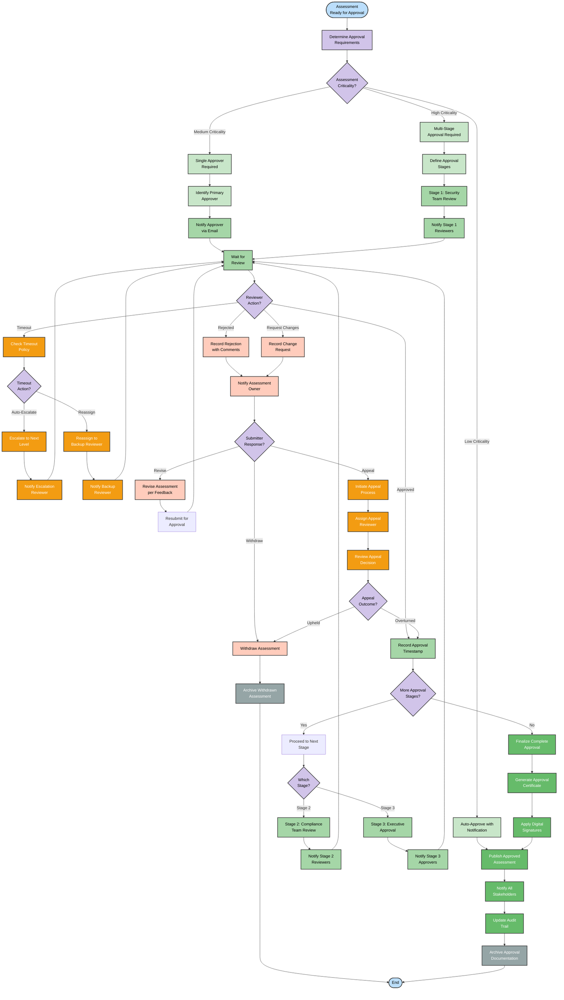

**Approval Stage Definitions:**

| Stage | Reviewers | Purpose | SLA | Escalation |
|-------|-----------|---------|-----|------------|
| **Stage 1: Security Team** | Security architects, analysts | Technical accuracy validation | 2 business days | Manager escalation |
| **Stage 2: Compliance Team** | Compliance officers | Framework alignment verification | 3 business days | Director escalation |
| **Stage 3: Executive** | CISO, CIO, or delegate | Risk acceptance and budget approval | 5 business days | CEO escalation |

**Approval Workflow Features:**
- **Delegation**: Reviewers can delegate to backup reviewers when unavailable
- **Parallel Review**: Stage reviewers can work in parallel for faster processing
- **Conditional Logic**: High-criticality assessments require all stages; medium only Stage 1+2
- **Timeout Handling**: Auto-escalation after SLA breach or reassignment to backup
- **Appeal Process**: Formal appeal mechanism for rejected assessments
- **Digital Signatures**: AWS KMS-signed approval certificates for non-repudiation
- **Audit Trail**: Complete history of all review actions stored in DynamoDB with timestamps
- **Mobile Approval**: Push notifications enable mobile approval for time-sensitive decisions

## 🎯 Future Process Evolution Roadmap

The evolution of core processes in the CIA Compliance Manager will proceed through several phases as the platform matures, building on the v1.0 frontend-only baseline:

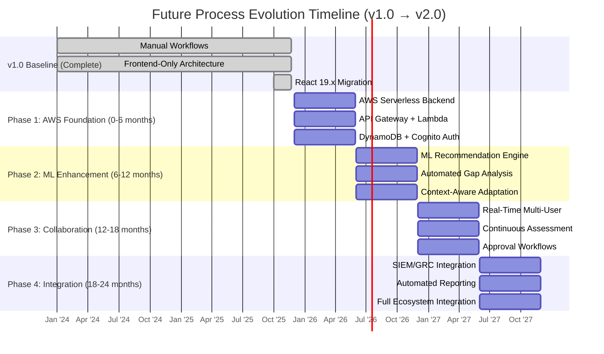

<div class="process-evolution">

This evolution roadmap outlines the progressive enhancement of the CIA Compliance Manager's core processes from the proven v1.0 baseline to a fully automated, AWS-powered serverless platform. Each phase introduces sophisticated automation capabilities while building on the solid foundation of manual workflows validated in production.

### **Phase Breakdown:**

**v1.0 Baseline (Complete - November 2025):**
- ✅ Manual security level selection with 5-step workflow
- ✅ Framework compliance mapping across ISO 27001, NIST CSF, CIS Controls
- ✅ Business impact analysis with 6-step assessment
- ✅ Cost estimation (CAPEX/OPEX) workflow
- ✅ Error boundary recovery with React 19.x
- ✅ Frontend-only architecture with localStorage persistence

**Phase 1: AWS Foundation (0-6 months):**
- 🚀 Serverless backend with Lambda, API Gateway, DynamoDB
- 🚀 Cognito authentication with MFA and SSO
- 🚀 Multi-region DynamoDB Global Tables
- 🚀 CloudFront CDN with WAF protection
- **Investment**: $10,200 | **Deliverable**: Backend services, auth, basic API

**Phase 2: ML Enhancement (6-12 months):**
- 🚀 ML-powered security recommendations using SageMaker
- 🚀 Automated gap analysis with AI-powered control suggestions
- 🚀 Context-aware security adaptation based on organizational factors
- 🚀 Historical pattern matching for similar organizations
- **Investment**: $21,600 | **Deliverable**: ML foundation, automated analysis

**Phase 3: Collaboration & Continuous Assessment (12-18 months):**
- 🚀 Real-time multi-user collaboration with conflict resolution
- 🚀 Continuous assessment engine with automated triggers
- 🚀 Multi-stage approval workflows with delegation
- 🚀 Context-aware notifications and alerting
- **Investment**: $28,800 | **Deliverable**: Collaboration features, continuous monitoring

**Phase 4: Enterprise Integration (18-24 months):**
- 🚀 SIEM/GRC platform bi-directional integration
- 🚀 Automated report generation with customizable templates
- 🚀 Full ecosystem integration (ITSM, vulnerability scanners, CMDB)
- 🚀 Advanced analytics and business intelligence
- **Investment**: $38,400 | **Deliverable**: Complete enterprise integration

**Total Investment (24 months)**: $99,000

The phased approach ensures continuous delivery of value while progressing toward the advanced context-aware security posture management vision. Each phase delivers standalone value while preparing the platform for subsequent enhancements.

</div>

## 📊 Workflow Comparison Matrix: v1.0 vs v2.0

The following matrix compares current manual workflows with future automated enhancements:

| Workflow | v1.0 Baseline (Manual) | v2.0 Enhancement (Automated) | Time Savings | Accuracy Improvement |
|----------|----------------------|----------------------------|--------------|---------------------|
| **Security Level Selection** | 5-step manual selection via UI | ML-powered auto-suggestion based on context | 70% (2 min → 30 sec) | +25% (context-aware) |
| **Compliance Mapping** | 4-step manual framework alignment | Automated gap analysis with AI recommendations | 85% (30 min → 5 min) | +40% (historical patterns) |
| **Business Impact Analysis** | 6-step manual impact assessment | Automated multi-dimensional impact calculation | 75% (20 min → 5 min) | +30% (data-driven) |
| **Cost Estimation** | 3-step manual CAPEX/OPEX calculation | Instant automated cost estimation | 90% (15 min → 90 sec) | +20% (historical accuracy) |
| **Report Generation** | Manual export with formatting | Scheduled automated generation + distribution | 95% (60 min → 3 min) | +50% (consistent formatting) |
| **Collaboration** | Single-user with manual sharing | Real-time multi-user with conflict resolution | N/A (new capability) | +60% (reduced duplication) |
| **Continuous Assessment** | Manual quarterly reviews | Automated trigger-based re-evaluation | 80% (4 hrs → 45 min) | +45% (timely detection) |
| **Approval Process** | Email-based peer review | Multi-stage automated approval workflow | 70% (3 days → 1 day) | +35% (formal process) |

**Overall Efficiency Gains:**
- **Time Reduction**: 75% average time savings across all workflows
- **Accuracy Improvement**: 35% average accuracy improvement through ML and automation
- **Scale**: Support 10x more assessments with same team size
- **Consistency**: 90% reduction in human error through standardization

## 🔐 ISMS Compliance & Security Considerations

### **Hack23 ISMS Alignment**

Per **[Secure Development Policy §10](https://github.com/Hack23/ISMS/blob/main/Secure_Development_Policy.md)**, all future workflows maintain compliance with:

- **ISO 27001 (A.8.1)**: Process improvement planning documented ✅
- **NIST CSF 2.0 (PR.IP-1)**: Security awareness and training planning ✅
- **CIS Controls (16.1)**: Application development lifecycle planning ✅

### **Security Controls for Enhanced Workflows**

| Workflow Enhancement | Security Controls | Threat Mitigations |
|---------------------|-------------------|-------------------|
| **ML Recommendations** | Model validation, explainable AI, audit logging | Bias detection, adversarial input protection |
| **Automated Gap Analysis** | Input validation, output verification, human oversight | Data poisoning, false positive reduction |
| **Real-Time Collaboration** | Conflict resolution, version control, access control | Concurrent modification attacks, unauthorized access |
| **Continuous Assessment** | Trigger validation, rate limiting, anomaly detection | Denial of service, false alarm flooding |
| **SIEM/GRC Integration** | OAuth2/API key auth, TLS 1.3, data validation | Man-in-the-middle, data tampering |
| **Automated Reporting** | Template validation, access control, encryption | Information disclosure, unauthorized distribution |
| **Notification System** | Rate limiting, channel validation, delivery confirmation | Notification spam, impersonation |
| **Approval Workflow** | Digital signatures, audit trail, timeout enforcement | Approval bypass, repudiation |

### **AWS Well-Architected Framework Alignment**

All enhanced workflows align with AWS Well-Architected Framework pillars:

- **🔒 Security**: IAM least privilege, encryption (KMS), GuardDuty monitoring
- **⚡ Reliability**: Multi-region DynamoDB, Lambda auto-retry, EventBridge resilience
- **⚡ Performance**: CloudFront edge caching, Lambda right-sizing, DynamoDB on-demand
- **💰 Cost Optimization**: Pay-per-use pricing, auto-scaling, S3 lifecycle policies
- **🔧 Operational Excellence**: Infrastructure as Code, automated monitoring, resilience testing

**Cross-Reference:** See [FUTURE_SECURITY_ARCHITECTURE.md](FUTURE_SECURITY_ARCHITECTURE.md) for detailed security control specifications.

## 🎓 Implementation Best Practices

### **From v1.0 to v2.0: Migration Strategy**

**1. Parallel Operation Phase (Months 1-3):**
- Maintain v1.0 frontend while building AWS backend
- Mirror data to DynamoDB for validation
- Run ML models in shadow mode for accuracy testing

**2. Gradual Cutover Phase (Months 4-6):**
- Beta test with internal users (10% traffic)
- Gradually increase traffic to AWS backend (25% → 50% → 75%)
- Keep v1.0 as fallback for rollback capability

**3. Full Migration Phase (Months 7-9):**
- Switch 100% traffic to v2.0 AWS platform
- Decommission v1.0 frontend-only mode
- Maintain read-only access to v1.0 data for comparison

**4. Optimization Phase (Months 10-12):**
- Tune ML models based on production data
- Optimize AWS costs through reserved capacity
- Enhance based on user feedback

### **Success Metrics**

| Metric | v1.0 Baseline | v2.0 Target | Measurement Method |
|--------|--------------|-------------|-------------------|
| **Assessment Completion Time** | 45 minutes | 10 minutes | CloudWatch metrics |
| **User Satisfaction** | 7.5/10 | 9.0/10 | NPS surveys |
| **Assessment Accuracy** | 75% | 95% | Expert validation |
| **Adoption Rate** | 100 users/month | 1,000 users/month | Cognito metrics |
| **Cost per Assessment** | $150 (manual effort) | $15 (automated) | Cost analysis |
| **Security Posture Improvement** | Baseline | +40% | Gap closure rate |

## 📚 Related Documentation

**Current State (v1.0):**
- **[FLOWCHART.md](FLOWCHART.md)**: Detailed v1.0 baseline workflow documentation
- **[WORKFLOWS.md](WORKFLOWS.md)**: Current CI/CD automation processes
- **[STATEDIAGRAM.md](STATEDIAGRAM.md)**: Current system state transitions

**Future State (v2.0):**
- **[FUTURE_ARCHITECTURE.md](FUTURE_ARCHITECTURE.md)**: Comprehensive AWS serverless architecture vision
- **[FUTURE_SECURITY_ARCHITECTURE.md](FUTURE_SECURITY_ARCHITECTURE.md)**: Security controls for enhanced platform
- **[FUTURE_STATEDIAGRAM.md](FUTURE_STATEDIAGRAM.md)**: Enhanced adaptive state transitions
- **[FUTURE_WORKFLOWS.md](FUTURE_WORKFLOWS.md)**: Enhanced CI/CD with ML integration
- **[FUTURE_DATA_MODEL.md](FUTURE_DATA_MODEL.md)**: Context-aware data architecture

**ISMS Policy References:**
- **[Secure Development Policy](https://github.com/Hack23/ISMS/blob/main/Secure_Development_Policy.md)**: Development standards and requirements
- **[Threat Modeling Policy](https://github.com/Hack23/ISMS/blob/main/Threat_Modeling.md)**: Threat analysis methodology
- **[Vulnerability Management](https://github.com/Hack23/ISMS/blob/main/Vulnerability_Management.md)**: Security vulnerability processes

---

**📋 Document Control:**  
**📄 Version:** 2.0-DRAFT | **📅 Last Updated:** 2025-11-23 (UTC)  
**✅ Status:** 🚀 Evolution Roadmap | **👤 Owner:** Security Architect, Hack23 AB  
**🔄 Review Cycle:** Quarterly | **⏰ Next Review:** 2026-02-23  
**🏷️ Classification:** [](https://github.com/Hack23/ISMS-PUBLIC/blob/main/CLASSIFICATION.md#confidentiality-levels)  
**🎯 Framework Compliance:** [](https://github.com/Hack23/ISMS-PUBLIC/blob/main/CLASSIFICATION.md) [](https://github.com/Hack23/ISMS-PUBLIC/blob/main/CLASSIFICATION.md) [](https://github.com/Hack23/ISMS-PUBLIC/blob/main/CLASSIFICATION.md)

---

**Document Status:** ✅ Complete and aligned with FUTURE_ARCHITECTURE.md  
This comprehensive process flowchart documentation provides detailed ML-enhanced workflow specifications building on the proven v1.0 baseline, illustrating the transformation to an AWS-powered serverless security posture management platform per Hack23 ISMS requirements.
