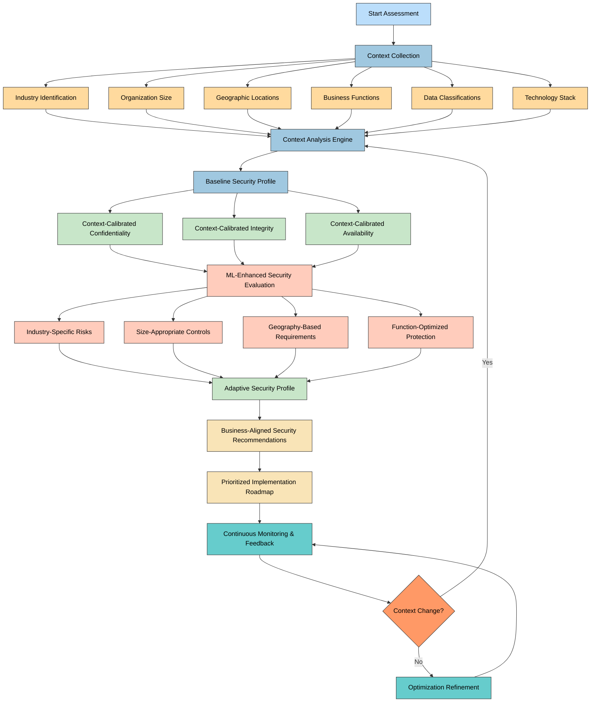
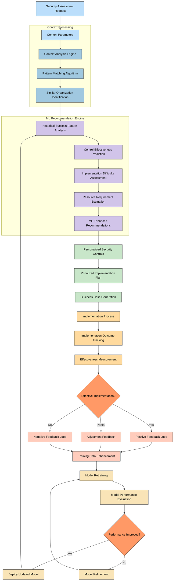
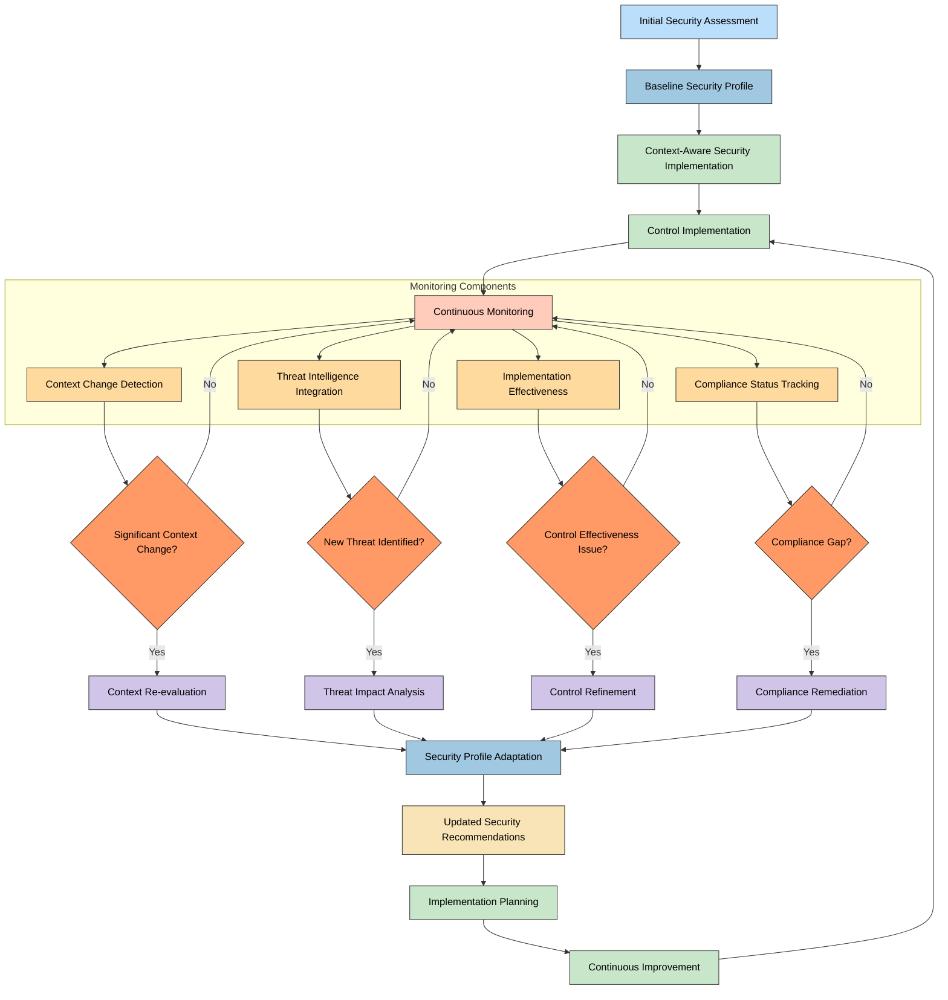
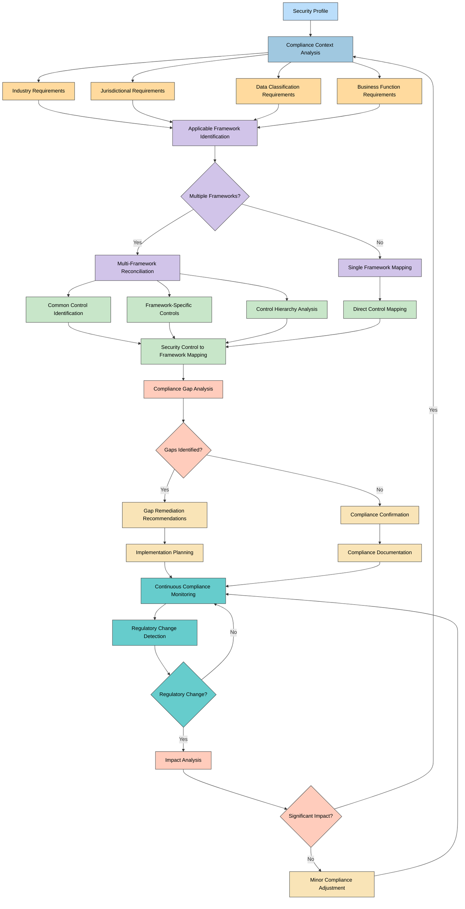
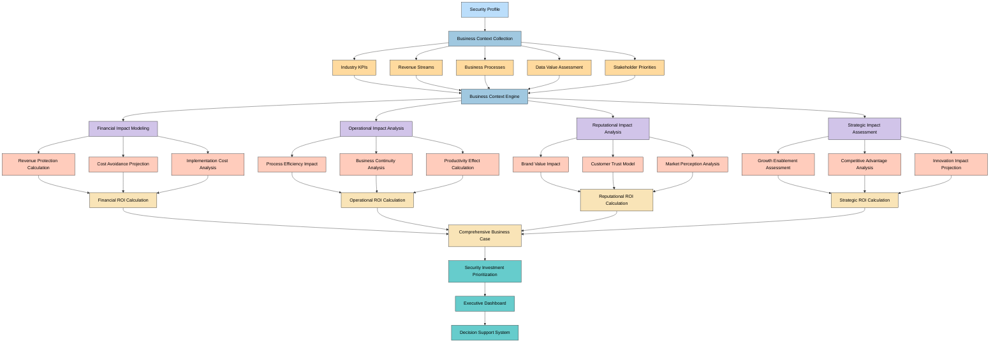
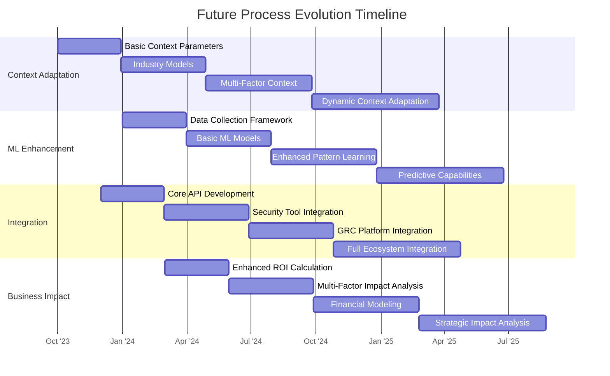

# 🔄 Future CIA Compliance Manager Process Flows

This document outlines the future process flows for the CIA Compliance Manager as it evolves into a context-aware security posture management platform. These enhanced workflows incorporate organizational context, machine learning, and continuous adaptation to provide more tailored and effective security recommendations.

## 📚 Related Architecture Documentation

<div class="documentation-map">

| Document                                            | Focus           | Description                               |
| --------------------------------------------------- | --------------- | ----------------------------------------- |
| **[Current Architecture](ARCHITECTURE.md)**         | 🏛️ Architecture | C4 model showing current system structure |
| **[Future Architecture](FUTURE_ARCHITECTURE.md)**   | 🏛️ Architecture | Vision for context-aware platform         |
| **[State Diagrams](STATEDIAGRAM.md)**               | 🔄 Behavior     | Current system state transitions          |
| **[Future State Diagrams](FUTURE_STATEDIAGRAM.md)** | 🔄 Behavior     | Enhanced adaptive state transitions       |
| **[Process Flowcharts](FLOWCHART.md)**              | 🔄 Process      | Current security workflows                |
| **[Mindmaps](MINDMAP.md)**                          | 🧠 Concept      | Current system component relationships    |
| **[Future Mindmaps](FUTURE_MINDMAP.md)**            | 🧠 Concept      | Future capability evolution               |
| **[SWOT Analysis](SWOT.md)**                        | 💼 Business     | Current strategic assessment              |
| **[Future SWOT Analysis](FUTURE_SWOT.md)**          | 💼 Business     | Future strategic opportunities            |
| **[CI/CD Workflows](WORKFLOWS.md)**                 | 🔧 DevOps       | Current automation processes              |
| **[Future Workflows](FUTURE_WORKFLOWS.md)**         | 🔧 DevOps       | Enhanced CI/CD with ML                    |
| **[Future Data Model](FUTURE_DATA_MODEL.md)**       | 📊 Data         | Context-aware data architecture           |

</div>

## 🧠 Context-Aware Security Assessment Flow

**💼 Business Focus:** Shows how organizational context influences security assessments to produce more tailored, implementable security guidance.

**🔒 Security Focus:** Illustrates how security assessments adapt to specific organizational contexts to deliver more effective security controls.



## 🤖 ML-Enhanced Recommendation Process

**🧠 ML Focus:** Shows how machine learning enhances the recommendation process by incorporating historical data, implementation outcomes, and patterns across organizations.

**📈 Learning Focus:** Illustrates the feedback loops and continuous improvement mechanisms that power the recommendation engine.



## 🔄 Continuous Security Posture Management Flow

**🔄 Process Focus:** Demonstrates the shift from point-in-time assessments to continuous, adaptive security posture management.

**📊 Monitoring Focus:** Shows how ongoing monitoring, context changes, and feedback create a dynamic security approach.



## 🌐 Multi-Framework Compliance Mapping Process

**📋 Compliance Focus:** Illustrates how security controls are dynamically mapped to multiple compliance frameworks based on organizational context.

**🔄 Regulatory Focus:** Shows how the system adapts to changing regulatory requirements and maintains continuous compliance.



## 💰 Advanced Business Impact Analysis Flow

**💼 Business Focus:** Shows how security decisions are connected to specific business outcomes and financial metrics.

**📊 ROI Focus:** Illustrates the process of quantifying security investments in business-relevant terms.



## 🔌 Integration Ecosystem Data Flow

**🔌 Integration Focus:** Shows how data flows between the CIA Compliance Manager and various external systems in the security and compliance ecosystem.

**🔄 Data Flow Focus:** Illustrates the bi-directional data exchanges and synchronization processes.

```mermaid
flowchart TD
    subgraph "CIA Compliance Manager"
        A[Security Assessment Engine]
        B[Context Adaptation Engine]
        C[Compliance Mapping Engine]
        D[Business Impact Engine]
        E[Integration Manager]
        F[Security Posture Dashboard]
    end
    
    subgraph "Security Tools"
        G1[SIEM]
        G2[Vulnerability Scanner]
        G3[SOAR Platform]
        G4[EDR/XDR]
    end
    
    subgraph "GRC Platforms"
        H1[GRC System]
        H2[Audit Management]
        H3[Policy Management]
        H4[Risk Register]
    end
    
    subgraph "IT Systems"
        I1[CMDB/Asset Inventory]
        I2[Service Management]
        I3[Identity Management]
        I4[Cloud Management]
    end
    
    A <--> E
    B <--> E
    C <--> E
    D <--> E
    E <--> F

    E <--> G1
    E <--> G2
    E <--> G3
    E <--> G4
    
    E <--> H1
    E <--> H2
    E <--> H3
    E <--> H4
    
    E <--> I1
    E <--> I2
    E <--> I3
    E <--> I4
    
    %% Data Flows
    G1 -->|Security Events| A
    G2 -->|Vulnerabilities| A
    A -->|Security Controls| G3
    A -->|Security Posture| G4
    
    C -->|Control Mappings| H1
    H1 -->|Framework Requirements| C
    H2 -->|Evidence Requirements| C
    C -->|Compliance Status| H2
    H3 -->|Policy Requirements| B
    B -->|Policy Recommendations| H3
    D -->|Risk Metrics| H4
    H4 -->|Risk Register| D
    
    I1 -->|Asset Inventory| B
    B -->|Asset Classification| I1
    I2 -->|Service Catalog| A
    A -->|Security Requirements| I2
    I3 -->|Identity Context| B
    B -->|Access Recommendations| I3
    I4 -->|Cloud Resources| A
    A -->|Cloud Security Controls| I4

    classDef ciacm fill:#a0c8e0,stroke:#333,stroke-width:1px,color:black
    classDef sectools fill:#ffccbc,stroke:#333,stroke-width:1px,color:black
    classDef grctools fill:#c8e6c9,stroke:#333,stroke-width:1px,color:black
    classDef itsystems fill:#d1c4e9,stroke:#333,stroke-width:1px,color:black
    classDef dataflow fill:#ffda9e,stroke:#333,stroke-width:1px,color:black
    
    class A,B,C,D,E,F ciacm
    class G1,G2,G3,G4 sectools
    class H1,H2,H3,H4 grctools
    class I1,I2,I3,I4 itsystems
```



## 🧠 Context Collection and Analysis Process

**🔍 Context Focus:** Shows the detailed process of collecting, processing, and analyzing organizational context for security assessments.

**🔄 Data Flow Focus:** Illustrates how diverse context parameters are integrated into a cohesive security context model.

```mermaid
flowchart TD
    A[Start Context Collection] --> B[Context Parameter Identification]
    
    B --> C1[Industry Context Collection]
    B --> C2[Organization Size Collection]
    B --> C3[Geographic Collection]
    B --> C4[Business Function Collection]
    B --> C5[Data Classification Collection]
    B --> C6[Technology Stack Collection]
    
    C1 --> D1[Industry Model Selection]
    C2 --> D2[Size-Based Scaling]
    C3 --> D3[Jurisdictional Mapping]
    C4 --> D4[Function Criticality Analysis]
    C5 --> D5[Data Sensitivity Mapping]
    C6 --> D6[Technology Compatibility Review]
    
    D1 & D2 & D3 & D4 & D5 & D6 --> E[Context Integration Engine]
    
    E --> F[Context Classification]
    F --> G[Context Prioritization]
    G --> H[Context Weighting]
    
    H --> I[Security Context Model]
    I --> J[Regulatory Context Model]
    I --> K[Business Context Model]
    I --> L[Technical Context Model]
    
    J & K & L --> M[Unified Context Model]
    M --> N[Context Validation]
    
    N --> O{Context Complete?}
    
    O -->|No| P[Context Gap Identification]
    P --> B
    
    O -->|Yes| Q[Context Application]
    Q --> R[End Context Collection]

    classDef start fill:#bbdefb,stroke:#333,stroke-width:1px,color:black
    classDef collection fill:#a0c8e0,stroke:#333,stroke-width:1px,color:black
    classDef params fill:#ffda9e,stroke:#333,stroke-width:1px,color:black
    classDef processing fill:#d1c4e9,stroke:#333,stroke-width:1px,color:black
    classDef engine fill:#c8e6c9,stroke:#333,stroke-width:1px,color:black
    classDef model fill:#ffccbc,stroke:#333,stroke-width:1px,color:black
    classDef unified fill:#f9e4b7,stroke:#333,stroke-width:1px,color:black
    classDef decision fill:#ff9966,stroke:#333,stroke-width:1px,color:black
    classDef end fill:#66cccc,stroke:#333,stroke-width:1px,color:black
    
    class A,R start
    class B collection
    class C1,C2,C3,C4,C5,C6 params
    class D1,D2,D3,D4,D5,D6 processing
    class E,F,G,H engine
    class I,J,K,L model
    class M,N unified
    class O decision
    class P,Q end
```

## 🎯 Future Process Evolution Roadmap

The evolution of core processes in the CIA Compliance Manager will proceed through several phases as the platform matures:



<div class="process-evolution">
This evolution roadmap outlines the progressive enhancement of the CIA Compliance Manager's core processes. Each phase introduces more sophisticated capabilities while building on the foundation established in previous phases:

1. **Context Adaptation**: From basic parameters to dynamic, multi-factor context sensitivity
2. **ML Enhancement**: From data collection to predictive security posture management
3. **Integration Ecosystem**: From core API to comprehensive security and GRC tool integration
4. **Business Impact Analysis**: From basic ROI to sophisticated financial and strategic impact modeling

The phased approach ensures continuous delivery of value while progressing toward the advanced context-aware security posture management vision.
</div>
