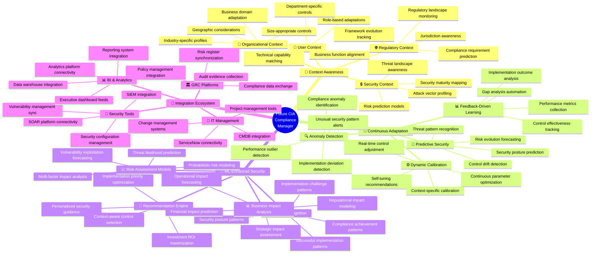
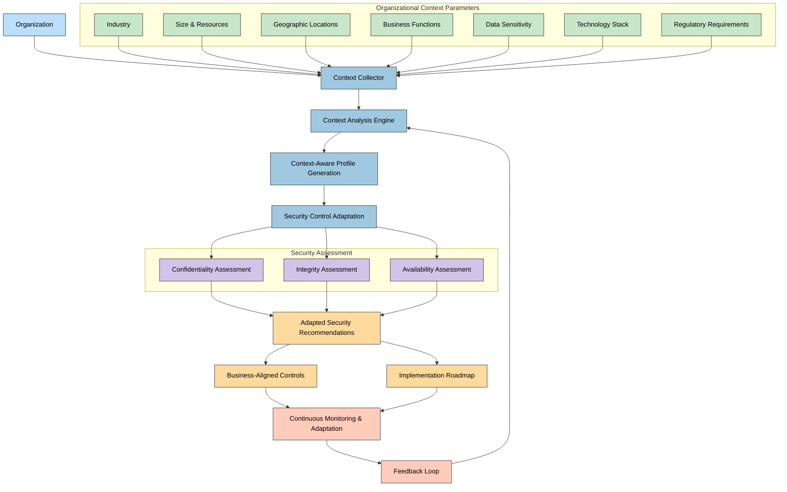
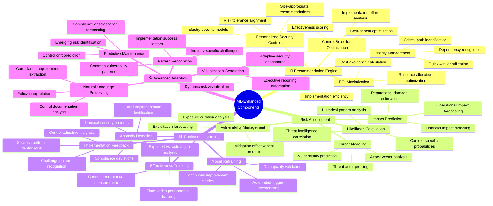
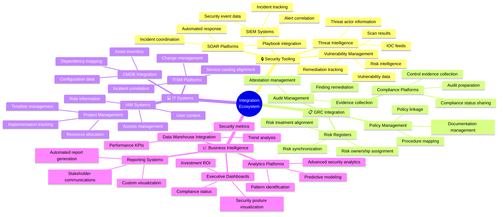
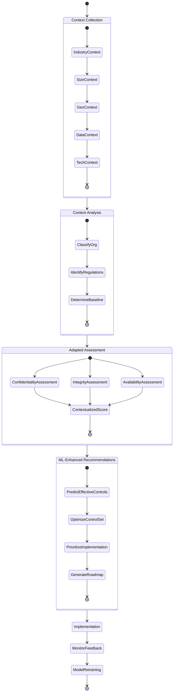

# 🧠 CIA Compliance Manager Future Architecture Mindmap

This document outlines the future vision and architecture evolution for the CIA Compliance Manager, focusing on enhanced context awareness, integration capabilities, and advanced analytics.

## 📚 Related Architecture Documentation

<div class="documentation-map">

| Document                                            | Focus           | Description                               |
| --------------------------------------------------- | --------------- | ----------------------------------------- |
| **[Current Architecture](ARCHITECTURE.md)**         | 🏛️ Architecture | C4 model showing current system structure |
| **[Future Architecture](FUTURE_ARCHITECTURE.md)**   | 🏛️ Architecture | Vision for context-aware platform         |
| **[State Diagrams](STATEDIAGRAM.md)**               | 🔄 Behavior     | Current system state transitions          |
| **[Future State Diagrams](FUTURE_STATEDIAGRAM.md)** | 🔄 Behavior     | Enhanced adaptive state transitions       |
| **[Process Flowcharts](FLOWCHART.md)**              | 🔄 Process      | Current security workflows                |
| **[Future Flowcharts](FUTURE_FLOWCHART.md)**        | 🔄 Process      | Enhanced context-aware workflows          |
| **[Mindmaps](MINDMAP.md)**                          | 🧠 Concept      | Current system component relationships    |
| **[SWOT Analysis](SWOT.md)**                        | 💼 Business     | Current strategic assessment              |
| **[Future SWOT Analysis](FUTURE_SWOT.md)**          | 💼 Business     | Future strategic opportunities            |
| **[CI/CD Workflows](WORKFLOWS.md)**                 | 🔧 DevOps       | Current automation processes              |
| **[Future Workflows](FUTURE_WORKFLOWS.md)**         | 🔧 DevOps       | Enhanced CI/CD with ML                    |
| **[Future Data Model](FUTURE_DATA_MODEL.md)**       | 📊 Data         | Context-aware data architecture           |

</div>

## 🚀 Evolution Vision Overview



## 🎯 Context-Aware Security Architecture

**🔒 Security Focus:** Shows how security assessments will adapt to specific organizational contexts.

**🏢 Business Focus:** Demonstrates how business factors influence security recommendations and controls.



## 🧠 Machine Learning Component Architecture

**🤖 ML Focus:** Illustrates the machine learning components that will enhance security recommendations and business impact analysis.

**🔧 Technical Focus:** Shows the technical implementation of ML models within the system.



## 🔌 Integration Ecosystem Mindmap

**🔄 Integration Focus:** Shows the comprehensive ecosystem of external systems and data sources that will connect with the future CIA Compliance Manager.

**🏢 Enterprise Focus:** Illustrates how the platform will function within the broader enterprise architecture.



## 🔍 Context Parameters and Influence Matrix

The table below shows how different organizational context parameters influence security recommendations and controls in the future architecture.

| Context Parameter           | Impact on Security Controls                                     | Impact on Business Alignment                               | Implementation Adaptation                               |
|-----------------------------|-----------------------------------------------------------------|-----------------------------------------------------------|--------------------------------------------------------|
| 🏭 Industry                 | Industry-specific threat models and controls                    | Alignment with industry compliance requirements           | Tailored implementation guides for industry context     |
| 📊 Organization Size        | Scaled controls appropriate for resource constraints            | ROI calculations based on organization scale              | Right-sized implementation approaches                   |
| 🌐 Geographic Presence      | Region-specific privacy and data protection controls            | Jurisdictional compliance requirements                     | Location-aware implementation sequencing                |
| 💾 Data Sensitivity         | Protection controls based on data classification                | Business impact linked to data protection                  | Prioritized implementation for sensitive data systems   |
| 💼 Business Function        | Function-specific security requirements                         | Business process alignment                                 | Workflow-aware implementation                           |
| 🤖 Technology Stack         | Technology-appropriate security controls                        | Technical debt and capability consideration                | Integration-aware implementation approach               |
| 📊 Security Maturity        | Progressive security controls matching maturity                 | Realistic security improvement roadmap                     | Capability-appropriate implementation                   |
| 🔐 Risk Appetite            | Calibrated control selection matching risk tolerance            | Security investment aligned with risk strategy             | Risk-aware implementation prioritization                |
| 🧩 Third-Party Ecosystem    | Supply chain and integration security controls                  | Vendor/partner risk management                             | Ecosystem-aware implementation coordination             |

## 🔄 Future Security Assessment Flow

This diagram shows the flow of security assessments in the context-aware future architecture.



## 🔮 Future Evolution Roadmap

```mermaid
timeline
    title Future Architecture Evolution Roadmap
    section Phase 1: Enhanced Context Collection
        Q1 2024 : Basic organizational context model
                : Industry-specific security templates
                : Simple context adaptation
    section Phase 2: ML-Enhanced Recommendations
        Q3 2024 : Initial ML recommendation models
                : Pattern-based security suggestions
                : Feedback collection mechanisms
    section Phase 3: Integration Ecosystem
        Q1 2025 : Security tool integrations
                : GRC platform connectors
                : BI & reporting integration
    section Phase 4: Advanced Adaptation
        Q3 2025 : Self-learning recommendation engine
                : Predictive security posture modeling
                : Dynamic control adaptation
    section Phase 5: Autonomous Security
        Q1 2026 : Autonomous security optimization
                : Predictive compliance management
                : Continuous contextual adaptation
```

<div class="evolution-phases">
This evolution roadmap outlines the progressive enhancement of the CIA Compliance Manager from its current state to a fully context-aware, adaptive security posture management platform. Each phase builds upon the previous one, gradually introducing more sophisticated capabilities while maintaining backward compatibility with existing implementations.

The transition will emphasize continual user value delivery, with each phase providing meaningful improvements to security assessment accuracy, recommendation relevance, and business alignment. This approach ensures that organizations can benefit from enhanced capabilities throughout the evolution process rather than waiting for the final vision to be realized.
</div>
