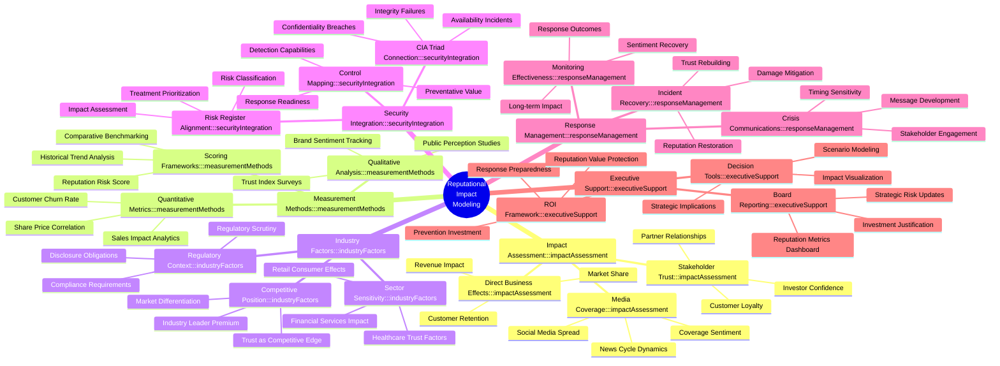
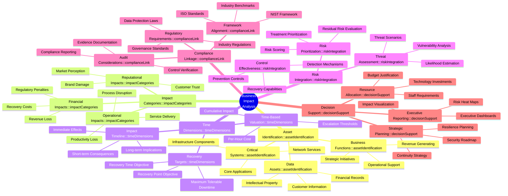

# 🧠 CIA Compliance Manager Future Architecture Mindmap

This document outlines the future vision and architecture evolution for the CIA Compliance Manager, focusing on enhanced context awareness, integration capabilities, and advanced analytics.

## 📚 Related Architecture Documentation

| Document                                            | Focus           | Description                               |
| --------------------------------------------------- | --------------- | ----------------------------------------- |
| **[Current Architecture](ARCHITECTURE.md)**         | 🏛️ Architecture | C4 model showing current system structure |
| **[Future Architecture](FUTURE_ARCHITECTURE.md)**   | 🏛️ Architecture | Vision for context-aware platform         |
| **[State Diagrams](STATEDIAGRAM.md)**               | 🔄 Behavior     | Current system state transitions          |
| **[Future State Diagrams](FUTURE_STATEDIAGRAM.md)** | 🔄 Behavior     | Enhanced adaptive state transitions       |
| **[Process Flowcharts](FLOWCHART.md)**              | 🔄 Process      | Current security workflows                |
| **[Future Flowcharts](FUTURE_FLOWCHART.md)**        | 🔄 Process      | Enhanced context-aware workflows          |
| **[Mindmaps](MINDMAP.md)**                          | 🧠 Concept      | Current system component relationships    |
| **[SWOT Analysis](SWOT.md)**                        | 💼 Business     | Current strategic assessment              |
| **[Future SWOT Analysis](FUTURE_SWOT.md)**          | 💼 Business     | Future strategic opportunities            |
| **[CI/CD Workflows](WORKFLOWS.md)**                 | 🔧 DevOps       | Current automation processes              |
| **[Future Workflows](FUTURE_WORKFLOWS.md)**         | 🔧 DevOps       | Enhanced CI/CD with ML                    |
| **[Future Data Model](FUTURE_DATA_MODEL.md)**       | 📊 Data         | Context-aware data architecture           |

## 🚀 Evolution Vision Overview

```mermaid
mindmap
  root((Future CIA<br/>Compliance<br/>Manager))
    🧠 Context Awareness
      🏢 Organizational Context
        Industry-specific profiles
        Size-appropriate controls
        Business domain adaptation
        Geographic considerations
      🔒 Security Context
        Threat landscape awareness
        Attack vector profiling
        Risk prediction models
        Security maturity mapping
      👤 User Context
        Role-based adaptations
        Department-specific controls
        Business function alignment
        Technical capability matching
      🌐 Regulatory Context
        Jurisdiction awareness
        Regulatory landscape monitoring
        Compliance requirement prediction
        Framework evolution tracking
    🔄 Continuous Adaptation
      📊 Feedback-Driven Learning
        Implementation outcome analysis
        Control effectiveness tracking
        Performance metrics collection
        Gap analysis automation
      🎯 Predictive Security
        Threat pattern recognition
        Risk evolution forecasting
        Control drift detection
        Security posture prediction
      🔍 Anomaly Detection
        Implementation deviation detection
        Unusual security pattern alerts
        Compliance anomaly identification
        Performance outlier detection
      ⚙️ Dynamic Calibration
        Self-tuning recommendations
        Real-time control adjustment
        Continuous parameter optimization
        Context-specific calibration
    🤖 ML-Enhanced Security
      🔮 Recommendation Engine
        Personalized security guidance
        Context-aware control selection
        Implementation priority optimization
        Investment ROI maximization
      📈 Risk Assessment Models
        Probabilistic risk modeling
        Multi-factor impact analysis
        Threat likelihood prediction
        Vulnerability exploitation forecasting
      🔍 Pattern Recognition
        Security posture patterns
        Successful implementation patterns
        Implementation challenge patterns
        Compliance achievement patterns
      📊 Business Impact Analysis
        Financial impact prediction
        Operational impact forecasting
        Reputational impact modeling
        Strategic impact assessment
    🔌 Integration Ecosystem
      🔐 Security Tools
        SIEM integration
        SOAR platform connectivity
        Vulnerability management sync
        Security configuration management
      🏛️ GRC Platforms
        Compliance data exchange
        Audit evidence collection
        Policy management integration
        Risk register synchronization
      🔧 IT Management
        CMDB integration
        ServiceNow connectivity
        Project management tools
        Change management systems
      📊 BI & Analytics
        Reporting system integration
        Executive dashboard feeds
        Analytics platform connectivity
        Data warehouse integration
```

## 🎯 Context-Aware Security Architecture

**🔒 Security Focus:** Shows how security assessments will adapt to specific organizational contexts.

**🏢 Business Focus:** Demonstrates how business factors influence security recommendations and controls.

## 🧠 Machine Learning Component Architecture

**🤖 ML Focus:** Illustrates the machine learning components that will enhance security recommendations and business impact analysis.

**🔧 Technical Focus:** Shows the technical implementation of ML models within the system.

```mermaid
mindmap
  root((ML-Enhanced<br/>Components))
    🔮 Recommendation Engine
      Personalized Security Controls
        Industry-specific models
        Size-appropriate recommendations
        Risk tolerance alignment
      Control Selection Optimization
        Cost-benefit optimization
        Implementation effort analysis
        Effectiveness scoring
      Priority Management
        Critical path identification
        Dependency recognition
        Quick-win identification
      ROI Maximization
        Cost avoidance calculation
        Implementation efficiency
        Resource allocation optimization
    🎯 Risk Assessment
      Threat Modeling
        Threat actor profiling
        Attack vector analysis
        Vulnerability prediction
      Impact Prediction
        Financial impact modeling
        Operational impact forecasting
        Reputational damage estimation
      Likelihood Calculation
        Historical pattern analysis
        Threat intelligence correlation
        Context-specific probabilities
      Vulnerability Management
        Exploitation forecasting
        Exposure duration analysis
        Mitigation effectiveness prediction
    📊 Continuous Learning
      Implementation Feedback
        Success pattern identification
        Challenge pattern recognition
        Control adjustment signals
      Anomaly Detection
        Outlier implementation identification
        Unusual security patterns
        Compliance deviations
      Effectiveness Tracking
        Control performance measurement
        Expected vs. actual gap analysis
        Time-series performance tracking
      Model Retraining
        Automated trigger mechanisms
        Data quality validation
        Continuous improvement metrics
    🔍 Advanced Analytics
      Pattern Recognition
        Common vulnerability patterns
        Industry-specific challenges
        Implementation success factors
      Natural Language Processing
        Control documentation analysis
        Policy interpretation
        Compliance requirement extraction
      Visualization Generation
        Dynamic risk visualization
        Adaptive security dashboards
        Executive reporting automation
      Predictive Maintenance
        Control drift prediction
        Compliance obsolescence forecasting
        Emerging risk identification
```

## 🔌 Integration Ecosystem Mindmap

**🔄 Integration Focus:** Shows the comprehensive ecosystem of external systems and data sources that will connect with the future CIA Compliance Manager.

**🏢 Enterprise Focus:** Illustrates how the platform will function within the broader enterprise architecture.

```mermaid
mindmap
  root((Integration<br/>Ecosystem))
    🔒 Security Tooling
      SIEM Systems
        Alert correlation
        Security event data
        Incident tracking
      Vulnerability Management
        Vulnerability data
        Scan results
        Remediation tracking
      SOAR Platforms
        Playbook integration
        Automated response
        Incident coordination
      Threat Intelligence
        IOC feeds
        Threat actor information
        Risk intelligence
    📋 GRC Integration
      Compliance Platforms
        Control evidence collection
        Compliance status sharing
        Audit preparation
      Policy Management
        Policy linkage
        Procedure mapping
        Documentation management
      Risk Registers
        Risk synchronization
        Risk treatment alignment
        Risk ownership assignment
      Audit Management
        Evidence collection
        Finding remediation
        Attestation management
    💻 IT Systems
      CMDB Integration
        Asset inventory
        Configuration data
        Dependency mapping
      ITSM Platforms
        Change management
        Incident correlation
        Service catalog alignment
      Project Management
        Implementation tracking
        Resource allocation
        Timeline management
      IAM Systems
        User context
        Role information
        Access management
    📈 Business Intelligence
      Data Warehouse Integration
        Security metrics
        Performance KPIs
        Trend analysis
      Executive Dashboards
        Security posture visualization
        Compliance status
        Investment ROI
      Analytics Platforms
        Advanced security analytics
        Predictive modeling
        Pattern identification
      Reporting Systems
        Automated report generation
        Custom visualization
        Stakeholder communications
```

## 🔍 Context Parameters and Influence Matrix

The table below shows how different organizational context parameters influence security recommendations and controls in the future architecture.

| Context Parameter           | Impact on Security Controls                                     | Impact on Business Alignment                               | Implementation Adaptation                               |
|-----------------------------|-----------------------------------------------------------------|-----------------------------------------------------------|--------------------------------------------------------|
| 🏭 Industry                 | Industry-specific threat models and controls                    | Alignment with industry compliance requirements           | Tailored implementation guides for industry context     |
| 📊 Organization Size        | Scaled controls appropriate for resource constraints            | ROI calculations based on organization scale              | Right-sized implementation approaches                   |
| 🌐 Geographic Presence      | Region-specific privacy and data protection controls            | Jurisdictional compliance requirements                     | Location-aware implementation sequencing                |
| 💾 Data Sensitivity         | Protection controls based on data classification                | Business impact linked to data protection                  | Prioritized implementation for sensitive data systems   |
| 💼 Business Function        | Function-specific security requirements                         | Business process alignment                                 | Workflow-aware implementation                           |
| 🤖 Technology Stack         | Technology-appropriate security controls                        | Technical debt and capability consideration                | Integration-aware implementation approach               |
| 📊 Security Maturity        | Progressive security controls matching maturity                 | Realistic security improvement roadmap                     | Capability-appropriate implementation                   |
| 🔐 Risk Appetite            | Calibrated control selection matching risk tolerance            | Security investment aligned with risk strategy             | Risk-aware implementation prioritization                |
| 🧩 Third-Party Ecosystem    | Supply chain and integration security controls                  | Vendor/partner risk management                             | Ecosystem-aware implementation coordination             |

## 🔄 Future Security Assessment Flow

This diagram shows the flow of security assessments in the context-aware future architecture.

## 🧠 Reputational Impact Modeling Mind Map

## 🧠 Business Impact Analysis Mind Map

## 🔗 Integration with CIA Compliance Manager

This Business Impact Analysis mindmap extends the current BusinessImpactAnalysisWidget capabilities by providing a comprehensive framework for assessing and communicating how security incidents affect business operations across multiple dimensions. It links directly to the CIA triad by helping organizations understand:

- What assets require confidentiality, integrity, and availability protections
- The business consequences of security failures
- How impact analysis drives security control selection and prioritization
- The relationship between impact analysis and compliance requirements

The structured approach ensures that security investments are properly aligned with business priorities and risk tolerance levels, supporting more effective decision-making around security control implementation.

