# 🛡️ CIA Compliance Manager Future Security Architecture

> **Version:** v2.0-DRAFT | **Based on:** v1.0 Baseline | **Last Updated:** 2025-11-23 | **Status:** 🚀 Evolution Roadmap

This document outlines the comprehensive future security architecture for the CIA Compliance Manager as it evolves from v1.0 baseline into a full-stack multi-tenant security assessment, compliance mapping, and analytics SaaS platform leveraging AWS cloud infrastructure, user accounts, and advanced security services.

## 📑 Table of Contents

- [🔐 Security Documentation Map](#-security-documentation-map)
- [🔑 Authentication Architecture (AWS Cognito)](#-authentication-architecture-aws-cognito)
- [📜 Data Integrity & Auditing](#-data-integrity--auditing)
- [📊 Session & Action Tracking](#-session--action-tracking)
- [🔍 Security Event Monitoring](#-security-event-monitoring)
- [🌐 Network Security](#-network-security)
- [🔌 VPC Endpoints Security](#-vpc-endpoints-security)
- [🏗️ High Availability Design](#-high-availability-design)
- [💾 Data Protection](#-data-protection)
- [☁️ AWS Security Infrastructure](#-aws-security-infrastructure)
- [🔰 AWS Foundational Security Best Practices](#-aws-foundational-security-best-practices)
- [🕵️ Threat Detection & Investigation](#-threat-detection--investigation)
- [🔎 Vulnerability Management](#-vulnerability-management)
- [⚡ Resilience & Operational Readiness](#-resilience--operational-readiness)
- [📋 Configuration & Compliance Management](#-configuration--compliance-management)
- [📊 Monitoring & Analytics](#-monitoring--analytics)
- [🤖 Automated Security Operations](#-automated-security-operations)
- [🔒 Application Security](#-application-security)
- [📜 Compliance Framework](#-compliance-framework)
- [🛡️ Defense-in-Depth Strategy](#-defense-in-depth-strategy)
- [🔄 Security Operations](#-security-operations)
- [💰 Security Investment](#-security-investment)
- [🏛️ CI/CD Security Architecture](#-cicd-security-architecture)
- [📝 Conclusion](#-conclusion)

## 🔐 Security Documentation Map

<div class="documentation-map">

### Current Architecture (v1.0 Baseline)
| Document                                                        | Focus          | Description                                         |
| --------------------------------------------------------------- | -------------- | --------------------------------------------------- |
| [Current Security Architecture](SECURITY_ARCHITECTURE.md)       | 🛡️ Security    | v1.0 frontend-only security implementation          |
| [Current Architecture](ARCHITECTURE.md)                         | 🏛️ Architecture | C4 model showing v1.0 system structure              |
| [Current State Diagrams](STATEDIAGRAM.md)                       | 🔄 Behavior    | v1.0 state transitions and error handling           |
| [Current Workflows](WORKFLOWS.md)                               | 🔧 CI/CD       | v1.0 security-hardened CI/CD workflows              |

### Future Architecture Evolution (v2.0+)
| Document                                                        | Focus          | Description                                         |
| --------------------------------------------------------------- | -------------- | --------------------------------------------------- |
| [Future Security Architecture](FUTURE_SECURITY_ARCHITECTURE.md) | 🛡️ Security    | **This document** - AWS cloud security architecture |
| [Future Architecture](FUTURE_ARCHITECTURE.md)                   | 🏛️ Architecture | Vision for context-aware platform                   |
| [Future State Diagrams](FUTURE_STATEDIAGRAM.md)                | 🔄 Behavior    | Context-aware state management and ML-driven states |
| [Future Workflows](FUTURE_WORKFLOWS.md)                         | 🔧 CI/CD       | Enhanced CI/CD with ML model training               |
| [Future SWOT Analysis](FUTURE_SWOT.md)                          | 💼 Business    | Strategic analysis of v2.0 transformation           |
| [Future Flowcharts](FUTURE_FLOWCHART.md)                        | 🔄 Process     | ML-enhanced compliance workflows                    |

### Supporting Documentation
| Document                                    | Focus          | Description                         |
| ------------------------------------------- | -------------- | ----------------------------------- |
| [End-of-Life Strategy](End-of-Life-Strategy.md) | 📅 Lifecycle   | Security patching and updates       |
| [Development Guide](development.md)         | 🔧 Development | Security features and testing       |

</div>

## 🔑 Authentication Architecture (AWS Cognito)

**Status**: ✅ Comprehensive Authentication System - AWS Cognito Integration

```mermaid
flowchart TD
    subgraph "AWS Cognito Authentication Architecture"
        A[👤 Player] -->|"Register/Login"| B[🌐 CloudFront + WAF]
        B -->|"HTTPS + Security Headers"| C[⚛️ React Frontend]
        C -->|"OAuth 2.0/OIDC"| D[🔐 AWS Cognito User Pool]

        D --> E[🔑 Identity Pool]
        E --> F[🛡️ AWS STS Temporary Credentials]
        F --> G[🚪 API Gateway + WAF]
        G --> H[⚙️ Lambda Functions in VPC]

        I[📱 MFA Support] --> D
        J[🔒 Password Policies] --> D
        K[📧 Email Verification] --> D
        L[👥 User Groups] --> D
        M[🔄 Account Recovery] --> D
    end

    style A fill:#2979FF,stroke:#0D47A1,stroke-width:2px,color:white,font-weight:bold
    style B,C fill:#00C853,stroke:#007E33,stroke-width:2px,color:white,font-weight:bold
    style D,E,F fill:#FF6F00,stroke:#E65100,stroke-width:2px,color:white,font-weight:bold
    style G,H fill:#9C27B0,stroke:#6A1B9A,stroke-width:2px,color:white,font-weight:bold
    style I,J,K,L,M fill:#00BCD4,stroke:#00838F,stroke-width:2px,color:white,font-weight:bold
```

### Implementation

CIA Compliance Manager implements comprehensive authentication using AWS Cognito:

#### 🔐 AWS Cognito User Pool

- **✅ User Registration**: Email-based account creation with multi-tenant organization support
- **✅ Multi-Factor Authentication**: SMS, email, and TOTP-based MFA
- **✅ Advanced Password Policies**: Strong complexity & rotation policies
- **✅ Account Recovery**: Secure password reset flows
- **✅ User Groups / Roles**: Role-based access control (Admin, SecurityOfficer, ComplianceManager, Auditor, ReadOnly)
- **✅ Custom Attributes**: Organization ID, department, regulatory scope, assessment history pointers

#### 🔑 AWS Cognito Identity Pool

- **✅ Federated Identities**: Social / enterprise IdP (SAML / OIDC) integration
- **✅ Temporary Credentials**: AWS STS for secure API access with least privilege
- **✅ Fine-Grained Permissions**: IAM roles mapped to platform RBAC roles
- **✅ Limited Trial Access**: Optional constrained evaluation mode

#### 🛡️ Security Features

- **✅ JWT Token Validation**: Secure token-based auth with tenant isolation context
- **✅ Token Refresh**: Automatic credential renewal
- **✅ Session Management**: Configurable timeouts based on activity & risk
- **✅ Rate Limiting**: Brute force & anomaly protections
- **✅ Comprehensive Audit Logging**: All authentication events tracked in CloudTrail

### Domain Integration

- **📂 Organizational Structure Support**: Tenants, business units, and environment segmentation
- **🧪 Assessment History Tracking**: Versioned history of security level & control evaluations
- **📊 Control Implementation Metrics**: Maturity scores, remediation status, drift indicators
- **🔁 Framework Coverage Mapping**: Cross-framework control correlation (e.g., NIST ↔ ISO)
- **🏷️ Tagging & Classification**: Asset / control tagging for risk, criticality, and data class

## 📜 Data Integrity & Auditing

**Status**: ✅ Comprehensive Auditing System - AWS CloudTrail & Config Integration

```mermaid
flowchart TD
    subgraph "Comprehensive Audit Architecture"
        A[👤 Authenticated User] -->|"Action"| B[🚪 API Gateway]
        B -->|"Log Request"| C[📝 CloudTrail]
        B -->|"Execute"| D[⚙️ Lambda Function]
        D -->|"Data Change"| E[🗄️ DynamoDB]

        F[📊 AWS Config] -->|"Monitor"| E
        G[🔍 CloudWatch] -->|"Metrics"| H[📈 Security Dashboard]
        C -->|"Audit Trail"| I[🗂️ S3 Audit Bucket]
        F -->|"Configuration"| I

        J[🔐 Data Lineage] --> E
        K[👤 Author Attribution] --> C
        L[📅 Change History] --> F
        M[🔍 Compliance Reporting] --> I
    end

    style A fill:#2979FF,stroke:#0D47A1,stroke-width:2px,color:white,font-weight:bold
    style B,D fill:#9C27B0,stroke:#6A1B9A,stroke-width:2px,color:white,font-weight:bold
    style C,F,G fill:#FF6F00,stroke:#E65100,stroke-width:2px,color:white,font-weight:bold
    style E,I fill:#00C853,stroke:#007E33,stroke-width:2px,color:white,font-weight:bold
    style H,J,K,L,M fill:#00BCD4,stroke:#00838F,stroke-width:2px,color:white,font-weight:bold
```

### Implementation

CIA Compliance Manager implements comprehensive data auditing:

#### 📝 AWS CloudTrail

- **✅ API Call Logging**: All AWS service calls logged across all regions
- **✅ Data Events**: DynamoDB table access and S3 object access tracking
- **✅ Management Events**: IAM changes, resource modifications, and security changes
- **✅ Insight Events**: Unusual activity patterns and security anomalies detected
- **✅ Multi-Region Deployment**: CloudTrail active in all deployment regions

#### 📊 AWS Config

- **✅ Configuration Monitoring**: All AWS resource configurations continuously tracked
- **✅ Compliance Rules**: Automated compliance checking against security standards
- **✅ Change Timeline**: Complete history of configuration changes with impact analysis
- **✅ Relationship Tracking**: Dependencies between resources mapped and monitored

#### 🔍 Audit Data Protection

- **✅ Immutable Logs**: CloudTrail logs protected from modification with S3 Object Lock
- **✅ Encrypted Storage**: All audit data encrypted at rest with customer-managed KMS keys
- **✅ Access Controls**: Strict IAM policies limiting audit data access to authorized personnel
- **✅ Retention Policies**: Long-term retention for compliance (7 years) with automated lifecycle

### Domain Audit Features

- **🧪 Assessment Lineage**: Immutable record of assessment inputs & computed scores
- **🔄 Control Change Tracking**: Who changed required level / rationale / timestamp
- **📊 Framework Mapping Revisions**: Versioned compliance mapping adjustments
- **🧾 Report Provenance**: Cryptographic hash of exported executive/compliance reports

## 📊 Session & Action Tracking

**Status**: ✅ Comprehensive Session Management - CloudWatch & DynamoDB Integration

```mermaid
flowchart TD
    subgraph "Session & Action Tracking Architecture"
        A[👤 Authenticated User] -->|"Start Session"| B[🔐 Cognito Session]
        B -->|"Generate Token"| C[🎫 JWT Token]
        C -->|"API Calls"| D[🚪 API Gateway]
        D -->|"Log Actions"| E[📊 DynamoDB Sessions Table]

        F[📱 Client Actions] -->|"Combat Data"| G[⚙️ Analytics Lambda]
        G -->|"Store Metrics"| H[📈 CloudWatch Metrics]
        G -->|"Store Details"| I[🗄️ DynamoDB Actions Table]

        J[⏰ Session Timeout] --> B
        K[🌐 IP Tracking] --> E
        L[📋 User Agent] --> E
        M[🎯 Combat Analytics] --> I
        N[📊 Performance Metrics] --> H
    end

    style A fill:#2979FF,stroke:#0D47A1,stroke-width:2px,color:white,font-weight:bold
    style B,C fill:#FF6F00,stroke:#E65100,stroke-width:2px,color:white,font-weight:bold
    style D,G fill:#9C27B0,stroke:#6A1B9A,stroke-width:2px,color:white,font-weight:bold
    style E,I fill:#00C853,stroke:#007E33,stroke-width:2px,color:white,font-weight:bold
    style F,H,J,K,L,M,N fill:#00BCD4,stroke:#00838F,stroke-width:2px,color:white,font-weight:bold
```

### Implementation

CIA Compliance Manager implements detailed session and action tracking:

#### 🔐 Session Management

- **✅ Cognito Sessions**: Secure session tokens with configurable lifetimes and risk-based adjustments
- **✅ Session Analytics**: Login patterns, session duration, geographic distribution analysis
- **✅ Concurrent Sessions**: Intelligent control over multiple device access with security monitoring
- **✅ Session Invalidation**: Ability to revoke sessions remotely with immediate effect

#### 📊 Action Tracking

- **✅ Combat Actions**: Detailed logging of all martial arts techniques performed with precision metrics
- **✅ Vital Point Accuracy**: Precision tracking for educational assessment and skill validation
- **✅ Progress Analytics**: Learning curve analysis and skill development progression monitoring
- **✅ Performance Metrics**: Response times, accuracy rates, improvement trends, and mastery indicators

#### 🔍 Privacy-Compliant Tracking

- **✅ Anonymized Analytics**: Personal data separated from usage patterns with pseudonymization
- **✅ Consent Management**: Granular user control over data collection preferences
- **✅ Data Minimization**: Only collect data necessary for educational and security purposes
- **✅ Right to Deletion**: Complete removal of user data on request with verification

### Domain Tracking Features

- **📊 User Interaction Metrics**: Time-in-assessment, navigation patterns, feature utilization
- **🧪 Assessment Progress Analytics**: Draft vs finalized assessments, approval workflows
- **🛠️ Remediation Lifecycle**: Opening, assignment, SLA tracking, closure validation
- **📈 Trend Insights**: Control maturity evolution & risk reduction over time

## 🔍 Security Event Monitoring

**Status**: ✅ Advanced Security Monitoring - Multi-Service Integration

```mermaid
flowchart TD
    subgraph "Security Event Monitoring Architecture"
        A[🔐 Authentication Events] --> B[📊 Security Lake]
        C[🚪 Authorization Events] --> B
        D[⚙️ System Events] --> B
        E[🌐 Network Events] --> B

        B --> F[🕵️ Amazon Detective]
        B --> G[🛡️ GuardDuty]
        B --> H[📈 Security Hub]

        I[🚨 Real-time Alerts] --> J[📱 SNS Notifications]
        K[📊 Security Dashboard] --> L[🔍 CloudWatch Insights]
        M[🔎 Threat Investigation] --> F
        N[📋 Compliance Reports] --> H

        O[🤖 Automated Response] --> P[⚙️ Lambda Functions]
        Q[🔒 Account Lockout] --> R[🔐 Cognito]
    end

    style A,C,D,E fill:#FF6F00,stroke:#E65100,stroke-width:2px,color:white,font-weight:bold
    style B,F,G,H fill:#9C27B0,stroke:#6A1B9A,stroke-width:2px,color:white,font-weight:bold
    style I,J,K,L,M,N fill:#00C853,stroke:#007E33,stroke-width:2px,color:white,font-weight:bold
    style O,P,Q,R fill:#2979FF,stroke:#0D47A1,stroke-width:2px,color:white,font-weight:bold
```

### Implementation

CIA Compliance Manager implements comprehensive security event monitoring:

#### 🕵️ Amazon Detective

- **✅ Security Investigation**: Automated analysis of security findings with machine learning
- **✅ Visual Investigation**: Graph-based security event correlation and timeline analysis
- **✅ Threat Context**: Rich context for security incidents with behavioral baselines
- **✅ Root Cause Analysis**: Automated investigation workflows with evidence collection

#### 🛡️ Amazon GuardDuty

- **✅ Threat Detection**: Machine learning-based threat identification across all regions
- **✅ Malicious Activity**: Detection of compromised instances, accounts, and data exfiltration
- **✅ Network Monitoring**: Analysis of VPC flow logs and DNS logs for threats
- **✅ Malware Detection**: S3 object scanning for malicious content and data threats

#### 📈 AWS Security Hub

- **✅ Centralized Findings**: Aggregation of all security tool findings with prioritization
- **✅ Compliance Posture**: Automated compliance status reporting with trend analysis
- **✅ Custom Insights**: Tailored security dashboards for Korean martial arts application
- **✅ Remediation Workflows**: Automated response to security findings with escalation

#### 🚨 Real-time Alerting

- **✅ Critical Alerts**: Immediate notification of high-severity events via multiple channels
- **✅ Anomaly Detection**: Unusual usage pattern alerts with machine learning baselines
- **✅ Failed Authentication**: Brute force and credential stuffing detection with geographic analysis
- **✅ Privilege Escalation**: Unauthorized access attempt detection with immediate response

### Domain-Specific Security Events

- **📌 Abnormal Permission Escalation Attempts**
- **⚠️ Rapid Bulk Control Downgrades**
- **🛑 Suspicious Framework Scope Changes**
- **📤 Large Volume Report Exports / Data Exfil Signals**

## 🌐 Network Security

**Status**: ✅ Enterprise Network Security - CloudFront + WAF + VPC Integration

```mermaid
graph TD
    subgraph "Multi-Layer Network Security Architecture"
        A[🌐 Internet] -->|"DNS Query"| B[🛡️ Route53 + DNSSEC]
        B -->|"Verified DNS"| C[⚖️ CloudFront + WAF]
        C -->|"Filtered Traffic"| D[🚪 API Gateway + WAF]
        D -->|"Authenticated"| E[🔒 VPC Private Subnets]

        F[🛡️ Security Headers] --> C
        G[🔒 TLS 1.3] --> C
        H[🚫 DDoS Protection] --> C
        I[🔍 DNS Firewall] --> E
        J[📊 VPC Flow Logs] --> E
        K[🔌 VPC Endpoints] --> E
        L[🛡️ Security Groups] --> E
        M[🚧 NACLs] --> E
        N[📝 DNS Query Logs] --> E
        O[🌍 Multi-Region S3] --> E
    end

    style A fill:#2979FF,stroke:#0D47A1,stroke-width:2px,color:white,font-weight:bold
    style B fill:#FF6F00,stroke:#E65100,stroke-width:2px,color:white,font-weight:bold
    style C,D fill:#9C27B0,stroke:#6A1B9A,stroke-width:2px,color:white,font-weight:bold
    style E fill:#00C853,stroke:#007E33,stroke-width:2px,color:white,font-weight:bold
    style F,G,H,I,J,K,L,M,N,O fill:#00BCD4,stroke:#00838F,stroke-width:2px,color:white,font-weight:bold
```

### Implementation

CIA Compliance Manager implements enterprise-grade network security:

#### ⚖️ CloudFront + WAF Security

- **✅ AWS WAF Integration**: Application-layer protection against OWASP Top 10 and custom threats
- **✅ Advanced Rate Limiting**: Per-IP, per-user, and per-session request rate controls
- **✅ Geo-blocking Capabilities**: Country-based access controls with Korean user prioritization
- **✅ Custom Security Rules**: Korean martial arts application-specific protections
- **✅ Bot Protection**: Advanced bot detection and mitigation with machine learning

#### 🔒 Enhanced Security Headers

```http
# Comprehensive CloudFront Security Headers
Strict-Transport-Security: max-age=31536000; includeSubDomains; preload
Content-Security-Policy: default-src 'self'; script-src 'self' 'unsafe-inline'; style-src 'self' 'unsafe-inline' fonts.googleapis.com; font-src 'self' fonts.gstatic.com data:; img-src 'self' data: *.blacktrigram.com; media-src 'self' *.blacktrigram.com; connect-src 'self' api.blacktrigram.com
X-Content-Type-Options: nosniff
X-Frame-Options: DENY
X-XSS-Protection: 1; mode=block
Referrer-Policy: strict-origin-when-cross-origin
Permissions-Policy: geolocation=(), microphone=(), camera=(), payment=(), usb=(), accelerometer=(self), gyroscope=(self)
Cross-Origin-Embedder-Policy: require-corp
Cross-Origin-Opener-Policy: same-origin
Cross-Origin-Resource-Policy: same-origin
X-Permitted-Cross-Domain-Policies: none
X-Download-Options: noopen
X-DNS-Prefetch-Control: off
Expect-CT: max-age=86400, enforce
```

#### 🔒 VPC Security Architecture

- **✅ Private Subnets**: Lambda functions isolated in private subnets with no internet access
- **✅ Security Groups**: Least-privilege network access controls with detailed logging
- **✅ Network ACLs**: Network-level access control lists for defense in depth
- **✅ VPC Flow Logs**: Complete network traffic monitoring with anomaly detection
- **✅ DNS Firewall**: Protection against DNS-based attacks and data exfiltration
- **✅ DNS Query Logs**: Complete DNS resolution logging for security analysis

#### 🔍 DNS Firewall & Logging Implementation

```yaml
# DNS Firewall Configuration
DNSFirewall:
  Type: AWS::Route53Resolver::FirewallRuleGroup
  Properties:
    Name: BlackTrigramDNSFirewall
    FirewallRules:
      - Name: BlockMaliciousDomains
        Action: BLOCK
        BlockResponse: NODATA
        Priority: 100
        FirewallDomainListId: !Ref MaliciousDomainList
      - Name: AllowKoreanCulturalSites
        Action: ALLOW
        Priority: 200
        FirewallDomainListId: !Ref KoreanCulturalDomainList

# DNS Query Logging
DNSQueryLog:
  Type: AWS::Route53Resolver::ResolverQueryLogConfig
  Properties:
    Name: BlackTrigramDNSLogs
    DestinationArn: !GetAtt DNSLogGroup.Arn

# CloudWatch Log Group for DNS Queries
DNSLogGroup:
  Type: AWS::Logs::LogGroup
  Properties:
    LogGroupName: /aws/route53resolver/blacktrigram-dns-queries
    RetentionInDays: 365
    KmsKeyId: !Ref DNSLogKMSKey
```

#### 🌍 Multi-Region S3 Architecture

```mermaid
graph TD
    subgraph "Multi-Region S3 Security Architecture"
        A[🌐 CloudFront] --> B[📦 S3 Primary<br/>US-East-1]
        A --> C[📦 S3 Secondary<br/>US-West-2]

        B <-->|"🔄 Cross-Region Replication"| C

        D[🔐 S3 Bucket Encryption] --> B
        D --> C

        E[🛡️ S3 Bucket Policies] --> B
        E --> C

        F[📊 S3 Access Logging] --> G[📝 Access Log Bucket]
        B --> F
        C --> F

        H[🔒 S3 Object Lock] --> B
        H --> C
    end

    style A fill:#FF6F00,stroke:#E65100,stroke-width:2px,color:white,font-weight:bold
    style B,C fill:#00C853,stroke:#007E33,stroke-width:2px,color:white,font-weight:bold
    style D,E,F,G,H fill:#00BCD4,stroke:#00838F,stroke-width:2px,color:white,font-weight:bold
```

#### 🔌 VPC Endpoints Implementation

- **✅ S3 Gateway Endpoint**: Private access to S3 buckets containing combat data and assets
- **✅ DynamoDB Gateway Endpoint**: Private database access for user data and sessions
- **✅ Interface Endpoints**: Private access to AWS services (Cognito, STS, CloudWatch, etc.)
- **✅ No Internet Gateway**: Lambda functions with complete isolation from public internet

### Multi-Region Network Security

- **🌍 Primary Region**: US-East-1 (Virginia) for optimal latency to global users
- **🌏 Secondary Region**: US-West-2 (Oregon) for disaster recovery and Asian users
- **🔄 Route53 Health Checks**: Automatic failover between regions with health monitoring
- **⚡ Geo-latency Routing**: Optimal performance based on user location and Korean server proximity

### DNS Security Enhanced Features

#### 🔍 DNS Firewall Configuration

```json
{
  "DNSFirewallRules": {
    "MalwareBlocking": {
      "action": "BLOCK",
      "priority": 100,
      "domains": ["known-malware-domains.txt"],
      "response": "NXDOMAIN"
    },
    "PhishingBlocking": {
      "action": "BLOCK",
      "priority": 200,
      "domains": ["phishing-domains.txt"],
      "response": "NXDOMAIN"
    },
    "KoreanCulturalAllowlist": {
      "action": "ALLOW",
      "priority": 300,
      "domains": [
        "*.korean-culture.org",
        "*.martial-arts.kr",
        "*.taekwondo.org"
      ]
    }
  }
}
```

#### 📝 DNS Query Logging

- **✅ Complete Query Logging**: All DNS queries from VPC logged to CloudWatch
- **✅ Security Analysis**: Automated analysis of DNS patterns for threats
- **✅ Anomaly Detection**: ML-based detection of unusual DNS behavior
- **✅ Compliance**: DNS query logs retained for security auditing

### Enhanced CloudFront Security Headers

```yaml
# CloudFront Response Headers Policy
ResponseHeadersPolicy:
  Type: AWS::CloudFront::ResponseHeadersPolicy
  Properties:
    ResponseHeadersPolicyConfig:
      Name: BlackTrigramSecurityHeaders
      SecurityHeadersConfig:
        StrictTransportSecurity:
          AccessControlMaxAgeSec: 31536000
          IncludeSubdomains: true
          Preload: true
        ContentTypeOptions:
          Override: true
        FrameOptions:
          FrameOption: DENY
          Override: true
        ReferrerPolicy:
          ReferrerPolicy: strict-origin-when-cross-origin
          Override: true
      CustomHeadersConfig:
        Items:
          - Header: X-Permitted-Cross-Domain-Policies
            Value: none
            Override: true
          - Header: X-Download-Options
            Value: noopen
            Override: true
          - Header: X-DNS-Prefetch-Control
            Value: "off"
            Override: true
          - Header: Expect-CT
            Value: "max-age=86400, enforce"
            Override: true
          - Header: Permissions-Policy
            Value: "geolocation=(), microphone=(), camera=(), payment=(), usb=(), accelerometer=(self), gyroscope=(self)"
            Override: true
```

## 🏗️ High Availability Design

**Status**: ✅ Multi-Region High Availability - Route53 + Resilience Hub Integration

```mermaid
graph TD
    subgraph "Multi-Region High Availability Architecture"
        A[🌐 Route53 Geo-latency] --> B[🇺🇸 US-East-1<br/>Primary Region]
        A --> C[🇺🇸 US-West-2<br/>Secondary Region]

        B --> D[⚖️ CloudFront Primary]
        C --> E[⚖️ CloudFront Secondary]

        D --> F[🚪 API Gateway Primary]
        E --> G[🚪 API Gateway Secondary]

        F --> H[⚙️ Lambda Functions<br/>Multi-AZ]
        G --> I[⚙️ Lambda Functions<br/>Multi-AZ]

        H --> J[🗄️ DynamoDB<br/>Global Tables]
        I --> J

        K[🔄 Route53 Health Checks] --> A
        L[📊 Resilience Hub] --> M[🧪 Disaster Recovery Testing]
        N[💾 AWS Backup] --> O[📁 Cross-Region Backup]
    end

    style A fill:#FF6F00,stroke:#E65100,stroke-width:2px,color:white,font-weight:bold
    style B,C fill:#2979FF,stroke:#0D47A1,stroke-width:2px,color:white,font-weight:bold
    style D,E,F,G fill:#9C27B0,stroke:#6A1B9A,stroke-width:2px,color:white,font-weight:bold
    style H,I,J fill:#00C853,stroke:#007E33,stroke-width:2px,color:white,font-weight:bold
    style K,L,M,N,O fill:#00BCD4,stroke:#00838F,stroke-width:2px,color:white,font-weight:bold
```

### Implementation

CIA Compliance Manager implements enterprise-grade high availability:

#### 🌍 Multi-Region Architecture

- **🇺🇸 Primary Region**: US-East-1 (Virginia) serving global traffic with optimal performance
- **🇺🇸 Secondary Region**: US-West-2 (Oregon) for failover, disaster recovery, and Asian users
- **🔄 Active-Active**: Both regions serve traffic with intelligent routing based on performance
- **⚡ Geo-latency Routing**: Route53 directs users to optimal region with health monitoring

#### 🔄 Route53 Advanced Configuration

- **✅ Comprehensive Health Checks**: Continuous monitoring of application endpoints and dependencies
- **✅ Intelligent Failover**: Automatic failover to secondary region with minimal user impact
- **✅ Geo-latency Optimization**: Performance-based routing with Korean user prioritization
- **✅ Weighted Traffic Distribution**: Gradual traffic shifting for deployments and load testing

#### 📊 AWS Resilience Hub Integration

- **✅ Continuous Resilience Assessment**: Real-time evaluation of application resilience posture
- **✅ RTO/RPO Tracking**: Recovery time and recovery point objectives monitoring with alerting
- **✅ Automated DR Testing**: Regular disaster recovery testing and validation with reporting
- **✅ Resilience Recommendations**: AI-powered suggestions for improving application resilience

#### 💾 Comprehensive Backup Strategy

- **✅ Cross-Region Backup**: DynamoDB Global Tables and S3 cross-region replication
- **✅ Automated Scheduling**: Multi-tier backup schedule (hourly, daily, weekly, monthly)
- **✅ Point-in-Time Recovery**: 35-day PITR for DynamoDB with automated testing
- **✅ Backup Vault Encryption**: All backups encrypted with customer-managed KMS keys

### Recovery Objectives

- **🎯 RTO (Recovery Time Objective)**: 15 minutes for full application recovery
- **📊 RPO (Recovery Point Objective)**: 5 minutes maximum data loss tolerance
- **🔄 Availability Target**: 99.9% uptime (8.76 hours downtime annually)
- **📈 Performance Target**: <500ms response time during failover scenarios

### Platform Resilience Features

- **🚀 Continuous Access to Assessment Dashboards**
- **🧮 Preservation of Historical Scorecards & Reports**
- **🔁 In-flight Assessment Session Continuity**
- **✅ Guaranteed Integrity of Archived Compliance Evidence**

## 💾 Data Protection

**Status**: ✅ Enterprise Data Protection - Multi-Layer Encryption + DLP

```mermaid
flowchart TD
    subgraph "Comprehensive Data Protection Architecture"
        A[🔐 Data at Rest] --> B[🗄️ DynamoDB Encryption]
        A --> C[📦 S3 Encryption]
        A --> D[💾 Backup Encryption]

        E[🚀 Data in Transit] --> F[🔒 TLS 1.3]
        E --> G[🔑 API Gateway SSL]
        E --> H[⚖️ CloudFront HTTPS]

        I[🔑 Key Management] --> J[🛡️ AWS KMS]
        J --> K[🔄 Key Rotation]
        J --> L[🎯 Customer Managed Keys]

        M[🛡️ Data Loss Prevention] --> N[🔍 Macie Scanning]
        M --> O[📋 Data Classification]
        M --> P[🚨 Sensitive Data Alerts]

        Q[💾 Backup Strategy] --> R[🌍 Cross-Region Backup]
        Q --> S[📅 Retention Policies]
        Q --> T[🔒 Backup Encryption]
    end

    style A,E fill:#FF6F00,stroke:#E65100,stroke-width:2px,color:white,font-weight:bold
    style B,C,D,F,G,H fill:#00C853,stroke:#007E33,stroke-width:2px,color:white,font-weight:bold
    style I,J,K,L fill:#9C27B0,stroke:#6A1B9A,stroke-width:2px,color:white,font-weight:bold
    style M,N,O,P,Q,R,S,T fill:#00BCD4,stroke:#00838F,stroke-width:2px,color:white,font-weight:bold
```

### Implementation

CIA Compliance Manager implements enterprise-grade data protection:

#### 🔐 Advanced Encryption at Rest

- **✅ DynamoDB Encryption**: Customer-managed KMS keys for all user data and training records
- **✅ S3 Encryption**: SSE-KMS for combat data, user assets, and audit logs
- **✅ Lambda Environment**: Encrypted environment variables for secrets and configuration
- **✅ CloudWatch Logs**: Encrypted log groups for all application and audit data

#### 🚀 Enhanced Encryption in Transit

- **✅ TLS 1.3**: Latest TLS protocol for all communications with perfect forward secrecy
- **✅ Certificate Pinning**: Frontend validation of certificate chains with backup pins
- **✅ HSTS Implementation**: Strict transport security enforcement with preload list
- **✅ End-to-End Encryption**: Encryption maintained from client to backend services

#### 🔑 Advanced Key Management

- **✅ Customer Managed KMS Keys**: Full control over encryption keys with audit logging
- **✅ Automatic Key Rotation**: Annual rotation of encryption keys with zero downtime
- **✅ Granular Key Policies**: Fine-grained permissions for key access with least privilege
- **✅ Cross-Region Key Replication**: KMS multi-region keys for global operations

#### 🛡️ Data Loss Prevention (DLP)

- **✅ Amazon Macie**: Automated discovery and classification of sensitive data
- **✅ PII Detection**: Identification and protection of personally identifiable information
- **✅ Data Classification**: Automatic tagging and protection of sensitive Korean cultural content
- **✅ Access Monitoring**: Unusual data access pattern detection with automated response

#### 💾 Enterprise Backup and Recovery

- **✅ Multi-Tier Backup**: Hourly, daily, weekly, and monthly backup schedules
- **✅ Cross-Region Replication**: Real-time replication to secondary regions
- **✅ Point-in-Time Recovery**: Precise recovery to any point within 35-day window
- **✅ Backup Testing**: Regular restore testing to validate backup integrity

### Korean Martial Arts Data Protection

- **🥋 Training Data Security**: Military-grade encryption for combat performance metrics
- **📊 Progress Analytics Protection**: Secure storage of user advancement and skill data
- **👥 Instructor Data**: Protected storage of teaching credentials and student assessments
- **🏆 Achievement Records**: Immutable, cryptographically signed records of accomplishments

## ☁️ AWS Security Infrastructure

**Status**: ✅ Comprehensive AWS Security Services - Full Integration

```mermaid
graph TD
    subgraph "AWS Security Services Integration"
        A[👤 Identity & Access] --> B[🔐 AWS Cognito]
        A --> C[🔑 AWS IAM]
        A --> D[🛡️ AWS STS]

        E[🕵️ Detection & Response] --> F[🛡️ GuardDuty]
        E --> G[🔍 Detective]
        E --> H[📈 Security Hub]
        E --> I[🔎 Inspector]

        J[📊 Logging & Monitoring] --> K[📝 CloudTrail]
        J --> L[📈 CloudWatch]
        J --> M[📊 Config]
        J --> N[🗂️ Security Lake]

        O[🔒 Data Protection] --> P[🔑 KMS]
        O --> Q[📦 Macie]
        O --> R[🛡️ WAF]

        S[🏗️ Infrastructure] --> T[🔌 VPC]
        S --> U[⚖️ CloudFront]
        S --> V[🚪 API Gateway]
    end

    style A,E,J,O,S fill:#FF6F00,stroke:#E65100,stroke-width:2px,color:white,font-weight:bold
    style B,C,D,F,G,H,I,K,L,M,N,P,Q,R,T,U,V fill:#00C853,stroke:#007E33,stroke-width:2px,color:white,font-weight:bold
```

### Implementation

CIA Compliance Manager implements comprehensive AWS security services:

#### 👤 Identity & Access Management

- **✅ AWS Cognito**: Complete user authentication and authorization with Korean language support
- **✅ AWS IAM**: Service-to-service authentication with fine-grained permissions and monitoring
- **✅ AWS STS**: Temporary credential management and secure role assumption
- **✅ Cross-Account Access**: Secure access patterns for multi-account architecture

#### 🕵️ Advanced Threat Detection & Response

- **✅ Amazon GuardDuty**: ML-powered threat detection across all regions with custom rules
- **✅ Amazon Detective**: Visual security investigation and root cause analysis
- **✅ AWS Security Hub**: Centralized security findings and compliance dashboards
- **✅ Amazon Inspector**: Continuous vulnerability assessment for Lambda functions and containers

#### 📊 Comprehensive Logging & Monitoring

- **✅ AWS CloudTrail**: Complete audit logging across all services with data insights
- **✅ Amazon CloudWatch**: Real-time monitoring, alerting, and log aggregation
- **✅ AWS Config**: Configuration compliance and change tracking with automation
- **✅ Amazon Security Lake**: Centralized security data lake for advanced analytics

#### 🔒 Advanced Data Protection Services

- **✅ AWS KMS**: Centralized key management and encryption with automatic rotation
- **✅ Amazon Macie**: Sensitive data discovery, classification, and protection
- **✅ AWS WAF**: Advanced web application firewall with machine learning protection

### Security Service Integration

- **🔄 Automated Workflows**: Security Hub findings trigger Lambda-based automated responses
- **📊 Unified Dashboard**: Single pane of glass for all security metrics and findings
- **🚨 Intelligent Alerting**: ML-powered alert prioritization with automated escalation
- **📈 Compliance Automation**: Continuous compliance posture assessment with remediation

## 🔰 AWS Foundational Security Best Practices

**Status**: ✅ Complete FSBP Implementation - All Controls Enabled

```mermaid
flowchart TD
    subgraph "AWS Foundational Security Best Practices Implementation"
        A[⚙️ AWS Config Service] --> B[📋 FSBP Standard]
        B --> C[🔍 Compliance Checks]

        D[🛡️ Security Hub] --> E[📊 FSBP Dashboard]
        E --> F[📈 Compliance Score]

        G[🔎 Automated Remediation] --> H[⚙️ Lambda Functions]
        H --> I[🔧 Config Remediation]

        J[📊 Continuous Monitoring] --> K[🚨 Non-Compliance Alerts]
        K --> L[📱 SNS Notifications]

        M[📋 Control Categories] --> N[🔐 IAM Controls]
        M --> O[🌐 Network Controls]
        M --> P[📝 Logging Controls]
        M --> Q[🔒 Encryption Controls]
    end

    style A,D,G,J,M fill:#FF6F00,stroke:#E65100,stroke-width:2px,color:white,font-weight:bold
    style B,C,E,F,H,I,K,L,N,O,P,Q fill:#00C853,stroke:#007E33,stroke-width:2px,color:white,font-weight:bold
```

### Implementation

CIA Compliance Manager implements full AWS Foundational Security Best Practices:

#### 📋 Comprehensive FSBP Controls

- **✅ IAM Password Policy**: Strong password requirements for all users with Korean character support
- **✅ Root Account MFA**: Multi-factor authentication for AWS root account with monitoring
- **✅ CloudTrail Enabled**: Comprehensive audit logging across all regions with data events
- **✅ VPC Flow Logs**: Network traffic logging for security analysis and threat detection
- **✅ S3 Bucket Encryption**: Default encryption for all S3 buckets with customer-managed keys
- **✅ Security Groups**: Restrictive inbound rules with business justification and monitoring

#### 🔍 Continuous Compliance Monitoring

- **✅ Config Rules**: Automated evaluation of resource configurations with custom rules
- **✅ Real-time Dashboard**: Live view of security posture with drill-down capabilities
- **✅ Configuration Drift Detection**: Immediate alerts when configurations deviate from baseline
- **✅ Automated Remediation**: Automatic fixing of common misconfigurations with approval workflows

#### 📊 FSBP Compliance Categories

1. **🔐 Identity and Access Management (IAM)**

   - Root access key checks with automated remediation
   - IAM policy best practices with least privilege enforcement
   - Multi-factor authentication enforcement with compliance tracking

2. **🌐 Network Security**

   - Security group configuration with change monitoring
   - VPC configuration with security validation
   - Network ACL best practices with automated compliance

3. **📝 Logging and Monitoring**

   - CloudTrail configuration with integrity validation
   - CloudWatch alarms with automated response
   - Config service enablement with rule compliance

4. **🔒 Data Protection**
   - S3 bucket encryption with key management
   - EBS volume encryption with automatic remediation
   - Database encryption at rest with compliance validation

### Compliance Scoring & Reporting

- **🎯 Target Score**: 95%+ compliance with all FSBP controls
- **📈 Trending Analysis**: Monthly improvement tracking in compliance posture
- **🚨 Critical Alerts**: Immediate notification for high-severity findings
- **📊 Executive Reporting**: Weekly compliance reports for leadership team

## 🕵️ Threat Detection & Investigation

**Status**: ✅ Advanced Threat Detection - GuardDuty + Detective + Custom Analytics

```mermaid
flowchart TD
    subgraph "Advanced Threat Detection & Investigation"
        A[🛡️ Amazon GuardDuty] --> B[🤖 ML Threat Detection]
        B --> C[🚨 Security Findings]

        D[🔍 Amazon Detective] --> E[📊 Visual Investigation]
        E --> F[🔗 Entity Relationships]

        G[📊 Custom Analytics] --> H[⚙️ Lambda Analytics]
        H --> I[🎯 Korean Martial Arts Specific Threats]

        J[🚨 Automated Response] --> K[🔒 Account Isolation]
        J --> L[📱 Alert Notifications]
        J --> M[🛡️ Blocking Rules]

        N[📈 Threat Intelligence] --> O[🌐 AWS TI Feed]
        N --> P[🔍 IOC Monitoring]
        N --> Q[📊 Threat Landscape]
    end

    style A,D,G,J,N fill:#FF6F00,stroke:#E65100,stroke-width:2px,color:white,font-weight:bold
    style B,C,E,F,H,I,K,L,M,O,P,Q fill:#00C853,stroke:#007E33,stroke-width:2px,color:white,font-weight:bold
```

### Implementation

CIA Compliance Manager implements advanced threat detection:

#### 🛡️ Amazon GuardDuty

- **✅ Multi-Region Deployment**: GuardDuty active in all deployment regions with centralized findings
- **✅ VPC Flow Log Analysis**: Advanced network traffic pattern analysis with ML baselines
- **✅ DNS Log Analysis**: DNS query pattern monitoring with threat intelligence correlation
- **✅ S3 Protection**: S3 bucket access pattern monitoring with data exfiltration detection
- **✅ Malware Detection**: Real-time S3 object malware scanning with quarantine

#### 🔍 Amazon Detective

- **✅ Visual Investigation**: Graph-based security event analysis with timeline correlation
- **✅ Entity Behavior Analysis**: User and resource behavior analysis with anomaly detection
- **✅ Root Cause Analysis**: Automated investigation workflows with evidence collection
- **✅ Threat Hunting**: Proactive threat hunting with custom queries and analysis

#### 🎯 Korean Martial Arts Specific Threats

- **✅ Training Bot Detection**: Automated gameplay detection that violates fair play principles
- **✅ Achievement Fraud**: Impossible skill progression patterns suggesting cheating
- **✅ Account Compromise**: Unusual login patterns or sudden skill changes indicating takeover
- **✅ Data Scraping**: Attempts to extract proprietary Korean martial arts content

#### 🚨 Automated Threat Response

- **✅ Account Lockout**: Automatic suspension of compromised accounts with investigation
- **✅ IP Blocking**: Dynamic WAF rules to block malicious IP addresses
- **✅ Rate Limiting**: Dynamic rate limiting based on threat level and user behavior
- **✅ Alert Escalation**: Tiered alert system with automated escalation to security team

### Threat Investigation Workflows

- **🔍 Security Analyst Workflow**: Standardized investigation procedures with automation
- **🤖 Automated Triage**: Machine learning-based finding prioritization and routing
- **📊 Threat Context**: Enrichment with external threat intelligence and Korean-specific threats
- **📱 Mobile Response**: Critical finding notifications for security team with response capabilities

## 🔎 Vulnerability Management

**Status**: ✅ Comprehensive Vulnerability Management - Inspector + Advanced Scanning

```mermaid
flowchart TD
    subgraph "Comprehensive Vulnerability Management"
        A[🔎 Amazon Inspector] --> B[⚙️ Lambda Scanning]
        A --> C[📦 Container Scanning]
        A --> D[🖥️ EC2 Scanning]

        E[📋 CVE Database] --> F[🔍 Vulnerability Assessment]
        F --> G[📊 Risk Prioritization]

        H[🔧 Patch Management] --> I[⚙️ Lambda Layer Updates]
        H --> J[📦 Dependency Updates]
        H --> K[🔄 CI/CD Integration]

        L[📈 Vulnerability Metrics] --> M[📊 Security Dashboard]
        L --> N[📱 Alert System]
        L --> O[📋 Compliance Reports]

        P[🛡️ Compensating Controls] --> Q[🚪 WAF Rules]
        P --> R[🔒 Network Isolation]
        P --> S[🎯 Access Restrictions]
    end

    style A,E,H,L,P fill:#FF6F00,stroke:#E65100,stroke-width:2px,color:white,font-weight:bold
    style B,C,D,F,G,I,J,K,M,N,O,Q,R,S fill:#00C853,stroke:#007E33,stroke-width:2px,color:white,font-weight:bold
```

### Implementation

CIA Compliance Manager implements comprehensive vulnerability management:

#### 🔎 Amazon Inspector

- **✅ Lambda Function Scanning**: Continuous scanning of all Lambda functions with dependency analysis
- **✅ Container Image Scanning**: ECR image vulnerability assessment with policy enforcement
- **✅ Network Reachability**: Analysis of network paths and exposure assessment
- **✅ SBOM Generation**: Software Bill of Materials for all components with tracking

#### 📋 Advanced Vulnerability Assessment

- **✅ CVE Correlation**: Real-time mapping of findings to Common Vulnerabilities and Exposures
- **✅ Risk Scoring**: CVSS v3.1-based risk prioritization with business impact assessment
- **✅ Exploitability Analysis**: Evaluation of exploit likelihood with threat intelligence
- **✅ Business Impact**: Assessment of vulnerability impact on Korean martial arts training

#### 🔧 Automated Patch Management

- **✅ Automated Updates**: Dependency updates through secure CI/CD pipeline
- **✅ Lambda Layer Management**: Centralized runtime patching with version control
- **✅ Testing Pipeline**: Comprehensive automated testing of patches before deployment
- **✅ Rollback Procedures**: Quick rollback capabilities for problematic patches

#### 📈 Vulnerability Metrics & KPIs

- **✅ Mean Time to Detection**: Average time to identify vulnerabilities (target: <24 hours)
- **✅ Mean Time to Remediation**: Average time to patch vulnerabilities (target: <7 days)
- **✅ Vulnerability Trend Analysis**: Historical trend analysis with predictive modeling
- **✅ Compliance Scoring**: Vulnerability management maturity assessment with benchmarking

### Domain-Specific Vulnerability Concerns

- **🧮 Integrity of Risk Calculation Logic**
- **📊 Unauthorized Manipulation of Cost / ROI Models**
- **🔐 Exposure of Tenant-Separated Compliance Data**
- **🧾 Report Generation Injection / Template Abuse**

## ⚡ Resilience & Operational Readiness

**Status**: ✅ Advanced Resilience - Resilience Hub + Comprehensive DR

```mermaid
flowchart TD
    subgraph "Advanced Resilience & Operational Readiness"
        A[📊 AWS Resilience Hub] --> B[🎯 RTO/RPO Tracking]
        A --> C[🧪 DR Testing]
        A --> D[📈 Resilience Score]

        E[💾 AWS Backup] --> F[🌍 Cross-Region Backup]
        E --> G[📅 Backup Scheduling]
        E --> H[🔒 Backup Encryption]

        I[🔄 Disaster Recovery] --> J[⚙️ Automated Failover]
        I --> K[📊 Health Checks]
        I --> L[🔀 Traffic Shifting]

        M[🏥 Operational Health] --> N[📈 Service Monitoring]
        M --> O[🚨 Alert Management]
        M --> P[📱 Incident Response]

        Q[🧪 Chaos Engineering] --> R[🎭 Fault Injection]
        Q --> S[📊 Resilience Testing]
        Q --> T[🔧 Recovery Validation]
    end

    style A,E,I,M,Q fill:#FF6F00,stroke:#E65100,stroke-width:2px,color:white,font-weight:bold
    style B,C,D,F,G,H,J,K,L,N,O,P,R,S,T fill:#00C853,stroke:#007E33,stroke-width:2px,color:white,font-weight:bold
```

### Implementation

CIA Compliance Manager implements advanced resilience and operational readiness:

#### 📊 AWS Resilience Hub

- **✅ Application Assessment**: Continuous evaluation of application resilience with automated scoring
- **✅ RTO/RPO Monitoring**: Real-time tracking of recovery objectives with alerting
- **✅ Resilience Recommendations**: AI-powered suggestions for improvements with implementation guidance
- **✅ Disaster Recovery Testing**: Automated DR scenario execution with comprehensive reporting

#### 💾 Enterprise Backup Strategy

- **✅ Multi-Tier Backup**: Hourly, daily, weekly, and monthly backup schedules with encryption
- **✅ Cross-Region Replication**: DynamoDB Global Tables and S3 cross-region replication
- **✅ Point-in-Time Recovery**: 35-day PITR for DynamoDB tables with automated testing
- **✅ Backup Validation**: Regular restore testing with automated integrity verification

#### 🔄 Automated Disaster Recovery

- **✅ Route53 Health Checks**: Continuous monitoring of application endpoints with failover
- **✅ Automated Failover**: DNS-based failover to secondary region with traffic shifting
- **✅ Database Promotion**: Automated promotion of read replicas during DR scenarios
- **✅ Application Warmup**: Pre-warming of standby infrastructure with performance validation

#### 🏥 Operational Health Monitoring

- **✅ Service Level Indicators**: Key metrics for Korean martial arts application health
- **✅ Service Level Objectives**: Defined targets for user experience with monitoring
- **✅ Error Budget Management**: Tracking and management of reliability budgets
- **✅ Incident Response**: Automated incident detection, escalation, and communication

### Recovery Objectives

- **🎯 RTO (Recovery Time Objective)**: 15 minutes for full service restoration
- **📊 RPO (Recovery Point Objective)**: 5 minutes maximum data loss tolerance
- **🔄 Availability Target**: 99.9% uptime (43.8 minutes downtime per month)
- **📈 Performance Target**: <500ms API response time during failover scenarios

### Implementation

CIA Compliance Manager implements advanced configuration and compliance management:

#### ⚙️ AWS Config

- **✅ Multi-Region Recording**: Configuration recording across all deployment regions
- **✅ Resource Relationships**: Comprehensive tracking of dependencies between AWS resources
- **✅ Configuration Timeline**: Historical view of all configuration changes with impact analysis
- **✅ Change Notifications**: Real-time alerts for configuration modifications with approval workflows

#### 🛡️ Security Standards Compliance

- **✅ AWS Foundational Security Best Practices**: Full implementation and continuous monitoring
- **✅ PCI DSS**: Payment Card Industry compliance for future payment features
- **✅ ISO 27001**: Information security management standards with certification
- **✅ Custom Standards**: Specific compliance requirements for Korean martial arts data

#### 🔧 Korean Martial Arts Custom Rules

- **✅ Training Data Integrity**: Validation of combat performance data consistency and authenticity
- **✅ Instructor Verification**: Automated verification of instructor credentials and certifications
- **✅ Achievement Validation**: Cryptographic verification of martial arts certifications
- **✅ Progress Validation**: Detection of impossible skill advancement patterns with alerting

#### 🔄 Automated Remediation

- **✅ Self-Healing Infrastructure**: Automatic correction of common misconfigurations
- **✅ Compliance Drift Prevention**: Immediate correction of compliance violations
- **✅ Security Hardening**: Continuous application of security best practices
- **✅ Cost Optimization**: Automated cleanup of unused resources with approval workflows

### Implementation

CIA Compliance Manager implements comprehensive monitoring and analytics:

#### 📈 Amazon CloudWatch

- **✅ Custom Metrics**: Korean martial arts application-specific metrics with dimensions
- **✅ Log Aggregation**: Centralized logging from all application components with parsing
- **✅ Real-time Dashboards**: Live view of application health and performance with drill-down
- **✅ Intelligent Alarms**: ML-powered anomaly detection and alerting with auto-scaling

#### 🗂️ Amazon Security Lake

- **✅ Security Data Centralization**: All security logs in OCSF format for analysis
- **✅ Advanced Querying**: SQL-based security data analysis with custom queries
- **✅ Third-party Integration**: Support for external security tools and threat intelligence
- **✅ Compliance Reporting**: Automated compliance data aggregation and reporting

#### 🥋 Korean Martial Arts Analytics

- **✅ Vital Point Accuracy Tracking**: Detailed analytics on targeting precision with improvement recommendations
- **✅ Trigram Mastery Progression**: Progress through the eight trigram stances with mastery validation
- **✅ Combat Effectiveness**: Win/loss ratios and technique effectiveness analysis
- **✅ Learning Curve Analysis**: Time to mastery and skill development patterns with personalization

#### 📱 Real-time Monitoring

- **✅ Application Performance**: Response times, error rates, throughput with SLA monitoring
- **✅ User Experience**: Client-side performance and user satisfaction metrics
- **✅ Security Events**: Real-time security incident detection and automated response
- **✅ Infrastructure Health**: AWS service health and resource utilization with optimization

### Platform Analytics

- **📈 Control Adoption Velocity**
- **🧪 Remediation SLA Performance**
- **🛡️ Framework Coverage Gaps**
- **💰 Cost vs Maturity Optimization Trends**

## 🤖 Automated Security Operations

**Status**: ✅ Advanced Security Automation - Multi-Service Integration

```mermaid
flowchart TD
    subgraph "Advanced Automated Security Operations"
        A[⏱️ Scheduled Operations] --> B[🔄 Security Patching]
        A --> C[🧹 Security Cleanup]
        A --> D[📊 Security Assessments]

        E[🚨 Event-Driven Automation] --> F[🔒 Incident Response]
        E --> G[🛡️ Threat Mitigation]
        E --> H[📱 Alert Management]

        I[🔧 Self-Healing Security] --> J[⚙️ Config Remediation]
        I --> K[🔒 Access Revocation]
        I --> L[🛡️ Security Hardening]

        M[📊 Security Analytics] --> N[🤖 ML-powered Detection]
        M --> O[🎯 Behavioral Analysis]
        M --> P[📈 Predictive Security]

        Q[🔄 Continuous Improvement] --> R[📊 Security Metrics]
        Q --> S[🎯 Process Optimization]
        Q --> T[🛡️ Control Enhancement]
    end

    style A,E,I,M,Q fill:#FF6F00,stroke:#E65100,stroke-width:2px,color:white,font-weight:bold
    style B,C,D,F,G,H,J,K,L,N,O,P,R,S,T fill:#00C853,stroke:#007E33,stroke-width:2px,color:white,font-weight:bold
```

### Implementation

CIA Compliance Manager implements advanced automated security operations:

#### ⏱️ Scheduled Security Operations

- **✅ Automated Patching**: Lambda layer updates and dependency patching with testing
- **✅ Security Scanning**: Regular vulnerability assessments with trend analysis
- **✅ Access Reviews**: Periodic review and cleanup of permissions with approval workflows
- **✅ Compliance Validation**: Automated compliance posture assessment with reporting

#### 🚨 Event-Driven Security Automation

- **✅ Incident Response**: Automated response to security events with escalation
- **✅ Threat Containment**: Immediate isolation of compromised resources with investigation
- **✅ Evidence Collection**: Automated forensic data gathering with chain of custody
- **✅ Stakeholder Notification**: Automated alert distribution with communication templates

#### 🔧 Self-Healing Security

- **✅ Configuration Drift**: Automatic correction of security misconfigurations
- **✅ Access Anomalies**: Automated revocation of suspicious access with investigation
- **✅ Security Hardening**: Continuous application of security best practices
- **✅ Policy Enforcement**: Automated enforcement of security policies with exceptions

#### 📊 ML-Powered Security Analytics

- **✅ Anomaly Detection**: Machine learning-based threat detection with custom models
- **✅ User Behavior Analytics**: Detection of unusual user patterns with risk scoring
- **✅ Predictive Security**: Forecasting of potential security issues with prevention
- **✅ Risk Scoring**: Automated risk assessment and prioritization with business context

## 🔒 Application Security

**Status**: ✅ Comprehensive Application Security - OWASP Top 10 Mitigations


### Implementation

CIA Compliance Manager implements comprehensive application security:

#### 🔒 Input Validation

- **✅ Allowlist Validation**: Strict validation against known good values for all inputs
- **✅ Blocklist Validation**: Detection and blocking of known bad patterns and values
- **✅ SQL Injection Prevention**: Parameterized queries and ORM usage to prevent SQLi
- **✅ XSS Prevention**: Contextual output encoding and sanitization to prevent XSS

#### 🛡️ WAF Protection

- **✅ AWS WAF Integration**: Custom rules to block common web exploits and bots
- **✅ Rate Limiting**: Protection against brute force and DDoS attacks
- **✅ Geo-blocking**: Restrict access from unwanted geographic locations

#### 🔑 Authentication & Session Management

- **✅ AWS Cognito**: Comprehensive user authentication with MFA and fine-grained permissions
- **✅ Secure Cookies**: HttpOnly and Secure flags set for all cookies
- **✅ Session Expiration**: Inactivity timeout and absolute timeout for all sessions
- **✅ Token Revocation**: Immediate revocation of tokens on password change or logout

#### 📊 Security Monitoring

- **✅ Anomaly Detection**: Monitoring for unusual patterns in application usage
- **✅ Performance Monitoring**: Detection of potential security incidents through performance anomalies
- **✅ Audit Logging**: Comprehensive logging of all security-relevant events

## 📜 Compliance Framework

**Status**: ✅ Comprehensive Compliance Framework - Multi-Standard Support

```mermaid
flowchart TD
    subgraph "Comprehensive Compliance Framework"
        A[📋 Compliance Standards] --> B[🔐 AWS Foundational Security Best Practices]
        A --> C[🛡️ PCI DSS]
        A --> D[🔒 ISO 27001]
        A --> E[📊 Custom Standards]

        F[🔄 Continuous Compliance] --> G[📈 Compliance Monitoring]
        F --> H[🚨 Alerting]
        F --> I[📋 Reporting]

        J[🛠️ Remediation Actions] --> K[🔧 Automated Remediation]
        J --> L[📱 Manual Remediation]
        J --> M[🔄 Continuous Improvement]
    end

    style A fill:#FF6F00,stroke:#E65100,stroke-width:2px,color:white,font-weight:bold
    style B,C,D,E fill:#00C853,stroke:#007E33,stroke-width:2px,color:white,font-weight:bold
    style F,G,H,I,J,K,L,M fill:#9C27B0,stroke:#6A1B9A,stroke-width:2px,color:white,font-weight:bold
```

### Implementation

CIA Compliance Manager implements a comprehensive compliance framework:

#### 📋 Compliance Standards

- **✅ AWS Foundational Security Best Practices**: Full implementation and continuous monitoring
- **✅ PCI DSS**: Payment Card Industry Data Security Standard compliance for payment processing
- **✅ ISO 27001**: Information security management standard compliance
- **✅ Custom Standards**: Specific compliance requirements for Korean martial arts data

#### 🔄 Continuous Compliance

- **✅ Compliance Monitoring**: Real-time monitoring of compliance status with alerts
- **✅ Alerting**: Immediate notification of compliance deviations
- **✅ Reporting**: Regular compliance reports for management and auditors

#### 🛠️ Remediation Actions

- **✅ Automated Remediation**: Immediate correction of common compliance issues
- **✅ Manual Remediation**: Procedures for manual correction of complex issues
- **✅ Continuous Improvement**: Regular review and improvement of compliance processes

## 🛡️ Defense-in-Depth Strategy

**Status**: ✅ Comprehensive Defense-in-Depth Strategy - Multi-Layered Security

```mermaid
flowchart TD
    subgraph "Comprehensive Defense-in-Depth Strategy"
        A[🔒 Perimeter Defense] --> B[🛡️ AWS WAF]
        A --> C[🌐 CloudFront]
        A --> D[🚪 API Gateway]

        E[🔑 Access Control] --> F[🔐 AWS Cognito]
        E --> G[🔑 IAM Roles]

        H[🛡️ Application Security] --> I[🔒 Input Validation]
        H --> J[🛡️ WAF Protection]

        K[📊 Monitoring & Response] --> L[📈 CloudWatch]
        K --> M[🕵️ GuardDuty]
        K --> N[🔍 Detective]

        O[🔄 Incident Management] --> P[📱 Alerting]
        O --> Q[🔧 Remediation]
        O --> R[📊 Reporting]
    end

    style A,E,H,K,O fill:#FF6F00,stroke:#E65100,stroke-width:2px,color:white,font-weight:bold
    style B,C,D,F,G,I,J,L,M,N,P,Q,R fill:#00C853,stroke:#007E33,stroke-width:2px,color:white,font-weight:bold
```

### Implementation

CIA Compliance Manager implements a comprehensive defense-in-depth strategy:

#### 🔒 Perimeter Defense

- **✅ AWS WAF**: Web application firewall to protect against common web exploits
- **✅ CloudFront**: Content delivery network with DDoS protection and caching
- **✅ API Gateway**: Managed API gateway with throttling and security controls

#### 🔑 Access Control

- **✅ AWS Cognito**: User authentication and authorization with MFA
- **✅ IAM Roles**: Fine-grained access control for AWS resources

#### 🛡️ Application Security

- **✅ Input Validation**: Strict validation of all user inputs
- **✅ WAF Protection**: Application-layer protection with AWS WAF

#### 📊 Monitoring & Response

- **✅ CloudWatch**: Real-time monitoring and alerting
- **✅ GuardDuty**: Threat detection and continuous monitoring
- **✅ Detective**: Security investigation and analysis

#### 🔄 Incident Management

- **✅ Alerting**: Immediate notification of security incidents
- **✅ Remediation**: Automated and manual procedures for incident response
- **✅ Reporting**: Comprehensive reporting of security incidents and responses

## 🔄 Security Operations

**Status**: ✅ Advanced Security Operations - 24/7 Monitoring & Response

```mermaid
flowchart TD
    subgraph "Advanced Security Operations Center"
        A[🕵️ Security Monitoring] --> B[📊 Security Dashboard]
        A --> C[🚨 Alerting]
        A --> D[🔍 Investigation]

        E[🔄 Incident Response] --> F[📱 Notifications]
        E --> G[🔧 Remediation]
        E --> H[📋 Reporting]

        I[📈 Threat Intelligence] --> J[🌐 Threat Feeds]
        I --> K[📊 Threat Analysis]

        L[🔒 Vulnerability Management] --> M[🔎 Scanning]
        L --> N[📦 Patching]
        L --> O[🔄 Verification]

        P[📋 Compliance Management] --> Q[🔍 Auditing]
        P --> R[📈 Reporting]
    end

    style A,E,I,L,P fill:#FF6F00,stroke:#E65100,stroke-width:2px,color:white,font-weight:bold
    style B,C,D,F,G,H,J,K,M,N,O,Q,R fill:#00C853,stroke:#007E33,stroke-width:2px,color:white,font-weight:bold
```

### Implementation

CIA Compliance Manager implements advanced security operations:

#### 🕵️ Security Monitoring

- **✅ 24/7 Monitoring**: Continuous monitoring of all security events
- **✅ Centralized Dashboard**: Unified view of security posture and incidents
- **✅ Real-time Alerting**: Immediate notification of critical security events

#### 🔄 Incident Response

- **✅ Automated Response**: Immediate containment and mitigation of incidents
- **✅ Manual Response**: Detailed procedures for security team intervention
- **✅ Post-Incident Analysis**: Review and analysis of incidents for improvement

#### 📈 Threat Intelligence

- **✅ Integrated Threat Feeds**: Real-time threat intelligence from multiple sources
- **✅ Threat Analysis**: In-depth analysis of threats and vulnerabilities

#### 🔒 Vulnerability Management

- **✅ Regular Scanning**: Automated scanning for vulnerabilities in applications and infrastructure
- **✅ Timely Patching**: Rapid deployment of security patches and updates
- **✅ Verification**: Validation of patch deployment and vulnerability remediation

#### 📋 Compliance Management

- **✅ Continuous Auditing**: Regular audits of security controls and compliance
- **✅ Compliance Reporting**: Automated generation of compliance reports

## 📝 Conclusion

The CIA Compliance Manager Future Security Architecture is a comprehensive, multi-layered security framework designed to protect the integrity, availability, and confidentiality of the platform. By leveraging AWS's advanced security services and following best practices for security and compliance, the platform will provide a secure and resilient environment for organizations to perform security assessments, manage compliance mappings, track remediation, and generate assurance reporting.

---
- **✅ AWS Cognito**: User authentication and authorization with MFA
- **✅ IAM Roles**: Fine-grained access control for AWS resources

#### 🛡️ Application Security

- **✅ Input Validation**: Strict validation of all user inputs
- **✅ WAF Protection**: Application-layer protection with AWS WAF

#### 📊 Monitoring & Response

- **✅ CloudWatch**: Real-time monitoring and alerting
- **✅ GuardDuty**: Threat detection and continuous monitoring
- **✅ Detective**: Security investigation and analysis

#### 🔄 Incident Management

- **✅ Alerting**: Immediate notification of security incidents
- **✅ Remediation**: Automated and manual procedures for incident response
- **✅ Reporting**: Comprehensive reporting of security incidents and responses

## 🔄 Security Operations

**Status**: ✅ Advanced Security Operations - 24/7 Monitoring & Response


### Implementation

Black Trigram implements advanced security operations:

#### 🕵️ Security Monitoring

- **✅ 24/7 Monitoring**: Continuous monitoring of all security events
- **✅ Centralized Dashboard**: Unified view of security posture and incidents
- **✅ Real-time Alerting**: Immediate notification of critical security events

#### 🔄 Incident Response

- **✅ Automated Response**: Immediate containment and mitigation of incidents
- **✅ Manual Response**: Detailed procedures for security team intervention
- **✅ Post-Incident Analysis**: Review and analysis of incidents for improvement

#### 📈 Threat Intelligence

- **✅ Integrated Threat Feeds**: Real-time threat intelligence from multiple sources
- **✅ Threat Analysis**: In-depth analysis of threats and vulnerabilities

#### 🔒 Vulnerability Management

- **✅ Regular Scanning**: Automated scanning for vulnerabilities in applications and infrastructure
- **✅ Timely Patching**: Rapid deployment of security patches and updates
- **✅ Verification**: Validation of patch deployment and vulnerability remediation

#### 📋 Compliance Management

- **✅ Continuous Auditing**: Regular audits of security controls and compliance
- **✅ Compliance Reporting**: Automated generation of compliance reports


## 📝 Conclusion

The Black Trigram Future Security Architecture is a comprehensive, multi-layered security framework designed to protect the integrity, availability, and confidentiality of the Black Trigram platform. By leveraging AWS's advanced security services and following best practices for security and compliance, Black Trigram will provide a secure and resilient environment for users to engage in Korean martial arts training and education.

---
