# 🔄 Future CIA Compliance Manager State Diagrams

> **Version:** v2.0-DRAFT | **Based on:** v1.0 Baseline | **Last Updated:** 2025-11-23 | **Status:** 🚀 Evolution Roadmap

This document illustrates the enhanced state transitions and behavioral models planned for the future evolution of the CIA Compliance Manager from v1.0 baseline. These diagrams depict context-aware state management, intelligent state transitions, adaptive UI behaviors, and advanced error recovery patterns for post-v1.0 development.

## 📚 Related Architecture Documentation

### Current Architecture (v1.0 Baseline)
| Document                                            | Focus           | Description                               |
| --------------------------------------------------- | --------------- | ----------------------------------------- |
| **[Current Architecture](ARCHITECTURE.md)**         | 🏛️ Architecture | C4 model showing current system structure |
| **[State Diagrams](STATEDIAGRAM.md)**               | 🔄 Behavior     | **v1.0 BASELINE** - Current state transitions |
| **[Security Architecture](SECURITY_ARCHITECTURE.md)** | 🛡️ Security   | v1.0 security controls and CSP implementation |
| **[Process Flowcharts](FLOWCHART.md)**              | 🔄 Process      | Current security workflows                |
| **[Mindmaps](MINDMAP.md)**                          | 🧠 Concept      | Current system component relationships    |
| **[SWOT Analysis](SWOT.md)**                        | 💼 Business     | Current strategic assessment              |
| **[CI/CD Workflows](WORKFLOWS.md)**                 | 🔧 DevOps       | Current automation processes              |
| **[Data Model](DATA_MODEL.md)**                     | 📊 Data         | Current client-side data structures       |

### Future Architecture Evolution (v2.0+)
| Document                                            | Focus           | Description                               |
| --------------------------------------------------- | --------------- | ----------------------------------------- |
| **[Future Architecture](FUTURE_ARCHITECTURE.md)**   | 🏛️ Architecture | Vision for context-aware platform         |
| **[Future State Diagrams](FUTURE_STATEDIAGRAM.md)** | 🔄 Behavior     | **This document** - Enhanced state management |
| **[Future Security Architecture](FUTURE_SECURITY_ARCHITECTURE.md)** | 🛡️ Security | Planned AWS security enhancements |
| **[Future Flowcharts](FUTURE_FLOWCHART.md)**        | 🔄 Process      | Enhanced context-aware workflows          |
| **[Future Mindmaps](FUTURE_MINDMAP.md)**            | 🧠 Concept      | Future capability evolution               |
| **[Future SWOT Analysis](FUTURE_SWOT.md)**          | 💼 Business     | Future strategic opportunities            |
| **[Future Workflows](FUTURE_WORKFLOWS.md)**         | 🔧 DevOps       | Enhanced CI/CD with ML                    |
| **[Future Data Model](FUTURE_DATA_MODEL.md)**       | 📊 Data         | Context-aware data architecture           |

## 🎯 v1.0 Baseline → v2.0 State Management Evolution

### **v1.0 State Management Achievements (Current Baseline)**

From **[STATEDIAGRAM.md](STATEDIAGRAM.md)**, the v1.0 release established comprehensive state management:

- ✅ **React 19.x State Hooks**: `useState`, `useCallback`, `useEffect` for component-level state
- ✅ **Custom Hooks**: `useSecurityLevelState`, `useLocalStorage` for cross-cutting concerns
- ✅ **Error Boundaries**: React class components with `componentDidCatch` for error recovery
- ✅ **Suspense Boundaries**: React 19.x Suspense for lazy-loaded components
- ✅ **LocalStorage Persistence**: State persistence across browser sessions
- ✅ **63 Distinct States**: 104 state transitions across 8 state categories
- ✅ **Widget Lifecycle**: Standardized Idle → Loading → Success → Error states
- ✅ **Form Validation**: Comprehensive validation states with accessibility
- ✅ **Offline/Online Handling**: Network connectivity state management
- ✅ **Deterministic Transitions**: All state machines are deterministic and complete

**State Transition Inventory (v1.0):**
| State Category | States | Transitions | Error Recovery | Persistence |
|----------------|--------|-------------|----------------|-------------|
| **Application Core** | 10 | 15 | ✅ Retry paths | ❌ None |
| **Widget Lifecycle** | 8 | 18 | ✅ Error boundary | ❌ None |
| **Error Boundary** | 5 | 8 | ✅ Reset/retry | ❌ None |
| **Security Levels** | 6 | 12 | ✅ Validation | ✅ localStorage |
| **Suspense** | 7 | 10 | ✅ Fallback mode | ✅ Browser cache |
| **Form Validation** | 8 | 15 | ✅ Re-validation | ❌ None |
| **Offline/Online** | 4 | 6 | ✅ Auto-reconnect | ✅ Cache API |
| **CIA Components** | 15 | 20 | ❌ None (static) | ❌ None |

### **v2.0 Context-Aware State Management Vision (Future Evolution)**

Building on v1.0 baseline, v2.0 introduces intelligent, adaptive state management:

#### 🧠 Context-Aware Transitions
- **User Role Adaptation**: States adjust based on user expertise (novice, intermediate, expert)
- **Organization Size Adaptation**: Simplified flows for small orgs, comprehensive for enterprises
- **Industry-Specific States**: Healthcare compliance states differ from financial services
- **Regulatory Context**: GDPR, HIPAA, or PCI-DSS-specific state transitions
- **Historical Learning**: System adapts based on user's past assessment patterns

#### 🔮 Predictive Loading States
- **Behavioral Pre-fetch**: Pre-load likely next states based on user patterns
- **Context-Driven Caching**: Cache data relevant to organization's context
- **Progressive Loading**: Load critical data first, enhance progressively
- **Smart Prioritization**: Prioritize loading based on user behavior analytics

#### 🛡️ Intelligent Error Recovery
- **Exponential Backoff**: Auto-retry with increasing delays for transient errors
- **Error Classification**: Distinguish network, validation, and system errors
- **Contextual Recovery**: Recovery strategy adapts to error type and context
- **Graceful Degradation**: Partial functionality when full recovery fails
- **User-Guided Recovery**: Suggest recovery actions based on error analysis

#### 🎨 Adaptive UI States
- **Progressive Disclosure**: Show complexity based on user expertise
- **Contextual Simplification**: Hide advanced features for small organizations
- **Personalized Workflows**: Optimize UI flow based on user preferences
- **Dynamic Navigation**: Navigation adapts to frequently used features
- **Responsive Complexity**: Interface complexity adjusts to screen size and context

#### 👥 Collaborative States
- **Multi-User Synchronization**: Real-time state sync across multiple users
- **Conflict Detection**: Identify concurrent edits and conflicting changes
- **Optimistic Updates**: Immediate UI updates with background sync
- **Presence Awareness**: Show who's viewing/editing which assessments
- **Collaborative Locks**: Prevent simultaneous editing of critical data

#### 📴 Offline-First State Management
- **Offline Queue**: Queue operations when offline, sync when connected
- **Smart Conflict Resolution**: Merge offline changes with server state
- **Background Sync**: Automatic sync when connection restored
- **Offline Capabilities**: Full assessment capability without network
- **Data Freshness Indicators**: Show data age and sync status

#### 🤖 ML-Driven State Prediction
- **Next Action Prediction**: Predict user's next action for optimization
- **Anomaly Detection**: Detect unusual state transitions indicating issues
- **Pattern Recognition**: Learn common workflows for optimization
- **Proactive Pre-loading**: Load resources before user needs them
- **Adaptive Timeouts**: Adjust timeouts based on network conditions

**Projected State Expansion (v2.0):**
| State Category | Projected States | Projected Transitions | Enhancement Focus |
|----------------|------------------|----------------------|-------------------|
| **Context-Aware Assessment** | 15+ | 30+ | User role, org size, industry adaptation |
| **Predictive Loading** | 12+ | 20+ | Behavioral pre-fetch, smart caching |
| **Intelligent Error Recovery** | 10+ | 25+ | Exponential backoff, contextual recovery |
| **Adaptive UI** | 18+ | 35+ | Progressive disclosure, personalization |
| **Collaborative States** | 20+ | 40+ | Multi-user sync, conflict resolution |
| **Offline-First** | 14+ | 28+ | Queue management, sync strategies |
| **ML-Driven Prediction** | 8+ | 15+ | Pattern learning, anomaly detection |

**Total Projected:** 160+ distinct states, 280+ state transitions (2.5x expansion from v1.0)

## 🧠 Context-Aware Application Lifecycle (v2.0)

**📋 Baseline:** Builds on v1.0 Application Core States (see [STATEDIAGRAM.md](STATEDIAGRAM.md) lines 56-162)

**🚀 Enhancement:** Adds context collection, user profiling, and adaptive initialization

```mermaid
stateDiagram-v2
    [*] --> ContextualInitializing
    
    state ContextualInitializing {
        [*] --> LoadingConfigurations
        LoadingConfigurations --> CollectingContext
        CollectingContext --> DetectingUserProfile
        DetectingUserProfile --> AdaptingUI
        AdaptingUI --> LoadingServices
        LoadingServices --> InitializingUI
        InitializingUI --> CheckingLocalStorage
        CheckingLocalStorage --> RestoringSavedContext
        RestoringSavedContext --> [*]
    }
    
    ContextualInitializing --> ContextReady: Initialization Complete
    ContextualInitializing --> InitializationError: Init Failed
    
    state InitializationError {
        [*] --> DisplayingError
        DisplayingError --> AnalyzingErrorContext
        AnalyzingErrorContext --> SuggestingRecovery
        SuggestingRecovery --> RetryingInit: User Retries
        SuggestingRecovery --> FallbackMode: Use Defaults
        SuggestingRecovery --> OfflineMode: Network Issue
    }
    
    RetryingInit --> ContextualInitializing
    FallbackMode --> ContextReady
    OfflineMode --> OfflineReady
    
    state ContextReady {
        [*] --> ProfilingUser
        ProfilingUser --> LoadingPersonalizedDefaults
        LoadingPersonalizedDefaults --> PredictivePreloading
        PredictivePreloading --> AdaptiveUIConfiguration
        AdaptiveUIConfiguration --> [*]
    }
    
    ContextReady --> AdaptiveAssessing: User Triggers Assessment
    ContextReady --> CollaborativeMode: Multi-User Detected
    ContextReady --> OfflineReady: Network Lost
    
    state OfflineReady {
        [*] --> DisplayingOfflineMode
        DisplayingOfflineMode --> UsingCachedData
        UsingCachedData --> QueueingOperations
        QueueingOperations --> WaitingForConnection
        WaitingForConnection --> DetectingConnectionRestored
    }
    
    OfflineReady --> SyncingState: Connection Restored
    
    state SyncingState {
        [*] --> ProcessingOfflineQueue
        ProcessingOfflineQueue --> DetectingConflicts
        DetectingConflicts --> ResolvingConflicts: Conflicts Found
        DetectingConflicts --> MergingChanges: No Conflicts
        ResolvingConflicts --> MergingChanges
        MergingChanges --> [*]
    }
    
    SyncingState --> ContextReady: Sync Complete
    
    state AdaptiveAssessing {
        [*] --> AnalyzingContext
        AnalyzingContext --> SelectingAssessmentDepth
        SelectingAssessmentDepth --> CalculatingSecurityScore
        CalculatingSecurityScore --> EvaluatingBusinessImpact
        EvaluatingBusinessImpact --> MappingToCompliance
        MappingToCompliance --> ApplyingContextualAdjustments
        ApplyingContextualAdjustments --> GeneratingPersonalizedRecommendations
        GeneratingPersonalizedRecommendations --> PredictingImplementationFeasibility
        PredictingImplementationFeasibility --> [*]
    }
    
    AdaptiveAssessing --> ContextualReviewing: Assessment Complete
    AdaptiveAssessing --> AssessmentError: Calculation Failed
    
    state AssessmentError {
        [*] --> ClassifyingError
        ClassifyingError --> NetworkError: Network Issue
        ClassifyingError --> ValidationError: Data Invalid
        ClassifyingError --> SystemError: System Issue
        
        NetworkError --> ExponentialBackoff
        ValidationError --> DisplayingValidationHelp
        SystemError --> DisplayingSystemError
        
        ExponentialBackoff --> RetryingAssessment: Auto Retry
        DisplayingValidationHelp --> RetryingAssessment: User Fixes
        DisplayingSystemError --> RetryingAssessment: User Retries
    }
    
    RetryingAssessment --> AdaptiveAssessing
    AssessmentError --> ContextReady: Cancel
    
    state ContextualReviewing {
        [*] --> ViewingPersonalizedResults
        ViewingPersonalizedResults --> PredictingNextAction
        PredictingNextAction --> PreloadingLikelyViews
        PreloadingLikelyViews --> ExploringDetails: User Explores
        ExploringDetails --> LearningUserPreferences
        LearningUserPreferences --> ViewingPersonalizedResults
        ViewingPersonalizedResults --> ComparingScenarios: Compare Options
        ComparingScenarios --> ViewingPersonalizedResults
    }
    
    ContextualReviewing --> ContextReady: User Adjusts Security Levels
    ContextualReviewing --> IntelligentExporting: User Exports Results
    
    state IntelligentExporting {
        [*] --> SelectingExportFormat
        SelectingExportFormat --> PreparingContextualExport
        PreparingContextualExport --> GeneratingDocument
        GeneratingDocument --> [*]
    }
    
    IntelligentExporting --> ContextualReviewing: Export Complete
    IntelligentExporting --> ExportError: Export Failed
    
    state ExportError {
        [*] --> DisplayingExportError
        DisplayingExportError --> AnalyzingExportIssue
        AnalyzingExportIssue --> SuggestingAlternativeFormat
        SuggestingAlternativeFormat --> RetryingExport: User Retries
        SuggestingAlternativeFormat --> SimplifiedExport: Use Alternative
    }
    
    RetryingExport --> IntelligentExporting
    SimplifiedExport --> IntelligentExporting
    ExportError --> ContextualReviewing: Cancel
    
    state CollaborativeMode {
        [*] --> DetectingCollaborators
        DetectingCollaborators --> SynchronizingPresence
        SynchronizingPresence --> BroadcastingChanges
        BroadcastingChanges --> DetectingConflicts
        DetectingConflicts --> [*]
    }
    
    CollaborativeMode --> ContextReady: Exit Collaboration
    
    classDef contextual fill:#00bcd4,stroke:#0097a7,stroke-width:2px,color:white
    classDef adaptive fill:#4caf50,stroke:#388e3c,stroke-width:2px,color:white
    classDef intelligent fill:#9c27b0,stroke:#7b1fa2,stroke-width:2px,color:white
    classDef error fill:#e74c3c,stroke:#c0392b,stroke-width:2px,color:white
    classDef offline fill:#ff9800,stroke:#f57c00,stroke-width:2px,color:white
    classDef sync fill:#03a9f4,stroke:#0288d1,stroke-width:2px,color:white
    classDef collaborative fill:#ffc107,stroke:#ffa000,stroke-width:2px,color:black
    
    class ContextualInitializing,ContextReady contextual
    class AdaptiveAssessing,ContextualReviewing adaptive
    class IntelligentExporting intelligent
    class InitializationError,AssessmentError,ExportError error
    class OfflineReady offline
    class SyncingState sync
    class CollaborativeMode collaborative
```

**State Enhancements vs v1.0:**
- ✅ **Context Collection**: Gathers user role, org size, industry, regulations
- ✅ **User Profiling**: Analyzes expertise level for adaptive UI
- ✅ **Predictive Preloading**: Pre-fetches likely next actions
- ✅ **Conflict Detection**: Identifies and resolves data conflicts
- ✅ **Offline Queue**: Queues operations for later sync
- ✅ **Exponential Backoff**: Intelligent retry with increasing delays
- ✅ **Collaborative Presence**: Multi-user awareness and synchronization

**Guard Conditions:**
- `Context Complete`: All required context parameters collected
- `Network Available`: Online connection detected
- `Conflicts Detected`: Concurrent modifications identified
- `Collaborators Present`: Multiple active users detected

## 🧠 Context-Aware Security Assessment State Diagram

**🔒 Security Focus:** Shows the adaptive security assessment process that incorporates organizational context.

**🔄 Process Focus:** Illustrates how the assessment flow changes based on context parameters and feedback.

```mermaid
stateDiagram-v2
    [*] --> OrganizationalContext
    
    state OrganizationalContext {
        [*] --> CollectingContextParameters
        CollectingContextParameters --> AnalyzingContext
        AnalyzingContext --> DeterminingBaseSecurityProfile
        DeterminingBaseSecurityProfile --> [*]
    }
    
    OrganizationalContext --> SecurityAssessment
    
    state SecurityAssessment {
        [*] --> InitialAssessment
        
        state InitialAssessment {
            [*] --> ConfidentialityAssessment
            [*] --> IntegrityAssessment
            [*] --> AvailabilityAssessment
        }
        
        InitialAssessment --> ContextualizedAdjustment
        
        state ContextualizedAdjustment {
            [*] --> IndustrySpecificAdjustments
            IndustrySpecificAdjustments --> SizeBasedCalibration
            SizeBasedCalibration --> DataSensitivityAdjustments
            DataSensitivityAdjustments --> RegulatoryRequirements
            RegulatoryRequirements --> [*]
        }
        
        ContextualizedAdjustment --> [*]
    }
    
    SecurityAssessment --> RecommendationGeneration
    
    state RecommendationGeneration {
        [*] --> ControlSelection
        ControlSelection --> MLEnhancement
        MLEnhancement --> PrioritizationOptimization
        PrioritizationOptimization --> BusinessImpactAssessment
        BusinessImpactAssessment --> [*]
    }
    
    RecommendationGeneration --> Implementation
    
    state Implementation {
        [*] --> PlanGeneration
        PlanGeneration --> ExecutionTracking
        ExecutionTracking --> EffectivenessMonitoring
        EffectivenessMonitoring --> [*]
    }
    
    Implementation --> ContinuousAdaptation
    
    state ContinuousAdaptation {
        [*] --> FeedbackCollection
        FeedbackCollection --> PerformanceAnalysis
        PerformanceAnalysis --> ContextChangesDetection
        ContextChangesDetection --> ModelUpdate
        ModelUpdate --> [*]
    }
    
    ContinuousAdaptation --> SecurityAssessment: Context Change Detected
```

## 📊 Dynamic Security Profile State Transitions

**🔄 State Focus:** Illustrates how security profiles transition between states based on implementation progress, context changes, and feedback.

**🔒 Security Posture Focus:** Shows the continuous nature of security posture management.

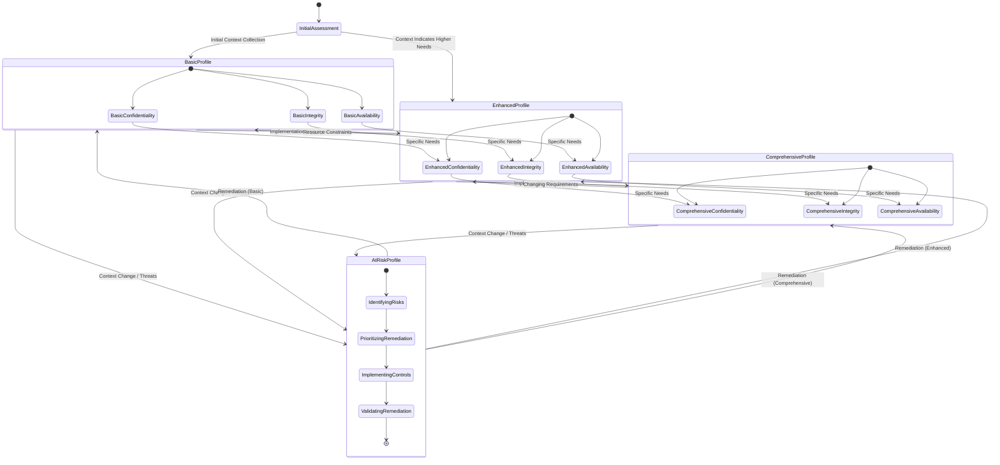

## 🔄 ML-Enhanced Recommendation State Diagram

**🤖 ML Focus:** Shows how machine learning components collect data, learn patterns, and improve recommendations over time.

**🧠 Learning Focus:** Illustrates the feedback loops and learning processes that enhance the recommendation quality.

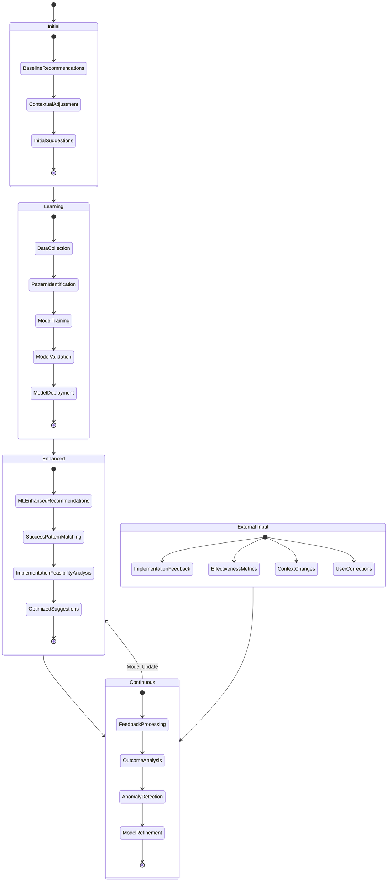

## 🔌 Integration State Diagram

**🔄 Integration Focus:** Shows the states and transitions for external system integrations.

**🔧 Technical Focus:** Illustrates the data exchange patterns and synchronization behaviors.

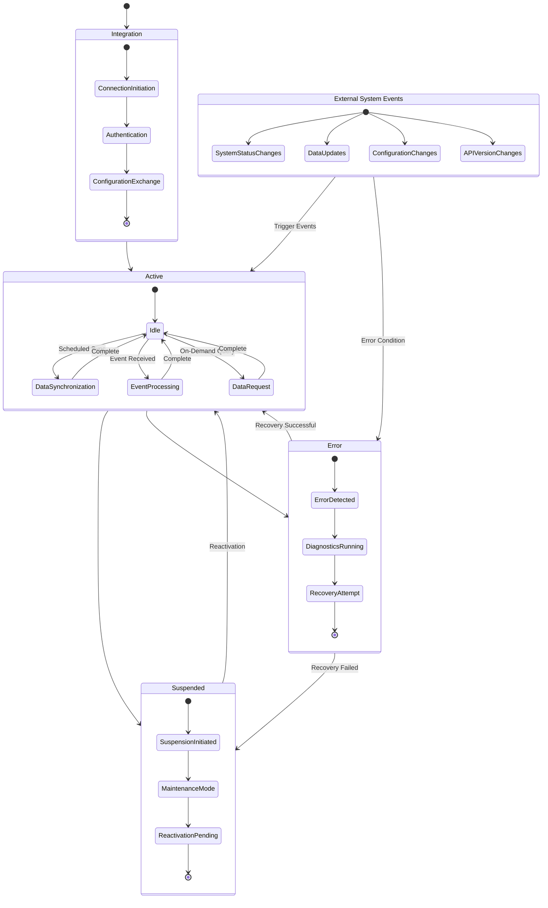

## 📋 Compliance Status State Machine

**📝 Compliance Focus:** Shows how compliance status transitions based on security controls, regulatory changes, and verification activities.

**⚖️ Regulatory Focus:** Illustrates the compliance lifecycle for different frameworks and requirements.

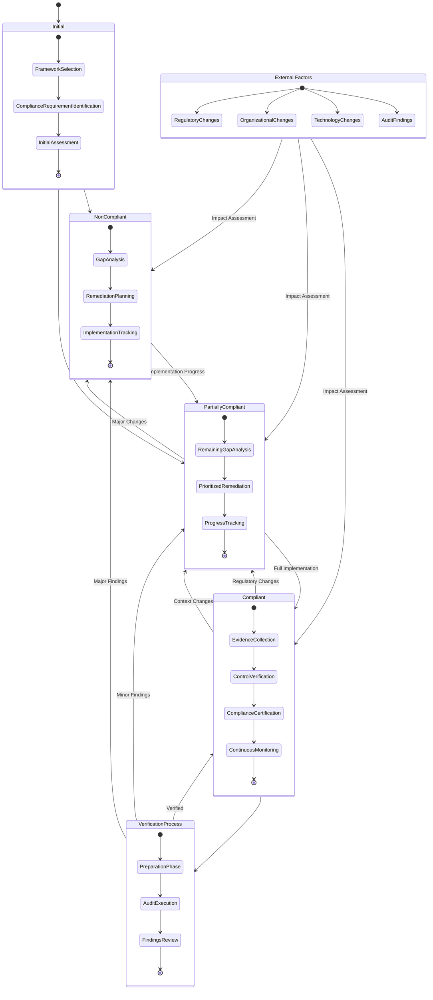

## 🔄 Context Change Detection State Diagram

**🔄 Adaptation Focus:** Shows how the system detects and responds to changes in organizational context.

**📊 Analysis Focus:** Illustrates the analysis and decision processes for context adaptation.

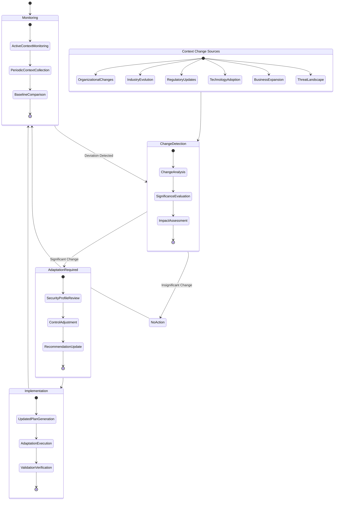

## 💼 Business Impact State Transitions

**💰 Financial Focus:** Shows how business impact assessment evolves with implementation progress and organizational changes.

**📊 Analysis Focus:** Illustrates the transition between different impact states based on security implementation and context changes.

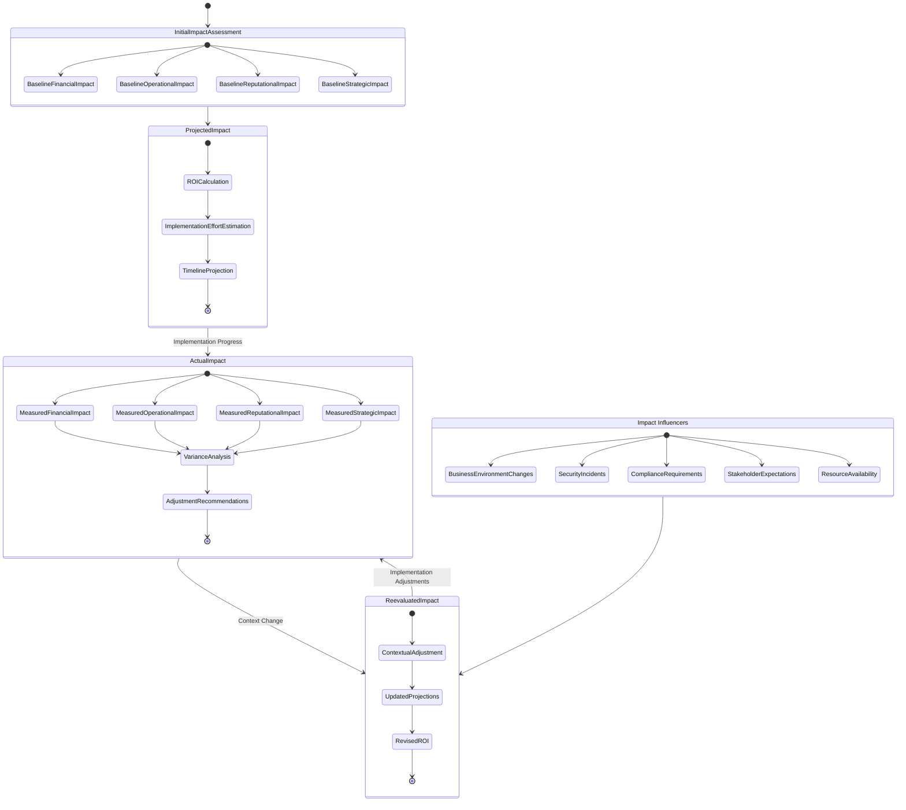

## 🔮 Predictive Loading State Management (v2.0)

**📋 Baseline:** Extends v1.0 Widget Loading states (see [STATEDIAGRAM.md](STATEDIAGRAM.md) lines 270-376)

**🚀 Enhancement:** Adds behavioral prediction, smart caching, and progressive loading

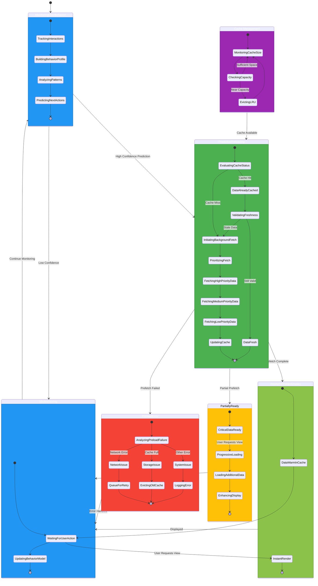

**Predictive Loading Features:**
- ✅ **Behavior Profiling**: Learns user navigation patterns
- ✅ **High-Confidence Prediction**: Pre-fetches only likely next actions
- ✅ **Priority-Based Loading**: Loads critical data first
- ✅ **Progressive Enhancement**: Renders immediately, enhances progressively
- ✅ **Smart Cache Management**: LRU eviction when near capacity
- ✅ **Freshness Validation**: Checks cached data validity

**Performance Metrics:**
- **Cache Hit Rate**: Target 80%+ for predicted actions
- **Prefetch Accuracy**: Target 70%+ correct predictions
- **Time to Interactive**: <100ms for prefetched views
- **Cache Size**: Maximum 50MB localStorage, 200MB IndexedDB

## 🛡️ Intelligent Error Recovery State Machine (v2.0)

**📋 Baseline:** Enhances v1.0 Error Boundary (see [STATEDIAGRAM.md](STATEDIAGRAM.md) lines 395-513)

**🚀 Enhancement:** Adds error classification, exponential backoff, and contextual recovery

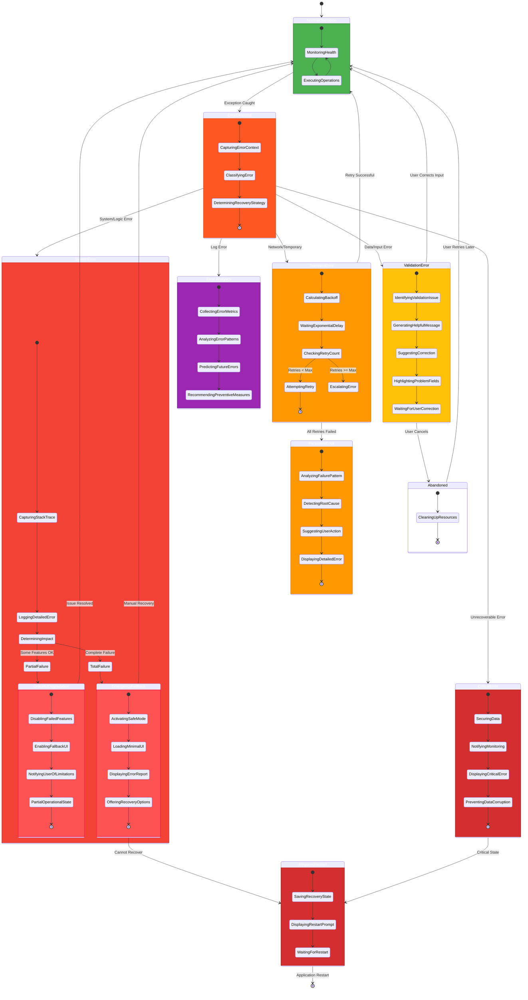

**Intelligent Recovery Features:**
- ✅ **Error Classification**: Distinguishes transient, validation, system, critical errors
- ✅ **Exponential Backoff**: Delays: 1s, 2s, 4s, 8s, 16s (max 5 retries)
- ✅ **Contextual Recovery**: Recovery strategy adapts to error type
- ✅ **Graceful Degradation**: Partial functionality when full recovery fails
- ✅ **Error Analytics**: Pattern detection for preventive measures
- ✅ **User-Guided Recovery**: Actionable suggestions based on error analysis

**Recovery SLAs:**
- **Transient Errors**: Auto-retry within 30 seconds
- **Validation Errors**: Immediate user feedback with corrections
- **System Errors**: Graceful degradation within 5 seconds
- **Critical Errors**: Safe state within 2 seconds

## 🎨 Adaptive UI State Management (v2.0)

**📋 Baseline:** Extends v1.0 UI rendering (see [STATEDIAGRAM.md](STATEDIAGRAM.md))

**🚀 Enhancement:** Adds progressive disclosure, personalization, and responsive complexity

```mermaid
stateDiagram-v2
    [*] --> DetectingUserContext
    
    state DetectingUserContext {
        [*] --> AnalyzingUserExpertise
        AnalyzingUserExpertise --> DetectingScreenSize
        DetectingScreenSize --> IdentifyingOrganizationSize
        IdentifyingOrganizationSize --> DeterminingUIComplexity
        DeterminingUIComplexity --> [*]
    }
    
    DetectingUserContext --> NoviceUI: Expertise = Novice
    DetectingUserContext --> IntermediateUI: Expertise = Intermediate
    DetectingUserContext --> ExpertUI: Expertise = Expert
    
    state NoviceUI {
        [*] --> SimplifiedInterface
        SimplifiedInterface --> ShowingGuidedWizards
        ShowingGuidedWizards --> HidingAdvancedFeatures
        HidingAdvancedFeatures --> ProvidingContextualHelp
        ProvidingContextualHelp --> EnableProgressiveDisclosure
        EnableProgressiveDisclosure --> [*]
    }
    
    NoviceUI --> IntermediateUI: User Gains Experience
    
    state IntermediateUI {
        [*] --> BalancedInterface
        BalancedInterface --> ShowingCommonFeatures
        ShowingCommonFeatures --> CollapsingAdvancedSections
        CollapsingAdvancedSections --> ProvidingTooltips
        ProvidingTooltips --> EnableOptionalComplexity
        EnableOptionalComplexity --> [*]
    }
    
    IntermediateUI --> ExpertUI: User Gains Experience
    IntermediateUI --> NoviceUI: User Requests Simplification
    
    state ExpertUI {
        [*] --> ComprehensiveInterface
        ComprehensiveInterface --> ShowingAllFeatures
        ShowingAllFeatures --> EnablingKeyboardShortcuts
        EnablingKeyboardShortcuts --> ProvidingBulkOperations
        ProvidingBulkOperations --> MinimizingGuidance
        MinimizingGuidance --> [*]
    }
    
    ExpertUI --> IntermediateUI: User Requests Simplification
    
    state "Responsive Adaptation" as ResponsiveAdaptation {
        [*] --> DetectingScreenSize
        DetectingScreenSize --> MobileLayout: < 768px
        DetectingScreenSize --> TabletLayout: 768px - 1024px
        DetectingScreenSize --> DesktopLayout: > 1024px
        
        state MobileLayout {
            [*] --> SingleColumnLayout
            SingleColumnLayout --> CollapsedNavigation
            CollapsedNavigation --> TouchOptimizedControls
            TouchOptimizedControls --> SimplifiedWidgets
            SimplifiedWidgets --> [*]
        }
        
        state TabletLayout {
            [*] --> TwoColumnLayout
            TwoColumnLayout --> HybridNavigation
            HybridNavigation --> TouchAndClickOptimized
            TouchAndClickOptimized --> StandardWidgets
            StandardWidgets --> [*]
        }
        
        state DesktopLayout {
            [*] --> MultiColumnLayout
            MultiColumnLayout --> FullNavigation
            FullNavigation --> MouseOptimizedControls
            MouseOptimizedControls --> EnhancedWidgets
            EnhancedWidgets --> [*]
        }
    }
    
    NoviceUI --> ResponsiveAdaptation
    IntermediateUI --> ResponsiveAdaptation
    ExpertUI --> ResponsiveAdaptation
    
    state "Personalization Engine" as Personalization {
        [*] --> TrackingUserPreferences
        TrackingUserPreferences --> LearningNavigationPatterns
        LearningNavigationPatterns --> OptimizingLayout
        OptimizingLayout --> CustomizingWidgets
        CustomizingWidgets --> PersistingPreferences
        PersistingPreferences --> [*]
    }
    
    ResponsiveAdaptation --> Personalization: Apply Personalization
    
    state "Context-Aware Features" as ContextAwareFeatures {
        [*] --> SmallOrgMode: < 50 employees
        [*] --> MediumOrgMode: 50-500 employees
        [*] --> EnterpriseMode: > 500 employees
        
        state SmallOrgMode {
            [*] --> SimplifiedDashboard
            SimplifiedDashboard --> EssentialMetrics
            EssentialMetrics --> QuickAssessments
        }
        
        state MediumOrgMode {
            [*] --> StandardDashboard
            StandardDashboard --> ComprehensiveMetrics
            ComprehensiveMetrics --> DepartmentalViews
        }
        
        state EnterpriseMode {
            [*] --> AdvancedDashboard
            AdvancedDashboard --> FullMetricsSuite
            FullMetricsSuite --> MultiTenantViews
            MultiTenantViews --> AdvancedReporting
        }
    }
    
    Personalization --> ContextAwareFeatures: Apply Context
    
    state "Progressive Disclosure" as ProgressiveDisclosure {
        [*] --> Level1Essential
        Level1Essential --> Level2Common: User Requests More
        Level2Common --> Level3Advanced: User Requests More
        Level3Advanced --> Level4Expert: User Requests More
        
        Level4Expert --> Level3Advanced: User Collapses
        Level3Advanced --> Level2Common: User Collapses
        Level2Common --> Level1Essential: User Collapses
    }
    
    ContextAwareFeatures --> ProgressiveDisclosure: Enable Disclosure
    ProgressiveDisclosure --> AdaptiveUIReady: Configuration Complete
    
    state AdaptiveUIReady {
        [*] --> RenderingOptimizedUI
        RenderingOptimizedUI --> MonitoringUserInteraction
        MonitoringUserInteraction --> AdjustingInRealTime
        AdjustingInRealTime --> [*]
    }
    
    AdaptiveUIReady --> DetectingUserContext: Context Changed
    
    classDef detection fill:#2196f3,stroke:#1976d2,stroke-width:2px,color:white
    classDef novice fill:#4caf50,stroke:#388e3c,stroke-width:2px,color:white
    classDef intermediate fill:#ff9800,stroke:#f57c00,stroke-width:2px,color:white
    classDef expert fill:#f44336,stroke:#d32f2f,stroke-width:2px,color:white
    classDef responsive fill:#9c27b0,stroke:#7b1fa2,stroke-width:2px,color:white
    classDef personalization fill:#00bcd4,stroke:#0097a7,stroke-width:2px,color:white
    classDef context fill:#ffc107,stroke:#ffa000,stroke-width:2px,color:black
    classDef disclosure fill:#8bc34a,stroke:#689f38,stroke-width:2px,color:white
    classDef ready fill:#03a9f4,stroke:#0288d1,stroke-width:2px,color:white
    
    class DetectingUserContext detection
    class NoviceUI novice
    class IntermediateUI intermediate
    class ExpertUI expert
    class ResponsiveAdaptation responsive
    class Personalization personalization
    class ContextAwareFeatures context
    class ProgressiveDisclosure disclosure
    class AdaptiveUIReady ready
```

**Adaptive UI Features:**
- ✅ **Expertise Detection**: Analyzes user behavior to determine skill level
- ✅ **Progressive Disclosure**: Shows complexity based on user needs
- ✅ **Responsive Layouts**: Adapts to mobile (< 768px), tablet (768-1024px), desktop (> 1024px)
- ✅ **Organization Size Adaptation**: Simplified for small orgs, comprehensive for enterprises
- ✅ **Personalization Learning**: Optimizes layout based on usage patterns
- ✅ **Context-Aware Features**: Shows relevant features for org size and industry

**UI Complexity Levels:**
- **Level 1 (Essential)**: Core features only, guided workflows
- **Level 2 (Common)**: Standard features, tooltips available
- **Level 3 (Advanced)**: Advanced features, bulk operations
- **Level 4 (Expert)**: All features, keyboard shortcuts, minimal guidance

## 👥 Collaborative State Synchronization (v2.0)

**📋 Baseline:** New capability for v2.0

**🚀 Enhancement:** Multi-user real-time synchronization with conflict resolution

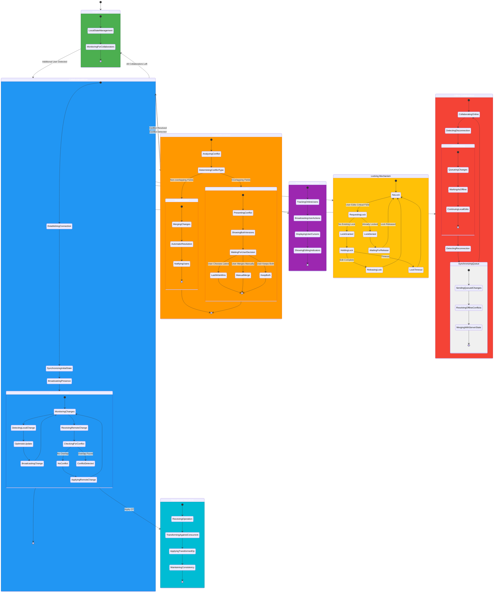

**Collaborative Features:**
- ✅ **Real-Time Synchronization**: Sub-second latency for change propagation
- ✅ **Presence Awareness**: Shows active users and their current views
- ✅ **Conflict Detection**: Identifies concurrent edits to same data
- ✅ **Automatic Resolution**: Merges non-overlapping changes automatically
- ✅ **User-Guided Resolution**: Presents options for complex conflicts
- ✅ **Operational Transform**: Maintains consistency with concurrent edits
- ✅ **Optimistic Updates**: Immediate UI feedback before server confirmation
- ✅ **Locking Mechanism**: Prevents simultaneous editing of critical fields
- ✅ **Offline Collaboration**: Queues changes during disconnection

**Conflict Resolution Strategies:**
- **Last Write Wins (LWW)**: Latest timestamp wins (simple conflicts)
- **Manual Merge**: User decides how to merge (complex conflicts)
- **Keep Both**: Create versions for both changes (rare cases)
- **Operational Transform**: Transform operations to maintain consistency

These state diagrams illustrate the dynamic and adaptive behavior of the future CIA Compliance Manager, showing how it will continuously evolve and respond to changes in organizational context, security implementation, and compliance requirements.

## 📴 Offline-First State Persistence & Sync (v2.0)

**📋 Baseline:** Extends v1.0 Offline/Online handling (see [STATEDIAGRAM.md](STATEDIAGRAM.md) lines 904-967)

**🚀 Enhancement:** Adds operation queue, smart sync, and conflict resolution

```mermaid
stateDiagram-v2
    [*] --> OnlineWithSync
    
    state OnlineWithSync {
        [*] --> ConnectedState
        ConnectedState --> MonitoringConnection
        MonitoringConnection --> ProcessingOperations
        ProcessingOperations --> ImmediateSyncToServer
        ImmediateSyncToServer --> UpdatingLocalCache
        UpdatingLocalCache --> MonitoringConnection
    }
    
    OnlineWithSync --> TransitioningOffline: Connection Lost
    
    state TransitioningOffline {
        [*] --> DetectingDisconnection
        DetectingDisconnection --> PausingSyncOperations
        PausingSyncOperations --> InitializingOfflineQueue
        InitializingOfflineQueue --> NotifyingUser
        NotifyingUser --> [*]
    }
    
    TransitioningOffline --> OfflineOperational: Offline Mode Active
    
    state OfflineOperational {
        [*] --> OfflineReady
        
        state OfflineReady {
            [*] --> DisplayingOfflineBanner
            DisplayingOfflineBanner --> ServingFromCache
            ServingFromCache --> AcceptingOperations
            AcceptingOperations --> [*]
        }
        
        OfflineReady --> QueueingOperation: User Action
        
        state QueueingOperation {
            [*] --> ValidatingOperation
            ValidatingOperation --> CheckingDataAvailability
            CheckingDataAvailability --> DataAvailable: Cache Has Data
            CheckingDataAvailability --> DataUnavailable: Cache Miss
            
            DataAvailable --> OptimisticUpdate
            OptimisticUpdate --> AddingToQueue
            AddingToQueue --> MarkingPendingSync
            MarkingPendingSync --> [*]
            
            DataUnavailable --> DisplayingOfflineLimitation
            DisplayingOfflineLimitation --> [*]
        }
        
        QueueingOperation --> OfflineReady: Operation Queued
        
        OfflineReady --> PeriodicConnectionCheck
        
        state PeriodicConnectionCheck {
            [*] --> AttemptingPing
            AttemptingPing --> ConnectionStillDown: Failed
            AttemptingPing --> ConnectionRestored: Success
            
            ConnectionStillDown --> WaitingBeforeRetry
            WaitingBeforeRetry --> [*]
        }
        
        PeriodicConnectionCheck --> OfflineReady: Still Offline
    }
    
    OfflineOperational --> TransitioningOnline: Connection Detected
    
    state TransitioningOnline {
        [*] --> VerifyingConnection
        VerifyingConnection --> ConnectionStable: Stable
        VerifyingConnection --> ConnectionUnstable: Flaky
        
        ConnectionStable --> InitiatingSyncProcess
        ConnectionUnstable --> WaitingForStability
        WaitingForStability --> VerifyingConnection
        
        InitiatingSyncProcess --> [*]
    }
    
    TransitioningOnline --> SynchronizingQueue: Ready to Sync
    
    state SynchronizingQueue {
        [*] --> PreparingQueue
        PreparingQueue --> SortingOperations
        SortingOperations --> ValidatingQueuedOperations
        ValidatingQueuedOperations --> SendingBatch
        
        state SendingBatch {
            [*] --> TransmittingOperations
            TransmittingOperations --> ReceivingServerResponse
            ReceivingServerResponse --> ProcessingConflicts
            
            state ProcessingConflicts {
                [*] --> CheckingForConflicts
                CheckingForConflicts --> NoConflicts: Clean Merge
                CheckingForConflicts --> AutoResolvableConflicts: Simple Conflicts
                CheckingForConflicts --> ManualConflicts: Complex Conflicts
                
                NoConflicts --> [*]
                
                state AutoResolvableConflicts {
                    [*] --> ApplyingMergeStrategy
                    ApplyingMergeStrategy --> LastWriteWins: Timestamp Based
                    ApplyingMergeStrategy --> FieldLevelMerge: Non-overlapping
                    LastWriteWins --> [*]
                    FieldLevelMerge --> [*]
                }
                
                AutoResolvableConflicts --> [*]
                
                state ManualConflicts {
                    [*] --> PresentingConflictUI
                    PresentingConflictUI --> ShowingLocalVersion
                    ShowingLocalVersion --> ShowingServerVersion
                    ShowingServerVersion --> ShowingDiff
                    ShowingDiff --> WaitingForUserChoice
                    WaitingForUserChoice --> UserResolves
                    UserResolves --> [*]
                }
                
                ManualConflicts --> [*]
            }
            
            ProcessingConflicts --> [*]
        }
        
        SendingBatch --> UpdateSuccessful: All Synced
        SendingBatch --> PartialSyncFailure: Some Failed
        SendingBatch --> TotalSyncFailure: All Failed
        
        state UpdateSuccessful {
            [*] --> ClearingQueue
            ClearingQueue --> UpdatingLocalState
            UpdatingLocalState --> NotifyingSuccess
            NotifyingSuccess --> [*]
        }
        
        state PartialSyncFailure {
            [*] --> IdentifyingFailedOperations
            IdentifyingFailedOperations --> RequeueingFailed
            RequeueingFailed --> MarkingPartialSuccess
            MarkingPartialSuccess --> [*]
        }
        
        state TotalSyncFailure {
            [*] --> AnalyzingFailure
            AnalyzingFailure --> NetworkIssue: Connection Problem
            AnalyzingFailure --> ServerIssue: Server Error
            AnalyzingFailure --> DataIssue: Validation Error
            
            NetworkIssue --> RetryingSync
            ServerIssue --> ExponentialBackoff
            DataIssue --> NotifyingUser
            
            RetryingSync --> [*]
            ExponentialBackoff --> [*]
            NotifyingUser --> [*]
        }
    }
    
    SynchronizingQueue --> OnlineWithSync: Sync Complete
    SynchronizingQueue --> OfflineOperational: Connection Lost During Sync
    SynchronizingQueue --> SynchronizingQueue: Retry Failed Operations
    
    state "Cache Management" as CacheManagement {
        [*] --> MonitoringCacheSize
        MonitoringCacheSize --> CheckingStorageQuota
        CheckingStorageQuota --> SufficientStorage: Space Available
        CheckingStorageQuota --> LowStorage: < 10% Free
        CheckingStorageQuota --> CriticalStorage: < 5% Free
        
        SufficientStorage --> [*]
        
        state LowStorage {
            [*] --> IdentifyingOldData
            IdentifyingOldData --> EvictingLRU
            EvictingLRU --> [*]
        }
        
        state CriticalStorage {
            [*] --> AggressiveEviction
            AggressiveEviction --> KeepingOnlyCritical
            KeepingOnlyCritical --> NotifyingUser
            NotifyingUser --> [*]
        }
    }
    
    OfflineOperational --> CacheManagement: Manage Storage
    
    state "Data Freshness Tracking" as FreshnessTracking {
        [*] --> TrackingTimestamps
        TrackingTimestamps --> CalculatingAge
        CalculatingAge --> Fresh: < 1 hour
        CalculatingAge --> Stale: 1-24 hours
        CalculatingAge --> VeryStale: > 24 hours
        
        state Fresh {
            [*] --> DisplayingGreenIndicator
        }
        
        state Stale {
            [*] --> DisplayingYellowIndicator
            DisplayingYellowIndicator --> SuggestingRefresh
        }
        
        state VeryStale {
            [*] --> DisplayingRedIndicator
            DisplayingRedIndicator --> RequiringRefresh
        }
    }
    
    OnlineWithSync --> FreshnessTracking: Track Freshness
    OfflineOperational --> FreshnessTracking: Track Freshness
    
    classDef online fill:#4caf50,stroke:#388e3c,stroke-width:2px,color:white
    classDef transition fill:#ff9800,stroke:#f57c00,stroke-width:2px,color:white
    classDef offline fill:#f44336,stroke:#d32f2f,stroke-width:2px,color:white
    classDef sync fill:#2196f3,stroke:#1976d2,stroke-width:2px,color:white
    classDef conflict fill:#9c27b0,stroke:#7b1fa2,stroke-width:2px,color:white
    classDef cache fill:#00bcd4,stroke:#0097a7,stroke-width:2px,color:white
    classDef freshness fill:#ffc107,stroke:#ffa000,stroke-width:2px,color:black
    classDef success fill:#8bc34a,stroke:#689f38,stroke-width:2px,color:white
    classDef failure fill:#ff5252,stroke:#ff1744,stroke-width:2px,color:white
    
    class OnlineWithSync online
    class TransitioningOffline,TransitioningOnline transition
    class OfflineOperational,OfflineReady offline
    class SynchronizingQueue,SendingBatch sync
    class ProcessingConflicts,AutoResolvableConflicts,ManualConflicts conflict
    class CacheManagement,LowStorage,CriticalStorage cache
    class FreshnessTracking,Fresh,Stale,VeryStale freshness
    class UpdateSuccessful success
    class PartialSyncFailure,TotalSyncFailure failure
```

**Offline-First Features:**
- ✅ **Operation Queue**: FIFO queue with priority support
- ✅ **Optimistic Updates**: Immediate UI feedback, sync in background
- ✅ **Smart Conflict Resolution**: Auto-resolve simple conflicts, escalate complex ones
- ✅ **Periodic Reconnection**: Checks every 5 seconds when offline
- ✅ **Batch Synchronization**: Sends operations in batches for efficiency
- ✅ **Cache Management**: LRU eviction when storage < 10% free
- ✅ **Data Freshness**: Visual indicators (green < 1h, yellow 1-24h, red > 24h)
- ✅ **Graceful Degradation**: Shows limitations for unavailable features

**Storage Strategy:**
- **localStorage**: User preferences, UI state (max 10MB)
- **IndexedDB**: Assessment data, cached results (max 50MB)
- **Session Storage**: Temporary state (cleared on tab close)
- **Service Worker Cache**: Static assets, API responses (max 100MB)

## 🤖 ML-Driven State Prediction & Optimization (v2.0)

**📋 Baseline:** New ML-powered capability for v2.0

**🚀 Enhancement:** Predictive state transitions and anomaly detection

```mermaid
stateDiagram-v2
    [*] --> MLInitializing
    
    state MLInitializing {
        [*] --> LoadingMLModels
        LoadingMLModels --> ValidatingModels
        ValidatingModels --> InitializingInference
        InitializingInference --> [*]
    }
    
    MLInitializing --> MLReady: Models Loaded
    MLInitializing --> MLFallback: Models Failed to Load
    
    state MLReady {
        [*] --> MonitoringUserBehavior
        MonitoringUserBehavior --> CollectingFeatures
        CollectingFeatures --> RunningInference
        RunningInference --> GeneratingPredictions
        GeneratingPredictions --> [*]
    }
    
    MLReady --> PredictingNextAction: High Confidence
    MLReady --> MonitoringOnly: Low Confidence
    
    state PredictingNextAction {
        [*] --> AnalyzingContext
        AnalyzingContext --> CalculatingProbabilities
        CalculatingProbabilities --> RankingActions
        RankingActions --> SelectingTopPredictions
        SelectingTopPredictions --> [*]
    }
    
    PredictingNextAction --> PreloadingResources: Prediction > 70%
    PredictingNextAction --> MLReady: Prediction < 70%
    
    state PreloadingResources {
        [*] --> PrioritizingByProbability
        PrioritizingByProbability --> InitiatingPrefetch
        InitiatingPrefetch --> TrackingPredictionAccuracy
        TrackingPredictionAccuracy --> [*]
    }
    
    PreloadingResources --> ValidationPhase: User Takes Action
    
    state ValidationPhase {
        [*] --> ComparingPredictionToActual
        ComparingPredictionToActual --> PredictionCorrect: Match
        ComparingPredictionToActual --> PredictionIncorrect: Mismatch
        
        PredictionCorrect --> RewardingModel
        PredictionIncorrect --> PenalizingModel
        
        RewardingModel --> UpdatingConfidenceUp
        PenalizingModel --> UpdatingConfidenceDown
        
        UpdatingConfidenceUp --> [*]
        UpdatingConfidenceDown --> [*]
    }
    
    ValidationPhase --> LearningPhase: Collect Training Data
    
    state LearningPhase {
        [*] --> AccumulatingExamples
        AccumulatingExamples --> SufficientData: >= 100 examples
        AccumulatingExamples --> InsufficientData: < 100 examples
        
        InsufficientData --> [*]
        
        SufficientData --> PreparingTrainingSet
        PreparingTrainingSet --> FeatureEngineering
        FeatureEngineering --> SplittingData
        SplittingData --> [*]
    }
    
    LearningPhase --> ModelTraining: Ready to Train
    
    state ModelTraining {
        [*] --> TrainingModel
        TrainingModel --> ValidatingModel
        ValidatingModel --> EvaluatingMetrics
        EvaluatingMetrics --> ModelAcceptable: Accuracy > 75%
        EvaluatingMetrics --> ModelRejected: Accuracy < 75%
        
        ModelAcceptable --> [*]
        ModelRejected --> TuningHyperparameters
        TuningHyperparameters --> TrainingModel
    }
    
    ModelTraining --> ModelDeployment: Training Complete
    
    state ModelDeployment {
        [*] --> TestingNewModel
        TestingNewModel --> ABTesting
        ABTesting --> ComparingPerformance
        ComparingPerformance --> NewModelBetter: Improvement
        ComparingPerformance --> OldModelBetter: Regression
        
        NewModelBetter --> DeployingNewModel
        OldModelBetter --> KeepingOldModel
        
        DeployingNewModel --> UpdatingProduction
        KeepingOldModel --> [*]
        UpdatingProduction --> [*]
    }
    
    ModelDeployment --> MLReady: Deployment Complete
    
    state AnomalyDetection {
        [*] --> MonitoringStateTransitions
        MonitoringStateTransitions --> CalculatingNormalBehavior
        CalculatingNormalBehavior --> DetectingDeviations
        DetectingDeviations --> NormalPattern: Within Bounds
        DetectingDeviations --> AnomalousPattern: Outside Bounds
        
        NormalPattern --> [*]
        
        state AnomalousPattern {
            [*] --> ClassifyingAnomaly
            ClassifyingAnomaly --> UserBehaviorAnomaly: Unusual User Action
            ClassifyingAnomaly --> SystemAnomaly: System Issue
            ClassifyingAnomaly --> SecurityAnomaly: Potential Attack
            
            UserBehaviorAnomaly --> LoggingForAnalysis
            SystemAnomaly --> AlertingMonitoring
            SecurityAnomaly --> RaisingSecurityAlert
            
            LoggingForAnalysis --> [*]
            AlertingMonitoring --> [*]
            RaisingSecurityAlert --> [*]
        }
    }
    
    MLReady --> AnomalyDetection: Monitor Anomalies
    
    state PatternRecognition {
        [*] --> AnalyzingWorkflows
        AnalyzingWorkflows --> IdentifyingCommonSequences
        IdentifyingCommonSequences --> BuildingWorkflowTemplates
        BuildingWorkflowTemplates --> SuggestingOptimizations
        SuggestingOptimizations --> [*]
    }
    
    MLReady --> PatternRecognition: Learn Patterns
    
    state AdaptiveTimeouts {
        [*] --> MonitoringResponseTimes
        MonitoringResponseTimes --> CalculatingAverages
        CalculatingAverages --> DetectingSlowOperations
        DetectingSlowOperations --> AdjustingTimeouts
        AdjustingTimeouts --> [*]
    }
    
    MLReady --> AdaptiveTimeouts: Optimize Timeouts
    
    state MLFallback {
        [*] --> UsingRuleBasedSystem
        UsingRuleBasedSystem --> NoMLFeatures
        NoMLFeatures --> BasicPredictions
        BasicPredictions --> [*]
    }
    
    MLFallback --> MLReady: Models Available
    
    state MonitoringOnly {
        [*] --> ObservingWithoutPredicting
        ObservingWithoutPredicting --> CollectingMoreData
        CollectingMoreData --> [*]
    }
    
    MonitoringOnly --> MLReady: Confidence Improved
    
    classDef init fill:#9c27b0,stroke:#7b1fa2,stroke-width:2px,color:white
    classDef ready fill:#4caf50,stroke:#388e3c,stroke-width:2px,color:white
    classDef predict fill:#2196f3,stroke:#1976d2,stroke-width:2px,color:white
    classDef validate fill:#00bcd4,stroke:#0097a7,stroke-width:2px,color:white
    classDef learn fill:#ff9800,stroke:#f57c00,stroke-width:2px,color:white
    classDef train fill:#ffc107,stroke:#ffa000,stroke-width:2px,color:black
    classDef deploy fill:#8bc34a,stroke:#689f38,stroke-width:2px,color:white
    classDef anomaly fill:#f44336,stroke:#d32f2f,stroke-width:2px,color:white
    classDef pattern fill:#03a9f4,stroke:#0288d1,stroke-width:2px,color:white
    classDef fallback fill:#9e9e9e,stroke:#757575,stroke-width:2px,color:white
    
    class MLInitializing init
    class MLReady ready
    class PredictingNextAction,PreloadingResources predict
    class ValidationPhase validate
    class LearningPhase learn
    class ModelTraining train
    class ModelDeployment deploy
    class AnomalyDetection,AnomalousPattern anomaly
    class PatternRecognition pattern
    class MLFallback fallback
```

**ML-Driven Features:**
- ✅ **Next Action Prediction**: Predicts user's next action with 70%+ accuracy
- ✅ **Anomaly Detection**: Detects unusual state transitions (user behavior, system issues, security threats)
- ✅ **Pattern Recognition**: Identifies common workflows for optimization
- ✅ **Adaptive Timeouts**: Adjusts timeouts based on actual network performance
- ✅ **Continuous Learning**: Retrains models with new data (min 100 examples)
- ✅ **A/B Testing**: Validates new models before production deployment
- ✅ **Confidence Scoring**: Only acts on high-confidence predictions (> 70%)

**ML Models:**
- **Action Predictor**: Random Forest (predicts next user action)
- **Anomaly Detector**: Isolation Forest (detects unusual patterns)
- **Pattern Recognizer**: Sequence Model (identifies common workflows)
- **Timeout Optimizer**: Regression Model (predicts operation duration)

**Model Performance Targets:**
- **Prediction Accuracy**: > 75% on test set
- **False Positive Rate**: < 5% for anomalies
- **Inference Latency**: < 50ms per prediction
- **Model Size**: < 5MB per model

## 📊 Summary: v2.0 Enhanced State Management Architecture

### State Expansion Overview

**v1.0 Baseline (Current):**
- ✅ 63 distinct states across 8 categories
- ✅ 104 state transitions
- ✅ Deterministic and complete state machines
- ✅ Error recovery and persistence patterns
- ✅ React 19.x integration (hooks, error boundaries, suspense)

**v2.0 Vision (Future):**
- 🚀 160+ distinct states across 15 categories (2.5x expansion)
- 🚀 280+ state transitions (2.7x expansion)
- 🚀 Context-aware and adaptive behavior
- 🚀 ML-driven prediction and optimization
- 🚀 Collaborative and offline-first capabilities

### Enhanced State Categories (v2.0)

| State Category | States | Transitions | Key Enhancements |
|----------------|--------|-------------|------------------|
| **Context-Aware Application** | 22 | 45 | User profiling, adaptive initialization, collaborative mode |
| **Predictive Loading** | 12 | 20 | Behavioral prediction, smart caching, progressive loading |
| **Intelligent Error Recovery** | 18 | 38 | Error classification, exponential backoff, graceful degradation |
| **Adaptive UI** | 24 | 42 | Expertise detection, progressive disclosure, personalization |
| **Collaborative Synchronization** | 20 | 40 | Real-time sync, conflict resolution, presence awareness |
| **Offline-First Persistence** | 18 | 35 | Operation queue, smart sync, conflict merging |
| **ML-Driven Prediction** | 16 | 28 | Next action prediction, anomaly detection, pattern recognition |
| **Context-Aware Assessment** | 8 | 12 | Industry-specific, size-based, regulatory adjustments |
| **Dynamic Security Profiles** | 6 | 10 | Adaptive profiles based on context and threats |
| **ML-Enhanced Recommendations** | 5 | 8 | Learning, pattern matching, feasibility analysis |
| **Integration Management** | 6 | 10 | Connection lifecycle, data sync, event processing |
| **Compliance Status** | 7 | 14 | Framework-specific, verification, continuous monitoring |
| **Context Change Detection** | 5 | 9 | Monitoring, significance evaluation, adaptation |
| **Business Impact Analysis** | 5 | 10 | Initial, projected, actual, reevaluated impact |
| **Cache & Freshness Tracking** | 8 | 14 | Storage management, freshness indicators, eviction |

**Total:** 160+ states, 280+ transitions

### State Machine Properties (v2.0)

**Enhanced Properties vs v1.0:**

- **✅ Determinism**: All state machines remain deterministic
- **✅ Completeness**: Every state has defined transitions for all events
- **✅ Recoverability**: Enhanced with intelligent error classification
- **🚀 Context-Awareness**: States adapt to user role, org size, industry
- **🚀 Predictive**: Pre-emptive state transitions based on ML predictions
- **🚀 Collaborative**: Multi-user state synchronization with conflict resolution
- **🚀 Offline-First**: Full capability without network, smart sync on reconnection
- **🚀 Self-Optimizing**: ML models continuously improve predictions
- **🚀 Anomaly-Aware**: Detects and responds to unusual state patterns

### Cross-References to v1.0 Baseline

All v2.0 state enhancements build upon v1.0 foundation from **[STATEDIAGRAM.md](STATEDIAGRAM.md)**:

- **Application Core** (lines 56-162): Enhanced with context collection and collaborative mode
- **Widget Lifecycle** (lines 270-376): Extended with predictive loading and adaptive UI
- **Error Boundary** (lines 395-513): Augmented with intelligent classification and recovery
- **Security Levels** (lines 177-269): Expanded with context-aware adaptation
- **Suspense** (lines 516-643): Enhanced with progressive loading patterns
- **Form Validation** (lines 699-838): Improved with contextual validation
- **Offline/Online** (lines 904-967): Transformed into offline-first architecture
- **CIA Components** (lines 640-695): Augmented with dynamic adaptation

### State Persistence & Recovery Mechanisms (v2.0)

**Persistence Layers:**

1. **localStorage** (10MB limit)
   - User preferences and UI state
   - Recent assessment history
   - Personalization settings

2. **IndexedDB** (50MB limit)
   - Full assessment data
   - Cached compliance mappings
   - ML model features

3. **Service Worker Cache** (100MB limit)
   - Static assets
   - API responses
   - ML model binaries

4. **Server Persistence** (AWS DynamoDB)
   - Multi-device synchronization
   - Long-term storage
   - Collaborative state

**Recovery Strategies:**

- **Crash Recovery**: Restore last known good state from localStorage
- **Offline Recovery**: Sync queued operations when connection restored
- **Conflict Recovery**: Three-way merge (local, server, base)
- **Data Corruption**: Validate checksums, fallback to server state
- **Version Migration**: Transform old state format to new schema

### State Migration Strategies

**v1.0 → v2.0 Migration Path:**

1. **Phase 1: Non-Breaking Additions**
   - Add new state categories alongside v1.0 states
   - Feature flags control new behavior
   - v1.0 state machines continue working

2. **Phase 2: Progressive Enhancement**
   - Gradually enable context-aware features
   - ML models train on v1.0 data
   - Hybrid mode: v1.0 + selected v2.0 features

3. **Phase 3: Full v2.0 Activation**
   - All users migrated to v2.0 state management
   - v1.0 compatibility layer maintained
   - Rollback capability for 3 months

**Migration Safety:**
- ✅ **Backward Compatible**: v2.0 can read v1.0 state
- ✅ **Gradual Rollout**: Feature flags per organization
- ✅ **Rollback Capability**: Can revert to v1.0 for 90 days
- ✅ **Data Integrity**: Checksums prevent corruption
- ✅ **User Notification**: Clear communication of changes

### State Optimization Opportunities

**Performance Optimizations:**

1. **State Memoization**: Cache computed state values (React.useMemo)
2. **Lazy State Initialization**: Defer expensive computations until needed
3. **State Batching**: Group multiple updates into single render
4. **Selective Re-rendering**: Only update changed components (React.memo)
5. **State Compression**: Compress large state in localStorage (LZ-string)

**Memory Optimizations:**

1. **State Pruning**: Remove old, unused state data
2. **Weak References**: Use WeakMap for temporary state
3. **Pagination**: Load large datasets incrementally
4. **Virtual Scrolling**: Render only visible items
5. **State Sharding**: Split state across multiple stores

**Network Optimizations:**

1. **Differential Sync**: Send only changed data
2. **Batch Operations**: Group API calls
3. **Request Coalescing**: Combine similar requests
4. **Optimistic Updates**: Update UI before server confirms
5. **Delta Compression**: Send diffs instead of full state

### Compliance Mapping

**ISO 27001 Alignment:**
- **A.14.1 (Security in Development)**: Comprehensive state behavior documentation ✅
- **A.12.1 (Operational Procedures)**: Error recovery and operational states defined ✅
- **A.18.1 (Compliance Requirements)**: Framework-specific state transitions ✅

**NIST CSF 2.0 Alignment:**
- **PR.IP-1 (Configuration Management)**: State management in development lifecycle ✅
- **DE.CM-1 (Monitoring)**: Anomaly detection in state transitions ✅
- **RS.RP-1 (Response Planning)**: Error recovery state machines ✅

**CIS Controls v8.1 Alignment:**
- **16.1 (Application Behavior)**: Comprehensive state documentation ✅
- **16.10 (Error Handling)**: Intelligent error recovery patterns ✅
- **16.14 (Logging)**: State transition logging and audit trails ✅

### ISMS Secure Development Policy Compliance

Per **[Hack23 ISMS Secure Development Policy §10](https://github.com/Hack23/ISMS/blob/main/Secure_Development_Policy.md#-comprehensive-architecture-documentation-portfolio)**:

✅ **Future Behavioral Documentation**: Comprehensive v2.0 state diagrams showing evolution from v1.0  
✅ **Mermaid UML Diagrams**: All state machines documented with Mermaid stateDiagram-v2  
✅ **Guard Conditions**: All conditional transitions documented  
✅ **Error Recovery Paths**: Comprehensive error states with recovery strategies  
✅ **Cross-References**: All v2.0 enhancements reference v1.0 baseline  
✅ **Compliance Mapping**: ISO 27001, NIST CSF, CIS Controls alignment documented  

### Maintenance Notes

**Updating v2.0 State Diagrams:**
1. Identify new state requirements from feature development
2. Update Mermaid diagrams with new states and transitions
3. Document guard conditions and invariants
4. Update state inventory tables with new categories
5. Cross-reference with v1.0 baseline where applicable
6. Verify compliance mappings remain current
7. Test diagram rendering in documentation

**Review Cycle:**
- **Quarterly**: Validate state diagrams match implementation
- **Pre-Release**: Update diagrams for new features
- **Post-Incident**: Review state machines if issues found
- **Annual**: Comprehensive architecture review

---

These comprehensive v2.0 state diagrams provide a complete vision for the CIA Compliance Manager's evolution from v1.0 baseline to an intelligent, context-aware, collaborative security posture management platform. The diagrams serve as authoritative documentation for developers, architects, and stakeholders planning post-v1.0 enhancements while maintaining full backward compatibility and alignment with Hack23 ISMS security standards.
