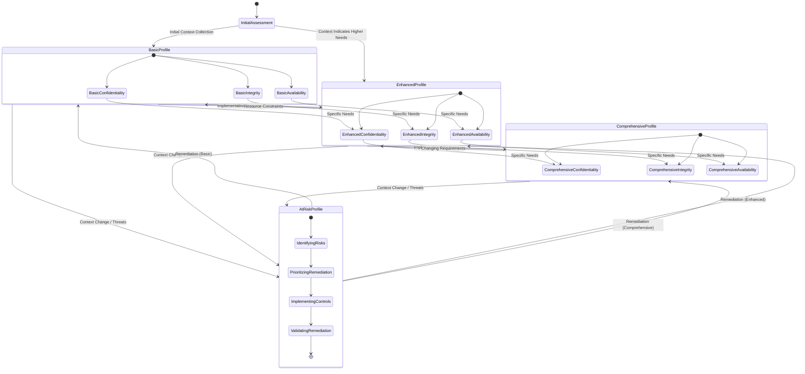
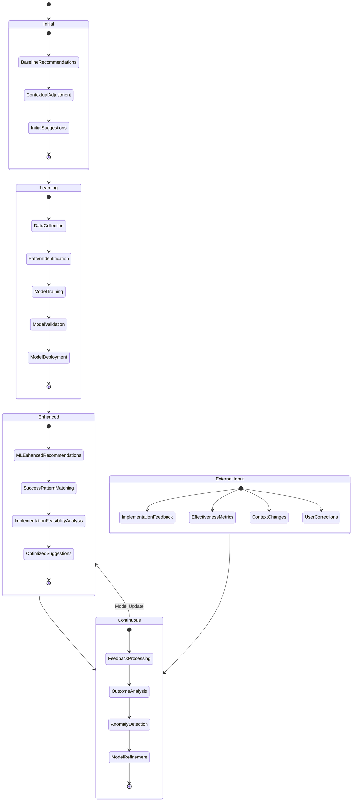
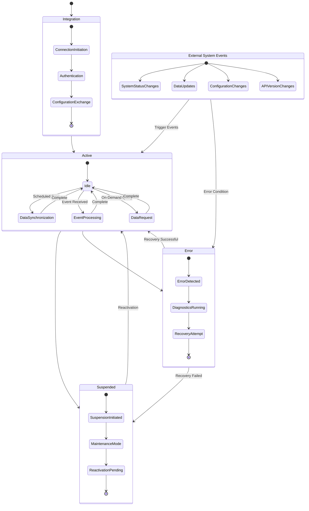
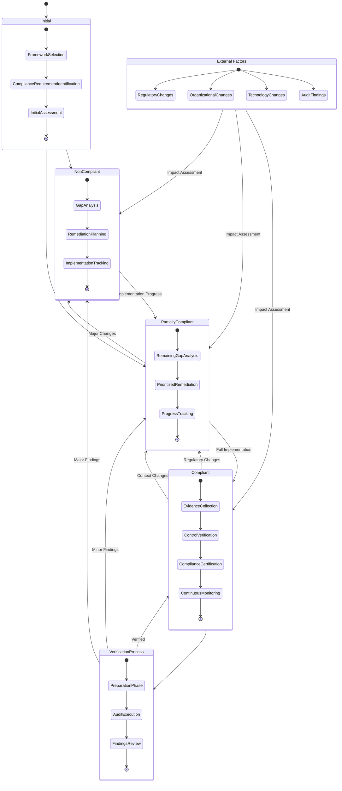
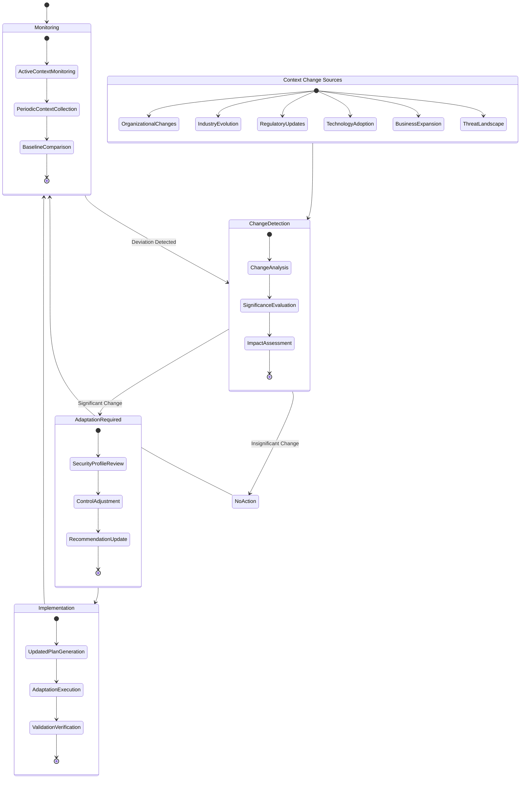
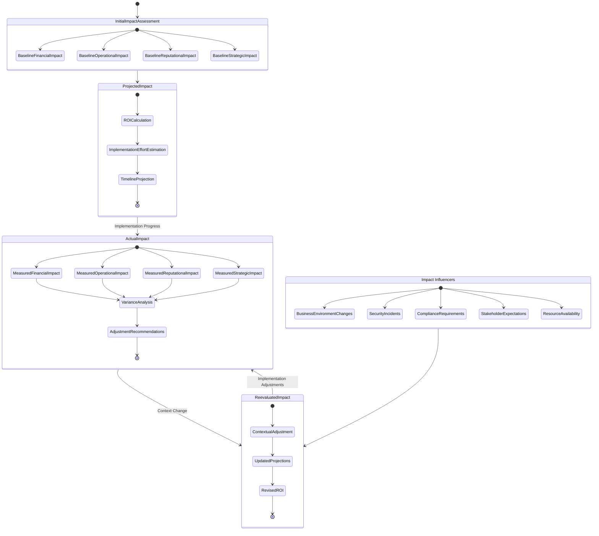

# 🔄 Future CIA Compliance Manager State Diagrams

This document illustrates the enhanced state transitions and behavioral models planned for the future evolution of the CIA Compliance Manager. These diagrams depict how the system will adapt to organizational context, implement continuous learning, and provide dynamic security posture management.

## 📚 Related Architecture Documentation

| Document                                            | Focus           | Description                               |
| --------------------------------------------------- | --------------- | ----------------------------------------- |
| **[Current Architecture](ARCHITECTURE.md)**         | 🏛️ Architecture | C4 model showing current system structure |
| **[Future Architecture](FUTURE_ARCHITECTURE.md)**   | 🏛️ Architecture | Vision for context-aware platform         |
| **[State Diagrams](STATEDIAGRAM.md)**               | 🔄 Behavior     | Current system state transitions          |
| **[Process Flowcharts](FLOWCHART.md)**              | 🔄 Process      | Current security workflows                |
| **[Future Flowcharts](FUTURE_FLOWCHART.md)**        | 🔄 Process      | Enhanced context-aware workflows          |
| **[Mindmaps](MINDMAP.md)**                          | 🧠 Concept      | Current system component relationships    |
| **[Future Mindmaps](FUTURE_MINDMAP.md)**            | 🧠 Concept      | Future capability evolution               |
| **[SWOT Analysis](SWOT.md)**                        | 💼 Business     | Current strategic assessment              |
| **[Future SWOT Analysis](FUTURE_SWOT.md)**          | 💼 Business     | Future strategic opportunities            |
| **[CI/CD Workflows](WORKFLOWS.md)**                 | 🔧 DevOps       | Current automation processes              |
| **[Future Workflows](FUTURE_WORKFLOWS.md)**         | 🔧 DevOps       | Enhanced CI/CD with ML                    |
| **[Future Data Model](FUTURE_DATA_MODEL.md)**       | 📊 Data         | Context-aware data architecture           |

## 🧠 Context-Aware Security Assessment State Diagram

**🔒 Security Focus:** Shows the adaptive security assessment process that incorporates organizational context.

**🔄 Process Focus:** Illustrates how the assessment flow changes based on context parameters and feedback.

```mermaid
stateDiagram-v2
    [*] --> OrganizationalContext
    
    state OrganizationalContext {
        [*] --> CollectingContextParameters
        CollectingContextParameters --> AnalyzingContext
        AnalyzingContext --> DeterminingBaseSecurityProfile
        DeterminingBaseSecurityProfile --> [*]
    }
    
    OrganizationalContext --> SecurityAssessment
    
    state SecurityAssessment {
        [*] --> InitialAssessment
        
        state InitialAssessment {
            [*] --> ConfidentialityAssessment
            [*] --> IntegrityAssessment
            [*] --> AvailabilityAssessment
        }
        
        InitialAssessment --> ContextualizedAdjustment
        
        state ContextualizedAdjustment {
            [*] --> IndustrySpecificAdjustments
            IndustrySpecificAdjustments --> SizeBasedCalibration
            SizeBasedCalibration --> DataSensitivityAdjustments
            DataSensitivityAdjustments --> RegulatoryRequirements
            RegulatoryRequirements --> [*]
        }
        
        ContextualizedAdjustment --> [*]
    }
    
    SecurityAssessment --> RecommendationGeneration
    
    state RecommendationGeneration {
        [*] --> ControlSelection
        ControlSelection --> MLEnhancement
        MLEnhancement --> PrioritizationOptimization
        PrioritizationOptimization --> BusinessImpactAssessment
        BusinessImpactAssessment --> [*]
    }
    
    RecommendationGeneration --> Implementation
    
    state Implementation {
        [*] --> PlanGeneration
        PlanGeneration --> ExecutionTracking
        ExecutionTracking --> EffectivenessMonitoring
        EffectivenessMonitoring --> [*]
    }
    
    Implementation --> ContinuousAdaptation
    
    state ContinuousAdaptation {
        [*] --> FeedbackCollection
        FeedbackCollection --> PerformanceAnalysis
        PerformanceAnalysis --> ContextChangesDetection
        ContextChangesDetection --> ModelUpdate
        ModelUpdate --> [*]
    }
    
    ContinuousAdaptation --> SecurityAssessment: Context Change Detected
```

## 📊 Dynamic Security Profile State Transitions

**🔄 State Focus:** Illustrates how security profiles transition between states based on implementation progress, context changes, and feedback.

**🔒 Security Posture Focus:** Shows the continuous nature of security posture management.

## 🔄 ML-Enhanced Recommendation State Diagram

**🤖 ML Focus:** Shows how machine learning components collect data, learn patterns, and improve recommendations over time.

**🧠 Learning Focus:** Illustrates the feedback loops and learning processes that enhance the recommendation quality.

## 🔌 Integration State Diagram

**🔄 Integration Focus:** Shows the states and transitions for external system integrations.

**🔧 Technical Focus:** Illustrates the data exchange patterns and synchronization behaviors.

## 📋 Compliance Status State Machine

**📝 Compliance Focus:** Shows how compliance status transitions based on security controls, regulatory changes, and verification activities.

**⚖️ Regulatory Focus:** Illustrates the compliance lifecycle for different frameworks and requirements.

## 🔄 Context Change Detection State Diagram

**🔄 Adaptation Focus:** Shows how the system detects and responds to changes in organizational context.

**📊 Analysis Focus:** Illustrates the analysis and decision processes for context adaptation.

## 💼 Business Impact State Transitions

**💰 Financial Focus:** Shows how business impact assessment evolves with implementation progress and organizational changes.

**📊 Analysis Focus:** Illustrates the transition between different impact states based on security implementation and context changes.

These state diagrams illustrate the dynamic and adaptive behavior of the future CIA Compliance Manager, showing how it will continuously evolve and respond to changes in organizational context, security implementation, and compliance requirements.
