# 💼 Future CIA Compliance Manager SWOT Analysis

> **Version:** v2.0-DRAFT | **Based on:** v1.0 Baseline | **Last Updated:** 2025-11-23 | **Status:** 🚀 Evolution Roadmap

This document provides a strategic analysis of the CIA Compliance Manager's future evolution from v1.0 baseline into a context-aware security posture management platform. It assesses the strengths, weaknesses, opportunities, and threats associated with this transformation to guide strategic decision-making.

## 📚 Related Architecture Documentation

<div class="documentation-map">

### Current Architecture (v1.0 Baseline)
| Document                                            | Focus           | Description                               |
| --------------------------------------------------- | --------------- | ----------------------------------------- |
| **[Current Architecture](ARCHITECTURE.md)**         | 🏛️ Architecture | C4 model showing v1.0 system structure    |
| **[Current SWOT Analysis](SWOT.md)**                | 💼 Business     | v1.0 strategic assessment                 |
| **[Current State Diagrams](STATEDIAGRAM.md)**       | 🔄 Behavior     | v1.0 state transitions                    |
| **[Current Flowcharts](FLOWCHART.md)**              | 🔄 Process      | v1.0 security workflows                   |

### Future Architecture Evolution (v2.0+)
| Document                                            | Focus           | Description                               |
| --------------------------------------------------- | --------------- | ----------------------------------------- |
| **[Future Architecture](FUTURE_ARCHITECTURE.md)**   | 🏛️ Architecture | Vision for context-aware platform         |
| **[Future SWOT Analysis](FUTURE_SWOT.md)**          | 💼 Business     | **This document** - Strategic opportunities |
| **[Future State Diagrams](FUTURE_STATEDIAGRAM.md)** | 🔄 Behavior     | Context-aware state management            |
| **[Future Security Architecture](FUTURE_SECURITY_ARCHITECTURE.md)** | 🛡️ Security | AWS cloud security architecture   |
| **[Future Flowcharts](FUTURE_FLOWCHART.md)**        | 🔄 Process      | Enhanced context-aware workflows          |
| **[Future Workflows](FUTURE_WORKFLOWS.md)**         | 🔧 DevOps       | Enhanced CI/CD with ML                    |
| **[Future Mindmaps](FUTURE_MINDMAP.md)**            | 🧠 Concept      | Future capability evolution               |
| **[Future Data Model](FUTURE_DATA_MODEL.md)**       | 📊 Data         | Context-aware data architecture           |

</div>

## 📊 Strategic SWOT Overview

```mermaid
quadrantChart
    title Future CIA Compliance Manager Strategic Positioning
    x-axis Negative Impact --> Positive Impact
    y-axis External Factors --> Internal Factors
    quadrant-1 "Strengths"
    quadrant-2 "Weaknesses"
    quadrant-3 "Opportunities"
    quadrant-4 "Threats"
    
    "Context-Aware Architecture": [0.8, 0.7]
    "ML-Enhanced Recommendations": [0.9, 0.8]
    "Integration Ecosystem": [0.7, 0.6]
    
    "Implementation Complexity": [-0.6, 0.7]
    "ML Data Requirements": [-0.7, 0.8]
    "Dependency on External Systems": [-0.5, 0.6]
    
    "Emerging Security Market": [0.9, -0.7]
    "Regulatory Complexity Growth": [0.8, -0.8]
    "AI/ML Adoption in Security": [0.7, -0.6]
    
    "Competitive Platform Growth": [-0.7, -0.7]
    "AI/ML Expertise Scarcity": [-0.8, -0.6]
    "Integration Standards Flux": [-0.6, -0.8]
```

## 💪 Strengths

```mermaid
mindmap
  root((Future<br>Strengths))
    🧠 Context-Aware Security
      Organizations get tailored recommendations
      Security aligned with business reality
      Adaptive to organization's unique factors
      Right-sized controls for resources
    🤖 ML Enhancement
      Intelligent recommendation optimization
      Pattern recognition from implementation outcomes
      Learning from cross-organization insights
      Continuous improvement via feedback loops
    🔌 Integration Ecosystem
      Bi-directional security tool integration
      GRC platform synchronization
      Operational system connectivity
      Enhanced data exchange capabilities
    🔍 Granular Assessment
      Department-specific security evaluation
      Role-based control recommendations
      Data sensitivity-aware protection
      Technology-appropriate controls
    📊 Business Impact Analysis
      Enhanced ROI calculation
      Operational impact forecasting
      Strategic alignment measurement
      Investment prioritization intelligence
```



| Strength                         | Impact Level | Description                                                                                  | Strategic Advantage                                               |
|---------------------------------|--------------|----------------------------------------------------------------------------------------------|-------------------------------------------------------------------|
| 🧠 Context-Aware Architecture   | High         | Platform adapts security recommendations to organizational context                           | Highly relevant and implementable security guidance               |
| 🤖 ML-Enhanced Recommendations  | High         | Recommendations improve based on implementation outcomes across organizations                | Continuously improving guidance quality and effectiveness          |
| 🔌 Integration Ecosystem        | Medium-High  | Connection with security tools, GRC platforms, and enterprise systems                        | Seamless workflow integration and enhanced data exchange           |
| 🔍 Granular Assessment         | Medium-High  | Security assessment at department, role, and data level                                      | Precise security implementations aligned with specific needs       |
| 🔄 Continuous Adaptation        | Medium       | Security posture evolves with changing business context and threat landscape                 | Always-current security posture without manual reassessment        |
| 📊 Enhanced Business Impact     | High         | Deeper business impact analysis with financial, operational, and strategic components        | Clear business case for security investments                       |
| 🏭 Industry-Specific Intelligence | Medium      | Industry-tailored security guidance and compliance mapping                                    | Relevant security approaches matching industry context             |
| 🔐 Multi-Framework Support      | Medium       | Comprehensive mapping across various compliance frameworks                                   | Simplified multi-framework compliance                              |
| 🚀 Implementation Automation     | Medium       | Automated implementation guides and integration with operational systems                     | Streamlined security control deployment                            |

## 🔄 Weaknesses

```mermaid
mindmap
  root((Future<br>Weaknesses))
    🧩 Implementation Complexity
      Sophisticated architecture
      Multiple integration points
      ML model management
      Context parameter maintenance
    📊 Data Requirements
      ML training data needs
      Quality data dependencies
      Cross-organization data collection
      Privacy considerations
    🔌 Integration Dependencies
      Reliance on external systems
      API compatibility challenges
      Data synchronization needs
      External system quality dependency
    🧠 ML Interpretability
      Black-box recommendations
      Explainability challenges
      Trust barriers
      Audit complexity
    🏋️‍♂️ Resource Requirements
      ML expertise needs
      Integration development resources
      Data science capabilities
      Ongoing maintenance needs
```



| Weakness                       | Impact Level | Description                                                                            | Mitigation Strategy                                      |
|--------------------------------|--------------|----------------------------------------------------------------------------------------|----------------------------------------------------------|
| 🧩 Implementation Complexity   | High         | Sophisticated architecture requires careful planning and expertise                     | Phased implementation approach with comprehensive guides |
| 📊 ML Data Requirements        | High         | ML models require quality data for training and continuous improvement                 | Synthetic data generation and federated learning          |
| 🔌 Integration Dependencies    | Medium-High  | Platform effectiveness depends on quality integrations with external systems           | Flexible integration architecture with degradation paths  |
| 🧠 ML Interpretability         | Medium       | ML recommendations may lack clear explanation of reasoning                            | Explainable AI techniques and transparent reasoning       |
| 🏋️‍♂️ Resource Requirements     | Medium       | Development and maintenance require specialized ML and integration expertise           | Partner ecosystem and simplified implementation toolkit   |
| ⏱️ Development Timeline        | Medium       | Sophisticated capabilities require significant development time                       | Incremental capability delivery with immediate value      |
| 💰 Development Cost            | Medium       | Advanced features require substantial investment                                      | Modular architecture allowing selective implementation    |
| 🔍 Testing Complexity         | Medium-Low   | Context-aware behavior creates extensive test scenarios                                | Automated testing framework with simulation capabilities  |
| 📚 Documentation Burden       | Low          | Complex capabilities require comprehensive documentation                               | Automated documentation generation and interactive guides |

## 🚀 Opportunities

```mermaid
mindmap
  root((Future<br>Opportunities))
    🌐 Growing Security Market
      Increased security awareness
      Higher security investments
      Expanded security tooling
      Security-as-differentiator
    📝 Regulatory Complexity Growth
      Increased compliance burdens
      Cross-framework requirements
      Geographic regulation variation
      Industry-specific mandates
    💻 AI/ML Security Adoption
      Growing AI acceptance in security
      Security analytics evolution
      ML-driven security automation
      Data-driven decision culture
    🔄 Security Tool Integration Trend
      Platform approach to security
      API-first security tools
      Integration focus in procurement
      Security data standardization
    📱 User Experience Focus
      Simplified security interfaces
      Democratized security management
      Non-specialist accessibility
      Executive-friendly visualization
```



| Opportunity                      | Impact Level | Description                                                                         | Strategic Response                                        |
|---------------------------------|--------------|-------------------------------------------------------------------------------------|------------------------------------------------------------|
| 🌐 Expanding Security Market     | High         | Growing demand for comprehensive security management solutions                      | Position as advanced, next-generation platform              |
| 📝 Regulatory Complexity Growth  | High         | Increasing compliance requirements across jurisdictions and industries              | Emphasize multi-framework, context-aware compliance        |
| 💻 AI/ML Security Adoption       | Medium-High  | Growing acceptance and expectation of AI/ML in security solutions                   | Highlight ML capabilities as competitive differentiator     |
| 🔄 Security Tool Integration     | Medium       | Organizations seeking unified security platforms rather than point solutions         | Promote ecosystem approach with extensive integrations      |
| 📱 UX Focus in Security          | Medium       | Demand for more user-friendly, accessible security management tools                  | Design intuitive interfaces for technical and business users|
| 🏢 Multi-Department Security     | Medium       | Security expanding beyond IT to business units, legal, and executive teams           | Create role-specific views and capabilities                 |
| 🌊 Risk-Based Security Approach  | Medium       | Shift toward risk-based security prioritization                                     | Enhance risk modeling and business impact analysis          |
| 🧩 Security Tool Consolidation   | Medium-Low   | Organizations looking to reduce security tool sprawl                                | Position as central security management hub                 |
| 🔄 DevSecOps Movement            | Medium-Low   | Integration of security into development and operations                             | Provide API-first architecture for pipeline integration     |

## ⚠️ Threats

```mermaid
mindmap
  root((Future<br>Threats))
    🏆 Platform Competition Growth
      Similar platform offerings
      Big vendor market entry
      Feature commoditization
      Price competition
    👨‍💻 ML/AI Talent Scarcity
      Limited specialized expertise
      High competition for talent
      Salary escalation
      Knowledge concentration risk
    🔌 Integration Standards Flux
      Changing API standards
      Integration deprecation
      Format evolution
      Protocol changes
    📊 Data Privacy Constraints
      Training data limitations
      Cross-organization barriers
      Regulatory restrictions
      Data residency requirements
    🧠 AI/ML Skepticism
      Trust barriers in security
      Explainability demands
      Audit validation challenges
      Human override requirements
```



| Threat                         | Impact Level | Description                                                                        | Strategic Response                                          |
|--------------------------------|--------------|------------------------------------------------------------------------------------|--------------------------------------------------------------|
| 🏆 Platform Competition Growth  | High         | Increasing competition from similar platforms and big vendor market entry          | Differentiate through context-awareness and ML capabilities   |
| 👨‍💻 ML/AI Talent Scarcity      | High         | Limited availability of specialized expertise for development and maintenance      | Build talent pipeline and leverage partner ecosystem          |
| 🔌 Integration Standards Flux   | Medium       | Changing API standards and integration approaches requiring ongoing adaptation     | Design flexible integration architecture with abstraction     |
| 📊 Data Privacy Constraints    | Medium       | Limitations on data usage for ML training due to privacy regulations               | Develop privacy-preserving learning techniques               |
| 🧠 AI/ML Skepticism            | Medium       | Resistance to AI-driven security recommendations without explanation               | Focus on explainable AI and transparent reasoning            |
| 💰 Platform Economics          | Medium       | Pressure on pricing due to competition and perceived value                         | Demonstrate clear ROI and business impact                    |
| ⚖️ Regulatory Requirements     | Medium-Low   | Potential regulations around AI/ML usage in security                               | Follow responsible AI principles and maintain compliance      |
| 🏢 Organizational Change        | Medium-Low   | Resistance to adopting context-aware security approach within organizations        | Provide change management resources and adoption guidance     |
| 🔍 Security Guarantees         | Low          | Expectations of guaranteed security outcomes from ML recommendations               | Clear communication of risk-based approach and limitations    |

## 📊 Strategic Position Matrix


## 🎯 Strategic Recommendations

Based on the SWOT analysis, the following strategic recommendations will guide the future development of the CIA Compliance Manager:

### 🥇 Primary Strategic Objectives

1. **🧠 Differentiate Through Context Intelligence**
   - Develop industry-leading organizational context modeling
   - Build sophisticated adaptation mechanisms for security recommendations
   - Create measurable business impact through contextual alignment

2. **🔄 Build Ecosystem Advantage**
   - Establish comprehensive integration with security, GRC, and operational tools
   - Develop an API-first architecture for embedding capabilities
   - Create a partner ecosystem for implementation and extensions

3. **🤖 Lead in Practical ML Application**
   - Focus on explainable, trustworthy ML recommendations
   - Develop privacy-preserving learning techniques
   - Create demonstrable value through ML-enhanced capabilities

### 🛡️ Risk Mitigation Strategies


### 🧠 Innovation Focus Areas

1. **📊 Contextual Intelligence Engine**
   - Advanced organizational context modeling with minimal input requirements
   - Dynamic adaptation of security controls based on context parameters
   - Context-based prioritization and implementation planning

2. **🔮 Predictive Security Models**
   - Security posture prediction based on implementation decisions
   - Risk evolution forecasting based on threat intelligence
   - Control effectiveness prediction based on implementation patterns

3. **🔌 Seamless Integration Framework**
   - Universal connector architecture for security and GRC tools
   - Bi-directional data exchange capabilities
   - Resilient integration design with graceful degradation

## 🚀 Execution Strategy

```mermaid
gantt
    title Strategic Execution Roadmap
    dateFormat YYYY-Q1
    axisFormat %Y-%q
    tickInterval 1quarter
    
    section Context-Aware Framework
    Basic Context Collection              :a1, 2023-Q4, 2quarters
    Industry Profile Development          :a2, after a1, 2quarters
    Advanced Context Modeling             :a3, after a2, 2quarters
    Dynamic Context Adaptation            :a4, after a3, 2quarters
    
    section ML Enhancement
    Data Collection Framework             :b1, 2023-Q4, 2quarters
    Basic Pattern Recognition             :b2, after b1, 2quarters
    Recommendation Engine Development     :b3, after b2, 2quarters
    Continuous Learning Implementation    :b4, after b3, 2quarters
    
    section Integration Ecosystem
    API Architecture Development          :c1, 2023-Q4, 2quarters
    Security Tool Integration             :c2, after c1, 2quarters
    GRC Platform Connectivity             :c3, after c2, 2quarters
    Operational Systems Integration       :c4, after c3, 2quarters
    
    section Go-To-Market
    Early Adopter Program                 :d1, 2024-Q2, 2quarters
    Partner Ecosystem Development         :d2, 2024-Q3, 3quarters
    Full Commercial Launch                :d3, after d2, 1quarters
    Market Expansion                      :d4, after d3, 4quarters
```

This execution strategy balances technical development with market readiness, allowing for the phased introduction of capabilities while building a sustainable competitive advantage through context-awareness, ML enhancement, and ecosystem integration.

<div class="conclusion-insight">
The future evolution of the CIA Compliance Manager into a context-aware security posture management platform represents a significant opportunity to address the growing complexity of security management and compliance. By leveraging organizational context intelligence, machine learning, and extensive integration capabilities, the platform can deliver unique value that aligns security with business realities while streamlining implementation and management.

The strategic analysis indicates that while there are substantial development challenges and competitive threats, the combination of context-awareness and ML-enhanced recommendations creates a distinctive market position with strong differentiation potential. The phased execution strategy will allow for progressive capability development while managing technical and market risks effectively.
</div>
