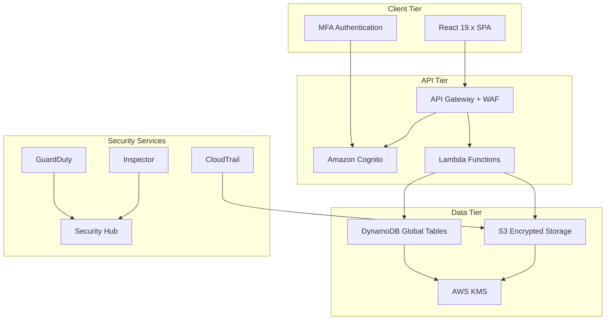

  

<h1 align="center">🎯 CIA Compliance Manager — Future Threat Model</h1>

  <strong>🛡️ AWS Serverless Backend Security Through Structured Threat Analysis</strong> 
  <em>🔍 STRIDE • MITRE ATT&CK • Cloud Security • Multi-Tenant SaaS • API Security</em>

  
  
  
  

**📋 Document Owner:** CEO | **📄 Version:** 2.0-DRAFT | **📅 Last Updated:** 2026-02-20 (UTC)
**🔄 Review Cycle:** Quarterly | **🏷️ Classification:** Public (Open Source Compliance Platform)

---

## 📚 Architecture Documentation Map

| Document | Focus | Description |
|----------|-------|-------------|
| [🏗️ Architecture](./ARCHITECTURE.md) | C4 Model | Current system architecture |
| [🏗️ Future Architecture](./FUTURE_ARCHITECTURE.md) | Evolution | AWS serverless evolution roadmap |
| [🛡️ Security Architecture](./SECURITY_ARCHITECTURE.md) | Security | Current defense-in-depth controls |
| [🛡️ Future Security Architecture](./FUTURE_SECURITY_ARCHITECTURE.md) | Security Evolution | AWS security services roadmap |
| [🎯 Threat Model](./THREAT_MODEL.md) | Current Threats | v1.0 threat analysis (STRIDE + MITRE ATT&CK) |
| **[🎯 Future Threat Model](./FUTURE_THREAT_MODEL.md)** | **Future Threats** | **This document — v2.0 threat evolution** |
| [📊 Data Model](./DATA_MODEL.md) | Data | Current data architecture |
| [📊 Future Data Model](./FUTURE_DATA_MODEL.md) | Data Evolution | DynamoDB + multi-region data |
| [🔄 Workflows](./WORKFLOWS.md) | CI/CD | Current DevOps workflows |
| [🔄 Future Workflows](./FUTURE_WORKFLOWS.md) | CI/CD Evolution | Enhanced automation pipeline |

---

## 🎯 Purpose & Scope

This document extends the [current Threat Model](./THREAT_MODEL.md) to analyze the expanded attack surface introduced by the planned evolution from a **static frontend application** to a **full-stack AWS serverless multi-tenant SaaS platform**. It follows the [Hack23 AB Threat Modeling Policy](https://github.com/Hack23/ISMS-PUBLIC/blob/main/Threat_Modeling.md) methodology.

### 🔗 ISMS Policy Alignment

| Policy | Relevance |
|--------|-----------|
| [🎯 Threat Modeling](https://github.com/Hack23/ISMS-PUBLIC/blob/main/Threat_Modeling.md) | STRIDE framework, attack trees, risk quantification |
| [🛡️ Secure Development Policy](https://github.com/Hack23/ISMS-PUBLIC/blob/main/Secure_Development_Policy.md) | Security-integrated SDLC requirements |
| [🔑 Access Control Policy](https://github.com/Hack23/ISMS-PUBLIC/blob/main/Access_Control_Policy.md) | IAM, RBAC, least privilege patterns |
| [🔒 Cryptography Policy](https://github.com/Hack23/ISMS-PUBLIC/blob/main/Cryptography_Policy.md) | TLS, encryption at rest, key management |
| [🌐 Network Security Policy](https://github.com/Hack23/ISMS-PUBLIC/blob/main/Network_Security_Policy.md) | Zero-trust, VPC design, WAF configuration |
| [🔍 Vulnerability Management](https://github.com/Hack23/ISMS-PUBLIC/blob/main/Vulnerability_Management.md) | Security testing and remediation SLAs |
| [🚨 Incident Response Plan](https://github.com/Hack23/ISMS-PUBLIC/blob/main/Incident_Response_Plan.md) | Security incident procedures |

---

## 📊 Future System Architecture Overview

### v2.0 Target Architecture

---

## 🎭 STRIDE Threat Analysis — Future Architecture

### S — Spoofing (Identity)

| ID | Threat | Target | Likelihood | Impact | Risk | Mitigation |
|----|--------|--------|------------|--------|------|------------|
| FT-S1 | Credential stuffing against Cognito | Authentication | Medium | High | High | MFA enforcement, account lockout, rate limiting |
| FT-S2 | JWT token forgery/replay | API Gateway | Low | Critical | High | Short-lived tokens, token rotation, JWK validation |
| FT-S3 | OAuth2 redirect manipulation | Authentication flow | Medium | High | High | Strict redirect URI validation, PKCE flow |
| FT-S4 | Cross-tenant identity confusion | Multi-tenant auth | Low | Critical | High | Tenant isolation in token claims, namespace separation |

### T — Tampering (Data Integrity)

| ID | Threat | Target | Likelihood | Impact | Risk | Mitigation |
|----|--------|--------|------------|--------|------|------------|
| FT-T1 | API request manipulation | Lambda functions | Medium | High | High | Input validation, schema enforcement, WAF rules |
| FT-T2 | DynamoDB data corruption | Data tier | Low | Critical | High | DynamoDB encryption, IAM least privilege, audit logging |
| FT-T3 | Assessment result tampering | Business logic | Medium | High | High | Immutable audit trail, cryptographic integrity checks |
| FT-T4 | S3 object modification | Storage | Low | High | Medium | S3 Object Lock, versioning, KMS encryption |

### R — Repudiation

| ID | Threat | Target | Likelihood | Impact | Risk | Mitigation |
|----|--------|--------|------------|--------|------|------------|
| FT-R1 | Denial of assessment actions | User activity | Medium | Medium | Medium | CloudTrail logging, application-level audit trail |
| FT-R2 | Administrative action denial | Admin operations | Low | High | Medium | CloudTrail with log file integrity validation |
| FT-R3 | API access denial | API Gateway | Medium | Medium | Medium | API Gateway access logs, request correlation IDs |

### I — Information Disclosure

| ID | Threat | Target | Likelihood | Impact | Risk | Mitigation |
|----|--------|--------|------------|--------|------|------------|
| FT-I1 | Cross-tenant data leakage | Multi-tenant data | Low | Critical | High | Tenant-partitioned keys, IAM condition keys (e.g., dynamodb:LeadingKeys), application-layer authorization and query filtering |
| FT-I2 | API response data exposure | API endpoints | Medium | High | High | Response filtering, field-level access control |
| FT-I3 | CloudWatch log data exposure | Monitoring | Low | Medium | Medium | Log group encryption, IAM access control |
| FT-I4 | S3 bucket misconfiguration | Storage | Low | Critical | High | S3 Block Public Access, bucket policies, encryption |

### D — Denial of Service

| ID | Threat | Target | Likelihood | Impact | Risk | Mitigation |
|----|--------|--------|------------|--------|------|------------|
| FT-D1 | API Gateway throttling attack | API tier | High | Medium | High | WAF rate limiting, API throttling, CloudFront |
| FT-D2 | Lambda concurrency exhaustion | Compute | Medium | High | High | Reserved concurrency, provisioned concurrency |
| FT-D3 | DynamoDB capacity exhaustion | Data tier | Low | High | Medium | Auto-scaling, on-demand capacity, request throttling |

### E — Elevation of Privilege

| ID | Threat | Target | Likelihood | Impact | Risk | Mitigation |
|----|--------|--------|------------|--------|------|------------|
| FT-E1 | Lambda execution role abuse | Compute | Low | Critical | High | Least privilege IAM, per-function roles |
| FT-E2 | Cognito group escalation | Authorization | Low | Critical | High | Server-side group validation, admin API protection |
| FT-E3 | Cross-tenant privilege escalation | Multi-tenant | Low | Critical | Critical | Tenant-scoped tokens, resource-level policies |

---

## 🎖️ MITRE ATT&CK Mapping — Cloud Threats

| Tactic | Technique | Future Component | Risk Level |
|--------|-----------|-----------------|------------|
| Initial Access | T1078 - Valid Accounts | Cognito user pool | 🟠 High |
| Initial Access | T1190 - Exploit Public-Facing App | API Gateway | 🟡 Medium |
| Persistence | T1098 - Account Manipulation | IAM / Cognito | 🟠 High |
| Privilege Escalation | T1548 - Abuse Elevation Control | Lambda IAM roles | 🟠 High |
| Defense Evasion | T1562 - Impair Defenses | GuardDuty / CloudTrail | 🟡 Medium |
| Credential Access | T1528 - Steal Application Access Token | JWT tokens | 🟠 High |
| Discovery | T1580 - Cloud Infrastructure Discovery | AWS resources | 🟡 Medium |
| Collection | T1530 - Data from Cloud Storage | S3 / DynamoDB | 🟠 High |
| Exfiltration | T1537 - Transfer Data to Cloud Account | Cross-account | 🟡 Medium |
| Impact | T1496 - Resource Hijacking | Lambda / compute | 🟡 Medium |

---

## 📊 Quantitative Risk Assessment

### Risk Matrix (Future Architecture)

| | **Negligible** | **Minor** | **Moderate** | **Major** | **Critical** |
|---|---|---|---|---|---|
| **Almost Certain** | Medium | High | High | Critical | Critical |
| **Likely** | Low | Medium | High | High | Critical |
| **Possible** | Low | Medium | Medium | High | High |
| **Unlikely** | Low | Low | Medium | Medium | High |
| **Rare** | Low | Low | Low | Medium | Medium |

### Top 5 Future Risks

| Rank | Risk | Score | Treatment |
|------|------|-------|-----------|
| 1 | Cross-tenant data leakage (FT-I1) | Critical | Mitigate: DynamoDB partition-key scoping, IAM condition keys, app-layer tenant authorization |
| 2 | Cross-tenant privilege escalation (FT-E3) | Critical | Mitigate: Tenant-scoped tokens, namespace isolation |
| 3 | JWT token forgery/replay (FT-S2) | High | Mitigate: Short-lived tokens, PKCE, JWK rotation |
| 4 | API Gateway DDoS (FT-D1) | High | Mitigate: WAF, rate limiting, AWS Shield (Standard/Advanced) + CloudFront |
| 5 | Lambda execution role abuse (FT-E1) | High | Mitigate: Per-function least-privilege IAM roles |

---

## 🔒 Security Controls Roadmap

### Phase 1: Authentication & Authorization (v2.0)

| Control | AWS Service | ISMS Policy |
|---------|-------------|-------------|
| MFA enforcement | Amazon Cognito | [Access Control](https://github.com/Hack23/ISMS-PUBLIC/blob/main/Access_Control_Policy.md) |
| RBAC implementation | Cognito Groups + Lambda | [Access Control](https://github.com/Hack23/ISMS-PUBLIC/blob/main/Access_Control_Policy.md) |
| JWT validation | API Gateway authorizer | [Cryptography](https://github.com/Hack23/ISMS-PUBLIC/blob/main/Cryptography_Policy.md) |
| Session management | Cognito + CloudFront | [Access Control](https://github.com/Hack23/ISMS-PUBLIC/blob/main/Access_Control_Policy.md) |

### Phase 2: Data Protection (v2.1)

| Control | AWS Service | ISMS Policy |
|---------|-------------|-------------|
| Encryption at rest | KMS + DynamoDB | [Cryptography](https://github.com/Hack23/ISMS-PUBLIC/blob/main/Cryptography_Policy.md) |
| Encryption in transit | TLS 1.3 | [Cryptography](https://github.com/Hack23/ISMS-PUBLIC/blob/main/Cryptography_Policy.md) |
| Data classification | DynamoDB tags + policies | [Data Classification](https://github.com/Hack23/ISMS-PUBLIC/blob/main/Data_Classification_Policy.md) |
| Tenant isolation | DynamoDB partition-key scoping + IAM condition keys | [Access Control](https://github.com/Hack23/ISMS-PUBLIC/blob/main/Access_Control_Policy.md) |

### Phase 3: Monitoring & Response (v2.2)

| Control | AWS Service | ISMS Policy |
|---------|-------------|-------------|
| Threat detection | GuardDuty | [Incident Response](https://github.com/Hack23/ISMS-PUBLIC/blob/main/Incident_Response_Plan.md) |
| Security posture | Security Hub | [Vulnerability Management](https://github.com/Hack23/ISMS-PUBLIC/blob/main/Vulnerability_Management.md) |
| Audit logging | CloudTrail | [Information Security](https://github.com/Hack23/ISMS-PUBLIC/blob/main/Information_Security_Policy.md) |
| Vulnerability scanning | Inspector | [Vulnerability Management](https://github.com/Hack23/ISMS-PUBLIC/blob/main/Vulnerability_Management.md) |

---

## 🏗️ Comparison: v1.0 vs v2.0 Attack Surface

| Dimension | v1.0 (Current) | v2.0 (Future) | Impact |
|-----------|----------------|---------------|--------|
| **Architecture** | Static SPA | Full-stack serverless | ⬆️ Expanded attack surface |
| **Authentication** | None (public tool) | Cognito MFA | ⬆️ New auth attack vectors |
| **Data Storage** | Client-side only | DynamoDB + S3 | ⬆️ Data breach risk |
| **API Surface** | None | REST API via API Gateway | ⬆️ API exploitation risk |
| **Multi-Tenancy** | N/A | Full tenant isolation | ⬆️ Cross-tenant risks |
| **Hosting** | GitHub Pages | CloudFront + API Gateway | ➡️ Similar CDN risk |
| **CI/CD** | GitHub Actions | GitHub Actions + CodePipeline | ⬆️ Supply chain complexity |
| **Monitoring** | Basic | GuardDuty + Security Hub | ⬇️ Improved detection |
| **Encryption** | HTTPS only | KMS + at-rest encryption | ⬇️ Improved data protection |

---

## 📋 Related Documents

| Icon | Document | Relationship |
|------|----------|--------------|
| 📖 | [ISMS-PUBLIC README](https://github.com/Hack23/ISMS-PUBLIC/blob/main/README.md) | Master ISMS documentation index |
| 🏷️ | [CLASSIFICATION.md](https://github.com/Hack23/ISMS-PUBLIC/blob/main/CLASSIFICATION.md) | Classification framework |
| 🎯 | [Threat Model (Current)](./THREAT_MODEL.md) | v1.0 threat analysis baseline |
| 🛡️ | [Security Architecture](./SECURITY_ARCHITECTURE.md) | Current security controls |
| 🔮 | [Future Security Architecture](./FUTURE_SECURITY_ARCHITECTURE.md) | Planned security enhancements |
| 🏗️ | [Future Architecture](./FUTURE_ARCHITECTURE.md) | System evolution roadmap |
| 📋 | [CRA Assessment](../../CRA-ASSESSMENT.md) | EU Cyber Resilience Act compliance |
| 🗺️ | [ISMS Reference Mapping](../../ISMS_REFERENCE_MAPPING.md) | Complete ISMS policy mapping |

---

## 📋 Document Control

**Approved by:** James Pether Sörling, CEO, Hack23 AB
**Distribution:** Public (GitHub Repository)
**Classification:** 

---

### 🏆 Framework Alignment

