# 🔧 Future CIA Compliance Manager DevOps and CI/CD Workflows

> **Version:** v2.0-DRAFT | **Based on:** v1.1 Baseline | **Last Updated:** 2026-01-11 | **Status:** 🚀 Evolution Roadmap

This document outlines the future vision for CI/CD and DevOps workflows that will support the CIA Compliance Manager as it evolves from v1.1 baseline into a context-aware security posture management platform. These enhanced workflows will incorporate machine learning model training, automated security validation, and continuous adaptation capabilities.

## 📊 Current Baseline (v1.1)

The future enhancements build upon the robust v1.1 workflow foundation:

**Current Workflow Strengths:**
- ✅ **Multi-job Test Pipeline**: 5-job coordinated testing (prepare, build-validation, unit-tests, e2e-tests, report)
- ✅ **3-stage Release Process**: Comprehensive prepare → build → release workflow
- ✅ **SLSA Level 3 Compliance**: Full attestation and SBOM generation
- ✅ **Parallel Test Execution**: Unit and E2E tests run concurrently after build validation
- ✅ **Comprehensive Security Scanning**: CodeQL, Dependency Review, Scorecard, ZAP, Lighthouse
- ✅ **Automated PR Management**: Labeling, dependency review, test reporting
- ✅ **Documentation Pipeline**: Integrated documentation generation and deployment

**Areas for Enhancement:**
1. **ML Model Integration**: Add ML training and validation pipelines
2. **Advanced Deployment Strategies**: Implement canary releases and progressive rollout
3. **Automated Remediation**: Auto-fix security findings and dependency updates
4. **Performance Optimization**: Reduce build times through advanced caching and parallelization
5. **Context-Aware Testing**: Intelligent test selection based on code changes
6. **Enhanced Monitoring**: Real-time deployment health checks and automatic rollback

## 📚 Related Architecture Documentation

<div class="documentation-map">

### Current Architecture (v1.0 Baseline)
| Document                                            | Focus           | Description                               |
| --------------------------------------------------- | --------------- | ----------------------------------------- |
| **[Current Architecture](ARCHITECTURE.md)**         | 🏛️ Architecture | C4 model showing v1.0 AWS multi-region structure |
| **[Current Workflows](WORKFLOWS.md)**               | 🔧 DevOps       | v1.0 AWS deployment with OIDC and CloudFront |
| **[Current State Diagrams](STATEDIAGRAM.md)**       | 🔄 Behavior     | v1.0 state transitions                    |
| **[Current Flowcharts](FLOWCHART.md)**              | 🔄 Process      | v1.0 security workflows                   |

### Future Architecture Evolution (v2.0+)
| Document                                            | Focus           | Description                               |
| --------------------------------------------------- | --------------- | ----------------------------------------- |
| **[Future Architecture](FUTURE_ARCHITECTURE.md)**   | 🏛️ Architecture | Vision for context-aware platform         |
| **[Future Workflows](FUTURE_WORKFLOWS.md)**         | 🔧 DevOps       | **This document** - Enhanced CI/CD with ML |
| **[Future State Diagrams](FUTURE_STATEDIAGRAM.md)** | 🔄 Behavior     | Context-aware state management            |
| **[Future Security Architecture](FUTURE_SECURITY_ARCHITECTURE.md)** | 🛡️ Security | AWS cloud security architecture   |
| **[Future Flowcharts](FUTURE_FLOWCHART.md)**        | 🔄 Process      | Enhanced context-aware workflows          |
| **[Future Mindmaps](FUTURE_MINDMAP.md)**            | 🧠 Concept      | Future capability evolution               |
| **[Future SWOT Analysis](FUTURE_SWOT.md)**          | 💼 Business     | Future strategic opportunities            |
| **[Future Data Model](FUTURE_DATA_MODEL.md)**       | 📊 Data         | Context-aware data architecture           |

</div>

## 🔄 Enhanced CI/CD Workflow Overview

The future CI/CD workflows for the CIA Compliance Manager will build on the current foundation while adding significant enhancements for machine learning model training, security validation, and automated adaptation.


## 🧠 Machine Learning Pipeline Integration

The future CI/CD system will incorporate machine learning model training, validation, and deployment as a core aspect of the workflow.


| ML Pipeline Stage      | Description                                       | Integration Point                 | Metrics & Validation                         |
|------------------------|---------------------------------------------------|----------------------------------|--------------------------------------------|
| 🧪 Data Preparation    | Process historical assessment and feedback data   | Data pipelines in CI/CD workflow | Data completeness, balance, quality        |
| 🔍 Model Training      | Train and validate recommendation models          | Pre-release workflow             | Accuracy, precision, recall, F1-score      |
| 📊 Performance Testing | Validate model against test datasets              | Quality gates                    | Confusion matrix, ROC curve                |
| 📦 Model Packaging     | Package models for deployment                     | Release packaging                | Size, format, dependencies                 |
| 🔏 Model Attestation   | Create cryptographic attestations for models      | Security workflow                | Signature verification, provenance         |
| 🚀 Model Deployment    | Deploy models to production environment           | Deployment pipeline              | Loading time, inference performance        |
| 📈 Performance Monitoring | Monitor model performance in production       | Post-deployment                  | Drift detection, accuracy degradation      |
| 🔄 Feedback Loop       | Collect feedback for retraining                   | Continuous improvement           | User correction rate, suggestion adoption  |

## 🔒 Enhanced Security Automation Workflow

Future CI/CD pipelines will incorporate advanced security automation that continuously validates and improves the security posture of the CIA Compliance Manager.


## 🚀 Continuous Deployment Evolution

The future deployment pipeline will evolve to support more sophisticated release strategies and automated operational feedback loops.


## 🔍 Security and Compliance Integration

The future workflow will deeply integrate security and compliance validation throughout the CI/CD process.

```mermaid
sequenceDiagram
    participant Dev as 👩‍💻 Developer
    participant CI as 🔄 CI System
    participant Sec as 🔒 Security Services
    participant Comp as 📋 Compliance Services
    participant ML as 🧠 ML Pipeline
    participant Ops as 🚀 Operations
    
    Dev->>CI: Submit Code Change
    CI->>Sec: Run Security Scans
    CI->>Comp: Verify Compliance Impact
    
    par Security Analysis
        Sec->>Sec: Static Analysis
        Sec->>Sec: Dependency Scan
        Sec->>Sec: Container Scan
    and Compliance Checks
        Comp->>Comp: Framework Mapping
        Comp->>Comp: Control Validation
        Comp->>Comp: Documentation Check
    end
    
    Sec-->>CI: Security Results
    Comp-->>CI: Compliance Status
    
    alt Security or Compliance Issues
        CI->>Dev: Return Issues for Remediation
        Dev->>CI: Submit Fixes
    else All Checks Pass
        CI->>ML: Trigger ML Validation
        ML->>ML: Validate Model Impact
        ML-->>CI: ML Validation Results
        CI->>Ops: Approve for Deployment
    end
    
    Ops->>Ops: Progressive Deployment
    Ops->>Sec: Runtime Security Monitoring
    Ops->>Comp: Compliance Monitoring
    
    loop Feedback Collection
        Ops->>ML: Usage Telemetry
        ML->>ML: Model Performance Analysis
        ML->>CI: Trigger Model Updates
    end
```



## 🔌 Integration Ecosystem Workflow

The future CI/CD pipeline will integrate with a broader ecosystem of security and development tools.


## 📊 ML-Powered DevOps Analytics

Future workflows will incorporate ML-powered analytics to optimize the development and operations processes.

| Analytics Category | Description | ML Application | Business Impact |
|-------------------|-------------|---------------|----------------|
| 🐛 Defect Prediction | Predict potential defects in code changes | Classification model trained on historical defects | 30-40% reduction in post-deployment bugs |
| 🔄 CI/CD Optimization | Optimize build and test pipeline efficiency | Regression model for build time prediction | 25% faster build times, resource optimization |
| 📈 Performance Forecasting | Predict application performance impacts | Time-series forecasting of performance metrics | Proactive performance issue prevention |
| 👤 User Experience Analysis | Analyze user interaction patterns | Clustering and anomaly detection | Improved user satisfaction and feature adoption |
| 🔒 Security Risk Prediction | Predict security risks in code changes | Ensemble models for vulnerability prediction | Earlier detection of potential security issues |
| 📊 Resource Optimization | Optimize deployment resource utilization | Reinforcement learning for auto-scaling | 15-20% reduction in hosting costs |
| 🔍 Root Cause Analysis | Automate issue root cause identification | NLP and classification for error patterns | Faster incident resolution (40% MTTR reduction) |

## 🎯 Specific Implementation Recommendations

Based on the current v1.1 baseline, the following enhancements are recommended for future iterations:

### Phase 1: Immediate Improvements (Q1 2026)

**1. Enhanced Caching Strategy**
- **Current State**: Basic npm and Cypress caching in place
- **Enhancement**: Implement multi-layer caching with cache warming
- **Expected Benefit**: 25-30% reduction in build times
- **Implementation**:
  ```yaml
  - name: Cache Docker layers
    uses: actions/cache@v5
    with:
      path: /tmp/.buildx-cache
      key: ${{ runner.os }}-buildx-${{ github.sha }}
      restore-keys: |
        ${{ runner.os }}-buildx-
  ```

**2. Parallel Documentation Generation**
- **Current State**: Documentation generated serially in prepare job
- **Enhancement**: Split documentation generation into parallel jobs
- **Expected Benefit**: 40% faster documentation builds
- **Implementation**: Separate jobs for API docs, TypeDoc, UML diagrams, coverage reports

**3. Intelligent Test Selection**
- **Current State**: All tests run on every commit
- **Enhancement**: Run affected tests based on code changes
- **Expected Benefit**: 50% faster test execution for small changes
- **Tool**: Use `nx affected` or custom git diff analysis

### Phase 2: ML Integration (Q2-Q3 2026)

**1. Model Training Pipeline**
- **Integration Point**: Add new job to release workflow after build job
- **Data Sources**: Historical assessment data, user feedback, compliance mappings
- **Training Triggers**: Weekly schedule, major version releases, manual dispatch
- **Validation Gates**: Model accuracy > 85%, precision > 80%, F1-score > 0.82
- **Storage**: AWS S3 or GitHub releases for model artifacts

**2. Model Performance Monitoring**
- **Metrics**: Prediction accuracy, inference time, drift detection
- **Alerting**: Slack/email notifications when performance degrades
- **Auto-retraining**: Trigger when drift exceeds threshold (>10% accuracy drop)

**3. Feature Store Integration**
- **Purpose**: Centralized feature management for ML models
- **Tools**: Feast, Tecton, or custom implementation
- **Benefits**: Consistent features across training and inference

### Phase 3: Advanced Deployment (Q4 2026)

**1. Canary Deployment Implementation**
- **Current State**: Atomic GitHub Pages deployment
- **Enhancement**: Progressive rollout with traffic splitting
- **Tool Options**: Cloudflare Workers, AWS CloudFront with Lambda@Edge
- **Rollout Strategy**: 5% → 25% → 50% → 100% over 2 hours
- **Health Checks**:
  - Error rate < 1%
  - P95 latency < 2s
  - Core Web Vitals in "Good" range
  - Zero critical errors in 10-minute window

**2. Automated Rollback Triggers**
- **Current State**: Manual rollback via workflow dispatch
- **Enhancement**: Automatic rollback on health check failures
- **Implementation**:
  ```yaml
  - name: Monitor deployment health
    run: |
      if [ "$ERROR_RATE" -gt "1" ]; then
        gh workflow run rollback.yml -f version=$PREVIOUS_VERSION
      fi
  ```

**3. Blue-Green Deployment Strategy**
- **Purpose**: Zero-downtime deployments with instant rollback
- **Implementation**: Maintain two production environments, switch via DNS/routing
- **Benefit**: Instant rollback capability, pre-production validation

### Phase 4: Security Automation (2027)

**1. Auto-Remediation of Security Findings**
- **Scope**: Dependabot alerts, CodeQL findings, license violations
- **Process**:
  1. Automated PR creation with fixes
  2. Run full test suite
  3. Request review if tests pass
  4. Auto-merge if approved
- **Safety Measures**: Only apply to low-risk changes, always require review

**2. Security Posture Tracking**
- **Metrics Dashboard**: Real-time security score visualization
- **Trend Analysis**: Historical security metric tracking
- **Benchmarking**: Compare against industry standards
- **Reporting**: Weekly security posture reports to stakeholders

**3. Compliance as Code**
- **Implementation**: Define compliance requirements as code policies
- **Validation**: Automated compliance checking in CI/CD
- **Documentation**: Auto-generate compliance evidence
- **Auditing**: Immutable compliance audit trail

### Phase 5: Performance Optimization (2027)

**1. Matrix Build Strategy**
- **Current State**: Single platform (ubuntu-latest) build
- **Enhancement**: Test on multiple platforms in parallel
- **Platforms**: Ubuntu, Windows, macOS
- **Benefit**: Catch platform-specific issues early

**2. Remote Caching**
- **Tool**: GitHub Actions cache, AWS S3, or Nx Cloud
- **Benefit**: Share cache across CI runs and team members
- **Expected Improvement**: 40-50% faster cold builds

**3. Build Optimization Analysis**
- **Tool**: Speedscope, build time profiler
- **Purpose**: Identify bottlenecks in build process
- **Action**: Optimize slowest steps first

### Implementation Priority Matrix

| Enhancement | Impact | Effort | Priority | Timeline |
|-------------|--------|--------|----------|----------|
| Enhanced Caching | High | Low | 🔴 Critical | Q1 2026 |
| Parallel Docs | High | Medium | 🔴 Critical | Q1 2026 |
| Intelligent Tests | High | Medium | 🟡 High | Q1-Q2 2026 |
| ML Training Pipeline | Very High | High | 🟡 High | Q2-Q3 2026 |
| Canary Deployment | Medium | High | 🟢 Medium | Q4 2026 |
| Auto-Remediation | High | Very High | 🟢 Medium | 2027 |
| Blue-Green Deploy | Medium | Very High | 🔵 Low | 2027 |
| Matrix Builds | Low | Medium | 🔵 Low | 2027 |

## 🔄 Migration Strategy

### Incremental Enhancement Approach

Rather than a big-bang migration, implement enhancements incrementally:

**Week 1-2: Enhanced Caching**
1. Add Docker layer caching to build job
2. Implement npm cache warming
3. Add TypeScript compilation cache
4. Measure and document improvements

**Week 3-4: Parallel Documentation**
1. Create separate docs generation jobs
2. Parallelize API docs, coverage, UML generation
3. Aggregate documentation artifacts
4. Deploy combined documentation

**Month 2-3: Intelligent Test Selection**
1. Analyze test execution patterns
2. Implement code change detection
3. Create affected test runner
4. Add fallback to full test suite

**Month 4-6: ML Pipeline POC**
1. Design training data collection
2. Implement basic model training job
3. Add model validation gates
4. Store and version models

### Validation Criteria

Each enhancement must meet these criteria before production deployment:

✅ **Performance**: Must not increase overall pipeline time  
✅ **Reliability**: Must maintain or improve success rate  
✅ **Security**: Must pass all security gates  
✅ **Monitoring**: Must include health checks and alerting  
✅ **Documentation**: Must be fully documented  
✅ **Rollback**: Must have clear rollback procedure  

## 🔄 Future CI/CD Evolution Roadmap


<div class="roadmap-legend">
This roadmap outlines the evolution of the CIA Compliance Manager's CI/CD and DevOps workflows to support the platform's transformation into a context-aware, adaptive security management solution. The enhancements will focus on integrating machine learning, automating security validation, and creating continuous feedback loops for ongoing improvement.

Key benefits of these enhancements include:
- 🧠 Intelligent security recommendations that improve based on real-world implementation outcomes
- 🔒 Deeper integration between security validation and development workflows
- 🚀 More reliable and resilient deployments with automated verification
- 📊 Data-driven insights into security posture and development efficiency
- 🔄 Continuous adaptation to emerging threats and changing business contexts
- ⚡ Significant performance improvements through intelligent caching and parallel execution
- 🤖 Automated remediation reducing manual security work by 60%
- 📈 Progressive deployment strategies enabling safer releases with quick rollback
</div>

---

## 📚 Related Resources

### Current Documentation
- [Current Workflows (v1.1)](WORKFLOWS.md) - Detailed documentation of active CI/CD pipelines
- [Current Architecture](ARCHITECTURE.md) - System architecture and design patterns
- [Security Architecture](SECURITY_ARCHITECTURE.md) - Current security controls and threat model

### Future Vision Documents
- [Future Architecture](FUTURE_ARCHITECTURE.md) - Context-aware platform evolution
- [Future Security Architecture](FUTURE_SECURITY_ARCHITECTURE.md) - AWS cloud security architecture
- [Future State Diagrams](FUTURE_STATEDIAGRAM.md) - Enhanced state management patterns
- [Future Data Model](FUTURE_DATA_MODEL.md) - Context-aware data architecture

### External Resources
- [GitHub Actions Documentation](https://docs.github.com/en/actions)
- [SLSA Framework](https://slsa.dev/) - Supply chain security best practices
- [ML in CI/CD Best Practices](https://ml-ops.org/)
- [Progressive Delivery Patterns](https://www.split.io/glossary/progressive-delivery/)
- [Feature Stores](https://feast.dev/)

---

**📋 Document Control:**  
**✅ Status:** Draft - Future Vision Document  
**📤 Distribution:** Public  
**🏷️ Classification:** [](https://github.com/Hack23/ISMS-PUBLIC/blob/main/CLASSIFICATION.md#confidentiality-levels)  
**📅 Baseline Version:** v1.1 (2026-01-11)  
**⏰ Target Timeline:** 2026-2027  
**🯠Framework Compliance:** [](https://github.com/Hack23/ISMS-PUBLIC/blob/main/CLASSIFICATION.md) [](https://github.com/Hack23/ISMS-PUBLIC/blob/main/CLASSIFICATION.md) [](https://github.com/Hack23/ISMS-PUBLIC/blob/main/CLASSIFICATION.md)
