

  

<h1 align="center">🧠 Hack23 AB — CIA Compliance Manager Concept Map</h1>

  <strong>🛡️ System Component Relationships and Architecture</strong> 
  <em>🎯 Visual Mental Model for v1.0 Platform Structure</em>

  
  
  
  

**📋 Document Owner:** CEO | **📄 Version:** 1.0 | **📅 Last Updated:** 2025-11-22 (UTC)  
**🔄 Review Cycle:** Quarterly | **⏰ Next Review:** 2026-02-22

---

## 🎯 **Purpose**

This mindmap provides a comprehensive visual mental model of the CIA Compliance Manager system architecture, illustrating component relationships, service dependencies, and feature organization for the v1.0 release. It serves as a conceptual framework for understanding how different parts of the system work together to deliver security assessment and compliance mapping capabilities.

Per **[Secure Development Policy §10](https://github.com/Hack23/ISMS/blob/main/Secure_Development_Policy.md#-comprehensive-architecture-documentation-portfolio)**, this document maintains the system component inventory aligned with:
- **ISO 27001 (A.8.1)**: System inventory maintained
- **NIST CSF (ID.AM-1)**: Physical devices and systems inventoried
- **CIS Controls (2.1)**: Software inventory maintained

*— James Pether Sörling, CEO/Founder*

---

## 📚 **Related Documentation**

### Current Architecture

| Document                                          | Focus           | Description                               |
| ------------------------------------------------- | --------------- | ----------------------------------------- |
| **[Architecture](ARCHITECTURE.md)**               | 🏗️ C4 Model     | C4 model showing system structure          |
| **[System Architecture](SYSTEM_ARCHITECTURE.md)** | 🏛️ System       | Layered architecture and component details |
| **[Widget Analysis](WIDGET_ANALYSIS.md)**         | 🧩 Components   | Detailed widget component analysis        |
| **[Data Model](DATA_MODEL.md)**                   | 📊 Data         | Data structures and relationships          |
| **[Security Architecture](SECURITY_ARCHITECTURE.md)** | 🔐 Security  | Security controls and implementation      |

### Behavioral & Process Documentation

| Document                                       | Focus           | Description                               |
| ---------------------------------------------- | --------------- | ----------------------------------------- |
| **[State Diagrams](STATEDIAGRAM.md)**          | 🔄 Behavior     | System state transitions                   |
| **[Process Flowcharts](FLOWCHART.md)**         | 🔄 Process      | Security assessment workflows              |
| **[Workflows](WORKFLOWS.md)**                  | 🚀 DevOps       | CI/CD and development workflows            |

### Strategic & Planning

| Document                                       | Focus           | Description                               |
| ---------------------------------------------- | --------------- | ----------------------------------------- |
| **[SWOT Analysis](SWOT.md)**                  | 💼 Business     | Strategic business assessment              |
| **[Future Mindmap](FUTURE_MINDMAP.md)**       | 🚀 Evolution    | Future system expansion plans              |

---

## 🎨 **Mindmap Color Legend**

This document uses consistent color schemes aligned with the **[ISMS Style Guide](https://github.com/Hack23/ISMS/blob/main/STYLE_GUIDE.md#mermaid-diagram-standards)**:

### Classification Colors
- **🔴 Critical/High** - `#D32F2F` (Red) - Core components, critical security controls
- **🟠 Medium/Moderate** - `#FF9800` (Orange) - Important components, standard controls
- **🟡 Low/Standard** - `#FFC107` (Amber) - Supporting components, basic functionality
- **🟢 Public/Minimal** - `#4CAF50` (Green) - Public interfaces, documentation
- **⚪ Neutral** - `#9E9E9E` (Grey) - Infrastructure, utilities

### Process & Domain Colors
- **🔵 Technical** - `#455A64` (Blue Grey) - Technical implementation, code
- **🟣 Security** - `#7B1FA2` (Purple) - Security services, controls
- **🟢 Business** - `#2E7D32` (Dark Green) - Business logic, assessment
- **🟤 Operations** - `#8D6E63` (Brown) - CI/CD, testing, deployment

---

## 📊 **v1.0 System Overview**

Complete system structure showing all major components and their relationships.

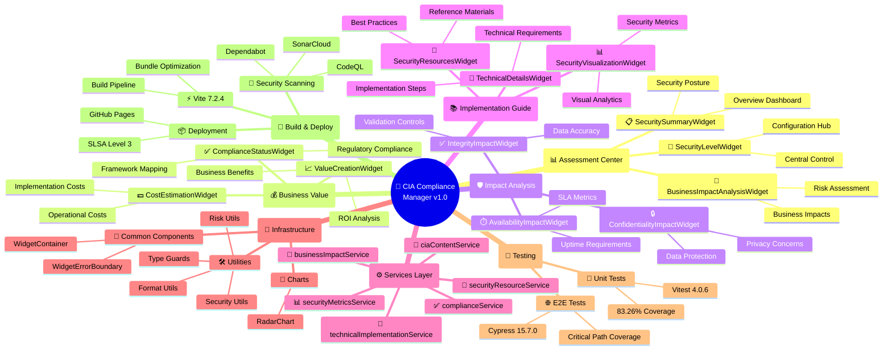

---

## 🧩 **Widget Architecture**

Detailed breakdown of widget components organized by functional area.

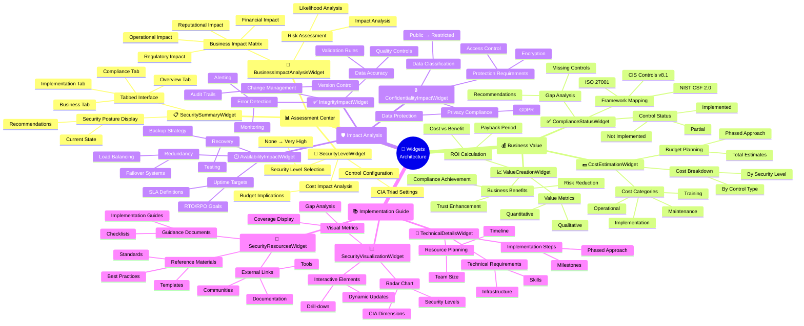

---

## 🔐 **Service Layer Architecture**

Service dependencies and data flow relationships.

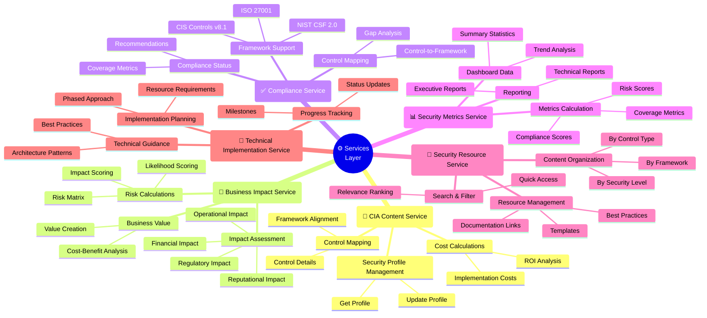

---

## 🛠️ **Utility & Infrastructure**

Supporting utilities, helpers, and common components.

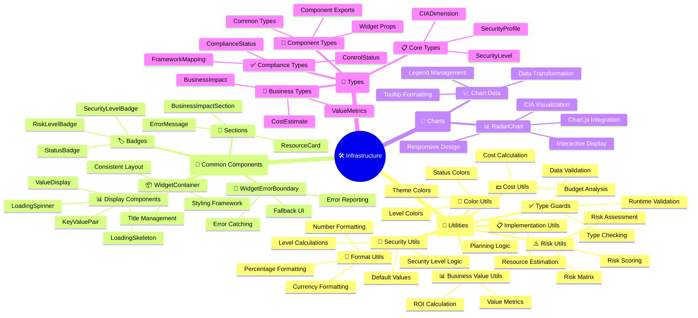

---

## 🧪 **Testing Infrastructure**

Testing organization and coverage strategy.

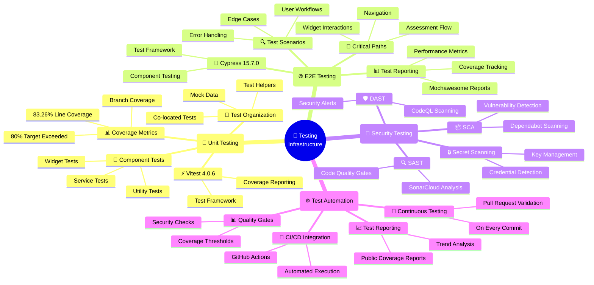

---

## 🚀 **Build & Deployment Pipeline**

Build process, optimization, and deployment strategy.

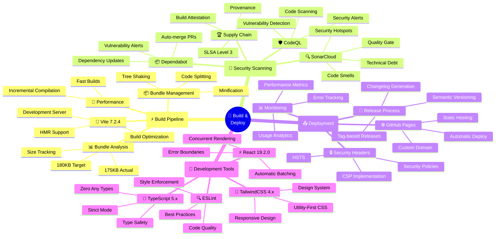

---

## 🌐 **External System Dependencies**

Third-party services and external integrations.

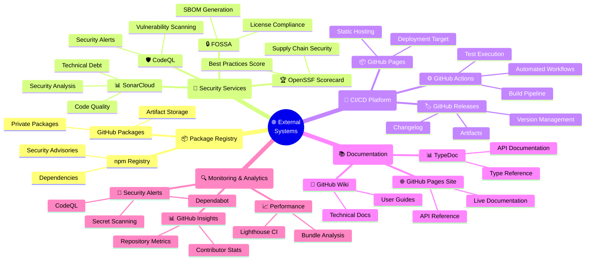

---

## 🎯 **Technology Stack Relationships**

Core technology choices and their interconnections.

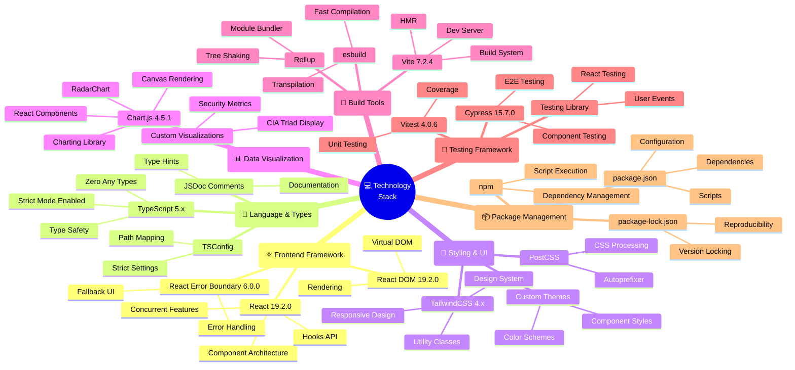

---

## 🔐 **Core Security Concepts**

Fundamental CIA triad concepts and security principles.

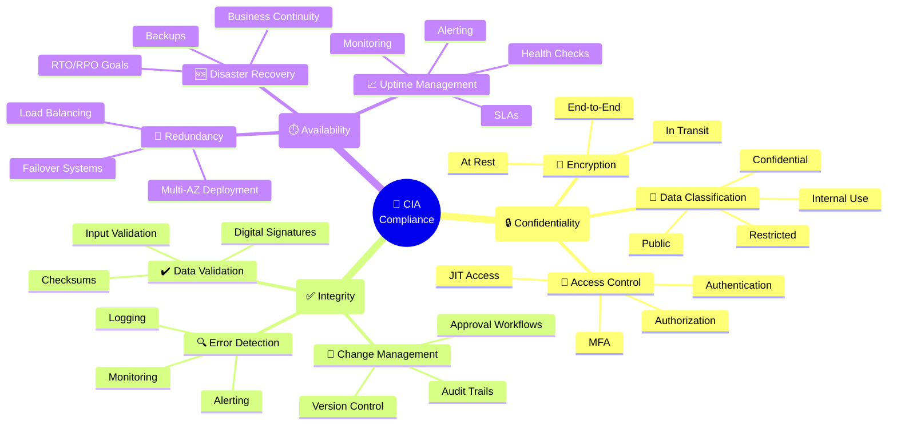

---

## 💼 **Business to Technical Mapping**

How business requirements translate to technical implementation.

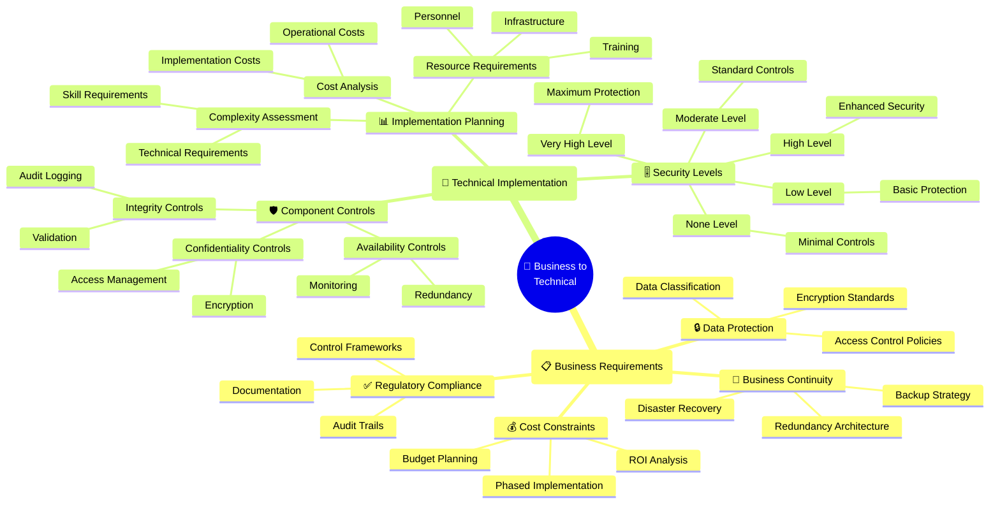

---

## 📊 **Data Flow & State Management**

How data flows through the application and state is managed.

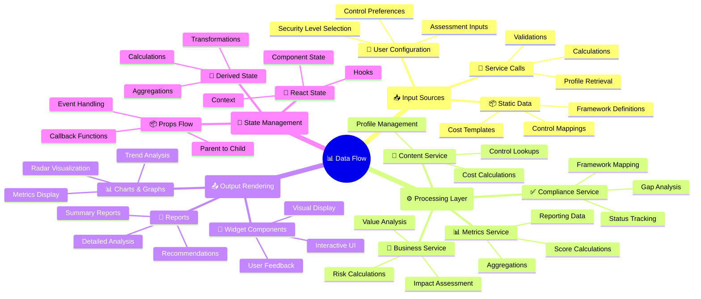

---

## 🎯 **Feature Organization**

How features are organized and grouped in the application.

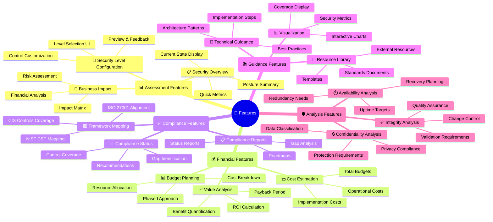

---

## 🔄 **Component Lifecycle**

Component initialization, updates, and cleanup patterns.

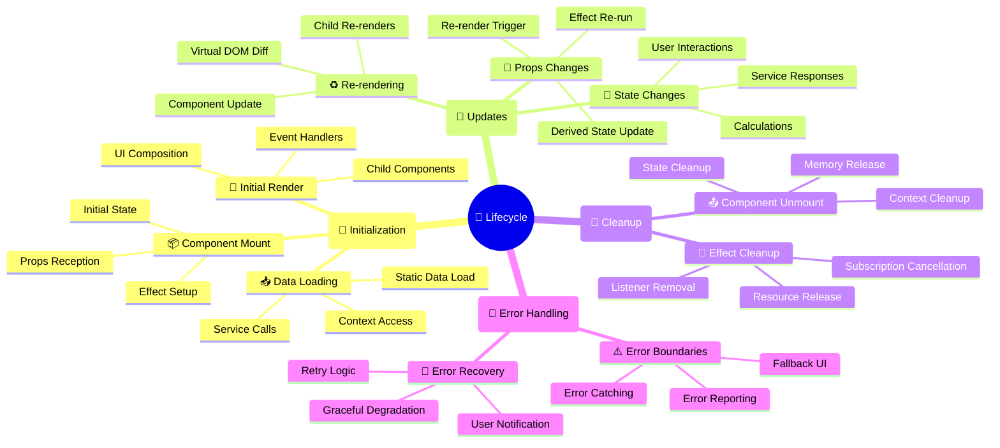

---

This mindmap visualizes the comprehensive v1.0 architecture of the CIA Compliance Manager system, providing clear mental models for understanding component relationships, service dependencies, technology stack integration, and feature organization. The diagrams use consistent color coding and hierarchical organization to facilitate quick comprehension and navigation of the system's structure.

---

**📋 Document Control:**  
**✅ Approved by:** James Pether Sörling, CEO  
**📤 Distribution:** Public  
**🏷️ Classification:**   
**📅 Effective Date:** 2025-11-22  
**⏰ Next Review:** 2026-02-22  
**🎯 Framework Compliance:**   
