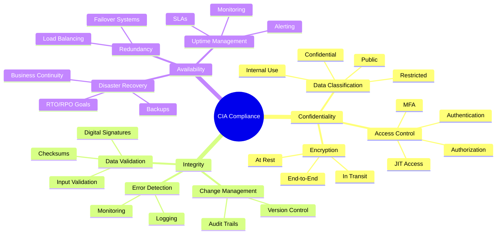
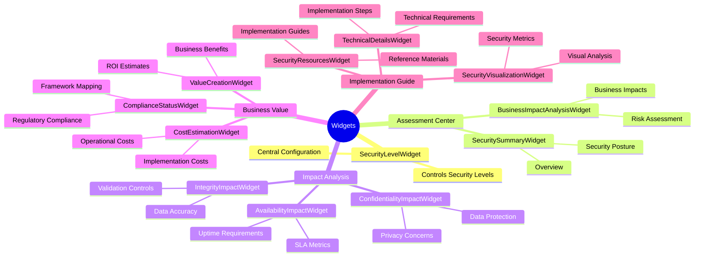
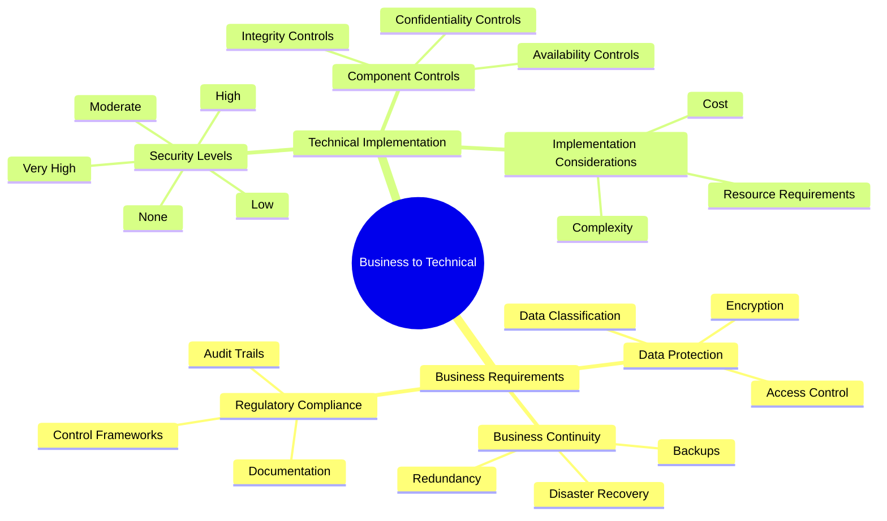
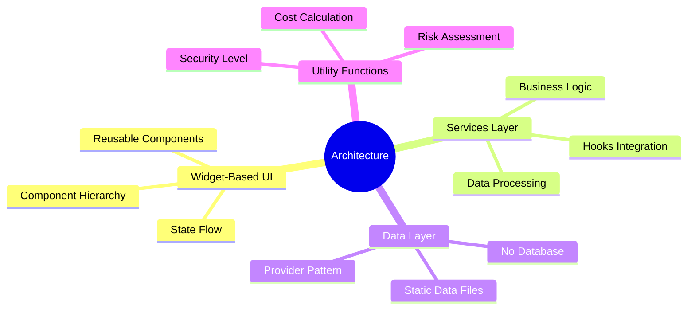

# 🧠 CIA Compliance Manager Concept Map

## 📚 Related Documentation

| Document                                          | Focus           | Description                               |
| ------------------------------------------------- | --------------- | ----------------------------------------- |
| **[System Architecture](SYSTEM_ARCHITECTURE.md)** | 🏛️ System       | Layered architecture and component details |
| **[Architecture](ARCHITECTURE.md)**               | 🏗️ C4 Model     | C4 model showing system structure          |
| **[Widget Analysis](WIDGET_ANALYSIS.md)**         | 🧩 Components   | Detailed widget component analysis        |

## Core Security Concepts

## Widget Relationships

## Business to Technical Mapping

## Key Architecture Concepts

This mindmap visualizes the key concepts and their relationships within the CIA Compliance Manager system, helping new team members understand the conceptual framework. The mindmaps provide a high-level overview of security concepts, widget relationships, business-to-technical mappings, and key architecture concepts.
