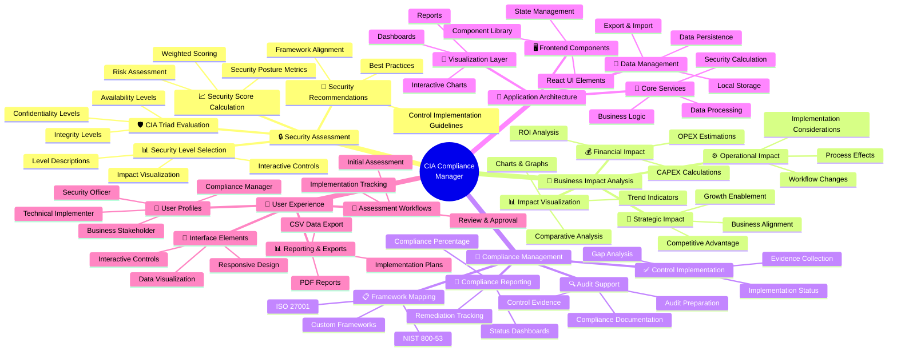
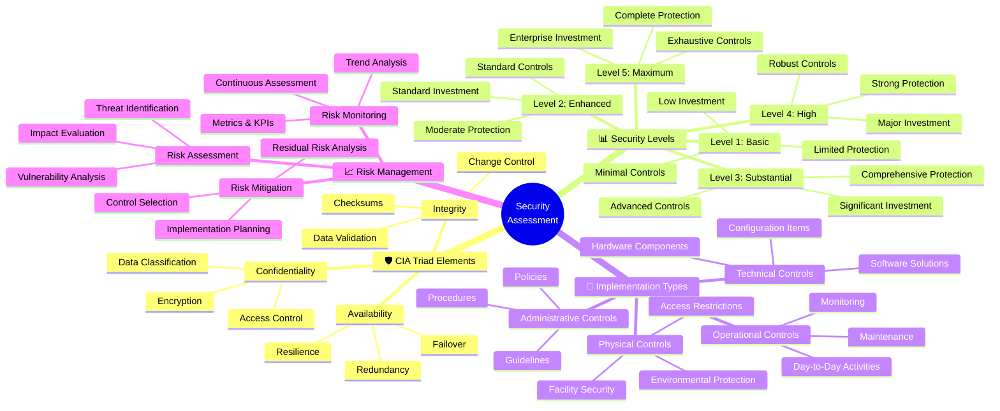
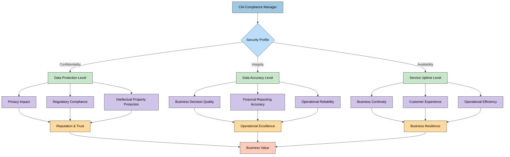
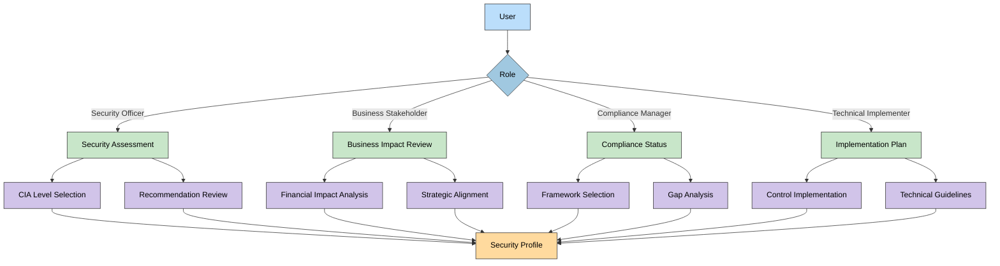

# 🧠 CIA Compliance Manager Mindmap

This document provides a conceptual overview of the CIA Compliance Manager system, showing the relationships between different components, features, and concepts using mindmap visualizations.

## 📚 Related Architecture Documentation

| Document                                            | Focus           | Description                               |
| --------------------------------------------------- | --------------- | ----------------------------------------- |
| **[Current Architecture](ARCHITECTURE.md)**         | 🏛️ Architecture | C4 model showing current system structure |
| **[Future Architecture](FUTURE_ARCHITECTURE.md)**   | 🏛️ Architecture | Vision for context-aware platform         |
| **[State Diagrams](STATEDIAGRAM.md)**               | 🔄 Behavior     | Current system state transitions          |
| **[Future State Diagrams](FUTURE_STATEDIAGRAM.md)** | 🔄 Behavior     | Enhanced adaptive state transitions       |
| **[Process Flowcharts](FLOWCHART.md)**              | 🔄 Process      | Current security workflows                |
| **[Future Flowcharts](FUTURE_FLOWCHART.md)**        | 🔄 Process      | Enhanced context-aware workflows          |
| **[Future Mindmaps](FUTURE_MINDMAP.md)**            | 🧠 Concept      | Future capability evolution               |
| **[SWOT Analysis](SWOT.md)**                        | 💼 Business     | Current strategic assessment              |
| **[Future SWOT Analysis](FUTURE_SWOT.md)**          | 💼 Business     | Future strategic opportunities            |
| **[CI/CD Workflows](WORKFLOWS.md)**                 | 🔧 DevOps       | Current automation processes              |
| **[Future Workflows](FUTURE_WORKFLOWS.md)**         | 🔧 DevOps       | Enhanced CI/CD with ML                    |
| **[Future Data Model](FUTURE_DATA_MODEL.md)**       | 📊 Data         | Context-aware data architecture           |

## 🧩 System Overview Mindmap

**🏛️ Architecture Focus:** Provides a hierarchical view of the CIA Compliance Manager's components, showing their organization and relationships.

**💼 Business Focus:** Maps the business capabilities to the technical components that implement them.

## 🧠 Security Assessment Components

**🔒 Security Focus:** Provides a detailed breakdown of security assessment components and their relationships.

**🔧 Technical Focus:** Shows how the technical implementation supports the security assessment methodology.

## 📊 Business Impact Relationship Map

**💼 Business Focus:** Maps the relationships between security implementations and business impacts.

**🔗 Integration Focus:** Shows how security decisions and business outcomes are connected.

## 🔄 Key Component Relationships

| Component                | Related Components                     | Business Purpose                           | Technical Implementation                                |
|--------------------------|----------------------------------------|-------------------------------------------|--------------------------------------------------------|
| 🛡️ CIA Triad Evaluation  | Security Level Selection, Risk Analysis | Define security requirements              | Interactive controls with descriptive guidance          |
| 📊 Security Level Selection | CIA Triad Evaluation, Business Impact | Select appropriate security levels        | Slider/selector components with real-time feedback      |
| 💰 Financial Impact      | Security Level Selection, ROI Analysis  | Quantify implementation costs             | Calculation engine with industry benchmark data         |
| 📋 Framework Mapping     | Security Levels, Compliance Reporting   | Map controls to compliance frameworks     | Dynamic mapping engine with framework-specific rules    |
| 📈 Security Score        | CIA Triad Levels, Risk Assessment       | Quantify overall security posture         | Weighted scoring algorithm with visualization           |
| 📊 Reporting & Exports   | All Assessment Components              | Document and communicate results          | PDF generation, CSV export, and dashboard visualization |

## 📱 User Interaction Map

These mindmaps provide a conceptual overview of the CIA Compliance Manager system, showing how different components relate to each other and contribute to the overall functionality. The maps help stakeholders understand the scope and organization of the system without diving into technical implementation details.

The color schemes across diagrams help to identify similar types of information:
- 🔵 Blues represent core system components and architecture elements
- 🟢 Greens represent implementation and operational aspects
- 🟣 Purples represent business impact and outcomes
- 🟠 Oranges/yellows represent strategic elements and user interactions

## Color Legend

The color scheme used in these mindmaps follows these conventions:

| Element Type           | Color                  | Description                        |
| ---------------------- | ---------------------- | ---------------------------------- |
| Main Categories        | #a0c8e0 (Medium Blue)  | Primary classification areas       |
| CIA Components         | #bbdefb (Light Blue)   | Core CIA triad elements            |
| Business Impact        | #c8e6c9 (Light Green)  | Business and operational concerns  |
| Compliance Frameworks  | #d1c4e9 (Light Purple) | Regulatory and compliance elements |
| Implementation Details | #86b5d9 (Darker Blue)  | Technical implementation concerns  |
| UI Components          | #bbdefb (Light Blue)   | Interface and user interaction     |

This color scheme aligns with the cool color palette used throughout the architecture documentation to provide visual consistency.
