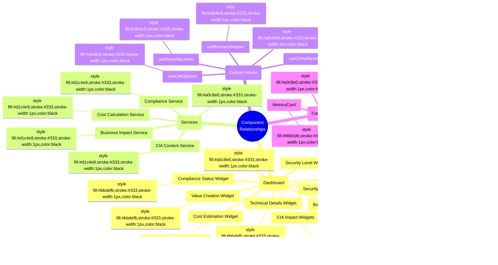

# CIA Compliance Manager Mindmap

This mindmap provides a visual overview of the CIA Compliance Manager components, relationships, and concepts. It serves as a mental model to understand how different parts of the system fit together.

## 📚 Related Architecture Documentation

| Document                                            | Focus           | Description                               |
| --------------------------------------------------- | --------------- | ----------------------------------------- |
| **[Current Architecture](ARCHITECTURE.md)**         | 🏛️ Architecture | C4 model showing current system structure |
| **[Future Architecture](FUTURE_ARCHITECTURE.md)**   | 🏛️ Architecture | Vision for context-aware platform         |
| **[State Diagrams](STATEDIAGRAM.md)**               | 🔄 Behavior     | Current system state transitions          |
| **[Future State Diagrams](FUTURE_STATEDIAGRAM.md)** | 🔄 Behavior     | Enhanced adaptive state transitions       |
| **[Process Flowcharts](FLOWCHART.md)**              | 🔄 Process      | Current security workflows                |
| **[Future Flowcharts](FUTURE_FLOWCHART.md)**        | 🔄 Process      | Enhanced context-aware workflows          |
| **[Future Mindmaps](FUTURE_MINDMAP.md)**            | 🧠 Concept      | Future capability evolution               |
| **[SWOT Analysis](SWOT.md)**                        | 💼 Business     | Current strategic assessment              |
| **[Future SWOT Analysis](FUTURE_SWOT.md)**          | 💼 Business     | Future strategic opportunities            |
| **[CI/CD Workflows](WORKFLOWS.md)**                 | 🔧 DevOps       | Current automation processes              |
| **[Future Workflows](FUTURE_WORKFLOWS.md)**         | 🔧 DevOps       | Enhanced CI/CD with ML                    |
| **[Future Data Model](FUTURE_DATA_MODEL.md)**       | 📊 Data         | Context-aware data architecture           |

## System Overview Mindmap

## Component Relationships Mindmap

## Technical Implementation Mindmap

**🏛️ Architecture Focus:** Provides a technology-oriented view of the implementation stack, showing how different technologies work together to create a cohesive application.

**🔧 Development Focus:** Highlights the modern framework choices, testing strategies, security layers, and development processes that ensure code quality and security.

## Business Value Mindmap

**💼 Business Focus:** Demonstrates how the CIA Compliance Manager creates value for organizations through strategic planning, business case development, and stakeholder communication.

**💰 Investment Focus:** Shows the relationship between security level implementation and business outcomes, helping decision-makers understand the return on security investments.

The mindmaps above provide three different perspectives on the CIA Compliance Manager:

1. **System Overview** - Shows the core components, security levels, and key features of the CIA triad components, business analysis domains, compliance frameworks, and architecture layers
2. **Technical Implementation** - Focuses on the technology stack and implementation details including core frameworks, testing approaches, and development processes
3. **Business Value** - Illustrates how the system delivers value to stakeholders through strategic planning, business case development, and decision support

These visualizations complement the C4 diagrams by providing a different way to understand the system's structure and purpose. While the visual styling through CSS classes isn't available in GitHub's Mermaid implementation, the hierarchical organization of concepts provides clarity on relationships and categories.

**Color Legend (conceptual):**

- 🔵 CIA components - blue shades
- 🟠 Business analysis - orange/amber shades
- 🟣 Compliance - purple shades
- 🟢 Architecture - green shades
- 🌈 Security levels - graduated colors from orange (basic) to green (very high)

## Color Legend

The color scheme used in these mindmaps follows these conventions:

| Element Type           | Color                  | Description                        |
| ---------------------- | ---------------------- | ---------------------------------- |
| Main Categories        | #a0c8e0 (Medium Blue)  | Primary classification areas       |
| CIA Components         | #bbdefb (Light Blue)   | Core CIA triad elements            |
| Business Impact        | #c8e6c9 (Light Green)  | Business and operational concerns  |
| Compliance Frameworks  | #d1c4e9 (Light Purple) | Regulatory and compliance elements |
| Implementation Details | #86b5d9 (Darker Blue)  | Technical implementation concerns  |
| UI Components          | #bbdefb (Light Blue)   | Interface and user interaction     |

This color scheme aligns with the cool color palette used throughout the architecture documentation to provide visual consistency.
