# 🛡️ CIA Compliance Manager Security Architecture

This document outlines the comprehensive security architecture of the CIA Compliance Manager, detailing how we protect our systems and data through multiple security layers.

## 📑 Table of Contents

- [🔐 Security Documentation Map](#-security-documentation-map)
- [🔑 Authentication Architecture](#-authentication-architecture)
- [📜 Data Integrity & Auditing](#-data-integrity--auditing)
- [📊 Session & Action Tracking](#-session--action-tracking)
- [🔍 Security Event Monitoring](#-security-event-monitoring)
- [🌐 Network Security](#-network-security)
- [🔌 VPC Endpoints Security](#-vpc-endpoints-security)
- [🏗️ High Availability Design](#-high-availability-design)
- [💾 Data Protection](#-data-protection)
- [☁️ AWS Security Infrastructure](#-aws-security-infrastructure)
- [🔰 AWS Foundational Security Best Practices](#-aws-foundational-security-best-practices)
- [🕵️ Threat Detection & Investigation](#-threat-detection--investigation)
- [🔎 Vulnerability Management](#-vulnerability-management)
- [⚡ Resilience & Operational Readiness](#-resilience--operational-readiness)
- [📋 Configuration & Compliance Management](#-configuration--compliance-management)
- [📊 Monitoring & Analytics](#-monitoring--analytics)
- [🤖 Automated Security Operations](#-automated-security-operations)
- [🔒 Application Security](#-application-security)
- [📜 Compliance Framework](#-compliance-framework)
- [🛡️ Defense-in-Depth Strategy](#-defense-in-depth-strategy)
- [🔄 Security Operations](#-security-operations)
- [💰 Security Investment](#-security-investment)
- [🏛️ CI/CD Security Architecture](#-cicd-security-architecture)
- [📝 Conclusion](#-conclusion)

## 🔐 Security Documentation Map

| Document                                          | Focus          | Description                            |
| ------------------------------------------------- | -------------- | -------------------------------------- |
| [Security Architecture](SECURITY_ARCHITECTURE.md) | 🛡️ Security    | Complete security overview             |
| [End-of-Life Strategy](End-of-Life-Strategy.md)   | 📅 Lifecycle   | Security patching and updates          |
| [Workflows](WORKFLOWS.md)                         | 🔧 CI/CD       | Security-hardened CI/CD workflows      |
| [Development Guide](development.md)               | 🔧 Development | Security features and testing strategy |
| [Architecture](ARCHITECTURE.md)                   | 🏛️ Structure   | Overall system architecture            |

## 🔑 Authentication Architecture

**Current Status**: ❌ No Authentication - Client-Side Only Web Application

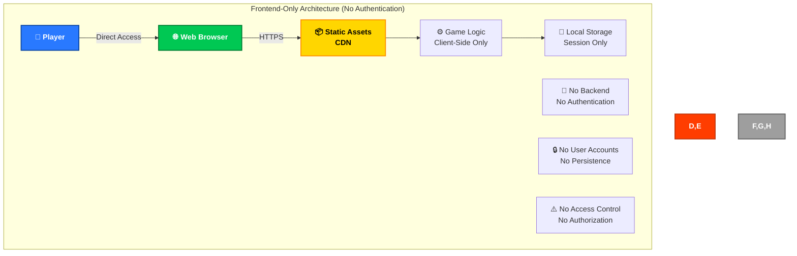
```mermaid
flowchart TD
    subgraph "Frontend-Only Architecture (No Authentication)"
        A[👤 Player] -->|"Direct Access"| B[🌐 Web Browser]
        B -->|"HTTPS"| C[📦 Static Assets<br/>CDN]

        C --> D[⚙️ Game Logic<br/>Client-Side Only]
        D --> E[💾 Local Storage<br/>Session Only]

        F[🔄 No Backend<br/>No Authentication]
        G[🔒 No User Accounts<br/>No Persistence]
        H[⚠️ No Access Control<br/>No Authorization]
    end

    style A fill:#2979FF,stroke:#0D47A1,stroke-width:2px,color:white,font-weight:bold
    style B fill:#00C853,stroke:#007E33,stroke-width:2px,color:white,font-weight:bold
    style C fill:#FFD600,stroke:#FF8F00,stroke-width:2px,color:black,font-weight:bold
    style D,E fill:#FF3D00,stroke:#BF360C,stroke-width:2px,color:white,font-weight:bold
    style F,G,H fill:#9E9E9E,stroke:#616161,stroke-width:2px,color:white,font-weight:bold
```

### Current Implementation

Black Trigram is a frontend-only web application with:

- **🌐 No Authentication System**: Direct browser access without login
- **💾 No Persistent Data**: All state stored in browser session only
- **🔄 No Backend Services**: Purely static content delivery
- **⚠️ No Access Controls**: All game content publicly accessible

### Security Implications

- **✅ Reduced Attack Surface**: No user accounts or authentication to compromise
- **✅ No Credential Storage**: No passwords or sensitive user data
- **❌ No Session Protection**: All data lost on browser refresh
- **❌ No User Privacy**: Cannot protect individual user data

## 📜 Data Integrity & Auditing

**Current Status**: ❌ No Data Auditing - Session-Only Application

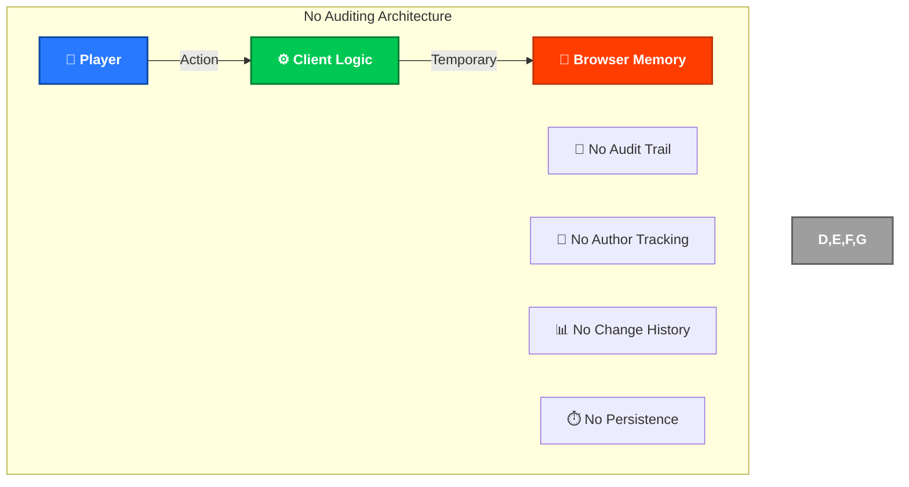
```mermaid
flowchart TD
    subgraph "No Auditing Architecture"
        A[👤 Player] -->|"Action"| B[⚙️ Client Logic]
        B -->|"Temporary"| C[💾 Browser Memory]

        D[📝 No Audit Trail]
        E[👤 No Author Tracking]
        F[📊 No Change History]
        G[⏱️ No Persistence]
    end

    style A fill:#2979FF,stroke:#0D47A1,stroke-width:2px,color:white,font-weight:bold
    style B fill:#00C853,stroke:#007E33,stroke-width:2px,color:white,font-weight:bold
    style C fill:#FF3D00,stroke:#BF360C,stroke-width:2px,color:white,font-weight:bold
    style D,E,F,G fill:#9E9E9E,stroke:#616161,stroke-width:2px,color:white,font-weight:bold
```

### Current Implementation

Black Trigram currently has:

- **🚫 No Data Auditing**: No tracking of user actions or data changes
- **🚫 No Change History**: No record of combat sessions or progress
- **🚫 No Author Attribution**: Cannot track individual user activities
- **🚫 No Persistence**: All data lost when browser session ends

### Security Implications

- **✅ No Sensitive Data**: No personal information to audit
- **✅ Privacy by Design**: No data collection or tracking
- **❌ No Analytics**: Cannot monitor for security events
- **❌ No Forensics**: No audit trail for investigation

## 📊 Session & Action Tracking

**Current Status**: ❌ No Session Tracking - Client-Side Only

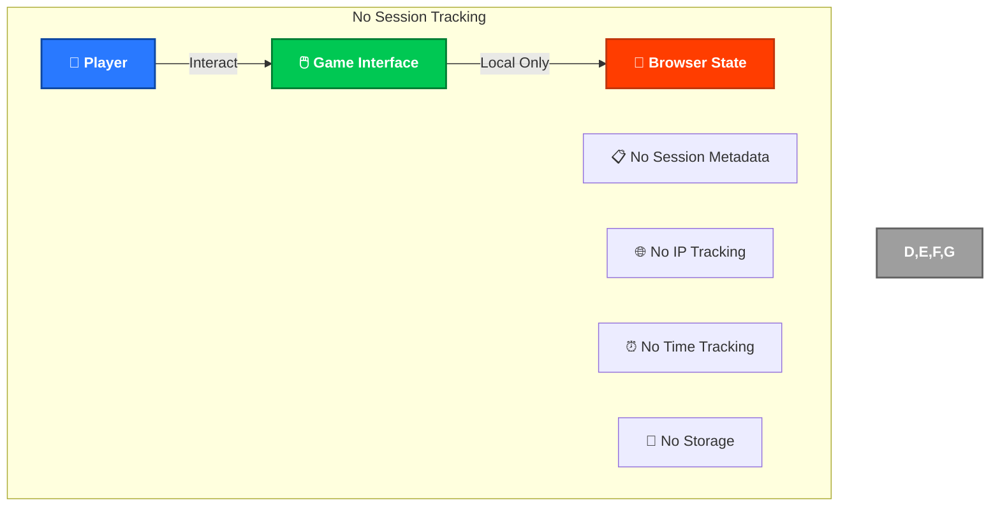
```mermaid
flowchart TD
    subgraph "No Session Tracking"
        A[👤 Player] -->|"Interact"| B[🖱️ Game Interface]
        B -->|"Local Only"| C[📝 Browser State]

        D[📋 No Session Metadata]
        E[🌐 No IP Tracking]
        F[⏰ No Time Tracking]
        G[💾 No Storage]
    end

    style A fill:#2979FF,stroke:#0D47A1,stroke-width:2px,color:white,font-weight:bold
    style B fill:#00C853,stroke:#007E33,stroke-width:2px,color:white,font-weight:bold
    style C fill:#FF3D00,stroke:#BF360C,stroke-width:2px,color:white,font-weight:bold
    style D,E,F,G fill:#9E9E9E,stroke:#616161,stroke-width:2px,color:white,font-weight:bold
```

### Current Implementation

Black Trigram session handling:

- **🚫 No Session Tracking**: No server-side session management
- **🚫 No User Identification**: Anonymous gameplay only
- **🚫 No Activity Logging**: No record of player actions
- **🚫 No Metadata Collection**: No browser or device information stored

### Security Implications

- **✅ Maximum Privacy**: No tracking or data collection
- **✅ No Profiling**: Cannot build user behavior profiles
- **❌ No Security Monitoring**: Cannot detect suspicious activity
- **❌ No Analytics**: No usage patterns for security analysis

## 🔍 Security Event Monitoring

**Current Status**: ❌ No Security Event Monitoring - Frontend Only

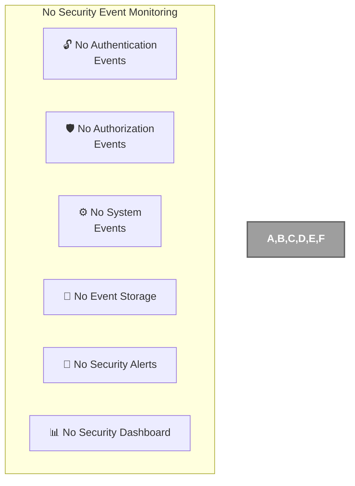
```mermaid
flowchart TD
    subgraph "No Security Event Monitoring"
        A[🔓 No Authentication<br>Events]
        B[🛡️ No Authorization<br>Events]
        C[⚙️ No System<br>Events]

        D[📝 No Event Storage]
        E[🚨 No Security Alerts]
        F[📊 No Security Dashboard]
    end

    style A,B,C,D,E,F fill:#9E9E9E,stroke:#616161,stroke-width:2px,color:white,font-weight:bold
```

### Current Implementation

Black Trigram security monitoring:

- **🚫 No Authentication Events**: No login/logout to monitor
- **🚫 No Authorization Events**: No access control to track
- **🚫 No System Events**: Frontend-only with no server events
- **🚫 No Security Alerts**: No monitoring system in place

### Security Implications

- **✅ No Security Events**: No authentication to compromise
- **✅ Minimal Attack Surface**: Static content only
- **❌ No Threat Detection**: Cannot identify attacks
- **❌ No Incident Response**: No system to detect incidents

## 🌐 Network Security

**Current Status**: ✅ HTTPS Only - Static Content Delivery with DNS Security

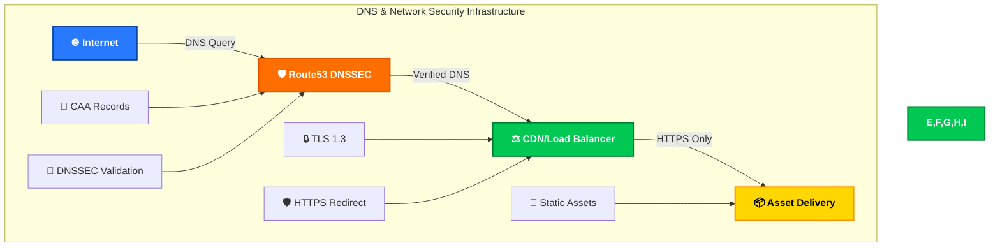
```mermaid
graph TD
    subgraph "DNS & Network Security Infrastructure"
        A[🌐 Internet] -->|"DNS Query"| B[🛡️ Route53 DNSSEC]
        B -->|"Verified DNS"| C[⚖️ CDN/Load Balancer]
        C -->|"HTTPS Only"| D[📦 Asset Delivery]

        E[🔒 TLS 1.3] --> C
        F[🛡️ HTTPS Redirect] --> C
        G[📄 Static Assets] --> D
        H[🔐 CAA Records] --> B
        I[🔑 DNSSEC Validation] --> B
    end

    style A fill:#2979FF,stroke:#0D47A1,stroke-width:2px,color:white,font-weight:bold
    style B fill:#FF6F00,stroke:#E65100,stroke-width:2px,color:white,font-weight:bold
    style C fill:#00C853,stroke:#007E33,stroke-width:2px,color:white,font-weight:bold
    style D fill:#FFD600,stroke:#FF8F00,stroke-width:2px,color:black,font-weight:bold
    style E,F,G,H,I fill:#00C853,stroke:#007E33,stroke-width:2px,color:white,font-weight:bold
```

### Current Implementation

Black Trigram network security includes comprehensive DNS protection:

#### 🛡️ DNS Security (Route53 + DNSSEC)

- **✅ DNSSEC Enabled**: Domain Name System Security Extensions for DNS integrity
- **✅ Route53 Hosting**: AWS Route53 provides authoritative DNS with DNSSEC support
- **✅ DNS Query Validation**: Cryptographic verification of DNS responses
- **✅ Cache Poisoning Protection**: DNSSEC prevents DNS spoofing attacks

#### 🔐 Certificate Authority Authorization (CAA)

- **✅ CAA Records**: Specifies which Certificate Authorities can issue certificates
- **✅ Email Validation**: CAA records configured for email-based certificate validation
- **✅ Certificate Misuse Prevention**: Prevents unauthorized certificate issuance
- **✅ Compliance**: Follows CAB Forum baseline requirements

#### 🌐 Transport Security

- **✅ HTTPS Only**: All traffic encrypted with TLS
- **✅ Static Content**: No dynamic server-side processing
- **✅ CDN Delivery**: Distributed content delivery for performance
- **✅ No Backend**: No server infrastructure to secure

### DNS Security Configuration

```dns
; Example DNSSEC and CAA configuration for blacktrigram.com
blacktrigram.com.    IN    CAA    0 issue "letsencrypt.org"
blacktrigram.com.    IN    CAA    0 issuewild "letsencrypt.org"
blacktrigram.com.    IN    CAA    0 iodef "mailto:security@blacktrigram.com"

; DNSSEC records automatically managed by Route53
blacktrigram.com.    IN    DNSKEY    256 3 8 (base64-encoded-key)
blacktrigram.com.    IN    DS        12345 8 2 (sha256-hash)
blacktrigram.com.    IN    RRSIG     DNSKEY 8 2 86400 (signature-data)
```

### Security Benefits

- **🔒 Encrypted Traffic**: All communications protected by TLS
- **🛡️ DNS Integrity**: DNSSEC prevents DNS manipulation attacks
- **📜 Certificate Control**: CAA records prevent unauthorized certificate issuance
- **📦 Static Assets**: No dynamic content vulnerabilities
- **🌍 Global CDN**: Distributed delivery reduces single points of failure
- **⚡ Minimal Attack Surface**: No server-side code to exploit

### DNS Security Features

#### 🔐 DNSSEC Protection

- **Chain of Trust**: Complete cryptographic chain from root to domain
- **Response Authentication**: All DNS responses cryptographically signed
- **Data Integrity**: Prevents tampering with DNS records in transit
- **Non-Existence Proof**: NSEC3 records prevent zone enumeration

#### 📜 CAA Record Protection

- **Certificate Authority Control**: Explicitly authorizes trusted CAs
- **Email Notification**: Security contact for certificate-related incidents
- **Wildcard Protection**: Separate controls for wildcard certificates
- **Compliance**: Meets CAB Forum baseline requirements for domain validation

#### 🌐 Route53 Security Benefits

- **AWS Infrastructure**: Benefits from AWS's global security infrastructure
- **DDoS Protection**: Built-in protection against DNS-based DDoS attacks
- **High Availability**: Anycast network with multiple geographic locations
- **Monitoring**: CloudWatch integration for DNS query monitoring

### Domain Security Monitoring

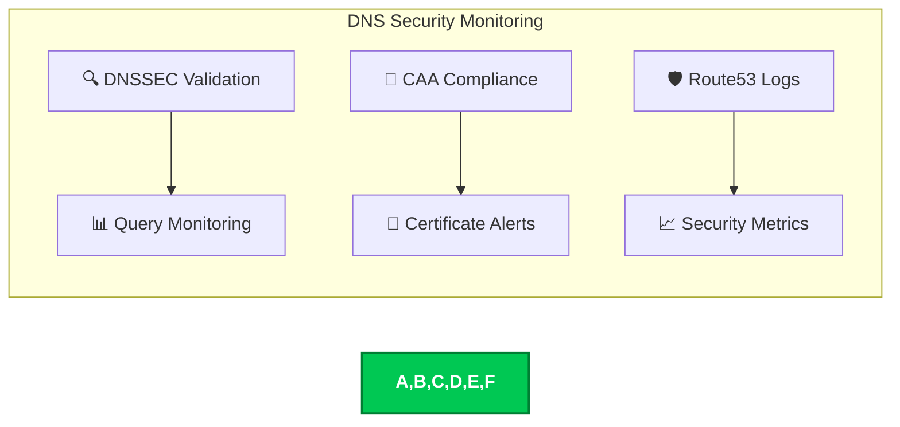
```mermaid
flowchart LR
    subgraph "DNS Security Monitoring"
        A[🔍 DNSSEC Validation] --> B[📊 Query Monitoring]
        C[📜 CAA Compliance] --> D[🚨 Certificate Alerts]
        E[🛡️ Route53 Logs] --> F[📈 Security Metrics]
    end

    style A,B,C,D,E,F fill:#00C853,stroke:#007E33,stroke-width:2px,color:white,font-weight:bold
```

### Security Compliance

- **✅ RFC 4034**: DNSSEC DNS Security Extensions compliance
- **✅ RFC 6844**: DNS Certification Authority Authorization compliance
- **✅ CAB Forum**: Certificate Authority baseline requirements compliance
- **✅ Industry Standards**: Follows DNS security best practices

## 🔌 VPC Endpoints Security

**Current Status**: ❌ Not Applicable - No AWS Infrastructure

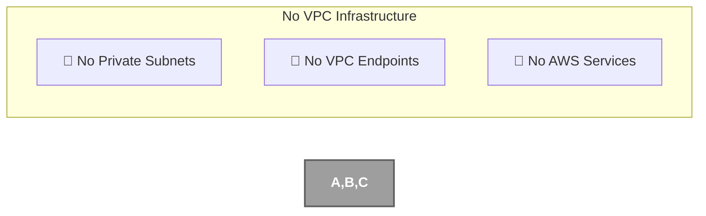
```mermaid
flowchart LR
    subgraph "No VPC Infrastructure"
        A[🚫 No Private Subnets]
        B[🚫 No VPC Endpoints]
        C[🚫 No AWS Services]
    end

    style A,B,C fill:#9E9E9E,stroke:#616161,stroke-width:2px,color:white,font-weight:bold
```

### Current Status

Black Trigram does not use VPC infrastructure:

- **🚫 No VPC**: Frontend-only application with no AWS VPC
- **🚫 No Private Subnets**: Static content delivery only
- **🚫 No Endpoints**: No AWS service endpoints needed

## 🏗️ High Availability Design

**Current Status**: ❌ Not Applicable - Static Content Only

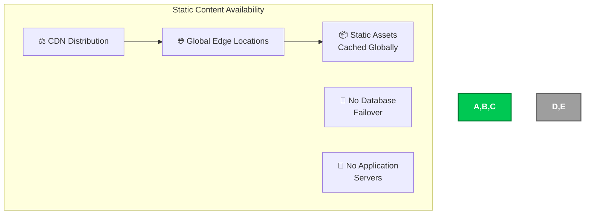
```mermaid
graph TD
    subgraph "Static Content Availability"
        A[⚖️ CDN Distribution] --> B[🌐 Global Edge Locations]
        B --> C[📦 Static Assets<br/>Cached Globally]

        D[🔄 No Database<br/>Failover]
        E[🔄 No Application<br/>Servers]
    end

    style A,B,C fill:#00C853,stroke:#007E33,stroke-width:2px,color:white,font-weight:bold
    style D,E fill:#9E9E9E,stroke:#616161,stroke-width:2px,color:white,font-weight:bold
```

### Current Implementation

Black Trigram availability:

- **✅ CDN Distribution**: Global content delivery network
- **✅ Edge Caching**: Assets cached at multiple locations
- **🚫 No Database**: No database availability concerns
- **🚫 No Servers**: No application servers to manage

### Availability Benefits

- **🌍 Global Distribution**: Content available worldwide
- **⚡ Edge Caching**: Fast content delivery from nearby locations
- **🔄 Redundancy**: Multiple CDN edge locations provide redundancy

## 💾 Data Protection

**Current Status**: ✅ TLS Encryption - No Persistent Data

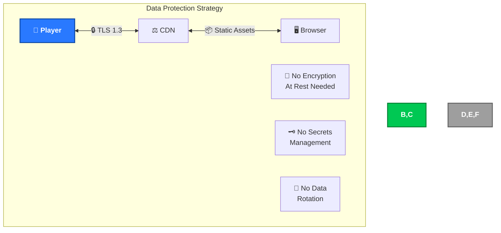
```mermaid
flowchart TD
    subgraph "Data Protection Strategy"
        A[👤 Player] <-->|"🔒 TLS 1.3"| B[⚖️ CDN]
        B <-->|"📦 Static Assets"| C[🖥️ Browser]

        D[🔐 No Encryption<br/>At Rest Needed]
        E[🗝️ No Secrets<br/>Management]
        F[🔄 No Data<br/>Rotation]
    end

    style A fill:#2979FF,stroke:#0D47A1,stroke-width:2px,color:white,font-weight:bold
    style B,C fill:#00C853,stroke:#007E33,stroke-width:2px,color:white,font-weight:bold
    style D,E,F fill:#9E9E9E,stroke:#616161,stroke-width:2px,color:white,font-weight:bold
```

### Current Implementation

Black Trigram data protection:

- **✅ TLS Encryption**: All communications encrypted in transit
- **✅ No Persistent Data**: No data at rest to protect
- **✅ No Secrets**: No credentials or API keys to manage
- **✅ Browser Security**: Data protected by browser security model

### Protection Benefits

- **🔒 Transit Security**: All network traffic encrypted
- **💾 No Data Leaks**: No persistent data to compromise
- **🔑 No Credential Theft**: No stored credentials to steal
- **🛡️ Browser Isolation**: Each player's data isolated by browser

## ☁️ AWS Security Infrastructure

**Current Status**: ❌ Not Applicable - No AWS Infrastructure

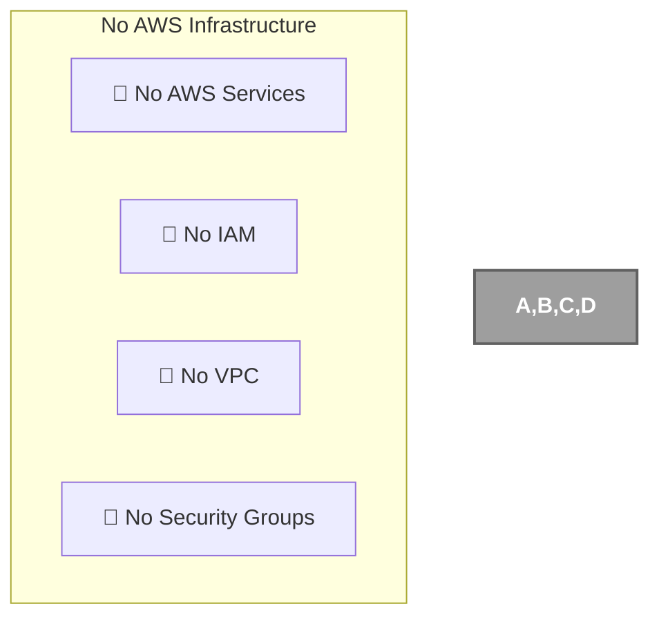
```mermaid
graph TD
    subgraph "No AWS Infrastructure"
        A[🚫 No AWS Services]
        B[🚫 No IAM]
        C[🚫 No VPC]
        D[🚫 No Security Groups]
    end

    style A,B,C,D fill:#9E9E9E,stroke:#616161,stroke-width:2px,color:white,font-weight:bold
```

### Current Status

Black Trigram does not use AWS infrastructure:

- **🚫 No AWS Services**: Frontend-only application
- **🚫 No IAM**: No AWS identity management needed
- **🚫 No VPC**: No virtual private cloud infrastructure
- **🚫 No Security Groups**: No AWS network security controls

## 🔰 AWS Foundational Security Best Practices

**Current Status**: ❌ Not Applicable - No AWS Services

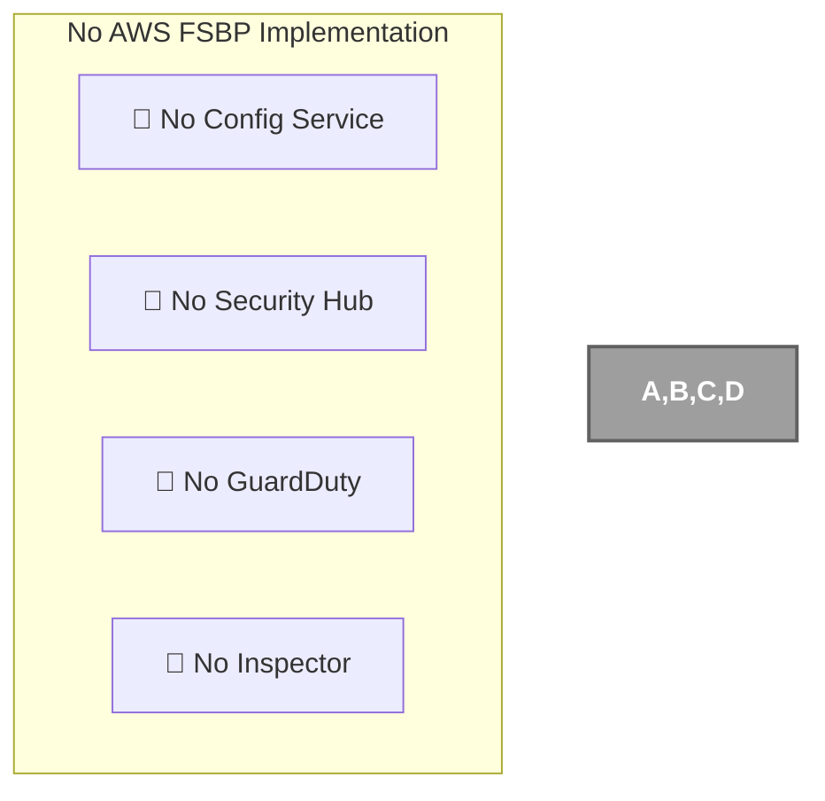
```mermaid
flowchart TD
    subgraph "No AWS FSBP Implementation"
        A[🚫 No Config Service]
        B[🚫 No Security Hub]
        C[🚫 No GuardDuty]
        D[🚫 No Inspector]
    end

    style A,B,C,D fill:#9E9E9E,stroke:#616161,stroke-width:2px,color:white,font-weight:bold
```

### Current Status

Black Trigram does not implement AWS FSBP:

- **🚫 No AWS Config**: No AWS resources to configure
- **🚫 No Security Hub**: No AWS security findings to aggregate
- **🚫 No GuardDuty**: No AWS environment to monitor
- **🚫 No Inspector**: No AWS resources to scan

## 🕵️ Threat Detection & Investigation

**Current Status**: ❌ No Threat Detection - Frontend Only

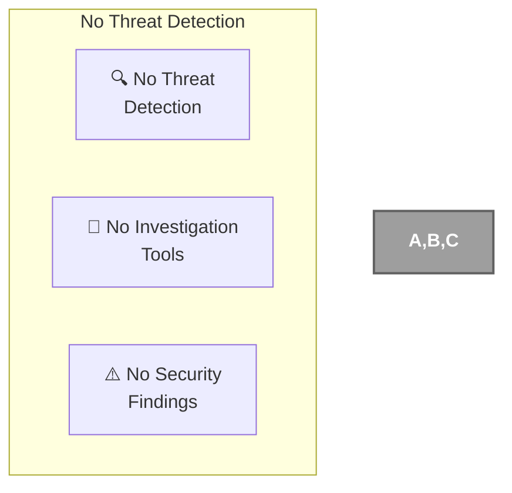
```mermaid
flowchart TD
    subgraph "No Threat Detection"
        A[🔍 No Threat<br>Detection]
        B[🔎 No Investigation<br>Tools]
        C[⚠️ No Security<br>Findings]
    end

    style A,B,C fill:#9E9E9E,stroke:#616161,stroke-width:2px,color:white,font-weight:bold
```

### Current Status

Black Trigram threat detection:

- **🚫 No Threat Detection**: No monitoring infrastructure
- **🚫 No Investigation Tools**: No forensic capabilities
- **🚫 No Security Findings**: No security events to investigate

### Security Implications

- **✅ Minimal Threats**: Static content has limited threat vectors
- **✅ No Data to Steal**: No persistent data to compromise
- **❌ No Visibility**: Cannot detect client-side attacks
- **❌ No Response**: No incident response capabilities

## 🔎 Vulnerability Management

**Current Status**: ❌ No Vulnerability Management - Static Content

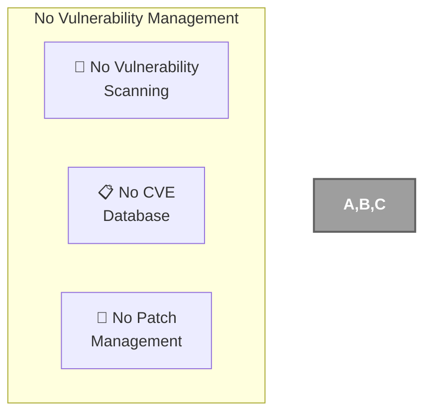
```mermaid
flowchart TD
    subgraph "No Vulnerability Management"
        A[🔎 No Vulnerability<br>Scanning]
        B[📋 No CVE<br>Database]
        C[🔧 No Patch<br>Management]
    end

    style A,B,C fill:#9E9E9E,stroke:#616161,stroke-width:2px,color:white,font-weight:bold
```

### Current Status

Black Trigram vulnerability management:

- **🚫 No Scanning**: No server infrastructure to scan
- **🚫 No CVE Tracking**: No operating systems or services to patch
- **🚫 No Patch Management**: Static content requires no patching

### Security Considerations

- **✅ No Server Vulnerabilities**: No servers to exploit
- **✅ No OS Patching**: No operating systems to maintain
- **❌ Client-Side Risks**: Browser vulnerabilities outside our control
- **❌ Dependency Risks**: Frontend dependencies need manual updates

## ⚡ Resilience & Operational Readiness

**Current Status**: ❌ Not Applicable - Static Content Delivery

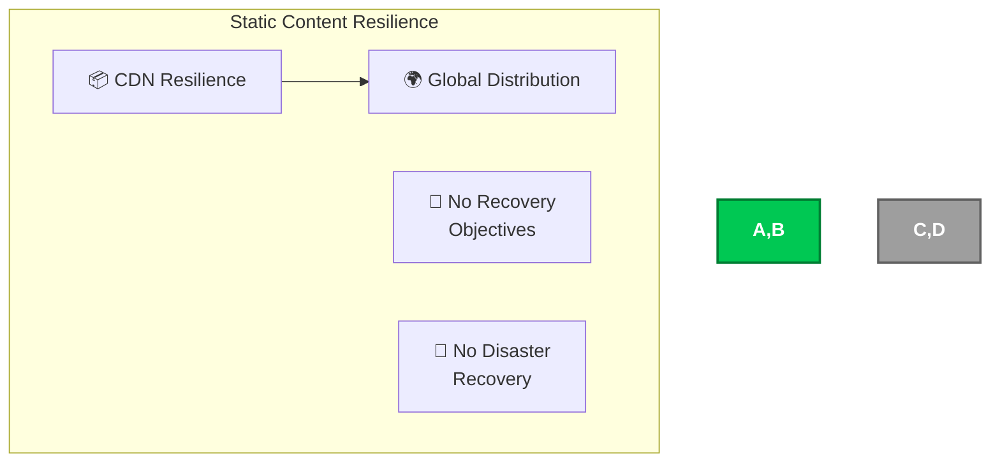
```mermaid
flowchart TD
    subgraph "Static Content Resilience"
        A[📦 CDN Resilience] --> B[🌍 Global Distribution]
        C[🔄 No Recovery<br>Objectives]
        D[🚫 No Disaster<br>Recovery]
    end

    style A,B fill:#00C853,stroke:#007E33,stroke-width:2px,color:white,font-weight:bold
    style C,D fill:#9E9E9E,stroke:#616161,stroke-width:2px,color:white,font-weight:bold
```

### Current Status

Black Trigram resilience:

- **✅ CDN Resilience**: Global content distribution provides natural resilience
- **🚫 No RTO/RPO**: No data persistence means no recovery objectives
- **🚫 No DR Planning**: Static content requires no disaster recovery

### Resilience Benefits

- **🌍 Geographic Distribution**: Content available from multiple locations
- **⚡ Automatic Failover**: CDN handles edge location failures automatically
- **🔄 No Data Loss**: No persistent data to lose

## 📋 Configuration & Compliance Management

**Current Status**: ❌ No Configuration Management - Static Content

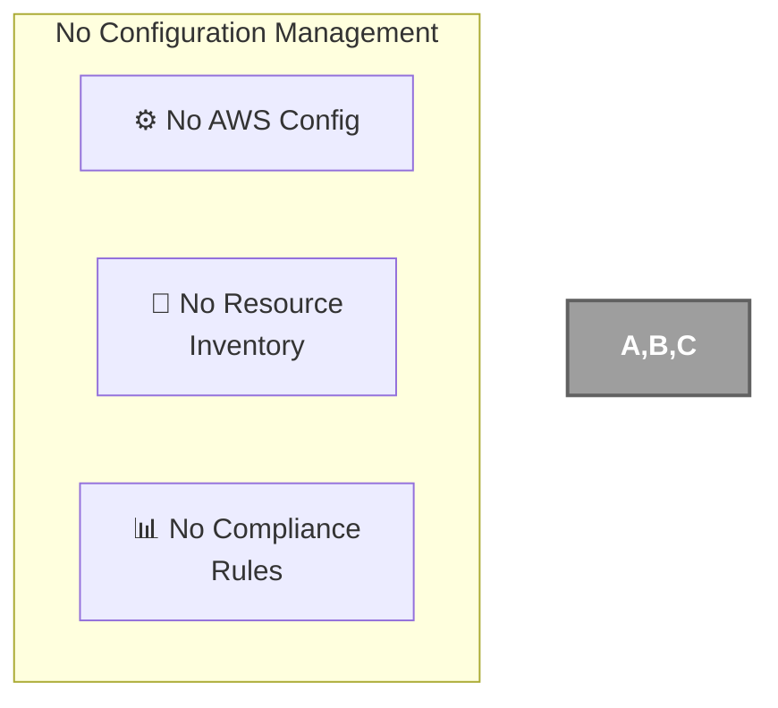
```mermaid
flowchart TD
    subgraph "No Configuration Management"
        A[⚙️ No AWS Config]
        B[📝 No Resource<br>Inventory]
        C[📊 No Compliance<br>Rules]
    end

    style A,B,C fill:#9E9E9E,stroke:#616161,stroke-width:2px,color:white,font-weight:bold
```

### Current Status

Black Trigram configuration management:

- **🚫 No AWS Config**: No AWS resources to configure
- **🚫 No Resource Inventory**: Only static files to manage
- **🚫 No Compliance Rules**: No infrastructure compliance requirements

### Configuration Approach

- **📦 Build-Time Configuration**: All configuration handled during build
- **🔧 Static Configuration**: No runtime configuration changes
- **✅ Version Control**: All configuration in source control

## 📊 Monitoring & Analytics

**Current Status**: ❌ No Security Monitoring - Frontend Only

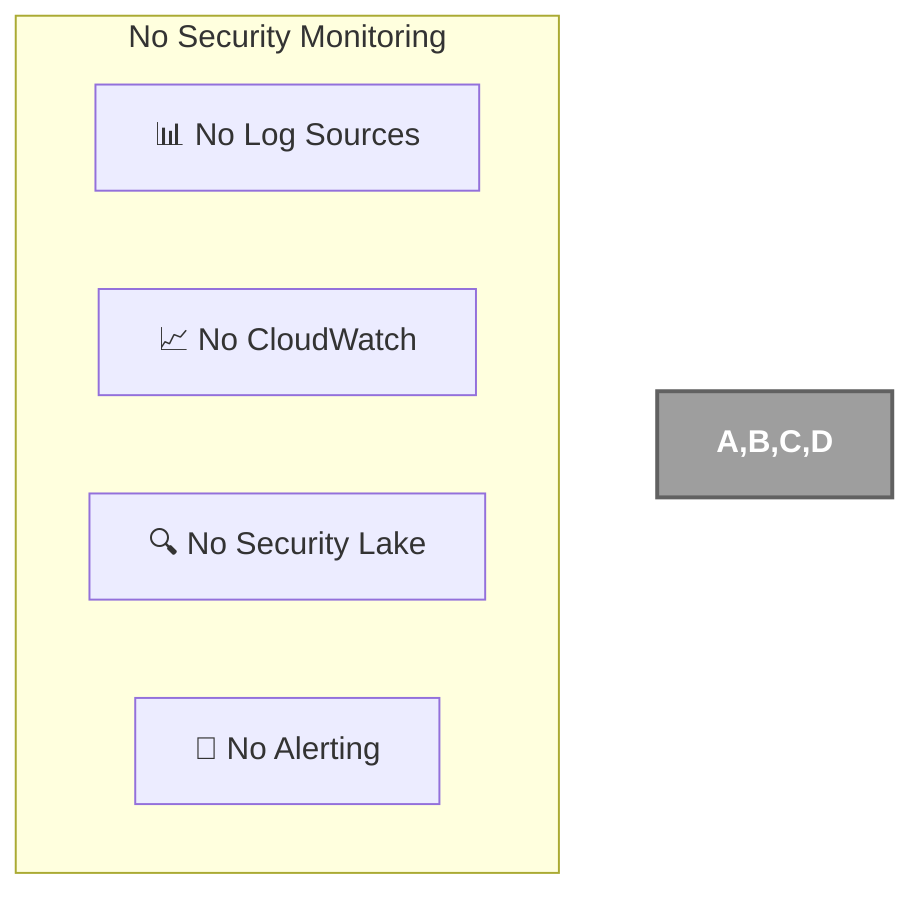
```mermaid
flowchart TD
    subgraph "No Security Monitoring"
        A[📊 No Log Sources]
        B[📈 No CloudWatch]
        C[🔍 No Security Lake]
        D[🚨 No Alerting]
    end

    style A,B,C,D fill:#9E9E9E,stroke:#616161,stroke-width:2px,color:white,font-weight:bold
```

### Current Status

Black Trigram monitoring:

- **🚫 No Server Logs**: No server infrastructure to monitor
- **🚫 No CloudWatch**: No AWS services to monitor
- **🚫 No Security Analytics**: No security events to analyze
- **🚫 No Alerting**: No monitoring system to generate alerts

### Monitoring Limitations

- **❌ No Visibility**: Cannot monitor player behavior
- **❌ No Analytics**: No usage patterns or security insights
- **❌ No Alerting**: No early warning system for issues

## 🤖 Automated Security Operations

**Current Status**: ❌ No Automated Security Operations - Static Content

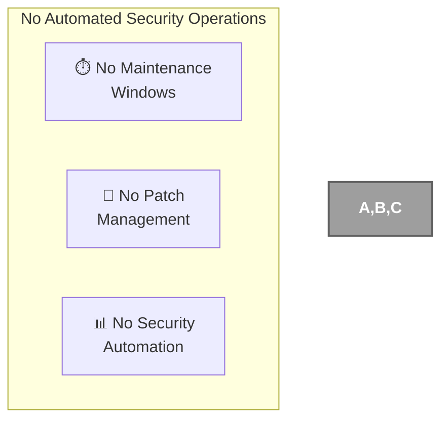
```mermaid
flowchart TD
    subgraph "No Automated Security Operations"
        A[⏱️ No Maintenance<br>Windows]
        B[🔄 No Patch<br>Management]
        C[📊 No Security<br>Automation]
    end

    style A,B,C fill:#9E9E9E,stroke:#616161,stroke-width:2px,color:white,font-weight:bold
```

### Current Status

Black Trigram automated operations:

- **🚫 No Maintenance Windows**: No infrastructure to maintain
- **🚫 No Patch Management**: No operating systems to patch
- **🚫 No Security Automation**: No security operations to automate

### Operational Benefits

- **✅ Zero Maintenance**: Static content requires no ongoing maintenance
- **✅ No Downtime**: No maintenance windows or patches needed
- **✅ Self-Healing**: CDN automatically handles edge location issues

## 🔒 Application Security

**Current Status**: ✅ Partial Implementation - Frontend Security Only

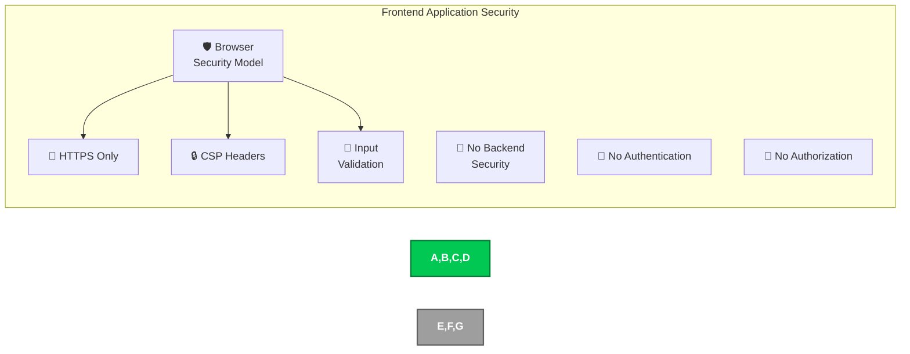
```mermaid
flowchart LR
    subgraph "Frontend Application Security"
        A[🛡️ Browser<br>Security Model] --> B[🔐 HTTPS Only]
        A --> C[🔒 CSP Headers]
        A --> D[🛑 Input<br>Validation]

        E[🚫 No Backend<br>Security]
        F[🚫 No Authentication]
        G[🚫 No Authorization]
    end

    style A,B,C,D fill:#00C853,stroke:#007E33,stroke-width:2px,color:white,font-weight:bold
    style E,F,G fill:#9E9E9E,stroke:#616161,stroke-width:2px,color:white,font-weight:bold
```

### Current Implementation

Black Trigram application security:

- **✅ HTTPS Enforcement**: All traffic over encrypted connections
- **✅ Browser Security Model**: Leverages browser sandboxing and isolation
- **✅ Content Security Policy**: CSP headers to prevent XSS
- **✅ Input Validation**: Client-side validation for game inputs
- **🚫 No Backend Security**: No server-side security controls
- **🚫 No Authentication**: No user accounts or login system

### Security Features

- **🔒 Transport Security**: TLS encryption for all communications
- **🛡️ XSS Protection**: Content Security Policy headers
- **🔍 Input Sanitization**: Validation of all user inputs
- **🚪 Same-Origin Policy**: Browser enforces origin restrictions

## 📜 Compliance Framework

**Current Status**: ❌ No Formal Compliance - Educational Application

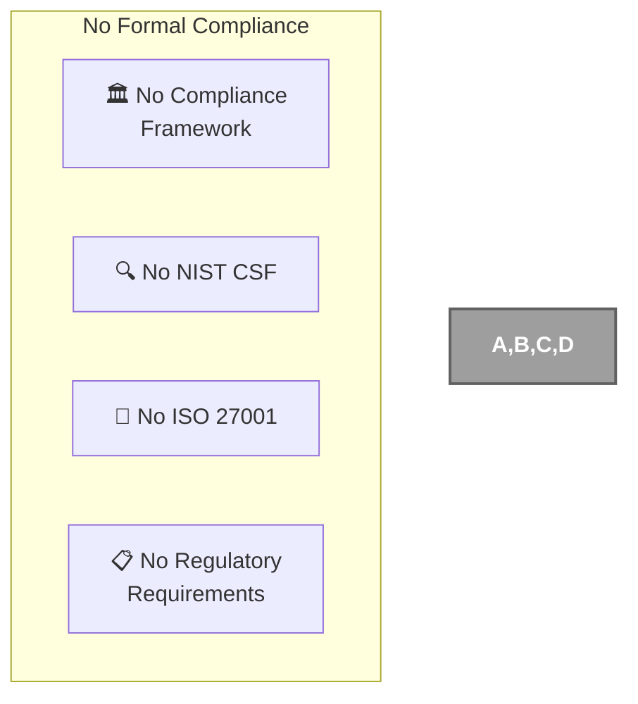
```mermaid
graph TD
    subgraph "No Formal Compliance"
        A[🏛️ No Compliance<br>Framework]
        B[🔍 No NIST CSF]
        C[🔐 No ISO 27001]
        D[📋 No Regulatory<br>Requirements]
    end

    style A,B,C,D fill:#9E9E9E,stroke:#616161,stroke-width:2px,color:white,font-weight:bold
```

### Current Status

Black Trigram compliance:

- **🚫 No Formal Framework**: No regulatory compliance requirements
- **🚫 No NIST CSF**: Educational application with no compliance mandate
- **🚫 No ISO 27001**: No certification requirements
- **✅ Privacy by Design**: No personal data collection or storage

### Compliance Considerations

- **🎮 Educational Use**: Gaming application with no sensitive data
- **🔒 Privacy First**: No user data collection reduces compliance burden
- **🌍 Global Access**: No geographic restrictions or data residency requirements

## 🛡️ Defense-in-Depth Strategy

**Current Status**: ✅ Simplified Defense Strategy - Minimal Attack Surface

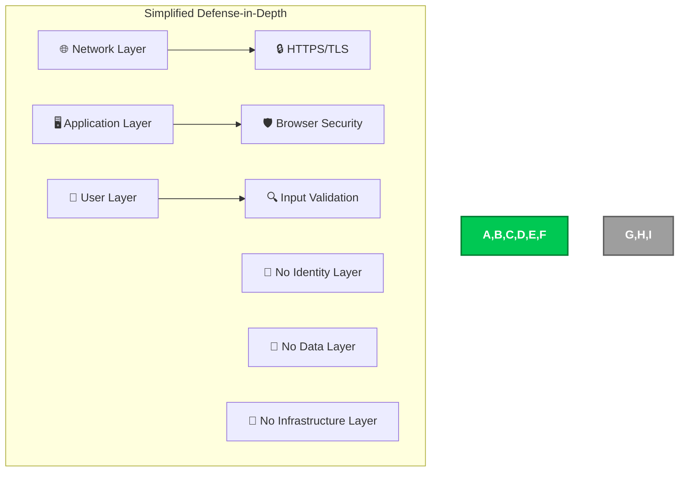
```mermaid
flowchart TD
    subgraph "Simplified Defense-in-Depth"
        A[🌐 Network Layer] --> B[🔒 HTTPS/TLS]
        C[🖥️ Application Layer] --> D[🛡️ Browser Security]
        E[👤 User Layer] --> F[🔍 Input Validation]

        G[🚫 No Identity Layer]
        H[🚫 No Data Layer]
        I[🚫 No Infrastructure Layer]
    end

    style A,B,C,D,E,F fill:#00C853,stroke:#007E33,stroke-width:2px,color:white,font-weight:bold
    style G,H,I fill:#9E9E9E,stroke:#616161,stroke-width:2px,color:white,font-weight:bold
```

### Current Implementation

Black Trigram's simplified defense approach:

1. **🌐 Network Security**: HTTPS-only communication with TLS encryption
2. **🖥️ Application Security**: Browser security model and CSP headers
3. **👤 Input Security**: Client-side validation and sanitization

### Missing Layers

- **🚫 Identity Security**: No authentication or user management
- **🚫 Data Security**: No persistent data to protect
- **🚫 Infrastructure Security**: No servers or cloud infrastructure

### Security Benefits

- **✅ Reduced Complexity**: Fewer layers mean fewer vulnerabilities
- **✅ Browser Isolation**: Each user's session isolated by browser
- **✅ No Data Breach Risk**: No persistent data to compromise

## 🔄 Security Operations

**Current Status**: ❌ No Security Operations - Static Content Only

```mermaid
flowchart TD
    subgraph "No Security Operations"
        A[🔍 No Monitoring]
        B[⚡ No Incident<br>Response]
        C[🔄 No Security<br>Maintenance]
        D[📊 No Threat<br>Intelligence]
    end

    style A,B,C,D fill:#9E9E9E,stroke:#616161,stroke-width:2px,color:white,font-weight:bold
```

### Current Status

Black Trigram security operations:

- **🚫 No Security Operations Center**: No infrastructure to monitor
- **🚫 No Incident Response**: No security events to respond to
- **🚫 No Threat Intelligence**: No active threats to track
- **🚫 No Security Maintenance**: Static content requires no maintenance

### Operational Approach

- **📦 Build-Time Security**: Security implemented during development
- **🔧 Static Security**: No runtime security operations needed
- **🛡️ Browser Reliance**: Security operations handled by user's browser

## 💰 Security Investment

**Current Status**: ✅ Minimal Security Investment - Frontend Only

```mermaid
flowchart TD
    subgraph "Minimal Security Investment"
        A[💰 Low Cost] --> B[📦 CDN Costs Only]
        A --> C[🔒 TLS Certificate]
        A --> D[🛠️ Development Time]

        E[🚫 No AWS Costs]
        F[🚫 No Monitoring Costs]
        G[🚫 No Operations Costs]
    end

    style A,B,C,D fill:#00C853,stroke:#007E33,stroke-width:2px,color:white,font-weight:bold
    style E,F,G fill:#9E9E9E,stroke:#616161,stroke-width:2px,color:white,font-weight:bold
```

### Current Investment

Black Trigram security investment:

- **💰 CDN Costs**: Content delivery network hosting costs
- **🔒 TLS Certificates**: HTTPS encryption (often free with CDN)
- **🛠️ Development Time**: Security implementation during development
- **🚫 No Infrastructure Costs**: No servers or cloud services to pay for
- **🚫 No Security Tools**: No paid security monitoring or scanning tools

### Cost Benefits

- **💸 Low Operating Costs**: Minimal ongoing security expenses
- **🔄 No Licensing**: No security software licenses required
- **👥 No Security Staff**: No dedicated security operations team needed

## 🏛️ CI/CD Security Architecture

**Current Status**: ✅ Comprehensive CI/CD Security - GitHub Actions

```mermaid
flowchart TD
    subgraph "Security-Hardened CI/CD Pipeline"
        A[🔒 Source Code<br>Security] --> B[🔍 CodeQL Analysis]
        A --> C[📦 Dependency Review]
        A --> D[⭐ OSSF Scorecard]

        E[🏗️ Build Security] --> F[🔏 SLSA Attestations]
        E --> G[📄 SBOM Generation]
        E --> H[🔐 Artifact Signing]

        I[🚀 Deployment<br>Security] --> J[🌐 GitHub Pages]
        I --> K[🔆 Lighthouse Audit]
        I --> L[🕷️ ZAP Security Scan]

        M[🛡️ Runner Security] --> N[📌 SHA Pinning]
        M --> O[📊 Audit Logging]
        M --> P[🔒 Hardened Runners]
    end

    style A,B,C,D fill:#2979FF,stroke:#0D47A1,stroke-width:2px,color:white,font-weight:bold
    style E,F,G,H,J,K,L,N,O,P fill:#00C853,stroke:#007E33,stroke-width:2px,color:white,font-weight:bold
```

### Implemented CI/CD Security

Black Trigram implements comprehensive CI/CD security:

1. **🔍 Static Analysis Security**:

   - **CodeQL Analysis**: Automated vulnerability scanning for JavaScript/TypeScript
   - **Dependency Review**: Checks for known vulnerabilities in dependencies
   - **OSSF Scorecard**: Supply chain security assessment with public scoring

2. **🔏 Build Security**:

   - **SLSA Build Provenance**: Cryptographic proof of build integrity
   - **SBOM Generation**: Software Bill of Materials for transparency
   - **Artifact Signing**: Secure signing of release artifacts

3. **🚀 Deployment Security**:

   - **GitHub Pages**: Secure static hosting with HTTPS enforcement
   - **Lighthouse Auditing**: Performance and security best practices validation
   - **ZAP Security Scanning**: Dynamic security testing of deployed application

4. **🛡️ Pipeline Security**:
   - **SHA Pinning**: All GitHub Actions pinned to specific commit hashes
   - **Runner Hardening**: StepSecurity harden-runner for audit logging
   - **Least Privilege**: Minimal permissions for all workflow steps

### Security Workflow Features

- **🔄 Continuous Scanning**: Every commit and pull request analyzed
- **📊 Security Reporting**: Centralized security findings in GitHub Security tab
- **⚡ Automated Remediation**: Dependency updates and vulnerability fixes
- **🏆 Supply Chain Protection**: Complete software supply chain visibility

### Key Security Benefits

- **🔍 Early Detection**: Security issues caught during development
- **📄 Transparency**: Complete audit trail of all changes and builds
- **🔒 Integrity**: Cryptographic verification of all artifacts
- **⚡ Automation**: Reduced human error through automated security checks

## 📝 Conclusion

Black Trigram implements a **security-first approach optimized for a frontend-only Korean martial arts gaming application**. While the application architecture intentionally avoids many traditional security concerns through its stateless, client-side-only design, it implements robust security where applicable.

### Current Security Strengths

1. **🔒 Transport Security**: HTTPS-only communication with TLS encryption
2. **🛡️ Minimal Attack Surface**: No backend servers, databases, or user accounts to compromise
3. **🔐 CI/CD Security**: Comprehensive security scanning and attestation in the build pipeline
4. **🎯 Privacy by Design**: No personal data collection or storage
5. **🌐 Global Availability**: CDN-based delivery with natural resilience

### Security Architecture Benefits

1. **💰 Cost Effective**: Minimal security infrastructure and operational costs
2. **🔄 Zero Maintenance**: No ongoing security patching or monitoring required
3. **🚀 High Performance**: Security controls designed for minimal performance impact
4. **🌍 Global Access**: No geographic restrictions or compliance complexities
5. **🎮 Focus on Gaming**: Security approach supports the educational gaming mission

### Future Security Considerations

As documented in the [End-of-Life Strategy](End-of-Life-Strategy.md), any future evolution of toward backend services or user accounts would require implementing the traditional security layers currently marked as "not applicable."

