# 🛡️ CIA Compliance Manager Security Architecture

This document outlines the comprehensive security architecture of the CIA Compliance Manager, detailing how we protect our systems and data through multiple security layers.

## 📊 Security Evidence & Validation

This security architecture is continuously validated through automated security scanning and compliance monitoring. The following badges provide real-time evidence of our security posture:

### 🏆 Supply Chain Security
[](https://scorecard.dev/viewer/?uri=github.com/Hack23/cia-compliance-manager)
[](https://github.com/Hack23/cia-compliance-manager/attestations)
[](https://bestpractices.coreinfrastructure.org/projects/10365)

**OpenSSF Scorecard:** Comprehensive supply chain security assessment covering code review, dependency management, vulnerability disclosure, and security practices.

**SLSA Level 3:** Software artifact provenance and integrity verification through build attestations, ensuring tamper-evident software supply chain.

**CII Best Practices:** Open Source Security Foundation's best practices for secure software development and maintenance.

### 📈 Code Quality & Security Analysis
[](https://sonarcloud.io/summary/new_code?id=Hack23_cia-compliance-manager)
[](https://sonarcloud.io/summary/new_code?id=Hack23_cia-compliance-manager)
[](https://sonarcloud.io/summary/new_code?id=Hack23_cia-compliance-manager)

**SonarCloud Quality Gate:** Static application security testing (SAST) with comprehensive code quality analysis, detecting security vulnerabilities, code smells, and technical debt.

**Security Rating:** Specific security vulnerability assessment including CWE detection, injection vulnerability analysis, and security hotspot identification.

### 📜 License Compliance & Threat Analysis
[](https://app.fossa.io/projects/git%2Bgithub.com%2FHack23%2Fcia-compliance-manager?ref=badge_shield)
[](https://github.com/Hack23/cia-compliance-manager/blob/main/docs/architecture/THREAT_MODEL.md)

**FOSSA:** Automated license compliance scanning ensuring all dependencies meet open source license requirements and legal obligations.

**Threat Model:** Comprehensive STRIDE-based threat analysis with MITRE ATT&CK mapping, attack trees, and quantitative risk assessment.

---

## 📑 Table of Contents

- [🔐 Security Documentation Map](#-security-documentation-map)
- [🔑 Authentication Architecture](#-authentication-architecture)
- [📜 Data Integrity & Auditing](#-data-integrity--auditing)
- [📊 Session & Action Tracking](#-session--action-tracking)
- [🔍 Security Event Monitoring](#-security-event-monitoring)
- [🌐 Network Security](#-network-security)
- [🔌 VPC Endpoints Security](#-vpc-endpoints-security)
- [🏗️ High Availability Design](#-high-availability-design)
- [💾 Data Protection](#-data-protection)
- [☁️ AWS Security Infrastructure](#-aws-security-infrastructure)
- [🔰 AWS Foundational Security Best Practices](#-aws-foundational-security-best-practices)
- [🕵️ Threat Detection & Investigation](#-threat-detection--investigation)
- [🔎 Vulnerability Management](#-vulnerability-management)
- [⚡ Resilience & Operational Readiness](#-resilience--operational-readiness)
- [📋 Configuration & Compliance Management](#-configuration--compliance-management)
- [📊 Monitoring & Analytics](#-monitoring--analytics)
- [🤖 Automated Security Operations](#-automated-security-operations)
- [🔒 Application Security](#-application-security)
- [📜 Compliance Framework](#-compliance-framework)
- [🛡️ Defense-in-Depth Strategy](#-defense-in-depth-strategy)
- [🔄 Security Operations](#-security-operations)
- [💰 Security Investment](#-security-investment)
- [🏛️ CI/CD Security Architecture](#-cicd-security-architecture)
- [📝 Conclusion](#-conclusion)

## 🔐 Security Documentation Map

| Document                                          | Focus          | Description                            |
| ------------------------------------------------- | -------------- | -------------------------------------- |
| [Security Architecture](SECURITY_ARCHITECTURE.md) | 🛡️ Security    | Complete security overview             |
| [End-of-Life Strategy](End-of-Life-Strategy.md)   | 📅 Lifecycle   | Security patching and updates          |
| [Workflows](WORKFLOWS.md)                         | 🔧 CI/CD       | Security-hardened CI/CD workflows      |
| [Development Guide](development.md)               | 🔧 Development | Security features and testing strategy |
| [Architecture](ARCHITECTURE.md)                   | 🏛️ Structure   | Overall system architecture            |

## 🔑 Authentication Architecture

**Current Status**: ❌ No Authentication - Client-Side Only Web Application

```mermaid
flowchart TD
    subgraph "Frontend-Only Architecture (No Authentication)"
        A[👤 Security Professional] -->|"Direct Access"| B[🌐 Web Browser]
        B -->|"HTTPS"| C[📦 Static Assets<br/>GitHub Pages CDN]

        C --> D[⚙️ Assessment Logic<br/>Client-Side Only]
        D --> E[💾 Local Storage<br/>Session Only]

        F[🔄 No Backend<br/>No Authentication]
        G[🔒 No User Accounts<br/>No Persistence]
        H[⚠️ No Access Control<br/>No Authorization]
    end

    style A fill:#2979FF,stroke:#0D47A1,stroke-width:2px,color:white,font-weight:bold
    style B fill:#00C853,stroke:#007E33,stroke-width:2px,color:white,font-weight:bold
    style C fill:#FFD600,stroke:#FF8F00,stroke-width:2px,color:black,font-weight:bold
    style D,E fill:#FF3D00,stroke:#BF360C,stroke-width:2px,color:white,font-weight:bold
    style F,G,H fill:#9E9E9E,stroke:#616161,stroke-width:2px,color:white,font-weight:bold
```

### Current Implementation

CIA Compliance Manager is a frontend-only compliance assessment platform with:

- **🌐 No Authentication System**: Direct browser access without login
- **💾 No Persistent Data**: All state stored in browser session only
- **🔄 No Backend Services**: Purely static content delivery via GitHub Pages
- **⚠️ No Access Controls**: All content publicly accessible

### Security Implications

- **✅ Reduced Attack Surface**: No user accounts or authentication to compromise
- **✅ No Credential Storage**: No passwords or sensitive user data
- **✅ Privacy by Design**: No assessment data leaves the user's browser
- **❌ No Session Protection**: All assessment data lost on browser refresh
- **❌ No Multi-User Support**: Cannot protect individual assessment data

## 📜 Data Integrity & Auditing

**Current Status**: ❌ No Data Auditing - Session-Only Application

```mermaid
flowchart TD
    subgraph "No Auditing Architecture"
        A[👤 Security Professional] -->|"Assessment Action"| B[⚙️ Client Logic]
        B -->|"Temporary"| C[💾 Browser Memory]

        D[📝 No Audit Trail]
        E[👤 No Author Tracking]
        F[📊 No Change History]
        G[⏱️ No Persistence]
    end

    style A fill:#2979FF,stroke:#0D47A1,stroke-width:2px,color:white,font-weight:bold
    style B fill:#00C853,stroke:#007E33,stroke-width:2px,color:white,font-weight:bold
    style C fill:#FF3D00,stroke:#BF360C,stroke-width:2px,color:white,font-weight:bold
    style D,E,F,G fill:#9E9E9E,stroke:#616161,stroke-width:2px,color:white,font-weight:bold
```

### Current Implementation

CIA Compliance Manager currently has:

- **🚫 No Data Auditing**: No tracking of assessment actions or configuration changes
- **🚫 No Change History**: No record of assessment sessions or progress
- **🚫 No Author Attribution**: Cannot track individual professional activities
- **🚫 No Persistence**: All assessment data lost when browser session ends

### Security Implications

- **✅ No Sensitive Data**: No personal information to audit
- **✅ Privacy by Design**: No assessment data collection or tracking
- **❌ No Analytics**: Cannot monitor for suspicious assessment patterns
- **❌ No Forensics**: No audit trail for security investigation

## 📊 Session & Action Tracking

**Current Status**: ❌ No Session Tracking - Client-Side Only

```mermaid
flowchart TD
    subgraph "No Session Tracking"
        A[👤 Security Professional] -->|"Interact"| B[🖱️ Assessment Interface]
        B -->|"Local Only"| C[📝 Browser State]

        D[📋 No Session Metadata]
        E[🌐 No IP Tracking]
        F[⏰ No Time Tracking]
        G[💾 No Storage]
    end

    style A fill:#2979FF,stroke:#0D47A1,stroke-width:2px,color:white,font-weight:bold
    style B fill:#00C853,stroke:#007E33,stroke-width:2px,color:white,font-weight:bold
    style C fill:#FF3D00,stroke:#BF360C,stroke-width:2px,color:white,font-weight:bold
    style D,E,F,G fill:#9E9E9E,stroke:#616161,stroke-width:2px,color:white,font-weight:bold
```

### Current Implementation

CIA Compliance Manager session handling:

- **🚫 No Session Tracking**: No server-side session management
- **🚫 No User Identification**: Anonymous usage only
- **🚫 No Activity Logging**: No record of assessment actions
- **🚫 No Metadata Collection**: No browser or device information stored

### Security Implications

- **✅ Maximum Privacy**: No tracking or data collection
- **✅ No Profiling**: Cannot build user behavior profiles
- **❌ No Security Monitoring**: Cannot detect suspicious assessment activity
- **❌ No Analytics**: No usage patterns for security analysis

## 🔍 Security Event Monitoring

**Current Status**: ❌ No Security Event Monitoring - Frontend Only

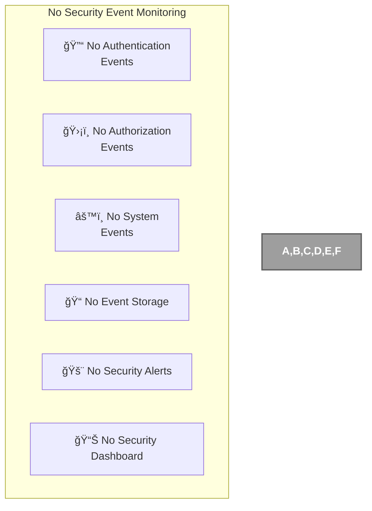

### Current Implementation

CIA Compliance Manager security monitoring:

- **🚫 No Authentication Events**: No login/logout to monitor
- **🚫 No Authorization Events**: No access control to track
- **🚫 No System Events**: Frontend-only with no server events
- **🚫 No Security Alerts**: No monitoring system in place

### Security Implications

- **✅ No Security Events**: No authentication to compromise
- **✅ Minimal Attack Surface**: Static content only
- **❌ No Threat Detection**: Cannot identify attacks
- **❌ No Incident Response**: No system to detect incidents

## 🌐 Network Security

**Current Status**: ✅ HTTPS Only - Static Content Delivery with DNS Security

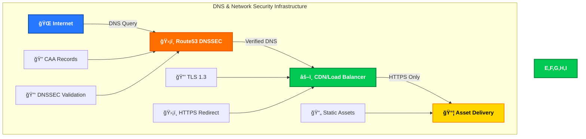

### Current Implementation

CIA Compliance Manager network security includes comprehensive DNS protection:

#### 🛡️ DNS Security (Route53 + DNSSEC)

- **✅ DNSSEC Enabled**: Domain Name System Security Extensions for DNS integrity
- **✅ Route53 Hosting**: AWS Route53 provides authoritative DNS with DNSSEC support
- **✅ DNS Query Validation**: Cryptographic verification of DNS responses
- **✅ Cache Poisoning Protection**: DNSSEC prevents DNS spoofing attacks

#### 🔐 Certificate Authority Authorization (CAA)

- **✅ CAA Records**: Specifies which Certificate Authorities can issue certificates
- **✅ Email Validation**: CAA records configured for email-based certificate validation
- **✅ Certificate Misuse Prevention**: Prevents unauthorized certificate issuance
- **✅ Compliance**: Follows CAB Forum baseline requirements

#### 🌐 Transport Security

- **✅ HTTPS Only**: All traffic encrypted with TLS
- **✅ Static Content**: No dynamic server-side processing
- **✅ CDN Delivery**: Distributed content delivery for performance
- **✅ No Backend**: No server infrastructure to secure

### DNS Security Configuration

```dns
; Example DNSSEC and CAA configuration for ciacompliancemanager.com
ciacompliancemanager.com.    IN    CAA    0 issue "letsencrypt.org"
ciacompliancemanager.com.    IN    CAA    0 issuewild "letsencrypt.org"
ciacompliancemanager.com.    IN    CAA    0 iodef "mailto:security@ciacompliancemanager.com"

; DNSSEC records automatically managed by Route53
ciacompliancemanager.com.    IN    DNSKEY    256 3 8 (base64-encoded-key)
ciacompliancemanager.com.    IN    DS        12345 8 2 (sha256-hash)
ciacompliancemanager.com.    IN    RRSIG     DNSKEY 8 2 86400 (signature-data)
```

### Security Benefits

- **🔒 Encrypted Traffic**: All communications protected by TLS
- **🛡️ DNS Integrity**: DNSSEC prevents DNS manipulation attacks
- **📜 Certificate Control**: CAA records prevent unauthorized certificate issuance
- **📦 Static Assets**: No dynamic content vulnerabilities
- **🌍 Global CDN**: Distributed delivery reduces single points of failure
- **⚡ Minimal Attack Surface**: No server-side code to exploit

### DNS Security Features

#### 🔐 DNSSEC Protection

- **Chain of Trust**: Complete cryptographic chain from root to domain
- **Response Authentication**: All DNS responses cryptographically signed
- **Data Integrity**: Prevents tampering with DNS records in transit
- **Non-Existence Proof**: NSEC3 records prevent zone enumeration

#### 📜 CAA Record Protection

- **Certificate Authority Control**: Explicitly authorizes trusted CAs
- **Email Notification**: Security contact for certificate-related incidents
- **Wildcard Protection**: Separate controls for wildcard certificates
- **Compliance**: Meets CAB Forum baseline requirements for domain validation

#### 🌐 Route53 Security Benefits

- **AWS Infrastructure**: Benefits from AWS's global security infrastructure
- **DDoS Protection**: Built-in protection against DNS-based DDoS attacks
- **High Availability**: Anycast network with multiple geographic locations
- **Monitoring**: CloudWatch integration for DNS query monitoring

### Domain Security Monitoring

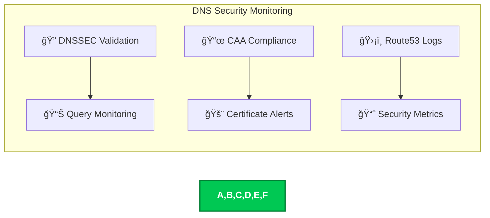

### Security Compliance

- **✅ RFC 4034**: DNSSEC DNS Security Extensions compliance
- **✅ RFC 6844**: DNS Certification Authority Authorization compliance
- **✅ CAB Forum**: Certificate Authority baseline requirements compliance
- **✅ Industry Standards**: Follows DNS security best practices

## 🔌 VPC Endpoints Security

**Current Status**: ❌ Not Applicable - No AWS Infrastructure

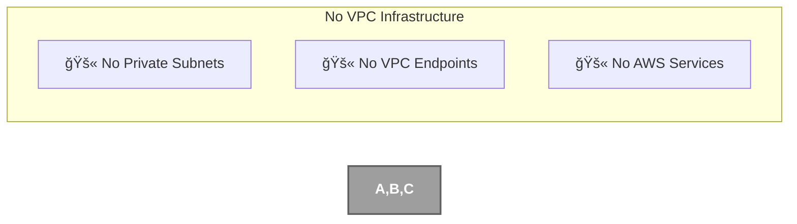

### Current Status

CIA Compliance Manager does not use VPC infrastructure:

- **🚫 No VPC**: Frontend-only application with no AWS VPC
- **🚫 No Private Subnets**: Static content delivery only
- **🚫 No Endpoints**: No AWS service endpoints needed

## 🏗️ High Availability Design

**Current Status**: ❌ Not Applicable - Static Content Only

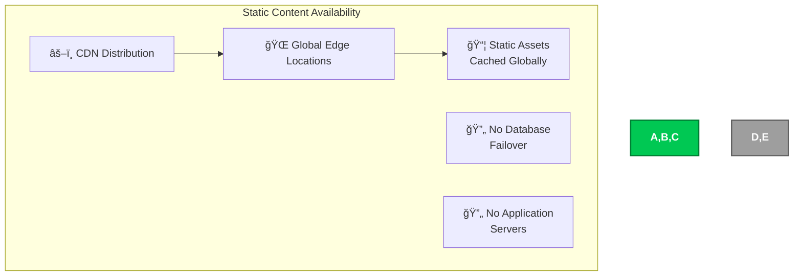

### Current Implementation

CIA Compliance Manager availability:

- **✅ CDN Distribution**: Global content delivery network
- **✅ Edge Caching**: Assets cached at multiple locations
- **🚫 No Database**: No database availability concerns
- **🚫 No Servers**: No application servers to manage

### Availability Benefits

- **🌍 Global Distribution**: Content available worldwide
- **⚡ Edge Caching**: Fast content delivery from nearby locations
- **🔄 Redundancy**: Multiple CDN edge locations provide redundancy

## 💾 Data Protection

**Current Status**: ✅ TLS Encryption - No Persistent Data

```mermaid
flowchart TD
    subgraph "Data Protection Strategy"
        A[👤 Security Professional] <-->|"🔒 TLS 1.3"| B[⚖️ GitHub Pages CDN]
        B <-->|"📦 Static Assets"| C[🖥️ Browser]

        D[🔐 No Encryption<br/>At Rest Needed]
        E[🗝️ No Secrets<br/>Management]
        F[🔄 No Data<br/>Rotation]
    end

    style A fill:#2979FF,stroke:#0D47A1,stroke-width:2px,color:white,font-weight:bold
    style B,C fill:#00C853,stroke:#007E33,stroke-width:2px,color:white,font-weight:bold
    style D,E,F fill:#9E9E9E,stroke:#616161,stroke-width:2px,color:white,font-weight:bold
```

### Current Implementation

CIA Compliance Manager data protection:

- **✅ TLS Encryption**: All communications encrypted in transit
- **✅ No Persistent Data**: No data at rest to protect
- **✅ No Secrets**: No credentials or API keys to manage
- **✅ Browser Security**: Assessment data protected by browser security model

### Protection Benefits

- **🔒 Transit Security**: All network traffic encrypted
- **💾 No Data Leaks**: No persistent data to compromise
- **🔑 No Credential Theft**: No stored credentials to steal
- **🛡️ Browser Isolation**: Each professional's assessment data isolated by browser

## ☁️ AWS Security Infrastructure

**Current Status**: ❌ Not Applicable - No AWS Infrastructure

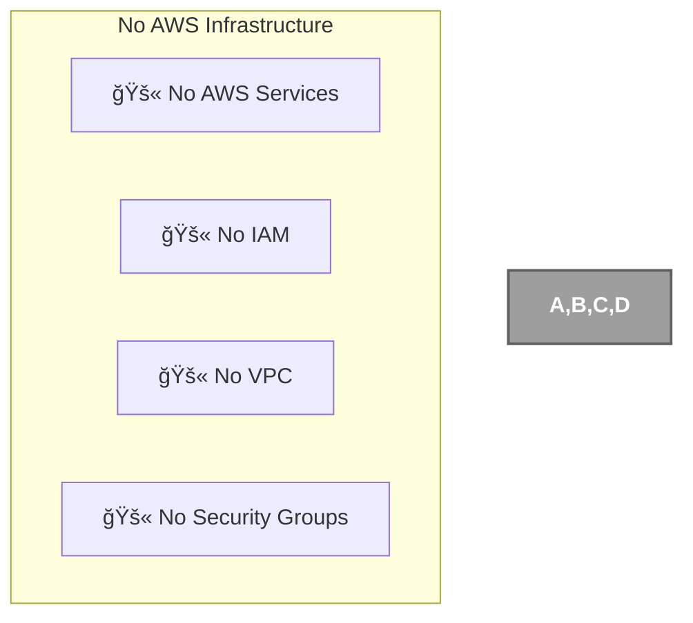

### Current Status

CIA Compliance Manager does not use AWS infrastructure:

- **🚫 No AWS Services**: Frontend-only application
- **🚫 No IAM**: No AWS identity management needed
- **🚫 No VPC**: No virtual private cloud infrastructure
- **🚫 No Security Groups**: No AWS network security controls

## 🔰 AWS Foundational Security Best Practices

**Current Status**: ❌ Not Applicable - No AWS Services

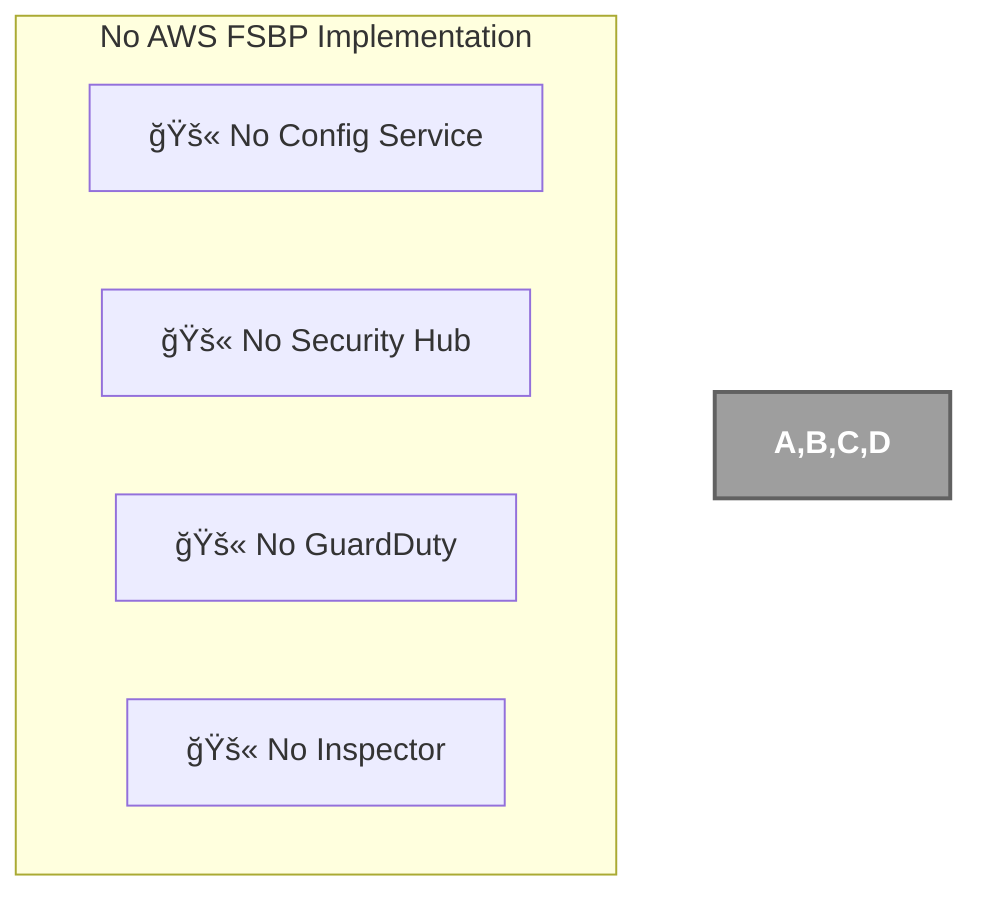

### Current Status

CIA Compliance Manager does not implement AWS FSBP:

- **🚫 No AWS Config**: No AWS resources to configure
- **🚫 No Security Hub**: No AWS security findings to aggregate
- **🚫 No GuardDuty**: No AWS environment to monitor
- **🚫 No Inspector**: No AWS resources to scan

## 🕵️ Threat Detection & Investigation

**Current Status**: ❌ No Threat Detection - Frontend Only

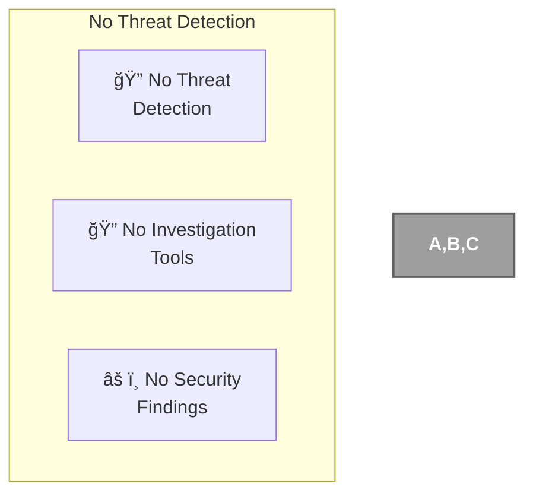

### Current Status

CIA Compliance Manager threat detection:

- **🚫 No Threat Detection**: No monitoring infrastructure
- **🚫 No Investigation Tools**: No forensic capabilities
- **🚫 No Security Findings**: No security events to investigate

### Security Implications

- **✅ Minimal Threats**: Static content has limited threat vectors
- **✅ No Data to Steal**: No persistent data to compromise
- **❌ No Visibility**: Cannot detect client-side attacks
- **❌ No Response**: No incident response capabilities

## 🔎 Vulnerability Management

**Current Status**: ❌ No Vulnerability Management - Static Content

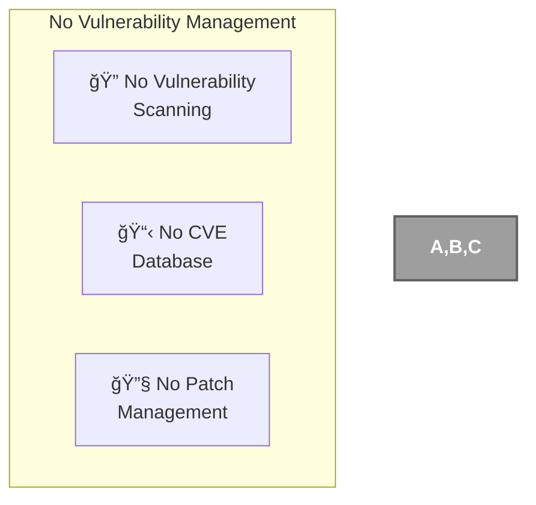

### Current Status

CIA Compliance Manager vulnerability management:

- **🚫 No Scanning**: No server infrastructure to scan
- **🚫 No CVE Tracking**: No operating systems or services to patch
- **🚫 No Patch Management**: Static content requires no patching

### Security Considerations

- **✅ No Server Vulnerabilities**: No servers to exploit
- **✅ No OS Patching**: No operating systems to maintain
- **❌ Client-Side Risks**: Browser vulnerabilities outside our control
- **❌ Dependency Risks**: Frontend dependencies need manual updates

## ⚡ Resilience & Operational Readiness

**Current Status**: ❌ Not Applicable - Static Content Delivery

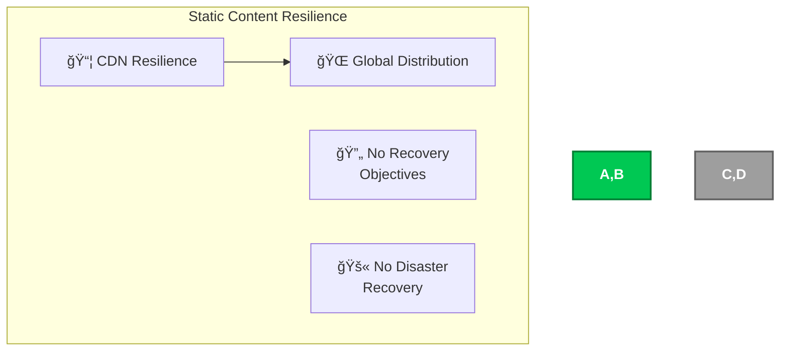

### Current Status

CIA Compliance Manager resilience:

- **✅ CDN Resilience**: Global content distribution provides natural resilience
- **🚫 No RTO/RPO**: No data persistence means no recovery objectives
- **🚫 No DR Planning**: Static content requires no disaster recovery

### Resilience Benefits

- **🌍 Geographic Distribution**: Content available from multiple locations
- **⚡ Automatic Failover**: CDN handles edge location failures automatically
- **🔄 No Data Loss**: No persistent data to lose

## 📋 Configuration & Compliance Management

**Current Status**: ❌ No Configuration Management - Static Content


### Current Status

CIA Compliance Manager configuration management:

- **🚫 No AWS Config**: No AWS resources to configure
- **🚫 No Resource Inventory**: Only static files to manage
- **🚫 No Compliance Rules**: No infrastructure compliance requirements

### Configuration Approach

- **📦 Build-Time Configuration**: All configuration handled during build
- **🔧 Static Configuration**: No runtime configuration changes
- **✅ Version Control**: All configuration in source control

## 📊 Monitoring & Analytics

**Current Status**: ❌ No Security Monitoring - Frontend Only

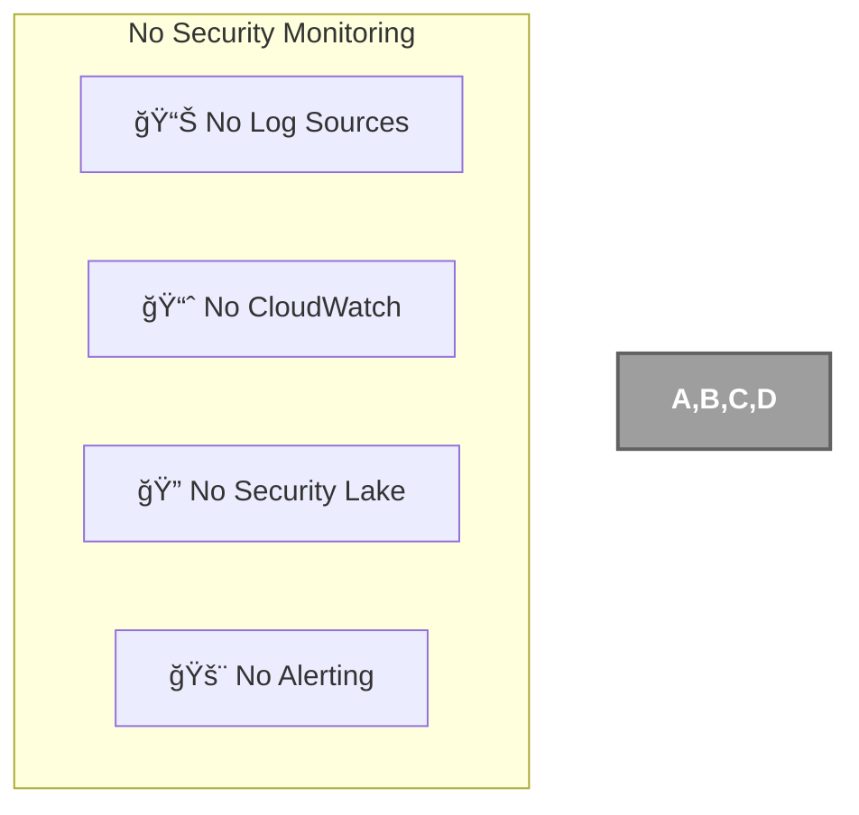

### Current Status

CIA Compliance Manager monitoring:

- **🚫 No Server Logs**: No server infrastructure to monitor
- **🚫 No CloudWatch**: No AWS services to monitor
- **🚫 No Security Analytics**: No security events to analyze
- **🚫 No Alerting**: No monitoring system to generate alerts

### Monitoring Limitations

- **❌ No Visibility**: Cannot monitor player behavior
- **❌ No Analytics**: No usage patterns or security insights
- **❌ No Alerting**: No early warning system for issues

## 🤖 Automated Security Operations

**Current Status**: ❌ No Automated Security Operations - Static Content

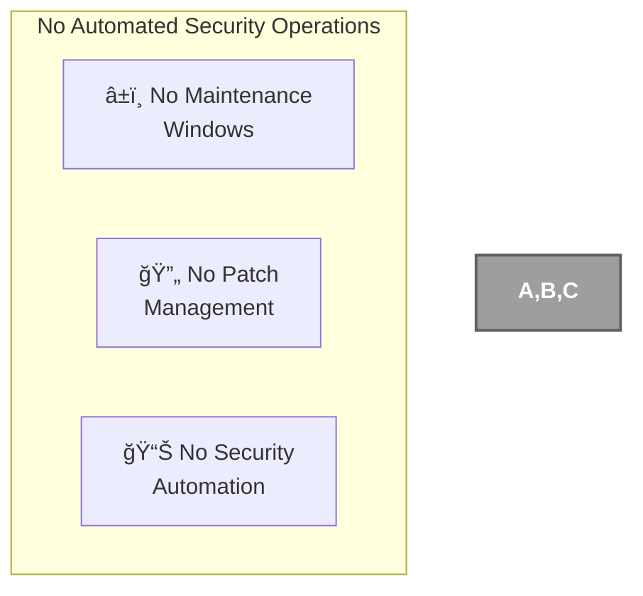

### Current Status

CIA Compliance Manager automated operations:

- **🚫 No Maintenance Windows**: No infrastructure to maintain
- **🚫 No Patch Management**: No operating systems to patch
- **🚫 No Security Automation**: No security operations to automate

### Operational Benefits

- **✅ Zero Maintenance**: Static content requires no ongoing maintenance
- **✅ No Downtime**: No maintenance windows or patches needed
- **✅ Self-Healing**: CDN automatically handles edge location issues

## 🔒 Application Security

**Current Status**: ✅ Partial Implementation - Frontend Security Only

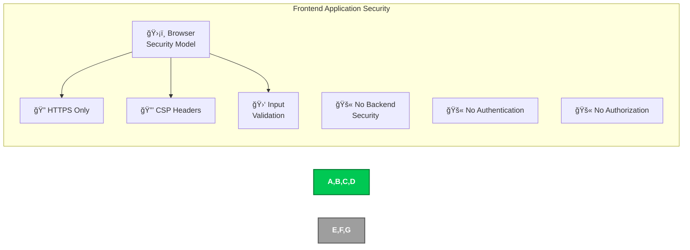

### Current Implementation

CIA Compliance Manager application security:

- **✅ HTTPS Enforcement**: All traffic over encrypted connections
- **✅ Browser Security Model**: Leverages browser sandboxing and isolation
- **✅ Content Security Policy**: Comprehensive CSP headers to prevent XSS
- **✅ Input Validation**: Client-side validation for assessment inputs
- **✅ Error Boundaries**: React 19.x error boundaries for graceful failure handling
- **🚫 No Backend Security**: No server-side security controls
- **🚫 No Authentication**: No user accounts or login system

### Security Features

- **🔒 Transport Security**: TLS encryption for all communications
- **🛡️ XSS Protection**: Content Security Policy headers with strict directives
- **🔍 Input Sanitization**: Validation of all assessment configuration inputs
- **🚪 Same-Origin Policy**: Browser enforces origin restrictions
- **⚠️ Error Handling**: React error boundaries prevent information disclosure

## ⚛️ React 19.x Security Architecture

**Current Status**: ✅ Implemented - React 19.2.0 with Enhanced Security

```mermaid
flowchart TD
    subgraph "React 19.x Security Controls"
        A[⚛️ React 19.2.0 Core] --> B[🛡️ Error Boundaries]
        A --> C[🔄 Concurrent Rendering]
        A --> D[📦 Automatic Batching]
        
        B --> E[⚠️ Component Error Isolation]
        B --> F[🔒 Graceful Failure]
        
        C --> G[🚀 Performance Security]
        C --> H[⏱️ Priority-Based Rendering]
        
        I[🔐 TypeScript Strict Mode] --> A
        J[🛡️ Custom WidgetErrorBoundary] --> B
    end

    style A fill:#61DAFB,stroke:#00D8FF,stroke-width:2px,color:black,font-weight:bold
    style B,C,D fill:#00C853,stroke:#007E33,stroke-width:2px,color:white,font-weight:bold
    style E,F,G,H fill:#FFD600,stroke:#FF8F00,stroke-width:2px,color:black,font-weight:bold
    style I,J fill:#2979FF,stroke:#0D47A1,stroke-width:2px,color:white,font-weight:bold
```

### React 19.x Security Features

#### 🛡️ Error Boundaries (v1.0 Enhancement)

- **Component Error Isolation**: Widget-level error boundaries prevent cascade failures
- **Graceful Degradation**: Application continues functioning when individual components fail
- **No Information Disclosure**: Error boundaries prevent sensitive stack traces from reaching users
- **Security Benefit**: Reduces attack surface by containing component failures

**Implementation:**
```typescript
// Error boundary wrapping for all widgets
import WidgetErrorBoundary from './components/common/WidgetErrorBoundary';

<WidgetErrorBoundary
  widgetName="Assessment Widget"
  onError={(error, info) => logErrorToService(error, info)}
>
  <AssessmentWidget />
</WidgetErrorBoundary>
```

#### 🔄 Concurrent Rendering Security

- **Priority-Based Updates**: Critical security UI updates prioritized
- **Smooth User Experience**: No blocking operations that could mask security issues
- **Performance Security**: Prevents DoS through efficient rendering
- **Security Benefit**: Maintains responsive security controls under load

#### 📦 Automatic Batching

- **Optimized State Updates**: Multiple security state changes batched efficiently
- **Reduced Re-renders**: Minimizes potential security state inconsistencies
- **Performance**: Faster assessment calculations and security validation
- **Security Benefit**: Prevents race conditions in security state management

### TypeScript Strict Mode Security

```mermaid
flowchart LR
    subgraph "TypeScript 5.9.3 Strict Mode"
        A[🔒 strictNullChecks] --> B[✅ Null Safety]
        C[🔒 noImplicitAny] --> D[✅ Type Safety]
        E[🔒 strictFunctionTypes] --> F[✅ Function Safety]
        G[🔒 strictPropertyInitialization] --> H[✅ Property Safety]
    end

    style A,C,E,G fill:#2979FF,stroke:#0D47A1,stroke-width:2px,color:white,font-weight:bold
    style B,D,F,H fill:#00C853,stroke:#007E33,stroke-width:2px,color:white,font-weight:bold
```

**Security Benefits:**
- **Zero `any` Types**: Complete type safety prevents type confusion attacks
- **Null Checks**: Prevents null reference vulnerabilities
- **Type Safety**: Compile-time detection of potential runtime errors
- **Property Validation**: Ensures all security-critical properties are initialized

## 🧪 Cypress 15.x Test Security Architecture

**Current Status**: ✅ Implemented - Cypress 15.7.0 with Enhanced Testing

```mermaid
flowchart TD
    subgraph "Cypress 15.x Security Testing"
        A[🧪 Cypress 15.7.0] --> B[🔍 Component Testing]
        A --> C[🌐 E2E Testing]
        A --> D[📸 Visual Testing]
        
        B --> E[🛡️ Widget Security Tests]
        C --> F[🔐 Workflow Security Tests]
        D --> G[⚠️ UI Security Validation]
        
        H[📊 83.26% Coverage] --> A
        I[🔄 Session Handling] --> C
    end

    style A fill:#00C853,stroke:#007E33,stroke-width:2px,color:white,font-weight:bold
    style B,C,D fill:#2979FF,stroke:#0D47A1,stroke-width:2px,color:white,font-weight:bold
    style E,F,G fill:#FFD600,stroke:#FF8F00,stroke-width:2px,color:black,font-weight:bold
    style H,I fill:#9C27B0,stroke:#6A1B9A,stroke-width:2px,color:white,font-weight:bold
```

### Cypress 15.x Security Testing Features

#### 🔍 Component Testing Security

- **Isolated Widget Testing**: Each widget tested in isolation for security vulnerabilities
- **Input Validation Tests**: Comprehensive testing of all input sanitization
- **XSS Protection Tests**: Validation of Content Security Policy effectiveness
- **State Management Security**: Testing of secure state transitions

#### 🌐 E2E Security Testing

- **Workflow Security**: End-to-end testing of security assessment workflows
- **Session Security**: Testing of browser storage security and isolation
- **Navigation Security**: Validation of secure routing and navigation
- **Integration Security**: Testing of component interactions for security issues

#### 📸 Visual Security Testing

- **UI Security Validation**: Screenshot regression testing for security UI
- **Error State Testing**: Visual validation of error boundaries and fallbacks
- **Responsive Security**: Testing security controls across different viewports
- **Security Indicator Testing**: Validation of security status indicators

### Test Coverage Security Metrics

| Test Type | Coverage | Security Focus | v1.0 Status |
|-----------|----------|----------------|-------------|
| **Unit Tests** | 83.26% line coverage | Input validation, type safety, business logic security | ✅ Target Exceeded (>80%) |
| **Component Tests** | Widget-level coverage | XSS protection, error boundaries, state security | ✅ Comprehensive |
| **E2E Tests** | Critical path coverage | Workflow security, session handling, integration | ✅ Comprehensive |
| **Visual Tests** | UI security coverage | Security indicator visibility, error states | ✅ Implemented |


## 📜 Compliance Framework

**Current Status**: ❌ No Formal Compliance - Open Source Assessment Tool

```mermaid
graph TD
    subgraph "No Formal Compliance"
        A[🏛️ No Compliance<br>Framework]
        B[🔍 No NIST CSF]
        C[🔐 No ISO 27001]
        D[📋 No Regulatory<br>Requirements]
    end

    style A,B,C,D fill:#9E9E9E,stroke:#616161,stroke-width:2px,color:white,font-weight:bold
```

### Current Status

CIA Compliance Manager compliance:

- **🚫 No Formal Framework**: No regulatory compliance requirements
- **🚫 No NIST CSF**: Open source assessment tool with no compliance mandate
- **🚫 No ISO 27001**: No certification requirements
- **✅ Privacy by Design**: No personal data collection or storage

### Compliance Considerations

- **🎯 Assessment Tool**: Compliance assessment platform with no sensitive data
- **🔒 Privacy First**: No assessment data collection reduces compliance burden
- **🌍 Global Access**: No geographic restrictions or data residency requirements

## 🛡️ Content Security Policy (CSP) Implementation

**Current Status**: ✅ Implemented - Comprehensive CSP Headers

```mermaid
flowchart TD
    subgraph "CSP Security Architecture"
        A[🛡️ CSP Headers] --> B[📜 default-src 'self']
        A --> C[📝 script-src Policy]
        A --> D[🎨 style-src Policy]
        A --> E[🖼️ img-src Policy]
        
        B --> F[🔒 Strict Default]
        C --> G[⚠️ 'unsafe-inline' Limited]
        D --> H[🎨 Google Fonts Allowed]
        E --> I[🖼️ Data URIs + HTTPS]
        
        J[🔒 X-Content-Type-Options] --> A
        K[🚫 X-Frame-Options: DENY] --> A
        L[🔐 Cross-Origin Policies] --> A
    end

    style A fill:#FF6F00,stroke:#E65100,stroke-width:2px,color:white,font-weight:bold
    style B,C,D,E fill:#2979FF,stroke:#0D47A1,stroke-width:2px,color:white,font-weight:bold
    style F,G,H,I fill:#00C853,stroke:#007E33,stroke-width:2px,color:white,font-weight:bold
    style J,K,L fill:#9C27B0,stroke:#6A1B9A,stroke-width:2px,color:white,font-weight:bold
```

### CSP Header Configuration

The application implements comprehensive Content Security Policy headers in `index.html`:

```html
<!-- Content Security Policy: Defines sources of content that can be loaded -->
<meta 
  http-equiv="Content-Security-Policy" 
  content="default-src 'self'; 
           script-src 'self' 'unsafe-inline'; 
           style-src 'self' 'unsafe-inline' https://fonts.googleapis.com https://fonts.gstatic.com; 
           img-src 'self' data: https:; 
           connect-src 'self'; 
           font-src 'self' data: https://fonts.gstatic.com; 
           object-src 'none'; 
           base-uri 'self'; 
           form-action 'self'; 
           frame-ancestors 'none'; 
           upgrade-insecure-requests;"
/>
```

### CSP Directive Breakdown

| Directive | Policy | Security Benefit |
|-----------|--------|------------------|
| **default-src 'self'** | Only load resources from same origin | Prevents unauthorized external resource loading |
| **script-src 'self' 'unsafe-inline'** | Scripts from same origin + inline | Allows React inline scripts while blocking external |
| **style-src 'self' 'unsafe-inline' fonts.google** | Styles from same origin + Google Fonts | Enables styling while preventing malicious style injection |
| **img-src 'self' data: https:** | Images from same origin, data URIs, HTTPS | Allows necessary images while preventing mixed content |
| **connect-src 'self'** | XHR/fetch only to same origin | Prevents data exfiltration to external servers |
| **object-src 'none'** | No plugins allowed | Prevents Flash, Java, and other plugin vulnerabilities |
| **frame-ancestors 'none'** | Cannot be framed | Prevents clickjacking attacks |
| **upgrade-insecure-requests** | Upgrade HTTP to HTTPS | Ensures all connections are encrypted |

### Additional Security Headers

```html
<!-- Prevent MIME-type sniffing -->
<meta http-equiv="X-Content-Type-Options" content="nosniff" />

<!-- Clickjacking protection: Prevent site from being embedded in frames -->
<meta http-equiv="X-Frame-Options" content="DENY" />

<!-- Cross-Origin isolation for Spectre vulnerability protection -->
<meta http-equiv="Cross-Origin-Opener-Policy" content="same-origin" />
<meta http-equiv="Cross-Origin-Embedder-Policy" content="require-corp" />

<!-- Referrer Policy: Control information sent in Referer header -->
<meta name="referrer" content="strict-origin-when-cross-origin" />
```

### XSS Protection Strategy

```mermaid
flowchart LR
    subgraph "Multi-Layer XSS Protection"
        A[🎯 Attack Vector] --> B[🛡️ CSP Headers]
        B --> C[⚛️ React Escaping]
        C --> D[🔒 TypeScript Types]
        D --> E[✅ Input Validation]
        E --> F[🚫 Attack Blocked]
    end

    style A fill:#FF3D00,stroke:#BF360C,stroke-width:2px,color:white,font-weight:bold
    style B,C,D,E fill:#00C853,stroke:#007E33,stroke-width:2px,color:white,font-weight:bold
    style F fill:#2979FF,stroke:#0D47A1,stroke-width:2px,color:white,font-weight:bold
```

**Defense-in-Depth XSS Protection:**
1. **CSP Headers**: Prevent execution of unauthorized scripts
2. **React Auto-Escaping**: Automatic XSS protection in JSX rendering
3. **TypeScript Safety**: Type system prevents many injection vulnerabilities
4. **Input Validation**: Sanitization of all user inputs
5. **No dangerouslySetInnerHTML**: Avoidance of unsafe DOM manipulation

## 🔗 SLSA Level 3 Supply Chain Security

**Current Status**: ✅ Implemented - SLSA Level 3 Attestation

```mermaid
flowchart TD
    subgraph "SLSA Level 3 Architecture"
        A[📦 GitHub Actions Build] --> B[🔏 Build Provenance]
        B --> C[📋 SBOM Generation]
        C --> D[🔐 Artifact Attestation]
        
        D --> E[✅ Tamper-Evident]
        D --> F[🔍 Verifiable]
        D --> G[📊 Transparent]
        
        H[🛡️ actions/attest-build-provenance] --> B
        I[📦 SBOM Attestation] --> C
        J[🔒 SHA-Pinned Actions] --> A
    end

    style A fill:#2979FF,stroke:#0D47A1,stroke-width:2px,color:white,font-weight:bold
    style B,C,D fill:#00C853,stroke:#007E33,stroke-width:2px,color:white,font-weight:bold
    style E,F,G fill:#FFD600,stroke:#FF8F00,stroke-width:2px,color:black,font-weight:bold
    style H,I,J fill:#9C27B0,stroke:#6A1B9A,stroke-width:2px,color:white,font-weight:bold
```

### SLSA Level 3 Requirements Met

| SLSA Requirement | Implementation | Security Benefit |
|------------------|----------------|------------------|
| **Build Provenance** | `actions/attest-build-provenance@v3` | Cryptographic proof of build integrity |
| **SBOM Generation** | SBOM attestation in release workflow | Complete dependency transparency |
| **Hermetic Builds** | GitHub Actions isolated environment | Reproducible, tamper-resistant builds |
| **Artifact Integrity** | SHA-256 checksums and signatures | Verifiable artifact authenticity |
| **Retention** | Build logs retained per GitHub policy | Audit trail for security investigation |
| **Non-Falsifiable** | GitHub-provided provenance | Cryptographically signed by GitHub |

### Build Attestation Implementation

```yaml
# From .github/workflows/release.yml
- name: Generate artifact attestation
  uses: actions/attest-build-provenance@977bb373ede98d70efdf65b84cb5f73e068dcc2a # v3.0.0
  with:
    subject-path: 'build/**/*'

- name: Generate SBOM attestation
  uses: actions/attest-sbom@4651f806c01d8637787e274ac3bdf724ef169f34 # v3.0.0
  with:
    subject-path: 'build/**/*'
    sbom-path: 'sbom.json'
```

### Supply Chain Security Benefits

```mermaid
flowchart LR
    subgraph "Supply Chain Threat Mitigation"
        A[🎯 Threat] --> B[🔒 Control]
        
        T1[📦 Package Tampering] --> C1[🔏 Build Provenance]
        T2[🔗 Dependency Attack] --> C2[📋 SBOM Verification]
        T3[⚙️ Build Compromise] --> C3[🛡️ Hermetic Builds]
        T4[🎭 Artifact Substitution] --> C4[🔐 Attestations]
    end

    style T1,T2,T3,T4 fill:#FF3D00,stroke:#BF360C,stroke-width:2px,color:white,font-weight:bold
    style C1,C2,C3,C4 fill:#00C853,stroke:#007E33,stroke-width:2px,color:white,font-weight:bold
```

**Mitigated Supply Chain Threats:**
- **Package Tampering**: Build provenance prevents artifact modification
- **Dependency Attacks**: SBOM enables vulnerability tracking and verification
- **Build Compromise**: Hermetic GitHub Actions environment isolates builds
- **Artifact Substitution**: Cryptographic attestations verify authenticity

### SLSA Badge & Verification

[](https://github.com/Hack23/cia-compliance-manager/attestations)

**Public Verification:**
- Build provenance publicly viewable at GitHub attestations endpoint
- SBOM available for dependency audit and compliance verification
- Cryptographic signatures verifiable by any third party
- Complete supply chain transparency for security professionals


## 🛡️ Defense-in-Depth Strategy

**Current Status**: ✅ Simplified Defense Strategy - Minimal Attack Surface

```mermaid
flowchart TD
    subgraph "Simplified Defense-in-Depth"
        A[🌐 Network Layer] --> B[🔒 HTTPS/TLS]
        C[🖥️ Application Layer] --> D[🛡️ Browser Security]
        E[👤 User Layer] --> F[🔍 Input Validation]

        G[🚫 No Identity Layer]
        H[🚫 No Data Layer]
        I[🚫 No Infrastructure Layer]
    end

    style A,B,C,D,E,F fill:#00C853,stroke:#007E33,stroke-width:2px,color:white,font-weight:bold
    style G,H,I fill:#9E9E9E,stroke:#616161,stroke-width:2px,color:white,font-weight:bold
```

### Current Implementation

CIA Compliance Manager's simplified defense approach:

1. **🌐 Network Security**: HTTPS-only communication with TLS encryption
2. **🖥️ Application Security**: Browser security model and CSP headers
3. **👤 Input Security**: Client-side validation and sanitization

### Missing Layers

- **🚫 Identity Security**: No authentication or user management
- **🚫 Data Security**: No persistent data to protect
- **🚫 Infrastructure Security**: No servers or cloud infrastructure

### Security Benefits

- **✅ Reduced Complexity**: Fewer layers mean fewer vulnerabilities
- **✅ Browser Isolation**: Each user's session isolated by browser
- **✅ No Data Breach Risk**: No persistent data to compromise

## 🔄 Security Operations

**Current Status**: ❌ No Security Operations - Static Content Only

```mermaid
flowchart TD
    subgraph "No Security Operations"
        A[🔍 No Monitoring]
        B[⚡ No Incident<br>Response]
        C[🔄 No Security<br>Maintenance]
        D[📊 No Threat<br>Intelligence]
    end

    style A,B,C,D fill:#9E9E9E,stroke:#616161,stroke-width:2px,color:white,font-weight:bold
```

### Current Status

CIA Compliance Manager security operations:

- **🚫 No Security Operations Center**: No infrastructure to monitor
- **🚫 No Incident Response**: No security events to respond to
- **🚫 No Threat Intelligence**: No active threats to track
- **🚫 No Security Maintenance**: Static content requires no maintenance

### Operational Approach

- **📦 Build-Time Security**: Security implemented during development
- **🔧 Static Security**: No runtime security operations needed
- **🛡️ Browser Reliance**: Security operations handled by user's browser

## 💰 Security Investment

**Current Status**: ✅ Minimal Security Investment - Frontend Only

```mermaid
flowchart TD
    subgraph "Minimal Security Investment"
        A[💰 Low Cost] --> B[📦 CDN Costs Only]
        A --> C[🔒 TLS Certificate]
        A --> D[🛠️ Development Time]

        E[🚫 No AWS Costs]
        F[🚫 No Monitoring Costs]
        G[🚫 No Operations Costs]
    end

    style A,B,C,D fill:#00C853,stroke:#007E33,stroke-width:2px,color:white,font-weight:bold
    style E,F,G fill:#9E9E9E,stroke:#616161,stroke-width:2px,color:white,font-weight:bold
```

### Current Investment

CIA Compliance Manager security investment:

- **💰 CDN Costs**: Content delivery network hosting costs
- **🔒 TLS Certificates**: HTTPS encryption (often free with CDN)
- **🛠️ Development Time**: Security implementation during development
- **🚫 No Infrastructure Costs**: No servers or cloud services to pay for
- **🚫 No Security Tools**: No paid security monitoring or scanning tools

### Implemented CI/CD Security

CIA Compliance Manager implements comprehensive CI/CD security:

1. **🔍 Static Analysis Security**:

   - **CodeQL Analysis**: Automated vulnerability scanning for JavaScript/TypeScript
   - **Dependency Review**: Checks for known vulnerabilities in dependencies
   - **OSSF Scorecard**: Supply chain security assessment with public scoring

2. **🔏 Build Security**:

   - **SLSA Build Provenance**: Cryptographic proof of build integrity
   - **SBOM Generation**: Software Bill of Materials for transparency
   - **Artifact Signing**: Secure signing of release artifacts

3. **🚀 Deployment Security**:

   - **GitHub Pages**: Secure static hosting with HTTPS enforcement
   - **Lighthouse Auditing**: Performance and security best practices validation
   - **ZAP Security Scanning**: Dynamic security testing of deployed application

4. **🛡️ Pipeline Security**:
   - **SHA Pinning**: All GitHub Actions pinned to specific commit hashes
   - **Runner Hardening**: StepSecurity harden-runner for audit logging
   - **Least Privilege**: Minimal permissions for all workflow steps

### Security Workflow Features

- **🔄 Continuous Scanning**: Every commit and pull request analyzed
- **📊 Security Reporting**: Centralized security findings in GitHub Security tab
- **⚡ Automated Remediation**: Dependency updates and vulnerability fixes
- **🏆 Supply Chain Protection**: Complete software supply chain visibility

### Key Security Benefits

- **🔍 Early Detection**: Security issues caught during development
- **📄 Transparency**: Complete audit trail of all changes and builds
- **🔒 Integrity**: Cryptographic verification of all artifacts
- **⚡ Automation**: Reduced human error through automated security checks

## 📝 Conclusion

CIA Compliance Manager implements a **security-first approach optimized for a frontend-only compliance assessment platform**. While the application architecture intentionally avoids many traditional security concerns through its stateless, client-side-only design, it implements robust security controls where applicable.

### Current Security Strengths

1. **🔒 Transport Security**: HTTPS-only communication with TLS encryption
2. **🛡️ Minimal Attack Surface**: No backend servers, databases, or user accounts to compromise
3. **🔐 CI/CD Security**: Comprehensive security scanning and SLSA Level 3 attestation in the build pipeline
4. **🎯 Privacy by Design**: No personal data collection or storage
5. **🌐 Global Availability**: GitHub Pages CDN-based delivery with natural resilience
6. **⚛️ Modern Framework**: React 19.x with error boundaries and concurrent rendering security
7. **🛡️ Comprehensive CSP**: Content Security Policy headers protecting against XSS attacks

### Security Architecture Benefits

1. **💰 Cost Effective**: Minimal security infrastructure and operational costs
2. **🔄 Zero Maintenance**: No ongoing security patching or monitoring required for infrastructure
3. **🚀 High Performance**: Security controls designed for minimal performance impact
4. **🌍 Global Access**: No geographic restrictions or compliance complexities
5. **🎯 Assessment Focus**: Security approach supports the compliance assessment mission

### Future Security Considerations

As documented in the [End-of-Life Strategy](End-of-Life-Strategy.md), any future evolution toward backend services or user accounts would require implementing the traditional security layers currently marked as "not applicable."
- **🔄 Continuous Scanning**: Every commit and pull request analyzed
- **📊 Security Reporting**: Centralized security findings in GitHub Security tab
- **⚡ Automated Remediation**: Dependency updates and vulnerability fixes
- **🏆 Supply Chain Protection**: Complete software supply chain visibility

### Key Security Benefits

- **🔍 Early Detection**: Security issues caught during development
- **📄 Transparency**: Complete audit trail of all changes and builds
- **🔒 Integrity**: Cryptographic verification of all artifacts via SLSA Level 3 attestation
- **⚡ Automation**: Reduced human error through automated security checks

