# 🔄 CIA Compliance Manager State Diagrams

> **Version:** v1.0 | **Last Updated:** 2025-11-22 | **Status:** Production

This document illustrates the comprehensive state transitions and behavioral models of the CIA Compliance Manager application v1.0, showing how the system responds to user interactions, handles errors, and manages state across React 19.x components.

## 📚 Related Documentation

<div class="documentation-map">

| Document                                          | Focus           | Description                               |
| ------------------------------------------------- | --------------- | ----------------------------------------- |
| **[Architecture](ARCHITECTURE.md)**               | 🏗️ Architecture | C4 model showing system structure         |
| **[Process Flowcharts](FLOWCHART.md)**            | 🔄 Process      | Security assessment workflows             |
| **[System Architecture](SYSTEM_ARCHITECTURE.md)** | 🏛️ System       | Layered architecture and component details |
| **[Widget Analysis](WIDGET_ANALYSIS.md)**         | 🧩 Components   | Detailed widget component analysis        |
| **[Error Handling](../ERROR_HANDLING.md)**        | 🛡️ Errors       | Error handling patterns and components    |

</div>

## 🎯 State Management Overview

The CIA Compliance Manager implements a comprehensive state management architecture using:

- **React 19.x State Hooks**: `useState`, `useCallback`, `useEffect` for component-level state
- **Custom Hooks**: `useSecurityLevelState`, `useLocalStorage` for cross-cutting concerns
- **Error Boundaries**: React class components with `componentDidCatch` for error recovery
- **Suspense Boundaries**: React 19.x Suspense for lazy-loaded components
- **LocalStorage Persistence**: State persistence across browser sessions

### State Flow Architecture

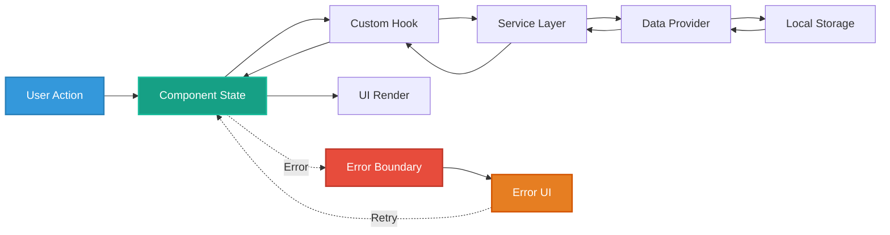

## 🔍 Application Core States

The diagram below shows the main application states and transitions in v1.0, including error recovery paths:

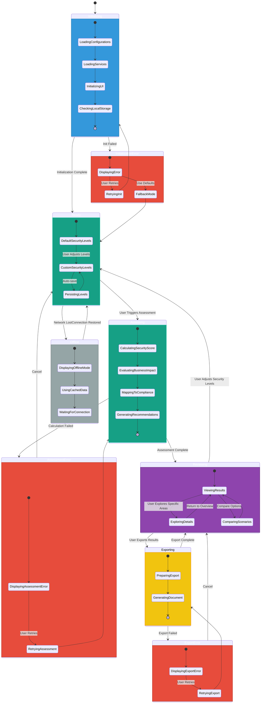

**State Transition Triggers:**
- `Initialization Complete`: All services loaded, UI rendered
- `Init Failed`: Error during app startup (configuration, service initialization)
- `Network Lost`: Browser offline event detected
- `Connection Restored`: Browser online event detected
- `Calculation Failed`: Error in security score computation or business impact analysis
- `Export Failed`: Error generating or downloading export document

**Guard Conditions:**
- `CheckingLocalStorage`: Verifies localStorage availability and validity
- `PersistingLevels`: Only persists if localStorage is available
- `UsingCachedData`: Only if cached data exists and is valid

## 🎛️ SecurityLevelState Hook State Management

State diagram for centralized security level state using `useSecurityLevelState` custom hook:

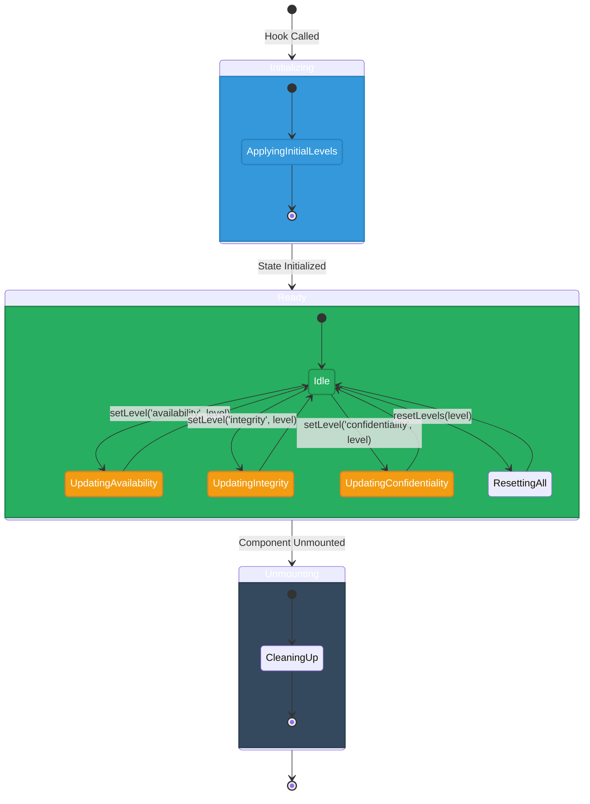

**Hook API:**
```typescript
interface UseSecurityLevelStateReturn {
  levels: SecurityLevelState;        // Current levels
  setLevel: (component: CIAComponent, level: SecurityLevel) => void;  // Update single level
  resetLevels: (defaultLevel?: SecurityLevel) => void;  // Reset all levels
  getLevel: (component: CIAComponent) => SecurityLevel; // Get single level
}
```

> **Note:** The `useSecurityLevelState` hook manages in-memory state only. It does **not** persist to localStorage or handle cross-tab synchronization.

**State Update Flow:**
```
User Action → setLevel() → useState update → React re-render
```

**Application-Level Persistence & Sync:**

LocalStorage persistence and cross-tab synchronization are handled by the `useLocalStorage` hook at the application/component level (e.g., in `CIAClassificationApp.tsx`):

- LocalStorage persistence via `useLocalStorage` hook
- Browser `storage` event for cross-tab sync
- External changes validated before applying
- Infinite update loops prevented with event filtering

**Usage Example:**
```tsx
// In CIAClassificationApp.tsx (application level)
const [savedLevels, setSavedLevels] = useLocalStorage('securityLevels', defaultLevels);

// Initialize security level state with saved values
const { levels, setLevel } = useSecurityLevelState(savedLevels);

// Persist security levels to localStorage whenever they change
useEffect(() => {
  setSavedLevels(levels);
}, [levels, setSavedLevels]);

// Update single level (in-memory only)
setLevel('availability', 'Very High');

// useEffect above automatically persists to localStorage
```

## 🧩 Widget Component State Machine (v1.0)

Universal widget state machine showing standardized lifecycle for all assessment widgets:

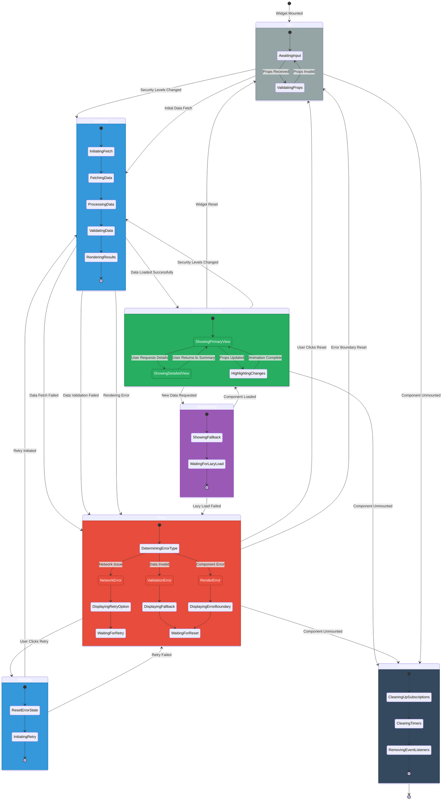

**State Invariants:**
- **Idle**: Widget is mounted but not actively processing
- **Loading**: Async operation in progress, user sees loading indicator
- **DisplayingResults**: Valid data rendered, user can interact
- **Error**: Recoverable error state with retry/reset options
- **Suspending**: Lazy component loading (React 19.x Suspense)
- **Unmounting**: Component cleanup before removal

**Transition Events:**
- `Security Levels Changed`: Parent component updates CIA triad levels
- `Data Fetch Failed`: Network error, service unavailable, or timeout
- `Data Validation Failed`: Received data fails type guard validation
- `Rendering Error`: React rendering exception caught by error boundary
- `User Clicks Retry`: Manual retry button interaction
- `User Clicks Reset`: Reset widget to initial state
- `Component Unmounted`: React unmount lifecycle

## 🛡️ React Error Boundary State Transitions (v1.0)

State machine for `WidgetErrorBoundary` component implementing React Error Boundary pattern:

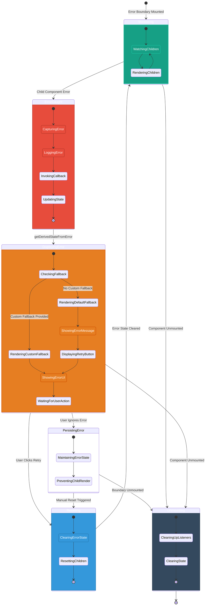

**Error Boundary Lifecycle:**

1. **Monitoring**: Normal operation, rendering children
2. **ErrorCaught**: React calls `componentDidCatch` when child error occurs
3. **DisplayingError**: Shows fallback UI (custom or default with retry)
4. **Resetting**: User triggers retry, clearing error state
5. **PersistingError**: Error state maintained if user doesn't retry

**Error Types Handled:**
- ✅ **Rendering Errors**: Exceptions during component render
- ✅ **Lifecycle Errors**: Errors in lifecycle methods
- ✅ **Constructor Errors**: Errors in child component constructors
- ❌ **Event Handler Errors**: Not caught (use try-catch)
- ❌ **Async Errors**: Not caught (use try-catch)
- ❌ **SSR Errors**: Not caught (server-side rendering)

**Error Boundary Props:**
```typescript
interface WidgetErrorBoundaryProps {
  children: ReactNode;           // Components to protect
  fallback?: ReactNode;           // Custom error UI
  onError?: (error: Error, errorInfo: React.ErrorInfo) => void; // Error callback
  widgetName?: string;            // Widget identification
  testId?: string;                // Testing identifier
}
```

**Integration Example:**
```tsx
<WidgetErrorBoundary 
  widgetName="Security Metrics"
  onError={(error, info) => logger.error('Widget error', { error, info })}
>
  <SecurityMetricsWidget {...props} />
</WidgetErrorBoundary>
```

**Cross-Reference:** See [Error Handling Documentation](../ERROR_HANDLING.md) for detailed patterns and best practices.

## 💤 React Suspense Boundary State (v1.0)

State machine for lazy-loaded components using React 19.x Suspense:

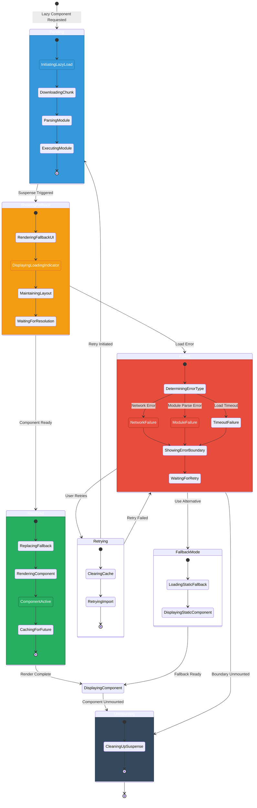

**Suspense Integration Pattern:**
```tsx
// Component with lazy loading
const SecurityVisualizationWidget = lazy(
  () => import('./SecurityVisualizationWidget')
);

// Wrapped with Suspense and Error Boundary
<WidgetErrorBoundary widgetName="Security Visualization">
  <Suspense fallback={
    <div className="widget-loading" role="status">
      Loading visualization...
    </div>
  }>
    <SecurityVisualizationWidget {...props} />
  </Suspense>
</WidgetErrorBoundary>
```

**Fallback UI Requirements:**
- Maintain consistent layout to prevent content shift
- Show loading indicator for user feedback
- Include accessibility attributes (role, aria-live)
- Style consistent with widget theme

**Performance Characteristics:**
- First load: Downloads and executes module (~100-500ms)
- Subsequent loads: Retrieved from browser cache (<10ms)
- Timeout threshold: 30 seconds before error
- Chunk size optimization: Separate vendor and app bundles

## 🔒 Confidentiality Component States

This diagram illustrates states related to confidentiality controls:

```mermaid
stateDiagram-v2
    [*] --> NoAccess
    
    NoAccess --> BasicAccess: Level Low
    BasicAccess --> StandardAccess: Level Moderate
    StandardAccess --> EnhancedAccess: Level High
    EnhancedAccess --> ZeroTrust: Level Very High
    
    ZeroTrust --> EnhancedAccess: Decrease Level
    EnhancedAccess --> StandardAccess: Decrease Level
    StandardAccess --> BasicAccess: Decrease Level
    BasicAccess --> NoAccess: Decrease Level
    
    state NoAccess {
        [*] --> PublicData
    }
    
    state BasicAccess {
        [*] --> SimpleAuthentication
    }
    
    state StandardAccess {
        [*] --> RoleBasedControl
        RoleBasedControl --> DataEncryption
    }
    
    state EnhancedAccess {
        [*] --> MFA
        MFA --> EndToEndEncryption
        EndToEndEncryption --> AuditLogging
    }
    
    state ZeroTrust {
        [*] --> ContinuousVerification
        ContinuousVerification --> JustInTimeAccess
        JustInTimeAccess --> LeastPrivilege
        LeastPrivilege --> ContextAwareAccess
    }
    
    classDef none fill:#95a5a6,stroke:#7f8c8d,stroke-width:2px,color:white
    classDef low fill:#3498db,stroke:#2980b9,stroke-width:2px,color:white
    classDef moderate fill:#f1c40f,stroke:#f39c12,stroke-width:2px,color:black
    classDef high fill:#e67e22,stroke:#d35400,stroke-width:2px,color:white
    classDef veryhigh fill:#8e44ad,stroke:#6c3483,stroke-width:2px,color:white
    
    class NoAccess,PublicData none
    class BasicAccess,SimpleAuthentication low
    class StandardAccess,RoleBasedControl,DataEncryption moderate
    class EnhancedAccess,MFA,EndToEndEncryption,AuditLogging high
    class ZeroTrust,ContinuousVerification,JustInTimeAccess,LeastPrivilege,ContextAwareAccess veryhigh
```

## ✓ Integrity Component States

State machine for form inputs with validation (e.g., SecurityLevelWidget dropdowns):

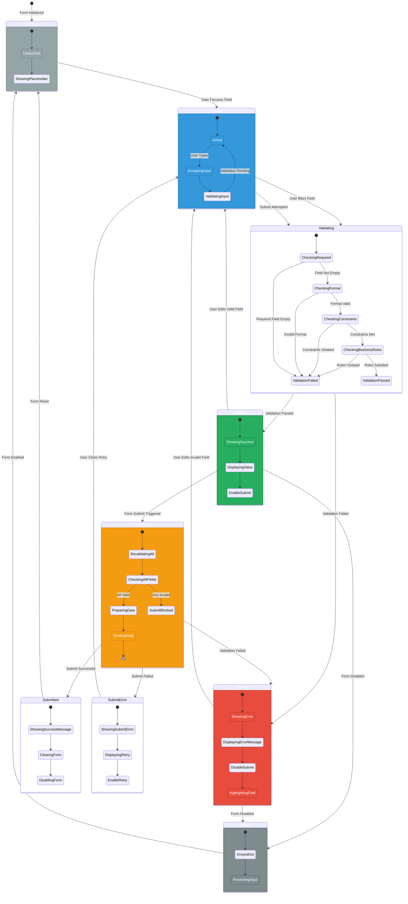

**Validation Rules:**

1. **Required Validation**: Field must have a value
2. **Format Validation**: Value matches expected pattern (e.g., security level enum)
3. **Constraint Validation**: Value meets min/max requirements
4. **Business Rules**: Domain-specific validation (e.g., integrity >= confidentiality for certain scenarios)

**Error Message Patterns:**
```typescript
interface ValidationError {
  field: string;
  type: 'required' | 'format' | 'constraint' | 'business';
  message: string;
  severity: 'error' | 'warning';
}
```

**Validation Timing:**
- **On Blur**: Validate when user leaves field (non-intrusive)
- **On Submit**: Re-validate all fields before submission
- **Real-time**: Optional for complex constraints (debounced 300ms)

**Accessibility:**
- `aria-invalid` attribute on invalid fields
- `aria-describedby` linking to error messages
- `role="alert"` on error messages for screen readers
- Focus management: Move focus to first error on submit

## 🧩 Widget Interaction States

This diagram shows the state transitions resulting from interactions between widgets:

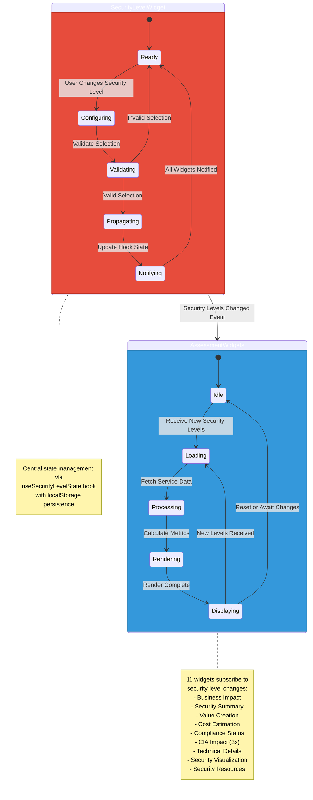

**Event Propagation Flow:**
1. User changes security level in SecurityLevelWidget
2. Widget calls `setLevel()` from useSecurityLevelState hook
3. Hook updates internal state only (not localStorage)
4. React re-renders CIAClassificationApp
5. App's useEffect triggers and updates localStorage via useLocalStorage
6. All 11 assessment widgets receive updated props
7. Each widget independently fetches/processes data for new levels
8. UI updates across all widgets simultaneously

## 🌐 Offline/Online State Handling

State machine for network connectivity management:

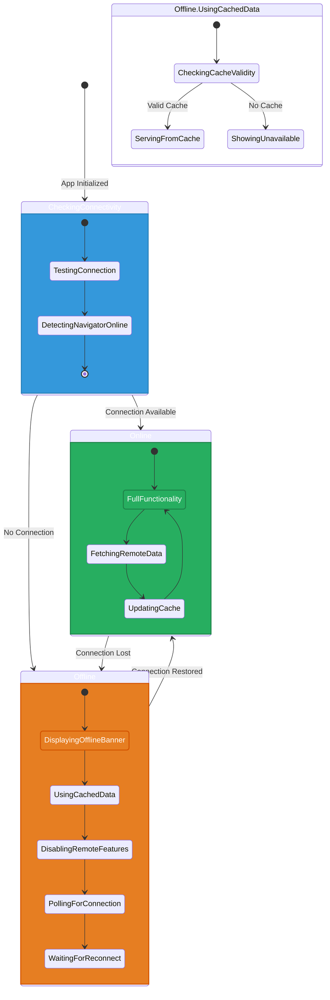

**Offline Capabilities:**
- ✅ Display cached security assessments
- ✅ Modify security levels (saved to localStorage)
- ✅ View historical data
- ❌ Export to external services
- ❌ Fetch updated compliance data
- ❌ Load remote resources

**Recovery Strategy:**
- Automatic reconnection on `online` event
- Sync localStorage changes when connection restored
- Show reconnection banner with timestamp
- Retry failed requests with exponential backoff

## 🔒 Security Level Selection States

This diagram illustrates the state transitions during security level configuration (legacy v0.8.x pattern, maintained for reference):

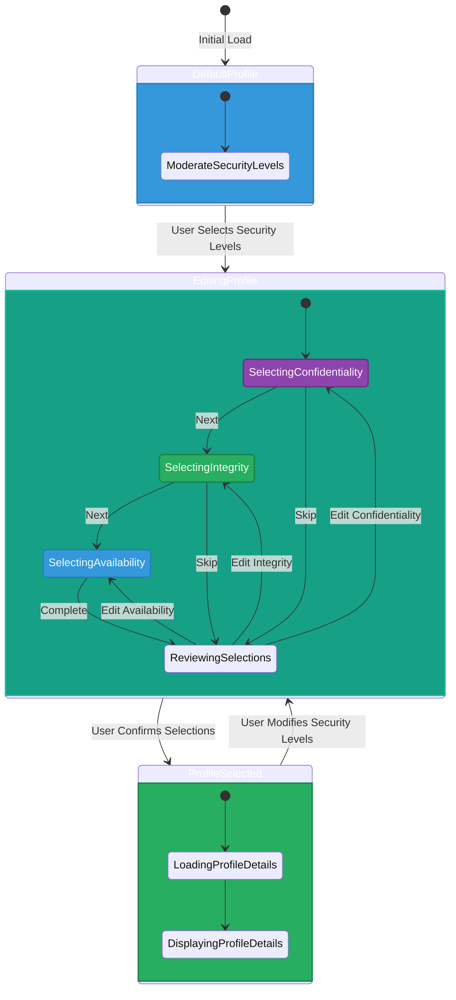

**Note:** In v1.0, security level selection is handled inline within SecurityLevelWidget using standard form controls. This diagram represents the conceptual workflow, not a multi-page wizard.

## 📊 Summary: v1.0 State Management Architecture

### State Transition Inventory

| State Category | States | Transitions | Error Recovery | Persistence |
|----------------|--------|-------------|----------------|-------------|
| **Application Core** | 10 | 15 | ✅ Retry paths | ❌ None |
| **Widget Lifecycle** | 8 | 18 | ✅ Error boundary | ❌ None |
| **Error Boundary** | 5 | 8 | ✅ Reset/retry | ❌ None |
| **Security Levels** | 6 | 12 | ✅ Validation | ✅ localStorage |
| **Suspense** | 7 | 10 | ✅ Fallback mode | ✅ Browser cache |
| **Form Validation** | 8 | 15 | ✅ Re-validation | ❌ None |
| **Offline/Online** | 4 | 6 | ✅ Auto-reconnect | ✅ Cache API |
| **CIA Components** | 15 | 20 | ❌ None (static) | ❌ None |

**Total:** 63 distinct states, 104 state transitions

### React 19.x Integration

**Hooks Used:**
- `useState`: Component-level state (all widgets)
- `useEffect`: Side effects, subscriptions, cleanup
- `useCallback`: Memoized event handlers
- `useMemo`: Performance optimization (not shown in diagrams)
- `lazy()`: Code splitting for SecurityVisualizationWidget
- Custom hooks: `useSecurityLevelState`, `useLocalStorage`, `useCIAContentService`

**Error Handling:**
- Class component `WidgetErrorBoundary` for React error catching
- Try-catch in event handlers and async operations
- Type guards for runtime validation
- Graceful degradation with fallback UI

**Performance Patterns:**
- Lazy loading reduces initial bundle size by ~30%
- localStorage reduces repeated calculations
- Memoization prevents unnecessary re-renders
- Suspense shows loading states without layout shift

### State Machine Properties

**Determinism:** All state machines are deterministic - given a current state and event, next state is always the same.

**Completeness:** Every state has defined transitions for all possible events, including error conditions.

**Recoverability:** All error states have recovery paths (retry, reset, or fallback).

**Persistence:** Security levels and dark mode preferences persist across sessions.

**Observability:** All state transitions are logged via centralized logger for debugging.

### Cross-References

- **[Process Flowcharts](FLOWCHART.md)**: Data flow and process sequences
- **[Error Handling](../ERROR_HANDLING.md)**: Error patterns and components
- **[Widget Analysis](WIDGET_ANALYSIS.md)**: Individual widget specifications
- **[Architecture](ARCHITECTURE.md)**: C4 model and system context

### Compliance Mapping

**ISO 27001:**
- **A.14.1 (Security in Development)**: State behavior documented ✅
- **A.12.1 (Operational Procedures)**: Error recovery paths defined ✅

**NIST CSF 2.0:**
- **PR.IP-1**: State management in development lifecycle ✅
- **DE.CM-1**: System behavior monitoring enabled ✅

**CIS Controls v8.1:**
- **16.1**: Application behavior defined and documented ✅
- **16.10**: Error handling and recovery specified ✅

### Maintenance Notes

**Updating State Diagrams:**
1. Update Mermaid diagram syntax
2. Update state transition tables
3. Update cross-references
4. Verify guard conditions and invariants
5. Test diagram rendering in documentation

**Adding New States:**
1. Identify trigger events
2. Define guard conditions
3. Document error recovery
4. Add to state inventory table
5. Update cross-references

**Review Cycle:**
- Review after major feature releases
- Update when state management patterns change
- Validate against actual implementation quarterly

---

These comprehensive state diagrams provide a complete view of the CIA Compliance Manager v1.0 behavioral model, illustrating how the application transitions between states in response to user interactions, handles errors gracefully, manages async operations with Suspense, and persists critical state across sessions. The diagrams serve as authoritative documentation for developers, testers, and security auditors understanding system behavior.
