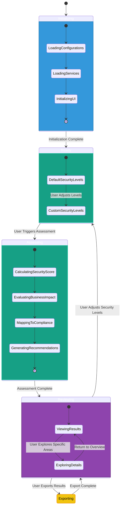
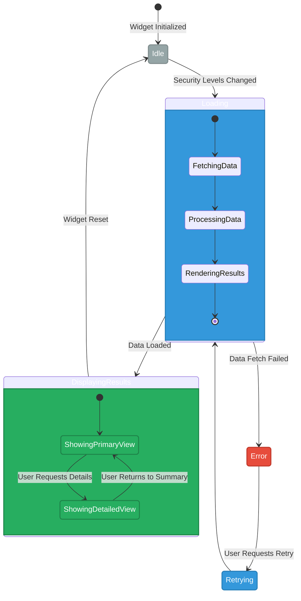
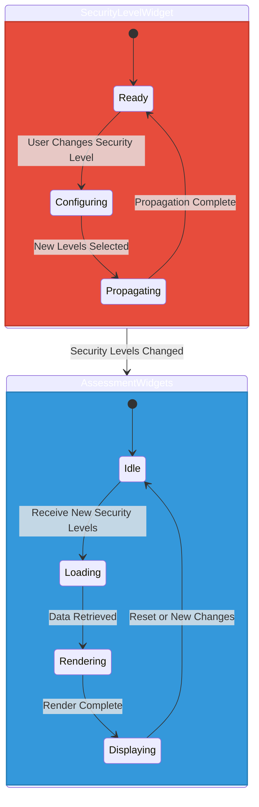

# 🔄 CIA Compliance Manager State Diagrams

This document illustrates the key state transitions and behavioral models of the CIA Compliance Manager application, showing how the system responds to user interactions and processes security assessments.

## 📚 Related Documentation

| Document                                          | Focus           | Description                               |
| ------------------------------------------------- | --------------- | ----------------------------------------- |
| **[Architecture](ARCHITECTURE.md)**               | 🏗️ Architecture | C4 model showing system structure         |
| **[Process Flowcharts](FLOWCHART.md)**            | 🔄 Process      | Security assessment workflows             |
| **[System Architecture](SYSTEM_ARCHITECTURE.md)** | 🏛️ System       | Layered architecture and component details |
| **[Widget Analysis](WIDGET_ANALYSIS.md)**         | 🧩 Components   | Detailed widget component analysis        |

## 🔍 Application Core States

The diagram below shows the main application states and transitions between them:

## 🔒 Security Level Selection States

This diagram illustrates the state transitions during security level configuration:

## 📊 Assessment Widget States

The state diagram for assessment widgets shows how they respond to security level changes:

## 🧩 Widget Interaction States

This diagram shows the state transitions resulting from interactions between widgets:

## 🔒 Confidentiality Component States

This diagram illustrates states related to confidentiality controls:

## ✓ Integrity Component States

This diagram illustrates states related to integrity controls:

```mermaid
stateDiagram-v2
    [*] --> NoValidation
    
    NoValidation --> BasicValidation: Level Low
    BasicValidation --> StandardValidation: Level Moderate
    StandardValidation --> EnhancedValidation: Level High
    EnhancedValidation --> FormalVerification: Level Very High
    
    FormalVerification --> EnhancedValidation: Decrease Level
    EnhancedValidation --> StandardValidation: Decrease Level
    StandardValidation --> BasicValidation: Decrease Level
    BasicValidation --> NoValidation: Decrease Level
    
    state NoValidation {
        [*] --> NoControls
    }
    
    state BasicValidation {
        [*] --> ManualChecks
    }
    
    state StandardValidation {
        [*] --> AutomatedValidation
        AutomatedValidation --> ErrorHandling
    }
    
    state EnhancedValidation {
        [*] --> CryptographicVerification
        CryptographicVerification --> DataSignatures
        DataSignatures --> ImmutableLogging
    }
    
    state FormalVerification {
        [*] --> BlockchainValidation
        BlockchainValidation --> ZeroKnowledgeProofs
        ZeroKnowledgeProofs --> FormalMethodVerification
    }
    
    classDef none fill:#95a5a6,stroke:#7f8c8d,stroke-width:2px,color:white
    classDef low fill:#3498db,stroke:#2980b9,stroke-width:2px,color:white
    classDef moderate fill:#f1c40f,stroke:#f39c12,stroke-width:2px,color:black
    classDef high fill:#e67e22,stroke:#d35400,stroke-width:2px,color:white
    classDef veryhigh fill:#27ae60,stroke:#1e8449,stroke-width:2px,color:white
    
    class NoValidation,NoControls none
    class BasicValidation,ManualChecks low
    class StandardValidation,AutomatedValidation,ErrorHandling moderate
    class EnhancedValidation,CryptographicVerification,DataSignatures,ImmutableLogging high
    class FormalVerification,BlockchainValidation,ZeroKnowledgeProofs,FormalMethodVerification veryhigh
```

## ⏱️ Availability Component States

This diagram illustrates states related to availability controls:

```mermaid
stateDiagram-v2
    [*] --> NoAvailability
    
    NoAvailability --> BasicAvailability: Level Low
    BasicAvailability --> StandardAvailability: Level Moderate
    StandardAvailability --> EnhancedAvailability: Level High
    EnhancedAvailability --> ContinuousAvailability: Level Very High
    
    ContinuousAvailability --> EnhancedAvailability: Decrease Level
    EnhancedAvailability --> StandardAvailability: Decrease Level
    StandardAvailability --> BasicAvailability: Decrease Level
    BasicAvailability --> NoAvailability: Decrease Level
    
    state NoAvailability {
        [*] --> NoSLA
    }
    
    state BasicAvailability {
        [*] --> MinimalUptime
        MinimalUptime --> BasicBackup
    }
    
    state StandardAvailability {
        [*] --> DefinedSLA
        DefinedSLA --> RegularBackups
        RegularBackups --> IncidentResponse
    }
    
    state EnhancedAvailability {
        [*] --> HighAvailabilitySystem
        HighAvailabilitySystem --> DisasterRecovery
        DisasterRecovery --> AutomatedFailover
    }
    
    state ContinuousAvailability {
        [*] --> MultiRegionDeployment
        MultiRegionDeployment --> RealTimeFailover
        RealTimeFailover --> SelfHealingSystems
    }
    
    classDef none fill:#95a5a6,stroke:#7f8c8d,stroke-width:2px,color:white
    classDef low fill:#3498db,stroke:#2980b9,stroke-width:2px,color:white
    classDef moderate fill:#f1c40f,stroke:#f39c12,stroke-width:2px,color:black
    classDef high fill:#e67e22,stroke:#d35400,stroke-width:2px,color:white
    classDef veryhigh fill:#2980b9,stroke:#2471a3,stroke-width:2px,color:white
    
    class NoAvailability,NoSLA none
    class BasicAvailability,MinimalUptime,BasicBackup low
    class StandardAvailability,DefinedSLA,RegularBackups,IncidentResponse moderate
    class EnhancedAvailability,HighAvailabilitySystem,DisasterRecovery,AutomatedFailover high
    class ContinuousAvailability,MultiRegionDeployment,RealTimeFailover,SelfHealingSystems veryhigh
```

These state diagrams provide a comprehensive view of the CIA Compliance Manager's behavioral model, illustrating how the application transitions between states in response to user interactions and security level changes.
